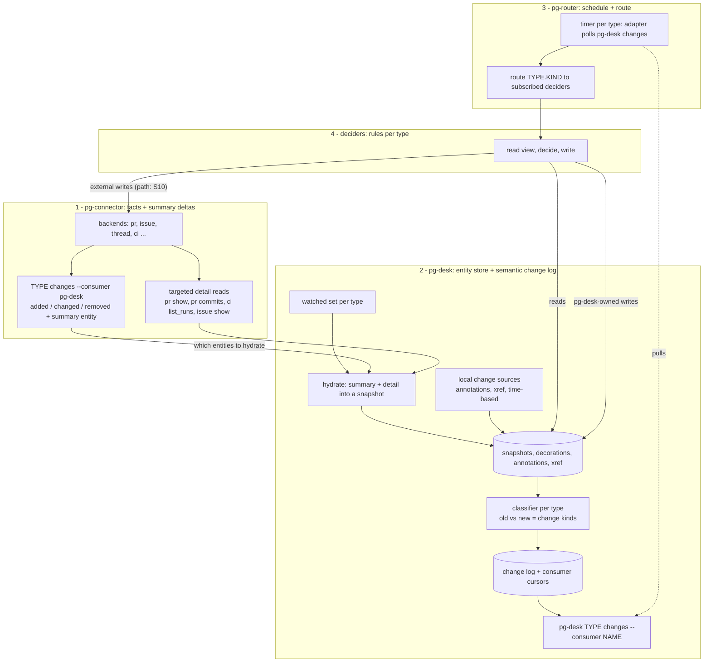

# Entity change flow: pg-connector → pg-desk → pg-router → deciders — design

- **Date**: 2026-09-29.
- **Status**: Approved (operator, 2026-09-29, recorded on `pg2-2j5ac.51`). The approval and the
  decisions in section 3 are recorded in ADR 0077 (`docs/adr/0077-entity-change-flow.md`), which
  amends the 2026-09-09 design (`2026-09-09-pg-desk-and-connector-discovery-design.md`) D8 and the
  sync part of D9 — D7 and D10 still hold. The two operator design questions this design had left
  open, Q-A (what records PR work-item links) and Q-B (how person-closed work is told from
  agent-closed), were answered by the operator (Phillip) on 2026-09-29 in `pg2-2j5ac.52.1` and are
  recorded as decision log rows S25 and S26; rows S27 (exit codes) and S28 (mergeability in the
  summary) record two further operator rulings from the same day. Follow-up `pg2-2j5ac.52.2.2`
  wrote all four into this design and into ADR 0077. Amended 2026-10-03 (bead `pg2-kftf9.12`):
  section 9.1a adds the read-only `pg-connector pr review pending <id>` contract. This design governs `pg2-2j5ac.46`
  (`2026-09-23-pg-desk-generic-entity-pipeline-design.md`) where they overlap (decision log row
  S23; migration step 0). Per this repo's citation conventions, `docs/superpowers/specs/` files
  (including this one, and `.46`) are not durable citation targets — the ADR is.
- **Markers**: **Decided** = recorded in the decision log with a date and rationale (section 3);
  **Recommended** = the design's own recommendation, accepted but not itself a separate operator
  ruling. Every question this design raised has a recorded decision (section 3). A glossary of
  terms used throughout is section 15.

## 1. Purpose and problem

pg-desk is a caching/decorating console layer over pg-connector supporting many entity types
(PRs, issues, threads, later others). Agent work (reviews, feedback triage, fixes) is triggered
by changes to those entities.

Today that is wired the other way round and is PR-centric:

- pg-router's sources call `pg-connector <type> changes` and then tell pg-desk to ingest
  (`pg-desk run pr|issue|thread`), so change detection happens before the layer that holds the
  decorations, annotations and cross-entity links.
- pg-desk's `sync` stage (`packages/pg-desk/internal/sync/`, live with `sync.mode = "apply"`)
  decides and writes beads inside the ingest process and keeps a private `ledger` table of what it
  minted. Decision, I/O and a private copy of work state are entangled; a decision cannot be
  previewed per entity or tested without the pipeline.
- The contract between those bead writes and pg-router's role prompts (title prefixes, labels,
  metadata keys) is implicit.
- pg-connector's `schema.PR` (`pkg/schema/pr.go`) has `head_sha`, `mergeable`,
  `merge_state_status` and `checks_rollup`, and `changes` hashes the whole summary. The list query
  fills `head_sha` and `checks_rollup`, so pushes and CI changes are already detected; it never
  selected `mergeable` or `merge_state_status` (fact correction, S28), so a conflict change was
  not. The summary lacks `updated_at`, a stable backend id, and any review/comment signal, so new
  comments and reviews are missed.
- The review role still posts through `pg-pr review submit`; pg-connector has no review write verb.

## 2. Goals and non-goals

**Goals**

- G1. The flow MUST be generic across entity types; PR is one type among several.
- G2. pg-connector MUST detect most changes itself, from summary-level deltas.
- G3. pg-desk MUST hold the current snapshot of every watched entity and MUST produce a semantic
  change log covering connector-detected and locally-originated changes.
- G4. pg-router MUST remain the only scheduler; its core MUST stay generic (ADR 0065).
- G5. Decisions about what work should exist MUST live in deciders, outside pg-desk, pg-connector
  and pg-router's core. pg-desk MUST NOT decide.
- G6. Deciders MUST be idempotent: re-running on an unchanged view MUST produce no writes.
- G7. For any entity, a user MUST be able to see what the deciders would do next and why, without
  writing anything.
- G8. The flow MUST NOT depend on pg-pr.

**Non-goals**

- Redesigning role prompts beyond what the interface change forces.
- The final top-level CLI grouping beyond `pg-desk <type> <verb>`.
- Final values for tunables (section 8.4 gives defaults).

### Architecture overview



| Component       | Owns                                                                                                                                           | MUST NOT                                                                             |
| --------------- | ---------------------------------------------------------------------------------------------------------------------------------------------- | ------------------------------------------------------------------------------------ |
| pg-connector    | talking to external systems; summary-level `changes` with per-consumer cursors; targeted detail reads; external writes                         | hold decorations, cross-entity links or workflow rules; know its consumers           |
| pg-desk         | watched set; hydration; snapshots; decorations; annotations; xref; per-type classifiers; change log with per-consumer cursors; composite views | decide what work should exist; know pg-router's event format or which deciders exist |
| source adapter  | translating pg-desk's envelope into pg-router items (9.4)                                                                                      | add or drop records; decide anything                                                 |
| pg-router core  | timers; durable queue; routing `TYPE.KIND` items to roles                                                                                      | name any concrete tool or entity rule (ADR 0065)                                     |
| deciders        | per-type rules; `plan`; `apply`; the work-item contract                                                                                        | keep their own cache of entity state                                                 |
| pg-router roles | executing work items                                                                                                                           | decide which work items exist                                                        |

Dependency direction is one-way: deciders → pg-desk and pg-connector; pg-desk → pg-connector;
pg-router → adapter → pg-desk; pg-router → deciders. pg-desk depends on neither pg-router nor
deciders.

Patterns: pg-connector is a **Facade + Strategy** over backends. pg-desk is the **read side of
CQRS** with a **Transactional Outbox** (the change log); hydration and classification are each a
**Strategy per entity type**. The pg-desk → pg-router hand-off is **Event Notification** (records
are hints; state is read separately), bridged by an **Adapter**. Each decider is a **Reconciler**
built as **Functional Core, Imperative Shell** (pure `decide`; `plan` and `apply` are two shells).

### Where new logic goes

Place a new piece of logic by asking these questions in order. The first "yes" decides.

1. **Is it a new external data source or a new write VERB** (a field the backend can supply, a way
   to submit a review)? That is mechanism: extend pg-connector. Deciding WHEN to use a verb is not
   this question; that is question 3.
2. **Is it a fact derived from data pg-desk already holds** (snapshot, links, annotations), with no
   side effect? It is a **decoration**: extend the type's interpreter. A decoration MUST be
   deterministic, cheap and free of LLM calls, because it is recomputed on every hydration. If
   instead it is a _change kind_ to emit (a transition between two snapshots), extend the type's
   classifier (6.4) or add a local change source (6.5). pg-desk MUST NOT decide.
3. **Does it cause a work item, label, annotation or external write to be created, changed or
   closed?** It is a **decision**: add a rule to the type's decider (7.9), which runs as a pg-router
   command role. It MUST be idempotent (G6) and MUST read pg-desk's composite view rather than keep
   its own cache. It never belongs in pg-desk or in pg-router's core (G5, ADR 0065).
4. **Does it require an agent to act on an existing work item** (review, fix, resolve)? It is an
   **agent role** prompt. A decider still decides that the work item exists.
5. **Is it a new poll, timer or re-check cadence?** It is pg-router configuration (8.3). pg-router
   is the only scheduler (G4); neither pg-desk nor a decider starts its own.
6. **Is it translation between pg-desk's envelope and pg-router's item format?** It belongs in the
   source adapter (9.4), which MUST NOT add, drop or decide anything.

Two consequences follow. A signal that genuinely requires an LLM MUST NOT become a decoration; it
belongs in a role, which MAY write its result back as an annotation for `show` to display.
Cross-entity judgment that chooses an outcome (for example daily-focus ranking) is a decision, not
a decoration. An entity type with no decider is still watched, hydrated and classified (7.10).

> Amended 2026-10-06 (ADR 0087): the same cross-entity judgment expressed as a read-only,
> side-effect-free view over stored facts, which writes nothing and mints no work, is a view that
> lives in pg-desk (as attention does, ADR 0081). The daily-focus rank is such a view; minting a
> bead for an item the operator selected is the decision, and stays in a decider.

## 3. Decision log

Every decision this design depends on, merged into one log. **Operator ruling** rows were
confirmed by the operator in session; **Derived** rows follow mechanically from an already-decided
goal, invariant or fact and are recorded here for traceability rather than re-argued; **Fact
correction** rows correct a claim against verified code, not a decision at all.

| #   | Decision                                                                                                                                                                                                                                                                                                                                                                                                                                                                                                                                                                                                                                                                                                                                                                                                                                                                                                                                                                                                                                                                                                                        | Decided by / derived from                                                                                                                                               | Date                       | Why                                                                                                                                                                                                                                                                                                                                                                                                                                                                                                                                                                                                                                                                                                                                                                                                                                                                                                                     |
| --- | ------------------------------------------------------------------------------------------------------------------------------------------------------------------------------------------------------------------------------------------------------------------------------------------------------------------------------------------------------------------------------------------------------------------------------------------------------------------------------------------------------------------------------------------------------------------------------------------------------------------------------------------------------------------------------------------------------------------------------------------------------------------------------------------------------------------------------------------------------------------------------------------------------------------------------------------------------------------------------------------------------------------------------------------------------------------------------------------------------------------------------- | ----------------------------------------------------------------------------------------------------------------------------------------------------------------------- | -------------------------- | ----------------------------------------------------------------------------------------------------------------------------------------------------------------------------------------------------------------------------------------------------------------------------------------------------------------------------------------------------------------------------------------------------------------------------------------------------------------------------------------------------------------------------------------------------------------------------------------------------------------------------------------------------------------------------------------------------------------------------------------------------------------------------------------------------------------------------------------------------------------------------------------------------------------------- |
| S1  | pg-desk is a caching/decorating layer over pg-connector, multi-entity from the start.                                                                                                                                                                                                                                                                                                                                                                                                                                                                                                                                                                                                                                                                                                                                                                                                                                                                                                                                                                                                                                           | Operator, in session                                                                                                                                                    | 2026-09-25, restated 09-29 | Generalizes pg-desk beyond "pg-pr's replacement" so G1 holds from day one, not as a later retrofit.                                                                                                                                                                                                                                                                                                                                                                                                                                                                                                                                                                                                                                                                                                                                                                                                                     |
| S2  | Decisions move out of pg-desk into deciders; deciders read through pg-desk.                                                                                                                                                                                                                                                                                                                                                                                                                                                                                                                                                                                                                                                                                                                                                                                                                                                                                                                                                                                                                                                     | Operator, in session                                                                                                                                                    | 2026-09-28                 | Enforces G5 (pg-desk MUST NOT decide) and makes a decision independently testable and previewable (G7) without running the ingest pipeline.                                                                                                                                                                                                                                                                                                                                                                                                                                                                                                                                                                                                                                                                                                                                                                             |
| S3  | A dry-run `plan` lives on the decider CLI, not on pg-desk.                                                                                                                                                                                                                                                                                                                                                                                                                                                                                                                                                                                                                                                                                                                                                                                                                                                                                                                                                                                                                                                                      | Operator, in session                                                                                                                                                    | 2026-09-28                 | pg-desk has no rule knowledge to preview (S2); `plan` is a decider-owned view of its own rules (7.2).                                                                                                                                                                                                                                                                                                                                                                                                                                                                                                                                                                                                                                                                                                                                                                                                                   |
| S4  | pg-router's timer polls pg-desk for changes; pg-desk returns one event per changed entity with its change kinds; events route to deciders.                                                                                                                                                                                                                                                                                                                                                                                                                                                                                                                                                                                                                                                                                                                                                                                                                                                                                                                                                                                      | Operator, in session                                                                                                                                                    | 2026-09-29                 | Keeps pg-router the sole scheduler (G4) while pg-desk stays the sole source of semantic change information (G3).                                                                                                                                                                                                                                                                                                                                                                                                                                                                                                                                                                                                                                                                                                                                                                                                        |
| S5  | pg-connector implementations produce most deltas; pg-desk adds changes they cannot see.                                                                                                                                                                                                                                                                                                                                                                                                                                                                                                                                                                                                                                                                                                                                                                                                                                                                                                                                                                                                                                         | Operator, in session                                                                                                                                                    | 2026-09-29                 | Realizes G2 without duplicating detection logic pg-connector already gets cheaply from summary fields (5.1).                                                                                                                                                                                                                                                                                                                                                                                                                                                                                                                                                                                                                                                                                                                                                                                                            |
| S6  | `pg-desk changes` pulls fresh data from pg-connector by default; pg-router stays the only clock.                                                                                                                                                                                                                                                                                                                                                                                                                                                                                                                                                                                                                                                                                                                                                                                                                                                                                                                                                                                                                                | Operator, in session                                                                                                                                                    | 2026-09-29                 | Avoids a second polling clock inside pg-desk (G4) while still letting an operator force a fresh read on demand (STORY-OP-2's `--refresh`).                                                                                                                                                                                                                                                                                                                                                                                                                                                                                                                                                                                                                                                                                                                                                                              |
| S7  | Events carry a reference and change kinds, not the full entity; deciders read the snapshot from pg-desk.                                                                                                                                                                                                                                                                                                                                                                                                                                                                                                                                                                                                                                                                                                                                                                                                                                                                                                                                                                                                                        | Operator, in session                                                                                                                                                    | 2026-09-29                 | Keeps the change feed small and single-sourced — the entity's current truth lives in exactly one place (the store), never duplicated into the event payload.                                                                                                                                                                                                                                                                                                                                                                                                                                                                                                                                                                                                                                                                                                                                                            |
| S8  | The sweep MUST NOT replay everything; a duration-based approach replaces `--full`.                                                                                                                                                                                                                                                                                                                                                                                                                                                                                                                                                                                                                                                                                                                                                                                                                                                                                                                                                                                                                                              | Operator, in session                                                                                                                                                    | 2026-09-29                 | Bounds the cost of catching missed events and rule changes (8.4) without a full-replay storm on every poll.                                                                                                                                                                                                                                                                                                                                                                                                                                                                                                                                                                                                                                                                                                                                                                                                             |
| S9  | There may be deciders for every entity type.                                                                                                                                                                                                                                                                                                                                                                                                                                                                                                                                                                                                                                                                                                                                                                                                                                                                                                                                                                                                                                                                                    | Operator, in session                                                                                                                                                    | 2026-09-29                 | Keeps the decider contract (7.1) generic across types (G1); day one still ships only PR rules (S20).                                                                                                                                                                                                                                                                                                                                                                                                                                                                                                                                                                                                                                                                                                                                                                                                                    |
| S10 | Decider external writes go DIRECTLY to pg-connector, then `pg-desk <type> refresh <id>`. pg-desk is not a write-through repository for external systems; pg-desk-owned data (annotations, decider state) is still written to pg-desk.                                                                                                                                                                                                                                                                                                                                                                                                                                                                                                                                                                                                                                                                                                                                                                                                                                                                                           | Operator ruling                                                                                                                                                         | 2026-09-29                 | A write-through repository would make pg-desk re-implement every backend's write path pg-connector already has; a direct write plus refresh keeps pg-desk's contract (hold snapshots, decide nothing) and costs one extra call per decider write (7.4).                                                                                                                                                                                                                                                                                                                                                                                                                                                                                                                                                                                                                                                                 |
| S11 | Breaking contract changes ship as one coordinated cutover, no dual-version serving: every component is deployed together by the same home-manager apply.                                                                                                                                                                                                                                                                                                                                                                                                                                                                                                                                                                                                                                                                                                                                                                                                                                                                                                                                                                        | Derived, from the deployment topology                                                                                                                                   | 2026-09-29                 | pg-connector, pg-desk, pg-router and the deciders all ship through one apply, so no independent-rollout path ever needs two contract versions served at once; the additive-change rule already in section 9's preamble is the only versioning policy this needs.                                                                                                                                                                                                                                                                                                                                                                                                                                                                                                                                                                                                                                                        |
| S12 | Advance the cursor after flush plus an age-based sweep; no explicit ack.                                                                                                                                                                                                                                                                                                                                                                                                                                                                                                                                                                                                                                                                                                                                                                                                                                                                                                                                                                                                                                                        | Derived, from G6 and 8.2's duplicate-tolerance requirement                                                                                                              | 2026-09-29                 | Deciders are idempotent (G6) and consumers already tolerate duplicates/reordering (8.2); the sweep (8.4) already bounds the loss window, no user story needs faster-than-sweep recovery, and STORY-OP-7's `--reset` covers "I need this now." An ack protocol would buy correctness this design does not need.                                                                                                                                                                                                                                                                                                                                                                                                                                                                                                                                                                                                          |
| S13 | Own PRs (mine/co-owned) get BOTH `fix-ci` and `resolve-conflict` work kinds, labeled `worker-ready` so the worker role acts on them; `anchor.priority`'s conflict nudge stays.                                                                                                                                                                                                                                                                                                                                                                                                                                                                                                                                                                                                                                                                                                                                                                                                                                                                                                                                                  | Operator ruling                                                                                                                                                         | 2026-09-29                 | The ZR deployment set's `JOURNEY-ZR-7` requires the worker role to iterate until CI is green, but the worker only consumes `worker-ready` work items; with neither kind existing, nothing ever produced that work.                                                                                                                                                                                                                                                                                                                                                                                                                                                                                                                                                                                                                                                                                                      |
| S14 | Ready-to-land is an annotation, never a work item.                                                                                                                                                                                                                                                                                                                                                                                                                                                                                                                                                                                                                                                                                                                                                                                                                                                                                                                                                                                                                                                                              | Derived, from the landing gate                                                                                                                                          | 2026-09-29                 | The ZR deployment set's `INV-GOV-4`/`INV-GOV-5` forbid any agent-reachable merge path and require the operator's own, non-self-grantable permission to land. A work item is something a role can act on; making "ready to land" one would hand a worker role exactly the merge-adjacent job the gate exists to keep out of its reach.                                                                                                                                                                                                                                                                                                                                                                                                                                                                                                                                                                                   |
| S15 | `hide` stops ALL decider actions on that entity until unhidden; `wip` stays view-only.                                                                                                                                                                                                                                                                                                                                                                                                                                                                                                                                                                                                                                                                                                                                                                                                                                                                                                                                                                                                                                          | Operator ruling                                                                                                                                                         | 2026-09-29                 | Differs from current behavior (citation: 7.3's precedence step 1). An operator hiding something expects it to stop, not merely to stop appearing in `open`.                                                                                                                                                                                                                                                                                                                                                                                                                                                                                                                                                                                                                                                                                                                                                             |
| S16 | Team PRs get only an operator-pending review; `process-feedback` cycles are gated to mine/co-owned PRs.                                                                                                                                                                                                                                                                                                                                                                                                                                                                                                                                                                                                                                                                                                                                                                                                                                                                                                                                                                                                                         | Derived, from `JOURNEY-ZR-8` plus the feedback consumer's own filter                                                                                                    | 2026-09-29                 | `JOURNEY-ZR-8` says a teammate's PR is never modified beyond the draft review, but a feedback cycle leads to worker commits — an edit path that forbids. The feedback-cycle consumer also only ever reads `mine`-labelled cycles, so today's ungated team-PR cycles are already inert. Differs from current behavior — see 7.3's `feedback.digest-changed` row for the citation; a documented parity exception the migration parity check (12, 14) MUST list.                                                                                                                                                                                                                                                                                                                                                                                                                                                           |
| S17 | Decider packaging is an implementer choice; RECOMMENDED: one binary with a rule registry selected by `<type>`.                                                                                                                                                                                                                                                                                                                                                                                                                                                                                                                                                                                                                                                                                                                                                                                                                                                                                                                                                                                                                  | Derived, from avoiding N copies of shared plumbing                                                                                                                      | 2026-09-29                 | The read/apply/audit plumbing (7.1, 7.4, 7.6) is identical across types; one binary needs it written once. A registry keyed by `<type>` still lets a type's rule set be added without touching another's.                                                                                                                                                                                                                                                                                                                                                                                                                                                                                                                                                                                                                                                                                                               |
| S18 | The only day-one time-based change source is thread `resolved` (no reply within `watch.thread.active_window`); others are added only when a story needs one.                                                                                                                                                                                                                                                                                                                                                                                                                                                                                                                                                                                                                                                                                                                                                                                                                                                                                                                                                                    | Derived, from minimality                                                                                                                                                | 2026-09-29                 | No user story (section 4) needs a different time-based signal yet, and `active_window` (6.1, 9.10) already exists for exactly this one.                                                                                                                                                                                                                                                                                                                                                                                                                                                                                                                                                                                                                                                                                                                                                                                 |
| S19 | Add a stable backend id (`node_id`) to pg-connector's `schema.PR`; deciders key dedup/adoption matching on it when present.                                                                                                                                                                                                                                                                                                                                                                                                                                                                                                                                                                                                                                                                                                                                                                                                                                                                                                                                                                                                     | Derived, from a precedent already in the GitHub backend                                                                                                                 | 2026-09-29                 | The GitHub backend already fetches `NodeID` for comments and reviews (`cmd/pg-connector-pr-github/internal/github/github.go`); extending the same field to the PR object itself is a small, precedented addition, and a stable id survives a repo rename or transfer where `<repo>#<n>` does not.                                                                                                                                                                                                                                                                                                                                                                                                                                                                                                                                                                                                                       |
| S20 | No issue or thread decider ships on day one.                                                                                                                                                                                                                                                                                                                                                                                                                                                                                                                                                                                                                                                                                                                                                                                                                                                                                                                                                                                                                                                                                    | Derived, from S9's "may," not "must"                                                                                                                                    | 2026-09-29                 | Today's issue/thread roles only re-interpret linked PRs; S9 permits per-type deciders without requiring them, and no story yet motivates independent issue/thread rules. pg-desk still watches, hydrates and logs issues/threads regardless (6.1, 7.10).                                                                                                                                                                                                                                                                                                                                                                                                                                                                                                                                                                                                                                                                |
| S21 | Keep the `merge-request` anchor.                                                                                                                                                                                                                                                                                                                                                                                                                                                                                                                                                                                                                                                                                                                                                                                                                                                                                                                                                                                                                                                                                                | Derived, from the worker prompt's own resolution path plus the journeys' tracking-object requirement                                                                    | 2026-09-29                 | The worker prompt resolves a PR via its parent anchor's metadata, and the ZR deployment set's journeys need a claimable per-PR tracking object that pre-exists any specific work kind (`INV-TRACK-1`); dropping the anchor would push that identity data onto every child kind redundantly, with no single parent to hang from (7.3).                                                                                                                                                                                                                                                                                                                                                                                                                                                                                                                                                                                   |
| S22 | pg-router binds match by exact string equality; there is no `pr.*` wildcard.                                                                                                                                                                                                                                                                                                                                                                                                                                                                                                                                                                                                                                                                                                                                                                                                                                                                                                                                                                                                                                                    | Fact correction, verified against code                                                                                                                                  | 2026-09-29                 | `packages/pg-router/internal/orchestrator/listener.go`'s `Matches` does `b == evt.Type`, and `internal/config/config.go`'s orphan checks compare emitted/bound strings the same way — a wildcard bind would silently match nothing. Every source's `emits` and every role's `binds` MUST list each `<type>.<kind>` explicitly (8.3, 9.9).                                                                                                                                                                                                                                                                                                                                                                                                                                                                                                                                                                               |
| S23 | This design governs `pg2-2j5ac.46` where they overlap: it owns triggering (pull-through `changes`), decisions (deciders) and the composite-view contract. `.46` keeps its generic gather/interpret core for issues (its D-G1..D-G5; D-G8 scoped to targeted `refresh`); its PR Adapter (D-G2) is this design's PR hydration strategy; its `run issue` fallthrough (D-G6), `sync.KnownLedgerKinds` (D-G7) and implicit keep-`sync` are struck. Raw payloads MAY be stored, but the composite view (9.5) serves typed `schema.*` snapshots.                                                                                                                                                                                                                                                                                                                                                                                                                                                                                                                                                                                       | Operator ruling ("A: amend .46")                                                                                                                                        | 2026-09-29                 | `.46` predates the pull-through/decider split and assumed today's `sync`/`run` triggering; most of its content is exactly the issue hydration this design needs, so only its triggering and ledger parts conflict. The `.46`, `.48` and `.27` bead bodies were amended with this ruling the same day; `.27`'s focus `sync` step becomes a focus decider.                                                                                                                                                                                                                                                                                                                                                                                                                                                                                                                                                                |
| S24 | The anchor always mirrors the PR: if a person closes the anchor while the PR is open, `all.reopened` reopens it. To stop work on a PR, the operator uses `hide` (S15).                                                                                                                                                                                                                                                                                                                                                                                                                                                                                                                                                                                                                                                                                                                                                                                                                                                                                                                                                          | Operator ruling ("C: always reopen")                                                                                                                                    | 2026-09-29                 | One suppression mechanism (`hide`) instead of a second, anchor-specific dismissal state; the anchor stays a faithful per-PR tracking object (S21).                                                                                                                                                                                                                                                                                                                                                                                                                                                                                                                                                                                                                                                                                                                                                                      |
| S25 | Answers Q-A (what records the PR → work-item link). Links are BOTH derived and externally managed. **Derived**: "if we can extract a reference from one entity, we should link it", for ANY entity type (a thread can link to PRs, Jira issues, commits, branches or other threads/messages); each type's link extraction lives in pg-desk; not every extractor ships now, but the design MUST NOT be limited to PR↔issue. **External**: links added and removed from outside pg-desk (`pg-desk <type> link add\|remove`, 6.3). Every link records its origin: `derived:<extractor>`, or `external:<actor>` plus when and an optional reason. External MUST NOT override internal; external MAY add links and MAY remove links previously added externally. Suppressing a derived link is not allowed for now. The first extractors ship with Phase 4: work-item links from each work item's 9.8 fields (`repo` + `pr_number`; a child's parent anchor), plus today's Jira-key and thread scans rebuilt as extractors. A link is derived whenever an entity's own data names the other entity; external is for everything else. | Operator ruling (Phillip; `pg2-2j5ac.52.1` DECISION comment, Q-A). The first-extractor set and the derived-vs-external rule were the session's default, not objected to | 2026-09-29                 | 9.5's `links[]`, 6.5's `work_changed` and every 7.3 rule read linked work, and the old bead-to-PR mapping lived in the `ledger` table this design drops (9.11). Deriving links from data the entities already carry needs no extra writer; external links cover what no entity's data names. Recognizing work items only from the 9.8 metadata fields (`repo` + `pr_number`) and parent links, never from titles or dedup keys, keeps work-kind and `dedup_key` literals out of pg-desk (G5); a further extractor MAY derive a link whenever an entity's own data names the other, so long as it carries no work-kind or `dedup_key` vocabulary and does not reuse those fields (the generic source-entity extractor, relation `source`, reads the neutral `source_type` and `source_id` metadata fields). Beads stay as designed; routing work items directly to roles is a separate, larger discussion (`pg2-v4fot`). |
| S26 | Answers Q-B (how person-closed work is told from agent-closed): it is not. No decider rule may depend on who closed a work item. A `review-pr`, `fix-ci`, `resolve-conflict` or `process-feedback` work item is not recreated for the same context, however it was closed. Context per kind (7.3): `review-pr` = the head commit, as designed (`force-review` stays the explicit override); `process-feedback` = the feedback, where more feedback means a new unaddressed comment not covered by an earlier cycle and a changed digest alone is not enough; `resolve-conflict` = (head branch, head commit, base branch, base commit), never recreated or reopened for the same tuple, a different tuple being a different conflict; `fix-ci` = one item per head commit carrying its failing build ids (run id + attempt), where a new failing build id on that commit reopens the item (if closed) and adds the id, CI green closes it, and a new commit gets a new item.                                                                                                                                                    | Operator ruling (Phillip; `pg2-2j5ac.52.1` DECISION comment, Q-B)                                                                                                       | 2026-09-29                 | "if we can't consistently track who closed a bead, then we can't have any rule which requires it." bd records a closer only in its Dolt events table, which no bd CLI verb exposes, and even there only as reliably as actor discipline allows (the default actor is the human's own name). "a review-pr, fix-ci, resolve-conflict, process-feedback should not be recreated for the same context." Supersedes precedence step 3 (person-dismissed), 7.7's person-dismiss row and `links[].closed_by`. `resolve-conflict`'s context needs `schema.PR.BaseSHA` (`pg2-2j5ac.52.6.2`); `fix-ci`'s needs `schema.CIRun.Attempt` (`pg2-2j5ac.52.6.3`), because GitHub keeps a run's id when it is re-run.                                                                                                                                                                                                                    |
| S27 | Each tool keeps its own exit-code scheme; the schemes are not bound together, and an adapter translates between what it calls and who calls it. `pg-connector pr review submit` follows pg-connector's own `INV-EXIT-1` Targeted scheme (0/4/1) and reports a failed supersede delete in its JSON output; the source adapter translates pg-desk's codes into pg-router's command-query contract rather than mirroring them (9.12).                                                                                                                                                                                                                                                                                                                                                                                                                                                                                                                                                                                                                                                                                              | Operator ruling (Phillip; escalation `pg2-2j5ac.52.24`)                                                                                                                 | 2026-09-29                 | "the adaptor should do whatever is expected based on who called it and what it calls ... we shouldn't expect exit code specs to be exactly the same for pg-router, pg-connector, pg-desk. If there is an obvious improvement between them, we can consider it, but we shouldn't bind them together." The earlier 9.12 row (0/2/3) conflicted with `INV-EXIT-1` (`packages/pg-connector/docs/behavior/invariants.md`), which gives a targeted op 0/4/1 and forbids `not_found` sharing a code with a real failure. pg-router's command-query runner discards a source's whole output on any non-zero exit, so an adapter mirroring pg-desk's exit 2 (records written, cursor advanced) would lose records.                                                                                                                                                                                                               |
| S28 | The GitHub backend's list query fills `mergeable`, carried verbatim (including `UNKNOWN`); `merge_state_status` stays show-only (5.1).                                                                                                                                                                                                                                                                                                                                                                                                                                                                                                                                                                                                                                                                                                                                                                                                                                                                                                                                                                                          | Operator ruling (Phillip; option 1 on the `pg2-2j5ac.52.6` finding), correcting a fact verified against code                                                            | 2026-09-29                 | 5.1 had claimed both fields were already in the summary, but the list query (`searchBatchedQuery`, `cmd/pg-connector-pr-github/internal/github/github.go`) selected neither, so a PR turning conflicting surfaced only through another summary change or the sweep (8.4), not as a prompt `mergeability_changed`. `merge_state_status` moves with every CI status change and base-branch push (`BEHIND`), so in the summary it would flood `changes`. GitHub computes mergeability lazily; an `UNKNOWN` settling costs one `changed` (one re-hydration, no work), which the operator accepted. Implemented by `pg2-2j5ac.52.6.4`.                                                                                                                                                                                                                                                                                       |

## 4. Actors and user stories

Actors follow the companion notes
(`docs/superpowers/specs/2026-09-25-pg-desk-cli-and-boundary-reconsideration-notes.md`'s "Actors
(Decided, this round)"): **Operator**, **pg-router**, **Monitoring**, **Debugging**. Two
participants are added because this design introduces them as distinct
callers: **Decider** (automated rule runner) and **Agent role** (a pg-router role session
executing a work item). Stories use `STORY-<ACTOR>-N`; each lists its acceptance criteria, the
sections that realize it, and the section-12 test row(s) that cover it.

### Operator

- **STORY-OP-1 — See what needs me.** As the operator I open everything that currently needs my
  attention, straight from the store, with no daemon.
  _Accept_: `pg-desk <type> open` with criteria lists matching entities from local snapshots;
  staleness is shown per entity (`as_of`). _Sections_: 6.7, 9.5. _Test_: "console CLI".
- **STORY-OP-2 — Look at one entity.** I view one PR/issue/thread with its decorations, my
  annotations and its linked work, and can force it fresh.
  _Accept_: `pg-desk <type> show <id>` returns the composite view (9.5) including linked work and
  both `as_of` and `links_as_of`; `--refresh` hydrates first. _Sections_: 6.7, 9.5. _Test_:
  "console CLI"; "contracts".
- **STORY-OP-3 — Know what will happen next.** For one entity I see which work the deciders would
  create/reopen/close and why, without anything being written.
  _Accept_: `pg-decider plan <type> <id>` prints each action with rule id and facts, or
  `no actions`. _Sections_: 7.2, 9.7. _Test_: "plan".
- **STORY-OP-4 — Suppress noise without losing anything.** I hide an entity, mark it WIP,
  suppress one kind of work on it, or close one work item, and it stays that way until the
  situation materially changes.
  _Accept_: hiding an entity yields zero actions from every rule (S15); `wip` never changes what
  is created; `suppress --kind` yields zero actions for that kind only, every other kind still
  evaluating; a work item that exists for the current context — open or closed, however it was
  closed — is not re-created for that context, and only a new context re-arms its kind (7.3's
  per-kind context, S26). _Sections_: 7.3, 7.7, 9.6. _Test_: "deciders"; "annotations".
- **STORY-OP-5 — Force a re-review.** I ask for a fresh review of the current head even though it
  was already reviewed.
  _Accept_: `pg-desk pr force-review <id>` makes the next PR decider run reopen/create the review
  item once, and consuming it is recorded so a second run does not repeat it. _Sections_: 7.5, 7.7.
  _Test_: "annotations"; "deciders".
- **STORY-OP-6 — Record my call on feedback.** I mark a comment handled / won't-fix / no-action so
  it drops off "unaddressed".
  _Accept_: `pg-desk pr feedback set` writes a disposition annotation; the next decider run sees
  the digest change. _Sections_: 6.5, 9.6. _Test_: "annotations"; "deciders".
- **STORY-OP-7 — Apply a rule change now.** After changing decider rules I make them take effect
  immediately rather than within the sweep window.
  _Accept_: `pg-desk <type> changes --reset --consumer pg-router` replays every active entity as
  `reconcile`. _Sections_: 6.2, 8.4. _Test_: "change log and cursors".

### pg-router

- **STORY-RTR-1 — Poll for changes.** On a timer per entity type I ask pg-desk what changed and
  receive one record per changed entity, with a stable exit code even when a backend is degraded.
  _Accept_: `pg-desk <type> changes --consumer pg-router` returns the 9.3 envelope; exit codes
  per 9.12; a degraded backend never yields `removed`/`closed`. _Sections_: 6.2, 8, 9.2, 9.3,
  9.12. _Test_: "degraded sources".
- **STORY-RTR-2 — Route to deciders.** I turn each record into one routed item per change kind and
  dispatch it to the decider roles subscribed to that `<type>.<kind>`.
  _Accept_: the adapter (9.4) emits items; routing config (9.9) binds each kind to decider roles
  explicitly — no wildcard bind is recognized (S22). _Sections_: 8.3, 9.4, 9.9. _Test_: "routing
  config"; "contracts".

### Decider

- **STORY-DEC-1 — Decide from current state.** Given a routed item I read the current composite
  view and compute the actions needed, deterministically.
  _Accept_: `decide(view)` is pure; the same view always yields the same actions regardless of
  which kind routed it; an empty list when work matches. _Sections_: 7.1, 7.3, 9.7. _Test_:
  "deciders".
- **STORY-DEC-2 — Apply safely.** I apply actions without creating duplicates, even with stale
  cache, duplicate events or a crash mid-apply.
  _Accept_: dedup key lookup (including a `node_id`-based key, S19) before create; best-effort
  ordered apply; escalation after K consecutive failures. _Sections_: 7.4, 9.8. _Test_:
  "deciders".
- **STORY-DEC-3 — Remember my own state.** I persist data that exists nowhere else (e.g.
  consumed force-review) in pg-desk.
  _Accept_: `pg-desk <type> annotate ... --origin decider:<name>` writes an annotation and logs
  `annotation_changed`. _Sections_: 7.5, 9.6. _Test_: "annotations".

### Agent role

- **STORY-AGT-1 — Act on a work item without extra lookups.** A review / feedback / worker role
  finds everything it needs (repo, number, branch, head SHA, parent) on the work item.
  _Accept_: the work-item contract (9.8) lists every key roles read; role prompts cite it.
  _Sections_: 7.8, 9.8. _Test_: "contracts".
- **STORY-AGT-2 — Post a review without pg-pr.**
  _Accept_: `pg-connector pr review submit` exists with the 9.1 contract; the review prompt uses
  it, not `pg-pr review submit`. _Sections_: 5.2, 9.1. _Test_: "review submit".

### Monitoring

- **STORY-MON-1 — Scrape health.** I scrape per-type change volume, hydration failures, due
  backlog and consumer lag.
  _Accept_: metrics in section 11 exposed on `serve`'s `/metrics`. _Sections_: 11. _Test_:
  "observability".

### Debugging

- **STORY-DBG-1 — Confirm the chain is wired.** Before trusting anything I confirm config
  resolves, watched queries exist in pg-connector, every consumer cursor advances, and which
  deciders subscribe to each type.
  _Accept_: `pg-desk doctor` checks section 11's list. _Sections_: 11. _Test_: "observability".
- **STORY-DBG-2 — Explain a work item.** I trace a work item back to the decider, rule and facts
  that created or last changed it, and the change record that triggered that run.
  _Accept_: audit comment on the item (7.6) plus change-log `origin` (9.2) plus
  `pg-desk <type> history <id>` listing the entity's change records, newest first.
  _Sections_: 7.6, 9.2. _Test_: "audit"; "change log and cursors".
- **STORY-DBG-3 — Explain a missing work item.** I find out why an entity did NOT get work.
  _Accept_: `plan` shows no action and the exact skip reason (7.2's five-value vocabulary: hidden,
  suppressed kind, already handled, review-pending, or not matched); `history` shows whether a
  change record was ever logged. _Sections_: 7.2, 7.3, 9.2. _Test_: "plan"; "change log and
  cursors".

## 5. pg-connector

### 5.1 Summary fields (Recommended)

`changes` diffs `list` results by a hash of the whole summary entity minus `as_of`/`stale`
(`cmd/pg-connector/ledger.go` `canonicalHash`), so any summary field that moves makes a change
visible. Current coverage and the additions needed:

| Type   | Already in summary                                                                                                                                                                              | Add                                                                                            | Why                                                                                                                                                                                                       |
| ------ | ----------------------------------------------------------------------------------------------------------------------------------------------------------------------------------------------- | ---------------------------------------------------------------------------------------------- | --------------------------------------------------------------------------------------------------------------------------------------------------------------------------------------------------------- |
| pr     | `state`, `draft`, `merged`, `labels`, `head_sha`, `checks_rollup`. Not `mergeable` or `merge_state_status`: `schema.PR` has both, but the list query never selected them (fact correction, S28) | `updated_at`, `review_decision`, `comment_count`, `review_count`, `node_id`; `mergeable` (S28) | new comments and reviews otherwise move no field; `node_id` gives dedup/adoption a rename-proof key (S19); `mergeable` makes a PR turning conflicting, or clearing, a prompt `mergeability_changed` (S28) |
| issue  | `state`, `assignee`, `labels`, `priority`, `updated_at`, `due_date`                                                                                                                             | none                                                                                           | —                                                                                                                                                                                                         |
| thread | `last_reply_at`, `reply_count`, `participants`                                                                                                                                                  | none                                                                                           | —                                                                                                                                                                                                         |

A backend that cannot provide a field cheaply MUST leave it empty rather than fabricate it. The
GitHub backend already fetches an equivalent node id for comments and reviews
(`cmd/pg-connector-pr-github/internal/github/github.go`); adding it for the PR object itself is
the same mechanism, applied one level up.

`mergeable` is carried verbatim, `UNKNOWN` included: GitHub computes it lazily, so an `UNKNOWN`
settling costs one `changed` (one re-hydration, no work), which the operator accepted (S28). Two
PR fields are deliberately show-only, filled on the `pr show` path pg-desk hydrates through (6.3)
and never on list, because each moves with events outside the PR itself and would flood `changes`:

- `merge_state_status`, which moves with every CI status change and base-branch push (S28);
- `base_sha`, the commit the PR's base branch points at (`pg2-2j5ac.52.6.2`; show-only is that
  packet's decision, since in the summary it would mark every open PR changed whenever its base
  branch moves). `resolve-conflict`'s context needs it (S26).

One detail field is added for CI: `schema.CIRun.attempt`, filled by `ci list_runs`
(`pg2-2j5ac.52.6.3`). GitHub Actions keeps a run's `id` when it is re-run and increments the
attempt instead, so a `fix-ci` build id is run `id` + `attempt` (S26).

### 5.2 Review write verb (REQUIRED, independent)

`pg-connector pr review submit <id>` (contract 9.1). Required before pg-pr can be removed (G8);
SHOULD be done first.

Its read counterpart, `pg-connector pr review pending <id>` (contract 9.1a, amendment 2026-10-03,
bead `pg2-kftf9.12`), resolves the acting identity's pending review to a structured record. The
guarded supersede (contract 9.1, amendment 2026-10-03, bead `pg2-kftf9.13`) uses it internally, and
the pg-desk dashboard (bead `pg2-kftf9.18`) hydrates from it.

### 5.3 Consumer cursors (existing, reused)

pg-connector keeps one delta ledger per `(type, backend, query)` with per-consumer cursors and
advances a consumer's cursor only after its response is fully written and flushed — a crash before
the advance costs a duplicate, never a loss (`cmd/pg-connector/changes.go`). pg-desk is one
consumer (`--consumer pg-desk`). (Naming: this pg-connector "delta ledger" is unrelated to
pg-desk's `ledger` table, which this design removes.)

## 6. pg-desk

### 6.1 Watched set

pg-desk config declares, per type, which pg-connector named queries to keep fresh (schema 9.10).
This moves the query names pg-router's config holds today into pg-desk. An entity is **active**
while BOTH (a) it is non-terminal in its source system (open PR; issue not in a terminal state;
thread with a reply inside `watch.thread.active_window`), AND (b) at least one currently-watched
query still returns it. Only active entities are swept (8.4).

**`removed`**: an entity stops being active, and is no longer swept, the moment condition (b)
alone fails — it fell out of every watched query's results — even if the source system still
considers it non-terminal (e.g. ownership changed and it dropped out of a `mine` query). This is
distinct from the source-system-terminal kinds (`closed`, `merged`): a `removed` entity's own
state is simply unknown to pg-desk until a watched query returns it again, at which point it
becomes active again and gets a `reconcile` record (6.4), the same as any other first observation
after a gap. `active = 0`/`removed` never implies the entity was closed, and `closed`/`merged`
never implies it left every watched query.

The watched set (what pg-desk keeps fresh and shows) is independent of decider subscriptions (what
pg-router routes). An entity MAY be watched with no decider subscribed to its type at all (7.10);
its records are still logged.

### 6.2 `pg-desk <type> changes`

Contract: 9.2. Default (pull-through): for each watched query of `<type>`, run
`pg-connector <type> changes --query <q> --consumer pg-desk`; hydrate every entity reported
`added`/`changed`, plus the sweep batch (8.4); classify and log (6.4); return the records since
the caller's cursor, and advance it after the output is flushed.

`--cached` skips the pg-connector call and hydration AND does not advance the consumer's cursor —
it is a read-only peek at the same records a real call would return. `--reset` replays every
active entity to that consumer as `reconcile` — an explicit operator action (STORY-OP-7).
`--limit` caps records per call.

**Caution**: a plain `pg-desk <type> changes --consumer NAME` call (without `--cached`) advances
`NAME`'s own cursor, the same as a real pg-router poll would — running it by hand under a real
consumer name is not a read-only peek and causes that consumer to skip the records it just
returned. To inspect without moving anything, use `--cached` or `pg-desk <type> history <id>`
(9.2) instead.

### 6.3 Hydration (Strategy per type)

| Type   | Detail reads                                                         | Snapshot adds                                            |
| ------ | -------------------------------------------------------------------- | -------------------------------------------------------- |
| pr     | `pr show` (comments, reviews), `pr commits`, `ci list_runs` for head | per-comment state, review state, CI per check, approvals |
| issue  | `issue show`; `issue deps` when configured                           | comments, dependencies                                   |
| thread | `thread show`                                                        | messages                                                 |

A failed detail read for one entity leaves its previous snapshot in place and logs nothing for it;
the entity stays due and is retried next poll.

**Links: derived and external (S25)**. Every link records its origin and a relation, in the
`xref` table (9.11).

A **derived** link is one an entity's own data names. Each type's hydration runs that type's link
extractors (a Strategy per type, like hydration itself) and records what they find with origin
`derived:<extractor>`. Extraction applies to ANY entity type — "if we can extract a reference from
one entity, we should link it" (a thread can name PRs, Jira issues, commits, branches or other
threads/messages). Not every extractor ships now, but nothing in the extractor seam is limited to
PR↔issue links. An entity's derived links are rebuilt on every hydration of that entity: links
still found keep their first-seen time, links no longer found are dropped, and external links are
never touched. The minimum extractor set ships with Phase 4:

- **work-item links**: from each work item's own 9.8 fields — `repo` + `pr_number` link it to its
  PR with relation `work`, and a child's parent links it to its anchor. Recognition MUST use only
  9.8 metadata fields and parent links, never titles or `dedup_key` literals (G5; Phase 10's
  `TestNoDecisionLogicInPgDesk` bans those literals in pg-desk), and MUST NOT reuse
  `internal/sync.ClassifyBead` or `internal/beadref`, which Phase 10 deletes.
- **Jira keys**: today's cross-reference scan (`internal/gather/gather.go`'s `gatherJiraXrefs`,
  `docs/behavior/pg-desk/gather.md`), rebuilt as an extractor: every Jira ticket key found in the
  PR's branch, title or body links the PR to that issue.
- **thread references**: today's thread scan (`docs/behavior/pg-desk/run-thread.md`), rebuilt as
  an extractor: a GitHub PR permalink or a Jira ticket key anywhere in the thread's text links the
  thread and that PR, the ticket-key case resolved through whichever PR the Jira-key extractor
  already linked to that same key.

An **external** link is managed from outside pg-desk, by an operator or a decider, for anything no
entity's data names:

- `pg-desk <type> link add <id> <type>:<id> [--relation R] [--reason TEXT]` records origin
  `external:<actor>` with when and the optional reason. `add` on an already-derived link records
  the external claim too, so the link survives if the source entity later changes.
- `pg-desk <type> link remove <id> <type>:<id>` removes an external link only. On a link that
  exists only as derived it errors: "derived from `<extractor>`; change the source entity".
- External MUST NOT override internal: an external claim never replaces or removes a derived
  link. External MAY add links and MAY remove links previously added externally.
- Suppressing a derived link is NOT supported for now. If false-positive derived links become a
  problem, a separate `suppress`/`unsuppress` pair, distinct from `add`/`remove` and requiring an
  explanation, MAY be added later.

A link appears in `show`'s `links[]` on both entities, with its origins (9.5), so a PR's view
carries the threads and issues that name it as well as the ones it names. A change to any link —
a derived link found or dropped by hydration, or an external `add`/`remove` — is what 6.5's
`link_changed`/`work_changed` local change source fires on; extraction itself writes no
change-log record directly.

Hydration and classification run for every watched entity regardless of whether any decider
subscribes to its type or kind (6.1). An issue or thread with no decider (7.10) is still hydrated,
classified and logged exactly as configured — only routing (8.3) has nothing to send it to.

### 6.4 Classification (Strategy per type)

The classifier compares the previous snapshot + decorations + links with the new ones and emits
zero or more change kinds (catalogue 9.2).

**First observation**: when an entity has no previous snapshot — first run, a new watched query,
or `--reset` — the classifier MUST emit only `reconcile`, never a transition kind such as `opened`
or `head_changed`. Transition kinds are only emitted relative to an observed previous snapshot.
At cutover this means one `reconcile` per active entity, dispatched once to each subscribed
decider; with adoption (7.3) that run is expected to produce few or no writes. `--limit` and the
sweep cap bound how fast that wave drains.

### 6.5 Local change sources

Written to the same log with `origin: pg-desk` (or the annotating decider):

- annotation writes (`hide`, `unhide`, `wip`, `feedback set`, `suppress`, `force-review`,
  `annotate`) append `annotation_changed` for their entity immediately;
- links, derived or external (6.3, S25): a change to a linked entity appends a change record to
  every entity linked to it, and a link found or dropped by hydration, or added or removed by
  `pg-desk <type> link add|remove`, appends one for BOTH of its entities. `pr` gets `work_changed`
  when the other entity is one of ITS OWN work items (the anchor or a child, recognized from 9.8
  metadata fields and parent links only, 6.3), and `link_changed` for any other link (an issue, a
  thread, or anything else an extractor or an external `add` names); every non-`pr` type only
  ever gets `link_changed`, since only `pr` has work items (9.2's catalogue reflects this:
  `work_changed` is `pr`-only, `link_changed` is under `all`);
- time-based conditions: thread `resolved` only, on day one (S18) — a thread with no reply inside
  `watch.thread.active_window` (9.10) appends `resolved`.

### 6.6 Store

Pull-through (6.2) keeps data fresh, but the store holds what exists nowhere else: the previous
snapshot (needed to compute transition kinds, 6.4), decorations, annotations, cross-entity links,
the change log and cursors, and fast, consistent local reads for the console and deciders.

Existing tables (`docs/behavior/pg-desk/store-schema.md`) are kept and extended; schema 9.11.

| Table            | Status                                                              | Holds                                    |
| ---------------- | ------------------------------------------------------------------- | ---------------------------------------- |
| `entity`         | extended: `version`, `hydrated_at`, `active`                        | latest snapshot per `(type, id)`         |
| `interpretation` | kept; `sync_error` column dropped                                   | decorations, recomputed on hydration     |
| `xref`           | extended: `origin`, `relation`, `actor`, `acted_at`, `reason` (S25) | cross-entity links, derived and external |
| `annotation`     | generalized to key/value (9.6)                                      | sticky operator and decider data         |
| `change_log`     | new                                                                 | append-only change records               |
| `consumer`       | new                                                                 | per-consumer, per-type cursor            |
| `ledger`         | removed                                                             | —                                        |
| `meta`           | kept                                                                | schema version, heartbeat/run times      |

This table and every other reference in this design to an entity's `(type, id)` or an annotation's
`(type, id, key)` use the envelope/view's own canonical naming (9.3, 9.5, 9.6). The real SQLite
columns (`internal/store/migrations.go`) are `(repo, entity_type, entity_id)` for `entity` and
`(repo, entity_type, entity_id, comment_id)` for today's pre-generalization `annotation` — `type`
maps to `entity_type` and `id` to `entity_id` everywhere; `repo` is carried on every row because
the existing store already keys that way, even though only one repo is configured today. 9.11
gives the annotation table's real migration in full.

`change_log` rows are pruned once every registered consumer's cursor has passed them and they are
older than `change_log_retention` (default 14 days).

### 6.7 Composite view

`pg-desk <type> show <id> --json` (schema 9.5) returns snapshot, decorations, annotations and
linked entities with their state and key metadata. `--refresh` hydrates the entity and its links
first.

### 6.8 Concurrency

The store is SQLite. Writers are `changes` (hydration + log), `refresh`, annotation verbs, and the
sweep inside `changes`.

- Every write to `entity` MUST be conditional on the `version` it read (optimistic concurrency):
  `UPDATE entity SET ... WHERE repo=? AND entity_type=? AND entity_id=? AND version=?` (real
  columns, `internal/store/migrations.go`; 6.6). On conflict the writer re-reads and re-classifies;
  it MUST NOT overwrite a newer snapshot with an older one.
- Appending to `change_log` and bumping `entity.version` MUST happen in one transaction, so a
  record's `version` always names a snapshot that exists.
- Two concurrent `changes` calls for the same `(type, consumer)` SHOULD be serialized with a
  per-`(type, consumer)` advisory lock; the second returns after the first, reading from the
  advanced cursor. Calls for different consumers or types MAY run concurrently.

### 6.9 CLI surface

| Verb                                                                                                      | Status                 | Contract                                                                                |
| --------------------------------------------------------------------------------------------------------- | ---------------------- | --------------------------------------------------------------------------------------- |
| `pg-desk <type> changes`                                                                                  | new                    | 9.2                                                                                     |
| `pg-desk <type> refresh <id>`                                                                             | new (replaces `run`)   | hydrates one entity; exit codes: 9.12                                                   |
| `pg-desk <type> show <id>`                                                                                | changed                | 9.5                                                                                     |
| `pg-desk <type> open [<id> \| criteria]`                                                                  | changed                | companion notes' "CLI reshape direction (Decided in principle, not yet fully designed)" |
| `pg-desk <type> history <id> [--limit N]`                                                                 | new                    | change records for one entity, newest first, 9.2 record shape                           |
| `pg-desk <type> annotate <id> --key K --value V [--origin O]`                                             | new                    | 9.6                                                                                     |
| `pg-desk <type> suppress\|unsuppress <id> --kind K`                                                       | new                    | 9.6                                                                                     |
| `pg-desk pr force-review <id>`                                                                            | new                    | 9.6                                                                                     |
| `pg-desk <type> link add <id> <type>:<id> [--relation R] [--reason TEXT]`, `link remove <id> <type>:<id>` | new                    | external links, 6.3 (S25); `remove` touches external links only                         |
| `pg-desk <type> hide\|unhide\|wip`, `pg-desk pr feedback list\|set`                                       | kept (move under type) | 9.6                                                                                     |
| `pg-desk <type> consumer list\|forget <name>`                                                             | new                    | lists/removes a registered consumer row (9.11); STORY-DBG-1                             |
| `pg-desk status`, `pg-desk doctor`, `pg-desk serve`                                                       | kept, extended         | section 11                                                                              |
| `pg-desk run`, `ledger`, `import-pg-pr-annotations`, `sync.mode`, `heartbeat`, `heartbeat-item`           | removed                | —                                                                                       |

**Heartbeat retired**: `heartbeat`/`heartbeat-item` and the `desk-heartbeat` pg-router
query/role (13) are removed outright, not ported. Liveness is now read, not stamped: a consumer's
`seen_at` (9.11) is set as a side effect of every real `changes` call that consumer makes, so
`doctor`/`status` (11) and the metrics (11) already have a genuine liveness signal — a scheduler
polling on schedule keeps `seen_at` fresh; one that stops polling falls stale exactly like a real
outage would, with no separate synthetic item needed to prove it.

**Consumer lifecycle**: `consumer list` shows every registered `(name, type)` row with its cursor,
`seen_at` and staleness; `consumer forget <name>` deletes that consumer's row (and therefore stops
it from holding back `change_log` pruning, 6.6). A consumer not seen within `consumer_stale_after`
(default 7d, 9.10) is automatically excluded from the pruning horizon — a stalled consumer no
longer blocks `change_log` retention indefinitely — and `doctor` flags it (11) rather than pruning
silently proceeding as if it had caught up.

Human-readable output (the default; `--json` gives the machine form in 9.5/9.2):

```
$ pg-desk pr show acme/api#123
pr acme/api#123  Add retry to client
mine  open  ready  head=9f3c1e2  ci=failing  as_of=2026-09-29T14:03:10Z (fresh)
annotations: hidden=no  wip=no  suppress=[fix-ci]
links: review-pr (closed, reviewed_head=4b7a0d1)  process-feedback (open, fbsum:ab12)
```

```
$ pg-desk pr open
acme/api#123  Add retry to client              mine  ready  head=9f3c1e2  as_of=2m ago
acme/web#87   Fix pagination off-by-one edge   team  draft  head=71cba22  as_of=9m ago
```

```
$ pg-desk pr history acme/api#123
18422  2026-09-29T14:03:11Z  head_changed, feedback_changed  origin=pg-connector
18400  2026-09-29T11:02:03Z  ci_changed                      origin=pg-connector
18391  2026-09-29T09:47:55Z  reconcile                       origin=sweep
```

## 7. Deciders

### 7.1 Contract

A decider is registered for one entity type and a set of change kinds (always including
`reconcile`, `annotation_changed` and `link_changed`; the PR decider also always includes
`work_changed`, since only `pr` has work items, 6.5). For each routed item it MUST:

1. read the composite view: `pg-desk <type> show <id> --json`;
2. compute `decide(view) → actions` (pure; action schema 9.7), each action carrying the rule id
   and the facts it keyed on;
3. apply them (7.4), or print them (`plan`, 7.2).

`decide(view)` is a pure function of the view alone (STORY-DEC-1) — it does not branch on which
change kind caused pg-router to route the item. This is deliberate: at-least-once, possibly
reordered or coalesced delivery (8.2) means the routed kind is only ever a hint that something
changed, never a reliable description of what; every routed item re-derives the full action set
from current state, which is also what makes `decide` idempotent (G6).

CLI contract: 9.7.

### 7.2 `plan` (Decided, S3)

`pg-decider` is this design's one placeholder binary name, used everywhere below; the real name
is an implementer packaging choice (7.9, S17), not part of the contract.

```
$ pg-decider plan pr acme/api#123
pr acme/api#123  mine  open  ready  head=9f3c1e2  ci=failing  conflict=no
linked work: review-pr (closed, reviewed_head=4b7a0d1), process-feedback (open, fbsum:ab12)

actions:
  reopen  review-pr        rule=review.head-advanced    head 9f3c1e2 != reviewed 4b7a0d1
  update  process-feedback rule=feedback.digest-changed unaddressed=[c-881, c-902]
  create  fix-ci           rule=fixci.failing-on-head   check "unit" failed on 9f3c1e2

skipped:
  conflict.present       not matched  mergeable=MERGEABLE
  fixci.failing-on-head  suppressed   kind=fix-ci
```

`skipped` lists every rule evaluated that produced no action and why — the full skip-reason
vocabulary is exactly five values: `hidden` and `suppressed` (kind) (7.3's two precedence-order
stops before any rule runs), `already handled` (a work item of the rule's kind already exists for
the current context and is closed, however it was closed, so the rule neither recreates nor
reopens it — 7.3's same-context rule, S26), `review-pending` (`review.head-advanced` only: an
open review item already covers the current head, i.e. nothing changed since the last review —
distinct from every other rule's generic "not matched"), and `not matched` (every other rule
whose own condition is false). This answers STORY-DBG-3.

### 7.3 PR decider rules (single source for all PR rule behavior)

_Ported_ rows reproduce pg-desk's current `internal/sync` behavior (`internal/sync/rules.go`,
`docs/behavior/pg-desk/sync.md` "Rules" and "Adoption"). The **Behavior** column states, for every
row, whether it matches today's `sync` or differs from it — this table is the only place PR rule
behavior is specified; nothing elsewhere in this document restates it.

Each rule's **Subscribes to** column names the change kinds whose delivery is _documentation_ of
when that rule's condition typically changes — it is not a separate routing filter. Routing (8.3)
binds the whole PR decider role to the union of every rule's subscribed kinds (9.9); once routed
for any reason, `decide(view)` evaluates every rule against the current view (7.1), so the action
set produced is always whatever current state warrants, never gated by which kind triggered
delivery.

**Order of precedence**, evaluated before any rule below runs:

1. **hidden** (`annotations.hidden`, S15) — the entire entity is skipped; no rule runs, no action
   is produced; only hydration and annotation writes continue. Differs from current behavior:
   today `hide` has no effect on writes at all (`internal/interpret/interpret.go`: "Hidden and WIP
   are NOT interpreted").
2. **suppressed kind** (`suppress.<kind>`, 9.6) — only that kind is skipped; every other kind
   still evaluates normally.
3. **rule** — otherwise the row below applies.

**Terminal PRs**: PR state is not a precedence step; each rule owns its condition. A merged or
closed PR is dead, so every rule that creates, reopens or updates work (`review.head-advanced`,
`feedback.digest-changed`, `fixci.failing-on-head`, `conflict.present`) and `land.ready` MUST skip
it (`not matched`, fact `pr_state`), exactly as `anchor.priority` does; otherwise a dead PR with no
anchor gets work created that `all.closed` closes on the next run. The anchor group
(`all.closed`, `all.reopened`, `anchor.*`, `adoption`) keeps evaluating a terminal PR. A new rule
that acts on a live PR MUST apply the same guard (`anchorTerminalSkip` in
`packages/pg-decider/internal/rules/anchor.go`).

No precedence step and no rule depends on who closed a work item (S26); no closer is recorded or
read. A closed anchor on an open PR is reopened by `all.reopened` however it was closed (S24);
`hide` is how to stop work on a PR.

**Same context (S26)**: a `review-pr`, `fix-ci`, `resolve-conflict` or `process-feedback` work
item that exists for the current context — open or closed, however it was closed — is never
recreated for that context; only a new context re-arms the kind. Each kind's context, used by its
row below and by its dedup key (9.8):

| Kind               | Context                                                                                                                                                                                                           |
| ------------------ | ----------------------------------------------------------------------------------------------------------------------------------------------------------------------------------------------------------------- |
| `review-pr`        | the head commit (the item's reviewed `head_sha`), as before; `force-review` (7.7) stays the explicit override                                                                                                     |
| `process-feedback` | the feedback: a new unaddressed comment not covered by an earlier cycle is more feedback; a changed digest alone is not, because addressing comments changes the digest too                                       |
| `resolve-conflict` | (head branch, head commit, base branch, base commit). The same tuple is never recreated or reopened; a different tuple is a different conflict                                                                    |
| `fix-ci`           | the head commit, with its failing build ids (run `id` + `attempt`, 5.1): one item per head commit; a new failing build id on that commit reopens the item if closed and adds the id; a new commit gets a new item |

| Rule id                   | Behavior                                                                                                                                                                         | Subscribes to                                        | Condition → action                                                                                                                                                                                                                                                                                                                                                                                                                                                                                                                                                                                                                                                                                                    |
| ------------------------- | -------------------------------------------------------------------------------------------------------------------------------------------------------------------------------- | ---------------------------------------------------- | --------------------------------------------------------------------------------------------------------------------------------------------------------------------------------------------------------------------------------------------------------------------------------------------------------------------------------------------------------------------------------------------------------------------------------------------------------------------------------------------------------------------------------------------------------------------------------------------------------------------------------------------------------------------------------------------------------------------- |
| `all.closed`              | same as current                                                                                                                                                                  | `closed`, `merged`                                   | PR merged/closed → `close` anchor and every open direct child                                                                                                                                                                                                                                                                                                                                                                                                                                                                                                                                                                                                                                                         |
| `all.reopened`            | differs from current: today the anchor is never reopened                                                                                                                         | `reopened`                                           | PR open and anchor closed → `reopen` anchor; child rules then re-evaluate. The anchor always mirrors the PR (S24), however it was closed, a person included (S26); `hide` stops work instead                                                                                                                                                                                                                                                                                                                                                                                                                                                                                                                          |
| `anchor.lazy`             | same as current                                                                                                                                                                  | none — runs inline, not a routing filter (see above) | a child is needed and no anchor exists → `create` anchor (`merge-request`, title `<repo>#<n>: <title>`)                                                                                                                                                                                                                                                                                                                                                                                                                                                                                                                                                                                                               |
| `anchor.backfill`         | same as current                                                                                                                                                                  | none — runs inline, not a routing filter (see above) | adopted anchor lacks `repo`/`pr_number` → `update` metadata once                                                                                                                                                                                                                                                                                                                                                                                                                                                                                                                                                                                                                                                      |
| `anchor.priority`         | same as current                                                                                                                                                                  | `mergeability_changed`, `reconcile`                  | mine/co-owned + conflict → raise; team → lower; baseline stashed in `pbase:<n>`, restored when cleared → `update`                                                                                                                                                                                                                                                                                                                                                                                                                                                                                                                                                                                                     |
| `review.head-advanced`    | same as current                                                                                                                                                                  | `opened`, `head_changed`, `draft_changed`            | qualifying = (mine or co-owned, draft included) or (team and not draft). Qualifying and no review item → `create` `review-pr: <repo>#<n>`. Qualifying and `head_sha` ≠ item's reviewed head → if the item is closed, `reopen` it; either way (open or just-reopened), `update` its `head_sha` to the new value. `head_sha` unchanged from the item's reviewed head → no action, however the item was closed (S26)                                                                                                                                                                                                                                                                                                     |
| `feedback.digest-changed` | differs from current: `needsCycle` (`internal/sync/rules.go`) has no ownership gate today; this row adds one (S16), and creates only for feedback no earlier cycle covered (S26) | `feedback_changed`                                   | **mine/co-owned only**, an unaddressed comment not covered by any earlier cycle (open or closed, however it was closed), no open cycle → `create` `process-feedback: <repo>#<n>` labeled `mine`, with `fbsum:<digest>` and the comments it covers (9.8); open cycle with another digest → `update`, swap `fbsum:` labels and add any newly covered comments. Every unaddressed comment already covered by an earlier cycle → no action: a changed digest alone is not more feedback (S26). Team PRs: no cycle, ever (S16)                                                                                                                                                                                             |
| `fixci.failing-on-head`   | differs from current: no rule of this kind exists today (S13)                                                                                                                    | `ci_changed`, `head_changed`                         | mine/co-owned, CI failing on head, no `fix-ci` item for this head → `create`, labeled `mine`, `worker-ready`, listing the failing build ids (9.8). An item for this head exists and a failing build id is not in its list → `reopen` it if closed, and `update` it to add the id. Every failing build id already listed → no action, however the item was closed (S26). CI green on head and an open `fix-ci` item for that head exists, unclaimed (`links[].assignee` empty, 9.5) → `close`. Claimed → no action; left for the worker to close. A new head gets a new item (head-scoped dedup key); an older head's item is never reopened for it                                                                    |
| `conflict.present`        | differs from current: no rule of this kind exists today (S13)                                                                                                                    | `mergeability_changed`                               | mine/co-owned, conflicting, no `resolve-conflict` item for the current conflict context (head branch, head commit, base branch, base commit; S26) → `create` `resolve-conflict`, labeled `mine`, `worker-ready`. An item for the current context exists, open or closed however it was closed → no action: the same context is never recreated or reopened. Mergeable (conflict cleared) and an open item exists, unclaimed → `close`. Claimed → no action; left for the worker. A conflict with a different context is a different conflict → a new item (context-scoped dedup key, 9.8). `base_sha` is show-only (5.1), so a base-commit move while the PR stays conflicting is seen at the entity's next hydration |
| `land.ready`              | differs from current: no rule of this kind exists today (S14)                                                                                                                    | `ci_changed`, `review_changed`, `draft_changed`      | mine/co-owned, green + approved + not draft → `annotate` `ready_to_land` (9.6); never a work item (S14 — the ZR deployment set's landing gate forbids any agent-reachable merge path)                                                                                                                                                                                                                                                                                                                                                                                                                                                                                                                                 |

**Adoption (ported)**: existing beads without a `dedup_key` are matched by exact title (anchors by
`<repo>#<n>:` prefix) or, when the tracker exposes it, by the stable backend id (`node_id`, S19),
and adopted; `apply` writes `dedup_key` onto them. MUST run on the first reconcile per entity after
cutover.

**Parked work**: children labeled `human` count as existing work for dedup and MUST NOT be
re-created or re-labeled.

**hide / wip**: resolved (S15) — see precedence step 1 above for `hide`. `wip` stays view-only,
same as current behavior: it has never affected writes (`sync` never reads it).

**Team PRs**: resolved (S16) — never modified beyond an operator-pending review; no
`process-feedback` cycle regardless of unaddressed comments.

**Stacked PRs**: each PR is decided independently; gating a downstream PR on its upstream landing
is the worker role's concern.

### 7.4 Applying actions

- **Dedup key (REQUIRED)**: every work item carries `dedup_key` (9.8); `apply` MUST look it up
  in the tracker before `create`. On repo rename or transfer, deciders SHOULD match on the stable
  backend id when available (S19).
- **Dedup hit on a closed item**: whether a dedup-key hit on a CLOSED item is reopened or left
  closed (create nothing) is a per-rule choice, stated on that rule's own row (7.3), and never
  depends on who closed it (S26): `review.head-advanced` reopens it when the head has moved past
  the item's reviewed head, and `fixci.failing-on-head` reopens it when a new failing build id
  appears on the same head, because each is a new context for a per-PR or per-head key;
  `conflict.present` never reopens one, because its key already names the whole conflict context;
  every other rule defaults to leaving a closed item closed unless its own row says otherwise.
- **Tracker is the source of truth** for work items. After an external write the decider MUST run
  `pg-desk issue refresh <work-item-id>` unless the write went through pg-desk (S10). A failed
  refresh is retryable staleness, not an apply failure. `apply` MUST NOT roll back a tracker write.
- **Partial apply**: actions apply in order, best-effort; errors are captured and later actions
  continue unless they depend on a failed one (children depend on the anchor `create`). A failed
  action is re-derived on the next item or sweep. An action failing on K consecutive runs for the
  same entity (default K = 3; counter kept as a decider annotation) MUST be escalated as a
  `human`-labeled work item naming rule and error.
- **Serialization (SHOULD)**: at most one run per `(decider, entity)` in flight; pg-router MAY
  coalesce identical `(decider, type, id)` items within one poll.
- **Loop termination**: a decider's write yields a change record with `origin: decider:<name>`
  that routes back; because `decide` is idempotent, the next run yields no actions.

### 7.5 Decider state in pg-desk

Data that exists nowhere else (force-review consumption, failure counters) is written
with `pg-desk <type> annotate <id> --key decider.<name>.<k> --value <v> --origin decider:<name>`.

### 7.6 Audit

Every applied external action MUST append one comment on the affected work item: rule id, facts,
triggering record `seq`, timestamp. With the change log's `origin` and `pg-desk <type> history`,
this replaces the removed `ledger`'s history.

### 7.7 Operator control (Recommended)

`suppress` is precedence step 2 (7.3) — see there for its condition; this section does not
restate it. The table below is the single quick reference for every operator/decider control
mechanism's shape; nothing elsewhere in this document restates these columns. Closing a work item
is not a control mechanism: no rule reads who closed it (S26), and a closed item simply counts as
handled for its context (7.3's same-context rule).

| Mechanism      | Scope                        | Effect on deciders                                                               | Set by                                  | Visible in                            | Undone by                                                                    |
| -------------- | ---------------------------- | -------------------------------------------------------------------------------- | --------------------------------------- | ------------------------------------- | ---------------------------------------------------------------------------- |
| `hide`         | entire entity                | every rule skipped; no action, no work (precedence step 1)                       | `pg-desk <type> hide <id> [--reason R]` | `annotations.hidden` (9.5, 9.6)       | `unhide`                                                                     |
| `wip`          | entire entity                | none — view-only; no rule reads it, ported unchanged                             | `pg-desk <type> wip on\|off <id>`       | `annotations.wip` (9.5, 9.6)          | `wip off`                                                                    |
| `suppress`     | one work kind on the entity  | that kind produces zero actions; every other kind unaffected (precedence step 2) | `suppress <id> --kind K`                | `annotations.suppress[]` (9.5, 9.6)   | `unsuppress --kind K`                                                        |
| `force-review` | `review-pr` kind, one entity | one-shot: `review.head-advanced` reopens/refreshes once even if already reviewed | `pg-desk pr force-review <id>`          | `annotations.force_review` (9.5, 9.6) | automatic — consumed by the decider on its next run (7.5), not a manual undo |

### 7.8 Work-item contract

Owned by the deciders' behavior docs (schema 9.8). The "Bead shapes" table in
`docs/behavior/pg-desk/sync.md` MUST move there verbatim, plus `dedup_key`, before
`internal/sync` is deleted; role prompts SHOULD cite it.

### 7.9 Packaging (S17)

RECOMMENDED: one binary with a rule registry selected by `<type>`, so the shared read/apply/audit
plumbing (7.1, 7.4, 7.6) is written once and a type's rule set can be added without touching
another's. Packaging otherwise remains an implementer choice — one binary per entity type and role
config over a shared binary both satisfy the contract equally. Each decider runs as a pg-router
command role; no pg-router core or handler-model change.

### 7.10 Issue and thread deciders (S20)

No issue or thread decider ships on day one: today's issue/thread roles only re-interpret linked
PRs, and no user story (section 4) yet needs an independent rule set for either type. This is a
scoping choice, not a structural gap — nothing about the decider contract (7.1) is PR-specific,
and S9 already permits (without requiring) a decider for every type.

Until one exists, pg-desk still watches, hydrates and classifies issues and threads exactly as
configured (6.1, 6.3, 6.4): their change records are logged and visible through `changes`,
`history` and `show` (STORY-OP-1, STORY-OP-2) regardless of whether any decider subscribes.
pg-desk itself never depends on a decider existing.

> **SUPERSEDED 2026-10-06 (bead `pg2-efvdd`):** the instruction that "an operator simply does not configure a
> pg-router query/role pair for that type (8.3) until a decider for it exists" is replaced.
> Operator ruling (Phillip, 2026-10-06), Option 2: an operator MUST configure a pg-desk `changes`
> source for EVERY watched type (`pr`, `issue`, `thread`), each emitting exactly `<type>.changed`,
> and MUST bind each type that has no decider (today `issue` and `thread`) to a deliberately
> minimal no-op command role, until a real decider exists. Reason: the `pg-desk <type> changes`
> command is the only path that discovers watched entities and runs the age sweep, so dropping the
> source would stop discovery and re-hydration of that type entirely; and S22 rejects an unbound
> `<type>.changed` producer at load time (orphan-producer check), so the source cannot be left
> unrouted. The no-op role exists only to satisfy S22 while no issue/thread decider exists (S20);
> it is replaced by the real decider role (or removed) when one lands. This note reconciles 7.10
> with S22; it does not amend S22 or the loader's orphan-producer check.

## 8. Delivery, routing and the sweep

### 8.1 Envelope

pg-desk's `changes` output (9.3) deliberately carries no entity (S7). It is NOT the shape the
existing `pg-router-source-pg-connector` adapter reads (`{sources, changes:[{change, source,
entity}]}`, from which it takes `entity.id`/`entity.title`). A new source adapter binary,
`pg-router-source-pg-desk`, is REQUIRED (9.4).

### 8.2 Delivery semantics

At-least-once. pg-desk advances a consumer's cursor after flush. The remaining loss window —
pg-router crashes after reading but before enqueueing — is accepted and repaired by the sweep (no
explicit ack, S12). Consumers MUST tolerate duplicates and reordering; deciders do so by reading
the current view.

### 8.3 Routing

pg-router config (9.9) declares one source per watched type (`pg-desk <type> changes --consumer
pg-router` via the adapter, period per type) emitting one item per change kind as
`<type>.<kind>`, and routes each to subscribed decider roles by exact string match — there is no
wildcard bind (S22): a source's `emits` and a role's `binds` MUST each enumerate every kind.
pg-router's core is unchanged.

### 8.4 Sweep: rolling re-hydration by age (Recommended, S8)

On every `changes` call pg-desk also hydrates up to `sweep.max_per_poll` (N) active entities of
that type whose `hydrated_at` is older than `sweep.max_age` (D), oldest first, and logs
`reconcile` for each. Defaults: D = 6h, N = 20. This covers detail changes the summary missed,
events lost in the delivery window, and eventual application of changed rules.

`N` and the poll interval MUST be sized so every active entity is re-hydrated within `D`:
`active_count / N × poll_interval ≤ D`, where `active_count` is that type's current active-entity
count and `poll_interval` is pg-router's timer period for that type (9.9). `doctor`/`status` (11)
report when this bound is violated — i.e. the sweep is falling behind and some active entities
will go longer than `D` between hydrations.

### 8.5 Hydration budget (Recommended)

`hydration.max_per_poll` caps DETAIL reads (6.3) per `changes` call, separately from
`sweep.max_per_poll`/`max_age` (8.4): the sweep cap bounds how many age-driven backfill hydrations
run per poll, while the hydration budget bounds the TOTAL detail-read cost of one poll across
BOTH sources — every entity `changes` reports `added`/`changed` (6.2) plus the sweep batch. Within
one poll, changed/added entities are hydrated before sweep-due ones, so a tight budget starves the
sweep first, never the entities that just changed. If the budget is exhausted mid-poll, or the
backend answers degraded/rate-limited, the remaining hydrations (of either kind) are deferred to
the next poll rather than retried inline; the affected watched query's `sources[].status` (9.3)
reports `degraded` so `doctor`/`status` (11) can surface the backlog, same as any other degraded
source (8.2).

## 9. Contracts, interfaces and schemas

All JSON below is normative in field names and types; examples use illustrative values. New
fields MAY be added (consumers MUST ignore unknown fields); fields MUST NOT be removed or change
meaning without a version bump of the containing contract (S11).

### 9.1 `pg-connector pr review submit <id>`

> **SUPERSEDED 2026-10-06 (bead `pg2-8qui6`):** the guarded supersede, its statuses `skipped`,
> `replaced` and `blocked_human_pending`, the archive and the digest guard described in this section
> are replaced by create-or-append. The contract is now in
> `docs/superpowers/specs/2026-10-06-pending-review-reuse-design.md` and the pg-connector
> `docs/behavior/interfaces.md`. The text below describes the deployed behavior until that lands.

> Amendment 2026-10-03 (bead `pg2-kftf9.13`). Placement: operator ruling (Phillip, 2026-10-03),
> "no further changes are to be made to pg-pr, it is going away", so the guarded replace of a stale
> pending review lands here, as an extension of `supersede_pending`, not in pg-pr's `postStaged`.
> The post-time hash sidecar bead (`pg2-kftf9.14`) is folded in: the content digest lives in the
> bot marker, not in a sidecar. Design basis:
> `docs/superpowers/specs/2026-09-29-pending-review-handling-investigation.md` (policies 2 to 4 and
> 7 of section 5) and `docs/superpowers/specs/2026-09-30-pending-review-prerequisites-results.md`
> (P2, P3, P4, P8 proven; design corrections 6 and 7). It makes `supersede_pending` CONDITIONAL
> (it used to delete unconditionally), adds output fields, and settles two points the bead left
> open: the archive location and the exit code for `blocked_human_pending`. Both are recorded
> below. Per S11 this is a contract change, but its only consumers are the review role's prompt and
> bead lifecycle (beads `pg2-kftf9.17`, `pg2-kftf9.19`), which are not yet cut over to this verb, so
> there is no dual-version window to coordinate.

- **Input** (stdin JSON):

  ```json
  {
    "head_sha": "9f3c1e2...",
    "body": "Summary text",
    "comments": [
      { "path": "src/a.go", "line": 42, "side": "RIGHT", "body": "..." }
    ],
    "supersede_pending": true
  }
  ```

- **Behavior**: posts a PENDING (unsubmitted) review only; anchored to `head_sha`; bot-marked by
  the backend. No automatic path ever submits a review. When `supersede_pending` is set, the op
  runs the **guarded supersede** below instead of deleting unconditionally.
  `error.code` MUST come from pg-connector's fixed taxonomy
  (`packages/pg-connector/docs/behavior/invariants.md` `INV-ERR-1`: `not_found`, `unauthenticated`,
  `unavailable`, `unknown_op`, `version_mismatch`, `invalid_argument`, `query_not_recognized` —
  there is no bespoke `head_moved`/`forbidden`/`backend_error` code): the backend MUST read the
  PR's CURRENT head before posting or deleting anything, and a `head_sha` that differs from it
  maps to `invalid_argument` with a message that says the head moved and names the current head
  (nothing is posted or deleted). This pre-check is required because GitHub accepts ANY commit that
  exists in the repo as a review anchor, so a stale or force-push-orphaned `head_sha` would
  otherwise post silently (decision: orchestrator, bead `pg2-qr4sr`, 2026-10-01, from the live
  sandbox finding in `pg2-lnkjs`; it SUPERSEDES the earlier "a 422 means the head moved" model). A
  head that moves between the pre-check and the post is not detectable (one API round trip). A
  host 422 on the post itself is also `invalid_argument` but is worded by cause: "a pending review
  already exists" (GitHub allows one pending review per user per PR; remedy `supersede_pending`)
  is distinct from any other rejection (typically an unanchorable comment). When the post fails
  after a `supersede_pending` attempt, the error message carries the supersede outcome (the error
  envelope stays `INV-WIRE-1`'s `{code, message}`; no extra field, no new code); a host-reported
  permission failure maps to `unauthenticated`; any other backend failure maps to `unavailable`.
- **Guarded supersede** (when `supersede_pending` is set; the head pre-check above runs first and
  is unchanged). The op looks up the acting identity's pending review through the 9.1a record, then
  emits EXACTLY ONE of four statuses:

  | `status`                | When                                                                                                                                                                         | Posted?                | Review left |
  | ----------------------- | ---------------------------------------------------------------------------------------------------------------------------------------------------------------------------- | ---------------------- | ----------- |
  | `posted`                | no pending review exists                                                                                                                                                     | yes                    | the new one |
  | `skipped`               | the pending review's commit equals `head_sha` (case-insensitive); `reason: pending_review_exists_same_head`, `review_id` is the existing review; callers treat it as success | no                     | untouched   |
  | `replaced`              | the pending review is stale AND every guard below holds: it is archived, deleted, and the new review is posted                                                               | yes                    | the new one |
  | `blocked_human_pending` | the stale pending review could not be removed; `reason` says why; the review is NOT modified and its URL is reported                                                         | no (`review_id` empty) | untouched   |

  ```mermaid
  flowchart TD
      A["review submit, supersede_pending, head H"] --> B["look up the pending review (9.1a)"]
      B --> B1{"lookup succeeded?"}
      B1 -- no --> X["blocked_human_pending: detection_failed"]
      B1 -- yes --> C{"pending review exists?"}
      C -- no --> P["post: posted"]
      C -- yes --> D{"review commit == H?"}
      D -- yes --> S["skipped: pending_review_exists_same_head"]
      D -- no --> E{"marker on body AND every comment, AND digest verified?"}
      E -- no --> Y["blocked_human_pending: human_edited"]
      E -- yes --> F["archive the review content"]
      F --> F1{"archive written?"}
      F1 -- no --> Z["blocked_human_pending: archive_failed"]
      F1 -- yes --> G["delete the review, once"]
      G --> G1{"delete succeeded?"}
      G1 -- no --> W["blocked_human_pending: delete_refused"]
      G1 -- yes --> R["post the new review: replaced"]
  ```

  - **Stale** means the REVIEW-level commit differs from `head_sha`, or is empty (a force-push
    removed it). A comment's own commit is never read (it is not stable, P4).
  - **Verified-unedited** requires all three of: the bot marker on the body, the bot marker on
    every comment, and a content digest in the body marker that matches the body and every comment
    as read back. Anything else is `human_edited`, with the cause in `message`: a removed marker, an
    added unmarked comment, a marker-preserving text edit, a removed comment, a damaged digest, or
    NO digest at all (a review posted before digests existed, by pg-pr, or by a human). A review
    with no readable digest is NOT verified-unedited and is never auto-replaced (fail-closed).
    `lastEditedAt` MUST NOT be used as an edit signal (design correction 7, G2).
  - **Content digest** (replaces the pg-pr `reviewstage` sidecar). At post time the backend stamps
    the body with a digest marker as its final line,
    `<!-- pg-connector-pr-github:review digest=sha256:<64 lowercase hex> -->`, and each comment with
    the plain marker `<!-- pg-connector-pr-github:review -->`. The digest is SHA-256 over the body
    text (the digest marker removed) and every posted comment text: each text is normalized (CRLF to
    LF, trailing whitespace trimmed) and hashed, the comment hashes are SORTED, and the body hash
    and sorted comment hashes are hashed together under a version prefix. Normalization is required
    because a web-UI save rewrites LF to CRLF (design correction 6): a CRLF-only change is NOT an
    edit. Sorting makes the read order of comments irrelevant. Paths, lines and sides are not
    covered: they shift when the head advances (P8). A caller-supplied digest marker in `body` is
    dropped. The record from 9.1a reports the verdict as `digest_state`.
  - **Archive** (settled here). The full pending review (ids, URL, review and head commits, body,
    every comment) is persisted BEFORE the delete, AND returned in the output as `superseded`. The
    backend writes it as one JSON file,
    `<archive root>/<owner>/<repo>/pr-<number>/review-<database id>.json`, atomically (temp file,
    fsync, rename), mode 0600, then reads it back. The archive root is OWNED BY THE BACKEND and
    resolved from its environment, exactly like its event log: `PG_CONNECTOR_PR_GITHUB_ARCHIVE_DIR`
    if set, else `$XDG_STATE_HOME/pg-connector-pr-github/archive`, else
    `$HOME/.local/state/pg-connector-pr-github/archive`. Rationale: the backend is a one-shot
    process that is never handed pg-connector's config; the location is recovery data the backend
    only writes and never reads back, so it does not make the backend stateful (D3); keying by
    repo, PR and review id makes a deletion recoverable without the GitHub API; the state home is
    already the backend's convention and sits outside the `*.jsonl` Loki glob. It cannot be
    disabled: if no root resolves, the write fails, or the read-back does not match, the status is
    `blocked_human_pending` with `reason: archive_failed` and NOTHING is deleted. The `superseded`
    field is the second copy, so a lost archive file does not lose the content.
  - **Delete** is attempted once. Any failure is `blocked_human_pending`,
    `reason: delete_refused`. A REST HTTP 422 non-pending answer (or GraphQL `UNPROCESSABLE`), the
    shape of a lost submit-versus-delete race (P2), re-lists once so `message` can say what the
    review is now (no longer pending, still pending, replaced by another, or the re-list failed).
    The delete is never retried blindly, and nothing is posted after a refused delete.
  - **Detection failure** is fail-closed: the 9.1a lookup failed, so nothing is posted, deleted or
    submitted: `blocked_human_pending`, `reason: detection_failed` (no URL is known).
  - **Escalation** is NOT done by this op. On `blocked_human_pending` it only reports; the single
    deduplicated escalation per PR (pending-review policy 5) is done by the pg-router integration
    `pg-router-review-escalator` (bead `pg2-kftf9.15`; host decision in ADR 0077's Deciders
    consequences, behavior in `packages/pg-router-review-escalator/docs/behavior/README.md`). The
    review role calls `pg-router-review-escalator submit <id>` in place of this verb: it runs this
    verb with the same stdin, prints its output unchanged, and applies the status (bead and push
    notification on `blocked_human_pending`; the PR's escalation closes on `posted`, `skipped` or
    `replaced`). The worker's reaction is bead `pg2-kftf9.17`'s.

- **Output**: `{"review_id": "...", "state": "pending", "head_sha": "...", "as_of": "...",
"status": "posted"}`. `review_id` and `state` name the pending review that exists for the PR at
  `head_sha` after the call (the new one for `posted` and `replaced`, the existing one for
  `skipped`); for `blocked_human_pending` nothing was posted and both are empty. `status` is
  present on every success (without `supersede_pending` it is always `posted`). The other fields
  are present as follows (consumers MUST ignore unknown fields):

  | Field            | Present for                                                 | Content                                                                                                                                  |
  | ---------------- | ----------------------------------------------------------- | ---------------------------------------------------------------------------------------------------------------------------------------- |
  | `reason`         | `skipped`, `blocked_human_pending`                          | `pending_review_exists_same_head`, or one of `detection_failed`, `human_edited`, `archive_failed`, `delete_refused`                      |
  | `message`        | `skipped`, `blocked_human_pending`                          | what happened and why, including the review URL when one is known                                                                        |
  | `pending_review` | `skipped`, `blocked_human_pending` (not `detection_failed`) | `{review_id, database_id, url?, commit_sha}` of the existing review (untouched)                                                          |
  | `superseded`     | `replaced`                                                  | the removed review: `pending_review`'s fields plus `archive_path`, `body`, `comments[]` (each `{id, path, line, body, marked}`)          |
  | `supersede`      | whenever `supersede_pending` was set                        | the original `{attempted, deleted, error?}` outcome of the delete, kept for compatibility; it mirrors `status`, so callers read `status` |

  A caller MUST read `status`, never infer a posted review from the exit code.

- **Exit codes**: pg-connector's own `INV-EXIT-1` Targeted scheme, 0/4/1 (9.12, S27); `error.code`
  ∈ `not_found` (exit 4), `unauthenticated`, `unavailable`, `invalid_argument` (exit 1).
  **Every status exits 0, `blocked_human_pending` included** (settled here; the bead left 0/4/1
  open). Why: it is a well-formed, deliberate result, which is exactly what `INV-EXIT-1`'s `0`
  means, and the closed `INV-ERR-1` taxonomy has no code for it, so 4 (`not_found`) would be a lie
  and 1 would fold it into real failures; S27 already rules that a supersede that did not go
  through is reported in the JSON output, never through the exit code; and a non-zero exit would
  invite the generic retry and hand-back paths of a worker or runner, which is the exact wedge this
  design removes ("NOT retried on the same state"). The cost is that exit 0 alone does not prove a
  review was posted; the status, always present, is the discriminator.
- **Recovery (review role)**: on `invalid_argument` whose message says the head moved, run
  `pg-desk pr show <id> --refresh` and retry against the current head named in the message. On
  `invalid_argument` whose message says a pending review already exists, retry with
  `supersede_pending: true`. Any other `invalid_argument` is a rejected review (check the comment
  anchors); a refresh will not fix it. On `status: skipped` or `replaced`, the work is done. On
  `blocked_human_pending`, do not retry on the same state: the review is a human's to resolve.

### 9.1a `pg-connector pr review pending <id>`

> **AMENDED 2026-10-06 (bead `pg2-8qui6`):** the record loses `digest_state`, gains
> `comments_total`, `comments_at_head`, `reviewed_head`, `extra_pending_reviews` and `last_append`,
> tolerates more than one pending review and paginates comments, and its `stale` is "nothing is
> anchored to the current head". See
> `docs/superpowers/specs/2026-10-06-pending-review-reuse-design.md`, section 9.

> Amendment 2026-10-03 (bead `pg2-kftf9.12`). Placement: operator ruling (Phillip, 2026-10-03),
> "no further changes are to be made to pg-pr, it is going away", so the structured pending-review
> lookup lands in pg-connector, not pg-pr. Design basis:
> `docs/superpowers/specs/2026-09-29-pending-review-handling-investigation.md` (policies 1, 2 and 7
> of section 5) and `docs/superpowers/specs/2026-09-30-pending-review-prerequisites-results.md`
> (P1, P3, P4, P7 proven; design corrections 1 and 5). It does not change 9.1.

- **Wire op**: `review_pending`, a targeted, read-only, id-keyed op on the `pr` capability
  (optional, like `review_submit`: registered only by a backend that implements it).
- **Input**: `{"id": "<pr id>"}` on the wire; the CLI takes the id positionally and reads no
  stdin.
- **Behavior**: resolves the acting identity's PENDING review on the PR to one record, in one
  GraphQL round trip that also reads the PR head (`headRefOid`). GraphQL is used because REST
  lists pending-review comments only through a second call and reports `line` as `null` for them
  (P1, correction 5). The op posts, deletes and submits nothing.
- **Output** (`result`):

  ```json
  {
    "pending": true,
    "head_sha": "9f3c1e2...",
    "as_of": "2026-10-03T00:00:00Z",
    "review": {
      "review_id": "PRR_...",
      "database_id": 5360090761,
      "url": "https://github.com/.../pull/7#pullrequestreview-5360090761",
      "state": "pending",
      "commit_sha": "4b1d7aa...",
      "stale": true,
      "body": "Summary text\n<!-- pg-connector-pr-github:review -->",
      "body_marked": true,
      "comments": [
        {
          "id": "PRRC_...",
          "path": "src/a.go",
          "line": 42,
          "body": "...",
          "marked": false
        }
      ],
      "all_marked": false,
      "digest_state": "mismatch"
    }
  }
  ```

  - `review_id` is the GraphQL node id (the same id space as 9.1's `review_id`); `database_id` is
    the REST id, which the REST delete endpoint needs.
  - `commit_sha` is the REVIEW-level anchored commit (`commit.oid`). `head_sha` is the PR head
    from `headRefOid`. `stale` is `commit_sha != head_sha` (case-insensitive); an empty
    `commit_sha` (the host reported a null commit, as it does after a force-push removes the
    commit) is stale. A comment's own commit is never read: it is not stable once the head
    advances (P4). REST `head.sha` lags a push by seconds (P4), which is why the head comes from
    the same GraphQL query.
  - `body_marked` and each comment's `marked` report whether the text carries a bot-authorship
    marker: this backend's `<!-- pg-connector-pr-github:review -->`, or pg-pr's `<!-- pg-pr -->`
    (pg-pr is still the live review path until it is removed, and a review it left behind is
    agent-authored). `all_marked` is true only when the body and every comment are marked. A
    marker is NOT proof the text is unedited: a text-only edit keeps it, and only the content
    digest detects that. `lastEditedAt` MUST NOT be used as an edit signal (null after a web-UI
    edit, G2).
  - `digest_state` (amendment 2026-10-03, bead `pg2-kftf9.13`; additive) is the verdict of checking
    the content digest that 9.1 stamps into the body marker against the body and every comment as
    read: `verified` (readable and matching: provably unedited), `missing` (no digest marker: a
    review posted before digests existed, by pg-pr, or by a human), `unreadable` (a damaged,
    duplicated or non-sha256 digest) or `mismatch` (readable but the content differs: an edit, an
    added or a removed comment). Only `verified` proves the content unedited. A CRLF-only change
    still verifies. `url` (same amendment, additive) is the review's web URL when the host reports
    one; the guarded supersede quotes it when it blocks.

- **No pending review**: `{"pending": false, "head_sha": "...", "as_of": "..."}` with no `review`
  key. This is a well-formed answer: exit 0.
- **Lookup failure** is a different outcome from "no pending review". It is an error from the
  fixed `INV-ERR-1` taxonomy (no new code): `not_found` (the PR does not exist), `unauthenticated`
  (host-reported permission failure), or `unavailable` (any other failure, including a response
  that does not parse). Its `message` begins `review_pending: detection_failed:`, so a caller
  reports reason `detection_failed` without a new code. The op is fail-closed: it answers "none"
  only when the host affirmatively reported zero pending reviews. It returns an error, never a
  "none", when the PR did not resolve, the head is missing, the viewer is unknown, the pending
  review is not authored by the viewer, more than one pending review is reported, or the review's
  comment list was truncated (marker presence could not be established). Nothing is posted,
  deleted or submitted by this op, and a caller MUST NOT post, delete or submit on an error.
- **Exit codes**: pg-connector's own `INV-EXIT-1` Targeted scheme, 0/4/1 (9.12, S27): 0 = a record
  or the explicit none result; 4 = `not_found`; 1 = any other error. The JSON envelope (default
  output mode) prints the result, or the error, on stdout.
- **Consumers**: the guarded supersede in `pr review submit` (bead `pg2-kftf9.13`, policies 2 to 4)
  and the pg-desk dashboard's pending-review state (bead `pg2-kftf9.18`, policy 11). Both use this
  record; neither reads the pending review any other way.

### 9.2 `pg-desk <type> changes`

```
pg-desk <type> changes --consumer <name> [--cached] [--reset] [--limit N]
pg-desk <type> history <id> [--limit N]
```

- **Output**: the envelope in 9.3. `history` returns `{"records": [...]}` with the same record
  shape, newest first.
- **Exit codes**: 9.12.
- **Invariants**: the cursor advances only after output is flushed, EXCEPT `--cached` (6.2), which
  never advances it — running `changes` under a real consumer name without `--cached` is
  therefore never a side-effect-free peek; a degraded source MUST NOT yield `removed`/`closed` for
  entities it failed to list; first observation yields `reconcile` only (6.4).
- **Change-kind catalogue**:

  | Type   | Kinds                                                                                                                                                                                 |
  | ------ | ------------------------------------------------------------------------------------------------------------------------------------------------------------------------------------- |
  | all    | `added`, `removed`, `reconcile`, `annotation_changed`, `link_changed`                                                                                                                 |
  | pr     | `opened`, `reopened`, `closed`, `merged`, `draft_changed`, `head_changed`, `base_changed`, `ci_changed`, `mergeability_changed`, `review_changed`, `feedback_changed`, `work_changed` |
  | issue  | `opened`, `reopened`, `closed`, `status_changed`, `assignee_changed`, `comments_changed`, `deps_changed`                                                                              |
  | thread | `message_added`, `resolved`                                                                                                                                                           |

### 9.3 Change envelope (pg-desk → adapter)

```json
{
  "contract": "pg-desk.changes/v1",
  "type": "pr",
  "consumer": "pg-router",
  "cursor": { "from": 18400, "to": 18422 },
  "sources": [
    { "query": "mine", "status": "ok" },
    { "query": "team", "status": "degraded", "reason": "rate_limited" }
  ],
  "records": [
    {
      "seq": 18422,
      "type": "pr",
      "id": "acme/api#123",
      "title": "Add retry to client",
      "version": 37,
      "kinds": ["head_changed", "feedback_changed"],
      "origin": "pg-connector",
      "at": "2026-09-29T14:03:11Z"
    }
  ]
}
```

- `id`: pg-desk's canonical entity id for the type (PR `<repo>#<n>`, issue tracker key or bead id,
  thread `<channel>/<ts>`).
- `title`: display title only (so the adapter needs no extra lookup); MUST NOT be used for
  decisions.
- `origin` ∈ `pg-connector`, `pg-desk`, `sweep`, `reset`, `decider:<name>`.
- `status` ∈ `ok`, `degraded`, `failed`.

### 9.4 Source adapter (envelope → pg-router items)

A pg-router command source; one item per `(record, kind)`:

```json
[
  {
    "id": "acme/api#123",
    "type": "pr.head_changed",
    "title": "Add retry to client",
    "metadata": {
      "entity_type": "pr",
      "entity_id": "acme/api#123",
      "kind": "head_changed",
      "seq": 18422,
      "version": 37,
      "origin": "pg-connector",
      "degraded_sources": ["team"]
    }
  }
]
```

Matches pg-router's item model (`packages/pg-router/internal/item/item.go`: `ID`, `Type`,
`Title`, `Metadata`). Exit codes: 9.12 (the adapter translates the pg-desk call's codes into
pg-router's command-query contract; it does not mirror them, S27). Packaging: a new binary,
`pg-router-source-pg-desk`, not a mode of `pg-router-source-pg-connector` (operator ruling,
Phillip, 2026-09-29, "new binary is my decision", recorded in ADR 0077's Pull-through cluster); it
MUST be live-exercised (12).

### 9.5 Composite view (`pg-desk <type> show <id> --json`)

```json
{
  "contract": "pg-desk.view/v1",
  "type": "pr",
  "id": "acme/api#123",
  "version": 37,
  "as_of": "2026-09-29T14:03:10Z",
  "stale": false,
  "snapshot": {
    "...": "the type's pg-connector schema, hydrated (schema.PR with comments/reviews)"
  },
  "decorations": {
    "relationship": "mine",
    "dispositions": [
      { "comment_id": "c-881", "computed": "open", "override": null }
    ],
    "urgency": "...",
    "category": "..."
  },
  "annotations": {
    "hidden": { "value": false, "reason": null },
    "wip": false,
    "suppress": ["fix-ci"],
    "force_review": false,
    "decider": { "pr-decider": { "fail.review.head-advanced": "1" } }
  },
  "review": {
    "state": "stale",
    "pending": true,
    "review_id": "PRR_...",
    "url": "https://github.com/.../pull/123#pullrequestreview-5360090761",
    "anchored_commit": "4b1d7aa...",
    "head_sha": "9f3c1e2...",
    "stale": true,
    "escalation": { "state": "open", "bead_ids": ["pg2-abc12"] }
  },
  "links": [
    {
      "type": "issue",
      "id": "pg2-abc12",
      "relation": "work",
      "url": "https://tracker.example/pg2-abc12",
      "state": "open",
      "labels": ["mine", "fbsum:ab12"],
      "metadata": { "dedup_key": "pr:acme/api#123:process-feedback:ab12" },
      "assignee": null,
      "origins": [{ "origin": "derived:work-item" }]
    },
    {
      "type": "thread",
      "id": "C0123/1727600000.000100",
      "relation": "references",
      "url": "https://chat.example/archives/C0123/p1727600000000100",
      "origins": [
        { "origin": "derived:thread-refs" },
        {
          "origin": "external:operator",
          "at": "2026-09-29T13:00:00Z",
          "reason": "same incident"
        }
      ]
    }
  ],
  "links_as_of": "2026-09-29T14:01:02Z"
}
```

`snapshot` is the pg-connector schema type for the entity (`schema.PR`, `schema.Issue`,
`schema.Thread`), hydrated per 6.3. `snapshot.node_id` (pr only, when the backend provides it,
S19) is the stable backend id dedup/adoption matching prefers over `<repo>#<n>` (9.8). `links[]`
lists every link of the entity, derived or external, whichever of its two entities it was recorded
from (6.3, S25): `relation` says how the two relate (`work` for a PR's own work items), and
`origins` lists every claim on the link — one `derived:<extractor>` entry per extractor that finds
it, and one `external:<actor>` entry, with `at` and an optional `reason`, per actor that added it.
Each link carries `url` (optional): the linked entity's own web page, from its stored snapshot
(or, for an issue-tracker key, the configured `links.issue_url_template`); it is omitted when none
can be determined, never empty. `show` and the read-only `pg-desk links` verb (`docs/behavior/pg-desk/links.md`)
share this one link shape and one linked-entity read. No link carries who closed a work item: no rule may depend on it (S26). `links[].assignee` (empty when
unclaimed) is what `fixci.failing-on-head`/`conflict.present` (7.3) read to decide whether to
close a now-satisfied item themselves or leave it for the worker (7.4). `annotations.hidden`'s
`{value, reason}` shape matches the real `annotation` table's `hidden`/`hidden_reason` columns
(9.6) — the only annotation whose value carries a paired reason.

`review` (amendment 2026-10-05, bead `pg2-kftf9.18`; additive, `pr` only) is the PR's pending agent
review: `state` is `none`, `current`, `stale` or `unknown`; `pending` is `true`, `false` or `null`;
`review_id`, `url`, `anchored_commit` (the review-level commit) and `head_sha` are present with a
pending review; `stale` is `null` without one. `escalation` is `{state: none|open|unknown,
bead_ids[]}` for the open pending-review escalation beads covering the PR (its own per-PR bead or a
roll-up naming it). Both come from the PR's hydration: the pending review from the 9.1a record (no
second lookup) and the escalations from the `pending-review-escalations` named query. A failed or
missing read is `unknown` with an `error` string, never `none`, and does not degrade the hydration
(a degraded hydration writes nothing, so a previous "current" would keep standing). The view is an
addition to the escalation of the pending-review handling design, never a substitute, and reading
it changes nothing.

### 9.6 Annotations

Generalized `annotation` table: `(type, id, key, value, origin, set_by, set_at)`, primary key
`(type, id, key)` — 9.11 gives the real-column migration (today's `(repo, entity_type, entity_id,
comment_id)` table) that produces this shape. Reserved keys:

| Key                        | Value                                        | Written by                            |
| -------------------------- | -------------------------------------------- | ------------------------------------- |
| `hidden`                   | `{value: true\|false, reason: string\|null}` | `hide` / `unhide`                     |
| `wip`                      | `true`/`false`                               | `wip`                                 |
| `disposition.<comment_id>` | `will-fix`/`wont-fix`/`no-action`            | `pr feedback set`                     |
| `suppress.<kind>`          | `true`                                       | `suppress` / `unsuppress`             |
| `force_review`             | head SHA it was requested at                 | `pr force-review`; cleared by decider |
| `ready_to_land`            | `true`/`false`                               | `land.ready` decider                  |
| `decider.<name>.<k>`       | string                                       | deciders via `annotate`               |

Every annotation write appends `annotation_changed` in the same transaction. `hidden` and
`suppress.<kind>` are read by every PR rule as the precedence order's steps 1 and 2 (7.3).

### 9.7 Decider CLI and action schema

```
pg-decider plan  <type> <id> [--json]
pg-decider apply <type> <id> [--from-item <path|->]
```

- `apply` accepts the routed pg-router item (9.4) on stdin or by path, but always re-reads the
  view (7.1).
- Exit codes: 9.12.
- **Action**:

  ```json
  {
    "op": "create",
    "kind": "review-pr",
    "target": null,
    "fields": {
      "title": "review-pr: acme/api#123",
      "labels": [],
      "metadata": { "head_sha": "9f3c1e2" },
      "parent": "pg2-anc01"
    },
    "rule": "review.head-advanced",
    "facts": {
      "relationship": "mine",
      "head_sha": "9f3c1e2",
      "reviewed_head": null
    }
  }
  ```

  `op` ∈ `create`, `update`, `reopen`, `close`, `annotate`; `target` is the work-item id (null for
  `create`) or the annotation key.

- `plan --json` prints `{"actions": [...], "skipped": [{"rule", "reason", "facts"}]}`.

### 9.8 Work-item contract (PR kinds)

| Kind               | Issue type      | Title                          | Labels                                               | Metadata                                                                                                                                                                                                                                       | Parent |
| ------------------ | --------------- | ------------------------------ | ---------------------------------------------------- | ---------------------------------------------------------------------------------------------------------------------------------------------------------------------------------------------------------------------------------------------- | ------ |
| anchor             | `merge-request` | `<repo>#<n>: <pr title>`       | `co-owned` when applicable; `pbase:<n>` while nudged | `repo`, `pr_number`, `state`, `branch`, `base`, `author`, `url`, `draft`, `dedup_key`                                                                                                                                                          | none   |
| `process-feedback` | `task`          | `process-feedback: <repo>#<n>` | `mine` (mine/co-owned only, S16), `fbsum:<digest>`   | `repo`, `pr_number`, `branch`, `covered_comments` (the ids of the comments this cycle covers, which "not covered by an earlier cycle" is checked against, S26), `dedup_key`; description = rendered unaddressed items                          | anchor |
| `review-pr`        | `task`          | `review-pr: <repo>#<n>`        | —                                                    | `repo`, `pr_number`, `branch`, `head_sha` (reviewed head), `ownership`, `dedup_key`                                                                                                                                                            | anchor |
| `fix-ci`           | `task`          | `fix-ci: <repo>#<n>`           | `mine`, `worker-ready` (S13)                         | `repo`, `pr_number`, `branch`, `head_sha`, `failing_checks`, `failing_builds` (the failing build ids on this head, each run `id` + `attempt`, S26), `dedup_key`; description = failing checks rendered with a log excerpt/link                 | anchor |
| `resolve-conflict` | `task`          | `resolve-conflict: <repo>#<n>` | `mine`, `worker-ready` (S13)                         | `repo`, `pr_number`, `branch`, `head_sha`, `base`, `base_sha` (with `branch` and `base`, the conflict context, S26), `dedup_key`; description = base + conflicting files, if the backend reports them, else an instruction to rebase onto base | anchor |

`dedup_key` = `<type>:<id>:<kind>`, plus a suffix naming the kind's context (7.3, S26) where that
context is narrower than the PR: `:<head_sha>` for `fix-ci`; `:<branch>:<head_sha>:<base>:<base_sha>`
for `resolve-conflict`; and for `process-feedback`, `:<digest>`, the `fbsum` digest the cycle was
created with, because more feedback after a closed cycle creates a new cycle rather than
reopening it. `review-pr` keeps the plain key: one item per PR, reopened on each new head. When
the entity carries a stable backend id (`node_id`, 5.1, S19), deciders SHOULD key dedup/adoption
matching on `<type>:<node_id>:<kind>` (plus the same suffix) instead, so a rename or transfer does
not orphan existing work items. Roles MUST rely only on fields in this table.

`fix-ci`'s log excerpt/link comes from the failing `CIRun`'s own `url` field (`ci list_runs`,
6.3) or a `ci get_logs` call; no pg-connector backend reports per-file conflict data today
(`schema.PR.ChangedFiles` is a count, not a file list), so `resolve-conflict`'s description falls
to the "else" branch — base + a rebase instruction — until a backend adds one. Neither kind needs
a role-prompt branch beyond "implement what the bead describes": the worker prompt reads this
table's fields the same way for every kind (STORY-AGT-1) and does not special-case `fix-ci` vs
`resolve-conflict` vs any other `worker-ready` kind.

### 9.9 pg-router configuration (shape)

```toml
[[query]]
name = "desk-pr-changes"
emits = [
  "pr.opened", "pr.reopened", "pr.closed", "pr.merged",
  "pr.draft_changed", "pr.head_changed", "pr.base_changed",
  "pr.ci_changed", "pr.mergeability_changed", "pr.review_changed",
  "pr.feedback_changed", "pr.work_changed",
  "pr.reconcile", "pr.annotation_changed", "pr.link_changed",
]
type = "command"
trigger = { kind = "period", every = "60s" }

[query.command]
argv = ["<adapter>", "pg-desk", "pr", "--consumer", "pg-router"]
format = "json"

[[role]]
name = "pr-decider"
enabled = true
binds = [
  "pr.opened", "pr.reopened", "pr.closed", "pr.merged",
  "pr.draft_changed", "pr.head_changed", "pr.base_changed",
  "pr.ci_changed", "pr.mergeability_changed", "pr.review_changed",
  "pr.feedback_changed", "pr.work_changed",
  "pr.reconcile", "pr.annotation_changed", "pr.link_changed",
]
# rendered role config (handler command dir): argv = ["pg-decider", "apply", "pr", "{{.Item.Metadata.entity_id}}", "--from-item", "-"]
```

`name = "pr-decider"` above names the pg-router ROLE (and, matching it, the decider's own logical
identity used in `origin: decider:<name>` and the `decider.<name>.<k>` annotation namespace,
9.3/9.6/9.5) — distinct from `pg-decider`, the placeholder BINARY that role's rendered argv
execs (7.2). One binary can back several type-scoped roles (S17); this design does not require
the role name and the binary name to match.

One query per watched type; its `emits` MUST list every kind that type's classifier (9.2) can
produce — `pr.*` is not a wildcard pg-router recognizes (S22): `emits`/`binds` match by exact
string equality (`packages/pg-router/internal/orchestrator/listener.go`'s `Matches`), and
`internal/config/config.go`'s orphan checks compare the same way, so an unlisted kind silently
never routes. A decider role's `binds` is the union of every rule's `Subscribes to` column it owns
(7.3) — here, every `pr.*` kind, since the PR decider (one binary, S17) owns every PR rule.

### 9.10 pg-desk configuration additions (`config.yaml`)

```yaml
watch:
  pr:
    queries: [mine, team]
  issue:
    queries: [assigned-to-me, work-items]
  thread:
    queries: [mentions]
    active_window: 7d
sweep:
  max_age: 6h
  max_per_poll: 20
hydration:
  max_per_poll: 50
change_log_retention: 14d
consumer_stale_after: 7d
```

`sync:`, `agent_tracker_backend` and `heartbeat_period` are the only removed/moved keys: `sync:`
and `agent_tracker_backend` move to decider configuration (the latter as the decider's write
backend); `heartbeat_period` is removed outright (heartbeat retirement, 6.9). Every other existing
config key used for decorations — `self_login`, `team_members`, `watch_labels`, `repos`,
`ticket_patterns`, `agents`, `approver_allowlist`, `verdict_generations`, `check_interpreters`,
`jira`, `category_vocabulary`, `urgency`, `stale_after`, `serve`, `open`
(`internal/config/config.go`) — is unchanged by this design. pg-desk MUST reject a watched query
name pg-connector does not recognize (`doctor` also checks).

### 9.11 Store schema changes (SQLite)

Real pre-migration columns, verified against `internal/store/migrations.go`/`annotation.go`:
`entity`'s key is `(repo, entity_type, entity_id)`; `interpretation`'s key matches; `annotation`'s
key is `(repo, entity_type, entity_id, comment_id)`, with separate `hidden`, `hidden_reason`,
`wip`, `disposition` columns (one PR-level row per entity, `comment_id = ''`, carrying
`hidden`/`hidden_reason`/`wip`; one row per per-comment override, `comment_id != ''`, carrying
`disposition`) — not yet the key/value shape 9.6 describes. `xref`'s key is
`(repo, from_type, from_id, to_type, to_id)`, with `evidence`, `first_seen` and `last_confirmed`
and no origin or relation — not yet the shape S25 needs. `change_log`/`consumer` are new
tables and use `entity_type`/`entity_id` throughout for consistency with the real `entity` table
they reference, rather than the shorter `type`/`id` this design's envelope/view use at the JSON
layer (6.6).

**Applied once, at the cutover (14 step 7), by `pg-desk migrate --cutover`.** Until then the deployed
pg-desk keeps its old schema and old code paths working: `store.Open` continues to run only the
existing migrations, and the new-schema commands (`changes`, `refresh`, `history`, ...) refuse with
"run `pg-desk migrate --cutover`" when the store is still on the old schema. The store package
therefore keeps BOTH the old annotation/ledger API and the new key/value API until the old one is
deleted with `internal/sync` at cutover. The whole block below runs as ONE transaction during the
maintenance window in which `sync` is stopped; a failure leaves the store untouched. Nothing runs
against the old and new schema at the same time.

**Schema version.** The cutover sets `PRAGMA user_version` and `meta.schema_version` to 2 inside the same
transaction and is NOT appended to the `migrations` slice, so `Open` never runs it. Until Phase 10,
`Open` accepts version 1 or 2; new-schema commands require 2. `migrate --cutover`, `doctor` and
`status` use a low-level open that skips the version gate. A pre-cutover binary refuses a version-2
store loudly, which is what makes rollback safe. Because the cutover also adds `entity.version`,
`hydrated_at` and `active` and drops `interpretation.sync_error`, access to `entity` and
`interpretation` is schema-dual too (not only `annotation` and `ledger`) until the old API is deleted.

```sql
ALTER TABLE entity ADD COLUMN version INTEGER NOT NULL DEFAULT 0;
ALTER TABLE entity ADD COLUMN hydrated_at TEXT;
ALTER TABLE entity ADD COLUMN active INTEGER NOT NULL DEFAULT 1;

ALTER TABLE interpretation DROP COLUMN sync_error;

CREATE TABLE change_log (
  seq         INTEGER PRIMARY KEY AUTOINCREMENT,
  repo        TEXT NOT NULL,
  entity_type TEXT NOT NULL,
  entity_id   TEXT NOT NULL,
  version     INTEGER NOT NULL,
  kinds       TEXT NOT NULL,          -- JSON array
  origin      TEXT NOT NULL,
  at          TEXT NOT NULL
);
CREATE INDEX change_log_entity ON change_log(repo, entity_type, entity_id, seq);

CREATE TABLE consumer (
  name    TEXT NOT NULL,
  type    TEXT NOT NULL,
  cursor  INTEGER NOT NULL DEFAULT 0,
  seen_at TEXT,
  PRIMARY KEY (name, type)
);

-- annotation: generalize (repo, entity_type, entity_id, comment_id, hidden, hidden_reason, wip,
-- disposition, set_by, set_at) to (repo, entity_type, entity_id, key, value, origin, set_by,
-- set_at) — create new, copy hidden/wip/disposition rows to their reserved keys (9.6), drop old.
CREATE TABLE annotation_v2 (
  repo        TEXT NOT NULL,
  entity_type TEXT NOT NULL,
  entity_id   TEXT NOT NULL,
  key         TEXT NOT NULL,
  value       TEXT NOT NULL,          -- JSON for `hidden` ({value, reason}); plain text otherwise
  origin      TEXT NOT NULL,
  set_by      TEXT NOT NULL,
  set_at      TEXT NOT NULL,
  PRIMARY KEY (repo, entity_type, entity_id, key)
);

INSERT INTO annotation_v2 (repo, entity_type, entity_id, key, value, origin, set_by, set_at)
SELECT repo, entity_type, entity_id, 'hidden',
       json_object('value', hidden = 1, 'reason', hidden_reason),
       'pg-desk', set_by, set_at
FROM annotation WHERE comment_id = '' AND hidden IS NOT NULL;

INSERT INTO annotation_v2 (repo, entity_type, entity_id, key, value, origin, set_by, set_at)
SELECT repo, entity_type, entity_id, 'wip',
       CASE WHEN wip = 1 THEN 'true' ELSE 'false' END,
       'pg-desk', set_by, set_at
FROM annotation WHERE comment_id = '' AND wip IS NOT NULL;

INSERT INTO annotation_v2 (repo, entity_type, entity_id, key, value, origin, set_by, set_at)
SELECT repo, entity_type, entity_id, 'disposition.' || comment_id, disposition,
       'pg-desk', set_by, set_at
FROM annotation WHERE comment_id != '' AND disposition IS NOT NULL;

DROP TABLE annotation;
ALTER TABLE annotation_v2 RENAME TO annotation;

DROP TABLE ledger;

-- xref: record where each link came from and what it means (S25). SQLite cannot alter a primary
-- key, so rebuild. Every pre-cutover row becomes origin 'derived:legacy', relation 'references'.
CREATE TABLE xref_v2 (
  repo           TEXT NOT NULL,
  from_type      TEXT NOT NULL,
  from_id        TEXT NOT NULL,
  to_type        TEXT NOT NULL,
  to_id          TEXT NOT NULL,
  origin         TEXT NOT NULL,       -- derived:<extractor> or external:<actor>
  relation       TEXT NOT NULL,
  evidence       TEXT,
  first_seen     TEXT NOT NULL,
  last_confirmed TEXT NOT NULL,
  actor          TEXT,                -- external links only
  acted_at       TEXT,                -- external links only
  reason         TEXT,                -- external links only, optional
  PRIMARY KEY (repo, from_type, from_id, to_type, to_id, relation, origin)
);

INSERT INTO xref_v2 (repo, from_type, from_id, to_type, to_id, origin, relation, evidence,
                     first_seen, last_confirmed)
SELECT repo, from_type, from_id, to_type, to_id, 'derived:legacy', 'references', evidence,
       first_seen, last_confirmed
FROM xref;

DROP TABLE xref;
ALTER TABLE xref_v2 RENAME TO xref;
```

One `xref` row per (link, relation, origin), so a link with both a derived and an external claim
is two rows, which `show` merges into one `links[]` entry with two `origins` (9.5). An entity's
derived rows are replaced as a set on each of its hydrations; external rows persist until removed;
no suppression state is stored (6.3). The `derived:legacy` rows are the ones the old
cross-reference accessors keep reading and writing until they are deleted with the old code.

### 9.12 Exit codes (consolidated)

The single place every new or changed CLI's exit-code scheme is defined; contracts elsewhere
(5.2, 6.9, 9.1, 9.1a, 9.2, 9.4, 9.7) cross-reference these tables rather than restate them.

Each tool keeps its own exit-code scheme; the schemes of pg-router, pg-connector and pg-desk are
not bound together, and an adapter translates between what it calls and who calls it (S27). The
CLIs this design defines use 0/2/3:

| CLI                                      | 0                                   | 2                                                               | 3                                                                   |
| ---------------------------------------- | ----------------------------------- | --------------------------------------------------------------- | ------------------------------------------------------------------- |
| `pg-desk <type> changes`/`history` (9.2) | ok                                  | at least one watched query or hydration failed; partial records | total failure: nothing logged, cursor not advanced                  |
| `pg-desk <type> refresh <id>` (6.9)      | hydrated                            | hydration degraded for this entity (stale detail kept)          | hydration failed entirely; previous snapshot kept, entity stays due |
| `pg-decider plan\|apply` (9.7)           | all actions applied, or none needed | some actions failed (captured; retried next run or sweep)       | view unreadable; nothing applied                                    |

The two CLIs that sit on another tool's scheme:

| CLI                                     | Exit codes                                                                                                                                                                                                                                                                                                                                                                                                                                                                                        |
| --------------------------------------- | ------------------------------------------------------------------------------------------------------------------------------------------------------------------------------------------------------------------------------------------------------------------------------------------------------------------------------------------------------------------------------------------------------------------------------------------------------------------------------------------------- |
| `pg-connector pr review submit` (9.1)   | pg-connector's own `INV-EXIT-1` Targeted scheme, unchanged: 0 = completed with a well-formed result, whatever its `status` (`posted`, `skipped`, `replaced`, and `blocked_human_pending`, where nothing was posted and the JSON output says why); 4 = `not_found`; 1 = any other error (`unauthenticated`, `unavailable`, `invalid_argument`); nothing is posted on 4 or 1. Exit 0 does NOT prove a review was posted: read `status`                                                              |
| `pg-connector pr review pending` (9.1a) | pg-connector's own `INV-EXIT-1` Targeted scheme, unchanged: 0 = completed, a record or the explicit none result (`pending: false`); 4 = `not_found`; 1 = any other error (`unauthenticated`, `unavailable`, including a failed lookup, whose message begins `review_pending: detection_failed:`); nothing is posted, deleted or submitted on any exit code                                                                                                                                        |
| source adapter (9.4)                    | translates pg-desk's codes into pg-router's command-query contract; it does not mirror them. pg-desk 0 or 2 → exit 0, emitting every record, with `metadata.degraded_sources` carrying the degraded detail; pg-desk 3 → exit 1. Why: pg-router's command-query runner discards a source's whole output on any non-zero exit, and pg-desk's exit 2 means records were written and the cursor advanced, so mirroring 2 would lose them. Precedent: `pg-router-source-pg-connector`'s `classifyExit` |

## 10. Failure modes

| Failure                                         | Effect              | Handling                                                                                  |
| ----------------------------------------------- | ------------------- | ----------------------------------------------------------------------------------------- |
| a backend fails during `changes`                | partial source      | exit 2 (9.12); no `removed`/`closed` for unlisted entities; retried next poll             |
| detail read fails for one entity                | stale snapshot      | previous snapshot kept; entity stays due                                                  |
| concurrent writers on one entity                | lost update         | optimistic `version` check; loser re-reads and re-classifies (6.8)                        |
| pg-desk crashes before cursor advance           | duplicate records   | harmless (idempotent deciders)                                                            |
| pg-router crashes after read, before enqueue    | records lost        | sweep re-checks within D (S12)                                                            |
| decider write succeeds, refresh fails           | stale view          | dedup key prevents duplicate; next hydration catches up                                   |
| decider action keeps failing                    | no progress         | escalate after K runs (7.4)                                                               |
| rule change deployed                            | old decisions stand | sweep within D; `--reset` for immediate (STORY-OP-7)                                      |
| old `sync` and deciders both writing at cutover | duplicate beads     | prevented by procedure (14 step 7): `sync` is stopped and removed before deciders `apply` |

## 11. Observability

- `/metrics` (pg-desk `serve`), per type: records logged by kind and origin; hydrations and
  hydration failures; due backlog (active entities with `hydrated_at` older than D); consumer lag
  (`max(seq) − cursor`) per consumer; optimistic-concurrency retries.
- `pg-desk status`: the same, human-readable, per consumer and type.
- `pg-desk doctor`: config resolves; every watched query resolves in pg-connector; every
  registered consumer's `seen_at` is within 3× its expected period; and, when pointed at the
  pg-router config with `--router-config <path>` (read as a file; no dependency on pg-router),
  which decider roles bind to each type (STORY-DBG-1) — this list is expected empty for issue and
  thread on day one (S20).
- Deciders: per rule, actions planned/applied/failed; escalations.

## 12. Test strategy

Each MUST in this document maps to at least one test. The first row maps the goals (G1-G8)
themselves onto the rows below it; every user story (section 4) names the specific row(s) that
cover it. Every "**property**" test below is a table-driven invariant check over hand-picked
cases, not a generated/shrinking property-test library — none is in `go.mod` today, and this
design does not add one. Every fixture is synthetic, lives under its own package's `testdata/`,
and MUST pass `TestIdentifierAllowlistGuard` (`cmd/pg-desk/identifier_allowlist_test.go`; no real
logins or titles); adoption fixtures (the "adoption / parity" row) reproduce pre-cutover bead
SHAPES with synthetic values, never real ones.

| Area                                  | Tests                                                                                                                                                                                                                                                                                                                                                                                                                                                                                                                                                                                                                                                                                                                                                                                                                                                                                                                                                                                                                                                                                                                                                                                             |
| ------------------------------------- | ------------------------------------------------------------------------------------------------------------------------------------------------------------------------------------------------------------------------------------------------------------------------------------------------------------------------------------------------------------------------------------------------------------------------------------------------------------------------------------------------------------------------------------------------------------------------------------------------------------------------------------------------------------------------------------------------------------------------------------------------------------------------------------------------------------------------------------------------------------------------------------------------------------------------------------------------------------------------------------------------------------------------------------------------------------------------------------------------------------------------------------------------------------------------------------------------- |
| goals (G1-G8)                         | G1 (generic across types): classifier/hydration tables cover pr/issue/thread uniformly (rows "hydration", "classifiers") and the decider contract (7.1) names no concrete type. G2 (connector detects most changes): row "pg-connector summary fields". G3 (pg-desk holds snapshot + change log): row "change log and cursors". G4 (pg-router the only scheduler): row "sweep" (pg-desk needs no clock of its own) plus row "routing config". G5 (pg-desk MUST NOT decide): row "deciders"' idempotency property, plus `TestNoDecisionLogicInPgDesk` (defined in the implementation plan's Phase 10: no `bd` or tracker write exec, no work-kind or `dedup_key` literal in non-comment, non-test Go source, no decider import) checking that no decision logic exists under `packages/pg-desk` outside test fixtures. G6 (deciders idempotent): row "deciders". G7 (see next actions without writing): row "plan". G8 (no pg-pr dependency): row "review submit", plus a dependency-graph test asserting no package under `packages/pg-router`, `packages/pg-desk`, or a decider imports `packages/pg-pr`.                                                                                        |
| pg-connector summary fields (5.1)     | per-backend fixture tests: new fields (including `node_id`) populated; `changes` reports `changed` when only `updated_at`/`comment_count` moves                                                                                                                                                                                                                                                                                                                                                                                                                                                                                                                                                                                                                                                                                                                                                                                                                                                                                                                                                                                                                                                   |
| review submit (5.2, 9.1)              | fake-host tests: pending-only; a `head_sha` that is not the live head maps to `invalid_argument` (head-moved message, nothing posted) and a matching one posts; "pending review already exists" 422 is distinguishable from other 422s; a failed post reports the supersede outcome; bot marker present; `supersede_pending` deletes the prior pending review; a failed supersede delete still exits 0 and is reported in the JSON output; `not_found` exits 4 (`INV-EXIT-1` Targeted, S27)                                                                                                                                                                                                                                                                                                                                                                                                                                                                                                                                                                                                                                                                                                       |
| classifiers (6.4)                     | table tests per kind plus no-change; **property tests**: classify(s, s) = ∅; first observation yields only `reconcile`; kinds are a pure function of (old, new)                                                                                                                                                                                                                                                                                                                                                                                                                                                                                                                                                                                                                                                                                                                                                                                                                                                                                                                                                                                                                                   |
| hydration (6.3)                       | a fake `pg-connector` executable on `$PATH` (integration level: pg-desk execs the literal binary name `pg-connector`, D10/`cmd/pg-desk/composition_test.go`, so hydration tests need a real executable of that name — distinct from `internal/gather`'s own package-internal `execCmdFactory` swap, which only works inside that one package); failed detail read keeps previous snapshot and logs nothing; hydration/classification proceed identically whether or not any decider subscribes (7.10); each extractor writes the expected derived links, rebuilt as a set on every hydration of the entity, with external links left untouched (6.3, S25)                                                                                                                                                                                                                                                                                                                                                                                                                                                                                                                                         |
| change log and cursors (6.2)          | multi-consumer delivery; crash between flush and advance → duplicate not loss; `--limit` paging; pruning waits for the slowest consumer; `--reset`; `history` returns per-entity records newest-first                                                                                                                                                                                                                                                                                                                                                                                                                                                                                                                                                                                                                                                                                                                                                                                                                                                                                                                                                                                             |
| degraded sources (6.2)                | failing backend never yields `removed`/`closed`; exit 2                                                                                                                                                                                                                                                                                                                                                                                                                                                                                                                                                                                                                                                                                                                                                                                                                                                                                                                                                                                                                                                                                                                                           |
| concurrency (6.8)                     | two concurrent `changes` for one consumer serialize; `refresh` racing hydration never regresses `version`; log append and version bump are atomic; goroutine race tests against a REAL SQLite file (generalizing `internal/store/lock_test.go`'s contention-test shape from the file lock to the optimistic-`version` UPDATE path); a fault-injecting `database/sql` driver, or call-order assertions, proving the flush-then-advance (8.2) and single-transaction (6.8) MUSTs actually hold under a mid-sequence failure                                                                                                                                                                                                                                                                                                                                                                                                                                                                                                                                                                                                                                                                         |
| sweep (8.4)                           | selection by age, cap N, oldest-first, inactive excluded                                                                                                                                                                                                                                                                                                                                                                                                                                                                                                                                                                                                                                                                                                                                                                                                                                                                                                                                                                                                                                                                                                                                          |
| annotations (9.6)                     | each write appends `annotation_changed` in the same transaction; reserved-key migration from existing rows; `force-review` consumption is one-shot (7.5, 7.7)                                                                                                                                                                                                                                                                                                                                                                                                                                                                                                                                                                                                                                                                                                                                                                                                                                                                                                                                                                                                                                     |
| routing config (8.3, 9.9)             | config loader rejects a `pr.*`-style wildcard in `emits`/`binds` (S22); orphan-producer/orphan-consumer errors fire when a query emits a kind no role binds or a role binds a kind no query emits; the worked example (9.9) round-trips through the loader                                                                                                                                                                                                                                                                                                                                                                                                                                                                                                                                                                                                                                                                                                                                                                                                                                                                                                                                        |
| deciders (7.1-7.4)                    | table tests per rule id, including `fix-ci`/`resolve-conflict` (S13) and `land.ready` (S14, asserts no work item is ever created — only the annotation); precedence tests: a hidden entity yields zero actions from every rule (S15); `suppress.<kind>` skips only that kind; a work item that exists for the current context, open or closed however it was closed, is never recreated for that context (7.3, S26): same head → no new or reopened `review-pr`; no uncovered comment → no new cycle; same conflict tuple → no new or reopened `resolve-conflict`; a new failing build id on the same head reopens and extends that head's `fix-ci`; **idempotency property**: for any fixture view, `decide(apply(view, decide(view)))` = ∅; parked `human` children never duplicated; dedup lookup (including `node_id`-keyed, S19) before create; escalation after K consecutive failures                                                                                                                                                                                                                                                                                                      |
| audit (7.6)                           | every applied external action writes exactly one audit comment with rule, facts, seq                                                                                                                                                                                                                                                                                                                                                                                                                                                                                                                                                                                                                                                                                                                                                                                                                                                                                                                                                                                                                                                                                                              |
| plan (7.2)                            | golden output per fixture, covering all five skip reasons (hidden, suppressed, already handled, review-pending, not matched)                                                                                                                                                                                                                                                                                                                                                                                                                                                                                                                                                                                                                                                                                                                                                                                                                                                                                                                                                                                                                                                                      |
| adoption / parity (7.3, 14)           | synthetic fixtures reproducing pre-cutover bead SHAPES (never real logins/titles, per this section's intro); a parity diff tool running decider `plan` against the SAME fixtures fed through pg-desk `sync.mode = "plan"` (`internal/sync`'s existing plan mode already writes ledger rows describing what it would do without writing beads) and diffing the two action sets: zero or explained differences, explicitly including the team-PR feedback-cycle parity exception (S16)                                                                                                                                                                                                                                                                                                                                                                                                                                                                                                                                                                                                                                                                                                              |
| contracts (9.3-9.8)                   | golden JSON fixtures per contract version; adapter test from envelope to items; adapter exit-code translation (pg-desk 0 or 2 → exit 0 with every record and `degraded_sources`; pg-desk 3 → exit 1, S27); decider parses composite-view fixtures (including `node_id`, S19); role-prompt keys ⊆ work-item contract                                                                                                                                                                                                                                                                                                                                                                                                                                                                                                                                                                                                                                                                                                                                                                                                                                                                               |
| console CLI (`open`/`show`, 6.7, 9.5) | `open` lists matching entities from local snapshots with per-entity `as_of` staleness; `show` returns the composite view with `as_of` and `links_as_of`, each link listed on both entities with its origins; `show --refresh` hydrates the entity and its links first; `link add` records an external claim, including on an already-derived link; `link remove` removes only external links and errors on a derived-only one; each appends `link_changed` for both entities (6.3, S25)                                                                                                                                                                                                                                                                                                                                                                                                                                                                                                                                                                                                                                                                                                           |
| observability (11)                    | `/metrics` exposes per-type records-by-kind/origin, hydration failures, due backlog, consumer lag and optimistic-concurrency retries; `status` reports the same; `doctor` flags an unresolvable watched query, a consumer stalled past 3x its period, and (with `--router-config`) which decider roles bind to each type, including the expected-empty issue/thread list (S20)                                                                                                                                                                                                                                                                                                                                                                                                                                                                                                                                                                                                                                                                                                                                                                                                                    |
| live exercise                         | per this repo's rules, every new or changed pg-router query/role pair is exercised live once (`pg-router run-query` / `run-role` with realistic input, non-trivial outcome) as part of its own change; verify the RENDERED role config (cat the handler command dir's `<role>.json`, per repo CLAUDE.md — a role's real argv never lives in `config.toml`), with a negative control against the unwrapped binary under `env -i PATH=...` (the "config testing trap" recipe) to prove the backing command actually runs; router roles and prompts are live-exercised inside migration step 7 (the cutover), because applying them earlier would change the running system; binaries built in earlier steps (`changes`, `refresh`, the adapter, deciders) are exercised against a migrated scratch copy of the store that the live `serve` and `sync` never touch. At the cutover: the adapter (non-trivial = at least one real routed item with correct `type`/`metadata`), deciders in `plan` mode (at least one real `plan` output with ≥1 action, or a correct skip, against a live entity), then `apply` (at least one applied action visible on a real work item with its audit comment, 7.6) |
| build gates                           | pg-connector schema/backend changes are gated by the existing `checks.<system>.pg-connector-go-tests` (`flake.nix`); pg-desk changes are gated by its own whole-module build — `packages/pg-desk/default.nix` sets no `subPackages`, so `nix build .#pg-desk`'s checkPhase already runs the full `go test ./...` (repo CLAUDE.md's package-versioning "Go test gate"; bead `pg2-3nb2t`) — no separate `checks.<system>.pg-desk-go-tests` attribute is needed                                                                                                                                                                                                                                                                                                                                                                                                                                                                                                                                                                                                                                                                                                                                      |

## 13. What is removed

- pg-desk: `internal/sync/`, `sync.mode`, `ledger` table and command, `import-pg-pr-annotations`,
  `run` (replaced by `refresh` and `changes`), `interpretation.sync_error`, `heartbeat`,
  `heartbeat-item`, `heartbeat_period` config (6.9).
- pg-router deployment config: per-query pg-connector `changes` sources for watched types and the
  `desk-pr` / `desk-issue` / `desk-thread` / `desk-heartbeat` ingest roles and queries.
- The review prompt's `pg-pr review submit` call.
- Pre-cutover `ledger` history (bead ↔ entity sync bookkeeping) is not migrated into `change_log`
  or the new audit trail — an accepted loss. `history` (9.2) and audit comments (7.6) start
  reporting from cutover forward, the same as they would for a fresh install; nothing before that
  point is recoverable through the new surfaces.

## 14. Migration

0. **Record decisions**: file an ADR capturing this design's decisions (section 3); amend the
   2026-09-09 design's D8 and the sync part of D9 (D7/D10 unchanged). **Amend
   `pg2-2j5ac.46`** per S23 before implementing issue/thread storage (strike its D-G6, D-G7 and
   keep-`sync`; reframe D-G2 as the PR hydration strategy; scope D-G8 to `refresh`), then get it
   approved.
1. **pg-connector**: review submit verb (5.2); switch the review prompt off pg-pr — one of this
   migration's two forced prompt edits: `pg-pr review submit` → `pg-connector pr review submit`
   (STORY-AGT-2, `modules/zm/pg-router/review-prompt.txt`).
2. **pg-connector**: PR summary fields including `node_id`, and `mergeable` on the list path
   (S28); the show-only `base_sha` and `schema.CIRun`'s `attempt` (S26) (5.1).
3. **pg-desk** (built and tested; safe to deploy): the 9.11 migration as an explicit
   `pg-desk migrate --cutover` step, kept separate from `store.Open`'s existing migrations; issue and
   thread snapshots (per `.46`, reconciled per step 0); hydration strategies; classifiers; change
   log; cursors; `changes`, `refresh`, `history`, `show`, annotation verbs; `watch:` config (9.10).
   Old `sync`, `run`, `ledger` and `heartbeat` code and the old-schema store API stay working and
   are deleted by step 7's release, so the primary branch stays deployable at every phase. The new
   commands refuse on an old-schema store, so an early deploy changes nothing the running system
   uses.
4. **Adapter** (9.4): build and test against envelope fixtures.
5. **Deciders**: port rules (7.3) including adoption — adoption's first pass MAY also backfill
   `node_id` onto an already-adopted bead's `dedup_key` where the backend now provides one (S19),
   rewriting it from `<repo>#<n>` form to `node_id` form; move the work-item contract (7.8). Prove
   parity on synthetic fixtures by running `plan` against the same fixtures fed through the old
   `sync.mode = "plan"` (12's "adoption / parity" row), including the team-PR feedback-cycle
   exception (S16). The old `sync` code still works at this point, which is what makes the diff
   possible; the parity tool is deleted with `internal/sync` in step 7. There is no live shadow run.
6. **pg-router**: prepare (do not apply) the `pg-desk changes` sources and decider roles (9.9,
   explicit kinds only — S22), the `watch:` queries taken from today's query names, both forced
   prompt edits (the `pg-pr review submit` and `pg-desk feedback` prompts; both ship at step 7, since
   the roles they belong to are exercised there), and removal of the `desk-*` ingest roles and
   `desk-heartbeat` (6.9, 13). The loader checks (S22, orphan producer/consumer) land in
   `pg-router`'s own tests. Decider roles are prepared in `plan` form; switching to `apply` is one
   small config change (an `apply` flag rendered into the role's argv).
7. **Cutover, one operator-run maintenance window** (no parallel running):
   1. Stop pg-router and `pg-desk serve`, so nothing writes beads or the store.
   2. Back up the store file and record its path. Beforehand, run `pg-desk migrate --cutover` on a
      COPY of the real store and check row counts and a `show` round trip.
   3. Keep those services stopped or disabled until item 4 completes. Apply one release containing: deletion of pg-desk `internal/sync`, `ledger`,
      `import-pg-pr-annotations`, `run`, `heartbeat` and `sync.mode`; the adapter; the deciders;
      the prepared router config with both prompt edits.
   4. Run `pg-desk migrate --cutover` against the store.
   5. Start pg-router and `serve`; bootstrap with `pg-desk <type> changes --reset --consumer
pg-router` per watched type, so every active entity is replayed as a `reconcile` to the
      deciders.
   6. Live-exercise the changed roles, with deciders in `plan` mode: the adapter (a real routed
      item with the correct `type`/`metadata`), the review and feedback prompt roles, and at least
      one real `plan` output with ≥1 action, or a correct skip, against a live entity.
   7. Switch deciders to `apply` (the config flag), run `--reset` for the pg-router consumer once
      more so the deciders see every entity again, and live-exercise: at least one applied action
      visible on a real work item with its audit comment (7.6).
8. **Rollback**: restore the store backup, reapply the previous release (an old binary already
   refuses a newer schema loudly, so it cannot half-run against a migrated store), and restart
   pg-router. Everything pg-desk recorded after the cutover is lost, and beads deciders created
   after step 7.7 remain: the previous release's `sync` adopts them rather than duplicating them
   (7.3), an assumption the parity fixtures cover for the PR kinds only. Pre-cutover `ledger`
   history is not carried into `change_log` or the audit trail (13) — an accepted loss, and the
   reason the backup is the only way back.

## 15. Glossary

- **active**: an entity whose source-system state is non-terminal (an open PR, a non-terminal
  issue, a thread with a reply inside `watch.thread.active_window`) AND that is still returned by
  at least one currently-watched query (6.1); losing either condition makes it `removed` (6.1),
  never merely `closed`/`merged`. Only active entities are swept (8.4) or replayed by `--reset`.
- **anchor**: the `merge-request`-kind work item that roots a PR's other work items as its parent
  (7.3, 9.8, S21).
- **annotation**: a sticky, explicitly written key/value fact tied to an entity, from an operator
  verb or a decider's own state (9.6) — the only entity data a decider or operator writes without
  going out to pg-connector.
- **change kind**: one label from the catalogue (9.2) describing what kind of change a change
  record carries (`head_changed`, `reconcile`, ...).
- **change log**: the append-only `change_log` table (6.6, 9.11) holding every change record ever
  produced, pruned once every consumer has passed a row and it is past retention.
- **change record**: one row appended to the change log, naming an entity, the change kinds it
  experienced, its origin, and the snapshot version it followed (9.2, 9.3, 9.11).
- **composite view**: the JSON `pg-desk <type> show <id> --json` returns — snapshot, decorations,
  annotations and linked entities in one read (9.5); what a decider's `decide(view)` consumes.
- **consumer**: a named reader of `changes`/the change log with its own cursor — pg-router is one;
  a decider reading directly could be another (6.6, 9.11).
- **context** (of a work item): what makes two occurrences of a work kind the same piece of work,
  per kind (7.3, S26) — the head commit for `review-pr`; the feedback not yet covered by a cycle
  for `process-feedback`; (head branch, head commit, base branch, base commit) for
  `resolve-conflict`; the head commit, with its failing build ids, for `fix-ci`. A work item that
  exists for the current context, open or closed, however it was closed, is never recreated for
  it.
- **cursor**: a consumer's own bookmark into `change_log.seq`; advances only after that consumer's
  output is flushed (6.2, 6.8, S12).
- **decider**: a rule engine for one entity type that reads the composite view and decides/applies
  work items (7.1) — the only component allowed to decide what work should exist (G5).
- **decoration**: a computed fact about an entity that pg-desk derives, not decides (relationship,
  urgency, category, dispositions), held in `interpretation` (6.6) and read via the composite view
  (6.7, 9.5).
- **dedup key**: the stable string a decider looks up before creating a work item, so re-running on
  an unchanged view creates nothing new — `<type>:<id>:<kind>` plus the kind's context suffix, or
  `<type>:<node_id>:<kind>` plus the same suffix when a stable backend id is available (9.8, S19,
  S26).
- **entity**: one instance of a watched type (a PR, issue, or thread), identified by `(type, id)`
  (9.5).
- **envelope**: the JSON `changes` returns (9.3) — a cursor range, per-source status, and the
  change records since the caller's cursor; carries no entity content (S7).
- **link**: a recorded relation between two entities, in the `xref` table (6.3, 9.11, S25) —
  **derived** (origin `derived:<extractor>`) when one entity's own data names the other, rebuilt on
  every hydration of that entity; or **external** (origin `external:<actor>`, with when and an
  optional reason), added and removed from outside pg-desk with `pg-desk <type> link add|remove`.
  External never overrides derived. Listed on both entities in the composite view (9.5).
- **removed**: an entity no longer returned by any currently-watched query, even if its
  source-system state is still non-terminal — `active` flips to 0, it is no longer swept, and its
  next change record carries kind `removed`; a later query hit makes it active again with a
  `reconcile` record (6.1). Distinct from a source-system-terminal kind (`closed`, `merged`).
- **snapshot**: an entity's most recently hydrated state, held in the `entity` table (6.6); the
  classifier's "new" side (6.4).
- **watched set**: the per-type set of pg-connector named queries pg-desk keeps fresh (6.1),
  independent of which deciders subscribe to that type (7.10).
- **work item**: an external tracker item (a bead) a decider creates, updates or closes to
  represent needed work (9.8) — never minted by pg-desk itself (G5).
