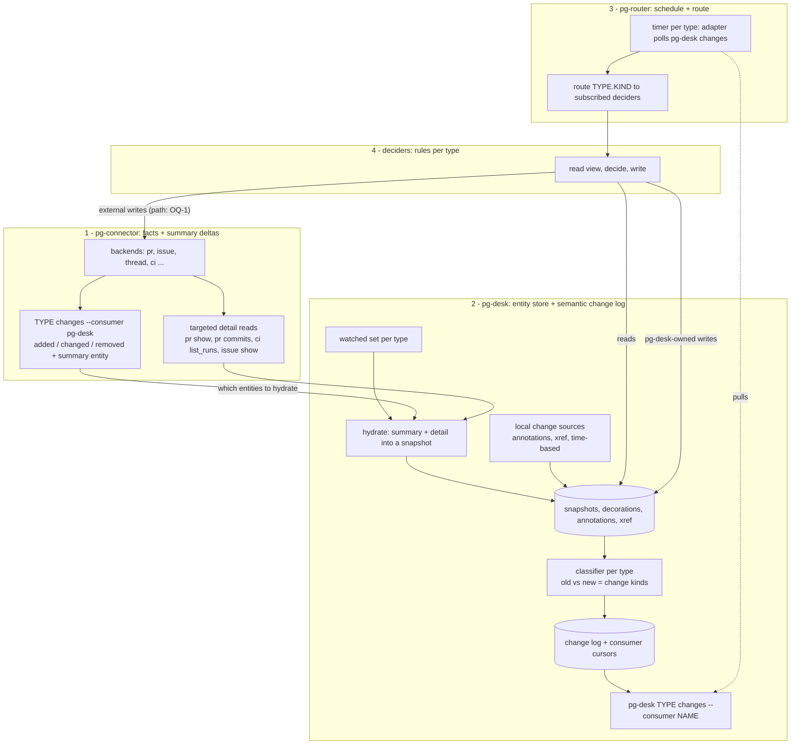
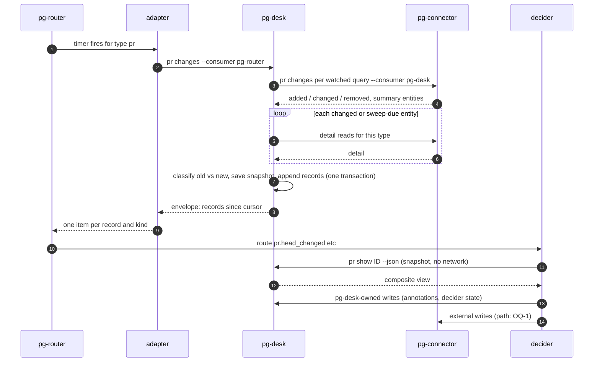

# Entity change flow: pg-connector → pg-desk → pg-router → deciders — design

- **Date**: 2026-09-29 (revision 2: independent review folded in; contracts and user stories
  added)
- **Status**: DRAFT for operator review — NOT approved. Produced in the interactive brainstorming
  session tracked by bead `pg2-2j5ac.49`. Nothing here authorizes implementation.
- **Markers**: **Decided** = operator confirmed in session (dated, section 3); **Recommended** =
  author's recommendation awaiting an operator ruling; **Open** = unresolved (section 16).
- **Supersedes**: `2026-09-25-pr-flow-reconciler-proposal.md` (same directory). Resolves questions
  8.1, 8.3 and 8.4 of `2026-09-25-pg-desk-cli-and-boundary-reconsideration-notes.md`.
- **Amends (if approved)**: `2026-09-09-pg-desk-and-connector-discovery-design.md` D8 (pg-desk
  mints beads) and the sync part of D9 (gather → interpret → sync in one process). D7 and D10 still
  hold. Approval MUST be recorded as an explicit amendment of that design, and accepted
  conclusions MUST be captured in an ADR before implementation (`docs/superpowers/specs/` files are
  not durable citation targets).
- **Overlaps**: `2026-09-23-pg-desk-generic-entity-pipeline-design.md` (`pg2-2j5ac.46`, issue-entity
  ingest). This design needs issue and thread entities stored in pg-desk; the two designs MUST be
  reconciled before either is implemented (section 15, step 0).

## 1. Purpose and problem

pg-desk is a caching/decorating console layer over pg-connector supporting many entity types
(PRs, issues, threads, later others). Agent work (reviews, feedback triage, fixes) is triggered
by changes to those entities.

Today that is wired the other way round and is PR-centric:

- pg-router's sources call `pg-connector <type> changes` and then tell pg-desk to ingest
  (`pg-desk run pr|issue|thread`), so change detection happens before the layer that holds the
  decorations, annotations and cross-entity links.
- pg-desk's `sync` stage (`packages/pg-desk/internal/sync/`, live with `sync.mode = "apply"`)
  decides and writes beads inside the ingest process and keeps a private `ledger` table of what it
  minted. Decision, I/O and a private copy of work state are entangled; a decision cannot be
  previewed per entity or tested without the pipeline.
- The contract between those bead writes and pg-router's role prompts (title prefixes, labels,
  metadata keys) is implicit.
- pg-connector's PR summary already carries `head_sha`, `mergeable`, `merge_state_status` and
  `checks_rollup` (`pkg/schema/pr.go`), and `changes` hashes the whole summary, so pushes, CI and
  conflict changes are already detected. It lacks `updated_at` and any review/comment signal, so
  new comments and reviews are missed.
- The review role still posts through `pg-pr review submit`; pg-connector has no review write verb.

## 2. Goals and non-goals

**Goals**

- G1. The flow MUST be generic across entity types; PR is one type among several.
- G2. pg-connector MUST detect most changes itself, from summary-level deltas.
- G3. pg-desk MUST hold the current snapshot of every watched entity and MUST produce a semantic
  change log covering connector-detected and locally-originated changes.
- G4. pg-router MUST remain the only scheduler; its core MUST stay generic (ADR 0065).
- G5. Decisions about what work should exist MUST live in deciders, outside pg-desk, pg-connector
  and pg-router's core. pg-desk MUST NOT decide.
- G6. Deciders MUST be idempotent: re-running on an unchanged view MUST produce no writes.
- G7. For any entity, a user MUST be able to see what the deciders would do next and why, without
  writing anything.
- G8. The flow MUST NOT depend on pg-pr.

**Non-goals**

- Redesigning role prompts beyond what the interface change forces.
- The final top-level CLI grouping beyond `pg-desk <type> <verb>`.
- Final values for tunables (section 9.4 gives defaults).

### Architecture overview



| Component       | Owns                                                                                                                                           | MUST NOT                                                                             |
| --------------- | ---------------------------------------------------------------------------------------------------------------------------------------------- | ------------------------------------------------------------------------------------ |
| pg-connector    | talking to external systems; summary-level `changes` with per-consumer cursors; targeted detail reads; external writes                         | hold decorations, cross-entity links or workflow rules; know its consumers           |
| pg-desk         | watched set; hydration; snapshots; decorations; annotations; xref; per-type classifiers; change log with per-consumer cursors; composite views | decide what work should exist; know pg-router's event format or which deciders exist |
| source adapter  | translating pg-desk's envelope into pg-router items (10.4)                                                                                     | add or drop records; decide anything                                                 |
| pg-router core  | timers; durable queue; routing `TYPE.KIND` items to roles                                                                                      | name any concrete tool or entity rule (ADR 0065)                                     |
| deciders        | per-type rules; `plan`; `apply`; the work-item contract                                                                                        | keep their own cache of entity state                                                 |
| pg-router roles | executing work items                                                                                                                           | decide which work items exist                                                        |

Dependency direction is one-way: deciders → pg-desk and pg-connector; pg-desk → pg-connector;
pg-router → adapter → pg-desk; pg-router → deciders. pg-desk depends on neither pg-router nor
deciders.

Patterns: pg-connector is a **Facade + Strategy** over backends. pg-desk is the **read side of
CQRS** with a **Transactional Outbox** (the change log); hydration and classification are each a
**Strategy per entity type**. The pg-desk → pg-router hand-off is **Event Notification** (records
are hints; state is read separately), bridged by an **Adapter**. Each decider is a **Reconciler**
built as **Functional Core, Imperative Shell** (pure `decide`; `plan` and `apply` are two shells).

One poll cycle:



## 3. Decisions recorded in session

| #   | Decision                                                                                                                                  | Date                       |
| --- | ----------------------------------------------------------------------------------------------------------------------------------------- | -------------------------- |
| S1  | pg-desk is a caching/decorating layer over pg-connector, multi-entity from the start                                                      | 2026-09-25, restated 09-29 |
| S2  | Decisions move out of pg-desk into deciders; deciders read through pg-desk                                                                | 2026-09-28                 |
| S3  | A dry-run `plan` lives on the decider CLI, not on pg-desk                                                                                 | 2026-09-28                 |
| S4  | pg-router's timer polls pg-desk for changes; pg-desk returns one event per changed entity with its change kinds; events route to deciders | 2026-09-29                 |
| S5  | pg-connector implementations produce most deltas; pg-desk adds changes they cannot see                                                    | 2026-09-29                 |
| S6  | `pg-desk changes` pulls fresh data from pg-connector by default; pg-router stays the only clock                                           | 2026-09-29                 |
| S7  | Events carry a reference and change kinds, not the full entity; deciders read the snapshot from pg-desk                                   | 2026-09-29                 |
| S8  | The sweep MUST NOT replay everything; a duration-based approach replaces `--full`                                                         | 2026-09-29                 |
| S9  | There may be deciders for every entity type                                                                                               | 2026-09-29                 |

## 4. Actors and user stories

Actors follow the companion notes (section 3 there): **Operator**, **pg-router**, **Monitoring**,
**Debugging**. Two participants are added because this design introduces them as distinct
callers: **Decider** (automated rule runner) and **Agent role** (a pg-router role session
executing a work item). Stories use `STORY-<ACTOR>-N`; each lists its acceptance criteria and the
sections that realize it.

### Operator

- **STORY-OP-1 — See what needs me.** As the operator I open everything that currently needs my
  attention, straight from the store, with no daemon.
  _Accept_: `pg-desk <type> open` with criteria lists matching entities from local snapshots;
  staleness is shown per entity (`as_of`). _Sections_: 6.7, 10.5.
- **STORY-OP-2 — Look at one entity.** I view one PR/issue/thread with its decorations, my
  annotations and its linked work, and can force it fresh.
  _Accept_: `pg-desk <type> show <id>` returns the composite view (10.5) including linked work and
  both `as_of` and `links_as_of`; `--refresh` hydrates first. _Sections_: 6.7, 10.5.
- **STORY-OP-3 — Know what will happen next.** For one entity I see which work the deciders would
  create/reopen/close and why, without anything being written.
  _Accept_: `<decider> plan <type> <id>` prints each action with rule id and facts, or
  `no actions`. _Sections_: 8.2, 10.7.
- **STORY-OP-4 — Suppress noise without losing anything.** I hide an entity, mark it WIP,
  suppress one kind of work on it, or dismiss one work item, and it stays that way until the
  situation materially changes.
  _Accept_: annotations persist across polls; a person-closed work item is not re-created for the
  same head/digest; a new head/digest re-arms it. _Sections_: 8.7, 10.6.
- **STORY-OP-5 — Force a re-review.** I ask for a fresh review of the current head even though it
  was already reviewed.
  _Accept_: `pg-desk pr force-review <id>` makes the next PR decider run reopen/create the review
  item once. _Sections_: 8.7.
- **STORY-OP-6 — Record my call on feedback.** I mark a comment handled / won't-fix / no-action so
  it drops off "unaddressed".
  _Accept_: `pg-desk pr feedback set` writes a disposition annotation; the next decider run sees
  the digest change. _Sections_: 6.5, 10.6.
- **STORY-OP-7 — Apply a rule change now.** After changing decider rules I make them take effect
  immediately rather than within the sweep window.
  _Accept_: `pg-desk <type> changes --reset --consumer pg-router` replays every active entity as
  `reconcile`. _Sections_: 6.2, 9.4.

### pg-router

- **STORY-RTR-1 — Poll for changes.** On a timer per entity type I ask pg-desk what changed and
  receive one record per changed entity, with a stable exit code even when a backend is degraded.
  _Accept_: `pg-desk <type> changes --consumer pg-router` returns the 10.3 envelope; exit 0/2/3;
  a degraded backend never yields `removed`/`closed`. _Sections_: 6.2, 9, 10.2, 10.3.
- **STORY-RTR-2 — Route to deciders.** I turn each record into one routed item per change kind and
  dispatch it to the decider roles subscribed to that `<type>.<kind>`.
  _Accept_: the adapter (10.4) emits items; routing config (10.9) binds kinds to decider roles.
  _Sections_: 9.3, 10.4, 10.9.

### Decider

- **STORY-DEC-1 — Decide from current state.** Given a routed item I read the current composite
  view and compute the actions needed, deterministically.
  _Accept_: `decide(view)` is pure; the same view always yields the same actions; an empty list
  when work matches. _Sections_: 8.1, 10.7.
- **STORY-DEC-2 — Apply safely.** I apply actions without creating duplicates, even with stale
  cache, duplicate events or a crash mid-apply.
  _Accept_: dedup key lookup before create; best-effort ordered apply; escalation after K
  consecutive failures. _Sections_: 8.4, 10.8.
- **STORY-DEC-3 — Remember my own state.** I persist data that exists nowhere else (e.g.
  consumed force-review) in pg-desk.
  _Accept_: `pg-desk <type> annotate ... --origin decider:<name>` writes an annotation and logs
  `annotation_changed`. _Sections_: 8.5, 10.6.

### Agent role

- **STORY-AGT-1 — Act on a work item without extra lookups.** A review / feedback / worker role
  finds everything it needs (repo, number, branch, head SHA, parent) on the work item.
  _Accept_: the work-item contract (10.8) lists every key roles read; role prompts cite it.
  _Sections_: 8.8, 10.8.
- **STORY-AGT-2 — Post a review without pg-pr.**
  _Accept_: `pg-connector pr review submit` exists with the 10.1 contract; the review prompt uses
  it. _Sections_: 5.2, 10.1.

### Monitoring

- **STORY-MON-1 — Scrape health.** I scrape per-type change volume, hydration failures, due
  backlog and consumer lag.
  _Accept_: metrics in section 12 exposed on `serve`'s `/metrics`. _Sections_: 12.

### Debugging

- **STORY-DBG-1 — Confirm the chain is wired.** Before trusting anything I confirm config
  resolves, watched queries exist in pg-connector, every consumer cursor advances, and which
  deciders subscribe to each type.
  _Accept_: `pg-desk doctor` checks 12's list. _Sections_: 12.
- **STORY-DBG-2 — Explain a work item.** I trace a work item back to the decider, rule and facts
  that created or last changed it, and the change record that triggered that run.
  _Accept_: audit comment on the item (8.6) plus change-log `origin` (10.2) plus
  `pg-desk <type> history <id>` listing the entity's change records. _Sections_: 8.6, 10.2.
- **STORY-DBG-3 — Explain a missing work item.** I find out why an entity did NOT get work.
  _Accept_: `plan` shows no action and why (rule not matched, suppressed, hidden, parked);
  `history` shows whether a change record was ever logged. _Sections_: 8.2, 10.2.

## 5. pg-connector

### 5.1 Summary fields (Recommended)

`changes` diffs `list` results by a hash of the whole summary entity minus `as_of`/`stale`
(`cmd/pg-connector/ledger.go` `canonicalHash`), so any summary field that moves makes a change
visible. Current coverage and the additions needed:

| Type   | Already in summary                                                                                   | Add                                                              | Why                                              |
| ------ | ---------------------------------------------------------------------------------------------------- | ---------------------------------------------------------------- | ------------------------------------------------ |
| pr     | `state`, `draft`, `merged`, `labels`, `head_sha`, `mergeable`, `merge_state_status`, `checks_rollup` | `updated_at`, `review_decision`, `comment_count`, `review_count` | new comments and reviews otherwise move no field |
| issue  | `state`, `assignee`, `labels`, `priority`, `updated_at`, `due_date`                                  | none                                                             | —                                                |
| thread | `last_reply_at`, `reply_count`, `participants`                                                       | none                                                             | —                                                |

A backend that cannot provide a field cheaply MUST leave it empty rather than fabricate it.

### 5.2 Review write verb (REQUIRED, independent)

`pg-connector pr review submit <id>` (contract 10.1). Required before pg-pr can be removed (G8);
SHOULD be done first.

### 5.3 Consumer cursors (existing, reused)

pg-connector keeps one delta ledger per `(type, backend, query)` with per-consumer cursors and
advances a consumer's cursor only after its response is fully written and flushed — a crash before
the advance costs a duplicate, never a loss (`cmd/pg-connector/changes.go`). pg-desk is one
consumer (`--consumer pg-desk`). (Naming: this pg-connector "delta ledger" is unrelated to
pg-desk's `ledger` table, which this design removes.)

## 6. pg-desk

### 6.1 Watched set

pg-desk config declares, per type, which pg-connector named queries to keep fresh (schema 10.10).
This moves the query names pg-router's config holds today into pg-desk. An entity is **active**
while it is non-terminal in its source system (open PR; issue not in a terminal state; thread with
a reply inside `thread_active_window`). Only active entities are swept (9.4).

The watched set (what pg-desk keeps fresh and shows) is independent of decider subscriptions (what
pg-router routes). An entity MAY be watched with no decider subscribed; its records are still
logged.

### 6.2 `pg-desk <type> changes`

Contract: 10.2. Default (pull-through): for each watched query of `<type>`, run
`pg-connector <type> changes --query <q> --consumer pg-desk`; hydrate every entity reported
`added`/`changed`, plus the sweep batch (9.4); classify and log (6.4); return the records since
the caller's cursor, and advance it after the output is flushed.

`--cached` skips the pg-connector call and hydration. `--reset` replays every active entity to
that consumer as `reconcile` records — an explicit operator action (STORY-OP-7). `--limit` caps
records per call.

### 6.3 Hydration (Strategy per type)

| Type   | Detail reads                                                         | Snapshot adds                                            |
| ------ | -------------------------------------------------------------------- | -------------------------------------------------------- |
| pr     | `pr show` (comments, reviews), `pr commits`, `ci list_runs` for head | per-comment state, review state, CI per check, approvals |
| issue  | `issue show`; `issue deps` when configured                           | comments, dependencies                                   |
| thread | `thread show`                                                        | messages                                                 |

A failed detail read for one entity leaves its previous snapshot in place and logs nothing for it;
the entity stays due and is retried next poll.

### 6.4 Classification (Strategy per type)

The classifier compares the previous snapshot + decorations + links with the new ones and emits
zero or more change kinds (catalogue 10.2).

**First observation**: when an entity has no previous snapshot — first run, a new watched query,
or `--reset` — the classifier MUST emit only `reconcile`, never a transition kind such as `opened`
or `head_changed`. Transition kinds are only emitted relative to an observed previous snapshot.
At cutover this means one `reconcile` per active entity, dispatched once to each subscribed
decider; with adoption (8.3) that run is expected to produce few or no writes. `--limit` and the
sweep cap bound how fast that wave drains.

### 6.5 Local change sources

Written to the same log with `origin: pg-desk` (or the annotating decider):

- annotation writes (`hide`, `unhide`, `wip`, `feedback set`, `suppress`, `force-review`,
  `annotate`) append `annotation_changed` for their entity immediately;
- a linked entity's change appends `link_changed` (for a PR's work item: `work_changed`) to every
  entity linked to it via xref;
- time-based conditions (OQ-9).

### 6.6 Store

Existing tables (`docs/behavior/pg-desk/store-schema.md`) are kept and extended; schema 10.11.

| Table            | Status                                       | Holds                                |
| ---------------- | -------------------------------------------- | ------------------------------------ |
| `entity`         | extended: `version`, `hydrated_at`, `active` | latest snapshot per `(type, id)`     |
| `interpretation` | kept; `sync_error` column dropped            | decorations, recomputed on hydration |
| `xref`           | kept                                         | cross-entity links                   |
| `annotation`     | generalized to key/value (10.6)              | sticky operator and decider data     |
| `change_log`     | new                                          | append-only change records           |
| `consumer`       | new                                          | per-consumer, per-type cursor        |
| `ledger`         | removed                                      | —                                    |
| `meta`           | kept                                         | schema version, heartbeat/run times  |

`change_log` rows are pruned once every registered consumer's cursor has passed them and they are
older than `change_log_retention` (default 14 days).

### 6.7 Composite view

`pg-desk <type> show <id> --json` (schema 10.5) returns snapshot, decorations, annotations and
linked entities with their state and key metadata. `--refresh` hydrates the entity and its links
first.

### 6.8 Concurrency

The store is SQLite. Writers are `changes` (hydration + log), `refresh`, annotation verbs, and the
sweep inside `changes`.

- Every write to `entity` MUST be conditional on the `version` it read (optimistic concurrency):
  `UPDATE ... WHERE type=? AND id=? AND version=?`. On conflict the writer re-reads and
  re-classifies; it MUST NOT overwrite a newer snapshot with an older one.
- Appending to `change_log` and bumping `entity.version` MUST happen in one transaction, so a
  record's `version` always names a snapshot that exists.
- Two concurrent `changes` calls for the same `(type, consumer)` SHOULD be serialized with a
  per-`(type, consumer)` advisory lock; the second returns after the first, reading from the
  advanced cursor. Calls for different consumers or types MAY run concurrently.

### 6.9 CLI surface

| Verb                                                                | Status                 | Contract                                                       |
| ------------------------------------------------------------------- | ---------------------- | -------------------------------------------------------------- |
| `pg-desk <type> changes`                                            | new                    | 10.2                                                           |
| `pg-desk <type> refresh <id>`                                       | new (replaces `run`)   | hydrates one entity; exit 0/2/3                                |
| `pg-desk <type> show <id>`                                          | changed                | 10.5                                                           |
| `pg-desk <type> open [<id> \| criteria]`                            | changed                | companion notes section 7                                      |
| `pg-desk <type> history <id> [--limit N]`                           | new                    | change records for one entity, newest first, 10.2 record shape |
| `pg-desk <type> annotate <id> --key K --value V [--origin O]`       | new                    | 10.6                                                           |
| `pg-desk <type> suppress\|unsuppress <id> --kind K`                 | new                    | 10.6                                                           |
| `pg-desk pr force-review <id>`                                      | new                    | 10.6                                                           |
| `pg-desk <type> hide\|unhide\|wip`, `pg-desk pr feedback list\|set` | kept (move under type) | 10.6                                                           |
| `pg-desk status`, `pg-desk doctor`, `pg-desk serve`                 | kept, extended         | section 12                                                     |
| `pg-desk run`, `ledger`, `import-pg-pr-annotations`, `sync.mode`    | removed                | —                                                              |

## 7. Why the store is needed even with pull-through

Pull-through keeps data fresh, but the store holds what exists nowhere else: the previous snapshot
(needed to compute transition kinds), decorations, annotations, cross-entity links, the change log
and cursors, and fast, consistent local reads for the console and deciders.

## 8. Deciders

### 8.1 Contract

A decider is registered for one entity type and a set of change kinds (always including
`reconcile`, `annotation_changed` and `link_changed`). For each routed item it MUST:

1. read the composite view: `pg-desk <type> show <id> --json`;
2. compute `decide(view) → actions` (pure; action schema 10.7), each action carrying the rule id
   and the facts it keyed on;
3. apply them (8.4), or print them (`plan`, 8.2).

CLI contract: 10.7.

### 8.2 `plan` (Decided, S3)

```
$ pr-decider plan pr acme/api#123
pr acme/api#123  mine  open  ready  head=9f3c1e2  ci=failing  conflict=no
linked work: review-pr (closed, reviewed_head=4b7a0d1), process-feedback (open, fbsum:ab12)

actions:
  reopen  review-pr        rule=review.head-advanced    head 9f3c1e2 != reviewed 4b7a0d1
  update  process-feedback rule=feedback.digest-changed unaddressed=[c-881, c-902]
  create  fix-ci           rule=fixci.failing-on-head   check "unit" failed on 9f3c1e2

skipped:
  conflict.present  not matched  mergeable=MERGEABLE
```

`skipped` lists every rule evaluated that produced no action and why (not matched, suppressed,
hidden, parked, already satisfied), which answers STORY-DBG-3.

### 8.3 PR deciders (rules)

_Ported_ rows reproduce pg-desk's current `internal/sync` behavior (`internal/sync/rules.go`,
`docs/behavior/pg-desk/sync.md` "Rules" and "Adoption"); _new_ rows are proposals.

| Rule id                   | Status    | Subscribes to                                   | Condition → action                                                                                                                                                                                                                                                                                                     |
| ------------------------- | --------- | ----------------------------------------------- | ---------------------------------------------------------------------------------------------------------------------------------------------------------------------------------------------------------------------------------------------------------------------------------------------------------------------- |
| `all.closed`              | ported    | `closed`, `merged`                              | PR merged/closed → `close` anchor and every open direct child                                                                                                                                                                                                                                                          |
| `all.reopened`            | new       | `reopened`                                      | PR open and anchor closed → `reopen` anchor (today the anchor is never reopened); child rules then re-evaluate                                                                                                                                                                                                         |
| `anchor.lazy`             | ported    | any                                             | a child is needed and no anchor → `create` anchor (`merge-request`, title `<repo>#<n>: <title>`)                                                                                                                                                                                                                       |
| `anchor.backfill`         | ported    | any                                             | adopted anchor lacks `repo`/`pr_number` → `update` metadata once                                                                                                                                                                                                                                                       |
| `anchor.priority`         | ported    | `mergeability_changed`, `reconcile`             | mine/co-owned + conflict → raise; team → lower; baseline stashed in `pbase:<n>`, restored when cleared → `update`                                                                                                                                                                                                      |
| `review.head-advanced`    | ported    | `opened`, `head_changed`, `draft_changed`       | qualifying = (mine or co-owned, draft included) or (team and not draft). Qualifying and no review item → `create` `review-pr: <repo>#<n>`. Qualifying, item closed, and `head_sha` ≠ item's reviewed head → `reopen` with new `head_sha` and refresh metadata. Item open → no action                                   |
| `feedback.digest-changed` | ported    | `feedback_changed`                              | any ownership with unaddressed comments (no ownership gate today; `mine` label only when mine/co-owned). No open cycle → `create` `process-feedback: <repo>#<n>` with `fbsum:<digest>`; open cycle with another digest → `update`, add new and remove stale `fbsum:` labels. Whether team PRs should get cycles: OQ-13 |
| `fixci.failing-on-head`   | new, OQ-4 | `ci_changed`, `head_changed`                    | mine/co-owned, CI failing on head, none open for this head → `create`                                                                                                                                                                                                                                                  |
| `conflict.present`        | new, OQ-4 | `mergeability_changed`                          | mine/co-owned, conflicting, none open → `create`                                                                                                                                                                                                                                                                       |
| `land.ready`              | new, OQ-5 | `ci_changed`, `review_changed`, `draft_changed` | mine/co-owned, green + approved + not draft → `annotate` ready-to-land, not a work item                                                                                                                                                                                                                                |

**Adoption (ported)**: existing beads without a `dedup_key` are matched by exact title (anchors by
`<repo>#<n>:` prefix) and adopted; `apply` writes `dedup_key` onto them. MUST run on the first
reconcile per entity after cutover.

**Parked work**: children labeled `human` count as existing work for dedup and MUST NOT be
re-created or re-labeled.

**hide / wip (new, OQ-6)**: today they do not affect bead writes (`sync` never reads them;
`internal/interpret/interpret.go`: "Hidden and WIP are NOT interpreted").

**Team PRs (OQ-7)**: never modified beyond an operator-pending review.

**Stacked PRs**: each PR is decided independently; gating a downstream PR on its upstream landing
is the worker role's concern.

### 8.4 Applying actions

- **Dedup key (REQUIRED)**: every work item carries `dedup_key` (10.8); `apply` MUST look it up
  in the tracker before `create`. On repo rename or transfer, deciders SHOULD match on a stable
  backend id when available (OQ-10).
- **Tracker is the source of truth** for work items. After an external write the decider MUST run
  `pg-desk issue refresh <work-item-id>` unless the write went through pg-desk (OQ-1). A failed
  refresh is retryable staleness, not an apply failure. `apply` MUST NOT roll back a tracker write.
- **Partial apply**: actions apply in order, best-effort; errors are captured and later actions
  continue unless they depend on a failed one (children depend on the anchor `create`). A failed
  action is re-derived on the next item or sweep. An action failing on K consecutive runs for the
  same entity (default K = 3; counter kept as a decider annotation) MUST be escalated as a
  `human`-labeled work item naming rule and error.
- **Serialization (SHOULD)**: at most one run per `(decider, entity)` in flight; pg-router MAY
  coalesce identical `(decider, type, id)` items within one poll.
- **Loop termination**: a decider's write yields a change record with `origin: decider:<name>`
  that routes back; because `decide` is idempotent, the next run yields no actions.

### 8.5 Decider state in pg-desk

Data that exists nowhere else (force-review consumption, failure counters, dismissals) is written
with `pg-desk <type> annotate <id> --key decider.<name>.<k> --value <v> --origin decider:<name>`.

### 8.6 Audit

Every applied external action MUST append one comment on the affected work item: rule id, facts,
triggering record `seq`, timestamp. With the change log's `origin` and `pg-desk <type> history`,
this replaces the removed `ledger`'s history.

### 8.7 Operator control (Recommended)

- `suppress --kind` is sticky; deciders create no work of that kind for the entity.
- A work item closed by a person (closer ≠ the decider actor) is treated as dismissed for the
  current head (per-head kinds) or current digest (feedback); a new head or digest re-arms it.
- `force-review` is one-shot; its consumption is recorded via 8.5.

### 8.8 Work-item contract

Owned by the deciders' behavior docs (schema 10.8). The "Bead shapes" table in
`docs/behavior/pg-desk/sync.md` MUST move there verbatim, plus `dedup_key`, before
`internal/sync` is deleted; role prompts SHOULD cite it.

### 8.9 Packaging (Open, OQ-8)

One binary per entity type, one binary with a rule registry, or role config over a shared binary.
Each decider runs as a pg-router command role; no pg-router core or handler-model change.

## 9. Delivery, routing and the sweep

### 9.1 Envelope

pg-desk's `changes` output (10.3) deliberately carries no entity (S7). It is NOT the shape the
existing `pg-router-source-pg-connector` adapter reads (`{sources, changes:[{change, source,
entity}]}`, from which it takes `entity.id`/`entity.title`). A new source adapter (or a new mode
of the existing one) is REQUIRED (10.4).

### 9.2 Delivery semantics

At-least-once. pg-desk advances a consumer's cursor after flush. The remaining loss window —
pg-router crashes after reading but before enqueueing — is accepted and repaired by the sweep
(Recommended; explicit ack is OQ-3). Consumers MUST tolerate duplicates and reordering; deciders
do so by reading the current view.

### 9.3 Routing

pg-router config (10.9) declares one source per watched type (`pg-desk <type> changes --consumer
pg-router` via the adapter, period per type) emitting one item per change kind as
`<type>.<kind>`, and routes each to subscribed decider roles. pg-router's core is unchanged.

### 9.4 Sweep: rolling re-hydration by age (Recommended)

On every `changes` call pg-desk also hydrates up to `sweep.max_per_poll` (N) active entities of
that type whose `hydrated_at` is older than `sweep.max_age` (D), oldest first, and logs
`reconcile` for each. Defaults: D = 6h, N = 20. This covers detail changes the summary missed,
events lost in the delivery window, and eventual application of changed rules.

## 10. Contracts, interfaces and schemas

All JSON below is normative in field names and types; examples use illustrative values. New
fields MAY be added (consumers MUST ignore unknown fields); fields MUST NOT be removed or change
meaning without a version bump of the containing contract.

### 10.1 `pg-connector pr review submit <id>`

- **Input** (stdin JSON):

  ```json
  {
    "head_sha": "9f3c1e2...",
    "body": "Summary text",
    "comments": [
      { "path": "src/a.go", "line": 42, "side": "RIGHT", "body": "..." }
    ],
    "supersede_pending": true
  }
  ```

- **Behavior**: posts a PENDING (unsubmitted) review only; anchored to `head_sha` (422 from the
  host if the head moved is reported as `head_moved`); bot-marked by the backend; when
  `supersede_pending`, deletes the actor's existing pending review first.
- **Output**: `{"review_id": "...", "state": "pending", "head_sha": "...", "as_of": "..."}`.
- **Exit codes**: 0 ok; 2 degraded (posted, supersede failed); 3 failed (nothing posted),
  with `error.code` ∈ `head_moved`, `not_found`, `forbidden`, `backend_error`.

### 10.2 `pg-desk <type> changes`

```
pg-desk <type> changes --consumer <name> [--cached] [--reset] [--limit N]
pg-desk <type> history <id> [--limit N]
```

- **Output**: the envelope in 10.3. `history` returns `{"records": [...]}` with the same record
  shape, newest first.
- **Exit codes**: 0 ok; 2 degraded (at least one watched query or hydration failed; partial
  records); 3 total failure (nothing logged, cursor not advanced).
- **Invariants**: the cursor advances only after output is flushed; a degraded source MUST NOT
  yield `removed`/`closed` for entities it failed to list; first observation yields `reconcile`
  only (6.4).
- **Change-kind catalogue**:

  | Type   | Kinds                                                                                                                                                                                 |
  | ------ | ------------------------------------------------------------------------------------------------------------------------------------------------------------------------------------- |
  | all    | `added`, `removed`, `reconcile`, `annotation_changed`, `link_changed`                                                                                                                 |
  | pr     | `opened`, `reopened`, `closed`, `merged`, `draft_changed`, `head_changed`, `base_changed`, `ci_changed`, `mergeability_changed`, `review_changed`, `feedback_changed`, `work_changed` |
  | issue  | `opened`, `reopened`, `closed`, `status_changed`, `assignee_changed`, `comments_changed`, `deps_changed`                                                                              |
  | thread | `message_added`, `resolved`                                                                                                                                                           |

### 10.3 Change envelope (pg-desk → adapter)

```json
{
  "contract": "pg-desk.changes/v1",
  "type": "pr",
  "consumer": "pg-router",
  "cursor": { "from": 18400, "to": 18422 },
  "sources": [
    { "query": "mine", "status": "ok" },
    { "query": "team", "status": "degraded", "reason": "rate_limited" }
  ],
  "records": [
    {
      "seq": 18422,
      "type": "pr",
      "id": "acme/api#123",
      "title": "Add retry to client",
      "version": 37,
      "kinds": ["head_changed", "feedback_changed"],
      "origin": "pg-connector",
      "at": "2026-09-29T14:03:11Z"
    }
  ]
}
```

- `id`: pg-desk's canonical entity id for the type (PR `<repo>#<n>`, issue tracker key or bead id,
  thread `<channel>/<ts>`).
- `title`: display title only (so the adapter needs no extra lookup); MUST NOT be used for
  decisions.
- `origin` ∈ `pg-connector`, `pg-desk`, `sweep`, `reset`, `decider:<name>`.
- `status` ∈ `ok`, `degraded`, `failed`.

### 10.4 Source adapter (envelope → pg-router items)

A pg-router command source; one item per `(record, kind)`:

```json
[
  {
    "id": "acme/api#123",
    "type": "pr.head_changed",
    "title": "Add retry to client",
    "metadata": {
      "entity_type": "pr",
      "entity_id": "acme/api#123",
      "kind": "head_changed",
      "seq": 18422,
      "version": 37,
      "origin": "pg-connector",
      "degraded_sources": ["team"]
    }
  }
]
```

Matches pg-router's item model (`packages/pg-router/internal/item/item.go`: `ID`, `Type`,
`Title`, `Metadata`). Exit code mirrors pg-desk's. Packaging (new binary vs. a mode of
`pg-router-source-pg-connector`) is an implementation choice; it MUST be live-exercised (13).

### 10.5 Composite view (`pg-desk <type> show <id> --json`)

```json
{
  "contract": "pg-desk.view/v1",
  "type": "pr",
  "id": "acme/api#123",
  "version": 37,
  "as_of": "2026-09-29T14:03:10Z",
  "stale": false,
  "snapshot": {
    "...": "the type's pg-connector schema, hydrated (schema.PR with comments/reviews)"
  },
  "decorations": {
    "relationship": "mine",
    "dispositions": [
      { "comment_id": "c-881", "computed": "open", "override": null }
    ],
    "urgency": "...",
    "category": "..."
  },
  "annotations": {
    "hidden": false,
    "wip": false,
    "suppress": ["fix-ci"],
    "force_review": false,
    "decider": { "pr-decider": { "fail.review.head-advanced": "1" } }
  },
  "links": [
    {
      "type": "issue",
      "id": "pg2-abc12",
      "relation": "work",
      "state": "open",
      "labels": ["mine", "fbsum:ab12"],
      "metadata": { "dedup_key": "pr:acme/api#123:process-feedback" },
      "closed_by": null
    }
  ],
  "links_as_of": "2026-09-29T14:01:02Z"
}
```

`snapshot` is the pg-connector schema type for the entity (`schema.PR`, `schema.Issue`,
`schema.Thread`), hydrated per 6.3. `closed_by` lets deciders tell person-closed from
decider-closed work (8.7).

### 10.6 Annotations

Generalized `annotation` table: `(type, id, key, value, origin, set_by, set_at)`, primary key
`(type, id, key)`. Reserved keys:

| Key                        | Value                             | Written by                            |
| -------------------------- | --------------------------------- | ------------------------------------- |
| `hidden`                   | `true` + reason                   | `hide` / `unhide`                     |
| `wip`                      | `true`/`false`                    | `wip`                                 |
| `disposition.<comment_id>` | `will-fix`/`wont-fix`/`no-action` | `pr feedback set`                     |
| `suppress.<kind>`          | `true`                            | `suppress` / `unsuppress`             |
| `force_review`             | head SHA it was requested at      | `pr force-review`; cleared by decider |
| `ready_to_land`            | `true`/`false`                    | `land.ready` decider                  |
| `decider.<name>.<k>`       | string                            | deciders via `annotate`               |

Every annotation write appends `annotation_changed` in the same transaction.

### 10.7 Decider CLI and action schema

```
<decider> plan  <type> <id> [--json]
<decider> apply <type> <id> [--from-item <path|->]
```

- `apply` accepts the routed pg-router item (10.4) on stdin or by path, but always re-reads the
  view (8.1).
- Exit codes: 0 all actions applied or none needed; 2 some actions failed (captured); 3 view
  unreadable (nothing applied).
- **Action**:

  ```json
  {
    "op": "create",
    "kind": "review-pr",
    "target": null,
    "fields": {
      "title": "review-pr: acme/api#123",
      "labels": [],
      "metadata": { "head_sha": "9f3c1e2" },
      "parent": "pg2-anc01"
    },
    "rule": "review.head-advanced",
    "facts": {
      "relationship": "mine",
      "head_sha": "9f3c1e2",
      "reviewed_head": null
    }
  }
  ```

  `op` ∈ `create`, `update`, `reopen`, `close`, `annotate`; `target` is the work-item id (null for
  `create`) or the annotation key.

- `plan --json` prints `{"actions": [...], "skipped": [{"rule", "reason", "facts"}]}`.

### 10.8 Work-item contract (PR kinds)

| Kind                      | Issue type      | Title                          | Labels                                               | Metadata                                                                              | Parent |
| ------------------------- | --------------- | ------------------------------ | ---------------------------------------------------- | ------------------------------------------------------------------------------------- | ------ |
| anchor                    | `merge-request` | `<repo>#<n>: <pr title>`       | `co-owned` when applicable; `pbase:<n>` while nudged | `repo`, `pr_number`, `state`, `branch`, `base`, `author`, `url`, `draft`, `dedup_key` | none   |
| `process-feedback`        | `task`          | `process-feedback: <repo>#<n>` | `mine` (mine/co-owned only), `fbsum:<digest>`        | `repo`, `pr_number`, `branch`, `dedup_key`; description = rendered unaddressed items  | anchor |
| `review-pr`               | `task`          | `review-pr: <repo>#<n>`        | —                                                    | `repo`, `pr_number`, `branch`, `head_sha` (reviewed head), `ownership`, `dedup_key`   | anchor |
| `fix-ci` (OQ-4)           | `task`          | `fix-ci: <repo>#<n>`           | `mine`                                               | `repo`, `pr_number`, `branch`, `head_sha`, `failing_checks`, `dedup_key`              | anchor |
| `resolve-conflict` (OQ-4) | `task`          | `resolve-conflict: <repo>#<n>` | `mine`                                               | `repo`, `pr_number`, `branch`, `base`, `dedup_key`                                    | anchor |

`dedup_key` = `<type>:<id>:<kind>`, plus `:<head_sha>` for per-head kinds (`fix-ci`). Roles MUST
rely only on fields in this table.

### 10.9 pg-router configuration (shape)

```toml
[[query]]
name = "desk-pr-changes"
emits = ["pr.*"]
type = "command"
trigger = { kind = "period", every = "60s" }
command.argv = ["<adapter>", "pg-desk", "pr", "--consumer", "pg-router"]
command.format = "json"

[[role]]
name = "pr-decider"
binds = ["pr.*"]
# rendered role config (handler command dir): argv = ["pr-decider", "apply", "pr", "{{.Item.Metadata.entity_id}}", "--from-item", "-"]
```

One query per watched type; decider roles bind to the kinds they subscribe to (8.1). Whether
pg-router supports a `pr.*` wildcard bind or needs each kind listed is an implementation detail to
confirm against pg-router's config loader.

### 10.10 pg-desk configuration additions (`config.yaml`)

```yaml
watch:
  pr:
    queries: [mine, team]
  issue:
    queries: [assigned-to-me, work-items]
  thread:
    queries: [mentions]
    active_window: 7d
sweep:
  max_age: 6h
  max_per_poll: 20
change_log_retention: 14d
```

`sync:` and `agent_tracker_backend` move to decider configuration (the latter as the decider's
write backend). pg-desk MUST reject a watched query name pg-connector does not recognize
(`doctor` also checks).

### 10.11 Store schema changes (SQLite)

```sql
ALTER TABLE entity ADD COLUMN version INTEGER NOT NULL DEFAULT 0;
ALTER TABLE entity ADD COLUMN hydrated_at TEXT;
ALTER TABLE entity ADD COLUMN active INTEGER NOT NULL DEFAULT 1;

CREATE TABLE change_log (
  seq     INTEGER PRIMARY KEY AUTOINCREMENT,
  type    TEXT NOT NULL,
  id      TEXT NOT NULL,
  version INTEGER NOT NULL,
  kinds   TEXT NOT NULL,          -- JSON array
  origin  TEXT NOT NULL,
  at      TEXT NOT NULL
);
CREATE INDEX change_log_entity ON change_log(type, id, seq);

CREATE TABLE consumer (
  name   TEXT NOT NULL,
  type   TEXT NOT NULL,
  cursor INTEGER NOT NULL DEFAULT 0,
  seen_at TEXT,
  PRIMARY KEY (name, type)
);

-- annotation generalized to (type, id, key, value, origin, set_by, set_at); existing hidden/wip/
-- disposition rows migrate to reserved keys (10.6).
DROP TABLE ledger;
```

## 11. Failure modes

| Failure                                         | Effect              | Handling                                                                        |
| ----------------------------------------------- | ------------------- | ------------------------------------------------------------------------------- |
| a backend fails during `changes`                | partial source      | exit 2; no `removed`/`closed` for unlisted entities; retried next poll          |
| detail read fails for one entity                | stale snapshot      | previous snapshot kept; entity stays due                                        |
| concurrent writers on one entity                | lost update         | optimistic `version` check; loser re-reads and re-classifies (6.8)              |
| pg-desk crashes before cursor advance           | duplicate records   | harmless (idempotent deciders)                                                  |
| pg-router crashes after read, before enqueue    | records lost        | sweep re-checks within D; OQ-3                                                  |
| decider write succeeds, refresh fails           | stale view          | dedup key prevents duplicate; next hydration catches up                         |
| decider action keeps failing                    | no progress         | escalate after K runs (8.4)                                                     |
| rule change deployed                            | old decisions stand | sweep within D; `--reset` for immediate (STORY-OP-7)                            |
| old `sync` and deciders both writing at cutover | duplicate beads     | prevented by migration order (15): deciders are plan-only until one atomic flip |

## 12. Observability

- `/metrics` (pg-desk `serve`), per type: records logged by kind and origin; hydrations and
  hydration failures; due backlog (active entities with `hydrated_at` older than D); consumer lag
  (`max(seq) − cursor`) per consumer; optimistic-concurrency retries.
- `pg-desk status`: the same, human-readable, per consumer and type.
- `pg-desk doctor`: config resolves; every watched query resolves in pg-connector; every
  registered consumer's `seen_at` is within 3× its expected period; and, when pointed at the
  pg-router config with `--router-config <path>` (read as a file; no dependency on pg-router), which
  decider roles bind to each type (STORY-DBG-1).
- Deciders: per rule, actions planned/applied/failed; escalations.

## 13. Test strategy

Each MUST in this document maps to at least one test:

| Area                              | Tests                                                                                                                                                                                                                                                                                        |
| --------------------------------- | -------------------------------------------------------------------------------------------------------------------------------------------------------------------------------------------------------------------------------------------------------------------------------------------- |
| pg-connector summary fields (5.1) | per-backend fixture tests: new fields populated; `changes` reports `changed` when only `updated_at`/`comment_count` moves                                                                                                                                                                    |
| review submit (5.2, 10.1)         | fake-host tests: pending-only; `head_moved` on 422; bot marker present; `supersede_pending` deletes the prior pending review; exit 2 when supersede fails                                                                                                                                    |
| classifiers (6.4)                 | table tests per kind plus no-change; **property tests**: classify(s, s) = ∅; first observation yields only `reconcile`; kinds are a pure function of (old, new)                                                                                                                              |
| hydration (6.3)                   | fake pg-connector (`fake_backend_test.go` pattern); failed detail read keeps previous snapshot and logs nothing                                                                                                                                                                              |
| change log and cursors (6.2)      | multi-consumer delivery; crash between flush and advance → duplicate not loss; `--limit` paging; pruning waits for the slowest consumer; `--reset`                                                                                                                                           |
| degraded sources (6.2)            | failing backend never yields `removed`/`closed`; exit 2                                                                                                                                                                                                                                      |
| concurrency (6.8)                 | two concurrent `changes` for one consumer serialize; `refresh` racing hydration never regresses `version`; log append and version bump are atomic                                                                                                                                            |
| sweep (9.4)                       | selection by age, cap N, oldest-first, inactive excluded                                                                                                                                                                                                                                     |
| annotations (10.6)                | each write appends `annotation_changed` in the same transaction; reserved-key migration from existing rows                                                                                                                                                                                   |
| deciders (8.1–8.4)                | table tests per rule id; **idempotency property**: for any fixture view, `decide(apply(view, decide(view)))` = ∅; parked `human` children never duplicated; dedup lookup before create; escalation after K consecutive failures; person-closed item not re-created until head/digest changes |
| audit (8.6)                       | every applied external action writes exactly one audit comment with rule, facts, seq                                                                                                                                                                                                         |
| plan (8.2)                        | golden output per fixture, including `skipped` reasons                                                                                                                                                                                                                                       |
| adoption / parity (8.3, 15)       | fixtures from real pre-cutover bead shapes; `plan` for every tracked PR vs. live `sync` writes: zero or explained differences, including team-PR feedback cycles                                                                                                                             |
| contracts (10.3–10.8)             | golden JSON fixtures per contract version; adapter test from envelope to items; decider parses composite-view fixtures; role-prompt keys ⊆ work-item contract                                                                                                                                |
| live exercise                     | per this repo's rules, every new or changed pg-router query/role pair is exercised live once (`pg-router run-query` / `run-role` with realistic input, non-trivial outcome) as part of its own change                                                                                        |

## 14. What is removed

- pg-desk: `internal/sync/`, `sync.mode`, `ledger` table and command, `import-pg-pr-annotations`,
  `run` (replaced by `refresh` and `changes`), `interpretation.sync_error`.
- pg-router deployment config: per-query pg-connector `changes` sources for watched types and the
  `desk-pr` / `desk-issue` / `desk-thread` ingest roles.
- The review prompt's `pg-pr review submit` call.

## 15. Migration

0. **Record decisions**: ADR; amend the 2026-09-09 design; reconcile with `pg2-2j5ac.46`.
1. **pg-connector**: review submit verb (5.2); switch the review prompt off pg-pr.
2. **pg-connector**: PR summary fields (5.1).
3. **pg-desk**: store migration (10.11); issue and thread snapshots (per `.46`); hydration
   strategies; classifiers; change log; cursors; `changes`, `refresh`, `history`, `show`,
   annotation verbs; `watch:` config (10.10) populated from the query names in today's pg-router
   config.
4. **Adapter** (10.4): build and live-exercise against `pg-desk changes`.
5. **Deciders** in plan-only mode: port rules (8.3) including adoption; move the work-item
   contract (8.8); run `plan` for every tracked PR alongside live pg-desk `sync` and diff until
   parity (13). Old `sync` keeps writing throughout.
6. **pg-router**: add the `pg-desk changes` sources and decider roles with deciders still in
   plan-only mode; live-exercise.
7. **Flip, as one change**: deciders switch to `apply`; pg-desk `sync.mode = "off"`; old
   pg-connector sources and `desk-*` ingest roles removed. There MUST be no deployed state in which
   both `sync` apply and decider apply are enabled.
8. **Rollback** (if needed after the flip): revert that one change — deciders back to plan-only,
   `sync.mode = "apply"`, old sources and roles restored. Adoption makes either side safe to resume
   over beads the other created.
9. **Delete** pg-desk `internal/sync`, `ledger`, `import-pg-pr-annotations`, `run` once the flip
   has run cleanly for an agreed soak period.

## 16. Open questions

- **OQ-1** Decider external writes: directly to pg-connector (then `pg-desk refresh`), or through
  pg-desk as a write-through Repository. Author leans direct.
- **OQ-2** Envelope versioning policy beyond `contract: .../v1`.
- **OQ-3** Explicit ack vs. advance-after-flush plus sweep.
- **OQ-4** Should fix-CI and resolve-conflict be work kinds?
- **OQ-5** Ready-to-land: annotation (as written), notification, or work item?
- **OQ-6** hide/wip effect on work creation.
- **OQ-7** Team-PR scope beyond a pending review.
- **OQ-8** Decider packaging.
- **OQ-9** Time-based change sources: which, and where configured.
- **OQ-10** Stable backend ids for rename/transfer.
- **OQ-11** Issue and thread deciders: which rules exist on day one, if any.
- **OQ-12** Keep or drop the `merge-request` anchor once work items carry `repo`/`pr_number`.
- **OQ-13** Should team PRs keep getting `process-feedback` cycles (today's behavior) or only
  mine/co-owned PRs?
