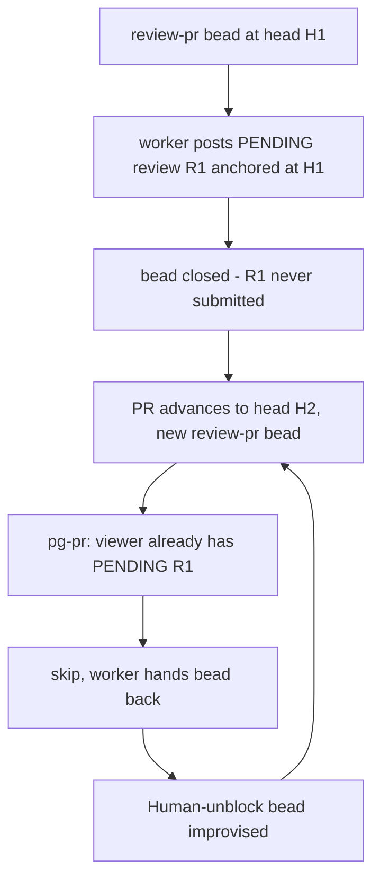
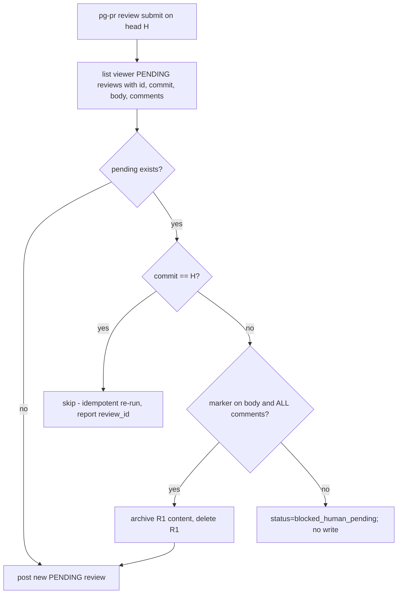

# Pending-review handling in pg-pr / pg-desk / pg-router: investigation and recommended design

- **Date**: 2026-09-29
- **Bead**: `pg2-kftf9.10` (P0 bug; parent epic `pg2-kftf9`; related `pg2-me72g`, `pg2-kftf9.8`)
- **Status**: INVESTIGATION + RECOMMENDATION. Nothing here authorizes implementation; section 8 lists proposed beads, which are NOT yet created.
- **Evidence legend**: **[doc]** = read from public GitHub docs on 2026-09-29; **[code]** = read from this repo or the ZR repo; **[unverified]** = from memory, the docs page could not be fetched in this pass (GraphQL reference pages returned only an index). Unverified items MUST be confirmed by a throwaway-repo experiment before any bead relies on them.

## 1. Problem

The pg-router review worker is told to "Post a PENDING review (no approve/request-changes event)" **[code]** (`phillipg-nix-ziprecruiter/modules/zm/pg-router/review-prompt.txt`). Nothing ever submits that review. GitHub permits one PENDING review per user per PR, and `pg-pr review submit|post` refuses to post when one already exists **[code]** (`packages/pg-pr/cmd/pg-pr/review.go`, `postStaged` -> `skipExistingPendingReview`; detection in `pkg/provider/vcs/github/pending.go`, GraphQL `reviews(states:[PENDING])`, fail-closed).

Consequence: on the next head the worker cannot post, hands the bead back, and improvises a "Human: unblock stuck pending review" bead. `review-pr` beads never reach a terminal state.

Note the detection query returns only `author` and `state`: no review id, no commit, no comment count. The current code therefore cannot act on the review it detects.

## 2. GitHub API facts

### 2.1 REST **[doc]** (docs.github.com/en/rest/pulls/reviews)

| Operation       | Endpoint                               | Notes                                                                                                                        |
| --------------- | -------------------------------------- | ---------------------------------------------------------------------------------------------------------------------------- |
| List reviews    | `GET /repos/{o}/{r}/pulls/{n}/reviews` | Chronological, paginated (max 100). Docs state PENDING reviews lack `submitted_at`.                                          |
| Create review   | `POST .../pulls/{n}/reviews`           | `commit_id` optional (defaults to latest commit); `event` omitted = PENDING; `comments[]` with path/position (or line/side). |
| Get review      | `GET .../reviews/{id}`                 |                                                                                                                              |
| Update body     | `PUT .../reviews/{id}`                 | `body` required; updates the summary only, NOT inline comments.                                                              |
| Delete          | `DELETE .../reviews/{id}`              | "Deletes a pull request review that has not been submitted. Submitted reviews cannot be deleted."                            |
| Submit          | `POST .../reviews/{id}/events`         | `event` REQUIRED (`APPROVE`, `REQUEST_CHANGES`, `COMMENT`); omission is 422. `body` optional.                                |
| Dismiss         | `PUT .../reviews/{id}/dismissals`      | `message` required; applies to submitted reviews; on protected branches needs admin or dismiss-list membership.              |
| Review comments | `GET .../reviews/{id}/comments`        | Lets a tool inspect what a pending review contains.                                                                          |

Token: a fine-grained PAT needs **Pull requests: write** for create/update/delete **[doc]** (permissions table). No extra scope is documented for submit; it is expected to sit under the same permission **[unverified]**. Creation is documented as notification-triggering and subject to secondary rate limits.

Important gap **[unverified]**: the pg-pr code comment says the REST/`gh pr view --json reviews` list surfaces only SUBMITTED reviews and a PENDING review is invisible there (design section 2.6, Q2 cited in `pending.go`). The REST list docs do not say PENDING reviews of other users are hidden, but the practical rule is that only the review's author sees it. Because `GET .../reviews` called as the author is documented to include their own pending review with no `submitted_at`, the REST list is a candidate replacement for the GraphQL probe; confirm by experiment.

### 2.2 GraphQL **[unverified - docs not fetchable in this pass]**

Mutations believed to exist: `addPullRequestReview` (has `commitOID`, `threads`), `addPullRequestReviewThread` (takes `pullRequestReviewId` OR `pullRequestId`, plus `path`, `line`, `side`, `body`), `updatePullRequestReview`, `submitPullRequestReview` (`event` + `body`), `deletePullRequestReview`, `dismissPullRequestReview`. Whether `addPullRequestReviewThread` on an existing pending review is anchored to that review's commit or to the PR's current head is the single most important open fact for the reuse option (section 4.1).

### 2.3 Open questions requiring a throwaway-repo experiment

Experiments MUST run against a scratch repository owned by the operator, never against real PRs.

1. Can `addPullRequestReviewThread` on an existing PENDING review R1 (created at H1) attach a thread at a line that exists only in H2? Which commit does it anchor to?
2. After a force-push that removes H1 from the PR, what happens to R1's comments (outdated, orphaned, deleted)? Is R1 still submittable?
3. Does the REST `list reviews` call, authenticated as the author, include the author's PENDING review?
4. Does the pending review show in the web UI for the author with "Finish your review", and can the operator edit its comments there? (Believed yes.)
5. Does submitting with `COMMENT` an old-anchored review produce noise visible to the PR author (notification, "outdated" markers)?
6. Can the same token that creates the review delete it (author-only vs repo-admin)?

## 3. Constraints from the operator workflow

- The operator's intent is review-then-submit: the agent drafts, a human MAY edit in the GitHub UI, then submits. Any automatic action on a pending review is therefore a potential destruction of human edits.
- The current detection path is described as protecting "a pending review a human has started editing" **[code]** (`pending.go` doc comment). That protection MUST be preserved or replaced by an explicit provenance check.
- Provenance signal: pg-pr stamps agent-authored review bodies and comments with a marker **[code]** (`marker.Stamp`). A tool MUST NOT delete or submit a pending review unless the marker is present in its body and all of its comments (an unmarked or partly-edited review is human territory).

## 4. Options

### 4.1 Reuse and extend

Keep R1; on a new head, add threads for the new head's findings to R1 (`addPullRequestReviewThread`), optionally update the body.

- Pro: one draft per PR for the operator to finish; no destruction; matches the "one pending review" GitHub rule.
- Con: R1 already contains stale findings anchored at H1; the reviewer for H2 would have to reconcile old comments (delete individual ones is not possible via the documented REST surface; per-comment deletion of pending comments **[unverified]**). Anchoring to H1 vs H2 is unknown (Q1). Accumulates across many heads into an unreadable review. Agent must first fetch R1's comments to avoid duplicates.
- Verdict: fragile; only viable if Q1 shows threads anchor to current head AND stale comments can be removed. NOT recommended as the default.

### 4.2 Submit old, then new

Submit R1 (as `COMMENT`, never approve/request-changes), then post R2 for H2.

- Pro: preserves the old findings on the PR as a real, timestamped review; unblocks immediately.
- Con: publishes findings the operator never approved, possibly stale, to teammates (notifications). This defeats review-then-submit and MUST NOT be done unattended. Findings at H1 that no longer apply become public noise.
- Verdict: reject as an automatic behavior. MAY be exposed as an explicit operator verb (`review submit-pending`) for the case where the operator wants it.

### 4.3 Delete and recreate

If R1 is provably agent-authored (marker on body and every comment) and unedited, delete it and post R2.

- Pro: fully unblocks; the operator sees exactly one current draft; no publication of stale text; simple to implement (`DELETE .../reviews/{id}` is documented for exactly this case).
- Con: destroys human edits if the provenance check is wrong; loses findings the operator has not yet read (mitigation: archive R1's body and comments into the bead comment or pg-pr staging store before deleting, so the deletion is reversible in effect).
- Verdict: RECOMMENDED default, guarded by (a) marker on all content, (b) head-advanced check (R1's commit != bead's `head_sha`), (c) archive-before-delete, (d) never when R1 has any unmarked content.

### 4.4 Leave and comment

Leave R1 alone; post new findings as an ordinary (non-review) PR comment or a body-only review.

- Pro: zero destruction; no wedge, since a top-level comment (`POST /issues/{n}/comments`) is not a review and is not subject to the one-pending rule.
- Con: loses inline anchoring for the new head; the operator now has a stale draft plus an out-of-band comment; publishes immediately (a comment is not a draft), so it also breaks review-then-submit.
- Verdict: use only as a fallback when 4.3's guards fail (R1 is human-edited): file ONE bead comment / dashboard flag for the operator, do not publish.

### 4.5 Comparison

| Criterion                    | Reuse+extend             | Submit old, then new | Delete+recreate                       | Leave+comment      |
| ---------------------------- | ------------------------ | -------------------- | ------------------------------------- | ------------------ |
| Unwedges the flow            | yes, if Q1 favorable     | yes                  | yes                                   | yes                |
| Preserves review-then-submit | yes                      | no                   | yes                                   | no                 |
| Risk to human edits          | low                      | none (published)     | medium; mitigated by provenance guard | none               |
| Stale findings exposed       | in draft only            | published            | none                                  | none               |
| Unattended safe              | uncertain                | no                   | yes, guarded                          | yes, but publishes |
| API certainty                | low (GraphQL unverified) | high                 | high                                  | high               |

## 5. Recommended design

Policies (RFC 2119):

1. `pg-pr` MUST resolve the viewer's pending review to a structured record (id, commit SHA, body, per-comment markers) instead of a boolean.
2. When the pending review's commit equals the head being reviewed, `pg-pr review submit` MUST skip and report `status: skipped, reason: pending_review_exists_same_head` with the `review_id`, and the worker MUST treat that as success (close the bead), not as a hand-back.
3. When the pending review is stale (different commit) and fully marker-stamped, `pg-pr` MUST archive it then delete it, then post the new review. It MUST emit `status: replaced` with old and new ids.
4. When the pending review contains any unmarked content, `pg-pr` MUST NOT modify it and MUST emit a distinct machine-readable status (`blocked_human_pending`) carrying the review URL.
5. `pg-pr` SHOULD offer explicit operator verbs: `review pending [--json]` (inspect), `review discard-pending` (delete, marker guard overridable by `--force`), `review submit-pending --event COMMENT` (section 4.2 as a manual action). Automatic paths MUST NOT submit.
6. `pg-pr` MUST NOT delete or submit anything when detection fails (retain current fail-closed behavior).
7. The review prompt MUST stop instructing workers to hand back on skip. It SHOULD say: on `skipped` (same head) close the bead; on `replaced` close the bead; on `blocked_human_pending` record a bead comment and release the bead ONCE with a label/marker so the dashboard shows the state.
8. The "Human: unblock stuck pending review on PR #N" bead pattern MUST be retired: `blocked_human_pending` is the only case that involves a person, and it SHOULD surface as a pg-desk dashboard state on the existing `review-pr` bead, not as a new bead.
9. Bead lifecycle: a `review-pr` bead MUST reach a terminal state whenever pg-pr reports `posted`, `skipped`(same head), or `replaced`. A newer head MUST supersede an older open `review-pr` bead for the same PR (close the older as superseded) rather than queueing beside it (coordinate with `pg2-kftf9.8`).
10. pg-desk SHOULD display, per PR, whether a pending agent review exists, its commit, and whether it is stale relative to head, using the same structured record as (1).

Archive location: the pending review's body and comments SHOULD be written to pg-pr's staging directory (`reviewstage`) as a sidecar keyed by repo, PR and review id, so deletion is recoverable without the GitHub API.

## 6. Risks

- Provenance false positive: an operator edits a comment text but the marker survives. Mitigation: archive-before-delete; also compare comment bodies with the archived original hash recorded at post time (SHOULD store the post-time hash in the stage sidecar and treat any mismatch as human-edited).
- Race: the operator submits R1 between detection and delete. Delete then 4xx/422s ("submitted reviews cannot be deleted"); pg-pr MUST treat that as `blocked`, not retry blindly.
- Concurrent reviewers running as the same GitHub user (two router workers). Delete-and-recreate could clobber a sibling's fresh pending review; the same-head skip (policy 2) plus commit comparison covers this.
- GraphQL details unverified (section 2.2); this design deliberately depends only on REST operations verified in section 2.1, except detection, which stays on the existing GraphQL probe until Q3 is answered.

## 7. Decisions needed from the operator

1. Confirm delete-and-recreate (with provenance guard and archive) as the default for stale, fully agent-authored pending reviews.
2. Confirm that a same-head pending review counts as "review done" for bead-terminal purposes even though it is unsubmitted.
3. Confirm the `blocked_human_pending` surfacing as a dashboard state rather than a bead.

## 8. Proposed implementation beads (NOT created)

1. **Experiment: pending-review API behavior on a scratch repo** - answer Q1-Q6 in section 2.3, record results in this doc.
2. **pg-pr: structured pending-review lookup** - replace `HasPendingReviewByViewer` boolean with a record (id, commit, body, comments, markers); keep fail-closed; add `review pending --json`.
3. **pg-pr: stale-pending replace path** - implement archive + delete + repost with marker/commit guards and `status: replaced|skipped|blocked_human_pending` in `postStaged`.
4. **pg-pr: post-time hash sidecar** - record hashes of posted body/comments in reviewstage so human edits are detectable.
5. **pg-pr: operator verbs** - `review discard-pending` and `review submit-pending --event COMMENT` with tests.
6. **pg-router review prompt + bead lifecycle (ZR repo)** - update `review-prompt.txt` to the new statuses, retire the Human-unblock bead pattern; supersede older `review-pr` beads for the same PR (coordinate `pg2-kftf9.8`).
7. **pg-desk: pending-review state on the dashboard** - show pending agent review, its commit, and staleness per PR.
8. **Cleanup: existing stuck beads** - one-shot operator-run remediation of the 7 stale `.2` review-pr beads and the improvised Human-unblock beads once the replace path lands.
