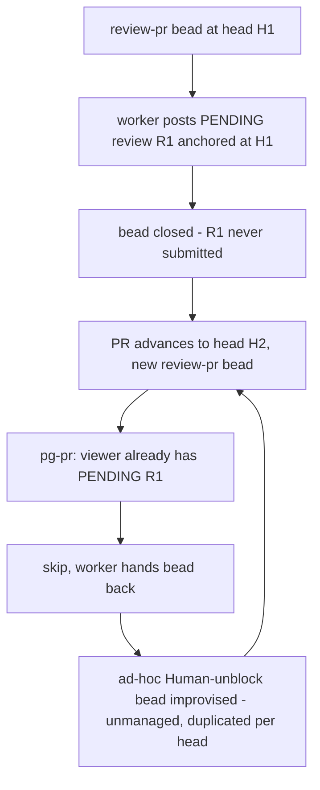
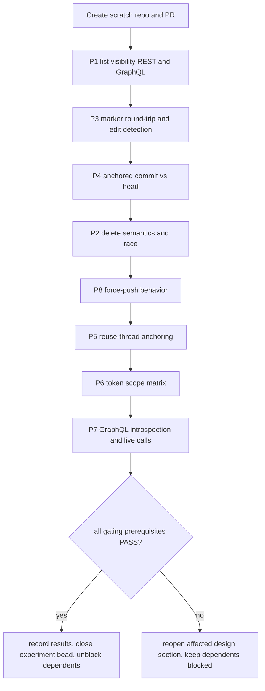
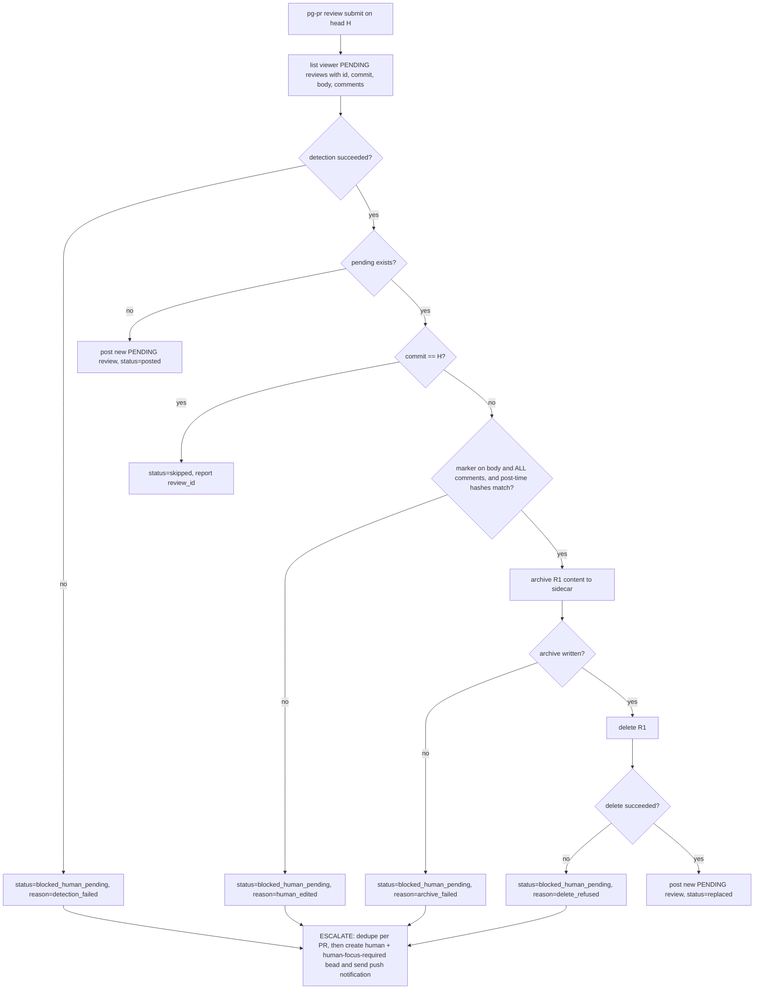

# Pending-review handling in pg-pr / pg-desk / pg-router: investigation and recommended design

- **Date**: 2026-09-29
- **Bead**: `pg2-kftf9.10` (P0 bug; parent epic `pg2-kftf9`; related `pg2-me72g`, `pg2-kftf9.8`)
- **Status**: RECOMMENDATION APPROVED by the operator (Phillip, 2026-09-29): delete-and-recreate (section 4.3), guarded by full agent authorship, unedited content, a different commit, and archive-before-delete. Prerequisites are NOT yet proven; section 2.3 is the binding proof plan. Nothing here authorizes implementation until the experiment bead (section 8, item 1) has passed. Section 8 lists proposed beads, which are NOT yet created.
- **Operator ruling (verbatim, 2026-09-29)**: "recommendation is good, make sure we can proove all of the pre-req. secondly, if we hit this stiaution and you can't remove it, then we need to escalte this so that i see it quicker." This supersedes the earlier draft's "dashboard state only" handling of an unremovable pending review.
- **Evidence legend**: **[doc]** = read from public GitHub docs on 2026-09-29; **[code]** = read from this repo or the ZR repo; **[PROVE]** = a prerequisite taken from memory or inference that MUST be demonstrated by the section 2.3 experiment, with captured evidence, before any implementation bead that depends on it is workable. A **[PROVE]** item is an assumption, not a fact.

## 1. Problem

The pg-router review worker is told to "Post a PENDING review (no approve/request-changes event)" **[code]** (`phillipg-nix-ziprecruiter/modules/zm/pg-router/review-prompt.txt`). Nothing ever submits that review. GitHub permits one PENDING review per user per PR, and `pg-pr review submit|post` refuses to post when one already exists **[code]** (`packages/pg-pr/cmd/pg-pr/review.go`, `postStaged` -> `skipExistingPendingReview`; detection in `pkg/provider/vcs/github/pending.go`, GraphQL `reviews(states:[PENDING])`, fail-closed).

Consequence: on the next head the worker cannot post, hands the bead back, and improvises a "Human: unblock stuck pending review" bead. `review-pr` beads never reach a terminal state.

Note the detection query returns only `author` and `state`: no review id, no commit, no comment count. The current code therefore cannot act on the review it detects.

## 2. GitHub API facts

### 2.1 REST **[doc]** (docs.github.com/en/rest/pulls/reviews)

| Operation       | Endpoint                               | Notes                                                                                                                        |
| --------------- | -------------------------------------- | ---------------------------------------------------------------------------------------------------------------------------- |
| List reviews    | `GET /repos/{o}/{r}/pulls/{n}/reviews` | Chronological, paginated (max 100). Docs state PENDING reviews lack `submitted_at`.                                          |
| Create review   | `POST .../pulls/{n}/reviews`           | `commit_id` optional (defaults to latest commit); `event` omitted = PENDING; `comments[]` with path/position (or line/side). |
| Get review      | `GET .../reviews/{id}`                 |                                                                                                                              |
| Update body     | `PUT .../reviews/{id}`                 | `body` required; updates the summary only, NOT inline comments.                                                              |
| Delete          | `DELETE .../reviews/{id}`              | "Deletes a pull request review that has not been submitted. Submitted reviews cannot be deleted."                            |
| Submit          | `POST .../reviews/{id}/events`         | `event` REQUIRED (`APPROVE`, `REQUEST_CHANGES`, `COMMENT`); omission is 422. `body` optional.                                |
| Dismiss         | `PUT .../reviews/{id}/dismissals`      | `message` required; applies to submitted reviews; on protected branches needs admin or dismiss-list membership.              |
| Review comments | `GET .../reviews/{id}/comments`        | Lets a tool inspect what a pending review contains.                                                                          |

Token: a fine-grained PAT needs **Pull requests: write** for create/update/delete **[doc]** (permissions table). No extra scope is documented for submit; it is expected to sit under the same permission **[PROVE: P6]**. Creation is documented as notification-triggering and subject to secondary rate limits.

Important gap **[PROVE: P1]**: the pg-pr code comment says the REST/`gh pr view --json reviews` list surfaces only SUBMITTED reviews and a PENDING review is invisible there (design section 2.6, Q2 cited in `pending.go`). The REST list docs do not say PENDING reviews of other users are hidden, but the practical rule is that only the review's author sees it. Because `GET .../reviews` called as the author is documented to include their own pending review with no `submitted_at`, the REST list is a candidate replacement for the GraphQL probe; this is proven by experiment P1 below.

### 2.2 GraphQL **[PROVE: P7 - docs not fetchable in this pass]**

Mutations believed to exist: `addPullRequestReview` (has `commitOID`, `threads`), `addPullRequestReviewThread` (takes `pullRequestReviewId` OR `pullRequestId`, plus `path`, `line`, `side`, `body`), `updatePullRequestReview`, `submitPullRequestReview` (`event` + `body`), `deletePullRequestReview`, `dismissPullRequestReview`. Every name, input field, and return field the implementation will use MUST be demonstrated by P7 (introspection plus live calls). Whether `addPullRequestReviewThread` on an existing pending review is anchored to that review's commit or to the PR's current head is the most important open fact for the reuse option (section 4.1), captured by P5.

### 2.3 Prerequisite proof plan

Operator ruling: every prerequisite of the approved recommendation MUST be PROVEN, not assumed. The experiment below is a hard gate.

Rules for the experiment (RFC 2119):

- It MUST run only against a throwaway repository owned by the operator, created for the purpose, on a PR opened by the same GitHub identity and token class that the router worker uses. It MUST NOT touch any real PR or real repository.
- Each prerequisite MUST have captured evidence: the exact command, the raw JSON response (redacted of tokens only), and a PASS or FAIL verdict recorded against the criteria below. A prerequisite with no captured evidence counts as FAIL.
- Results MUST be committed as a results section of this document (or a sibling results doc) by the experiment bead. A FAIL on any prerequisite MUST reopen the affected design section before any dependent implementation bead proceeds.
- Implementation beads that depend on any of P1 to P8 MUST be blocked by a real `bd` blocks edge on the experiment bead (not prose ordering), so they stay out of `bd ready` until it closes with all required prerequisites PASS.

Setup (shared): create scratch repo `S`; commit `base` on `main`; branch `feat` with commit `H1` touching `a.txt` (at least 3 lines) and open PR `#1`. Set `O=<owner> R=<S> N=1` and confirm the token identity with `gh api user --jq .login` (call it `ME`). Use the worker's real token, not the operator's interactive one, for every step (P6 depends on it).

| ID  | Prerequisite                                                                                                        | Experiment (throwaway repo only)                                                                                                                                                                                                                                                                                                                                                                                                                                                           | Evidence to capture                                                                                               | PASS criteria                                                                                                                                                                                                                                                         | FAIL consequence                                                                                                                             |
| --- | ------------------------------------------------------------------------------------------------------------------- | ------------------------------------------------------------------------------------------------------------------------------------------------------------------------------------------------------------------------------------------------------------------------------------------------------------------------------------------------------------------------------------------------------------------------------------------------------------------------------------------ | ----------------------------------------------------------------------------------------------------------------- | --------------------------------------------------------------------------------------------------------------------------------------------------------------------------------------------------------------------------------------------------------------------- | -------------------------------------------------------------------------------------------------------------------------------------------- |
| P1  | The author's own PENDING review is visible via list-reviews (REST and GraphQL), with id, commit, and state          | Create a pending review R1 by `POST /repos/$O/$R/pulls/$N/reviews` with `commit_id=H1`, a marker-stamped `body`, and two `comments[]` (no `event`). Then (a) `gh api repos/$O/$R/pulls/$N/reviews --paginate` as `ME`; (b) the same call with a second, different token (a collaborator) to test visibility; (c) GraphQL `pullRequest(number:1){ reviews(first:50, states:[PENDING]){ nodes{ id databaseId state author{login} commit{oid} body comments(first:50){ nodes{ body } } } } }` | Raw responses of (a), (b), (c) with `id`, `state`, `commit_id`/`commit.oid`, `submitted_at`, body                 | (a) contains R1 with `state=PENDING` and `commit_id=H1`; (c) returns the same review including `databaseId` that maps to the REST `id`; (b) does NOT contain R1 (author-only). Both REST and GraphQL are usable, or the FAIL states which one is the sole probe       | If REST hides it: keep GraphQL as the only probe. If GraphQL lacks `commit.oid` or comments: policy 1 needs another source; reopen section 5 |
| P2  | Delete semantics: a pending review can be deleted by its author's token; a submitted one cannot; delete is atomic   | (a) `gh api -X DELETE repos/$O/$R/pulls/$N/reviews/<R1.id>`, then re-list. (b) Create R2, submit it via `POST .../reviews/<id>/events -f event=COMMENT`, then attempt DELETE on it. (c) Create R3, submit it in one shell while a second shell DELETEs it, to observe the race. (d) Repeat (a) via GraphQL `deletePullRequestReview(input:{pullRequestReviewId:$id})`                                                                                                                      | HTTP status and body for each call, the list before and after                                                     | (a) 2xx and R1 absent from both REST and GraphQL lists, its comments gone; (b) 4xx/422 and R2 remains; (c) exactly one of submit or delete wins with a clear error on the loser; (d) GraphQL delete also removes it                                                   | If delete is refused or partial: the recommendation cannot execute; go straight to the escalation path for every stale pending review        |
| P3  | Agent-marker detection works on the body AND every comment, and human edits are detectable                          | Create R1 with a body carrying the marker and two inline comments carrying it (use the real `marker.Stamp` output). Via the API read back body and each comment (`GET .../reviews/<id>/comments`, and the GraphQL comment nodes). Then edit one comment in the web UI (removing the marker) and, separately, edit another comment keeping the marker but changing text. Re-read both. Also add a third comment in the web UI with no marker                                                | The read-back body and comment bodies before and after each edit; screenshots or UI notes of the edits            | Marker is present verbatim in the API read-back of body and all comments; the marker-removed and added-unmarked cases are flagged as not fully marked; the text-only edit is detectable only through the post-time hash comparison (records whether the hash differs) | If the marker does not round-trip: the guard is unusable and the design MUST rely on hash comparison alone; reopen policies 3 and 4          |
| P4  | The review's anchored commit field vs the PR head is readable and comparable                                        | With R1 anchored at H1, push commit H2 to `feat`. Read `commit_id` (REST) and `commit{oid}` (GraphQL) of R1 and the PR `head.sha`. Then create R1b via REST without `commit_id` after H2 and read its anchor                                                                                                                                                                                                                                                                               | R1's `commit_id` after H2, PR `head.sha`, R1b's `commit_id`                                                       | R1 still reports H1 while head is H2 (so `commit != head` detects staleness), and R1b defaults to H2                                                                                                                                                                  | If the field follows head or is null: the stale check MUST use the stage sidecar's recorded head instead; reopen policy 3                    |
| P5  | Reuse option facts: can a thread on an old pending review target the new head, and where does it anchor?            | With R1 (anchored H1) still pending after H2 is pushed (H2 adds a line to `a.txt` that does not exist at H1), call GraphQL `addPullRequestReviewThread(input:{pullRequestReviewId:$id, path:"a.txt", line:<H2-only line>, side:RIGHT, body:"t"})`. Read back the thread and its comment `commit`/`originalCommit`                                                                                                                                                                          | The mutation response, and the thread's `commit.oid` and `originalCommit.oid`                                     | Records the observed behavior: anchors to H1, anchors to H2, or errors. Either outcome is a valid PASS of the experiment (it settles section 4.1); a missing observation is FAIL                                                                                      | None for the recommendation; the observation is recorded so section 4.1 is decided on evidence                                               |
| P6  | Token scope: the exact permissions the worker's token needs for list, create, delete, submit, and GraphQL mutations | Repeat P1 (list, create) and P2 (delete, submit) with a fine-grained PAT granted ONLY `Pull requests: read`, then `Pull requests: write`, on the scratch repo; and once with the classic-scope equivalent the worker actually uses. Include the GraphQL `deletePullRequestReview` call under each                                                                                                                                                                                          | Per token, a table of call, HTTP status, and the response error text                                              | The documented minimal permission (write on pull requests) succeeds for all calls and read-only fails for create, delete, and submit. The minimum grant is recorded verbatim for the module docs                                                                      | If the worker's token lacks the permission: the token grant MUST change before implementation; file that as a prerequisite bead              |
| P7  | GraphQL mutation details: exact names, input, and return fields used by the implementation                          | Run schema introspection on the scratch repo's API for `deletePullRequestReview`, `submitPullRequestReview`, `updatePullRequestReview`, `addPullRequestReviewThread`, `addPullRequestReview`: `gh api graphql -f query='{ __type(name:"DeletePullRequestReviewInput"){ inputFields{ name type{ name kind } } } }'` and the equivalents. Then exercise each one used by the design once on the scratch PR                                                                                   | Introspection output and one successful live call per mutation, plus the returned `pullRequestReview{ id state }` | Each mutation the implementation uses exists, its required input fields are the ones assumed, and the live call returns the expected fields                                                                                                                           | Any missing or renamed mutation: fall back to REST for that operation if P2 passed, else reopen the design                                   |
| P8  | Behavior after force-push: what happens to R1 and its comments when H1 is removed from the PR                       | With R1 pending at H1 (two comments), `git push --force` `feat` to a different commit H1' so that H1 is no longer on the PR. Re-list R1 (REST and GraphQL), read its comments and their `outdated`/`position`/`commit` state, then try (a) DELETE R1, (b) submit R1 as `COMMENT`, on separate copies of the scenario                                                                                                                                                                       | Post-force-push list output, comment states, and the HTTP result of DELETE and of submit on separate copies       | Records whether R1 remains listed, whether its comments are outdated or dropped, and that DELETE still succeeds (required for the recommendation); submit behavior is recorded but not required                                                                       | If R1 becomes undeletable or invisible after a force-push: that case is an unremovable pending review and MUST take the escalation path      |

Additional observation, not a gate: record whether the pending review appears to the author in the web UI as "Finish your review" and whether the operator can hand-edit its comments there (this is what P3's UI edits rely on).

## 3. Constraints from the operator workflow

- The operator's intent is review-then-submit: the agent drafts, a human MAY edit in the GitHub UI, then submits. Any automatic action on a pending review is therefore a potential destruction of human edits.
- The current detection path is described as protecting "a pending review a human has started editing" **[code]** (`pending.go` doc comment). That protection MUST be preserved or replaced by an explicit provenance check.
- Provenance signal: pg-pr stamps agent-authored review bodies and comments with a marker **[code]** (`marker.Stamp`). A tool MUST NOT delete or submit a pending review unless the marker is present in its body and all of its comments (an unmarked or partly-edited review is human territory).

## 4. Options

### 4.1 Reuse and extend

Keep R1; on a new head, add threads for the new head's findings to R1 (`addPullRequestReviewThread`), optionally update the body.

- Pro: one draft per PR for the operator to finish; no destruction; matches the "one pending review" GitHub rule.
- Con: R1 already contains stale findings anchored at H1; the reviewer for H2 would have to reconcile old comments (delete individual ones is not possible via the documented REST surface; per-comment deletion of pending comments **[PROVE: P5]**). Anchoring to H1 vs H2 is unknown (P5). Accumulates across many heads into an unreadable review. Agent must first fetch R1's comments to avoid duplicates.
- Verdict: fragile; only viable if P5 shows threads anchor to current head AND stale comments can be removed. NOT recommended as the default.

### 4.2 Submit old, then new

Submit R1 (as `COMMENT`, never approve/request-changes), then post R2 for H2.

- Pro: preserves the old findings on the PR as a real, timestamped review; unblocks immediately.
- Con: publishes findings the operator never approved, possibly stale, to teammates (notifications). This defeats review-then-submit and MUST NOT be done unattended. Findings at H1 that no longer apply become public noise.
- Verdict: reject as an automatic behavior. MAY be exposed as an explicit operator verb (`review submit-pending`) for the case where the operator wants it.

### 4.3 Delete and recreate

If R1 is provably agent-authored (marker on body and every comment) and unedited, delete it and post R2.

- Pro: fully unblocks; the operator sees exactly one current draft; no publication of stale text; simple to implement (`DELETE .../reviews/{id}` is documented for exactly this case).
- Con: destroys human edits if the provenance check is wrong; loses findings the operator has not yet read (mitigation: archive R1's body and comments into the bead comment or pg-pr staging store before deleting, so the deletion is reversible in effect).
- Verdict: **RECOMMENDED and APPROVED by the operator (2026-09-29)** as the default, guarded by (a) marker on all content, (b) head-advanced check (R1's commit != bead's `head_sha`), (c) archive-before-delete, (d) never when R1 has any unmarked or edited content. Approval is conditional on the section 2.3 prerequisites being proven (P1 to P8); until then it is approved as a design, not as workable implementation. When a guard fails, the review is NOT removed and the situation is escalated (section 5).

### 4.4 Leave and comment

Leave R1 alone; post new findings as an ordinary (non-review) PR comment or a body-only review.

- Pro: zero destruction; no wedge, since a top-level comment (`POST /issues/{n}/comments`) is not a review and is not subject to the one-pending rule.
- Con: loses inline anchoring for the new head; the operator now has a stale draft plus an out-of-band comment; publishes immediately (a comment is not a draft), so it also breaks review-then-submit.
- Verdict: do NOT publish. When 4.3's guards fail (R1 is human-edited), leave R1 untouched and ESCALATE (section 5): a single deduplicated `human` + `human-focus-required` bead plus a push notification. A passive bead comment or dashboard flag alone is not sufficient (operator ruling, 2026-09-29).

### 4.5 Comparison

| Criterion                    | Reuse+extend          | Submit old, then new | Delete+recreate                       | Leave+comment      |
| ---------------------------- | --------------------- | -------------------- | ------------------------------------- | ------------------ |
| Unwedges the flow            | yes, if P5 favorable  | yes                  | yes                                   | yes                |
| Preserves review-then-submit | yes                   | no                   | yes                                   | no                 |
| Risk to human edits          | low                   | none (published)     | medium; mitigated by provenance guard | none               |
| Stale findings exposed       | in draft only         | published            | none                                  | none               |
| Unattended safe              | uncertain             | no                   | yes, guarded                          | yes, but publishes |
| API certainty                | low (P5, P7 unproven) | medium (P2, P6)      | medium until P1 to P8 pass            | medium (P6)        |

## 5. Recommended design (APPROVED 2026-09-29; workable only after section 2.3 passes)

Statuses emitted by `pg-pr review submit` on this path:

| Status                  | Meaning                                                                                           | Bead outcome                                                    | Operator visibility                                                           |
| ----------------------- | ------------------------------------------------------------------------------------------------- | --------------------------------------------------------------- | ----------------------------------------------------------------------------- |
| `posted`                | No pending review existed; new PENDING review created                                             | terminal (close)                                                | dashboard                                                                     |
| `skipped`               | Pending review already at this head (idempotent re-run)                                           | terminal (close)                                                | dashboard                                                                     |
| `replaced`              | Stale, fully agent-authored, unedited pending review archived and deleted; new review posted      | terminal (close)                                                | dashboard                                                                     |
| `blocked_human_pending` | Stale pending review could NOT be removed (human-edited, delete refused, or guard/detection fail) | bead released ONCE with a marker; NOT retried on the same state | ESCALATED: one `human` + `human-focus-required` bead per PR AND a push notice |

Policies (RFC 2119):

1. `pg-pr` MUST resolve the viewer's pending review to a structured record (id, commit SHA, body, per-comment markers) instead of a boolean.
2. When the pending review's commit equals the head being reviewed, `pg-pr review submit` MUST skip and report `status: skipped, reason: pending_review_exists_same_head` with the `review_id`, and the worker MUST treat that as success (close the bead), not as a hand-back.
3. When the pending review is stale (different commit), fully marker-stamped, and unedited by the post-time-hash check, `pg-pr` MUST archive it, then delete it, then post the new review. It MUST emit `status: replaced` with old and new ids. It MUST NOT delete if the archive write failed.
4. When the pending review contains any unmarked or edited content, or the delete is refused, or the archive fails, or detection fails, `pg-pr` MUST NOT modify the review and MUST emit `status: blocked_human_pending` with a `reason` and the review URL.
5. Escalation (operator ruling, 2026-09-29). On every `blocked_human_pending`, the system MUST raise exactly ONE escalation per PR, consisting of (a) a bead labeled `human` AND `human-focus-required` naming the PR, the pending review URL, the reason, and the head involved, and (b) a push notification to the operator. The escalation:
   - MUST be deduplicated per PR: before creating, the system MUST look for an open escalation bead for that PR (by a stable per-PR key, e.g. a label or title key) and, if found, MUST add a comment or bump instead of creating a second bead and MUST NOT resend the push notification more often than a stated re-notify interval;
   - MUST be raised by the deliberate code path (`pg-pr` or the router integration), not improvised by the worker in prose;
   - MUST be closed or superseded automatically once the pending review is gone or resolved (the next `posted`, `skipped`, or `replaced` for that PR MUST close the escalation bead);
   - MUST fail loudly: if the bead or the notification cannot be delivered, the failure MUST itself be surfaced (non-zero exit and a log line), never swallowed.
6. `pg-pr` SHOULD offer explicit operator verbs: `review pending [--json]` (inspect), `review discard-pending` (delete, marker guard overridable by `--force`), `review submit-pending --event COMMENT` (section 4.2 as a manual action). Automatic paths MUST NOT submit.
7. `pg-pr` MUST NOT delete or submit anything when detection fails (retain current fail-closed behavior); detection failure is itself an escalation trigger per policy 4 and 5.
8. The review prompt MUST stop instructing workers to hand back on skip. It SHOULD say: on `skipped` (same head) close the bead; on `replaced` close the bead; on `blocked_human_pending` do NOT create a bead of its own, record a bead comment, and release the bead ONCE (the escalation in policy 5 is raised by the tool).
9. The improvised "Human: unblock stuck pending review on PR #N" bead MUST remain retired as an ad-hoc, worker-improvised pattern. It is replaced by the single, deliberate, deduplicated escalation of policy 5, which carries the `human-focus-required` label so the operator sees it quickly.
10. Bead lifecycle: a `review-pr` bead MUST reach a terminal state whenever pg-pr reports `posted`, `skipped`(same head), or `replaced`. A newer head MUST supersede an older open `review-pr` bead for the same PR (close the older as superseded) rather than queueing beside it (coordinate with `pg2-kftf9.8`).
11. pg-desk SHOULD display, per PR, whether a pending agent review exists, its commit, whether it is stale relative to head, and whether an escalation is open, using the same structured record as (1). The dashboard is an addition to, never a substitute for, the escalation.

Archive location: the pending review's body and comments SHOULD be written to pg-pr's staging directory (`reviewstage`) as a sidecar keyed by repo, PR and review id, so deletion is recoverable without the GitHub API.

## 6. Risks

- Provenance false positive: an operator edits a comment text but the marker survives. Mitigation: archive-before-delete; also compare comment bodies with the archived original hash recorded at post time (MUST store the post-time hash in the stage sidecar and treat any mismatch as human-edited, which escalates). P3 records whether text-only edits are otherwise detectable.
- Race: the operator submits R1 between detection and delete. Delete then 4xx/422s ("submitted reviews cannot be deleted"); pg-pr MUST treat that as `blocked_human_pending` (reason `delete_refused`) and re-list once before escalating, not retry blindly. P2(c) measures this race.
- Concurrent reviewers running as the same GitHub user (two router workers). Delete-and-recreate could clobber a sibling's fresh pending review; the same-head skip (policy 2) plus commit comparison covers this.
- Unproven prerequisites: the design's safety rests on P1 to P8 (section 2.3). Implementing before they pass risks deleting the wrong content or wedging again. Mitigation: dependent implementation beads are blocked by a real `bd` blocks edge on the experiment bead.
- Escalation fatigue or silence: a noisy escalation trains the operator to ignore it; a lost one recreates today's invisible wedge. Mitigation: per-PR deduplication with a re-notify interval, automatic closure when resolved, and loud failure when delivery fails (policy 5).
- Escalation storm on a systemic failure (for example a token that lost delete permission would escalate every PR). Mitigation: the escalation SHOULD group by reason and raise a single rolled-up bead when more than a small threshold of PRs share the same non-human reason (`delete_refused`, `detection_failed`); the threshold is set in the escalation bead's design.
- Public-repo constraint: this repo is public; the escalation and docs here MUST stay generic and config-driven (no organization-specific identifiers).

## 7. Decisions

Settled by the operator on 2026-09-29:

1. Delete-and-recreate with provenance guard and archive is the default for stale, fully agent-authored pending reviews: APPROVED.
2. Prerequisites MUST be proven by experiment before dependent work proceeds: APPROVED as a hard gate (section 2.3).
3. An unremovable stale pending review MUST be escalated so the operator sees it quickly: APPROVED (policy 5 of section 5). The dashboard-only alternative is withdrawn.

Still open (low stakes, default stated):

4. Whether a same-head pending review counts as "review done" for bead-terminal purposes even though it is unsubmitted. Default in this design: yes (policy 2); the operator MAY overrule.
5. The push-notification channel and re-notify interval for escalations. Default: reuse the operator's existing push channel; interval to be set in the escalation bead.

## 8. Proposed implementation beads (NOT created)

Ordering rule: bead 1 is the prerequisite-proof experiment. Beads 2 through 9 depend on P1 to P8 and MUST each be blocked by a real `bd` blocks edge on bead 1 (prose ordering is not sufficient); none is workable until bead 1 is closed with every gating prerequisite PASS.

1. **Experiment: prove pending-review prerequisites on a scratch repo** - execute P1 to P8 from section 2.3 on a throwaway repo with captured evidence and PASS/FAIL verdicts; commit results to this doc or a sibling results doc. Blocks beads 2 to 9.
2. **pg-pr: structured pending-review lookup** - replace `HasPendingReviewByViewer` boolean with a record (id, commit, body, comments, markers); keep fail-closed; add `review pending --json`. (Depends on P1, P3, P4, P7.)
3. **pg-pr: stale-pending replace path** - implement archive + delete + repost with marker/commit/hash guards and `status: posted|skipped|replaced|blocked_human_pending` with reasons in `postStaged`. (Depends on P2, P3, P4, P8.)
4. **pg-pr: post-time hash sidecar** - record hashes of posted body/comments in reviewstage so human edits are detectable. (Depends on P3.)
5. **Escalation path for unremovable pending reviews** - on every `blocked_human_pending`, raise one deduplicated-per-PR `human` + `human-focus-required` bead and a push notification; auto-close when resolved; loud failure on delivery error; rolled-up handling for systemic reasons (section 6). Includes tests for dedupe, re-notify interval, and auto-close. (Depends on bead 3's status contract and on P2/P8 for the refusal cases.)
6. **pg-pr: operator verbs** - `review discard-pending` and `review submit-pending --event COMMENT` with tests. (Depends on P2, P6, P7.)
7. **pg-router review prompt + bead lifecycle (ZR repo)** - update `review-prompt.txt` to the new statuses, retire the improvised Human-unblock bead pattern in favor of the tool-raised escalation; supersede older `review-pr` beads for the same PR (coordinate `pg2-kftf9.8`). (Depends on beads 3 and 5.)
8. **pg-desk: pending-review state on the dashboard** - show pending agent review, its commit, staleness, and open escalation per PR. (Depends on bead 2 and bead 5.)
9. **Cleanup: existing stuck beads** - one-shot operator-run remediation of the 7 stale `.2` review-pr beads and the improvised Human-unblock beads once the replace path and escalation land. (Depends on beads 3, 5, 7.)
