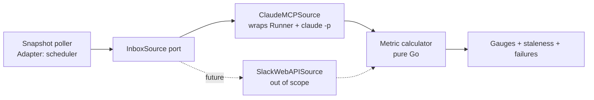

# Slack work-day metrics (unread, mentions and DMs, needs-reply) - design

Status: design for operator review (bead `pg2-mww6m`, 2026-09-30). No implementation bead has been
filed and none MUST be filed before the operator signs off on the final section.

Like the other files under `docs/superpowers/specs/`, this file is an extraction source, not a
durable citation target: derive an ADR if any decision here needs to outlive the implementation.

The key words MUST, MUST NOT, SHOULD, SHOULD NOT and MAY are used as in RFC 2119.

## 1. Scope and operator decisions

These were recorded on the bead by the operator (Phillip, 2026-09-29) and are binding here.

- Scope is the operator work Slack workspace only (this public repo does not name it).
- Three counts: raw unread, unread mentions and DMs, and needs-reply (a heuristic is accepted).
- Access path: no Slack API key or OAuth token is available, so the Web API is out of scope.
  Slack is read through `pg-connector-thread-slack`, which wraps `claude -p`. The data source MUST
  sit behind an interface so a Web API source can replace it later.

Non-goals: Web API or OAuth work; implementation beads; the macOS Dock-badge route (rejected on the
bead: version-fragile, cannot separate unread from needs-reply).

## 2. Owning repo

The design, and later the code, MUST live in `phillipgreenii-nix-agent-support`.

- The data source `pg-connector-thread-slack` and the `pg-connector` umbrella are in this repo
  (`packages/pg-connector/`), and so are the metrics emitter conventions (`packages/pg-router`,
  OTel as the default metrics transport).
- The `thread` backend is generic: it resolves no credential and reads whatever Slack MCP the
  machine's `claude` has. "one work workspace only" is therefore a property of the machine
  registration, not of the code. That registration (`connector.thread = [ ... ]` and the workspace
  scoping config) belongs in the consuming machine flake, `phillipg-nix-ziprecruiter`, exactly as
  `home/programs/pg-connector/default.nix` already leaves `connector.thread` empty by default.
- Rejected alternative: placing the exporter in `phillipgreenii-nix-personal`. It would need a
  second copy of the claude-p transport or a cross-repo dependency on a connector that already
  lives here.
- Beads for this work MUST carry the labels `agent-support` and `pg-connector` (repo `CLAUDE.md`,
  "Beads Labels").

## 3. Metric definitions

All three are gauges describing the state at the time of one snapshot. Inputs are per-conversation
facts reported by the data source (section 5); the counts MUST be computed in Go from those facts,
never by the model. This keeps the existing compute-only rule of `pg-connector-thread-slack`
(`internal/backend.go`: the model reports plain facts only).

Definitions used below. A conversation is a channel, a 1:1 DM, or a group DM in the operator work workspace of
which I am a member. A muted conversation is one I muted in Slack.

### 3.1 Raw unread (`unread_messages`)

The sum, over all non-muted conversations, of the number of messages after my Slack read marker.

- Includes messages from bots and channel broadcasts; it is the "raw" figure by design.
- Excludes muted conversations (Slack does not badge them). Whether to include them is an open
  point (section 9).
- Counts messages, not conversations.

### 3.2 Unread mentions and DMs (`unread_mentions_dms`)

The sum of two terms, with no message counted twice:

- the number of unread messages in 1:1 DMs and group DMs (all of them, mention or not); plus
- the number of unread messages in channels that mention me directly, as Slack's own per-
  conversation mention count reports it.

A DM message that also mentions me is counted once, in the first term. `@channel` and `@here`
broadcasts are NOT mentions for this metric (they are already in 3.1). It is always less than or
equal to 3.1 for the same snapshot, which gives a cheap consistency check (section 6).

### 3.3 Needs-reply (`needs_reply`)

The Web API has no "needs a reply" state, so this is a heuristic. Count conversations (not
messages) such that all of the following hold:

1. Kind is a 1:1 DM, a group DM, or a thread (in any channel) in which I was mentioned, started, or
   already replied.
2. The last message in the conversation or thread was not written by me.
3. The last message was not written by a bot or a system event (join, leave, topic change).
4. The last message is not older than the horizon (default 14 days, configurable); older items are
   treated as abandoned.
5. I have not reacted to the last message with an acknowledging reaction. This clause is optional
   and applies only if the source can supply reaction data (open point).

Plain channel traffic that does not involve me is excluded by clause 1.

Known failure cases (the heuristic is wrong in these, and the operator accepts that):

| Direction      | Case                                                                                      |
| -------------- | ----------------------------------------------------------------------------------------- |
| False positive | The last message is a courtesy ("thanks", "sounds good", a bare emoji) needing no reply.  |
| False positive | The question was answered somewhere else: another channel, a call, in person, email.      |
| False positive | Someone else in a group thread already answered on my behalf.                             |
| False positive | An FYI or announcement DM that expects no response.                                       |
| False positive | I replied by reacting, and clause 5 is disabled or the source lacks reaction data.        |
| False negative | I wrote the last message ("will look into it") but still owe an answer or action.         |
| False negative | The request was a channel message that mentions me through a user group, not my handle.   |
| False negative | The request is older than the horizon.                                                    |
| False negative | A thread reply to a thread I have not touched and that does not mention me.               |
| Either         | The last message was edited or deleted after the snapshot; the next snapshot corrects it. |

Because of this, `needs_reply` MUST be documented to consumers as an estimate, and the dashboard
label SHOULD say so.

## 4. Data source and the existing `thread` backend

### 4.1 What exists

Verified in `packages/pg-connector/cmd/pg-connector-thread-slack/`:

- `runner.go` execs `claude -p --output-format json --max-turns 6 --allowed-tools mcp__slack`, with
  the prompt on stdin and `--json-schema <schema>` appended per call (the pg2-vkj77 fix, commit
  `423b578c`). No `--model` pin and no MCP-config flag.
- `backend.go` implements `thread.Provider` (`Show`, `List` only). Each call decodes the outer
  `--output-format json` envelope (`result`, `is_error`) and then the inner reply. A transport
  failure, `is_error: true`, or a decode failure all map to `ErrUnavailable`.
- `schema.Thread` carries `id, channel, permalink, started_by, participants, last_reply_at,
reply_count, text, mentions_me, as_of, stale`. It has NO unread count, NO DM-versus-channel
  kind, NO read marker, and NO last-message author.
- `List` fans out per query modifier and always returns `Truncated: true`, so it can never prove
  completeness.

Consequence: the existing `thread` capability cannot produce any of the three metrics. Raw unread
and needs-reply need facts the schema lacks; mentions-and-DMs is only partly there (`mentions_me`
is thread-scoped and boolean). The design therefore needs a new, narrow read capability (section 5)
rather than a reuse of `thread.List`. The transport (`Runner`) and the envelope handling MUST be
reused.

### 4.2 The pg2-vkj77 failure and how this design handles it

pg2-vkj77: with no Slack MCP configured, `claude -p` answered in prose ("No Slack MCP tools are
available..."), the envelope decoded, and the inner decode failed with `invalid character 'I'/'N'`
on every poll. The fix forced `--json-schema` so the final answer always conforms.

That fix creates a second hazard this design MUST handle: by the bead's own close reason, with the
tool impossible the model returns a schema-conformant empty reply (`{"items":[]}`). For a metrics
feed an empty reply is indistinguishable from "inbox zero", so a missing Slack MCP would export
zeros. Handling, in layers:

1. Keep `--json-schema` on every call (already landed for the thread backend; the new capability's
   schema MUST also be passed).
2. The reply schema MUST make a canary field required, `slack_tools_used` (boolean, true only if the
   model actually called a Slack tool). The Go side MUST treat `false` as `ErrUnavailable`.
3. The envelope `is_error`, transport error, schema decode error, and a failed consistency check
   (3.2 greater than 3.1) all map to `ErrUnavailable`, never to a partial snapshot.
4. On `ErrUnavailable` the exporter MUST NOT export zeros. It keeps the last good gauge values,
   exposes the snapshot age, and increments a failure counter (section 7).
5. After consecutive failures the poll interval SHOULD back off (for example doubling up to a cap)
   so a persistent misconfiguration does not burn cost. Backoff parameters are open (section 9).
6. Precondition: a Slack MCP (or equivalent connector) MUST be available to `claude -p`. On
   2026-08-27 `claude mcp list` reported zero servers, and pg2-vkj77 reproduced the same absence.
   The first implementation step MUST be a live probe that proves a Slack tool call works; this
   design cannot verify it, because no live Slack access was used to write it.

The post-deploy verification of the pg2-vkj77 fix was gated as pg2-rmalx, which appears closed in
the dependency listing; its outcome was not re-read here.

### 4.3 Timeout risk

`pkg/scriptout/limits.go` sets `DefaultExecTimeout = 30s`, and `serve.go` applies it to the backend's
per-request context, which the `claude -p` exec inherits. A multi-turn `claude -p` that calls a
Slack tool plausibly exceeds 30 seconds. The code does not show a per-backend override. The
implementation MUST measure the real latency and, if needed, raise the bound for this backend. This
is stated as a risk, not a measured fact.

## 5. Data-source interface

Pattern: Strategy behind a Port (hexagonal). The exporter depends only on the port; `claude -p` is
one adapter.



Proposed port, as a sketch (names are proposals, not existing symbols):

```go
// InboxSource returns per-conversation facts for the work workspace.
// It MUST return an error rather than an empty snapshot when the
// underlying system could not be read.
type InboxSource interface {
	Snapshot(ctx context.Context) (*InboxSnapshot, error)
}

type ConversationFacts struct {
	ID                string // stable conversation id
	Kind              string // "dm", "group_dm", "channel", "thread"
	Muted             bool
	UnreadCount       int
	UnreadMentions    int  // direct @me only
	LastAuthorIsMe    bool
	LastAuthorIsBot   bool
	LastMessageAtUnix int64
	InvolvesMe        bool // started, replied, or mentioned
	AckedByMe         bool // optional; false when unsupported
}

type InboxSnapshot struct {
	AsOf          time.Time
	Conversations []ConversationFacts
}
```

Rules:

- The calculator takes `InboxSnapshot` and applies section 3; adapters MUST NOT compute metrics.
- A Web API adapter would fill the same facts from the conversation read state; nothing downstream
  changes. That adapter is out of scope and MUST NOT be built now.
- The port is a new capability alongside `thread` in `packages/pg-connector/pkg/provider/`. Whether
  it is a new capability (new `pkg/schema` type, dispatch table, registry key) or an additive
  extension of `thread` is an open point, because the umbrella's registry and conformance suite
  treat each capability as a closed set.

## 6. Polling cadence and cost per poll

### 6.1 Cadence

- The exporter MUST own its own schedule. `pg-router`'s default tick is `PollInterval: 10s`
  (`internal/config/config.go`, overridable with `PG_ROUTER_POLL_INTERVAL`), which is far too
  frequent for an LLM-backed call and MUST NOT be the trigger by default.
- Proposed default: one snapshot every 15 minutes during working hours (10 hours, Monday to
  Friday) and none outside them. The operator confirms the window (section 9).
- A single in-flight poll at a time; a poll that is still running when the next tick fires MUST
  cause the tick to be skipped, not queued.

### 6.2 Cost per poll (estimate; unmeasured)

Method: the repo holds no recorded cost for this call, and no live Slack access was used. The
figures below are a back-of-envelope estimate built from stated assumptions. Each assumption MUST be
replaced by a measured value before acceptance; the `--output-format json` envelope carries
cost/usage accounting (per the `runner.go` doc comment), but `claudeEnvelope` currently decodes only
`result` and `is_error`, so the implementation MUST add decoding of the usage fields it uses.

Assumptions:

- A1: a fresh `claude -p` session carries about 18,000 input tokens of system prompt and tool
  definitions on each turn.
- A2: 3 turns (call the Slack tool, receive its result, answer); `--max-turns 6` is the cap.
- A3: the Slack tool result is 40 conversations at about 120 tokens each.
- A4: the final JSON answer is about 1,500 output tokens, and each tool-call turn about 200.

Arithmetic:

- Tool result tokens: 40 x 120 = 4,800.
- Input per turn: turn 1 = 18,000; turn 2 = 18,000 + 200 = 18,200;
  turn 3 = 18,000 + 200 + 4,800 = 23,000.
- Input per poll: 18,000 + 18,200 + 23,000 = 59,200 tokens (much of it prompt-cache reads, if the
  cache is warm).
- Output per poll: 200 + 200 + 1,500 = 1,900 tokens.
- Polls per day: 10 hours x 4 per hour = 40.
- Tokens per day: 40 x 59,200 = 2,368,000 input; 40 x 1,900 = 76,000 output.
- Tokens per five-day week: 5 x 2,368,000 = 11,840,000 input; 5 x 76,000 = 380,000 output.

Converting to money needs the active model's rates, which the backend does not pin, so no dollar
figure is given here. The measured per-poll `total cost` from the envelope, multiplied by 40,
replaces it. The operator MUST accept a daily budget before implementation (section 9). Cost scales
roughly linearly with polls per day and with the number of conversations returned.

## 7. Export

- Transport: OTel metrics, the repo's declared default (`packages/pg-router/internal/metrics`:
  "OTel is the default emission transport for metrics only", sink is a deployment binding).
  `pg-router` already offers an opt-in Prometheus `/metrics` listener via `--metrics-addr`
  (default off). Whether the exporter embeds its own listener or pushes OTLP is an open point.
- Names (proposed; labels MUST be low cardinality, with no channel names or user ids):

| Metric                                     | Type    | Meaning                          |
| ------------------------------------------ | ------- | -------------------------------- |
| `workday_slack_unread_messages`            | gauge   | 3.1                              |
| `workday_slack_unread_mentions_dms`        | gauge   | 3.2                              |
| `workday_slack_needs_reply`                | gauge   | 3.3 (heuristic)                  |
| `workday_slack_snapshot_timestamp_seconds` | gauge   | `AsOf` of the last good snapshot |
| `workday_slack_poll_failures_total`        | counter | `ErrUnavailable` outcomes        |

- On failure the three gauges MUST keep their last good value, and consumers detect staleness by
  `time() - workday_slack_snapshot_timestamp_seconds`. This is the same "failing xN / stale
  duration" idea `pg-router` uses for its own `pg_router_source_failures`.
- No message text, channel names, or user identifiers MUST be exported or logged by the metrics
  path; only counts.

### Consistency with the sibling brainstorms

The siblings are `pg2-0a0wm` (git repos/branches/worktrees exporter) and `pg2-j9new` (Claude Code
asks metrics). Both are still open and deferred with no decided design, so there is nothing decided
to conform to. This design therefore proposes shared conventions for the three to adopt:

- the `workday_<source>_` metric prefix (`workday_git_`, `workday_asks_`);
- gauges for point-in-time state, plus a `_snapshot_timestamp_seconds` gauge and a failure counter
  per source;
- each exporter owns its cadence, and none runs on the pg-router tick;
- an exporter that cannot read its source reports staleness, never zero.

If the siblings later choose differently (for example a log file instead of OTel), this section is
the one to amend. The sibling beads place the Slack brainstorm in another tracker, but
it was migrated to this tracker (note on `pg2-mww6m`, 2026-09-29), so cross-references
should use the `pg2-` ids above.

## 8. Failure and security properties

- Compute-only: the model MUST NOT classify, summarize, or judge. Its output is only the fields of
  `ConversationFacts`.
- The `claude -p` call is pre-approved for `mcp__slack` tools only (existing `--allowed-tools`),
  and the backend resolves no credential of its own.
- The prompt MUST ask for read operations only. The new adapter MUST NOT receive any write-capable
  tool allowance.
- Message content passes through the model provider as part of the `claude -p` call. This is the
  accepted consequence of the operator's chosen access path; the operator SHOULD confirm that this
  is acceptable for the work Slack content (open point).

## 9. For operator review

Open points. None blocks the design; each needs a ruling before an implementation bead is filed.

1. New capability versus extending `thread`: section 5 recommends a new narrow capability; the
   registry and conformance suite treat capabilities as closed sets, so confirm.
2. Precondition: is a Slack MCP (or connector) actually available to `claude -p` on this machine
   today? On 2026-08-27 there were none. If not, the first deliverable is making that so, outside
   this design.
3. Cadence and window: 15 minutes, 10 hours, weekdays only (section 6.1) - accept or change.
4. Cost budget: accept a daily token or dollar ceiling once per-poll cost is measured (6.2).
5. Muted conversations: excluded from raw unread by this design; include them?
6. Needs-reply: horizon (14 days), whether to treat reactions as acknowledgement (needs reaction
   data from the source), and whether thread participation without a mention counts.
7. The 30 second exec timeout (4.3): may the new backend raise its own bound?
8. Export transport: embedded Prometheus listener versus OTLP push, and the final metric prefix
   (`workday_`), which the two siblings must also adopt.
9. Single call versus two calls per poll (unread state, then last-author detail for candidates),
   trading cost against payload size.
10. Whether message content reaching the model provider is acceptable for the work Slack data.
11. Failure backoff parameters (section 4.2, item 5).
12. Whether the machine-side registration is a separate bead in `phillipg-nix-ziprecruiter`.

Next step after sign-off: file implementation beads (not done here).
