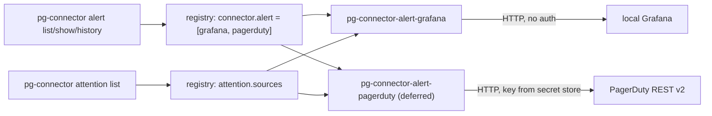

# pg-connector `alert` entity (Grafana and PagerDuty backends, implements attention) - design

Status: design for operator review (bead `pg2-k3lxs`, 2026-10-01). No implementation bead has been
filed; section 12 lists the proposed set for the orchestrator to file.

Like the other files under `docs/superpowers/specs/`, this file is an extraction source, not a
durable citation target. Section 11 names the ADR and behavior-docs changes that carry the durable
decisions.

The key words MUST, MUST NOT, SHOULD, SHOULD NOT and MAY are used as in RFC 2119.

## 1. Scope and binding rulings

The operator rulings recorded on the bead (Phillip, 2026-10-01, three rounds) are binding and are
NOT re-opened here. In summary:

- `alert` is a first-class Tier 1 entity (ADR 0062), peer of `pr`, `issue`, `ci`, `scm`. It has two
  Tier 2 backends: `pg-connector-alert-grafana` (local Grafana) and `pg-connector-alert-pagerduty`.
- Alerts implement the existing `attention` capability. ("elevated interface" and "allevations"
  in the rulings mean attention.)
- What a backend pulls, and whether lower priority alerts are filtered, is decided by a NAMED QUERY
  in the operator's configuration. There is no global severity threshold and no baked-in label
  convention (no "which label identifies this machine").
- Each backend maps its own source severity onto the attention `Severity` enum internally. No
  per-field or conditional mapping in v1. Config overrides MAY come later.
- Only actively firing alerts are listed. An acknowledged-vs-unacknowledged indicator is part of the
  schema and contract but OPTIONAL; Grafana omits it.
- PagerDuty auth: the API key is in the machine secret store and is fetched at call time. Grafana
  needs no auth. PagerDuty severity MAY be built from both the incident and its alerts.
- Hide/ignore is deferred until pg-desk is the implementation layer. The PagerDuty backend is not
  day one. Contracts and interfaces are the priority.

Non-goals: remediation, mutating acknowledge/silence operations, hide/ignore, the pg-desk menu bar
migration (`pg2-2hzcc`), and the stopgap SwiftBar item (separate work that does not depend on this
design).

## 2. Architecture

The design applies ADR 0062 without changing it: a **Facade** (`pg-connector alert ...`) over N
**Adapters** (process-boundary Tier 2 backends) selected through the registry (**Strategy**). A
backend implements two small capability-scoped Provider interfaces in one binary: `alert.Provider`
and the existing `attention.Provider`, merging their dispatch tables the way
`pg-connector-calendar-osx-bridge` already does (`INV-CAP-1`: each interface is scoped to one
capability, never to a system).



### 2.1 Direct versus umbrella attention (ratified: DIRECT)

The established pattern is direct: each backend answers `list_attention` itself and is registered
under the top-level `attention.sources`, independent of `connector.<type>`. The umbrella's
`attention list` fans out, merges, dedups by `{type, id}` and ranks (`INV-ATTN-1`). There is no
precedent for the umbrella deriving attention items from another entity's list, and deriving would
make the umbrella interpret alert fields (it MUST only act on shared schema).

Decision: follow the direct pattern.

- A backend registered for alerts MUST also implement `list_attention` and SHOULD be registered
  under `attention.sources` as well as `connector.alert`. The two registrations are independent
  (registering under only one is legal).
- Inside the backend, `ListAttention` MAY reuse the backend's own list code in-process. It MUST NOT
  shell out to the umbrella or a sibling backend (`INV-COMP-1`).
- Rejected: umbrella-derived attention. It adds a new coupling direction, bypasses
  `attention.sources` ordering and `via` accounting, and gains nothing since the backend already
  holds the data.

## 3. Schema

`pkg/schema/alert.go`, `AlertSchemaVersion = 1`, registered in `CurrentSchemaVersions`
(`INV-VER-1`). The Go type is an independently defined shape (like `CalendarEvent`), not a
re-export of any source API type.

### 3.1 Common core versus extension

The core holds only facts both Grafana and PagerDuty can supply with a defined meaning. Everything
source-specific stays in `attributes` (flat strings, for generic display and for consumer-owned
identity logic) or `extensions` (typed, per-provider, opaque to Tier 1).

| Core field     | Type                                     | Grafana source                                                 | PagerDuty source (deferred)                                                                       |
| -------------- | ---------------------------------------- | -------------------------------------------------------------- | ------------------------------------------------------------------------------------------------- |
| `id`           | string, required                         | `grafana:<alertmanager fingerprint>`                           | `pagerduty:<incident id>`                                                                         |
| `provider`     | string, required                         | `grafana`                                                      | `pagerduty`                                                                                       |
| `title`        | string, required                         | label `alertname` (rule title)                                 | incident `title`                                                                                  |
| `description`  | string, omitempty                        | annotation `description`, else `summary`                       | omitted (the incident has none); MAY be the top alert summary                                     |
| `severity`     | `schema.Severity`, omitempty             | label `severity` mapped internally                             | top alert severity, fallback urgency                                                              |
| `acknowledged` | `*bool`, omitempty                       | omitted                                                        | `status == acknowledged`                                                                          |
| `since`        | RFC3339 string, required                 | `startsAt`                                                     | `created_at`                                                                                      |
| `url`          | string, omitempty                        | `<base>/alerting/grafana/<rule uid>/view`, else `generatorURL` | `html_url`                                                                                        |
| `attributes`   | `map[string]string`                      | labels and annotations, prefixed                               | `custom_details`, service, urgency, prefixed                                                      |
| `extensions`   | JSON object keyed by provider, omitempty | receivers, generatorURL, rule uid, folder                      | incident number and key, urgency, priority, service, escalation policy, assignments, alert counts |
| `as_of`        | RFC3339 string, required                 | read time                                                      | read time                                                                                         |
| `stale`        | bool                                     | always false (no cache, see 8.2)                               | always false                                                                                      |

Rules:

- There is NO `state` field and no `resolved_at`: the list is firing-only (third ruling), so a state
  enum would be a constant. An alert that resolves leaves the list.
- `acknowledged` is a pointer with `omitempty`. Absent means "this source cannot express it", NOT
  "unacknowledged". A consumer MUST NOT read absence as false. This is the optional indicator the
  ruling requires, and it generalizes: a source that gains the ability later adds the field with no
  version bump (additive).
- `severity` is omitted when the source has no opinion, and MUST NOT be defaulted anywhere
  (existing attention rule, `schema/attention.go`).
- `attributes` keys are namespaced `label.<k>`, `annotation.<k>`, `detail.<k>` so labels and
  annotations never collide. Grafana's internal `label.__alert_rule_uid__` is kept (it is data the
  consumer needs, see 9.1); the connector does not filter or interpret any label.
- `extensions` is a map `{ "<provider>": { ... } }`. Tier 1 passes it through unread. A consumer
  that reads an extension is coupled to that provider by choice; the core MUST suffice for generic
  display and for attention.
- `id` MUST be stable across polls for the same firing instance (not derived from `startsAt` or any
  value that changes while firing) and MUST be namespaced by provider so ids are unique across
  sources (the attention merge key is `{type, id}`). A resolved-then-refired Grafana alert with an
  identical label set gets the same id; that is the intended identity (see 9.1 for episodes).

### 3.2 List and history result shapes

```go
// AlertListResult mirrors CalendarListResult / ThreadListResult so the generic
// list op, present_ids, and (later) the changes ledger work unchanged.
type AlertListResult struct {
    Entities   []Alert  `json:"entities"`
    PresentIDs []string `json:"present_ids"`
    Cursor     *string  `json:"cursor"`
    Truncated  bool     `json:"truncated"`
}

// AlertEpisode is one firing interval of an alert, for the history op.
type AlertEpisode struct {
    RuleID     string            `json:"rule_id"`            // provider-defined definition id (Grafana rule uid)
    AlertID    string            `json:"alert_id,omitempty"` // omitted when the source cannot attribute it
    Title      string            `json:"title"`
    StartedAt  string            `json:"started_at"`         // RFC3339
    EndedAt    string            `json:"ended_at,omitempty"` // omitted = still firing
    Severity   Severity          `json:"severity,omitempty"`
    Attributes map[string]string `json:"attributes,omitempty"`
}

type AlertHistoryResult struct {
    Episodes  []AlertEpisode `json:"episodes"`
    Truncated bool           `json:"truncated"`
}
```

`AlertEpisode.AlertID` is optional because Grafana state history carries the label set only as text
inside a string (lat-survey regex-parses it), so the Alertmanager fingerprint cannot be recovered
reliably. Episodes are keyed by `rule_id` plus `attributes`, which is also what lat's own
fingerprint needs.

## 4. Wire operations

| Op               | Args                                         | Result               | Notes                                                                           |
| ---------------- | -------------------------------------------- | -------------------- | ------------------------------------------------------------------------------- |
| `list`           | `{query?: string, ids_only?: bool, cursor?}` | `AlertListResult`    | Named-query list. `query` optional, see 5.2.                                    |
| `show`           | `{id}`                                       | `Alert`              | `not_found` when the id is not currently firing.                                |
| `list_history`   | `{since, until, query?}`                     | `AlertHistoryResult` | Parameter-keyed op in the `list_events` / `list_runs` style, not a named query. |
| `list_attention` | none                                         | `[]AttentionItem`    | Existing attention op, answered directly.                                       |
| `auth_status`    | none                                         | `AuthStatus`         | Only when the provider implements `AuthChecker`.                                |

`list_history` is a separate op because history is a different shape (episodes, a window) and its
cost model differs (Grafana requires one history call per rule). Attention MUST stay stateless and
history-free.

The umbrella does not implement history semantics: `alert history --since --until [--query]`
fans out `list_history` and concatenates `episodes` per source with `sources[]` rows (concatenate
merge strategy, as `ci list` does for runs).

## 5. Named-query configuration

### 5.1 Registry entry

The existing per-backend config block (`backends.<binary>`) carries the queries; no new registry
mechanism is introduced (`schema.QueriesConfig` / `schema.ResolveQuery`).

```yaml
connector:
  alert: [pg-connector-alert-grafana]
attention:
  sources: [pg-connector-alert-grafana]
backends:
  pg-connector-alert-grafana:
    base_url: https://grafana.example.localhost
    attention_query: attention # names an entry below; optional
    queries:
      everything: "{}"
      attention:
        - '{severity=~"critical|warning"}'
      quiet-hours: '{severity="critical"}'
```

- `queries` maps a caller-facing name to a `QueryExpr` (string or list of strings; a list means run
  each and union, deduplicated by `id`, `truncated` if any member truncated). This is the existing
  convention for `pr`/`issue`.
- A backend MUST NOT ship built-in query names. Required operator config: `base_url` (Grafana).
  No label convention is baked in (ruling).
- `attention_query` names the query `list_attention` runs. This is an addition to the existing
  per-backend attention config keys (`attention_threshold`, `attention_exclude`) which apply to
  deadline-based backends and are not used by alerts.

### 5.2 Resolution and the no-name case

- `pg-connector alert list --query <name>`: the name is resolved per backend against its own
  `queries`. A backend that does not define it answers `query_not_recognized`; the umbrella treats
  that as `disabled / not applicable` in `sources[]` unless EVERY backend answers it, in which case
  the call fails as `invalid_argument` (`INV-ERR-3`, unchanged).
- `--query` omitted: the backend returns its entire firing set with no filter. This is an operation
  on the connector's own fixed semantics, not a built-in query name, so it does not violate the
  "no built-in names" rule. Rationale: for per-machine Grafana the unfiltered set is the useful
  default and a mandatory name would force every operator to define `everything`.
- `attention_query` unset: `list_attention` returns the unfiltered firing set (same default).
- `attention_query` set to a name the backend does not define: `list_attention` MUST fail with
  `invalid_argument` (misconfiguration surfaces as a degraded source, not a silently empty list).

### 5.3 What a query is, per backend

Grafana: a query element is an Alertmanager matcher set, `{name op "value", ...}` with the
operators `=`, `!=`, `=~`, `!~`, comma-joined matchers ANDed. The backend translates each element
into repeated `filter=` parameters on the Alertmanager v2 alerts call. Real data note: the local
rules carry a `severity` label (`warning` or `critical`), sometimes `window`; there is no host
label, so a Grafana query is in practice "everything, optionally filtered by `severity` and
`alertname`". Matchers apply to the alert label set including `alertname`.

Firing-only for Grafana is enforced by the backend, client-side, on `status.state == "active"`
(silenced, inhibited and unprocessed instances are excluded), so it does not depend on server
parameter semantics. A query cannot override this.

PagerDuty (deferred, contract only): a query element is a URL-query-form string of the incident
filters the existing `pd-schedule-manager` already uses, with repeated-key arrays (not
comma-joined, a documented past bug): `service_ids[]=A&service_ids[]=B&urgencies[]=high`. The
backend adds `statuses[]=triggered&statuses[]=acknowledged` itself, because firing-only is a
connector contract rather than a query concern. A query cannot widen that.

In both cases the query narrows within the firing set. A query MUST NOT be able to make resolved
alerts appear.

## 6. Severity mapping

Internal to each backend, a closed table in code, no per-field rules, no config in v1:

| Source value                                                                   | Attention severity                     |
| ------------------------------------------------------------------------------ | -------------------------------------- |
| Grafana `severity` label `critical`                                            | `critical`                             |
| `error`, `high`                                                                | `high`                                 |
| `warning`                                                                      | `medium`                               |
| `info`                                                                         | `low`                                  |
| absent or unrecognized                                                         | omitted (never defaulted)              |
| PagerDuty alert severity `critical` / `error` / `warning` / `info`             | `critical` / `high` / `medium` / `low` |
| PagerDuty fallback when no alert severity is available: urgency `high` / `low` | `high` / `low`                         |

Notes: the Grafana row for `error`/`high` is defensive (only `critical` and `warning` were seen on
the live rules). The PagerDuty four-value alert-severity vocabulary comes from the Events API v2
and MUST be re-verified against the live REST API when that backend is built (the research could
not re-fetch it). Per the ruling, "this alert is always critical" overrides are out
of scope. A future `severity_overrides` config map is the additive extension point.

PagerDuty severity source (third ruling: the design picks what yields the right view): use the
highest severity among the incident's alerts (`GET /incidents/{id}/alerts`, one extra call per
incident, bounded by the number of firing incidents), falling back to urgency when the alerts call
fails or returns none. Urgency alone is a routing field, not a severity.

## 7. Attention mapping

`list_attention` returns, for each alert in the `attention_query` set:

| `AttentionItem` field | Value                                                             |
| --------------------- | ----------------------------------------------------------------- |
| `type`                | `"alert"`                                                         |
| `id`                  | `Alert.id` (provider-namespaced)                                  |
| `summary`             | `Alert.title`, plus ` (acknowledged)` when `acknowledged` is true |
| `severity`            | `Alert.severity` (omitted if absent)                              |

- Only firing alerts qualify (inherited from the list contract).
- Whether an acknowledged alert (PagerDuty) still earns attention is decided by the query plus
  this default: `list_attention` SHOULD exclude `acknowledged == true` alerts, since the
  acknowledgement means a person is already on it. This is a contract default the PagerDuty
  design review MAY revisit; it has no effect on Grafana. Flagged for ratification, see 12.
- Stateless: no ack, hide or unhide (`schema/attention.go`). Hide/ignore is deferred to pg-desk and
  will key on `(EntityType="alert", EntityID=Alert.id)`, which is why `id` stability is a hard
  contract (3.1).
- A source with no firing alerts returns `[]` with a `succeeded` row of `count: 0`.

## 8. Failure semantics and caching

### 8.1 Unknown versus none

The existing exit scheme is sufficient; no new code is added (`INV-EXIT-1`, `INV-OUT-1`).

| Situation                 | Backend wire result | `sources[]` row              | Consumer reading |
| ------------------------- | ------------------- | ---------------------------- | ---------------- |
| Reachable, nothing firing | `result: []`        | `succeeded`, `count: 0`      | none             |
| Unreachable or HTTP error | `unavailable`       | `degraded`, `reason`         | UNKNOWN          |
| Malformed response        | `unavailable`       | `degraded`, `reason`         | UNKNOWN          |
| PagerDuty key missing     | `unauthenticated`   | `degraded`                   | UNKNOWN          |
| Backend lacks the op      | `unknown_op`        | `disabled`, `not applicable` | n/a              |

A consumer MUST derive "unknown" from the `sources[]` row (or exit code `3` for a single-source
fan-out), never from an empty `entities` or `items` array. The menu bar rule: exit `0` and `items:
[]` renders "no alerts"; exit `2` renders the surviving items plus an "incomplete" marker; exit
`3` renders "unknown".

### 8.2 No umbrella cache fallback

`pr`, `issue` and `ci` fall back to the umbrella entity cache on `unavailable`. `alert` MUST NOT.
A cached alert list would render a stale "all clear" or stale firing set as current, which defeats
the purpose of the indicator. This matches `calendar list`, which also has no fallback. `stale` is
therefore always false and is kept only for schema uniformity (`INV-ASOF-1`). The `changes`
verb (delta ledger) is omitted from v1; it can be added later with `newChangesCmd("alert")` without
a schema change.

## 9. Operations beyond attention

### 9.1 Fingerprinting: two identities, two owners

- Instance identity (`Alert.id`) is the connector's concern and is simply the source's stable id,
  namespaced (3.1). For Grafana it is the Alertmanager fingerprint, a hash of the full label set.
- Situation identity (lat-survey's `<rule-uid>|<sorted key=value labels>`, which drops dunder keys,
  `alertname` and `grafana_folder`, and exists to collapse label churn across episodes into one bead)
  is a triage policy and stays in lat. The connector MUST NOT compute it. Lat can compute it from
  the core only, because `attributes["label.__alert_rule_uid__"]` and the other labels are
  exposed, with no dependence on extensions.

### 9.2 History

`alert history --since <t> --until <t> [--query <name>]` returns `AlertEpisode`s. For Grafana the
backend enumerates rules (`GET /api/ruler/grafana/api/v1/rules`) and calls
`GET /api/v1/rules/history?ruleUID=...&from=...&to=...&limit=N` once per rule (the endpoint
requires `ruleUID`), extracts transitions into `Alerting`, and parses the label block out of the
text field (microsecond epoch times, as lat-survey documents). That parsing is source-specific
fragility and MUST live in the backend, covered by fixtures derived from the live payload shape.
Attention does not use history.

## 10. Auth, nix packaging, and configuration surface

- Grafana: no auth; the provider does not implement `AuthChecker`, so `auth status` reports
  `disabled: not applicable` (`INV-AUTH-1`, `INV-EXIT-2`).
- PagerDuty (deferred): implements `AuthChecker`. Key from the macOS Keychain
  (`security find-generic-password -a pagerduty-api -s pd-schedule-manager -w`, service and
  account configurable), fallback env `PAGERDUTY_API_TOKEN`; header `Authorization: Token
token=<key>`; base `https://api.pagerduty.com`. A missing item maps to `unauthenticated`. The
  existing `pd-schedule-manager` (`phillipgreenii-nix-support-apps/packages/pd-schedule-manager`,
  Python) is a source of auth and call patterns to port, not a dependency: ADR 0062 principle 6 says
  credential resolution is each backend's own concern, and a Go backend cannot import a Python
  package. Additional call: `GET /incidents/{id}/alerts`.
- Each backend has its own `pg-connector-alert-<name>.nix` (filtered `fileset` like
  `pg-connector-calendar-osx-bridge.nix`), and the home module
  `home/programs/pg-connector` gains the `connector.alert` / `backends` / `attention.sources`
  rendering. Machine-specific values (`base_url`, queries) belong in the consuming machine flake,
  as with `connector.thread`.

## 11. Behavior docs and ADR changes

Per this repo's rule, the change that adds the capability MUST amend the ADR and the behavior docs
in the same change (bead A).

- ADR 0062: add Decision item 9 (`alert` capability under the same model, direct attention
  implementation, firing-only and optional acknowledged indicator); update the "not yet built"
  note.
- `packages/pg-connector/docs/behavior/glossary.md`: Alert, Firing, Acknowledged indicator,
  Episode, Named query (alert sense).
- `invariants.md`: new `INV-ALERT-*` set, each with a uuid like its siblings:
  - `INV-ALERT-1` list is firing-only; a query MUST NOT widen it.
  - `INV-ALERT-2` `acknowledged` is optional, absence is not false.
  - `INV-ALERT-3` `Alert.id` is stable across polls and provider-namespaced.
  - `INV-ALERT-4` severity is backend-internal, never defaulted.
  - `INV-ALERT-5` no umbrella cache fallback; unknown MUST be distinguishable from none via
    `sources[]`.
  - `INV-ALERT-6` no mutation: no acknowledge, silence or hide in this capability.
  - `INV-ALERT-7` backends answer attention directly and do not derive it by calling the umbrella.
  - Also amend `INV-EXIT-1` / `INV-ATTN-1` examples only where they enumerate fan-out verbs
    (`alert list`, `alert history`).
- `interfaces.md`: `INTF-WIRE` alert ops and the query convention (5.3); `INTF-CLI`
  `alert list|show|history`.
- `journeys.md`: (1) menu bar indicator reading `attention list`, including Grafana down; (2) lat
  survey reading `alert list` and `alert history`; (3) the unknown versus none journey (8.1).
- `README.md` extent. Also update enumerations in the Go tests that list capabilities
  (`naming_convention_test.go` `capabilityPackages`, `dependency_direction_test.go`,
  `layout_convention_test.go`, `identifier_allowlist_test.go`) and `registry.go` `entityTypes`
  (append `"alert"`, list-valued).

## 12. Proposed implementation beads

Beads for other repos are filed in THEIR trackers. Labels follow each repo's `CLAUDE.md` "Beads
Labels" section.

| #   | Title                                                                                                                                                                                                  | Repo / labels                                                                                   | Depends on                                                                               |
| --- | ------------------------------------------------------------------------------------------------------------------------------------------------------------------------------------------------------ | ----------------------------------------------------------------------------------------------- | ---------------------------------------------------------------------------------------- |
| A   | pg-connector: alert Tier 1 entity (schema, `alert.Provider`, dispatch table, CLI `list`/`show`/`history`, registry `entityTypes`, attention wiring, ADR 0062 item 9, behavior docs, test enumerations) | `phillipgreenii-nix-agent-support`; `agent-support`, `pg-connector`                             | none (this design)                                                                       |
| B   | pg-connector-alert-grafana: Tier 2 backend, `list`/`show`/`list_attention`, matcher query translation, severity table, nix package, conformance test                                                   | same repo; `agent-support`, `pg-connector`                                                      | A                                                                                        |
| B2  | pg-connector-alert-grafana: `list_history` (rules enumeration, per-rule history, label-block parsing, fixtures)                                                                                        | same repo; `agent-support`, `pg-connector`                                                      | B                                                                                        |
| H   | home module: render `connector.alert`, `attention.sources` and alert `backends`/`queries` options                                                                                                      | same repo; `agent-support`, `pg-connector`                                                      | A                                                                                        |
| M   | machine registration: Grafana `base_url`, `attention` query, enable on this machine                                                                                                                    | the consuming machine-flake repo (filer to confirm which); that repo's labels                   | B, H                                                                                     |
| C   | pg-connector-alert-pagerduty: Tier 2 backend (DEFERRED, not day one; follows the pg-desk migration)                                                                                                    | same repo; `agent-support`, `pg-connector`                                                      | A; B as a reference implementation; blocked in time by the pg-desk migration             |
| D   | re-point lat-survey at `pg-connector alert list`/`alert history` (replace the three curl calls, keep the situation fingerprint and bead-priority mapping in lat)                                       | the consuming machine-flake repo that owns lat-survey; its repo label plus `local-alert-triage` | B, B2, M                                                                                 |
| E   | menu bar (SwiftBar) plugin reading `pg-connector attention list` (stopgap)                                                                                                                             | owner repo per its own bead                                                                     | B, H, M (independent of this design's other work; the later pg-desk move is `pg2-2hzcc`) |

Notes:

- Real `bd dep` edges: B->A, B2->B, H->A, M->B, M->H, C->A, D->{B2, M}, E->{B, H, M}.
- The operator wants the bar item ASAP; that is the separate stopgap (a direct Grafana read) and
  does not wait on A. E is the later re-point onto `attention list` once B, H and M land.
- Hide/ignore is not a bead here; it is part of the pg-desk migration (`pg2-2hzcc`) and depends on
  the `id` stability contract (3.1, `INV-ALERT-3`).

### Points flagged for ratification

These are design choices made within the rulings, not re-openings of them:

1. `--query` omitted means the unfiltered firing set (5.2).
2. `list_attention` excludes acknowledged alerts by default (7). Only matters once PagerDuty lands.
3. Silenced or inhibited Grafana alerts are treated as not actively firing and excluded (5.3, 6);
   surfacing them later as `acknowledged: true` is additive.
4. No umbrella cache fallback for `alert` (8.2).
5. `attention_query` as the config key for the attention query (5.1).
