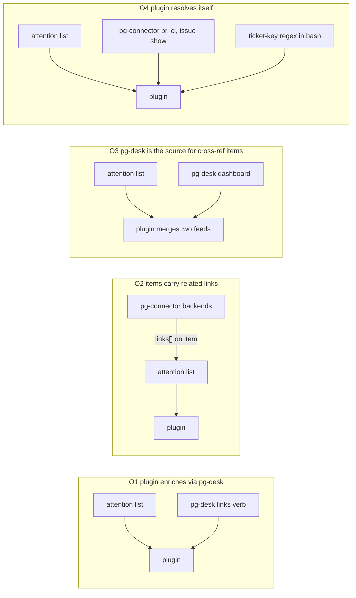
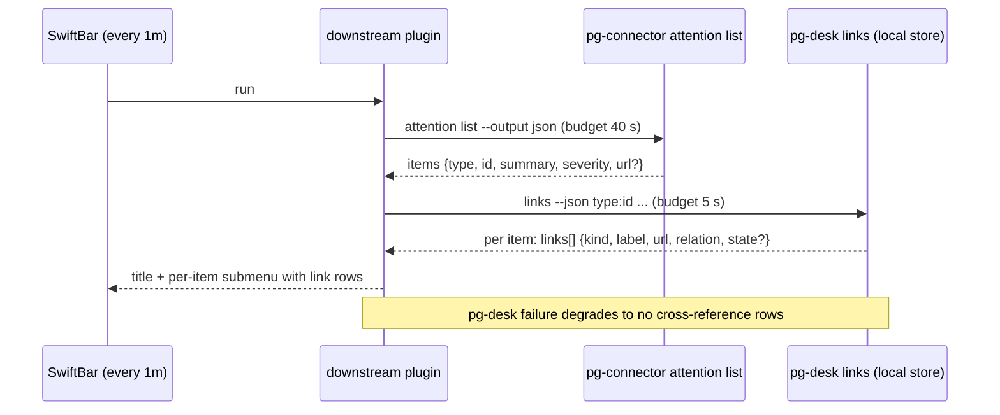

# Menu bar attention items: cross-referenced links (PR, build, Jira issue) - design

Status: design for operator review (bead `pg2-2hzcc`, 2026-10-02). No implementation bead has been
filed; section 9 lists the proposed set for the orchestrator to file, and section 10 lists the
questions that need the operator.

Like the other files under `docs/superpowers/specs/`, this file is an extraction source, not a
durable citation target. Section 8 names the ADR and behavior-docs changes that carry the durable
decisions.

The key words MUST, MUST NOT, SHOULD, SHOULD NOT and MAY are used as in RFC 2119.

## 1. Scope and binding ruling

The operator ruling (Phillip, 2026-10-01, verbatim from the bead) is binding and is NOT re-opened:

> "it will be pg-connector attention list, but one thing i was hoping to pull in was cross
> referenced links. ie, if a build is broken, it would be nice to have a quick link to the PR and
> the build and jira issue. as of right now, only pg-desk as the full cross refrence, so we may
> need to chane the plugin"

Consequences:

- The menu bar plugin's item source stays `pg-connector attention list`. This design does not move
  the plugin onto pg-desk as a source.
- The new goal is that an attention item offers quick links to its related PR, build and Jira
  issue.
- Where those links come from is the open design question, and "we may need to change the plugin"
  is expected.

The public repo stays free of employer specifics. The downstream SwiftBar plugin that renders the
menu lives in an employer-layered repo and is referred to here only as "the downstream plugin".
Everything it needs that is employer-specific (Jira base URL, ticket-key patterns, which checks
count as a build failure) MUST arrive as configuration, never as code in this repo.

## 2. What exists today

### 2.1 The attention feed carries no links

`pkg/schema/attention.go` defines the per-source item as `{type, id, summary, severity?}`. The
umbrella adds `via[]` at the merge layer. There is no URL of any kind, not even the item's own. The
downstream plugin therefore points every alert at a generic alert-list page and prints severity and
id.

Item types in the feed today: `alert` (Grafana), `pr` (id `<owner>/<repo>#<n>`), `issue` (a bd id
or a Jira key) and `agentsession`. The downstream plugin filters the feed to `type == "alert"`
only, and the alerts it shows are local machine alerts (host and service health), not CI.

### 2.2 No attention item represents a broken build

`needsAttentionForPR` (`pg-connector-pr-github`, `ListAttention`) is a review-state predicate: a
conflict dampens, a standing approval or the viewer's own review of the current head clears,
otherwise first-review or re-review. CI state is not an input. So the operator's example ("a build
is broken") is not an item the feed emits today, for any item type. Section 5 and question Q1 treat
this explicitly: the link mechanism is generic, but the broken-build example needs an item source.

### 2.3 Each connector entity knows only its own URL and one hop

| Schema          | Link-bearing fields                                                    |
| --------------- | ---------------------------------------------------------------------- |
| `schema.PR`     | `URL`, branch, title, body (a Jira key may appear in any of the three) |
| `schema.CIRun`  | `URL`, `Conclusion`, `HeadSHA`, `PRID` (the run's PR, one hop)         |
| `schema.Issue`  | `URL`                                                                  |
| `schema.Alert`  | `url`, `attributes` (labels and annotations), `extensions`             |
| `AttentionItem` | none                                                                   |

A `CIRun` names its PR, but nothing in pg-connector names a Jira key for a PR, a PR for a Jira key,
or a bead for a PR. Those edges need entity-spanning knowledge. ADR 0077 (and the entity change
flow design, ownership table) assigns that knowledge to pg-desk and forbids pg-connector from
holding "decorations, cross-entity links or workflow rules".

### 2.4 pg-desk holds the cross-reference graph, but exposes no read surface for it

pg-desk keeps an `xref` table (store schema v2: `origin`, `relation`, per-origin claim rows). It is
rebuilt on every hydration of the source entity by a per-type `LinkExtractor` registry
(`internal/pipeline/links.go`):

| Extractor     | Direction and relation                                            | Evidence                        |
| ------------- | ----------------------------------------------------------------- | ------------------------------- |
| `jira-key`    | `pr` -> `issue`, relation `jira`                                  | ticket key in branch/title/body |
| `work-item`   | `issue` (bead) -> `pr`, relation `work`; child -> parent `parent` | the bead's `repo` + `pr_number` |
| `thread-refs` | `thread` -> `pr`, relation `mentions`                             | permalink or ticket key in text |

External links (`external:<actor>`) are supported by the store (`AddExternalXref`) but have no CLI
verb yet. The store also holds each PR's gathered facts, including the CI runs with their URLs
(`facts.ci`) and the cross-referenced Jira issue snapshots (`facts.jira_issues`), and the interpret
stage already reduces the CI runs to a rollup that honors configured check exclusions
(`computeCIRollup`).

What is missing is the READ side. The only reader of `ListXrefLinks*` is the thread extractor
itself. `pg-desk show <pr>` prints an interpretation, `pg-desk open` prints PR URLs, and `serve`
emits dashboard rows; none carries a link list. The designed reader, `pg-desk <type> show <id>
--json` with a `links[]` array (entity change flow design, section 9.5), belongs to Phase 6
(`pg2-2j5ac.52.14`, open) and is not built. Its `links[]` entries carry `type`, `id`, `relation`,
`state`, `labels`, `metadata` and `origins`, but no URL, so even when built it does not directly
satisfy this need.

### 2.5 Coverage limits of pg-desk

- pg-desk has entity types `pr`, `issue` and `thread`. It has no `alert` type, so it can say
  nothing about an alert.
- A build is not an entity. It exists only as a CI run inside a PR's stored facts.
- pg-desk knows only what its watched set hydrates. An attention item outside that set (a PR from
  the attention query that the watch config does not cover) has no row and no links.

## 3. Options



| Criterion                        | O1 pg-desk lookup                                    | O2 attention items carry links                                                                    | O3 pg-desk as source for cross-ref items                 | O4 plugin resolves itself                                        |
| -------------------------------- | ---------------------------------------------------- | ------------------------------------------------------------------------------------------------- | -------------------------------------------------------- | ---------------------------------------------------------------- |
| Honors the ruling (source stays) | Yes                                                  | Yes                                                                                               | Partly: a second feed, items ranked outside the umbrella | Yes                                                              |
| Honors ADR 0077 ownership        | Yes: pg-desk owns links                              | No for cross-entity links: connector would hold the graph                                         | Yes                                                      | No: duplicates pg-desk's extractors in bash                      |
| Who must change                  | pg-desk (new read verb), plugin                      | Every attention backend plus schema bump, and each backend needs the other entities' data         | pg-desk (alert type too), plugin merge logic and dedup   | Plugin only, but grows into a second abstraction                 |
| Coverage                         | Items pg-desk watches (`pr`, `issue`, `thread`)      | Only what one backend can see: self URL, and for a PR its own CI runs; never the Jira key or bead | Same as O1, plus a dedup problem with the umbrella       | Whatever the plugin re-derives                                   |
| Failure isolation                | Good: local SQLite read, plugin degrades to no links | Good: links ride the same response                                                                | Two feeds can disagree                                   | Several network-bound calls per item per refresh                 |
| Latency                          | Milliseconds, no network                             | Zero extra calls, but heavier feed                                                                | Milliseconds                                             | One or more connector calls per item (40 s budget already tight) |
| Fits alerts                      | No (no `alert` type); needs a separate answer        | Yes for the self URL                                                                              | No                                                       | Only via alert attributes                                        |

### Why not O2 for cross-references

Putting a `links[]` array on `AttentionItem` makes pg-connector the holder of the graph. A backend
sees one entity: the PR backend could add the PR URL and its CI run URLs, but the Jira key needs
the configured ticket patterns and the bead needs the bd tracker. Teaching each backend the others'
data is exactly the coupling ADR 0077 rules out, and it would be implemented once per backend. The
split it does support is the narrow one: an item's OWN URL is knowledge the backend already has.

### Why not O3

pg-desk is a dashboard of review and CI work, ranked by its own panels. The attention umbrella
already merges, deduplicates by `{type, id}` and ranks every source. Making pg-desk a second item
source forks ranking and dedup for no gain, because O1 reaches the same links without moving the
items.

### Why not O4

The plugin is a read-only bash renderer whose own header says not to grow it into a second
abstraction. Re-deriving ticket keys, PR-to-bead mappings and CI failure semantics there would
duplicate three pg-desk extractors and the CI rollup, with no shared tests and one connector round
trip per item per minute.

## 4. Recommendation

Adopt a hybrid, O1 for cross-references plus the narrow part of O2 for self links:

1. pg-desk gains a batch read verb, `pg-desk links`, that returns the related links for a list of
   attention `{type, id}` refs. It reads the local store only. This is the single source of PR,
   build and Jira-issue links. (Facade over the xref table, the stored facts and the CI rollup.)
2. pg-connector's `AttentionItem` gains one additive optional field, `url`, the item's own page.
   Each backend fills it from data it already has. This gives alerts their real link (the alert
   entity already carries `url`) and gives every other item a fallback when pg-desk does not know
   it.
3. The downstream plugin makes one `pg-desk links` call per refresh, with its own short time
   budget, and renders each item's links as submenu rows. If pg-desk is absent, slow or errors, the
   plugin MUST render the indicator exactly as it does today, with at most the item's own `url`.
4. The item source and ordering remain the umbrella's. The plugin does not change which items it
   counts; question Q1 is about which item types it lists.



## 5. Contract: `pg-desk links`

```text
pg-desk links --json <type>:<id> [<type>:<id> ...]
pg-desk links --json --stdin          # one <type>:<id> per line
```

A `<type>:<id>` ref is the attention item's `type` and `id` unchanged. The pg-desk `pr` entity id
is already the pg-connector PR id (`<owner>/<repo>#<n>`), so no mapping is needed; the
implementation MUST assert this with a test, because a mismatch silently yields "unknown" for every
PR.

Output (schema version 1, additive evolution only):

```json
{
  "schemaVersion": 1,
  "as_of": "2026-10-02T12:00:00Z",
  "items": {
    "pr:acme/api#123": {
      "known": true,
      "links": [
        {
          "kind": "pr",
          "relation": "self",
          "label": "PR #123",
          "url": "https://..."
        },
        {
          "kind": "build",
          "relation": "ci",
          "label": "unit-tests (failure)",
          "url": "https://...",
          "state": "failure"
        },
        {
          "kind": "issue",
          "relation": "jira",
          "label": "ABC-42",
          "url": "https://..."
        }
      ]
    },
    "alert:grafana:abc": { "known": false, "links": [] }
  }
}
```

Rules:

- `kind` is a closed set: `pr`, `build`, `issue`, `thread`, `other`. It is the rendering hint, not
  the entity type. `relation` carries the xref relation (`self`, `jira`, `work`, `parent`,
  `mentions`, `ci`).
- `links` MUST contain only links with a URL. A link whose URL cannot be determined is omitted, not
  emitted empty.
- An unknown ref is `known: false` with empty `links`, not an error. Exit code 0 covers it. Exit 1
  means the store cannot be read at all.
- The verb MUST be read-only, MUST NOT hydrate, MUST NOT call the network and MUST NOT write the
  store. Freshness is reported through `as_of` (the oldest entity `as_of` among the refs), and the
  consumer decides what to do with it. A `--refresh` option is out of scope because it breaks the
  time budget.
- Link production is a Strategy registry per entity type, mirroring the extractor registry, so a new
  type is one entry:

  | Ref type | Links produced                                                                                                                                                                                                         |
  | -------- | ---------------------------------------------------------------------------------------------------------------------------------------------------------------------------------------------------------------------- |
  | `pr`     | self (snapshot URL); one `build` link per failing CI run on the current head, using the same exclusions as the CI rollup so the menu agrees with the dashboard; `issue` links for xref relation `jira`; `thread` links |
  | `issue`  | self (snapshot URL, else the configured issue URL template); `pr` link for xref relation `work` (bead to PR) or the reverse `jira` edge (Jira key to PRs); parent                                                      |
  | `thread` | self; `pr` links for relation `mentions`                                                                                                                                                                               |

- A Jira key MUST become a URL through configuration (`links.issue_url_template`, a `%s` template),
  falling back to the issue snapshot's `url`. No instance name appears in code.
- Schema state: links exist only on the migrated store (v2). On an unmigrated store the verb MUST
  degrade to the legacy rows (`pr` -> `issue` Jira links) and report `degraded: true`, rather than
  fail. Whether the live store is already migrated is a fact to check first (section 10, F1).

## 6. Contract: attention item `url`

- `AttentionItem` gains `url string` with `omitempty`. A source with no page for the item omits
  it. It MUST NOT be defaulted or synthesized by the umbrella.
- `AttentionSchemaVersion` is bumped (additive, one bump per field-shape change, the same convention
  as `CISchemaVersion`). The umbrella passes the field through unread. The "MUST NOT gain via /
  truncated / total_before_cap" rule in `attention.go` is about aggregation fields and is
  unaffected, but the header comment gets the new field documented.
- Fill: alert backends from `Alert.url`; the PR backend from the PR URL; the Jira and beads issue
  backends from the issue URL where the backend has it; agent-session backends omit it.
- This is the only place a connector contributes a link. It names the item itself and nothing else.

## 7. Plugin behavior (downstream)

- One `links` call per refresh, with `--stdin` carrying every listed item. The call has its own
  budget (proposed 5 s), strictly below the remaining headroom after the connector budget, so the
  1-minute refresh never overlaps.
- Per item, the submenu keeps its current rows and adds one row per link, in the order returned,
  each as an `href` row labeled by `kind` and `label` (for example "Open PR #123", "Open build:
  unit-tests (failure)", "Open ABC-42"). The item's own `url`, when present and not already in
  `links`, replaces today's generic alert-list link.
- The last-known-state cache stores the links with the items, so a stale render still offers them.
  Link rows MUST NOT be built from untrusted text without stripping `|`, tabs and newlines, the same
  sanitizing the plugin applies to summaries.
- A failed or timed-out `links` call is silent in the menu (no error row), logs nothing to stdout,
  and never changes the indicator, count or colors.

## 8. Durable-decision homes

- ADR 0077 gains a short Decision item: the menu bar and other attention consumers obtain
  cross-entity links from pg-desk's `links` read verb, never from attention items (cross-entity
  links stay out of pg-connector).
- `docs/behavior/pg-desk/` gains `links.md`; the entity change flow design's section 9.5 `links[]`
  gains a `url` field so `show` and `links` share one link shape.
- The attention capability's behavior docs gain the `url` field and the version bump.
- Invariants to record with the behavior docs:
  - `INV-LINKS-1` the verb is read-only and offline.
  - `INV-LINKS-2` an unknown ref is not an error.
  - `INV-LINKS-3` a link has a URL or is omitted.
  - `INV-LINKS-4` the build links honor the same exclusions as the CI rollup.
  - `INV-ATTN-URL-1` an item's `url` is its own page and is never defaulted.

## 9. Proposed implementation beads

Sizes are t-shirt sizes. Trackers: the `agent-support` tracker for work landing in this repo; the
employer-layered repo's own tracker for the downstream side (BF-1). Edges are real `bd` blocking
edges when filed.

| Id  | Title                                                                                                       | Repo (tracker)          | Size | Blocked by    |
| --- | ----------------------------------------------------------------------------------------------------------- | ----------------------- | ---- | ------------- |
| L1  | pg-desk: `links` read verb (batch, store-only) with `pr`, `issue`, `thread` link strategies                 | agent-support           | M    | none          |
| L2  | pg-desk: build links from stored CI facts, honoring the CI rollup's check exclusions                        | agent-support           | S    | L1            |
| L3  | pg-connector: additive `url` on `AttentionItem`, filled by alert, PR and issue backends                     | agent-support           | M    | none          |
| L4  | Downstream plugin: render per-item links from `pg-desk links` and the item `url`, with fallback             | downstream layered repo | M    | L1, L2, L3    |
| L5  | Downstream machine config: issue URL template for `pg-desk`, and fix stale "superseded by pg-desk" comments | downstream layered repo | S    | L1            |
| L6  | Conditional on Q1 (B or C): downstream plugin lists `pr` and `issue` items, not only alerts                 | downstream layered repo | S    | L4, Q1 answer |
| L7  | Conditional on Q1 (C): `pg-connector-pr-github` attention emits "CI failing on my PR" items                 | agent-support           | M    | Q1 answer     |

L1 and L3 are independent and can proceed in parallel. L1 SHOULD share its linked-entity read helper
with Phase 6's `show` (`pg2-2j5ac.52.14`) rather than duplicate it, so whichever lands first owns
the helper; this is a coordination note, not a blocking edge.

## 10. Open items

- **Q1 (operator)**: which attention items does the menu bar list? The link mechanism does not
  depend on the answer, but the broken-build example does (section 2.2). Options:
  - A. Alerts only (today). Links are the alert's own `url`; no PR, build or Jira links appear,
    because machine alerts name none. Cheapest; does not deliver the ruling's example.
  - B. Alerts plus the `pr` and `issue` items already in the feed. PR and Jira links appear, but a
    PR is listed because it needs review, not because its build is broken.
  - C. B plus a new attention condition, "CI failing on my PR", emitted by the PR backend. This
    is the only option under which the "broken build" example exists as a menu item with PR, build
    and Jira links. Adds L6 and L7. Recommended, because the ruling's example requires it.
- **F1 (fact to verify live, not a choice)**: whether the live pg-desk store is on the migrated
  schema, and whether `pg-desk` is populated for the PRs in the attention query. This design is
  code-reading only and did not touch the live system. L1 handles both states, so this affects
  coverage, not feasibility.
- Alerts that carry PR, build or Jira references in their labels or annotations would need an
  `alert` entity type in pg-desk (gather plus a link extractor). The local alerts seen today are
  machine health alerts, so this design does not propose it; Q1 option A confirms or reverses that.
