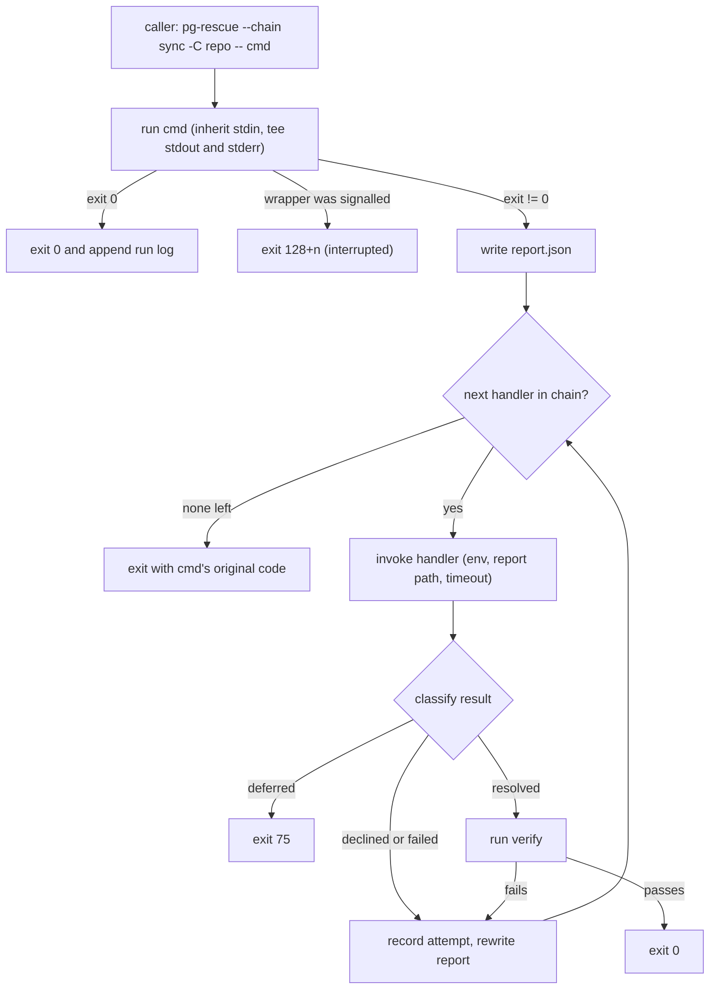

# pg-rescue: script-first command runner with a failure-handler chain

Status: approved for implementation (operator, 2026-10-02, "generate the beads"). Revision 2
incorporates the completeness, correctness, security, agent-protection, UX, observability and
test-coverage reviews.
Date: 2026-10-02
Bead: `pg2-v4fot` (brainstorm), label `agent-support`

## Purpose

Many routine chores have a fully deterministic happy path. `git pull --rebase` is one example.
Today such chores either:

- run as commands that always need an agent, which wastes tokens on the happy path, or
- become ad-hoc skills or systems that thread between an agent and a command, and grow complicated.

`pg-rescue` wraps a command. When the command succeeds, `pg-rescue` stays out of the way and no
agent is involved. When the command fails, `pg-rescue` builds a failure report and tries an ordered,
caller-named list of **handlers**. It stops at the first handler that resolves or defers the
failure.

A handler is any executable registered by name in config. Examples:

- a deterministic fix-up script
- a cheap model
- a bigger model
- something that files work for later
- a notification that handles nothing

## Design patterns

- **Decorator.** `pg-rescue -- cmd` keeps `cmd`'s interface (exit code, stdout, stderr, stdin) and
  adds failure handling around it.
- **Chain of Responsibility.** Handlers are tried in order. Each one either takes the request
  (`resolved`, `deferred`) or passes it on (`declined`, `failed`).
- **Strategy / plugin.** Each handler is an independent executable behind one contract. The
  wrapper knows nothing about models, beads or notifications.
- **Context Object.** One failure report is passed to every handler and grows by one attempt per
  handler.

## Scope

In scope:

- the `pg-rescue` wrapper, with its `result` and `check` subcommands
- the handler contract
- three reference handlers (`pg-rescue-claude`, `pg-rescue-bead`, `pg-rescue-notify`)
- a home-manager module
- a run log for measurement

Out of scope:

- **Policy.** `pg-rescue` MUST NOT restrict what a handler or a caller may do. The prompts, rules,
  instructions, skills and permissions that govern agents are defined outside this tool. This
  tool's only job is to pass the correct information to the correct executable in the correct
  order. Authority for any step, including outward-facing steps such as `git push`, comes from the
  rules that already govern the caller and the handler. Those rules include U-5, which this design
  does not change. They do not come from `pg-rescue`. The safeguards in this design are
  **plumbing**: they protect the correctness of the information passed and the user's machine. They
  never limit what a handler may do.
- **Routing work-item kinds in pg-router or the entity change flow.** This is follow-up 6
  (section 15).
- **Consumers of deferred work.** This is follow-up 5 (section 15).
- **Locking.** There is no locking between concurrent runs in the same cwd. Callers that need
  mutual exclusion provide it themselves.

## Decisions settled in the brainstorm (operator, 2026-10-02)

| ID  | Decision                                                                                                                                                                                                                                                                                                                   |
| --- | -------------------------------------------------------------------------------------------------------------------------------------------------------------------------------------------------------------------------------------------------------------------------------------------------------------------------- |
| R1  | Handlers are named in config and selected explicitly at every call site (`--handlers` or `--chain`). There is no implicit default chain.                                                                                                                                                                                   |
| R2  | The wrapper is backend-neutral. No flag names a backend ("bead", "claude"). Concrete backends are handler implementations.                                                                                                                                                                                                 |
| R3  | A handler's outcome comes from its exit code. Optional JSON on stdout adds a summary, details and metadata. If the JSON contains `outcome`, it MUST agree with the exit code.                                                                                                                                              |
| R4  | A `resolved` claim is checked mechanically: `--verify CMD` if given, otherwise a re-run of the original command. If the check fails, the attempt becomes `failed`.                                                                                                                                                         |
| R5  | The wrapper never cleans up after a failure. A caller that cannot afford to leave the state in place MUST NOT include a deferring handler.                                                                                                                                                                                 |
| R6  | An incompatible handler result marks that handler `failed`, and the chain continues.                                                                                                                                                                                                                                       |
| R7  | Each handler sees every earlier handler's attempt in the report.                                                                                                                                                                                                                                                           |
| R8  | On the happy path the output looks the same as without the wrapper; byte-exact transparency (a pty) is not required. When a handler runs, a block is appended for each handler. Verbosity ranges from `-q` (no pg-rescue text at all; the command's own output still passes through, operator ruling 2026-10-02) to `-vv`. |
| R9  | Text produced by a handler or by the command is printed on lines of its own, with no tool text before or after it on the same line, so it can be copied. A blank line separates handler sections.                                                                                                                          |
| R10 | Handlers are configured only through `pg-rescue`'s config. An instance's argv is its configuration.                                                                                                                                                                                                                        |
| R11 | The agent handler can reach MCP servers, and which servers it uses is configurable.                                                                                                                                                                                                                                        |
| R12 | Keep the scope small. Add no extra limitations on scripts or agents.                                                                                                                                                                                                                                                       |

How this answers the `pg2-v4fot` questions:

- **Where it runs:** both. A plain script calls `pg-rescue` (section 11). A pg-router
  `type="command"` role can invoke it through its argv (section 12).
- **Escalation contract:** sections 3 and 4.
- **Synchronous agent help** uses `claude -p` directly (`pg-rescue-claude`). **Asynchronous help**
  is a work item for an existing consumer (`pg-rescue-bead`; today the ccpool `worker` or a drain
  agent). A `pg-rescue-ccpool` handler, which would dispatch a synchronous ccpool session instead of
  calling `claude -p`, MAY be added later as another handler. The contract does not change.
- **Authority:** out of scope, as stated above.
- **Measurement:** section 7.
- **Fronted skills and roles, and the deciders:** section 13.

## 1. Architecture



| Unit                  | Responsibility                                                                                                                                                                                                              | Depends on                           |
| --------------------- | --------------------------------------------------------------------------------------------------------------------------------------------------------------------------------------------------------------------------- | ------------------------------------ |
| `pg-rescue` (wrapper) | Parses the CLI and config; runs the command; captures output; computes the fingerprint; writes the report; runs the chain; classifies results; runs verify; renders the display; appends the run log; chooses the exit code | config file, handler executables     |
| `pg-rescue result`    | Prints a valid result JSON and exits with the matching code, for handler authors                                                                                                                                            | none                                 |
| `pg-rescue check`     | Validates the config, lists handlers and chains, and resolves each `command[0]` on `PATH`                                                                                                                                   | config file                          |
| `pg-rescue-claude`    | Renders the report into a prompt, runs `claude -p`, and returns the agent's result together with session metadata                                                                                                           | `claude` CLI                         |
| `pg-rescue-bead`      | Files a self-contained deferral, or annotates an existing item, and deduplicates repeats                                                                                                                                    | `pg-connector issue` (beads backend) |
| `pg-rescue-notify`    | Posts a macOS notification and always declines                                                                                                                                                                              | `osascript`                          |
| home-manager module   | Generates the config file and installs the binaries                                                                                                                                                                         | nix                                  |

## 2. Wrapper CLI

```text
pg-rescue (--handlers a,b,c | --chain NAME) [-C DIR] [--context TEXT] [--verify CMD]
          [--result-file F] [-q | -v | -vv] [--config PATH] -- cmd args…
pg-rescue --stdin (--handlers … | --chain …) --verify CMD [-C DIR] [--context TEXT]
          [--result-file F] [-q | -v | -vv] [--config PATH]
pg-rescue result <resolved|deferred|declined> [SUMMARY] [--details-file F] [--meta-file F]
pg-rescue check [--chain NAME] [--config PATH]
```

### 2.1 Options

**Choosing handlers (`--handlers`, `--chain`)**

- Exactly one of `--handlers` or `--chain` MUST be given.
- `--handlers` lists instance names in order, separated by commas. The same instance MAY appear
  more than once. An empty list is an error.

**`-C DIR`**

- Run the command, the handlers and verify in `DIR`. The report records `DIR` as `command.cwd`.
- Without `-C`, the wrapper's own cwd is used.
- Callers that act on another directory MUST use `-C` (or `cd`) rather than the command's own
  directory flag (for example `git -C`). Otherwise the report and the handlers point at the wrong
  tree.

**`--context TEXT`**

- Free text from the caller about the intent of this step or chore.
- It is passed to handlers verbatim and means nothing to the wrapper.

**`--verify CMD`**

- Runs through `sh -c` in the command's cwd. It follows the same execution rules as the command
  (section 5.1), and the `PG_RESCUE_*` variables are added to its environment (section 3.1), so a
  caller can write a verify that inspects the state.
- If it is omitted, the original argv is re-run.
- There is no flag to skip verification. A caller who wants to trust handlers passes
  `--verify true`.
- "Verify passed" means only "the verify command succeeded". Non-idempotent commands SHOULD pass an
  explicit `--verify`. This is documented, not enforced.

**`--stdin`**

- For a caller that has already decided something is wrong.
- stdin is read to EOF, up to the capture cap (section 5.1), and becomes the captured output. It is
  not echoed.
- `command` in the report is `null`, and `--verify` is REQUIRED.
- If no handler resolves or defers the failure, the exit code is `1`.
- Combining `--stdin` with `-- cmd` is an error.

**`--result-file F`**

- Writes the run's run-log line (section 7) to `F` as one JSON object.
- This is the machine-readable result for scripts and agent callers. It distinguishes a reserved
  exit code from a command's own code of the same value.
- If `F` cannot be written, a warning is printed (unless `-q`), and the exit code is unchanged.

**`-q`, `-v`, `-vv`**

- Verbosity levels; see section 6.

**`--`**

- Separates wrapper options from the command.
- Everything after `--` is the command's argv. It is executed directly, without a shell. To use
  shell syntax, a caller writes `-- sh -c '…'`.

### 2.2 Exit codes

| Situation                                                        | Exit                                                                                                                           |
| ---------------------------------------------------------------- | ------------------------------------------------------------------------------------------------------------------------------ |
| Command succeeded                                                | `0` (its own)                                                                                                                  |
| A handler returned `resolved` and verify passed                  | `0`                                                                                                                            |
| A handler returned `deferred`                                    | `75` (`EX_TEMPFAIL`)                                                                                                           |
| Every handler declined or failed                                 | the command's original exit code; `128+signo` if a signal it did not receive from the wrapper killed it; `1` in `--stdin` mode |
| Wrapper error (CLI, config, run directory, spawning the command) | `70` (`EX_SOFTWARE`), before the command runs                                                                                  |
| The wrapper received `SIGINT`, `SIGTERM` or `SIGHUP`             | `130`, `143` or `129`                                                                                                          |

The reserved codes can collide with a command's own `70` or `75`. That is accepted: such codes are
rare, and `--result-file` and the run log disambiguate.

### 2.3 Wrapper errors (exit 70, before the command runs)

The wrapper exits `70` before the command runs in any of these cases:

- no selector, both `--handlers` and `--chain`, an empty `--handlers`
- `--stdin` combined with `--`, `--stdin` without `--verify`
- an unknown handler or chain
- any config error: a missing file, invalid TOML, an unknown key, a missing `command`, an invalid
  duration, an `env_file` with unsafe permissions, or a chain that references an unknown instance
- a run directory that cannot be created

Rules for config errors:

- The **whole** config file is validated, not only the selected chain, so that a broken file is
  noticed at its first use.
- Every error message names the file, the table and the key. For unknown names it lists the valid
  ones, for example `unknown handler "fix-smal" in --handlers; configured: fix-large, fix-small,
notify, p1-later`.

A handler `command[0]` that is not on `PATH` is **not** a wrapper error. It surfaces at spawn time
as a `failed` attempt, so that a happy-path chore still runs under a different `PATH` (launchd,
pg-router). `pg-rescue check` reports missing binaries ahead of time.

### 2.4 Config

Lookup order:

1. `--config PATH`
2. `$PG_RESCUE_CONFIG`
3. `${XDG_CONFIG_HOME:-~/.config}/pg-rescue/config.toml`

The config is read once, at startup. There is no per-repo config.

```toml
redact = ['ghp_[A-Za-z0-9]{36}', 'Authorization: \S+']

[handler.flake-lock-conflict]
command = ["pg-rescue-flake-lock-conflict"]
timeout = "2m"
tags = ["deterministic"]

[handler.fix-small]
command = ["pg-rescue-claude", "--model", "haiku", "--time-limit", "2m", "--strict-mcp-config"]
timeout = "3m"
description = "haiku, 2m, no MCP"
tags = ["agent"]

[handler.fix-large]
command = ["pg-rescue-claude", "--model", "sonnet", "--time-limit", "8m",
           "--allowed-tools", "Bash,Read,Edit,mcp__atlassian"]
timeout = "10m"
description = "sonnet, 8m"
env_file = "~/.config/pg-rescue/fix-large.env"
tags = ["agent"]

[handler.p1-later]
command = ["pg-rescue-bead", "--priority", "1", "--dedup-query", "pg-rescue-open"]
timeout = "1m"
tags = ["deferral"]

[handler.notify]
command = ["pg-rescue-notify"]
timeout = "10s"

[chain.sync]
handlers = ["flake-lock-conflict", "fix-small", "fix-large", "p1-later", "notify"]
```

Top-level keys:

| Key      | Default | Meaning                                                                                                                                                                                                                                                           |
| -------- | ------- | ----------------------------------------------------------------------------------------------------------------------------------------------------------------------------------------------------------------------------------------------------------------- |
| `redact` | `[]`    | Regexes (Go RE2). Matches are replaced with `[REDACTED]` in every **copy** of captured text: `output_tail`, `details`, prompts and bead bodies rendered by the reference handlers, the display, and the run log. `output.log` and the per-attempt files stay raw. |

Per-instance keys (`[handler.NAME]`):

| Key           | Required | Default | Meaning                                                                                                                                                                                                    |
| ------------- | -------- | ------- | ---------------------------------------------------------------------------------------------------------------------------------------------------------------------------------------------------------- |
| `command`     | yes      | none    | argv; `command[0]` is resolved on `PATH`                                                                                                                                                                   |
| `timeout`     | no       | `5m`    | Go `time.ParseDuration` syntax. When it expires: SIGTERM to the handler's process group, then SIGKILL 5s later; the attempt is `failed`.                                                                   |
| `env`         | no       | none    | Non-secret variables merged into the handler's environment. Values are never displayed or logged.                                                                                                          |
| `env_file`    | no       | none    | Dotenv file read when the handler is spawned. Use it for secrets: home-manager-generated config lives in the world-readable `/nix/store`. If the file is group- or world-readable, that is a config error. |
| `description` | no       | none    | Shown on `-vv` delimiter lines                                                                                                                                                                             |
| `tags`        | no       | `[]`    | Free-form strings. The wrapper never interprets them. They are copied into each run-log attempt for measurement, for example `deterministic`, `agent`, `deferral`.                                         |

Environment precedence, lowest to highest:

1. the wrapper's environment
2. `env`
3. `env_file`
4. the `PG_RESCUE_*` variables

`[chain.NAME]` has one key, `handlers`, a non-empty list of instance names.

### 2.5 `pg-rescue check`

- Validates the config exactly as a run would.
- Lists every handler, with its `description`, `tags` and resolved `command[0]` path or `NOT FOUND`.
- Lists every chain, or only `--chain NAME`.
- Exits `0` if the config is valid and every binary resolves, `1` if any binary is missing, and `70`
  on a config error.

## 3. Handler contract

### 3.1 Invocation

- **cwd:** the command's cwd (`-C DIR`, or the wrapper's cwd).
- **stdin:** `/dev/null`.
- **Process group:** the handler runs in its own process group.
- **After the handler exits:** for any reason, the wrapper sends SIGTERM and then SIGKILL to the
  handler's process group before verify or the next handler runs. Leftover children therefore never
  race the next step.
- **Environment:** see section 2.4 for precedence. The wrapper sets these variables:

| Variable                  | Value                                                                                                                                          |
| ------------------------- | ---------------------------------------------------------------------------------------------------------------------------------------------- |
| `PG_RESCUE_REPORT`        | absolute path to `report.json`, rewritten before each handler                                                                                  |
| `PG_RESCUE_CMD`           | the argv, quoted with POSIX single quotes (`'` becomes `'\''`). For display, or for `eval`. Empty in `--stdin` mode.                           |
| `PG_RESCUE_EXIT`          | the command's exit code (`128+signo` if it was killed by a signal). Empty in `--stdin` mode.                                                   |
| `PG_RESCUE_OUTPUT_FILE`   | absolute path to the combined captured output                                                                                                  |
| `PG_RESCUE_CONTEXT`       | the `--context` text; may be empty                                                                                                             |
| `PG_RESCUE_FINGERPRINT`   | the failure fingerprint (section 4.2)                                                                                                          |
| `PG_RESCUE_RUN_ID`        | the run id                                                                                                                                     |
| `PG_RESCUE_RUN_DIR`       | absolute path to the run directory                                                                                                             |
| `PG_RESCUE_RUN_LOG`       | absolute path to `runs.jsonl`, so a handler can look at history; for example, a cheap first handler can decline a failure that keeps recurring |
| `PG_RESCUE_HANDLER`       | this instance's name                                                                                                                           |
| `PG_RESCUE_POSITION`      | 1-based position in the chain                                                                                                                  |
| `PG_RESCUE_DEPTH`         | nesting depth: `1`, or the inherited value plus one                                                                                            |
| `PG_RESCUE_PARENT_RUN_ID` | the inherited `PG_RESCUE_RUN_ID`, if this run is nested                                                                                        |

Nesting is visible, but nothing enforces a limit (R12).

### 3.2 Outcome

| Handler exit                                                                                     | Outcome    | Chain             |
| ------------------------------------------------------------------------------------------------ | ---------- | ----------------- |
| `0`                                                                                              | `resolved` | stop, then verify |
| `2`                                                                                              | `declined` | continue          |
| `3`                                                                                              | `deferred` | stop              |
| anything else, including a timeout, a signal, or a failure to spawn (for example, not on `PATH`) | `failed`   | continue          |

Many tools exit `2` on usage errors. If a handler leaks such an exit code, it is read as `declined`
instead of `failed`. Both continue the chain, so only the label differs.

### 3.3 Optional result JSON (stdout)

```json
{
  "outcome": "resolved",
  "summary": "one line",
  "details": "multi-line text",
  "meta": { "any": "object" }
}
```

**Fields**

- Every field is optional. Empty stdout is valid, and the outcome then comes from the exit code
  alone.
- `outcome`, if present, MUST be one of `resolved|deferred|declined` and MUST match the exit code.
- `summary` is a string. The display shows only its first line.
- `details` is a string.
- `meta` is an object. The wrapper never reads it. It is copied verbatim into the report and the
  run log, so backends can record things like a session id, cost, or an item id without the wrapper
  knowing about them (R2).
- Unknown top-level fields are ignored, which leaves room for the contract to evolve.

**Format**

- If stdout is not empty, it MUST be exactly one JSON object, optionally followed by whitespace.
  Duplicate keys are invalid.
- stdout is capped at 1 MiB. The wrapper keeps reading and discards anything past the cap, so the
  handler never blocks on a full pipe. An oversized result is `failed`.

**What makes an attempt `failed`**

Any of the following makes the attempt `failed`, with a `reason` written by the wrapper:

- invalid JSON
- a mismatched or unknown `outcome`
- a field of the wrong type
- an oversized result

The reason is specific, for example: `stdout is not JSON (starts "Successfully rebased…"); handlers
must log to stderr`.

**Exit codes outside the outcome table**

For an exit code outside the outcome table, stdout JSON, if valid, still contributes `summary`,
`details` and `meta`. A present `outcome` is reported as a mismatch in `reason`. The outcome stays
`failed`.

**stderr**

Handlers SHOULD log to stderr. The wrapper captures stderr to a per-attempt file, up to the capture
cap.

### 3.4 Verification

- Verify runs only after `resolved`.
- It runs in the command's cwd, with the command's execution rules (section 5.1) plus the
  `PG_RESCUE_*` variables.
- Its output is captured to a per-attempt file. It is not passed through, so the caller's stdout
  holds only the original run's output.
- Exit `0` means passed.
- Any other exit code turns the attempt into `failed` with
  `reason: resolved → verify failed (exit N)`, and the chain continues.
- The handler's `timeout` also limits verify. If verify times out, the attempt is `failed`.

### 3.5 Live state

The wrapper does not restore state between handlers, and an earlier handler may have changed the
working copy before it failed. Handlers MUST treat the live state as authoritative and earlier
attempts as hints. The contract documents this; the wrapper cannot enforce it.

## 4. The report

### 4.1 `report.json`

The wrapper holds the report **in memory**. It is the only copy the wrapper ever reads. Before each
handler, the wrapper writes it to a temporary file in the run directory with `O_CREAT|O_EXCL`, mode
`0600`, and then `rename`s it over `report.json`. A handler can therefore neither alter what later
handlers see through the wrapper, nor redirect the write through a symlink.

```json
{
  "schema_version": 1,
  "run_id": "20261002T140311Z-7f3a9c2e",
  "parent_run_id": null,
  "depth": 1,
  "chain": "sync",
  "handlers": [
    "flake-lock-conflict",
    "fix-small",
    "fix-large",
    "p1-later",
    "notify"
  ],
  "mode": "argv",
  "command": {
    "argv": ["git", "pull", "--rebase"],
    "cwd": "/abs/repo",
    "exit": 1
  },
  "fingerprint": "sha256:…",
  "output_file": "/abs/run-dir/output.log",
  "output_tail": "last 200 lines, at most 64 KiB, redacted",
  "context": "sync-projects: rebase repo onto origin",
  "verify": null,
  "host": "phillipg-mbp-02",
  "started_at": "2026-10-02T14:03:11Z",
  "attempts": [
    {
      "handler": "flake-lock-conflict",
      "position": 1,
      "tags": ["deterministic"],
      "outcome": "declined",
      "reason": "exit 2",
      "exit": 2,
      "duration_ms": 310,
      "stderr_file": "/abs/run-dir/attempt-1.stderr.log",
      "reported": {
        "summary": "Conflict spans source files, not just flake.lock"
      }
    },
    {
      "handler": "fix-small",
      "position": 2,
      "tags": ["agent"],
      "outcome": "failed",
      "reason": "resolved → verify failed (exit 128)",
      "exit": 0,
      "duration_ms": 41200,
      "verify_ms": 900,
      "stderr_file": "/abs/run-dir/attempt-2.stderr.log",
      "verify_output_file": "/abs/run-dir/attempt-2.verify.log",
      "reported": {
        "summary": "Resolved the conflict markers and continued the rebase",
        "details": "…",
        "details_file": "/abs/run-dir/attempt-2.details",
        "meta": { "session_id": "…", "total_cost_usd": 0.04 }
      }
    }
  ]
}
```

**Facts vs claims.** In each attempt, the top-level fields are facts recorded by the wrapper:
`handler`, `position`, `tags`, `outcome`, `reason`, `exit`, `duration_ms`, `verify_ms` and the file
paths. `reported` holds the handler's own claims. The built-in templates label these as claims.

**Size caps**

- `output_tail` is capped at 200 lines and 64 KiB.
- `reported.details` is capped at 16 KiB in the report. The full text is in `details_file`.
- Both are redacted.

**`schema_version`** MUST be incremented on any breaking change. Handlers SHOULD exit `1` on a major
version they do not know.

### 4.2 Fingerprint

The wrapper computes the fingerprint once. It identifies "the same failure again" for handlers that
deduplicate.

- **argv mode:** `sha256` over each argv element followed by a NUL byte, then `cwd`, then a NUL.
- **`--stdin` mode:** `sha256` over `"stdin"` NUL, `cwd` NUL, then `context` NUL.

The fingerprint deliberately excludes the output, so a repeat with a different error message still
matches.

## 5. Execution, capture and process handling

### 5.1 Command execution

- **stdin:** the command inherits the wrapper's stdin.
- **Process group:** the command stays in the **wrapper's process group**. A command that reads from
  the terminal (a credential prompt, an ssh passphrase) therefore works, and is never stopped by
  `SIGTTIN`.
- **stdout and stderr:** the command's stdout goes to the wrapper's stdout and its stderr to the
  wrapper's stderr, through plain pipes.
- **Capture:** both streams are also streamed to `output.log` in arrival order. Nothing is buffered
  in memory beyond the tail kept for `output_tail`.
- **Capture cap:** `output.log`, `--stdin` input and the per-attempt stderr and verify files are each
  capped at 32 MiB. Past the cap, the first and last 16 MiB are kept, with a truncation marker.
- **`-q`:** both streams still pass through and are captured; only pg-rescue's own display is suppressed. A caller wanting total silence adds `>/dev/null 2>&1`.
- **TTY:** the command sees pipes, not a TTY, so some tools change their output (colours, progress
  bars). This is accepted (R8).

### 5.2 Signals

**The wrapper receives SIGINT, SIGTERM or SIGHUP while the command runs**

- A terminal signal already reaches the command, because both are in the foreground process group.
- Otherwise the wrapper forwards the signal to the command.
- Once the command exits, the wrapper exits `128+n` without running any handler. An interrupt is the
  caller's decision, not a failure to handle.

**The command dies from a signal the wrapper did not receive**

This is an ordinary failure. `PG_RESCUE_EXIT` is `128+signo`, and the handlers run.

**A signal arrives during a handler or verify**

1. The wrapper forwards SIGTERM to that process group, waits up to 5s, then sends SIGKILL.
2. The chain stops.
3. The run log records `interrupted`, with the interrupted handler.
4. The run directory is kept, and the wrapper exits `128+n`.

The footer reads `== interrupted during <handler> · working copy may be mid-change ==`.

**The wrapper is SIGKILLed**

This happens, for example, when a calling tool times out or a pg-router command role is killed. The
wrapper cannot clean up. Two things mitigate it:

- The reference handlers exit when they are orphaned (`getppid()==1`, checked every second), and
  `pg-rescue-claude` then kills its `claude` child.
- Third-party handlers SHOULD do the same. The contract documents this.

## 6. Display

### 6.1 Output rules

- The display is written to **stderr** only. A caller that pipes the command's stdout never receives
  handler text.
- Nothing is displayed on the happy path.
- Tool text appears only on delimiter lines: `== … ==` for sections and `-- … --` for
  sub-sections.
- Text produced by a handler, the command or verify is printed flush-left on lines of its own (R9).
- A blank line comes before every handler section.
- Before display, C0 control characters and ESC are stripped from handler-reported text
  (`summary`, `details`, stderr). The command's own passthrough is left untouched. A handler can
  therefore neither emit terminal escapes nor print a forged delimiter.
- There is no colour in v1.
- **`[i/n]`:** `i` is the handler's position in the chain, and `n` is the chain length.
- **Header:**
  - `== pg-rescue: <cmd> exited <code> · chain <name> ==`
  - with `--handlers`: `== pg-rescue: <cmd> exited <code> · handlers <a,b,c> ==`
  - in `--stdin` mode, `<cmd> exited <code>` becomes `stdin input`.
- **Footer:** it names the deciding handler and the run id, and the exit code when it is not `0`.
  - `== resolved by fix-large · run 20261002T140311Z-7f3a9c2e ==`
  - `== deferred by p1-later · exit 75 · working copy left as-is · run … ==`
  - `== unhandled · exit 1 · run … ==`
  - `== interrupted during fix-large · working copy may be mid-change · exit 130 · run … ==`

| Level   | Command output | When a handler ran                                                                                                             |
| ------- | -------------- | ------------------------------------------------------------------------------------------------------------------------------ |
| `-q`    | passthrough    | nothing from pg-rescue (R8)                                                                                                    |
| default | passed through | header; for each attempted handler, a delimiter `[i/n] name: outcome (reason)` and the summary; a verify delimiter; the footer |
| `-v`    | passed through | the default, plus `details`, verify output, skipped handlers, and the run directory                                            |
| `-vv`   | passed through | the `-v` output, plus each handler's argv, exit code, duration, timeout, `description`, `meta` and stderr                      |

Whatever the verbosity, whenever a handler ran, the display rendered at `-vv` is also written to
`<run-dir>/display.log`. "What happened in run X" can therefore always be answered, even under `-q`
or pg-router.

### 6.2 Examples

These examples become golden files. The scenario is chain `sync`, run with
`-C ~/phillipg_mbp/phillipgreenii-nix-agent-support -- git pull --rebase`:

1. `flake-lock-conflict` declines, because the conflict spans source files.
2. `fix-small` claims it resolved the failure, but verify fails.
3. `fix-large` reads `fix-small`'s attempt and resolves it, and verify passes.

Default:

```text
<command output, unchanged>

== pg-rescue: `git pull --rebase` exited 1 · chain sync ==

== [1/5] flake-lock-conflict: declined (exit 2) ==
Conflict spans source files, not just flake.lock

== [2/5] fix-small: failed (verify failed: exit 128) ==
Resolved the conflict markers and continued the rebase

== [3/5] fix-large: resolved ==
Finished the half-continued rebase; kept both sides of the README conflict
-- verify: passed (exit 0) --

== resolved by fix-large · run 20261002T140311Z-7f3a9c2e ==
```

`-v` (the first handler is omitted here; its section is the same as at default):

```text
== [2/5] fix-small: failed (verify failed: exit 128) ==
Resolved the conflict markers and continued the rebase
-- details --
Removed markers in README.md and ran `git add README.md && git rebase --continue`.
-- verify: failed (exit 128) --
error: cannot pull with rebase: You have unstaged changes.

== [3/5] fix-large: resolved ==
Finished the half-continued rebase; kept both sides of the README conflict
-- details --
fix-small's edit left README.md unstaged after the post-checkout hook rewrote it.
Re-staged README.md and ran `git rebase --continue`; 2 commits replayed cleanly.
-- verify: passed (exit 0) --
Current branch main is up to date.

== [4/5] p1-later: skipped (chain stopped) ==

== [5/5] notify: skipped (chain stopped) ==

== resolved by fix-large · run 20261002T140311Z-7f3a9c2e ==
== run dir: ~/.local/state/pg-rescue/runs/20261002T140311Z-7f3a9c2e ==
```

`-vv`, one handler:

```text
== [3/5] fix-large: resolved (exit 0, 3m12s, timeout 10m, sonnet, 8m) ==
Finished the half-continued rebase; kept both sides of the README conflict
-- argv --
pg-rescue-claude --model sonnet --time-limit 8m --allowed-tools Bash,Read,Edit,mcp__atlassian
-- details --
…
-- meta --
{"session_id":"0e9c…","total_cost_usd":0.31,"num_turns":14,"model":"sonnet"}
-- stderr --
…
-- verify: passed (exit 0, 1.4s) --
Current branch main is up to date.
```

Deferred, at default:

```text
== pg-rescue: `git pull --rebase` exited 1 · chain sync ==

== [1/5] flake-lock-conflict: declined (exit 2) ==
Conflict spans source files, not just flake.lock

== [2/5] fix-small: declined (exit 2) ==
Conflict needs a design decision between two rewrites of the same function

== [3/5] fix-large: failed (timed out after 10m) ==

== [4/5] p1-later: deferred ==
Filed pg2-abc12 (P1): pg-rescue: git pull --rebase failed in phillipgreenii-nix-agent-support

== deferred by p1-later · exit 75 · working copy left as-is · run 20261002T140311Z-7f3a9c2e ==
```

## 7. Run directory and run log

### 7.1 Run directory

- **Path:** `${XDG_STATE_HOME:-~/.local/state}/pg-rescue/runs/<run-id>/`.
- **Contents:** `report.json`, `output.log`, `display.log`, and the per-attempt stderr, verify and
  details files.
- **Permissions:** the wrapper sets umask `077` at startup. The state root and every run directory
  are `0700`, and every file is `0600`, whatever the user's umask.
- **Run id:** a UTC timestamp followed by 32 random bits. The directory is created with `mkdir`,
  which fails if it already exists, and the wrapper retries with a new id on collision.
- **Lifetime:**
  - The directory is created at startup and removed on the happy path.
  - It is kept when any handler ran or the run was interrupted.
  - The running wrapper holds an `flock` on `<run-dir>/.lock`.
- **Pruning:** at the start of each run, best effort. A directory is deleted only if all of these
  hold:
  - it is a real directory directly under `runs/`, checked with `Lstat`, with no symlinks followed
  - its name matches the run-id pattern
  - the timestamp in its id is more than 7 days old
  - its `.lock` is not held
- A **deferring** handler MUST copy what its hand-off needs into the hand-off itself, because the
  run directory expires.

### 7.2 Run log

Every run, including the happy path, appends one JSON line to
`${XDG_STATE_HOME:-~/.local/state}/pg-rescue/runs.jsonl` (mode `0600`):

```json
{
  "run_id": "20261002T140311Z-7f3a9c2e",
  "parent_run_id": null,
  "depth": 1,
  "ts": "2026-10-02T14:03:11Z",
  "pg_rescue_version": "0.1.0",
  "host": "phillipg-mbp-02",
  "mode": "argv",
  "chain": "sync",
  "handlers": [
    "flake-lock-conflict",
    "fix-small",
    "fix-large",
    "p1-later",
    "notify"
  ],
  "cmd": "git pull --rebase",
  "cwd": "/abs/repo",
  "context": "sync-projects: rebase repo onto origin",
  "fingerprint": "sha256:…",
  "exit": 1,
  "result": "resolved",
  "resolved_by": "fix-large",
  "final_exit": 0,
  "duration_ms": 254000,
  "attempts": [
    {
      "handler": "flake-lock-conflict",
      "position": 1,
      "tags": ["deterministic"],
      "outcome": "declined",
      "reason": "exit 2",
      "exit": 2,
      "duration_ms": 310,
      "binary": "/nix/store/…/bin/pg-rescue-flake-lock-conflict",
      "meta": null
    },
    {
      "handler": "fix-small",
      "position": 2,
      "tags": ["agent"],
      "outcome": "failed",
      "reason": "resolved → verify failed (exit 128)",
      "exit": 0,
      "duration_ms": 41200,
      "verify_ms": 900,
      "binary": "/nix/store/…/bin/pg-rescue-claude",
      "meta": { "session_id": "…", "total_cost_usd": 0.04 }
    },
    {
      "handler": "fix-large",
      "position": 3,
      "tags": ["agent"],
      "outcome": "resolved",
      "reason": "verify passed",
      "exit": 0,
      "duration_ms": 192000,
      "verify_ms": 1400,
      "binary": "/nix/store/…/bin/pg-rescue-claude",
      "meta": { "session_id": "…", "total_cost_usd": 0.31 }
    }
  ]
}
```

**Fields**

- `result` is one of `success|resolved|deferred|unhandled|error|interrupted`.
- `binary` is the resolved absolute path of `command[0]`. Under nix this is a store path, so it
  doubles as the handler's version.

**Writing**

- `cmd` and `context` are redacted.
- Each line is written with a single `O_APPEND` write, so concurrent runs never interleave within a
  line.
- When `runs.jsonl` exceeds 10 MiB, it is renamed to `runs.jsonl.1`, replacing the previous one.
- Failing to write the run log never changes the exit code. It prints a warning at `-v`.

**Measurement**

The README documents `jq` recipes for these per-chain rates, all computed from the run log alone:

- **Common-case rate:** `success`, plus `resolved` by an attempt tagged `deterministic`, over all
  runs.
- **Agent rate:** `resolved` by an attempt tagged `agent`.
- **Agent cost:** the sum of `meta.total_cost_usd` over attempts tagged `agent`.
- **Escape rate:** `deferred` plus `unhandled`.
- **Failing handlers:** attempts with outcome `failed`, grouped by `handler` and `reason`.

**Tracing**

- From run to bead: `pg-rescue-bead` records the item id in `meta.item_id`.
- From bead to run: the bead body carries the run id.
- From run to claude session: `pg-rescue-claude` records `meta.session_id`.

## 8. Reference handlers

Each reference handler is a separate binary. Its arguments are its entire configuration (R10). Each
one meets section 3 and adds no policy (R12). Each one exits when it is orphaned (section 5.2).

### 8.1 Shared template data model

All three handlers render templates with Go `text/template` over the same data model, from one
shared internal package. `--print-template-vars` prints the data model, and
`--print-default-template` prints the built-in templates.

| Field                                                                 | Type     | Value                                                                            |
| --------------------------------------------------------------------- | -------- | -------------------------------------------------------------------------------- |
| `.RunID`, `.Fingerprint`, `.Host`, `.StartedAt`, `.Context`, `.Chain` | string   | from the report                                                                  |
| `.Mode`                                                               | string   | `argv` or `stdin`                                                                |
| `.Cmd`                                                                | string   | the quoted argv, or `stdin input` in `--stdin` mode                              |
| `.Argv`                                                               | []string | empty in `--stdin` mode                                                          |
| `.Cwd`                                                                | string   | absolute path                                                                    |
| `.Repo`                                                               | string   | basename of the git toplevel containing `.Cwd`, or the basename of `.Cwd`        |
| `.Exit`                                                               | int      | the command's exit code; `-1` in `--stdin` mode                                  |
| `.OutputTail`                                                         | string   | redacted                                                                         |
| `.Attempts`                                                           | list     | each with `.Handler`, `.Position`, `.Outcome`, `.Reason`, `.Summary`, `.Details` |
| `.LastSummary`                                                        | string   | the summary of the most recent attempt that has one, otherwise empty             |
| `.Fence`                                                              | string   | per-run random delimiter (see below)                                             |

**Fencing untrusted text.** The built-in templates wrap every span of untrusted text in a fence
built from `.Fence`. A fence is a code fence longer than the longest run of backticks in the text,
plus a per-run random nonce. Untrusted text means `OutputTail`, each attempt's `Summary` and
`Details`, and `Context`. The fence is labelled as quoted data, so neither the command's output
nor an earlier handler can close the fence or pose as instructions. This frames the information; it
restricts nothing.

Flag naming is the same for every template:

- `--X-template TEXT` gives the template inline.
- `--X-template-file F` reads it from a file.
- `--append-instructions TEXT` and `--append-instructions-file F` follow the same pattern.

### 8.2 `pg-rescue-claude`

Runs `claude -p --output-format json` in the cwd with a prompt rendered from the report, and returns
the agent's result.

| Argument                                                     | Default       | Purpose                                                                                                                                            |
| ------------------------------------------------------------ | ------------- | -------------------------------------------------------------------------------------------------------------------------------------------------- |
| `--model M`                                                  | `sonnet`      | Passed through as `claude --model`                                                                                                                 |
| `--time-limit D`                                             | `5m`          | Wall-clock limit for the agent. Set it below the instance's `timeout` so the handler can still report. When it is exceeded, the handler exits `1`. |
| `--append-instructions TEXT`, `--append-instructions-file F` | none          | Appended to the prompt                                                                                                                             |
| `--prompt-template TEXT`, `--prompt-template-file F`         | built-in      | Replaces the whole prompt                                                                                                                          |
| `--print-default-template`, `--print-template-vars`          | n/a           | Print, then exit                                                                                                                                   |
| `--output-tail-lines N`                                      | `200`         | How much output goes into the prompt, within the 64 KiB cap                                                                                        |
| `--permission-mode M`                                        | `acceptEdits` | Passed through                                                                                                                                     |
| `--allowed-tools LIST`, `--disallowed-tools LIST`            | CLI default   | Passed through                                                                                                                                     |
| `--mcp-config F` (repeatable), `--strict-mcp-config`         | none, off     | Passed through                                                                                                                                     |
| `--claude-arg ARG` (repeatable)                              | none          | Passed through verbatim, e.g. `--max-budget-usd`                                                                                                   |

**MCP**

- With no MCP arguments, the agent gets the same MCP servers an interactive session in that cwd
  would get: the user-scope servers plus the cwd's project `.mcp.json`.
- In `-p` mode, a tool that is not allowed is denied rather than prompted for. An instance that
  should use MCP tools therefore lists them in `--allowed-tools`.
- The plan MUST verify two things: whether project `.mcp.json` servers load without approval in
  `-p` mode, and how `-p` reports a permission denial. The `-p` help text says the trust dialog is
  skipped; whether `--permission-prompts none` is needed is still open.

**Built-in template**

- It presents the command, exit code, cwd, fenced output tail, fenced context, and the prior
  attempts. For each attempt it shows the wrapper's facts and the handler's fenced claims.
- It states that the live state is authoritative and that the attempts are hints.
- It asks the agent to finish with a single JSON object `{outcome, summary, details}`.
- It contains no policy.
- `--json-schema` is passed so the CLI enforces the shape of that final object, if the plan
  confirms it applies to `-p` output.

**Result handling**

1. The handler takes the agent's final message from `.result` in the CLI's JSON output.
2. It parses that message as the result object and exits with the matching code.
3. It adds `meta`: `session_id`, `total_cost_usd`, `num_turns`, `usage` and `model`, all taken from
   the CLI JSON.
4. If the final message cannot be parsed, it exits `1`, with the raw text on stderr. `meta` is still
   emitted.

**Environment**

When launching `claude`, the handler clears the nested-session markers that ccpool clears
(`packages/ccpool/internal/session/session.go`, e.g. `CLAUDECODE`). Otherwise an agent caller's
markers would suppress the child's transcript. This is plumbing: it changes nothing about what the
agent may do.

**Reuse**

`lib/agent-script.nix` (`mkAgentScript`) does not fit and is not used. It is a bash builder with
positional arguments, merged stdout and stderr, and a 45s default timeout. Its auth-error exit-code
idea (11/12) MAY be carried over as a `meta.error_kind`.

### 8.3 `pg-rescue-bead`

Files a self-contained deferral through `pg-connector issue create --backend
pg-connector-issue-beads`, or annotates an existing item. On success it exits `3` (`deferred`),
both when it creates an item and when it updates one.

| Argument                                                     | Default                                   | Purpose                                                              |
| ------------------------------------------------------------ | ----------------------------------------- | -------------------------------------------------------------------- |
| `--priority N`                                               | `2`                                       | Priority                                                             |
| `--issue-type T`                                             | `task`                                    | Passed as pg-connector `--issue-type`                                |
| `--label L` (repeatable)                                     | none                                      | Added alongside `pg-rescue` and the repo label                       |
| `--repo-label L`                                             | none                                      | Sets the repo label, overriding the `--repo-label-map` lookup        |
| `--repo-label-map REPO=LABEL` (repeatable)                   | none                                      | Maps a git toplevel basename to its repo label; see "Repo label"     |
| `--tracker-dir PATH`                                         | derived                                   | Overrides the tracker; see "Tracker" below                           |
| `--title-template TEXT`, `--title-template-file F`           | `pg-rescue: {{.Cmd}} failed in {{.Repo}}` | Title                                                                |
| `--body-template TEXT`, `--body-template-file F`             | built-in                                  | Replaces the body                                                    |
| `--append-instructions TEXT`, `--append-instructions-file F` | none                                      | Appended to the body                                                 |
| `--output-tail-lines N`                                      | `200`                                     | How much output is inlined                                           |
| `--dedup-query NAME`                                         | none (no dedup)                           | A named `pg-connector` query that lists non-closed `pg-rescue` items |
| `--annotate ID`                                              | none                                      | Comment the report on an existing item instead of creating one       |
| `--add-label L` (repeatable)                                 | none                                      | With `--annotate`: labels to add to that item                        |

**Tracker**

- The beads backend does not fall back to cwd. It requires `PG_CONNECTOR_ISSUE_BEADS_DIR`.
- The handler sets that variable on its `pg-connector` child to the tracker it resolves, in this
  order:
  1. `--tracker-dir PATH`, if given. It MUST be an existing directory.
  2. Otherwise, the git toplevel of the report's cwd (`.Cwd`), if that toplevel contains `.beads/`.
- If neither yields a tracker, it exits `1` before any call to `pg-connector`: `--tracker-dir` is
  required in that case. If the tracker is unreachable, it also exits `1`. It never falls back to
  another tracker.
- No workspace repo-to-tracker lookup exists in code. The workspace's repo-to-label table is
  machine-local and names a private repo, so this public handler MUST NOT hardcode one. Everything
  that is specific to a machine arrives through arguments.
- It sets `PG_CONNECTOR_ISSUE_BEADS_ACTOR=pg-rescue/<run-id>`, for attribution.

**Repo label**

- `--repo-label L` sets the repo label directly.
- Otherwise, the handler looks up the basename of the git toplevel containing `.Cwd` in the
  `--repo-label-map REPO=LABEL` entries. A later entry for the same `REPO` wins. The machine config
  fills the map in (pg2-owwhw).
- With no `--repo-label`, and either no map entry or no git toplevel, the item gets no repo label.
  The handler never guesses one.
- An item carries these labels, in order and without repeats: `pg-rescue`, the repo label if any,
  then each `--label`.

**Body**

The default body contains:

- host, absolute cwd and timestamp
- the command and exit code
- the output tail, fenced and redacted
- context
- every attempt's facts, plus its fenced claims
- the run id
- the statement "state was left as-is at <time>"

Instructions come only from `--append-instructions` and the body template. The title is passed as
`--title=VALUE`, with newlines stripped.

**Deduplication** (when `--dedup-query` is given)

- The handler runs the named query and filters on the client side for
  `metadata.pg_rescue_fingerprint == $PG_RESCUE_FINGERPRINT`. This follows the
  `pg-router-probe --dedup-query` precedent.
- On a match, it comments the new report on that item and reports `Updated <id>`.
- Otherwise it creates the item with the fingerprint in its metadata. A closed item never matches,
  even if the query returns it.
- `--annotate` and `--dedup-query` are mutually exclusive (a usage error): annotate names the item,
  dedup searches for it.
- A dedup query that fails is a failure (exit `1`); the handler does not go on to create an item it
  could not check for duplicates.

**Result**

The handler's result carries `meta.item_id` and `meta.action` (`created`, `updated` or
`annotated`).

The handler exits `1` on any failure, including a usage error: exit `2` would be read as `declined`.
The body is kept under 60,000 bytes, below bd's 64 KiB text-field cap, by shrinking the inlined
output tail first. The default templates may use `.FiledAt`, the time the item is filed, in
addition to the shared data model (section 8.1); the default body ends with `state was left as-is
at <FiledAt>`.

### 8.4 `pg-rescue-notify`

Posts a macOS notification and exits `2` (`declined`). If posting fails, it exits `1`.

| Argument                | Default                       | Purpose            |
| ----------------------- | ----------------------------- | ------------------ |
| `--title-template TEXT` | `pg-rescue: {{.Cmd}} failed`  | Title              |
| `--body-template TEXT`  | `{{.Repo}}: {{.LastSummary}}` | Body               |
| `--sound NAME`          | none                          | Notification sound |

The title and body are passed as **argv** to a fixed AppleScript (`on run argv … display notification
(item 2 of argv) with title (item 1 of argv)`), never interpolated into script text. Control
characters are stripped, and each value is capped at 200 characters.

### 8.5 Handler authors

A bash handler keeps stdout for the result and sends everything else to stderr:

```bash
#!/usr/bin/env bash
exec 3>&1 1>&2   # all ordinary output goes to stderr
# … work …
pg-rescue result resolved "relocked flake.lock" >&3
```

`pg-rescue result` prints the JSON and exits with the matching code, so it MUST be the last
command. To test a handler on its own:

```bash
pg-rescue --stdin --handlers my-handler --verify true -vv < saved-output.log
```

Example deterministic handler, `pg-rescue-flake-lock-conflict` (implemented in
`packages/pg-rescue-flake-lock-conflict`, bead `pg2-3ybxg`):

1. If `flake.lock` is not the only conflicted file, it ends with `pg-rescue result declined …`.
2. Otherwise it extracts the names of the conflicted inputs from the conflict markers, with the same
   `awk` extraction `integrate-branch:ff-merge-to-main` uses. This MUST happen before step 3, which
   removes the markers.
3. It takes upstream's `flake.lock`. During a rebase upstream is `--ours`. Either side works,
   because the relock in step 4 recomputes the pins; the checkout only hands `git rebase --continue`
   a resolved, marker-free file.
4. It runs `nix flake update <conflicted inputs>`, falling back to a bare `nix flake update` only
   when no names were extracted. It MUST NOT run `nix flake lock`.
5. It runs `git add flake.lock`, then `GIT_EDITOR=true git rebase --continue`.
6. If the rebase stops again on a later commit, it ends with `declined` and a summary of where it
   stopped. Otherwise it ends with `pg-rescue result resolved "relocked flake.lock"`.

**Deviations from the first draft of this section and from `ff-merge-to-main`**

- The first draft said the handler "runs `nix flake lock`". That is wrong. A bare `nix flake lock`
  only fills _missing_ lock entries and leaves an already-pinned input at its stale, conflicting
  revision, so the conflict would be "resolved" with stale pins. The relock is a targeted
  `nix flake update`, as in the `ff-merge-to-main` skill's flake.lock-only resolution.
- `ff-merge-to-main` continues the rebase first and then commits the relock as a separate
  `chore: relock flake.lock after rebase` commit. This handler relocks _before_
  `git rebase --continue` and makes no separate commit, on purpose: verification re-runs
  `git pull --rebase`, which needs a clean tree, and the relocked lock is part of the commit being
  replayed.
- `ff-merge-to-main` picks `--theirs`; this handler picks `--ours` (upstream). The choice is
  arbitrary for the reason in step 3.

## 9. Edge cases

| Case                                               | Behavior                                                       |
| -------------------------------------------------- | -------------------------------------------------------------- |
| Empty chain, or `--handlers ""`                    | `70` before the command runs                                   |
| The same instance listed twice                     | Allowed. Each run is its own attempt, with its own position.   |
| Handler not on `PATH`                              | Attempt `failed`, with reason `not found on PATH`              |
| Verify hangs                                       | Killed at the handler's `timeout`; attempt `failed`            |
| Command killed by a signal the wrapper did not get | Ordinary failure, with exit `128+signo`                        |
| The run directory cannot be created                | `70` before the command runs                                   |
| Run log or `--result-file` cannot be written       | Warning; exit code unchanged                                   |
| Concurrent runs in the same cwd                    | No locking (see Scope). Run ids and directories never collide. |
| Config changed during a run                        | Not seen. Config is read once.                                 |
| `chain` in the report under `--handlers`           | `null`; `handlers` holds the list                              |

## 10. Packaging

- **Repo:** `phillipgreenii-nix-agent-support`.
- **Go package:** one package, `packages/pg-rescue/`, built with gomod2nix like its neighbours. It
  produces these binaries:
  - `cmd/pg-rescue`
  - `cmd/pg-rescue-claude`
  - `cmd/pg-rescue-bead`
  - `cmd/pg-rescue-notify`
  - `pg-rescue-flake-lock-conflict`, which is not part of the Go module: bash, built with
    `mkBashScript`, with its own derivation in `packages/pg-rescue-flake-lock-conflict/` rather than
    a `cmd/` directory. No
    package in the repo mixes a Go module with `mkBashScript`, and `mkGoApp` builds the module from
    `lib.cleanSource ./.`. The `pg-rescue-go-tests` check lists it in `testDeps`.
- **Home-manager module:** `home/programs/pg-rescue/`, with
  `programs.pg-rescue.{enable, redact, handlers.<name>, chains.<name>}`.
  - It generates `config.toml`.
  - It ships default instances, any of which can be overridden: `flake-lock-conflict`, `notify`,
    `fix-small` (haiku, 2m, strict MCP), `fix-large` (sonnet, 8m) and `p1-later`.
  - Its documentation warns that the generated config is world-readable, and points to `env_file`
    for secrets.
- **Docs:** a package README covering the contract, display, config, the template data model, the
  handler-author idiom and the `jq` recipes. Also a tldr page for `pg-rescue`, and behaviour docs if
  the package follows the behaviour-docs method used by its neighbours.

## 11. First consumer: sync-projects

sync-projects is a new, lightweight script. It does not replace `/pn-workspace-sync`, which is a
heavier workflow with workforests, validation and landing.

```bash
for repo in "${workspace_repos[@]}"; do
  pg-rescue --chain sync -C "$repo" --context "sync-projects: rebase onto origin" \
    -- git pull --rebase || exit $?
done
pn workspace push
```

- **`-C`** makes the report's cwd, and the handlers' cwd, the conflicted repo.
- **`|| exit $?` is intentional.** A deferral (`75`) or an unhandled failure stops the loop before
  the push, and the working copy is left as-is for the deferred work.
- **The push** is performed by the script, not by a handler. How a caller is authorized to push is
  outside this design (see Scope).
- **Name and location** of the script (agent-support, or repo-base next to `pnwf`) are decided in
  the plan.

## 12. pg-router integration notes

A pg-router `type="command"` role can run `pg-rescue` through its argv template. The role
configuration MUST account for these facts about command roles
(`packages/pg-router-ccpool-handler/internal/executor/command.go`):

- **No working directory is set.** The argv MUST pass `-C {{…}}`.
- **Only exit `0` is success, and exit `9` means busy, which triggers a re-dispatch.**
  - A successful deferral (`75`) would therefore look like a failure. A command whose own exit code
    `9` is passed through would trigger a retry.
  - The role argv SHOULD wrap `pg-rescue` in a small shim that maps `75` to `0`, and remaps
    a passed-through `9`.
- **Both stdout and stderr are discarded.** `display.log`, `report.json`, `--result-file` and the
  run log are the only record.
- **Command roles have no watchdog.** A killed role SIGKILLs only `pg-rescue`. The orphan exit of
  the reference handlers (section 5.2) limits the damage.

## 13. Fit with the bead's named cases

| Case                                         | Assessment                                                                                                                                                                                                                                                                                                                                                                                                                                                                                 |
| -------------------------------------------- | ------------------------------------------------------------------------------------------------------------------------------------------------------------------------------------------------------------------------------------------------------------------------------------------------------------------------------------------------------------------------------------------------------------------------------------------------------------------------------------------ |
| sync-projects                                | First consumer (section 11).                                                                                                                                                                                                                                                                                                                                                                                                                                                               |
| `resolve-conflict` (entity change flow S13)  | Good fit once Phase 8 of `pg2-2j5ac.52` creates the items. A pg-router command role (section 12) runs a rebase under `pg-rescue`. If it gives up, `pg-rescue-bead --annotate` hands the existing item to the ccpool `worker`. Deciders are unchanged. The entity change flow's "Where new logic goes" items 3 and 4 still hold: a decider decides that the work item exists, and executing it is a role. The routing is follow-up 6, under `pg2-2j5ac.52`; S25 deferred it to `pg2-v4fot`. |
| `fix-ci`                                     | Partial fit. A rerun-once rung handles flaky jobs; anything else goes to an agent.                                                                                                                                                                                                                                                                                                                                                                                                         |
| `/pn-workspace-sync`, `/pn-workspace-update` | `pnwf.sh` is already deterministic, and the Sonnet runners mostly route on its exit codes. Once sync-projects has run data, evaluate replacing the runner prefix with a script wrapped in `pg-rescue`. `/pn-workspace-update`'s halts are all stop-and-report, so it may need only a `notify` chain.                                                                                                                                                                                       |
| `review-pr`, `process-feedback`              | Agent work from the start. Not applicable.                                                                                                                                                                                                                                                                                                                                                                                                                                                 |

## 14. Testing

### 14.1 Required test seams

The implementation MUST provide these seams. Without them the tests are slow, flaky, or touch real
user data.

- **Injectable sources:** clock, random source and hostname. They feed `run_id`, `started_at`, `ts`,
  `duration_ms` and the prune cutoff. Pruning is keyed on the run-id timestamp, so it can be tested
  without touching mtimes.
- **Short durations:** sub-second values (`"200ms"`) are accepted wherever a duration is.
- **Kill grace:** the 5s SIGTERM→SIGKILL grace is an internal option that tests set to about 50ms.
- **`TestMain` in every test binary:**
  - points `XDG_STATE_HOME` and `XDG_CONFIG_HOME` at a temp directory
  - unsets `PG_RESCUE_*`
  - clears `GIT_*`, because `run-unit-tests` runs inside a git hook (the `packages/pb` precedent)
  - builds the wrapper once
- **Golden-file normalization:** run directory, `$HOME`, durations and run ids are normalized before
  comparison.
- **The classifier is exported.** `contract.Classify(exit, stdout) → (outcome, reason, reported)` is
  the only implementation. Both the wrapper and the handler tests use it.

### 14.2 Wrapper unit tests

Fake handlers are Go re-exec helpers (the `GO_WANT_HELPER_PROCESS` pattern in
`packages/pg-router-probe`). Each test MUST trace to a rule; the list below is the minimum.

- **CLI and config (section 2):**
  - every `70` case in section 2.3, each asserted to happen before the command runs; the fake
    command records whether it was spawned
  - config lookup order
  - default `timeout`
  - `env` / `env_file` precedence, plus `env_file` permission rejection
  - `redact` application
  - the same instance listed twice
  - `-C`
  - argv after `--` run with no shell (`$HOME` and `;` stay literal)
- **Exit codes (section 2.2):** every row of the table, including `143`, `129`, `128+signo`
  passthrough, and `1` in `--stdin` mode.
- **Contract (section 3):**
  - every `PG_RESCUE_*` variable
  - `eval set -- "$PG_RESCUE_CMD"` reproduces the argv exactly
  - handler cwd, stdin `/dev/null` and its own process group
  - every outcome row of the exit-code table, including spawn failure (not on `PATH`) and a handler
    killed by a signal
- **Result JSON (section 3.3):**
  - one object followed by whitespace is valid; two objects or trailing junk is `failed`
  - duplicate keys, wrong field types, unknown extra fields (ignored), and `meta` copied verbatim
  - stdout at exactly 1 MiB and at 1 MiB + 1, with the handler never blocked
  - JSON on an exit outside the outcome table
  - a `reason` present for bare-exit handlers
- **Verify (section 3.4):**
  - pass, fail, the default re-run, timeout
  - `PG_RESCUE_*` present in its environment
  - output kept out of stdout
  - the exact reason string
- **Report (section 4):**
  - a normalized JSON golden, and a JSON Schema in `packages/pg-rescue/schemas/` that the golden
    validates against
  - `attempts` growing by exactly one per handler, as seen by handler _n_
  - a handler that overwrites `report.json` does not change what the next handler receives
  - a pre-created symlink at `report.json` is replaced, not followed
  - `output_tail` boundaries: exactly 200 lines, no final newline, invalid UTF-8, the 64 KiB cap
  - the fingerprint in both modes
- **Execution (section 5):**
  - stdout and stderr kept separate, with no handler text ever on stdout
  - `-q` still writes `output.log`
  - the capture cap, keeping the head and the tail
  - the command reads the inherited stdin
- **Signals (section 5.2):**
  - the matrix {command, handler, verify} × {INT, TERM, HUP}, with chain stop and an
    `interrupted` run-log line
  - grandchildren killed: the fake handler records the PID of a `sleep` it spawned, and the test
    probes it with `kill -0`
- **Display (section 6):**
  - golden files for every verbosity level × every result (`resolved`, `deferred`, `unhandled`,
    `interrupted`), built from the section 6.2 scenario
  - `-q` prints no pg-rescue text, while the command output still passes through
  - R9 holds when the command or handler output has no final newline
  - a multi-line summary shows its first line only
  - ESC and C0 characters and forged delimiters are stripped from handler text
  - `display.log` is written even under `-q`
- **Run directory and run log (section 7):**
  - keep, remove and prune, including symlinked or misnamed entries left alone, and locked
    directories skipped
  - mode `0700`/`0600` under a permissive umask
  - every `result` value, with its fields
  - 20 parallel happy-path runs producing 20 parseable lines
  - rotation at 10 MiB
  - a write failure leaving the exit code unchanged
  - `--result-file`
  - the README `jq` recipes run against a fixture `runs.jsonl`
- **`pg-rescue result` and `pg-rescue check`:** output shape and exit codes, and that the wrapper
  accepts the helper's own output.

### 14.3 Handler tests

Each reference handler is tested against `contracttest.Run(t, argv, reportFixture, env)`, about
50 lines in the module. It runs the handler binary and asserts that `contract.Classify` accepts its
result. The shared canned reports live in `testdata/reports/`:

- first attempt
- three prior attempts
- `--stdin` mode
- unknown `schema_version`

The external binaries are faked on `PATH` (the `testdata/fake-claude` precedent in `packages/ccpool`).

- **`pg-rescue-claude`:**
  - defaults
  - every argument passed through, and no MCP flags when none are given
  - template flags, rendering of prior attempts, fencing against output containing backticks and
    fence-like text
  - agent outcome mapped to exit `0`/`2`/`3`
  - an unparseable final message exits `1`, with `meta` still present
  - the time limit exits `1`
  - `meta` fields taken from the CLI JSON
  - nested-session markers cleared
  - orphan exit kills the child
- **`pg-rescue-bead`:**
  - body contents, default title, `--title=` with newlines stripped
  - label and repo-label derivation, `PG_CONNECTOR_ISSUE_BEADS_DIR` and `ACTOR` set
  - dedup: a match produces a comment and `Updated`; a closed match is ignored and a new item is
    created; no `--dedup-query` means no dedup
  - `--annotate` and `--add-label`
  - exit `3` on create, update and annotate
  - an unknown tracker or an unreachable tracker exits `1`
  - `meta.item_id`
- **`pg-rescue-notify`:**
  - title and body templates, `--sound`
  - a summary containing `"`, `\` and `do shell script` reaches the fake `osascript` as argv,
    unchanged
  - control characters stripped, length capped
  - exits `2`, and `1` when posting fails
- **`pg-rescue-flake-lock-conflict`:** run through the wrapper against a scratch repo:
  - a lock-only conflict is resolved
  - a conflict in another file is declined
  - a second stop during the rebase is declined

### 14.4 Integration, mutation and manual tests

- **Integration**, `integration`-tagged, in its own `mkGoTest` check so it stays off the deploy
  path:
  - Setup: a bare origin plus two local clones, the real `pg-rescue` and
    `pg-rescue-flake-lock-conflict` binaries, and fake `nix`, `claude` and `pg-connector`.
  - A lock-only conflict is resolved by `flake-lock-conflict` and exits `0`.
  - A source-file conflict is declined by `fix-small`, then deferred: exit `75`, the repo is left
    mid-rebase, and the run log matches.
- **Home-manager config:** a nix check builds the generated config and runs
  `pg-rescue --config "$cfg" --handlers notify -q -- true` with `XDG_STATE_HOME=$TMPDIR`. It must
  exit `0`.
- **Mutation:** run the `go-test-gaps` skill (pg-go-mutate) on the classifier, the chain runner, the
  config validator and the display renderer.
- **Manual**, `contract`-tagged and run locally only (the ccpool harness precedent): the real
  `claude`, `nix` and beads tracker, run against a scratch repo.
- **Nix checks:** a new `pg-rescue-go-tests` `mkGoTest`, with `bash` and `git` in `testDeps`.

## Review log

Revision 1 was reviewed by four independent read-only subagents on 2026-10-02:

- completeness and correctness
- security and agent protection
- UX and observability
- test coverage

Revision 2 incorporates every plumbing-level finding. Findings that would have added policy, which
the operator excluded under R12, were not adopted. They are recorded here for information:

- mandatory per-cwd locking
- a hard nesting-depth limit, cooldowns, or skip-after-N
- limits on agent tools
- keeping summaries out of lock-screen notifications

UX review finding 4 proposed that `-q` should still pass the command's output through, which
conflicted with the original R8. The operator ruled on 2026-10-02: "-q only silences pg-rescues own
text". R8, section 5.1 and section 6.1 were amended to match.

## 15. Follow-up beads

| #   | Bead                                                                                                                                                  | Depends on                       |
| --- | ----------------------------------------------------------------------------------------------------------------------------------------------------- | -------------------------------- |
| 1   | `pg-rescue` wrapper: contract, display, run directory, run log, `result` and `check`                                                                  | none                             |
| 2   | Handlers: `pg-rescue-claude`, `pg-rescue-bead` (including `--annotate` and dedup), `pg-rescue-notify`, `pg-rescue-flake-lock-conflict`                | 1                                |
| 3   | Home-manager module and default instances                                                                                                             | 1, 2                             |
| 4   | sync-projects chore                                                                                                                                   | 3                                |
| 5   | In-place consumer for deferral items (state left in place). Needs a design.                                                                           | 2                                |
| 6   | `resolve-conflict` script-first routing in pg-router                                                                                                  | Phase 8 of `pg2-2j5ac.52`, and 2 |
| 7   | `fix-ci` rerun-once rung                                                                                                                              | 6                                |
| 8   | Evaluate `pg-rescue` for `/pn-workspace-sync` and `/pn-workspace-update`                                                                              | 4                                |
| 9   | Ship `runs.jsonl` to Loki (a darwin `logSources.pg-rescue` entry; the default glob already matches), plus Grafana panels for the rates in section 7.2 | 1                                |
| 10  | `pg-rescue runs`, `pg-rescue show RUN_ID`, `--replay RUN_ID` and a `check` at home-manager build time                                                 | 1                                |

Beads 1-4 form one implementation plan. Beads 5-10 are separate.
