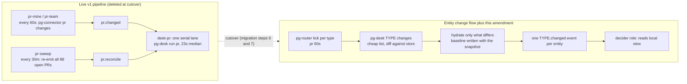
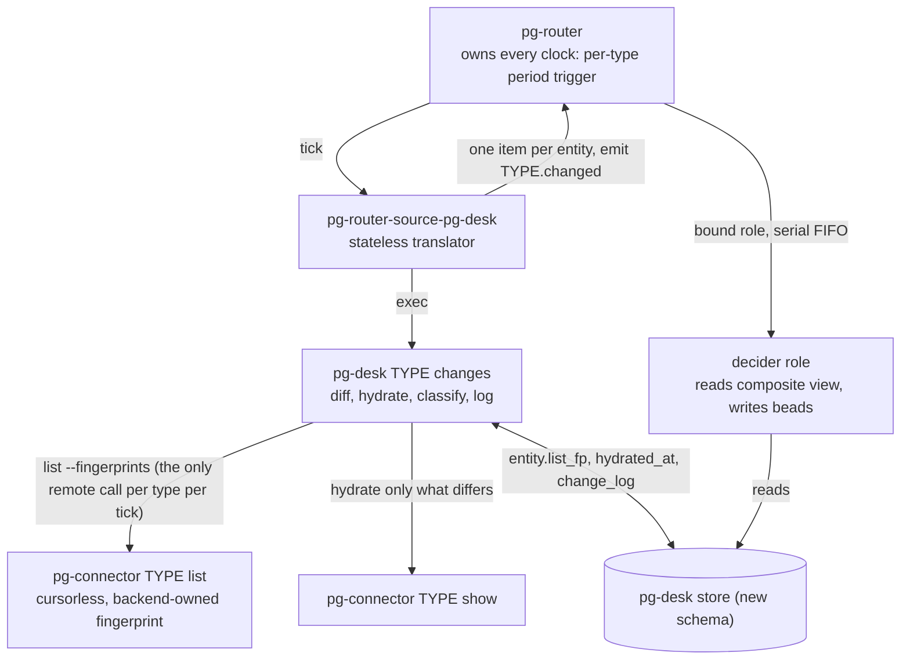
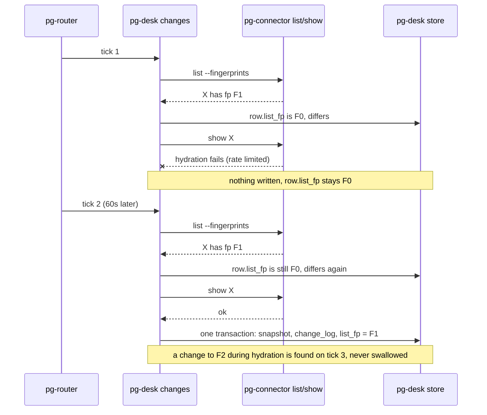

# Fast per-type change check scheduled by pg-router — design

**Status**: Approved 2026-10-05 (operator rulings on decision bead `pg2-32wg6`; see section 10 and
ADR 0077 rows S29 to S35). Section 9 is kept as the original list of decisions.
**Date**: 2026-10-05
**Bead**: `pg2-ii38x` (P0, label `router-health-2026-10`)
**Related**: ADR 0077 (entity change flow) and its program epic `pg2-2j5ac.52`; `pg2-u4c1s` (anchor
`last_checked_at` echo loop); `pg2-nimab` (pg-router role label on metrics)
**Governing design**: `docs/superpowers/specs/2026-09-29-entity-change-flow-design.md` (cited
below as "the change-flow design"; per this repo's citation conventions it is provenance, not a
durable citation target, and the durable decisions are in ADR 0077)

This document designs a fast, cheap, per-entity-type change check that pg-router schedules and
pg-desk evaluates, for every entity type pg-desk supports (`pr`, `issue` backed by beads or Jira,
`thread` backed by Slack). It answers the bead's Q0 to Q10 in order, each with file and line
evidence and measured numbers with their method. Nothing here is implemented. Requirement words
(MUST, SHOULD, MAY) are RFC 2119.

Identifiers of the ZR deployment (repository slugs, organization names, logins) are deliberately
absent: this repository is public. Examples use `<owner>/<repo>#<n>`.

## 0. Summary



| Question        | Short answer                                                                                                                                                                                                                                                                                                                             |
| --------------- | ---------------------------------------------------------------------------------------------------------------------------------------------------------------------------------------------------------------------------------------------------------------------------------------------------------------------------------------- |
| Q0              | Option (b): an amendment to the new flow. No new changed-items command on the v1 pipeline. The cheap per-minute PR list already exists on v1 (`pr-mine`, `pr-team`); what v1 lacks is the baseline, and v1 is deleted at cutover. The amendment lands in phases 6 and 7 of `pg2-2j5ac.52`; the cutover stays gated on the decider phase. |
| Core change     | Move the "seen" baseline from pg-connector's ledger to pg-desk's entity row, written in the same transaction as the hydrated snapshot (a level-triggered check). A failed hydration therefore leaves the entity still different, and the next tick finds it again, with no retry loop anywhere.                                          |
| What it removes | The deferral queue (`internal/changes/poll.go`), the `giving up after 5 polls` drop, and the `pr.reconcile` event class that clogs the lane.                                                                                                                                                                                             |
| What it adds    | A pg-connector `list` fingerprint (additive), a store column, a local-only reconcile tier, per-entity jitter, a removal-confirmation read, and an adapter fix (finding F-1).                                                                                                                                                             |
| pg-router core  | Unchanged. Only tests are added.                                                                                                                                                                                                                                                                                                         |

## 1. Q0: stop-gap on v1, or amendment to the new flow?

**Recommendation: (b).** Treat this as an amendment to ADR 0077's entity change flow. Do not design
a changed-items command on the v1 pipeline.

### 1.1 Why not (a)

The v1 pieces the bead names are `pg-desk run`, the `desk-*` ingest roles and `pr-sweep`. All three
are deleted at cutover (change-flow design, "What is removed" and "Migration" steps 6 and 7; ADR
0077's Cutover cluster, S11). A v1 changed-items command would be written, deployed, verified and
deleted within the same program. It would also have to survive on the v1 store (schema version 1,
see Q3), which has no `active`, `hydrated_at` or `version` columns, so the success-gated baseline
cannot be built there without a schema migration that the v1 ladder deliberately refuses
(`internal/store/sync_retry.go` header: the ladder "deliberately stops at schema version 1").

The v1 cheap check already exists and is not what is missing. `pr-mine` and `pr-team` run the
list every 60 seconds and diff a whole-summary hash (deployment flake `modules/zm/default.nix`
about line 298 to 345; `packages/pg-connector/cmd/pg-connector/ledger.go:349` `canonicalHash`;
`packages/pg-connector/cmd/pg-connector-pr-github/internal/github/github.go:780` `searchBatchedQuery`).
Measured 2026-10-05, the real v1 problem is queueing, not detection:

| v1 measurement (2026-10-05, 14:23:06 to 17:47:55 EDT, 3.42 h) | Value                                                       | Method                                                                                                                  |
| ------------------------------------------------------------- | ----------------------------------------------------------- | ----------------------------------------------------------------------------------------------------------------------- |
| `desk-pr` completions                                         | 368 (108 per hour)                                          | count of `kind=dispatch, role=desk-pr` rows in `~/.local/state/pg-router/events.jsonl` with `time >= 18:23Z`            |
| `desk-pr` busy fraction                                       | 75.3 percent                                                | sum of gaps under 90 s between consecutive completions (9,231 s) over the window (12,257 s); a lower bound on busy time |
| Run time, back-to-back                                        | median 23.0 s, p10 13.7 s, p90 40.3 s                       | the same gaps                                                                                                           |
| `pr.reconcile` enqueued                                       | 288 (84 per hour), in bursts of 47 to 89 per sweep          | `op=enqueue` rows in `queue.jsonl`                                                                                      |
| `pr.changed` enqueued                                         | 119 (34.8 per hour); 82 accepted (24.0 per hour)            | same file, `op=enqueue` and `op=accept`                                                                                 |
| `pr.changed` enqueue to completion                            | p50 1,002 s, p90 2,526 s, max 4,556 s (n=103, 16 unmatched) | join of `queue.jsonl` enqueue rows with the first later `desk-pr` completion for the same id                            |
| `pr.reconcile` enqueue to completion                          | p50 2,091 s, p90 5,069 s, max 6,061 s (n=238, 50 unmatched) | same join                                                                                                               |

The join method is in Appendix A. Because a `pr.changed` can be matched to an earlier
`pr.reconcile` completion of the same PR, the `pr.changed` waits are, if anything, understated.

### 1.2 What (b) costs and how it sequences

The change-flow design already puts PRs on a 60 second pg-router tick (design 9.9). The code for the
tick's verb, `pg-desk <type> changes` (`packages/pg-desk/cmd/pg-desk/changes.go:41-67`), the
persistent deferral queue, the rolling sweep and the adapter `packages/pg-router-source-pg-desk`
exists in the tree but is not deployed (the live store is schema v1). Phases 6 to 10 of
`pg2-2j5ac.52` are open (`.52.14`, `.52.16`, `.52.18`, `.52.20`, `.52.22`).

| Work item                                                                                                           | Phase       | Size                |
| ------------------------------------------------------------------------------------------------------------------- | ----------- | ------------------- |
| pg-connector: additive `fingerprints` on `list`; `graphql_cost` in the list log line                                | pre-phase 6 | S                   |
| pg-desk: `list_fp` column, diff-and-hydrate engine, removal-confirmation read, reconcile tier, jitter, `check` verb | 6           | M                   |
| Adapter: per-record `emit`, one item per entity per poll, seq-keyed identity (finding F-1)                          | 7           | S                   |
| pg-router: tests only (in-flight dedupe, multi-emit config load)                                                    | 9           | S                   |
| Deployment config prepared, not applied                                                                             | 9           | S                   |
| pg-decider parity, `plan`/`apply`                                                                                   | 8           | L (already planned) |
| Cutover (operator-run window)                                                                                       | 10          | M (already planned) |

The new work (rows 1 to 4) is about M in total and sits on the critical path of no existing phase
except 6 and 7. **The cutover is not brought forward by this amendment**: the cutover deletes
`internal/sync`, so it cannot precede the decider parity of phase 8. What changes is the
acceptance bar for phases 6 and 7.

### 1.3 Interim relief with no code (operator decision D2)

Until cutover the head-of-line blocking continues (a `pr.changed` waited 47 minutes behind a sweep
batch on 2026-10-05; ADR 0031 and `INV-CONC-1` accept head-of-line blocking per listener). Two
configuration-only options exist in the deployment flake, neither requires a pg-router change:

| Option                                                               | Effect                                                                                                                                                                                    | Risk                                                                                                                                                                          |
| -------------------------------------------------------------------- | ----------------------------------------------------------------------------------------------------------------------------------------------------------------------------------------- | ----------------------------------------------------------------------------------------------------------------------------------------------------------------------------- |
| O-1: lengthen `pr-sweep` from 30m to 6h (or retire it)               | 12 times fewer reconcile batches; a full batch blocks the lane for about 34 minutes (88 runs of 23 s), so the fraction of time spent blocked falls from every 30 minutes to every 6 hours | Loses the only v1 recovery of a failed run until the age window; 6h equals the change-flow design's `sweep.max_age`, which the operator accepted ("age limitations are fine") |
| O-2: split `desk-pr` into two roles, one per event type (a bulkhead) | A reconcile batch no longer blocks a change: separate listeners have separate FIFOs                                                                                                       | Two roles may run `pg-desk run pr` on the same PR concurrently; v1 `sync` dedupes through its ledger but this is unproven, so it needs a live exercise                        |

This spec recommends O-1 at 6h as the lowest-risk interim step and does not require either.

## 2. Findings that shape the design

| ID  | Finding                                                                                                                                                                                                                                                                                                                                                                                                                          | Evidence                                                                                                                                                                                                                                                  |
| --- | -------------------------------------------------------------------------------------------------------------------------------------------------------------------------------------------------------------------------------------------------------------------------------------------------------------------------------------------------------------------------------------------------------------------------------- | --------------------------------------------------------------------------------------------------------------------------------------------------------------------------------------------------------------------------------------------------------- |
| F-1 | **The adapter cannot route multi-kind events.** `pg-router` derives the event type from a record's `emit` selector, defaulting to the query's FIRST declared emit; `item.type` is carried as payload only. `pg-router-source-pg-desk` sets `type: "<type>.<kind>"` and never sets `emit`. With the 15-kind `emits` list of design 9.9, every event would be typed as the first kind.                                             | `packages/pg-router/internal/query/command.go:100-117` (`def := firstEmit(q)`, `emitType := def`, `r.Emit != ""`); `packages/pg-router-source-pg-desk/cmd/pg-router-source-pg-desk/changes.go:36-48` (no `emit`); `wire.go` `rawItem` has no `emit` field |
| F-2 | **A merged or closed PR is never classified.** All watched PR queries are `is:pr is:open ...`, so a PR that merges leaves every query. `applyMembership` then deactivates it with kind `removed` and does not hydrate it, so `closed` and `merged` are never logged for it, and the sweep skips inactive rows.                                                                                                                   | `packages/pg-desk/internal/changes/poll.go:177`; `classify/terminal.go`; query strings in the machine config of the deployment flake                                                                                                                      |
| F-3 | **A command role that fails after accepting is forgotten.** `Offer` runs the handler inline and reports accepted; a handler-side error only raises `OnHandlerFailure`. The core's delivery responsibility ends at acceptance.                                                                                                                                                                                                    | `packages/pg-router/internal/orchestrator/listener.go:104-110`; `invariants.md` `INV-EVT-1`, `INV-FAIL-1`                                                                                                                                                 |
| F-4 | **A query pass is sequential.** `produce` runs sources one after another; a slow `changes` tick delays every other source in that pass. Hydration inside `changes` (budget 50, plus a reset replay that is exempt from the budget) can therefore stall other sources.                                                                                                                                                            | `packages/pg-router/internal/discover/discover.go:420-540` (`for i, s := range sources`, no goroutines)                                                                                                                                                   |
| F-5 | **The thread (Slack) list cannot be fingerprinted.** It is one `claude -p` LLM call per query expression, always `Truncated: true`, cursor `nil`, so its content is non-deterministic and it can never report removals. `thread-me` has failed 48 times since 2026-09-19 (27 killed, 12 schema errors, 4 `unknown flag: --query`) and `desk-thread` has dispatched zero times in the retained `events.jsonl` (since 2026-09-17). | `packages/pg-connector/cmd/pg-connector-thread-slack/internal/backend.go:317-357`; `grep -a thread-me ~/.local/state/pg-router/launchd-stderr.log`                                                                                                        |

## 3. The design

### 3.1 Pattern vocabulary

- **Level-triggered reconciliation** (as opposed to edge-triggered): the check compares desired
  state (the list fingerprint) with observed state (the stored fingerprint), so a missed edge is
  recovered on the next comparison. The stored fingerprint plays the role of
  Kubernetes' `observedGeneration`.
- **Transactional Outbox**: `WriteEntityStateWithLog` already commits the snapshot, version bump
  and `change_log` row in one transaction (`packages/pg-desk/internal/store/changelog.go:67-76`).
  The fingerprint joins that transaction.
- **Strategy per type**: the fingerprint is computed by each backend's connector (it knows its
  volatile fields); pg-desk treats it as an opaque string.
- **Idempotent Receiver** and **Bulkhead**: deciders are idempotent (ADR 0077, Log and cursors
  cluster); each decider role is its own serial lane in pg-router.
- **Staggered refresh (jitter)**: age-based work is spread by a deterministic per-entity offset.

### 3.2 Components and responsibilities



Dependency direction is unchanged from ADR 0077: pg-desk depends on pg-connector; deciders depend
on pg-desk and pg-connector; pg-router reaches pg-desk only through the adapter. pg-desk starts no
clock, no timer and no retry loop (constraint 1).

### 3.3 The check, step by step

`pg-desk <type> changes --consumer NAME` (the existing verb, amended) performs, per tick:

1. **Inventory (the only remote call for the type).** For each watched query run
   `pg-connector <type> list --query Q --fingerprints` with no cursor. pg-connector returns the
   listed summaries and, additively, `fingerprints: {id: fp}` computed by the existing
   `canonicalHash` (drops `as_of` and `stale`; `ledger.go:349`) with per-backend volatile-field
   exclusions (see Q2 for beads). A source that is not `succeeded`, or a result with
   `truncated: true`, contributes no removals.
2. **Diff against the store (local).** For each listed entity, with `row` the active row for that
   entity:
   - `added`: no row, or the row is inactive;
   - `changed`: `row.list_fp != fp`;
   - unchanged: nothing.
     The fingerprint compared is ALWAYS list against list. It MUST NOT be recomputed from `show`
     output, because the list path has no `reviewThreads` or `mergeStateStatus`, carries top-level
     comment counts only (`github.go:742-760`), and search results lag; a list-versus-show comparison
     would report a change on every tick.
3. **Hydrate what differs.** Within `hydration.max_per_poll`, hydrate `added` and `changed`
   entities (changed first, oldest mismatch first). Per entity, one transaction writes the snapshot,
   `hydrated_at`, `active`, the `change_log` rows AND `list_fp := fp` (the fingerprint observed in
   step 1 of THIS tick, not any fingerprint derived afterwards). On any failure nothing is
   written. The entity is still different, so the next tick finds it again. No deferral queue is
   persisted. A hydration left over by the budget is found again the same way.
4. **Removals.** An id in a query's persisted membership that is absent from that query's complete
   list, and listed by no other watched query, is a removal candidate. pg-desk MUST perform one
   confirmation read before deactivating it (finding F-2): if the read shows the entity terminal,
   the classifier logs `closed` or `merged`; if the read reports `not_found`, the record is
   `removed`; if the read fails, the membership is left untouched and the candidate is found again
   next tick.
5. **Age tiers** (Q4 d and Q8):
   - _Local reconcile_: an active entity whose latest `change_log` row is older than
     `reconcile_age` (plus jitter) receives a `reconcile` record. No remote call, no hydration.
   - _Remote re-hydration_: an active entity whose `hydrated_at` is older than `sweep.max_age`
     (plus jitter) is hydrated (origin `sweep`). Subject to operator decision D5.
     Both tiers are rolling (oldest first) and capped per poll; the cap carries work forward, it does
     not drop it (Q6).
6. **Deliver.** Read the records past the consumer's cursor, flush, then advance the cursor
   (ADR 0077 S12, unchanged).



### 3.4 Data model

New schema only (the change-flow design, 9.11). The cutover migration has not run anywhere, so
adding a column to the migration it already contains costs no extra rung.

| Column or key                                         | Meaning                                                                                                                                                                                                         |
| ----------------------------------------------------- | --------------------------------------------------------------------------------------------------------------------------------------------------------------------------------------------------------------- |
| `entity.list_fp TEXT` (new)                           | The list fingerprint observed at the last SUCCESSFUL hydration. Empty for rows created by `--reset` or by the cutover backfill, which makes them `changed` once (one re-hydration, no work: the S28 precedent). |
| `entity.hydrated_at` (existing)                       | Drives the remote tier.                                                                                                                                                                                         |
| `max(change_log.at)` per entity (derived)             | Drives the local reconcile tier. No new column.                                                                                                                                                                 |
| `meta change_flow.watchset.<type>.<query>` (existing) | Per-query membership, used for removals.                                                                                                                                                                        |
| `meta change_flow.deferred.<type>` (existing)         | **Removed.**                                                                                                                                                                                                    |

### 3.5 Event shape and pg-router semantics

The adapter maps one change record to ONE item per entity per poll (the maximum `seq` among that
poll's records for the entity), with:

- `emit`: `<type>.changed` (fixes finding F-1);
- `id`: `<entity_id>@<seq>`;
- `metadata`: `entity_type`, `entity_id`, `kinds` (every kind of every record coalesced into the
  item), `seq`, `version`, `origin`, `degraded_sources`.

pg-router derives the event id as `<type>.changed:<entity_id>@<seq>`
(`packages/pg-router/internal/event/event.go:48-50`). Distinct changes therefore never collide
(Q4 b), a duplicate emission of the same record is absorbed (Q4 a), and a decider never branches on
kinds anyway (change-flow design STORY-DEC-1). ADR 0077 S4 already says "one event per changed
entity with its change kinds"; design 9.4's per-kind mapping was the adapter's choice, not a
ruling. The per-kind alternative stays available as decision D4.

## 4. Answers to Q1 to Q10

### Q1. Consumers: replace or run alongside?

**Replace, at cutover.** The migration already deletes `pr-mine`, `pr-team`, `pr-sweep`, the
`issue-*` and `thread-me` change feeds and the `desk-*` ingest roles (design "What is removed";
migration step 6). Evidence on the current wiring:

- Only `desk-pr` binds `pr.changed` and `pr.reconcile` (deployment flake `modules/zm/default.nix`
  about line 668 to 674).
- `pg-connector <type> changes` also writes and tombstones pg-connector's entity cache after the
  output is flushed (`packages/pg-connector/cmd/pg-connector/changes.go:66-113`, step 6 at line
  277; `cache_dispatch.go`). The cache is the fallback for `list` and `show` when a backend is down.
  Because the amended pg-desk calls `list`, which also refreshes the cache, the cache stays warm;
  what is lost is the _tombstone_ for removed ids. Consequence: while a backend is down, `list`
  MAY serve a removed entity from the cache for up to the cache max-age (default one hour), marked
  `stale: true` with the source row `served from cache: backend unavailable`
  (`cache_dispatch.go` `cacheFallbackReason`). pg-desk MUST treat any non-`succeeded` source as
  degraded: no removals, and no change detection on entities flagged `stale`. This is accepted.
- Ledgers are keyed by `(type, backend, query)` (`ledger.go` `LedgerKey`), so the other consumers
  of pg-connector (`escalated-work`, `split-review-work`) are independent of `pr-mine` and
  `pr-team`: removing pg-desk's use of `changes` touches none of them.
- The downstream beads that `desk-pr`'s sync step writes today (anchors and the `review-pr`,
  `fix-ci`, `resolve-conflict`, `process-feedback` children that feed the worker, review and
  feedback roles) move to the decider (ADR 0077 S2). The check only decides _when_ the decider
  runs; it neither reads nor writes beads for PRs. For the issue type, pg-desk's `issue show`
  hydrates a bead through pg-connector (`gather/entity.go` `issueGatherAdapter`), and the beads
  written by deciders re-enter the check as ordinary `issue` changes (loop termination, design
  7.4).

### Q2. The cheap list per type

Requirement for every type: one remote call per watched query per tick; no cursor; fingerprint
produced by the connector.

| Type             | List                                                                                                                                                                           | Cadence                                                                                   | Notes                                                         |
| ---------------- | ------------------------------------------------------------------------------------------------------------------------------------------------------------------------------ | ----------------------------------------------------------------------------------------- | ------------------------------------------------------------- |
| `pr`             | Reuse `pg-connector pr list` (the one `pr-mine`/`pr-team` already run), with its rate-reserve guard (`provider.go:190-224`, default reserve 1,000) plus the new `fingerprints` | **60s** (operator ruling)                                                                 | See cost below.                                               |
| `issue` (beads)  | `pg-connector issue list` (local `bd list`); fingerprint excludes `metadata.last_checked_at`                                                                                   | 5m now, **60s** once `pg2-u4c1s` has landed and local list latency is measured under 10 s | A 60s beads check before `pg2-u4c1s` amplifies the echo loop. |
| `issue` (Jira)   | `pg-connector issue list` with NO cursor                                                                                                                                       | **5m**                                                                                    | See the Jira note below.                                      |
| `thread` (Slack) | none                                                                                                                                                                           | **excluded**                                                                              | See F-5.                                                      |

**PR cost (measured, and where it is not).** From the connector's own log
(`~/.local/state/pg-connector-pr-github/events.jsonl` and `.1`, 2026-10-04T14:31Z to
2026-10-05T21:48Z, 31.3 h):

| Quantity                                      | Value                                                                                             | Method                                                                                                                        |
| --------------------------------------------- | ------------------------------------------------------------------------------------------------- | ----------------------------------------------------------------------------------------------------------------------------- |
| `list` operations                             | 3,066 (98 per hour; hourly min 42, max 110)                                                       | count of `op=list` rows                                                                                                       |
| `list` latency                                | p50 6.4 s, p90 20.9 s, p99 25.0 s (the bead quotes 12 to 19 s)                                    | `duration_ms`                                                                                                                 |
| GraphQL points consumed per hour, whole token | median 1,851, min 904, max 2,457 (29 full reset windows)                                          | `graphql_remaining` first minus last per `graphql_reset_at` window with at least 50 list rows and at least 0.9 h span         |
| `show` operations                             | 8,776 (280 per hour)                                                                              | count of `op=show` rows                                                                                                       |
| Points per `list`, adjacent rows only         | median 2, mean 3.2 (n=415 pairs; 231 at 2, 50 at 1, 33 at 4, 29 at 3, 25 at 5, 16 at 6, 14 at 12) | difference of `graphql_remaining` between two consecutive `list` rows with no other op between them and the same reset window |

Reading: a `list` costs about 2 points for a one-string query and about 12 for a six-string query
(the 14 pairs at 12 fit `6 searches x 2 points`), which reproduces the bead's estimate of about 840
points per hour for the seven search strings. But the log carries no per-operation cost, the
adjacent-pair method mixes queries, and the whole-token spend (about 1,850 per hour) is far larger
than the list share, so the remainder is `show`, `commits`, `files` and any other consumer of the
token. **The spec therefore requires the exact figure to be measured before cutover**, by adding
`rateLimit { cost remaining resetAt }` to each search request and logging `graphql_cost` on the
`list` line (test strategy item T-9). The bead's comparison holds either way: replacing `pr-mine`
and `pr-team` costs the same as today, and a shadow run alongside adds the list cost once. The
amended design cuts the other share: `show` runs only for changed and age-due entities. Expected
`show` calls fall from the measured 280 per hour to about 80 per hour (24 changed per hour plus 14.7
remote refreshes per hour, each about 2 calls). That projection is an estimate, not a measurement.

**Beads.** `canonicalHash` drops only `as_of` and `stale`, and a beads issue carries `updated_at`
and `metadata` (`pg-connector-issue-beads/internal/backend.go` about line 169). Every pg-desk
stamp of `last_checked_at` on an anchor therefore changes the issue's hash and re-emits it
(`pg2-u4c1s`). Requirement: the beads connector's fingerprint MUST exclude
`metadata.last_checked_at`, AND `pg2-u4c1s` MUST land first. **`pg2-u4c1s` MUST block every
issue-type implementation bead** that follows from this spec.

**Jira.** Today `list` appends `updated >= "<cursor>"` at minute precision, and the cursor is
stamped from the call's COMPLETION time and advances on read
(`pg-connector-issue-jira/internal/backend.go:587-598` `boundedJQL`, `:703` `newJiraCursor(time.Now())`).
That violates constraint 3 in two ways: a change made between the search and the cursor stamp is
missed (the window is the call duration plus Jira's index lag), and the cursor advances even when
the consumer then fails. The amended check calls `list` with no cursor, which runs the unbounded
search, so no lookback window exists. The existing second ids-only search then becomes redundant
for pg-desk and MAY be skipped by a flag.

**Slack.** Excluded from the cheap-check class. A thread type with no deterministic list cannot
meet constraint 3 or detect removals. Thread entities remain watchable by explicit
`pg-desk thread refresh <id>` and by S18's time-based `resolved` source. A deterministic Slack
backend (API search by `after:` plus conversation history, no LLM) is a separate design, listed as
decision D7.

### Q3. The baseline

- **Schema.** The live store is schema version 1 (`select * from meta` returns
  `schema_version|1`). It holds only PR rows (`select entity_type, count(*), sum(stale) from
entity group by 1` returns `pr|297|0`, measured 2026-10-05 17:50 EDT against a read-only open of
  `~/.local/state/pg-desk/store.db`) with no `active`, `hydrated_at` or `version` columns, and the
  `interpretation` and `ledger` tables are v1-only. The baseline for every type therefore lives
  only in the NEW schema, at `entity.list_fp` (section 3.4). New commands refuse a v1 store
  (`openNewSchemaStore`), so the check cannot run live before `pg-desk migrate --cutover`.
- **Written only on success.** `list_fp` is part of the single `WriteEntityStateWithLog`
  transaction (section 3.3, step 3). The compare-and-set loop retries lost races, and a failed
  gather, interpret or write returns before any store write
  (`packages/pg-desk/internal/pipeline/entity_change.go:113-131`).
- **`new` and `removed`.** `new` is "no active row"; `removed` is "left every watched query's
  complete list and a confirmation read agrees" (section 3.3, step 4).
- **Which fingerprint.** The LIST fingerprint of the tick that detected the change (item F in the
  bead). A change landing during hydration is found on the next tick because the stored value is
  the older observed one.
- **Alternative for the baseline owner.** Keeping `pg-connector <type> changes` and its ledger
  (what is built today) leaves the baseline in pg-connector's ledger, committed on `Refresh`
  success and advanced per consumer after flush (`changes.go:66-95`, `ledger.go:451`), which cannot
  express per-entity success: the cursor is one monotonic version per consumer, so if entity A
  (version 5) fails and entity B (version 6) succeeds, advancing to 6 loses A. That is why the
  deferral queue exists, and why it gives up after five polls (`watchset.go:27`,
  `poll.go:298-299`). Decision D3 records the choice.

### Q4. pg-router semantics

All four answers hold with NO change to pg-router's core. Evidence: `Enqueue` drops a re-emit only
while `retainedLocked` is true (`eventqueue/queue.go:697-698`, `:786-796`); retention ends when the
event is past `expiresAt` AND every bound listener has settled; the default event is born expired
(`INV-EVT-3`, `INV-EVT-4`, DEC-EVENT-1).

- **(a) A re-emit while a run is released-but-in-flight.** `Offer` is synchronous
  (`orchestrator/listener.go:104-110`), and the listener's pair stays unsettled until phase 3 of
  `Dispatch` (`queue.go:1175-1230`), so the entry is retained and the re-emit is `Deduped`: no
  second run. After the offer settles, a born-expired entry is no longer retained, and a re-emit
  hits the stale-retire branch and is `Enqueued` as a fresh event at the tail (`queue.go:706-728`).
- **(b) A change landing during a run is not swallowed.** The new event id includes `seq`
  (section 3.5), so a later change is a different event and is queued behind the running one on the
  same serial lane. Only an identical record re-emitted is absorbed. On the detection side the
  stored fingerprint is the older observed one (Q3), so the next tick re-detects. Without the seq
  in the id, a change record produced while the previous run was still in flight would be deduped
  and the decider would not see it until the next reconcile.
- **(c) One event type per entity.** In the new flow every entity has the single type
  `<type>.changed`, and `reconcile` is a _kind_ inside it, not a separate type; the v1 `pr.reconcile`
  class disappears with `pr-sweep`.
- **(d) Spreading the max-age refresh.** pg-router triggers are `period`, `threshold` and `manual`
  only, with no jitter (`config/registry.go:196-199`, `:556-568`). Spreading therefore lives in
  pg-desk: both age tiers pick rolling oldest-first batches under a per-poll cap, and add a
  deterministic offset `hash(entity_id) mod (age / 5)` to the due time, so entities hydrated
  together by `--reset` or by the cutover bootstrap do not all fall due in the same poll.
- **ADRs to amend.** ADR 0077: S5 and S6 (which source and with what call), S8 (tiers), S12
  (the cursor rule stays for deciders; the detection baseline is now an acknowledgment gated on
  hydration success), plus new rows S29 to S34 (section 6). ADR 0031, DEC-EVENT-1, DEC-EVENT-2,
  INV-FAIL-1 and INV-CONC-1 need **no amendment**: the design relies on their current text (born
  expired events, retention until settle, one serial lane per listener, the core's responsibility
  ending at acceptance) and proposes no per-binding priority.
- **Latency and head-of-line.** Reconcile no longer arrives as a batch of 88: the local tier is
  rolling and capped, and a decider run is a local read. Expected lane load is in Q9.

### Q5. Removals

- **PRs.** A closed or merged PR leaves every `is:open` query. As built it is deactivated as
  `removed` without a read (F-2), so `merged` and `closed` are lost. The confirmation read in step
  4 fixes this: the read returns the PR in its terminal state, the classifier logs `closed` or
  `merged` (`classify/pr.go:19-21`, `:247-248`), and `deactivateIfTerminal` deactivates it
  (`poll.go:218-224`). A PR that merely left a query (ownership changed) reads as still open and is
  logged `removed`, as the design's 6.1 requires.
- **Beads.** The work-bead query is `--status open`, so a closed bead leaves it. The same
  confirmation read (`issue show`) classifies it as terminal.
- **Versus `desk-reconcile` (v1, 30m, local).** `pg-desk reconcile` re-drives closure for PRs that
  left the open set and any due `sync_error` (`cmd/pg-desk/reconcile.go:21-30`). It is v1-only and
  is deleted with `internal/sync`; the confirmation read plus the local reconcile tier replace it.
- **Safety.** Removals are never inferred from a degraded or truncated source (existing rule,
  `poll.go:136-146`). Slack never reports removals (F-5), which is one reason it is excluded.

### Q6. Do per-poll caps that carry work forward violate "no total limit"?

**No, provided three conditions hold.** The operator's ruling was "age limitations are fine, no
total limit though": the objection is to a limit that can _miss_ a change. A per-poll cap on
_work started_ does not drop anything, because (1) the next tick re-detects every undone entity (the
fingerprint is still different, section 3.3), (2) selection is oldest-first, so no entity starves,
and (3) the sizing bound `active_count / max_per_poll x poll_interval <= max_age` is checked and
reported (`internal/changes/sweep.go:39-48` `SweepBoundHolds`, `DueBacklog`; `status` and `doctor`).
With the live count the bound is `88 / 20 x 1 min = 4.4 min`, far below 6 h. The two changes
required are: (i) the deferral queue's give-up after `maxDeferredAttempts` (5) is removed, because it
is a real drop; (ii) a violated bound MUST be an alerting condition, not only a `doctor` line. The
ruling's second reading, "no fixed lookback window", is satisfied by the Jira change in Q2.
Confirmation requested as decision D9.

### Q7. Existing retries versus constraint 1

Constraint 1: pg-router owns scheduling; pg-desk MUST NOT run its own retry or backoff loop.

| Mechanism                                                                                                                                                                   | Evidence                                                               | Verdict                                                                                                                                                                                                                                                    |
| --------------------------------------------------------------------------------------------------------------------------------------------------------------------------- | ---------------------------------------------------------------------- | ---------------------------------------------------------------------------------------------------------------------------------------------------------------------------------------------------------------------------------------------------------- |
| v1 `sync_error` automatic retry: per-entity `attempts`, `max_retries`, `next_retry_at` backoff, state `retrying`/`exhausted`/`non-transient`, re-driven by `desk-reconcile` | `internal/store/sync_retry.go:26-58`; `cmd/pg-desk/reconcile.go:21-30` | **It IS pg-desk's own backoff policy** (the policy lives in `internal/sync`, and it is only evaluated on a pg-router tick). Keep it on v1 exactly as is, do not extend it, and let it die with `interpretation.sync_error` and `internal/sync` at cutover. |
| New flow deferral queue: persisted list, `Attempts`, give-up after five polls                                                                                               | `internal/changes/poll.go:234-238`, `:296-302`; `watchset.go:27`       | No timer and no backoff (it advances only when pg-router ticks), but it is a second source of truth next to the list and it drops. **Remove**, replaced by the stale-fingerprint re-detect.                                                                |
| pg-router pull-source failure backoff (a failed `changes` exit 1 is retried by the core)                                                                                    | `invariants.md` `INV-FAIL-3`                                           | Allowed: it is pg-router's scheduling.                                                                                                                                                                                                                     |
| Replacement                                                                                                                                                                 | section 3.3                                                            | A failed hydration is re-found on the next scheduled tick because the baseline did not move. No state, no counter, no clock in pg-desk.                                                                                                                    |

A failed _decider_ run (accepted, then failed: F-3) is not retried by anyone; it is recovered by
the local reconcile tier within `reconcile_age`. The decider's own K-consecutive-failures
escalation (change-flow design 7.4) is unchanged. A decider acknowledgment protocol (the decider
writes an `applied_seq` annotation and pg-desk re-emits until it matches) is rejected for now
because pg-desk would have to know decider names, against ADR 0077's one-way dependency rule
(decision D6 notes this).

### Q8. May the max-age refresh pull remote data?

Surfaced as a decision (D5); the recommendation is **yes for the slow tier, no for the fast tier**.

- Fast tier (local reconcile, default `reconcile_age` 30m, the cadence `desk-reconcile` and
  `pr-sweep` have today): re-evaluates only what is in the store and beads. This honors "the
  reconcile wouldn't need to look remote". It is what recovers a failed decider run.
- Slow tier (`sweep.max_age` 6h, the change-flow design's default): re-hydrates remotely. Reason:
  the list fingerprint cannot see everything. The PR list has no `reviewThreads` or
  `mergeStateStatus` and counts only top-level comments (`github.go:742-780`); a PR whose review
  threads changed, with an unchanged `updatedAt`-bearing summary, would otherwise stay stale until
  its list fingerprint next moved. Cost: `88 / 6 h = 14.7` hydrations per hour, about 1 to 2 minutes
  of poll time per hour at the measured `show` mean of 3.2 s plus `commits` 0.65 s and `files`
  0.63 s (means over 8,776, 4,228 and 4,229 operations).

If the operator answers "local only", the blind-spot fields become visible only on the next list
change or an explicit `pg-desk pr refresh`.

### Q9. Measurement

- **`pr.changed` wait cannot be read from metrics today.** `pg_router_dispatch_latency` has only the
  label `outcome` and is measured from `evt.At` including run time (bead `pg2-nimab` adds `role`,
  not `type`). The baseline in section 1.1 therefore comes from `queue.jsonl` enqueue rows
  (`eventId`, `type`, `enqueuedAt`) joined to `desk-pr` dispatch completions in `events.jsonl`
  (method in Appendix A). Recommendation: also add `type` to the latency label set as a follow-up to
  `pg2-nimab`, so the post-rollout number is a standing metric (decision D10).
- **Rate, enqueues versus accepts.** The 24-hour metric
  `increase(pg_router_throughput_total{type="pr.changed"}[24h]) = 295` counts _accepts_, about 12
  per hour. In the measured window, enqueues were 119 (34.8 per hour) and accepts 82 (24.0 per
  hour): the afternoon is busier than the 24-hour mean, and enqueues exceed accepts because events
  were still queued when the file was read. The spec uses 12 to 35 per hour as the range, 24 per
  hour as the point value for the window.
- **Recomputed load.** v1 lane: demand `(84 + 24) per hour = 108` runs at a 23.0 s median is
  41.4 minutes per hour of a single lane (69 percent), consistent with the measured 75.3 percent
  busy. New flow, estimated: hydration inside the poll `24 x 5 s = 2.0 min/h` (`5 s` is the sum of
  the measured `show` 3.2 s, `commits` 0.65 s and `files` 0.63 s; CI reads are unmeasured, so this
  is an estimate), remote refresh `14.7 x 5 s = 1.2 min/h`, decider lane `(24 + 176) x t_decide`
  with 176 the local reconcile rate at `reconcile_age` 30m for 88 entities and `t_decide`
  unmeasured. At `t_decide` of 2 s that is 6.7 min/h (11 percent). `t_decide` MUST be measured in
  the rollout (item T-12); the figure is a planning estimate.
- Real useful work is rare: the `pg2-u4c1s` measurement is about 59 real writes in about 3,900 runs
  per 24 hours, so most of the 108 runs per hour are no-ops, which is why moving the decision off
  the expensive path matters.

### Q10. Rollout, and the before and after measurement

| Step | Action                                                                                                                                                                                                                                                                  | Gate                                                                                                               |
| ---- | ----------------------------------------------------------------------------------------------------------------------------------------------------------------------------------------------------------------------------------------------------------------------- | ------------------------------------------------------------------------------------------------------------------ |
| R0   | Record the baseline (Appendix A commands). Land `pg2-u4c1s`. Add `graphql_cost`.                                                                                                                                                                                        | Numbers in the decision bead                                                                                       |
| R1   | pg-connector: `list --fingerprints`. pg-desk: schema column, engine, `check` verb, confirmation read, tiers. Adapter: `emit`, coalescing, seq id.                                                                                                                       | Unit and queue tests (section 5), `go test` of the touched modules, run in the background with an explicit timeout |
| R2   | Prepare the deployment config for `<type> changes` queries and decider roles, not applied (phase 9)                                                                                                                                                                     | Loader checks (exact-match emits and binds)                                                                        |
| R3   | **Shadow check on a COPY of the store**: `pg-desk migrate --cutover` on a copy, then `pg-desk pr check` and one real `pg-router run-query` with a scratch `XDG_STATE_HOME`, deciders absent. Makes real remote calls, so it needs operator authorization (decision D8). | Forced failed hydration is re-found on the next tick                                                               |
| R4   | Cutover (phase 10, operator-run). Deciders in `plan`, then `apply`.                                                                                                                                                                                                     | Phase 10 procedure                                                                                                 |
| R5   | After one day, re-run the baseline commands and compare                                                                                                                                                                                                                 | Targets below                                                                                                      |

Targets (SHOULD): `pr.changed` enqueue-to-completion p90 under 120 s (one tick plus one run) from
2,526 s; `desk-pr`-class lane busy under 20 percent from 75.3 percent; `show` calls under 100 per
hour from 280; GraphQL points per hour not above the pre-rollout median of 1,851. Rollback is the
cutover's: restore the store backup and reapply the previous release (ADR 0077, Cutover cluster).

## 5. Test strategy

| ID   | Test                                 | Level                                                                                            | Asserts                                                                                                                                                                                                                                                                          |
| ---- | ------------------------------------ | ------------------------------------------------------------------------------------------------ | -------------------------------------------------------------------------------------------------------------------------------------------------------------------------------------------------------------------------------------------------------------------------------- |
| T-1  | Fingerprint compare                  | pg-desk unit (`internal/changes`)                                                                | equal fp is unchanged; different fp is `changed`; no row is `added`; inactive row is `added`; `stale: true` entities are ignored                                                                                                                                                 |
| T-2  | Baseline written only on success     | pg-desk unit with the existing `SetBetweenBumpAndAppendHook` fault seam (`changelog.go:78-82`)   | an injected failure inside the transaction, a gather error, a degraded read and a lost CAS all leave `list_fp` unchanged and write no `change_log` row; success writes snapshot, log and `list_fp` together                                                                      |
| T-3  | Failed run re-emitted next tick      | pg-desk engine test with a fake `Lister`/`Hydrator` (`internal/changes/changes_test.go` pattern) | tick 1 hydration fails, tick 2 reports the same entity `changed`; no deferred key is written; no give-up after more than five failures                                                                                                                                           |
| T-4  | Observed fingerprint, not recomputed | same                                                                                             | the stored value equals the list fingerprint even when the hydrated payload hashes differently                                                                                                                                                                                   |
| T-5  | Change during hydration              | same                                                                                             | a list that moves from F1 to F2 mid-run is detected on the next tick                                                                                                                                                                                                             |
| T-6  | In-flight re-emit dedupe             | pg-router queue test (`eventqueue/queue_test.go`, next to `TestDedupWhileRetained`)              | with an `Offer` blocked in flight, `Enqueue` of the same id returns `Deduped`; of a different `@seq` id returns `Enqueued`; after the offer settles, the same id returns `Enqueued`                                                                                              |
| T-7  | Multi-emit routing                   | adapter unit and pg-router loader test                                                           | each item carries `emit`; a config with the `<type>.changed` emit and bind loads; an orphan fails the loader check (`CLAUDE.md` config-testing trap: declare a role)                                                                                                             |
| T-8  | Removal confirmation                 | pg-desk unit                                                                                     | a PR that leaves the list and reads merged logs `merged`; one that reads open logs `removed`; a failed read leaves membership and re-finds it                                                                                                                                    |
| T-9  | Measured cost per search             | connector test plus live reading                                                                 | `graphql_cost` is present on every `list` line; the live read reports cost per search string for `mine` and `team` and the sum per hour                                                                                                                                          |
| T-10 | Beads fingerprint                    | connector unit                                                                                   | a `metadata.last_checked_at` change does not change the fingerprint; a status change does                                                                                                                                                                                        |
| T-11 | Live forced-failure exercise         | live, operator-authorized (R3)                                                                   | with the hydrator failing once (an unreachable `show`), `pg-router run-query` on tick 1 yields no record and tick 2 yields the entity within 60 s; checked for an actual non-trivial outcome, not only exit 0 (`CLAUDE.md`: a new `[[query]]`/`[[role]]` MUST be exercised live) |
| T-12 | Before and after                     | measurement                                                                                      | desk-pr or decider lane utilisation, `pr.changed` wait p50 and p90, GraphQL points per hour, `t_decide`, using the Appendix A commands before and after                                                                                                                          |
| T-13 | Reset and tiers                      | pg-desk unit                                                                                     | after `--reset` of 88 entities the local tier selects at most the cap per poll and the due times are spread by the jitter; `SweepBoundHolds` false raises the alert                                                                                                              |

## 6. ADR amendments

The draft amendment is appended to `docs/adr/0077-entity-change-flow.md` as "Proposed amendment
2026-10-05", rows S29 to S34, pending the operator's ruling. No other ADR needs an edit: ADR 0031
and the pg-router decisions (DEC-EVENT-1, DEC-EVENT-2) and invariants (INV-FAIL-1, INV-CONC-1) are
relied on as written. Behavior docs for `pg-desk`, `pg-connector` (the `fingerprints` field of
`list`) and the adapter MUST be updated in the same change as each implementation bead.

## 7. Conformance with the four derived constraints

| Constraint                                                                     | Conformance                                                                                                |
| ------------------------------------------------------------------------------ | ---------------------------------------------------------------------------------------------------------- |
| 1. pg-router owns scheduling; no pg-desk retry                                 | Yes. No timer, counter or backoff in pg-desk. The v1 `sync_retry` is v1-only and dies at cutover (Q7).     |
| 2. Per-type cadence; PRs every 1m                                              | Yes (Q2 table).                                                                                            |
| 3. No total cap, no fixed lookback that can miss a change; age refresh is fine | Yes after the Jira change (Q2), the removal of the deferral give-up and the cap-carries-forward rule (Q6). |
| 4. Baseline is pg-desk's store plus beads; one cheap remote list per type      | Yes, subject to D3 and D5 (the slow remote tier is a separate decision).                                   |

## 8. Appendix A: measurement methods

All measurements were read from local files; no remote service was called. Retained files:
`~/.local/state/pg-router/events.jsonl` (from 2026-09-17), `queue.jsonl` (compacted 2026-10-02; the
enqueue rows used start 2026-10-05T14:23:06-04:00),
`~/.local/state/pg-connector-pr-github/events.jsonl` and `.1` (2026-10-04T14:31Z to 2026-10-05T21:48Z),
`~/.local/state/pg-desk/store.db` (opened read-only).

```bash
# desk-pr completions (time, PR id); the window starts at 18:00Z
jq -r 'select(.kind=="dispatch" and .role=="desk-pr")|[.time,.bead]|@tsv' events.jsonl

# enqueue rows for the two PR event types
jq -r 'select(.op=="enqueue" and (.type=="pr.changed" or .type=="pr.reconcile"))
       |[.type,.enqueuedAt,.payload.id]|@tsv' queue.jsonl

# connector list rows: time, op, remaining, reset window, duration
jq -r 'select(.op!=null and .op!="capabilities")
       |[.time,.op,(.graphql_remaining//""),(.graphql_reset_at//""),(.duration_ms//0)]|@tsv' events.jsonl

# store schema and counts
sqlite3 -readonly store.db "select * from meta where key='schema_version'" \
  "select entity_type,count(*),sum(stale) from entity group by 1"
```

Join: for each enqueue at `T`, the first `desk-pr` completion for the same PR id with
`time > T`; wait is that completion minus `T` minus the run time (the gap to the previous
completion when under 90 s, else 23 s). Busy fraction: the sum of completion gaps under 90 s over
the window length. Limits: the join cannot tell a `pr.changed` from an earlier `pr.reconcile` of the
same PR (biases waits down); a completion records the end of a run, not its start; `events.jsonl`
has no event type or duration, which is the gap `pg2-nimab` and decision D10 address.

## 9. Open decisions for the operator

<!-- OPEN-DECISIONS-BEGIN -->

1. **D1 (Q0).** Approve option (b): fold the fast check into the entity change flow (amend ADR
   0077, phases 6 and 7) and build NO changed-items command on the v1 pipeline. Recommended: yes.
2. **D2 (interim, v1).** Choose none, O-1 (lengthen or retire `pr-sweep`, recommended at 6h) or O-2
   (split `desk-pr` by event type). Both are deployment-flake configuration only and are applied by
   the operator, not by this program.
3. **D3 (Q3, baseline owner).** Move the detection baseline into pg-desk (`entity.list_fp`, written in
   the hydration transaction), call `pg-connector <type> list` instead of `changes`, and delete the
   deferral queue; this amends ADR 0077 S5, S6 and S12. Alternative: keep `changes`, the pg-connector
   ledger and the deferral queue. Recommended: move it.
4. **D4 (Q4 c, event shape).** One `<type>.changed` event per entity per poll, kinds in metadata, id
   `<entity_id>@<seq>` (recommended) versus the per-kind events of design 9.4. Either way the adapter
   `emit` fix (F-1) ships.
5. **D5 (Q8).** May the age refresh pull remote data? Recommended: a local-only reconcile tier at 30m
   AND a remote re-hydration tier at 6h. Alternative: local only (blind-spot fields refresh only on
   a list change or an explicit refresh).
6. **D6 (Q7).** Confirm: v1 `sync_retry` stays v1-only and is deleted at cutover; the deferral queue is
   removed; a failed decider run is recovered by `reconcile_age` (default 30m, MAY be lowered because
   the tier is local) and NOT by a decider-acknowledgment protocol.
7. **D7 (Q2, cadences and Slack).** pr 60s; beads 5m now and 60s once `pg2-u4c1s` lands and local
   list latency is measured; Jira 5m with no cursor; Slack excluded. Also: authorize a separate design
   for a deterministic (non-LLM) Slack thread list.
8. **D8 (Q10).** Authorize the R3 shadow check on a store copy, which makes real GitHub calls; allow
   the list to run alongside the v1 feeds at 5m during it (about 170 extra points per hour at the
   2-points-per-one-string estimate, to be confirmed by `graphql_cost`). Reconciled 2026-10-06 (bead
   `pg2-ckll8`): `graphql_cost` measured 1 point per string at `first: 74`, so 12 shadow ticks over
   11 strings cost `12 x 11 x 1 = 132` extra points per hour (see 10.2).
9. **D9 (Q6).** Confirm that per-poll caps which carry work forward (no loss, only delay, bound
   checked and alerting) satisfy "no total limit", and that removing the deferral queue's give-up
   after five polls is required.
10. **D10 (Q9).** Add a `type` label to `pg_router_dispatch_latency` as a follow-up to `pg2-nimab`.
11. **D11 (Q5).** Approve the removal-confirmation read (one `show` when an entity leaves every
    watched query) so that merged and closed PRs and closed beads are classified (finding F-2).
12. **D12 (sequencing).** Confirm that the cutover is not re-sequenced ahead of phase 8 (decider
    parity) and that `pg2-u4c1s` blocks every issue-type implementation bead.

<!-- OPEN-DECISIONS-END -->

## 10. Rulings and cost-probe addendum (2026-10-05)

### 10.1 Rulings

The operator ruled every decision above on 2026-10-05, recorded on bead `pg2-32wg6` and in ADR 0077
rows S29 to S35.

| Decision | Ruling                                                                                                                                                                         |
| -------- | ------------------------------------------------------------------------------------------------------------------------------------------------------------------------------ |
| D1       | (b), in one step: `pg-desk <type> changes` lists, diffs, pulls what differs and emits `<type>.changed`. No changed-items command on v1, no separate pull event or puller role. |
| D2       | None. `pr-sweep` and `desk-pr` are not changed. (The design recommended O-1.)                                                                                                  |
| D3       | Move the baseline into pg-desk (`entity.list_fp`), call `list` not `changes`, delete the deferral queue.                                                                       |
| D4       | One `<type>.changed` event per entity per poll.                                                                                                                                |
| D5       | Local reconcile at 30 minutes plus remote re-hydration at 6 hours.                                                                                                             |
| D6       | Confirmed as recommended.                                                                                                                                                      |
| D7       | Confirmed; the deterministic Slack list design is authorized (`pg2-ynxy2`).                                                                                                    |
| D8       | Authorized: the shadow check on a store copy, at 5 minutes, with real GitHub calls.                                                                                            |
| D9       | Confirmed as recommended.                                                                                                                                                      |
| D10      | Yes; follow-up bead `pg2-sve9v`.                                                                                                                                               |
| D11      | Approved.                                                                                                                                                                      |
| D12      | Confirmed; `pg2-u4c1s` has already landed.                                                                                                                                     |

The orchestration the operator described (a per-minute check that finds what changed, then a pull of
those items, then the change events) is what D1 records, with one correction found while checking
it: GitHub search cannot OR across qualifiers, so there is no single query that returns the changed
items. Each watched query is listed separately and pg-desk takes the union (section 4, Q2).

### 10.2 Cost probe of the cheap PR list

Method: `rateLimit(dryRun: true) { cost nodeCount }` over one real watched search string (dry runs
consume no points), plus timed real runs of the baseline and the widest variant that works. Cost
follows GitHub's connection rule: one request for the search plus one per nested `first:N`
connection per PR, divided by 100 and rounded (the baseline is `(1 + 100 + 100) / 100 = 2`).

| Variant (added to the baseline node) | Cost per page     | Node count |
| ------------------------------------ | ----------------- | ---------- |
| baseline                             | 2                 | 2,200      |
| `reviewThreads { totalCount }`       | 2                 | 2,200      |
| labels `totalCount`                  | 2                 | 2,200      |
| `mergeStateStatus`                   | 2 (but see below) | 2,200      |
| `reviewRequests(first: 10)`          | 3                 | 3,200      |
| CI `contexts(first: 1)`              | 3                 | 2,300      |
| all of the above                     | 4                 | 3,300      |

Findings:

- `mergeStateStatus` makes the search time out: HTTP 502 or 504 at about 11 seconds on strings that
  match 24 or more PRs, in 6 of 6 attempts; without it the same query ran in 7 to 8 seconds.
  GitHub appears to cut a request near 10 seconds and the largest baseline string already takes up to
  9.6 seconds.
- A mixed-qualifier OR in a search string parses and silently returns zero rows. The comma form
  works for `label:` and does not for `author:`. One string per author is the only form that works.
  Bead `pg2-yye5p` tracks the watched string this breaks.
- Cost does not depend on the number of PRs: a string that matches nothing still costs 2 points.

Budget. Worst measured hour: whole-token spend 2,457 points, of which the list share was 744, so
the non-list spend is `2,457 - 744 = 1,713`. Usable ceiling is `5,000 - 1,000 = 4,000` per hour (the
connector refuses a list when fewer than 1,000 points remain). Total = `1,713 + strings x cost x 72`
(60 ticks plus 12 shadow ticks per hour):

| Strings, cost per page | Calculation         | Total | Headroom to 4,000 |
| ---------------------- | ------------------- | ----- | ----------------- |
| 7, 2                   | 1,713 + 7 x 2 x 72  | 2,721 | 1,279             |
| 7, 4                   | 1,713 + 7 x 4 x 72  | 3,729 | 271               |
| 11, 2                  | 1,713 + 11 x 2 x 72 | 3,297 | 703               |
| 11, 3                  | 1,713 + 11 x 3 x 72 | 4,089 | -89               |
| 11, 4                  | 1,713 + 11 x 4 x 72 | 4,881 | -881              |

The `show` reduction (about 280 calls an hour falling to about 80) is an unmeasured estimate and is
not counted. Tick time: the measured list latency (p50 5.97 s, p90 21.15 s, p99 25.31 s) puts a
sequential tick of 7 strings near 21 s at p50, and 11 strings near `21.4 + 4 x (18.86 / 6) = 34.0 s`
at p50 and `35.7 + 4 x (27.23 / 6) = 53.9 s` at p99 (a conservative sum), under the 60 second period
with thin margin at p99.

The variant table, the budget table and the cost of 2 points above are the 2026-10-05 probe at a page
size of `first: 100`. They are kept as the record of that probe and are SUPERSEDED for the shipped
list by the reconciliation below.

#### Reconciliation at `first: 74` (2026-10-06, bead `pg2-ckll8`)

The shipped list requests pages of `first: 74` (bead `pg2-cw6b3.9`), which section 6.6 of the
attention-evaluator design (`2026-10-05-pg-desk-attention-evaluator-and-connector-refresh-cache-design.md`)
measured as 1 point per page against 2 at `first: 100`. Bead `pg2-x3h8c.11` then measured the real
connector end to end (read-only, a scratch state home, main at `95e5b5f5`, one call each, the
current cheap field set, 11 strings made of 1 `mine` string and 10 `team` strings, one string per
author), and its result comment is the source of the figures below:

| Query | Strings | `graphql_cost` | Per string | `duration_ms` |
| ----- | ------- | -------------- | ---------- | ------------- |
| mine  | 1       | 1              | 1          | 3,782         |
| team  | 10      | 10             | 1          | 27,446        |

The measured per-string cost is 1 point, not the 2 assumed above. The recomputed worst-hour total
uses the same non-list spend of 1,713 and the same 72 ticks (60 plus 12 shadow):

| Strings, cost per page | Calculation         | Total | Headroom to 4,000 | Source                     |
| ---------------------- | ------------------- | ----- | ----------------- | -------------------------- |
| 11, 1 (measured)       | 1,713 + 11 x 1 x 72 | 2,505 | 1,495             | `pg2-x3h8c.11`             |
| 11, 2 (`first: 100`)   | 1,713 + 11 x 2 x 72 | 3,297 | 703               | the 2026-10-05 probe above |

At the 60 s cadence the list spends `60 x (1 + 10) = 660` points per hour; a sequential tick takes
`3.782 + 27.446 = 31.2 s` against the 60 s period (one run each, so p50 and p99 are not measured and
the p99 tail stays the thin spot). Verdict: the budget holds at 60 s with the current field set.

The measurement carries two caveats that a reader MUST keep with the figure:

- It assumes no string paginates past one page of 74 results (cost equalled the string count). A
  string that overflows pays one extra page. Adding a field to the batched query can move the 74
  boundary, which `TestSearchBatchedQuery_PinnedFieldSet` pins for the current field set.
- The 3-point and 4-point variants of the table above (`reviewRequests`, CI `contexts`) were priced
  at `first: 100` and were NOT re-measured at `first: 74`. The 11-string rows for those variants stay
  conservative upper bounds until a field-set change re-measures them (S35 item f requires the
  recomputation anyway).

One more reading of the same measurement. The `mine` row logged `graphql_remaining` 4,985 with a
reset at 18:01:21Z while the `team` row logged 3,978 with a reset at 18:12:12Z, so the two calls
reported different rate-limit windows. This is NOT a stale rate-limit read: every `list` call runs
its own fresh `rateLimit` read (`checkRateReserve` calls `ReadRateLimit`, a new `gh api graphql`
request, before its first search) and the rows of two separate invocations share no state. The
windows differ because the credentials differ: the connector's token chain takes an ambient
`GH_TOKEN` or `GITHUB_TOKEN` first and only then `gh auth token`, so two invocations launched with
different environments are two different rate-limit principals. A window that had spent 15 of 5,000
points is not the live feed's token, which had spent about 1,000. The cost figures do not depend on
the window. The log does not record which credential a row used, so attributing a row to a window
needs the launching environment.

### 10.3 Field set and guardrails

ADR 0077 row S35 records the resulting rules: add `reviewThreads` `totalCount` and the labels
`totalCount`; defer `reviewRequests`; keep `mergeStateStatus` show-only; add no CI-detail field;
require a field-coverage test (every field a consumer reads is in the list fingerprint or on a
declared blind-spot list that names its refresh tier); and recompute the points budget whenever the
string count, the page size or the field set changes. The follow-up beads are `pg2-eax6d` (decompose
into implementation beads), `pg2-sve9v`, `pg2-ynxy2` and `pg2-yye5p`. The budget figures in 10.2 are
reconciled to the measured 1 point per string at `first: 74` (bead `pg2-ckll8`, 2026-10-06).
