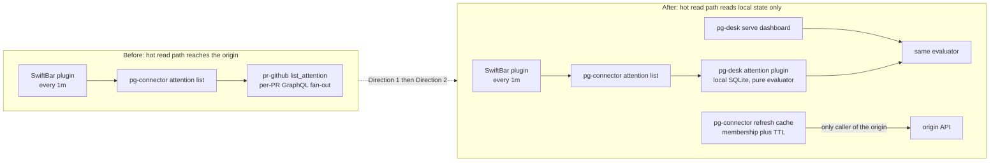
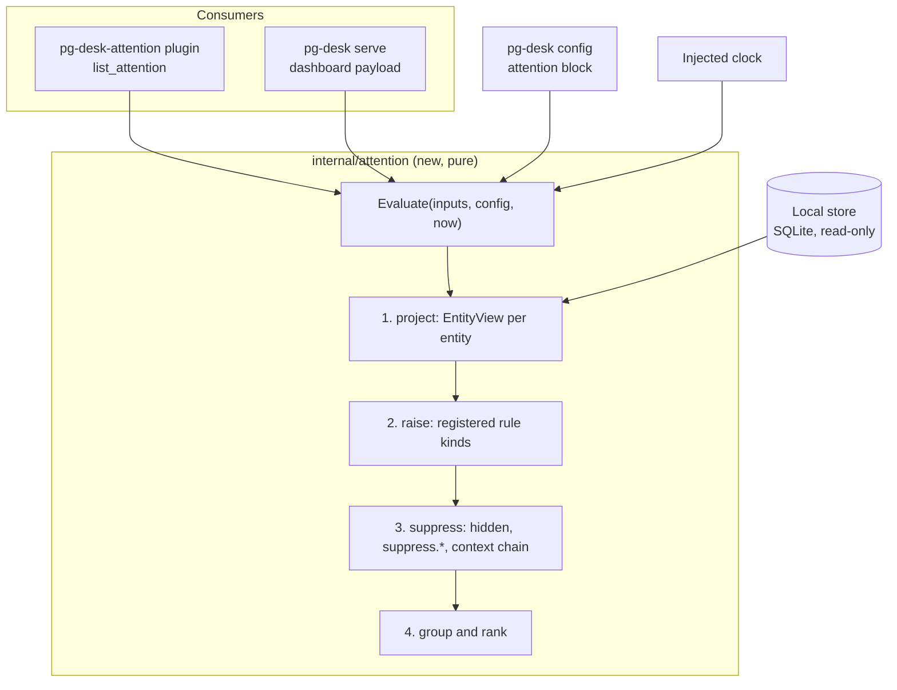
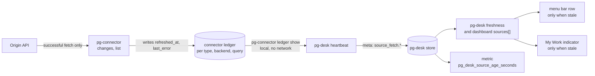
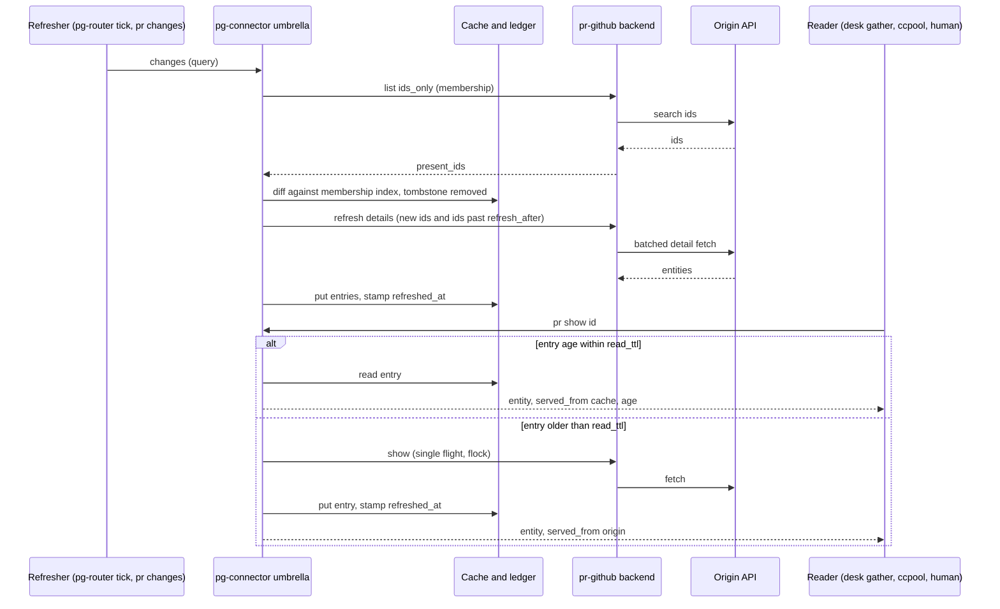

# pg-desk attention evaluator and connector refresh cache — design

**Status**: Draft for operator review. Nothing here is implemented, and no bead named in the final
section has been filed.
**Date**: 2026-10-05
**Bead**: `pg2-m482k` (P0 pointer bead, labels `agent-support` and `ziprecruiter`)
**Related**: ADR 0077 (entity change flow); `pg2-aehpr` (batched `list`, closed); `pg2-2hzcc`
(cross-reference links, landed as `pg-desk links`); `pg2-ph0o4` (pr-github event log, landed);
`pg2-px61p` (menu bar degraded rows, landed); `pg2-ii38x` (fast per-type change check, design
closed, landed with a proposed ADR 0077 amendment whose approval is pending on the operator
decision bead `pg2-32wg6`); `pg2-w977` (reserve ruling)

Like the other files under `docs/superpowers/specs/`, this file is an extraction source, not a
durable citation target. "Durable decision homes" names the ADR and behavior-docs changes that
carry the decisions once the operator approves. The key words MUST, MUST NOT, SHOULD, SHOULD NOT
and MAY are used as in RFC 2119.

This repository is public. Deployment specifics (organization, repository slugs, logins, query
strings) are deliberately absent. Examples use `<owner>/<repo>#<n>`.

## 0. Summary

The 2026-10-05 operator decisions on bead `pg2-m482k` fix the shape of the work. This spec turns
them into a design and a bead breakdown, and puts every choice the operator has not made into
"Open questions for spec review".

| Topic              | Decision (operator, 2026-10-05) and what this spec adds                                                                                                                               |
| ------------------ | ------------------------------------------------------------------------------------------------------------------------------------------------------------------------------------- |
| Rule model         | A read-time, side-effect-free evaluator inside pg-desk. Go rule kinds in a registry, tuned by config parameters, with `suppress.*` annotations as per-entity overrides (section 4).   |
| Grouping and links | Group key is the Jira issue, else the PR stack, else the bead. Links come from the existing `pg-desk links` resolver. One evaluator feeds menu bar and dashboard (sections 4.5, 4.6). |
| Freshness          | Per-source age of the last successful origin fetch, shown only past a staleness threshold. This spec recommends 15 minutes (section 5).                                               |
| Direction 2        | Connector membership plus refresh cache, then Jira and Slack (section 6).                                                                                                             |
| Retirement         | Delete the `list_attention` code of the PR, Jira and beads backends after the desk plugin lands, and amend three docs (section 9).                                                    |
| Prerequisite       | A PR-to-PR dependency source, filed as its own bead (section 8).                                                                                                                      |

## 1. Scope and binding decisions

The following are executed decisions, quoted from the bead's "OPERATOR DECISIONS 2026-10-05"
block. This spec MUST NOT reopen them.

1. **Rule model.** "Read-time pure evaluator in pg-desk." It reuses the registry SHAPE of
   `classify.Register` and the config-parameter shape of `verdict_generations`, uses `suppress.*`
   annotations for operator overrides, and does NOT reuse pg-decider's runtime. A PR-to-PR
   dependency source is a prerequisite for the "broken PR that depends on 2 sibling PRs"
   suppression rule and is filed as its own bead; the evaluator ships first with simpler rules.
2. **D3.** Delete the pr-github, issue-jira and issue-beads `list_attention` code AFTER the pg-desk
   attention plugin lands. File a "delete `list_attention` and amend `INV-ATTN-CI-1`, `STORY-OP-8`
   and `interfaces.md`" bead blocked by the desk plugin bead.
3. **Grouping.** Group by work context: Jira issue, else PR stack, else bead. Items most urgent
   first. Links to related concepts through the existing `pg-desk links` resolver. One evaluator
   feeds the menu bar plugin and the dashboard.
4. **Freshness.** Per-source age, shown when stale. The time of the last SUCCESSFUL origin fetch
   per source, never per-row `as_of`. Shown on My Work and the menu bar only past a threshold the
   spec picks. Export `pg_desk_source_age_seconds{source}`. Keep `pg_desk_dashboard_stale` as
   pipeline liveness and do not flip its polarity.
5. **Standing earlier decisions.** The plugin is back at `1m`. Direction 2 is the connector
   membership plus refresh cache, then Jira and Slack (the 2026-10-02 ruling). The connector
   observability contract `OBS-1` to `OBS-4` and `ATTN-0` stand. `rate_reserve_points` stays 1000
   (`pg2-w977`).

Also binding from the 2026-10-02 rulings: the menu bar keeps reading ONLY `pg-connector attention
list` (single feed), and entity attention ("this PR needs me now") is owned by pg-desk while a
connector's attention shrinks to what it alone has context for.

## 2. What exists today (verified 2026-10-05)

Every claim below was checked against the source in this worktree. Line numbers are for the commit
this spec branched from and drift quickly, so treat them as pointers. Appendix A lists the claims
in the bead that were found false or stale.

### 2.1 The attention feed and its sources

- `pg-connector attention list` fans `list_attention` out to every backend in `attention.sources`
  (`packages/pg-connector/cmd/pg-connector/attention.go`, `fanOutAttentionList`, line 77), execing
  each backend as a one-shot script-out process (`scriptout.Invoke`). It dedups by `{type, id}`
  and ranks by severity (`mergeAttentionItems`, line 184). A source that errors becomes a
  `sources[]` row with status `degraded` and contributes no items.
- The item shape is `{type, id, summary}` plus optional `severity` and `url`
  (`packages/pg-connector/pkg/schema/attention.go`; `AttentionSchemaVersion` is already 2).
- The per-source `sources[]` row has only `source`, `status`, `count` and `reason`
  (`cmd/pg-connector/outcome.go`, `SourceResult`, line 40). It has no age field.
- The deployment's `attention.sources` currently lists the agent-session, calendar and alert
  backends only. The pr-github, issue-jira and issue-beads backends were removed from it by the
  deployment commit `71ce9888` (2026-10-02), which also returned the plugin to `1m`. So the hot
  path no longer spends GraphQL points, and PR, Jira-due and bead-due items are nowhere in the
  menu bar until Direction 1 lands (decision D1 of the earlier session, accepted by the operator).

### 2.2 The code Direction 1 replaces

`Backend.ListAttention` in `packages/pg-connector/cmd/pg-connector-pr-github/internal/provider.go`
(line 672) emits two item types:

| Item type | Summary prefix                                      | Severity | Predicate                                                                                                                                                                                                                             |
| --------- | --------------------------------------------------- | -------- | ------------------------------------------------------------------------------------------------------------------------------------------------------------------------------------------------------------------------------------- |
| `pr`      | `unreviewed-by-me` or `re-review-after-my-approval` | omitted  | `needsAttentionForPR` (line 557): a merge conflict dampens; a standing teammate approval clears; my own review of the current head clears; otherwise first review or re-review. Needs each review's commit oid (`ReviewsWithCommit`). |
| `pr-ci`   | `ci-failing-on-my-pr`                               | `high`   | `ciFailingForPR` (line 469): own, open, non-draft, unmerged PR with a failed head-commit check that `ci_exclude` does not drop. `INV-ATTN-CI-1`.                                                                                      |

It first runs the shared reserve guard (`checkRateReserve`, line 219; default reserve 1000,
line 188), then resolves the viewer, runs the configured `attention_query` searches, and calls
`GetPR` and `ReviewsWithCommit` per candidate (bounded at 8 workers). The own-PR CI scan adds one
search plus one `GetPR` per non-draft PR (`listCIFailingAttention`, line 749).

The Jira and beads backends emit deadline items (`attention_threshold`, `attention_exclude`; the
default threshold is 24 hours) from a Jira `duedate` or a bead `--due`
(`cmd/pg-connector-issue-jira/internal/attention.go`, `cmd/pg-connector-issue-beads/internal/attention.go`).
`schema.Issue` carries `DueDate` (`pkg/schema/issue.go`, line 187).

### 2.3 What pg-desk holds

- The live store is on schema version 1: `pg-desk status` printed `schema_version: 1` and
  `change_flow: unmigrated: run pg-desk migrate --cutover`. At the same time the entity table held
  299 rows, all of type `pr`, and no `issue` or `thread` rows (read-only query,
  `select entity_type, count(*) from entity group by 1`).
- Version 2 (after `pg-desk migrate --cutover`) adds the key/value `annotation` table, the change
  log and consumers (`docs/behavior/pg-desk/store-schema.md`). The reserved `suppress.<kind>`
  annotation and the `suppress` verb exist only there (`internal/store/annotation_kv.go`, lines
  27 to 57; `docs/behavior/pg-desk/annotate.md`, "Old-schema refusal"). On version 1 the
  annotation table has only the old `hidden`, `wip` and per-comment disposition columns.
- Interpretation rows already place every open PR in one of five panels
  (`team_awaiting_owner`, `team_awaiting_team`, `team_awaiting_me`, `mine_awaiting_me`,
  `mine_awaiting_team`) by `classifyPanel` (`internal/interpret/approvals.go`, line 402). The two
  "awaiting me" panels are the dashboard's existing definition of "needs me". Of 299 rows, 40
  carry a panel.
- `schema.PRReview` has no commit oid (`packages/pg-connector/pkg/schema/pr.go`, line 232), and
  the interpret package documents the consequence: no staleness axis for approvals
  (`internal/interpret/interpret.go`, package comment). The "re-review after my approval" leg of
  today's `pr` attention item therefore cannot be answered from pg-desk today.
- The PR's `base` branch name is decoded (`schema.PR.Base`, `pr.go` line 86; `internal/classify/pr.go`
  line 63 and `base_changed` at line 261; `internal/interpret/interpret.go` line 358) but is never
  compared with another PR's head branch. There is no PR-to-PR dependency logic from any source.
- Cross-entity facts are write-time. `RunInterpretOnly` (`internal/pipeline/pipeline.go`, line 387)
  re-interprets from facts stored at the last gather, and `waiting_on_me` is computed from the
  stored `Facts.Deps`. A sibling's change therefore does not update an entity's panel until that
  entity is itself re-run.
- `pg-desk links` (`internal/links`) is a read-only, offline batch lookup keyed by the attention
  item's `{type, id}`. It already resolves `pr-ci:<id>` as the PR (`refTypeAliases`). On a
  version 1 store it degrades to the legacy PR-to-Jira links and reports `degraded: true`.
- `pg-desk status` already runs `pg-connector ledger show` (`cmd/pg-desk/status.go`, line 29), so
  the ledger is an existing, local-only read path from pg-desk into pg-connector. The ledger has
  no field for the time of the last successful origin fetch: its entries are `cursor`,
  `index_size`, `version` and `consumers` (`cmd/pg-connector/ledger.go`, `Ledger`, line 82).

### 2.4 Freshness signals today

- `GET /api/v1/dashboard` derives `generated_at`, `age_seconds` and `stale` from
  `meta.last_heartbeat` (`internal/httpapi/server.go`, lines 296 to 325), with the bound set to two
  heartbeat periods (`boundIntervals`, line 47; default period 60 seconds, line 45). That is
  pipeline liveness, not data age. `pg_desk_dashboard_stale` is 0 for fresh and 1 for stale
  (`internal/metrics/metrics.go`, line 44).
- The My Work Grafana dashboard reads that endpoint and has a "Data Age (s)" panel on
  `age_seconds` (`darwin/modules/observability/dashboards/pg-desk.json` in the support-apps repo).
- Per-row `as_of` is not a freshness signal. Method: `strftime('%s','now') - strftime('%s', as_of)`
  over the store on 2026-10-05, counting rows older than 3600 seconds: 225 of 299 entity rows and
  222 of 299 interpretation rows (75 percent) were older than one hour, which is normal for an
  event-driven store. These counts are time-dependent (the store is read live and changes every
  minute), so read them as an order of magnitude, not a fixed fact.
- The menu bar plugin already renders a degraded source row as `"<source>: <status>[: <reason>];
data N min old"` when the `sources[]` row carries `age_seconds` or `as_of`
  (`modules/local-alert-triage/lat-menubar/lat-menubar.sh` in the deployment repo, bead
  `pg2-px61p`). The umbrella never sets those fields today.

### 2.5 The connector entity cache

`packages/pg-connector/cmd/pg-connector/cache.go` is an umbrella-owned store: one file per
`(type, backend)`, entries keyed by entity id, flock plus temp-file rename, LRU eviction, and a
`Get` that honors a max age (default one hour, `resolveCacheMaxAge`, line 476). Today it is used
only as follows, and `fanOutAttentionList` never touches it:

- `pr show` and `issue show` consult it ONLY after a backend answers `unavailable`
  (`cache_dispatch.go`, `dispatchShowWithCache`, line 85); `pr list` and `issue list` do the same
  for a whole backend (`pr.go`, line 221).
- `pr changes` reads it only to give a `removed` entity its last content (`changes.go`, line 487).
- A live `show` writes the full entity (`pr.go`, line 70) and a live `list` writes each summary
  entity (`pr.go`, line 249), into the SAME per-id key space, with `Put` overwriting
  (`cache.go`, line 286). A summary written by `list` can therefore replace a detailed entity
  written by `show`. This is a latent hazard of the current fallback and a hard constraint on any
  proactive use (section 6.3).

The GraphQL batching design (`pg2-aehpr`) considered and rejected a proactive TTL cache with a
`skip_ids` wire hint, because the batched query removed the N+1 shape with no staleness trade-off,
and told any future implementer not to resurrect it without reading that rationale. Direction 2 is
the operator's own 2026-10-02 redirect toward exactly that cache, and section 6.4 answers the
batching design's objections.

## 3. Part 1: per-source attention taxonomy

The operator's source contract is: calendar is "meeting soon", pa-monitor is "session waiting on
me", alert-grafana is "alerts", entity attention (PR, Jira, bead, later mail) comes from pg-desk,
and a connector's attention MUST be about interesting things in the data (`ATTN-0`) and MUST NOT
duplicate an alert (`OBS-4`). The table records what each registered or candidate source emits
today, verified in code, and the change this design implies.

| Source                          | Emits today (verified)                                                                                                                                                                 | Owner after this design        | Change                                                                                                                                                                                                   |
| ------------------------------- | -------------------------------------------------------------------------------------------------------------------------------------------------------------------------------------- | ------------------------------ | -------------------------------------------------------------------------------------------------------------------------------------------------------------------------------------------------------- |
| alert-grafana                   | One item per firing alert in the configured `attention_query` set (`pg-connector-alert-grafana/internal/backend.go`, `ListAttention`, line 204).                                       | alert-grafana                  | None.                                                                                                                                                                                                    |
| calendar-osx-bridge             | A time-based ramp over events inside the attention window (`computeSeverity`, `internal/backend.go`, line 562; `ListAttention` at line 597), type `calendar_event`. Already time-only. | calendar-osx-bridge            | None.                                                                                                                                                                                                    |
| agentsession-pa-monitor         | `blocked` sessions (severity by blocker: `human_input` and `human_authn` high, `usage_limit` medium) and `LongIdle` sessions (low) (`internal/attention.go`, line 33).                 | agentsession-pa-monitor        | Drop the `usage_limit` blocker items (they duplicate Prometheus alert rules, `OBS-4`); keep `human_input`, `human_authn` and long-idle. Already filed as `pg2-psftz`; not part of this spec's breakdown. |
| pr-github                       | `pr` and `pr-ci` items (section 2.2).                                                                                                                                                  | pg-desk                        | Registered out of `attention.sources` (done). Code deleted after the plugin lands (section 9). The `pr-ci` rule is re-expressed as a desk rule; the stale-approval leg is open (Open questions, item 4). |
| issue-jira                      | Deadline items from `duedate` within `attention_threshold` (default 24 hours), plus overdue.                                                                                           | pg-desk                        | Registered out (done). Code deleted after the plugin lands. A desk rule needs `issue` entities hydrated, which the live store has none of (section 4.3, "Deferred and later rules").                     |
| issue-beads                     | Deadline items from a bead's `due_at` within the same threshold, plus overdue.                                                                                                         | pg-desk                        | Same as issue-jira.                                                                                                                                                                                      |
| mail-osx-bridge                 | An EMPTY list on purpose (`internal/backend.go`, `ListAttention`, line 368; `INV-MAIL-3`, `INV-MAIL-4`). Registered under `search.sources` only.                                       | pg-desk (later)                | Out of scope here. The operator ruled on 2026-10-05 that email attention lives in a pg-desk attention rule; it needs a `mail` entity type that does not exist yet.                                       |
| thread-slack                    | No `list_attention` at all (not in the list of backends that implement it).                                                                                                            | pg-desk (later) or a connector | Out of scope here. Unread-chat attention is named by `ATTN-0` as an example; its owner is undecided (Open questions, item 10).                                                                           |
| pg-desk attention plugin        | New: one item per entity that needs the operator now, grouped by work context (section 4).                                                                                             | pg-desk                        | New standalone `list_attention` backend, registered in `attention.sources`.                                                                                                                              |
| Connector health (auth, outage) | Nothing, by decision `ATTN-0` and `OBS-4`. pr-github and thread-slack now write their own rotating event log (`pkg/eventlog`, bead `pg2-ph0o4`) for Loki alert rules.                  | each connector's own telemetry | None in this spec.                                                                                                                                                                                       |
| Data freshness (this design)    | Not an attention source. A stale feed is reported through the freshness channel (section 5), because a stale source still has items worth showing.                                     | pg-desk                        | New `pg-desk freshness` verb and dashboard fields.                                                                                                                                                       |

## 4. Direction 1: the pg-desk attention evaluator

### 4.1 Pattern vocabulary and placement

- **Specification**: each rule is a predicate over a read-only view of one entity (and, for
  suppression, over its neighbours). Rules compose; they do not mutate.
- **Registry (Strategy)**: rule kinds register by name at `init`, with a panic on a duplicate,
  exactly the shape of `classify.Register` (`internal/classify/classify.go`, line 18).
- **Chain of Responsibility**: suppression runs as an ordered chain; the first suppressor that
  claims a candidate wins and records its reason.
- **Pipeline (Pipes and Filters)** with four stages: project, raise, suppress, group and rank.
- **Facade**: one `attention.Evaluate` function is the only entry point. Both consumers call it.
- **Parameter Object**: tunables are config values keyed by rule kind, the shape of
  `verdict_generations` (`internal/config/config.go`, line 79).

The shared registry SHAPE with pg-decider is deliberate and the shared RUNTIME is rejected. A
decider is event-driven and write-side: it creates beads and annotations when an entity changes. A
"needs me" annotation written that way would be stale for every time-based rule and every rule
that depends on a sibling, because no event fires on the entity when the clock advances or a
sibling merges. The evaluator is read-time and pure, which fixes that for the parts that are
actually computed at read time. Be precise about which parts those are:

- **Read time, every call:** the suppression chain (annotations, the dependency check that reads
  sibling entities' CURRENT rows), grouping, ordering, and any time-based rule (the clock is an
  input). A sibling that merges changes its own row through its own event, and the next read sees
  it with no event on the dependent entity.
- **Write time:** the first-release raise rules project the STORED interpretation row
  (`panel`, `approvals`, `match_reasons`), which interpret computed at the entity's last
  hydration. They are exactly as fresh as that run, and cross-entity inputs INSIDE interpret (for
  example `waiting_on_me`, computed from the `Facts.Deps` stored at the last gather) stay stale
  until the entity is re-run. Only the own-PR CI rule re-derives a fact at read time (from the
  stored CI facts).

So the first release is "read-time over stored interpretations", not "everything re-derived at
every read". Re-deriving interpretation at read time (running the pure `Interpret` over the
stored facts on each read) is a real alternative with a per-read cost, and it is Open question 13.

### 4.2 The rule model

**Inputs.** `Evaluate` takes a snapshot reader over the local store (entity rows, interpretation
rows, cross-reference edges, annotations, `meta`), the parsed pg-desk config, and a clock. It
returns `Result{Items, Groups}`.

**Purity.** The evaluator MUST NOT write the store, MUST NOT exec any binary, MUST NOT open a
network connection, and MUST NOT call `time.Now()` directly. All time comes from the injected
clock, so a fixed clock and a fixed store give byte-identical output (the property
`internal/interpret` already tests with `FixedClock`).

**Stage 1, project.** A projector builds one `EntityView` per entity from the STORED
interpretation row (panel, approvals, urgency, match reasons, ready-to-promote, degraded) plus
narrow pure facts re-derived from the stored entity facts when a rule needs them, for example the
failing-check set via the same `cirun` package the CI rollup and `pg-desk links` use, so that the
menu bar, the build links and the dashboard cannot disagree on what "failing" means (the intent of
`INV-LINKS-4`). The projector MUST NOT re-implement interpret's rules; where it needs an
interpret helper that is unexported, that helper SHOULD be exported rather than copied.

**Stage 2, raise.** Every registered rule kind receives each `EntityView` and returns zero or more
`Candidate{Kind, Entity, Severity, Reason, Since}`. A rule kind is a small Go type with a stable
string id (for example `pr.review-requested`). Rules MUST be independent of each other.

**Stage 3, suppress.** A candidate is dropped, with a recorded reason, by the first of these that
applies, in this order:

1. The entity is `hidden` (on a version 1 store, hidden through the old annotation column).
   A `wip` own PR SHOULD also suppress the `pr.own-*` rules (proposed; Open questions, item 3).
2. The entity carries `suppress.attention`, or `suppress.<rule kind>` for the candidate's own
   kind (the `suppress.<kind>` annotation, steps 1 and 2 of every PR rule's precedence order in
   `docs/behavior/pg-desk/annotate.md`).
3. A registered context suppressor claims it. The first context suppressor is
   `blocked-by-open-dependency` (section 8): a candidate raised because the entity itself is broken
   (CI failing, conflict) is suppressed while any entity it depends on is still open and not
   itself broken-and-actionable.

An entity with a surviving candidate yields exactly ONE item: the umbrella dedups by `{type, id}`
(`INV-ATTN-1`), so two items for one PR would let one swallow the other, which is the reason the
current `pr-ci` type exists. The evaluator therefore collapses surviving candidates per entity,
keeps the most severe as the primary reason, and mentions the count of the others in the summary.
The item `type` is the entity type (`pr`, `issue`, `thread`), so the item's `{type, id}` is
directly a valid `pg-desk links` ref and no alias is needed.

**Stage 4, group and rank.** See section 4.5.

**Configuration.** pg-desk's YAML config gains an `attention` block. Per rule kind it can set
`enabled`, `severity` and kind-specific parameters. Unknown rule ids are a config error at load,
and missing kinds take the built-in defaults, so a fresh deployment works with no `attention`
block. The block lives in pg-desk's config (resolved through `PG_DESK_CONFIG` or
`$XDG_CONFIG_HOME/pg-desk/config.yaml`), so the plugin and the dashboard read one source of truth.

**Invariants** (proposed; they belong in `docs/behavior/pg-desk/attention.md`):

- `INV-ATTNEVAL-1` The evaluator MUST be pure: no store write, no exec, no network, and time only
  through the injected clock.
- `INV-ATTNEVAL-2` The menu bar plugin and the dashboard MUST obtain attention from the same
  `Evaluate` function, and MUST NOT carry a second copy of any rule.
- `INV-ATTNEVAL-3` An entity MUST yield at most one item per evaluation.
- `INV-ATTNEVAL-4` A suppressed candidate MUST be explainable: the result MUST retain the
  suppressing rule or annotation so that `pg-desk attention explain` (section 4.7) can print it.
- `INV-ATTNEVAL-5` On a version 1 store the evaluator MUST still run, honoring the old
  `hidden` and `wip` annotations, and MUST report that `suppress.*` overrides are unavailable.
- `INV-ATTNEVAL-6` A rule that cannot be evaluated (missing or degraded facts) MUST NOT raise a
  candidate. An unreadable store is an error, never an empty list that reads as "all clear".

### 4.3 The initial rule set (proposed for review)

The first rules deliberately add no new notion of "needs me". They start from the dashboard's
existing definition, the two "awaiting me" panels (stored, write-time, see section 4.1), and break
them out by reason so the severity and the summary say why. The dashboard and the menu bar agree
because both read the same stored panel through the same `Evaluate`.

| Rule kind             | Raises when                                                                                                                                                                                                                                                                            | Reads                                                    | Default severity                        | Parity with today                                                                                                                                        |
| --------------------- | -------------------------------------------------------------------------------------------------------------------------------------------------------------------------------------------------------------------------------------------------------------------------------------- | -------------------------------------------------------- | --------------------------------------- | -------------------------------------------------------------------------------------------------------------------------------------------------------- |
| `pr.review-requested` | Team PR in panel `team_awaiting_me` (live review request on me, not hard-blocked).                                                                                                                                                                                                     | `interpretation.panel`, `match_reasons`                  | `medium`                                | Replaces the first-review half of the `pr` item. The semantics shift from "no review by me yet" to "review requested of me" (the operator's own phrase). |
| `pr.own-ci-failing`   | Own, open, non-draft PR whose CI rollup `State` is `failure` after `check_interpreters` exclusions. It does NOT use the panel as its trigger, does NOT fire for a `none` or `pending` rollup, and does NOT apply the `review_exempt_checks` softening (see below).                     | stored CI facts via `cirun` (`State`, not `ReviewState`) | `high`                                  | Replaces `pr-ci` and `INV-ATTN-CI-1`. Severity matches, and the failing set matches the `pg-desk links` build links.                                     |
| `pr.own-needs-action` | Own, open PR in panel `mine_awaiting_me` for a NON-CI reason: human changes requested, bot disapproval, merge conflict, unresolved thread, or approved and ready to land. It MUST NOT raise when the only cause of the panel is CI (that is `pr.own-ci-failing`'s) or a `none` rollup. | `approvals`, `ready_to_promote`, stored facts            | `medium` (`low` for approved and ready) | New breakdown of the panel; no connector item existed for these.                                                                                         |

Parameters, shown as the config the operator can veto (defaults in the right column):

| Parameter                         | Default                                                         |
| --------------------------------- | --------------------------------------------------------------- |
| `attention.rules.<kind>.enabled`  | `true` for all three initial kinds                              |
| `attention.rules.<kind>.severity` | as in the table above                                           |
| `attention.ordering.ties`         | severity descending, then group size descending, then entity id |

**CI knobs and the differing `none` semantics.** Today the connector item is configured with
`ci_exclude` (regular expressions matched against a check's name and its workflow name,
`ciExcluderFrom` in `provider.go`). The desk's equivalent is `check_interpreters[].patterns`
(`cirun.CompileExcluder`, `internal/cirun/cirun.go`, line 71: the union of every entry's regexes,
whatever its `type`), the same list the CI rollup and the `pg-desk links` build links already use,
so the "operators SHOULD keep the two in step" advice of `INV-ATTN-CI-1` becomes automatic.
`review_exempt_checks` is a DIFFERENT knob (exact job names, case-sensitive,
`cirun.CompileExempt`): it only softens `ReviewState` and `ReviewerState`, which decide the
panels (`ciRollupResult`, `internal/interpret/urgency.go`, lines 238 to 258). Two consequences
that the rules above are written around:

- The own-PR panel treats a `none` rollup (no countable run) as blocked and so places that PR in
  `mine_awaiting_me`, while the connector item never fired on it. And a PR that fails only because
  of review-exempt jobs is NOT placed in `mine_awaiting_me` by CI, while the connector item DID
  fire on it (`ciFailingForPR` exempts nothing by default). The CI rule therefore reads the
  rollup `State` directly, which is also what `docs/behavior/pg-desk/links.md` says the build
  links do ("those rules affect whether the PR is reviewable, never what is reported as
  failing").
- The panel and the CI rule can disagree for one PR (a `none` rollup puts it in the panel with no
  CI item). That is intended and is why `pr.own-needs-action` excludes CI-only causes.

**Deferred and later rules.** None of these is in the first release, and each names what blocks it.

- **Suppress while a dependency is open** (the operator's "broken PR that depends on 2 sibling
  PRs"): blocked by the dependency-source prerequisite (section 8).
- **Re-review after my approval** (today's second `pr` reason): needs the commit oid each review
  was submitted against. `schema.PRReview` has none, so this needs an additive connector field,
  the oid in the batched review query, and a desk interpret rule. The bead measured the oid at
  about 1 point per page when added to the batched query; that figure is not re-measured here.
  Whether to restore this leg at all is an open question (item 4).
- **Jira-due and bead-due**: `schema.Issue.DueDate` exists, but the desk stores no `issue` rows
  (299 of 299 entity rows are `pr`) and has no due-date logic. These rules need `issue` entities
  hydrated by the generic entity pipeline, which the pg-desk inventory records as built but not
  wired to a trigger for the operator's own issues. The hydration, the facts and the projection
  they need are now in place (see "Issue entities for attention rules" below); the rules
  themselves are not.
- **Time-based rules** are supported by the model (the clock is an input), but the first release
  ships none. A candidate set (a snooze that expires, severity escalation by waiting time) needs
  an operator decision on what it should do (Open questions, item 6).

**Issue entities for attention rules** (bead `pg2-5l0x4.14`; implemented). The decisions, so a
rule over issues does not reopen them:

- **Trigger.** Configuration only. `watch.issue.queries` names the pg-connector queries whose
  results are the operator's watched issues; the deployment supplies the query (for example "assigned
  to me"), and nothing organization-specific lives here. On a migrated store the existing
  `pg-desk issue changes` and `issue refresh` verbs already hydrate those entities through
  `RunEntityChange`. On the version 1 store (before the cutover), `pg-desk run issue <KEY>` now also
  hydrates the issue entity through `RunGenericEntity` when `watch.issue.queries` is non-empty
  (it still re-interprets the linked PRs). `RunGenericEntity` skips the derived-link rebuild on a
  version 1 store, because derived links exist only after the cutover. Answer to Open question 11
  for issues: they are available before the cutover, without `suppress.*` or the change log.
- **Facts: extend the show payload, do not ingest the activity stream** (the choice the bead
  asked to be recorded). The activity stream carries only the operator's own happenings, so it
  cannot say when the issue entered In Progress when someone else moved it, and it is a
  range-shaped bulk call that pg-desk would have to filter per issue. `schema.Issue` gains two
  additive facts (issue schema version 6 to 7): `status_changed_at` (when the issue entered its
  current status: the latest transition into it by anyone, else the creation time) and
  `operator_updated_at` (the later of the operator's latest comment and latest status
  transition; other users and bots excluded). The Jira backend computes them with the operator
  identity and author matching `list_activity` already uses. They are status-agnostic: the
  connector does not decide what "In Progress" means.
- **Cost bound.** `pjira issue` carries neither changelog nor comments, so the Jira backend makes
  one extra key-scoped `pjira search --expand changelog,comments` call, only for an issue assigned
  to the operator. Any failure there leaves both facts empty and `show` still answers.
- **Status category is derived in pg-desk, from configuration.** `pjira` does not expose Jira's
  status category, only the status name. `jira.in_progress_statuses` (default `In Progress`,
  matched case-insensitively) lists the status values that mean in progress. The connector
  capability change that would remove this (exposing the tracker's own category) belongs in `pjira`
  and is not required.
- **Unknown is not zero.** `interpret.IssueAttentionFacts.OperatorFactsKnown` is false when the
  connector supplied no operator facts; a rule MUST NOT raise on it (`INV-ATTNEVAL-6`).
- **Projection.** `attention.Project` also projects every active entity of a type other than `pr`
  that has no interpretation row; `View.IssueFacts()` derives the facts from the stored entity,
  the issue counterpart of `View.PRFacts()`. A `pr` entity still needs its interpretation row,
  because a PR rule reads it.

### 4.4 What the plugin is, and how it respects the composition rules

The plugin is a new command, `pg-desk-attention`, in `packages/pg-desk/cmd/`, built with the same
per-binary pattern as the `pg-connector-*` backends. It speaks only the script-out wire protocol
through `pkg/scriptout` (`ServeLoop`, one request on stdin, one response on stdout) and answers
`list_attention` and `capabilities`. It is registered by bare name in `attention.sources`.

- **Dependency direction (ADR 0077).** The binary lives in pg-desk and imports pg-connector's
  wire packages, which pg-desk's `go.mod` already replaces locally. pg-desk depends on
  pg-connector, never the reverse, and the umbrella learns of the plugin only through its
  registry. It is explicitly NOT a `pg-connector-pr-desk` backend inside pg-connector, which would
  invert that direction.
- **ADR 0077's "one-way" dependency direction needs an explicit carve-out.** ADR 0077's Ownership
  split says dependency direction is one-way and pg-desk depends on pg-connector. At RUNTIME this
  design has `pg-connector attention list` exec a pg-desk-owned binary, which is a call from the
  umbrella to a pg-desk artifact. It is allowed only because the umbrella knows the plugin by a
  bare name in its `attention.sources` registry, exactly as it knows every other source, and holds
  no import of, and no compiled-in knowledge of, pg-desk. The ADR amendment (section 11) MUST say
  so: compile-time and code-level dependency stays pg-desk to pg-connector only; a registry entry
  that happens to name a pg-desk binary is configuration, not a dependency.
- **`INV-COMP-1` and the pg-desk composition rule.** The plugin execs nothing. It reads pg-desk's
  local store. `docs/behavior/pg-desk/README.md`'s composition rule (pg-desk execs only
  `pg-connector` and the configured browser) and the pg-connector composition guard
  (`dependency_direction_test.go`) are therefore untouched.
- **A stale sentence to correct.** `packages/pg-connector/docs/behavior/interfaces.md` says a
  standalone attention plugin "MUST compose `pg-connector`'s own verbs rather than talk to an
  external system directly". The pg-desk plugin neither execs pg-connector nor talks to an
  external system, so that sentence needs a sibling clause naming a local-store plugin. The same
  section also says `list_attention` has no `backends.<binary>` config block, which is stale: the
  umbrella has passed one since bead `pg2-7wqkr` (`fanOutAttentionList` calls
  `reg.BackendConfig`). Both belong to the docs work in section 14 (beads `A0` and `R1`).
- **Cost.** One process start plus read-only SQLite reads, with no network. It is far inside the
  30-second per-backend timeout of the script-out layer.
- **Schema versions.** On a version 1 store it still answers (`INV-ATTNEVAL-5`). It reads the
  stored interpretation rows, which exist on both versions.

### 4.5 Grouping and links

**Group key** (the operator's "work context"), evaluated per entity with first match winning:

1. The Jira issue the entity cross-references (xref relation `jira`). If several, the
   lexicographically smallest key, so the result is deterministic. This tie rule is the spec
   author's choice (Open questions, item 7).
2. Otherwise the PR stack: the connected component of the dependency graph (section 8), named by
   its root PR.
3. Otherwise the bead that tracks it (xref relation `work`).
4. Otherwise a singleton group keyed by the entity.

**Order, and where it is computed.** Inside a group, items are most urgent first (severity
descending, then entity id). Groups are ordered by their most urgent item, then by size. The
evaluator computes this once, in `Evaluate`, and emits `list_attention` items in that canonical
order. The umbrella then re-sorts the merged feed by severity rank (a STABLE sort, `INV-ATTN-1`), and
among items of equal rank it keeps the plugin's own order, so the evaluator's tie-breaks survive.
The menu bar plugin therefore MUST NOT carry a second ordering: it groups items by `group.key` in
order of first appearance in the feed and keeps feed order inside each group. For the items of
this source that reproduces the evaluator's group order (a group appears where its most urgent
item appears), and the dashboard, which calls `Evaluate` directly, gets the same order. Items from
other sources have no `group` and render as singletons in feed order. A test in the plugin bead
MUST assert that the feed order round-trips to the evaluator's order.

**What `--cap` does to a group.** `--cap N` truncates the merged ITEM list (`INV-ATTN-1`), not
groups, so a capped consumer can see a group cut part way. `df-attention` passes `--cap 50` by
default; the menu bar plugin passes none. A consumer MUST NOT infer a group's size or completeness
from a capped feed. The full groups are always available from the uncapped dashboard payload and
from `pg-desk attention list`.

**Which grouping levels exist on the live (version 1) store.** The levels are not all available
before the cutover:

| Level                                | Version 1 store (live today)                                                                                                                     | Version 2 store |
| ------------------------------------ | ------------------------------------------------------------------------------------------------------------------------------------------------ | --------------- |
| Jira issue (xref `jira`)             | Available: the legacy PR-to-issue rows written by gather's ticket-key scan are read in `pg-desk links` degraded mode.                            | Available.      |
| PR stack (`stack` dependency source) | Available once `A5` and `A5b` land: it is derived at read time from the stored `base` and `branch` of entity rows, which both versions hold.     | Available.      |
| Bead (xref `work`, `parent`)         | NOT available: the work-item extractor and its derived links are version 2 (`internal/pipeline/links.go`). Falls through to the singleton group. | Available.      |
| External `depends_on` link           | NOT available: `pg-desk pr link add` and origin-tagged links are version 2.                                                                      | Available.      |

So until the cutover, `A5` supplies only the `stack` source, grouping falls back from the Jira
issue to the stack to a singleton, and the bead level and the external dependency source switch on
at the cutover with no code change (Open questions, item 11).

**How a group reaches the menu bar.** The feed stays the single source. The item shape gains ONE
additive optional field, `group`, as an object `{key, label}`, and `AttentionSchemaVersion`
becomes 3 (the same one-bump-per-additive-field convention as the `url` bump). The umbrella's
merge embeds `schema.AttentionItem`, so the field passes through unread, as `url` does. The
`group.key` is itself a `<type>:<id>` ref when the group is anchored on an entity (`issue:ABC-1`,
`pr:<owner>/<repo>#<n>`), so the plugin can ask `pg-desk links` for the group's related links in
the SAME single call it already makes for the items. The alternative carriers are in Open
questions, item 1.

**Links.** Related concepts (the Jira issue, sibling PRs, the bead, failing builds) come from the
existing `pg-desk links` resolver, and nothing in this design adds a second link producer.

### 4.6 Dashboard integration

`Payload` in `internal/httpapi/server.go` gains an additive `attention` field carrying the same
`Result.Groups` the plugin emits, computed by the same `Evaluate` call on the same store read. The
existing five panel arrays and the root freshness fields are unchanged. A My Work panel that
renders the groups is a follow-up in the support-apps repo (section 14, bead `A9`). Because both
surfaces call `Evaluate`, `INV-ATTNEVAL-2` holds structurally.

### 4.7 Operator tooling

`pg-desk attention list --json` (the evaluator's full result) and `pg-desk attention explain
<type>:<id>` (why an entity is or is not listed, including the suppressing rule or annotation)
are read-only verbs on the same function. They are the debugging surface that makes
`INV-ATTNEVAL-4` testable and let the operator answer "why is this PR not in my menu" without
reading SQL.

## 5. The freshness contract

### 5.1 Definition

The freshness of a **source** is the time of its last SUCCESSFUL origin fetch. A source is a
`(backend, query)` pair known to the connector ledger, for example the team and mine PR queries of
the PR backend. The user-visible unit is the backend (its **display label** defaults to the
backend name without the `pg-connector-` prefix and is overridable in config), and its age is the
oldest age among its queries, which is the conservative reading.

Rules:

- `INV-FRESH-1` Freshness MUST be the time of the last successful fetch from the origin system,
  never a per-row `as_of`.
- `INV-FRESH-2` An answer served from a cache MUST NOT advance a source's freshness. Otherwise
  Direction 2's cache would hide staleness behind a young timestamp.
- `INV-FRESH-3` A fetch counts as successful only when the origin answered for the whole query
  (no `unavailable`, no truncation, no partial page).
- `INV-FRESH-4` A source with no recorded success is reported with `age_seconds: null` and
  `stale: true` (fail closed, matching how `parseAsOf` already treats a zero time).
- `INV-FRESH-5` `pg_desk_dashboard_stale` and `pg_desk_dashboard_age_seconds` keep their meaning
  (pipeline liveness from `meta.last_heartbeat`) and polarity (0 fresh, 1 stale). Their
  descriptions and `docs/behavior/pg-desk/serve.md` MUST be reworded to say so.

### 5.2 Data flow

- **Connector side.** The ledger gains `refreshed_at` and `last_error {at, code}` per key, written
  by the umbrella after each completed origin fetch. This is one small additive change shared by
  Direction 2 (the refresher stamps the same field).
- **pg-desk side.** `pg-desk heartbeat` (the existing `desk-heartbeat` role, zero origin cost)
  reads `pg-connector ledger show` and writes `meta` keys `source_fetch.<source>.<query>` holding
  the last success and last error. In the version 2 flow `pg-desk <type> changes` already holds the
  connector's answer and MAY stamp the same keys. Both writers are monotonic (they never move a
  success time backwards) and idempotent. Reads on the hot path therefore touch the store only.
- **Reporting lag** is at most one heartbeat period (60 seconds by default), which is far below the
  threshold.

### 5.3 Surfaces

| Surface                               | Change                                                                                                                                                                                                                                                                                                                |
| ------------------------------------- | --------------------------------------------------------------------------------------------------------------------------------------------------------------------------------------------------------------------------------------------------------------------------------------------------------------------- |
| `pg-desk freshness --json` (new verb) | Read-only, offline. `{schemaVersion, now, stale_after_seconds, any_stale, sources:[{source, label, last_success_at, age_seconds, stale}]}`. Exit 0 whenever the store is readable, 1 otherwise.                                                                                                                       |
| `GET /api/v1/dashboard`               | Additive `sources[]` with the same row shape. Existing fields unchanged.                                                                                                                                                                                                                                              |
| Metric                                | `pg_desk_source_age_seconds{source}` (gauge, seconds). A source with no recorded success exports no series (it is never exported as 0), and `pg-desk freshness` reports it unknown and stale.                                                                                                                         |
| Menu bar plugin (deployment repo)     | Calls `pg-desk freshness` on every refresh, whether or not the feed has items, and shows ONE row "`<label>` data N min old" only when that source is stale. A stale source SHOULD also get the same warning marker the degraded-source rows get, so a stale PR source with an empty list never reads as an all-clear. |
| My Work (support-apps dashboard)      | A stat panel on `sources[]`, hidden when no source is stale, using the same `stale` flag.                                                                                                                                                                                                                             |

**Why a separate verb and not an item or a degraded row.** Making the desk plugin answer with an
error when data is stale would turn the whole source degraded and DROP its items, which is worse
than showing the items with a banner. A synthetic attention item would make tool health an
attention item, against `ATTN-0`. And `pg-desk links` is not the right carrier because the plugin
skips it when the feed is empty, which is exactly the false all-clear this indicator exists to
prevent. The existing precedent for a small, offline side call is `pg-desk links`.

### 5.4 Threshold

`freshness.source_stale_after` in pg-desk's config, default **15 minutes** (recommended; the
operator may veto). It MAY be overridden per source. Reasoning, with the arithmetic:

- Healthy operation refreshes a source every poll: 60 seconds today, 120 seconds if the cadence
  change in section 7 is accepted. 15 minutes is 900 / 120 = 7.5 poll periods (15 periods at 60
  seconds), so several consecutive failed ticks, such as a short stretch of reserve refusals, do
  not raise the indicator, while a sustained outage does within a quarter of an hour.
- It is below the 30-minute `pr-sweep` cycle, so the indicator appears before the slow recovery
  path would have repaired anything.
- The pipeline-liveness bound is two heartbeat periods (120 seconds); a data-age bound much
  tighter than 15 minutes would flicker whenever the limiter intervenes.

The existing top-level `stale_after` key in `internal/config/config.go` (line 126) is declared but
no production code reads it, so the new key uses a distinct name to avoid giving two meanings to
one word.

## 6. Direction 2: connector membership and refresh cache

The operator's 2026-10-02 ruling, in short: a simple query returns the PR ids matching a criterion
(mine, team) and that list decides what is tracked locally and what is removed; a separate query
pulls the latest information only for the tracked PRs; and the connector returns local data when it
is younger than the app's TTL, so callers can ask as often as they like. Apply the same pattern
to Jira and Slack where it fits.

### 6.1 What already exists

| Piece                  | Exists today                                                                                                                                                                          |
| ---------------------- | ------------------------------------------------------------------------------------------------------------------------------------------------------------------------------------- |
| Cheap membership query | `Backend.List(..., idsOnly=true)` (`provider.go`, line 292) returns only `PresentIDs` through `gh search prs`. `pr-sweep` uses it.                                                    |
| Membership index       | The ledger keeps `entries` keyed by id per `(type, backend, query)`; the live ledger shows `index_size` 72 for the team query and 11 for the mine query (`pg-connector ledger show`). |
| Batched detail fetch   | `SearchPRsEnriched`: one GraphQL document per search string (`pg2-aehpr`).                                                                                                            |
| Entity cache           | `cache.go` (section 2.5), used only as an unavailable fallback.                                                                                                                       |

What is missing is the policy that ties them together: the refresh fetches details for the whole
match set every tick (`changes` calls the enriched `list`), readers always go to the origin, and
the cache is consulted only on failure.

### 6.2 Roles

- **Membership** answers "which ids match this criterion". It is cheap, and its diff against the
  ledger index decides additions and removals. A removal needs a confirmation read before a
  tombstone, the same rule the `pg2-ii38x` design proposes (still pending the decision bead `pg2-32wg6`).
- **Refresh** fetches details for tracked ids that are new or older than `refresh_after`, in as few
  batched requests as the origin allows, never once per criterion.
- **The refresher is the only scheduled caller of the origin.** Readers are served from the cache
  while the entry's age is within `read_ttl`. Past it, a reader MAY perform one read-through
  fetch under a flock single-flight lock so concurrent readers collapse to one origin call, and on
  an `unavailable` answer it MUST fall back to the stale entry marked `stale` (today's behavior).
- **`changes` bypasses the TTL.** It is the thing that detects change, so a TTL hit on it would
  hide the change. It writes the cache and the freshness stamp instead.

### 6.3 Required changes to the existing cache

- **Detail level.** Entries MUST record `summary` or `detail`, and a `show` read-through MUST be
  satisfied only by a `detail` entry. Without this, the shared id key space (section 2.5) would
  serve a list summary to a caller that asked for reviews and comments. The same fix removes the
  latent hazard in today's unavailable fallback.
- **Query scoping.** The fallback for `list` today returns every cached entity of a backend
  regardless of the query (`cacheFallbackEntities`). Membership comes from the ledger index per
  query, and the cache MUST be consulted only for ids in the requested query's index.
- **Provenance fields.** Responses served by the umbrella carry `served_from` (`origin` or
  `cache`) and `age_seconds`, additively, and `--fresh` bypasses the TTL.
- **Opt-out stays.** The existing per-type and per-backend opt-out and fail-open behavior MUST
  keep working.

### 6.4 Answering the batching design's objections

The batching design rejected a proactive cache for two stated reasons. First, a cheap "did it
change" proxy built on `updatedAt` goes stale for check-run-only changes with no bound. This
design does not use such a proxy: freshness is bounded by `refresh_after`, a plain TTL on every
tracked entity, so a check-run-only change is picked up within that bound. Second, the operator
did not want a consumer to see an API-rate-limit leak. Callers see the same entity shape plus
`served_from` and `age_seconds`, and never a rate-limit error from a cache hit. The honest cost of
this direction is that change latency for a non-membership change equals `refresh_after`, not the
poll period; that trade is the operator's own redirect and is stated here so it is not a surprise.

### 6.5 Where it lives

The umbrella owns the cache and the ledger and backends are stateless (decision D3), so the
membership and refresh policy belongs in the umbrella, which also makes Jira and Slack adoption a
configuration choice rather than three implementations. The operator's wording was "bring this
back to `pg-connector-pr-github`", and the placement is therefore recorded as an open question
(item 8) with the umbrella as the recommendation. The backend-level change is small and PR
specific: fold the rate-limit read into the batched query (dropping the separate guard probe, which
section 6.6 measures as costing no points, so the fold is a latency and simplicity change) and
expose a refresh-by-id operation.

### 6.6 Cost and the budget target

The GraphQL point costs below were **measured on 2026-10-06** by bead `pg2-cw6b3.1` (the `D1`
spike), against a large public repository and the operator's own account, read-only. Figures that
the spike did not re-measure (the menu bar demand and the 869 points per hour of other consumers)
are still inherited from the bead and stay labelled E (estimate). The arithmetic is shown so a
reader can check it.

#### Measured cost per call shape

The `cost` field of `rateLimit` is the primary evidence. Where it mattered, the charge was also
confirmed from the `remaining` delta of a back-to-back sequence (other consumers share the same
token, so a lone delta is noisy by a point or two).

| Call shape (all `search` forms use `type: ISSUE`)                                        | Requested nodes   | Points per call                      |
| ---------------------------------------------------------------------------------------- | ----------------- | ------------------------------------ |
| Membership only: `search { issueCount, nodes { ... on PullRequest { id } } }`            | `first: 100`      | 1                                    |
| Membership only, same shape                                                              | `first: 50`       | 1                                    |
| Batched search page (the `SearchPRsEnriched` field set), 100 results returned            | `first: 100`      | 2                                    |
| Batched search page, only 15 results returned (the operator's own open PRs)              | `first: 100`      | 2                                    |
| Batched search page, same field set                                                      | `first: 74`       | 1                                    |
| Batched search page, same field set                                                      | `first: 75`       | 2                                    |
| Batched search page, same field set                                                      | `first: 25 to 74` | 1                                    |
| Refresh by ids: `nodes(ids: [...]) { ... on PullRequest { <same field set> } }`          | 1 to 74 ids       | 1                                    |
| Refresh by ids, same shape                                                               | 75 to 100 ids     | 2                                    |
| Six aliased batched `search` fields in one document                                      | 6 x `first: 100`  | 12                                   |
| Six aliased batched `search` fields in one document                                      | 6 x `first: 74`   | 9                                    |
| Six aliased batched `search` fields in one document                                      | 6 x `first: 50`   | 6                                    |
| Six aliased batched `search` fields in one document                                      | 6 x `first: 25`   | 3                                    |
| Batched search page plus `contexts(first: 100)` on the head commit's `statusCheckRollup` | `first: 100`      | 3                                    |
| Batched search page plus `contexts(first: 100)`, same field set                          | `first: 25`       | 1                                    |
| Read-through cache hit                                                                   | not applicable    | 0 (no origin call by construction)   |
| Document whose only root field is `rateLimit { remaining resetAt }` (the guard probe)    | not applicable    | reports 1, **charged 0** (see below) |

What the numbers say:

- **Cost follows the page size requested, not the number of results returned.** A search that
  matches 15 pull requests but asks for `first: 100` costs the same 2 points as one that returns 100. The batched page and the refresh-by-ids query both step from 1 to 2 points at 75 requested
  nodes (74 costs 1, 75 costs 2), so `first: 74` and 74 ids per refresh call are the cheapest
  sizes per result: a refresh of 148 ids costs 2 points as two calls of 74, against 3 as 100 plus 48.
- **The refresh by ids is not cheaper than a search page of the same size.** At 100 ids it costs
  2 points, exactly the batched search page. Its saving comes from fetching only the new or aged
  ids (section 6.2), not from the call shape.
- **The membership-only query costs 1 point, and `first: 50` costs the same as `first: 100`.**
  The `idsOnly` path used today (`gh search prs`) bills the REST search bucket (one request of
  30 per minute), plus one GraphQL introspection call for the `SearchType` enum that cost 1 point
  per call in six consecutive calls. A GraphQL membership page therefore costs the same 1 GraphQL
  point and no search-bucket request.
- **Folding the rate-limit read into the batched query saves no points.** A document whose only
  root field is `rateLimit` reports a `cost` of 1 but was not charged: eight consecutive probes
  moved the used counter by one in total (a concurrent consumer), while a one-field `viewer`
  document moved it by about one per call. Adding `rateLimit` fields to a search document adds nothing
  to its cost (one field and five fields both cost 2). The spec's earlier "+1 guard probe per tick"
  was therefore an overcount of points. Folding the probe still removes one process spawn and one
  round trip per tick, which is a latency and simplicity reason for bead `D5`, not a budget reason.
- **Inlining check contexts costs about one more point per full page** (3 against 2 at
  `first: 100`), and nothing extra at `first: 25`. The bead's earlier "about 3 points per page
  instead of 1" compared against a 1-point page that does not exist at `first: 100`.

#### Revised budget arithmetic

| Line                                                        | Calculation                                                     | Points per hour |
| ----------------------------------------------------------- | --------------------------------------------------------------- | --------------- |
| Hourly budget                                               | given                                                           | 5,000           |
| 25 percent target                                           | 0.25 x 5,000                                                    | 1,250           |
| Menu bar attention demand before `71ce9888` (E)             | 165 points per minute x 60                                      | 9,900           |
| `pr-team` per tick, `first: 100`                            | 6 search strings x 2 points per page + 0 (probe is not charged) | 12              |
| `pr-team` at 60 s                                           | 12 x 60 ticks                                                   | 720             |
| `pr-team` at 120 s                                          | 12 x 30 ticks                                                   | 360             |
| `pr-mine` at 60 s                                           | (1 x 2 + 0) x 60                                                | 120             |
| `pr-sweep`, desk per-event runs, desk reconcile, others (E) | 4 + 250 + 385 + 230                                             | 869             |
| Non-attention baseline today                                | 720 + 120 + 869                                                 | 1,709 (34.2 %)  |
| Baseline with `pr-team` at 120 s                            | 1,709 - (720 - 360)                                             | 1,349 (27.0 %)  |
| Probe folded into the batched queries                       | 0 points saved (the probe is not charged)                       | 0               |
| `pr-team` per tick at `first: 74`                           | 6 search strings x 1 point per page                             | 6               |
| `pr-team` at 120 s with `first: 74`                         | 6 x 30 ticks                                                    | 180             |
| `pr-mine` at 60 s with `first: 74`                          | 1 x 60 ticks                                                    | 60              |
| Baseline with 120 s cadence and `first: 74` pages           | 180 + 60 + 869                                                  | 1,109 (22.2 %)  |
| Baseline with 60 s cadence and `first: 74` pages            | 360 + 60 + 869                                                  | 1,289 (25.8 %)  |

So the earlier "28.8 percent after the cadence change and 27 percent after the folded probe"
was built on an overcounted probe. Measured, the cadence change alone leaves the baseline at
27.0 percent, still above the 25 percent target, and the folded probe adds nothing. What moves
the baseline below target is a **page-size change**: requesting `first: 74` instead of
`first: 100` halves the cost of every search page and leaves the baseline at about 22.2 percent
with the 120 s cadence, or 25.8 percent without it. Both levers together clear the target by
about 140 points per hour (1,250 - 1,109); the 120 s cadence is no longer sufficient on its own.

The page-size change is safe only while a single search string matches 74 or fewer pull requests.
The live ledger shows 72 ids for the whole team query across all six strings, so no single string
approaches the bound today, and a string that does overflow only pays one extra page
(`hasNextPage`, already handled by `SearchPRsEnriched`). The 74 boundary is an observed
property of GitHub's cost formula for this exact field set, not a documented constant. It MUST be a
named constant with a unit test that pins the field set (`searchBatchedPageSize` and
`TestSearchBatchedQuery_PinnedFieldSet`, bead `pg2-cw6b3.9`), and the `D7` verification MUST re-read
the cost to catch a formula change. Adding fields to the batched query can move the boundary.

Reconciliation (2026-10-06, bead `pg2-ckll8`): bead `pg2-x3h8c.11` confirmed the 1 point per page at
`first: 74` end to end on the real connector (1 `mine` string cost 1, 10 `team` strings cost 10; the
figures are in section 10.2 of
`2026-10-05-fast-per-type-change-check-design.md`). The arithmetic table above counts six `team`
strings; the corrected watched set (bead `pg2-yye5p`) has ten, one per author. Derived, not
measured: `pr-team` at 60 s is `10 x 60 = 600` points per hour, so the 60 s baseline is
`600 + 60 + 869 = 1,529` (30.6 percent), above the 25 percent target, which is still the `D7`
acceptance measurement and not a guarantee. The hard guardrail is the 4,000 point ceiling of ADR 0077
row S35, which the measured total (`2,505`) meets with 1,495 points of headroom.

The 869 points per hour of other consumers remain an estimate and are the largest single line;
Direction 2's read-through for desk's per-event runs and the `pg2-ii38x` design (if the operator
approves it on `pg2-32wg6`), which removes the reconcile event class, are what reduce it, and
neither can be quantified from measured data. **The 25 percent target remains a Direction 2
acceptance measurement (bead `D7`), not a spec guarantee**, but the plan to reach it is now
evidence-based: the page-size change plus the cadence change put the measured per-source lines
under the target before any read-through saving.

### 6.7 Jira and Slack

- **Jira.** The membership query is a JQL key list and the refresh is a fetch by key. The cache and
  the read-through are the same umbrella code, so adoption is verifying that the Jira backend's
  `list` and `show` meet the same contract and turning the policy on for `issue`.
- **Slack.** The thread list is one LLM call per query expression, always truncated, and cannot be
  fingerprinted (finding F-5 of the fast per-type change check design). A stable membership
  index does not exist for it, so adoption starts with a verification task and, at most, TTL
  read-through for `thread show` and `thread list` results. That is why the Slack bead is
  conditional on its verification.

## 7. Small parameters for operator veto

These are defaults the spec author sets. They are NOT blockers: each has a recommendation and the
operator can veto at review.

| Parameter                                      | Recommended default                                                                                                                                                 | Effect and reasoning                                                                                                                                                                                                                                            |
| ---------------------------------------------- | ------------------------------------------------------------------------------------------------------------------------------------------------------------------- | --------------------------------------------------------------------------------------------------------------------------------------------------------------------------------------------------------------------------------------------------------------- |
| `pr-team` poll cadence                         | 60 s to **120 s**                                                                                                                                                   | Saves 360 points per hour (12 x 60 - 12 x 30, measured, table in 6.6); with the `first: 74` page size it takes the baseline to about 22 percent, below the 25 percent target. Change latency for team PRs doubles to at most 2 minutes. Deployment-repo change. |
| Own-PR CI contexts in the refresh query        | Inline up to 100 check contexts per PR (3 points per full page instead of 2, measured in 6.6); **fall back to a per-PR fetch for a PR with more than 100 contexts** | The roll-up state is accurate at any count, but applying `ci_exclude` needs the failing check names, which the first 100 contexts may omit. Recommend accepting the fallback. Only applies if the refresh query inlines contexts; measure first.                |
| Source staleness threshold                     | **15 minutes**                                                                                                                                                      | Section 5.4.                                                                                                                                                                                                                                                    |
| Connector `read_ttl` (reader TTL)              | **120 s**                                                                                                                                                           | Equal to the post-change `pr-team` period, so a reader never sees data older than one refresh cycle plus jitter. Independent of the existing one-hour fallback max age.                                                                                         |
| Connector `refresh_after` (tracked-entity TTL) | **120 s** for the team and mine queries                                                                                                                             | The bound on change latency for a non-membership change (section 6.4). The spike (bead `D1`) confirms whether a tighter value is affordable.                                                                                                                    |
| Group-key tie rule                             | Lexicographically smallest Jira key                                                                                                                                 | Deterministic; revisit if two Jira issues routinely share PRs.                                                                                                                                                                                                  |

## 8. Prerequisite: a PR-to-PR dependency source

The operator's suppression example, a broken PR that depends on two sibling PRs, cannot be
evaluated because pg-desk has no PR-to-PR dependency data (section 2.3). It is a prerequisite
bead of its own, and the evaluator ships first without it.

**Proposed design** (for review, Open questions item 5). A `DependencySource` Strategy registry
that the suppression chain consults, with these first members:

| Source     | Meaning                                                                                                                                                      | Evidence                                                                                         |
| ---------- | ------------------------------------------------------------------------------------------------------------------------------------------------------------ | ------------------------------------------------------------------------------------------------ |
| `stack`    | PR A depends on PR B when A's `base` branch equals B's head `branch` in the same repository and B is open. Derived at READ time from stored rows.            | `base` and `branch` are both already stored; a read-time index of `branch` to PR needs no write. |
| `external` | An operator or decider records `depends_on` between two PRs with the existing external-link verb (`pg-desk pr link add <id> pr:<id> --relation depends_on`). | ADR 0077 row S25: external links are an existing, origin-tagged mechanism.                       |

Reasons for read time over an extractor: an extractor runs when the dependent PR hydrates, but the
base PR may hydrate later, so a derived edge would be stale in exactly the case the operator
cares about. A read-time derivation is always consistent with the current store, and only the
`external` source writes anything.

On the live version 1 store only the `stack` source works (it reads entity rows); `external` needs the
version 2 link verbs and the bead-dependency source, if added, needs the version 2 `work` links.

A plain "same Jira issue" relation is NOT a dependency: three PRs on one issue are siblings (a
group), and only an explicit base-branch stack or an operator-recorded link says one waits for
another. The suppression rule is then: a candidate raised because the entity itself is broken is
suppressed while any entity it depends on is open and not yet merged, and it fires once the last
such dependency has merged, which the evaluator sees on the very next read because the
dependency's own row changed.

## 9. Retirement: delete `list_attention` and amend three docs

After the desk plugin is registered and in use (decision D3), one bead removes:

- the `ListAttention` implementations of the PR, Jira and beads backends (and, in pr-github,
  `needsAttentionForPR`, `ciFailingForPR`, `listCIFailingAttention`, `attention_query`,
  `ci_exclude` and their tests), keeping the dispatch-table behavior of answering `unknown_op` so a
  stale registration degrades to "not applicable" rather than failing;
- the nix `attention.perBackend` options that only those backends read, in
  `home/programs/pg-connector/default.nix` (`threshold` rendered as `attention_threshold` and
  `exclude` rendered as `attention_exclude`; `attentionQuery` is still needed by the alert backend,
  so the option set is narrowed, not removed);
- the `pr-ci` alias in `packages/pg-desk/internal/links/links.go` (`refTypeAliases`), once nothing
  emits `pr-ci` (so this bead also carries the `pg-desk` label);
- any deployment-side use of `attention_threshold`, `attention_exclude`, `attention_query` or
  `ci_exclude`. On 2026-10-05 none is set in the deployment's machine config (the only
  `attention.perBackend` entry is the alert backend's `attentionQuery`), so this is a
  verification step inside the bead; if one has appeared by then, it MUST be removed from the
  deployment before the nix option is narrowed, or evaluation fails.

and amends:

| Document                                            | Amendment                                                                                                                                                                                                                        |
| --------------------------------------------------- | -------------------------------------------------------------------------------------------------------------------------------------------------------------------------------------------------------------------------------- |
| `packages/pg-connector/docs/behavior/invariants.md` | Remove `INV-ATTN-CI-1` (the PR backend's CI-failing item) and note that the rule moved to the desk evaluator (`pr.own-ci-failing`). Keep `INV-ATTN-1` and `INV-ATTN-URL-1`.                                                      |
| `packages/pg-connector/docs/behavior/journeys.md`   | Reword `STORY-OP-8` so "everything needing my attention across every registered source" no longer implies each entity backend contributes entity attention.                                                                      |
| `packages/pg-connector/docs/behavior/interfaces.md` | Rewrite the `list_attention` bullet (the PR backend no longer reports `pr` and `pr-ci` items), add the local-store standalone plugin clause, and correct the stale "no `backends.<binary>` config block" sentence (section 4.4). |

The bead MUST be blocked by the desk plugin bead. The operator's words are "blocked by the desk
plugin bead"; this breakdown deliberately tightens that to two task edges, `A4` (the plugin is
built) AND `A8` (it is registered in `attention.sources`), because deleting the old code is only
safe once the replacement is actually wired. It is also blocked by the decision bead `H1`
(restore or drop the stale-approval leg, Open questions item 4) because deleting the code is
irreversible for that behavior if the leg is wanted. Also record the new behavior in `packages/pg-desk`'s docs
before the old text is removed, so no moment exists with the invariant in neither place.

## 10. Sequencing

Every arrow below is a task-to-task `blocks` edge and is listed in the section 14 tables. There
are no epic-to-epic edges (section 14 explains why) and no soft links in this diagram.

```mermaid
flowchart TB
    subgraph E1["E1: Direction 1, desk evaluator and plugin"]
        direction TB
        A0["A0 docs and ADR first"]
        A1["A1 evaluator core and rules"]
        A3["A3 attention schema v3, group"]
        A2["A2 grouping stage"]
        A4["A4 plugin binary and packaging"]
        A5["A5 PR dependency source"]
        A5b["A5b activate stack grouping"]
        A7["A7 dependency suppression rule"]
        A6["A6 dashboard payload attention"]
        A8["A8 deployment: register plugin"]
        A8b["A8b menu bar renders groups"]
        VA8["V-A8 live verification"]
        A0 --> A1
        A0 --> A3
        A1 --> A2
        A3 --> A2
        A1 --> A4
        A3 --> A4
        A2 --> A5b
        A5 --> A5b
        A1 --> A7
        A5 --> A7
        A2 --> A6
        A4 --> A8
        A8 --> A8b
        A8 --> VA8
        A8b --> VA8
    end
    subgraph E5["E5: Direction 1 follow-ups, on no gating path"]
        direction TB
        A9["A9 My Work panel for groups"]
        A10["A10 restore stale-approval leg, conditional"]
        A11["A11 Jira and bead due rules"]
    end
    subgraph E2["E2: freshness contract"]
        direction TB
        F1["F1 ledger refreshed_at, last_error"]
        F2["F2 source ages, verb, metric"]
        F3["F3 My Work indicator"]
        F4["F4 menu bar indicator"]
        VF4["V-F4 live verification"]
        F1 --> F2
        F2 --> F3
        F2 --> F4
        F4 --> VF4
    end
    subgraph E3["E3: Direction 2, membership and refresh cache"]
        direction TB
        D1["D1 measurement spike"]
        D2["D2 cache policy in the umbrella"]
        D3["D3 Jira adoption"]
        D4["D4 Slack adoption, conditional"]
        D5["D5 fold rate-limit read into query"]
        D6["D6 pr-team cadence 120 s"]
        D7["D7 verify budget against target"]
        VD6["V-D6 live verification"]
        D1 --> D2
        D1 --> D5
        D2 --> D3
        D2 --> D4
        D2 --> D7
        D5 --> D7
        D6 --> D7
        D6 --> VD6
    end
    subgraph E4["E4: retirement"]
        R1["R1 delete list_attention, amend docs"]
    end
    H1["H1 human decision: stale-approval leg"]
    A6 --> A9
    A1 --> A10
    A1 --> A11
    H1 --> A10
    F1 --> D2
    A4 --> R1
    A8 --> R1
    H1 --> R1
```

The ordering "Direction 1 before Direction 2" is the operator's preference, but no Direction 2
task technically depends on a Direction 1 task, so it is carried by priority (P1 against P2), not
by an edge.

## 11. Durable decision homes

- **ADR** (next free number at landing): "Entity attention is evaluated at read time in pg-desk".
  It records the rule model, the single-evaluator rule, the plugin's dependency direction, and
  amends ADR 0077's ownership split with the statement that pg-desk owns entity attention and a
  connector's attention is limited to data it alone can see.
- **ADR carve-out wording.** The same ADR MUST contain the explicit runtime-versus-compile-time
  statement of section 4.4: the umbrella may exec a pg-desk-owned plugin named in its
  `attention.sources` registry, while code-level dependency stays pg-desk to pg-connector only.
- **`ATTN-0` and `OBS-1` to `OBS-4`** currently live only in bead `pg2-m482k`'s design field. They
  MUST be written into `packages/pg-connector/docs/behavior/invariants.md` (an "Attention content
  and connector observability" group, RFC 2119, with fresh stable ids) by bead `A3`, so they
  survive the bead.
- **`docs/behavior/pg-desk/attention.md`** (new): the evaluator contract, `INV-ATTNEVAL-1` to
  `INV-ATTNEVAL-6`, the `attention list` and `attention explain` verbs, the plugin.
- **`docs/behavior/pg-desk/freshness.md`** (new): `INV-FRESH-1` to `INV-FRESH-5`, the verb, the
  payload fields, the metric. `serve.md` is reworded for `INV-FRESH-5`.
- **`packages/pg-connector/docs/behavior/`**: the attention schema version 3 and the `group`
  field; the umbrella cache policy (`served_from`, `age_seconds`, detail level, single flight);
  the ledger's `refreshed_at`; the section 9 amendments after the code is gone.
- Per the repository convention, behavior docs land BEFORE the code they describe, which is why
  each implementation phase starts with a docs task.

## 12. Verification approach

- Evaluator: table-driven tests over a fixture store with a fixed clock, covering each rule, each
  suppression step and its order, one-item-per-entity, deterministic grouping, and the version 1
  path (`INV-ATTNEVAL-5`). A purity test asserts the package imports no `os/exec` and `net`.
- Plugin: the existing script-out conformance suite
  (`pkg/scriptout/conformance`) against the new binary, plus an end-to-end `pg-connector attention
list` test with a fixture store.
- Freshness: tests for `INV-FRESH-1` to `INV-FRESH-4` including a cache-served answer that does not
  advance the stamp.
- Direction 2: a contract test that a `show` after a `list` never returns a summary, a
  single-flight test with concurrent readers, and the budget measurement bead.
- Live checks (after an operator apply). They are the verification beads `V-A8`, `V-F4` and
  `V-D6` in section 14, each to be gated on `pn:applied`: `pg-connector attention list` shows desk
  items and the menu bar renders groups and links (`V-A8`); the freshness row appears for a
  stale source, exercised against a fixture store and not by disturbing the live pipeline
  (`V-F4`); the `pr-team` tick runs every 120 seconds (`V-D6`).

## 13. Open questions for spec review

These are undecided. Each has a recommendation but none is a decision.

1. **How a group reaches the menu bar.** Recommended: the additive `group` field on the attention
   item (schema 3), keeping the single feed and one `pg-desk links` call. Alternative: a
   `pg-desk attention list --json` side call, which breaks the "single feed" ruling.
2. **How freshness reaches the menu bar.** Recommended: the `pg-desk freshness` side call
   (section 5.3). Alternative: a synthetic attention item, which conflicts with `ATTN-0`.
3. **The initial rule set and severities** (section 4.3): confirm that the two "awaiting me"
   panels are the right basis, the default severities, and whether a `wip` own PR suppresses the
   `pr.own-*` rules (section 4.2, step 1).
4. **The "re-review after my approval" leg.** Today's `pr` attention item has it and the desk
   cannot, without an additive review-commit-oid field, the oid in the batched review query, and
   a desk staleness rule. Restore it (recommended, as a deferred bead in Epic 1) or drop it
   deliberately? The retirement bead must wait for this answer.
5. **The dependency source** (section 8): `stack` derived at read time plus `external`
   `depends_on`, or something else, and whether bead dependencies should be a third source.
6. **Time-based rules.** The model supports them and none ships first. A snooze needs a new
   reserved annotation key (the `suppress.<kind>` value is only `true`); escalation by waiting
   time needs a rule. Which, if any, does the operator want?
7. **Group-key edge cases.** Smallest Jira key when an entity links to several (spec author's
   choice), and how a stack that also shares a Jira issue is labelled.
8. **Where the refresh cache lives.** Recommended: the umbrella, reusing `cache.go` and the
   ledger (backends stay stateless; Jira and Slack adopt it by configuration). The operator's
   wording named `pg-connector-pr-github`. Also confirm `read_ttl` and `refresh_after` (section 7).
9. **Order against the `pg2-ii38x` design.** That design (closed; its ADR 0077 amendment, proposed
   rows S29 to S34, is awaiting the operator's approval on decision bead `pg2-32wg6`, which is
   in progress and human-owned) moves the change-detection baseline into pg-desk. Direction 2's
   membership diff overlaps it. Should Direction 2 wait for the ruling on `pg2-32wg6`, or proceed
   on the current ledger-based flow and adapt?
10. **Owners of unread-chat and email attention.** `ATTN-0` names unread chat; the operator ruled
    email attention lives in a desk rule. Neither has an entity type or a rule yet, and thread-slack
    has no `list_attention`. Out of scope here; confirm they are separate future work.
11. **Store schema version.** The live store is version 1. The evaluator runs there, but
    `suppress.*` overrides, the bead and external-link grouping and dependency levels, and the
    change log only exist after `pg-desk migrate --cutover` (program epic `pg2-2j5ac.52`), and
    `issue` entities depend on the generic entity pipeline being wired. Section 4.5 lists exactly
    what groups and depends on version 1 (Jira issue, stack and singleton only; `A5` supplies only
    the `stack` source before the cutover). Is shipping Direction 1 that way (hidden and `wip`
    overrides only, no bead level) acceptable until the cutover?
12. **An alert on source age.** Not requested. Recommended against for now, because the menu bar
    and My Work indicators already surface it and `OBS-4` discourages duplicating an alert with an
    attention surface. A Grafana rule on `pg_desk_source_age_seconds` is a one-line follow-up if
    wanted.
13. **Raise rules over stored or re-derived interpretation.** The first-release raise rules read
    the STORED interpretation (write-time, section 4.1), recommended because it is cheap and
    matches what My Work shows today. The alternative is to run the pure `Interpret` over stored
    facts on every read, which removes interpretation staleness at the cost of decoding every
    entity's facts on each menu bar refresh, and still would not fix cross-entity inputs that come
    from facts stored at the last gather. Which does the operator want?
14. **Should `R1` also wait for the live verification `V-A8`?** The breakdown blocks `R1` on `A4`,
    `A8` and `H1`. Recommended: also add `V-A8` (plugin verified live after the operator's apply),
    because deleting the old source before the replacement is proven live is the riskier order.
    It ties retirement to an operator apply, which is why it is a question and not an edge.

## 14. Proposed bead breakdown

For the orchestrator to file. Notes that apply to all of it:

- **No epic-to-epic edges.** Epics only group their children (parent-child). An epic-level `blocks`
  edge cascades the block to every child, which would hold unrelated tasks behind each other
  (for example retirement, the measurement spike and the cadence change behind follow-up tasks
  they do not depend on) and can deadlock. All gating is by task-to-task `blocks` edges, listed
  per task and in the summary table. The operator's "Direction 1 first" is carried by priority.
- **`R1` is blocked by `A4` and `A8`, a deliberate tightening.** The operator's words are "blocked
  by the desk plugin bead". `A4` builds the plugin and `A8` registers it in `attention.sources`;
  deleting the old backends' code needs the replacement wired, not merely built. `R1` is also
  blocked by the human decision bead `H1` (a real edge, not prose).
- Nothing waits on the follow-up epic `E5` (`A9`, `A10`, `A11`).
- Repo labels: `agent-support` (this repo, plus the project label from `ls packages`: `pg-desk`
  or `pg-connector`), `ziprecruiter` (the deployment repo, plus its project label where the work
  is in one project directory), and `support-apps` for the My Work dashboard, which lives in
  `phillipgreenii-nix-support-apps` and not in either repo named in the brief. All beads go in the
  one shared `pg2-` tracker; the repo label (and project label) says which repo owns the fix, so
  apply each repo's "Beads Labels" rule.
- Verification beads (`V-A8`, `V-F4`, `V-D6`) are created as children of their epic, blocked by
  their implementation bead, and are to be gated on `pn:applied` through the gate lifecycle once the
  implementation is committed. They never hold the implementation bead open.
- Sizes are t-shirt sizes. `pg2-m482k` closes with an absorption trace once these exist; the map
  is at the end.

### Epics (no blocking edges between them)

| Key  | Title                                                                         | Repo label      | Priority |
| ---- | ----------------------------------------------------------------------------- | --------------- | -------- |
| `E1` | Direction 1: pg-desk attention evaluator and menu bar plugin                  | `agent-support` | P1       |
| `E2` | Freshness contract: per-source data age on My Work and the menu bar           | `agent-support` | P2       |
| `E3` | Direction 2: connector membership and refresh cache (PR, then Jira and Slack) | `agent-support` | P2       |
| `E4` | Retirement: delete connector `list_attention` and amend the behavior docs     | `agent-support` | P3       |
| `E5` | Direction 1 follow-ups that gate nothing                                      | `agent-support` | P3       |

### Decision bead (not in an epic)

- **`H1` Decision: restore or drop the stale-approval ("re-review after my approval") attention
  leg** (labels `agent-support`, `pg-desk`, `human`; P2; blocked by none). Today's `pr` attention
  item has this leg and the desk cannot answer it (no review commit oid). Options: restore it
  through `A10` (additive review commit oid, oid in the batched review query, a desk staleness
  rule), or drop it deliberately when `R1` deletes the connector code. Recommended in the spec:
  restore, as a deferred follow-up. Blocks `A10` and `R1`. When ruled, record the ruling verbatim
  on the bead and either unblock `A10` or close it as not needed.

### Epic 1 tasks

- **`A0` Docs first: pg-desk attention evaluator behavior doc and ADR** (`E1`; `agent-support`,
  `pg-desk`; P1; size S; blocked by none). Write `docs/behavior/pg-desk/attention.md` with
  `INV-ATTNEVAL-1` to `INV-ATTNEVAL-6`, the `attention list` and `attention explain` verbs and
  the plugin contract, update the pg-desk README index, and add the ADR "Entity attention is
  evaluated at read time in pg-desk" amending ADR 0077's ownership split, including the explicit
  runtime-versus-compile-time carve-out of spec section 4.4. Behavior docs land before the code
  (repo convention). Source: spec sections 4 and 11, once the operator has reviewed them.
- **`A1` pg-desk: attention evaluator core, registry, config and the initial rules** (`E1`;
  `agent-support`, `pg-desk`; P1; size L; blocked by `A0`). New `internal/attention`: the pure
  `Evaluate` function, the rule registry (panic on duplicate, as `classify.Register`), the
  `attention` config block with unknown-id rejection, the projector over the stored
  interpretation rows, the suppression chain with `hidden` and `suppress.attention` or
  `suppress.<rule kind>` (version 2) and the old columns (version 1), one-item-per-entity
  collapse, and the rules `pr.review-requested`, `pr.own-ci-failing` (rollup `State` after
  `check_interpreters` exclusions, no `review_exempt_checks` softening, never on `none`) and
  `pr.own-needs-action` (non-CI causes only). Add `pg-desk attention list` and
  `attention explain`. Test with a fixed clock; assert the package imports no `os/exec` or `net`.
  No grouping yet.
- **`A3` pg-connector: attention schema version 3 with an optional `group`** (`E1`;
  `agent-support`, `pg-connector`; P1; size S; blocked by `A0`). Add the optional `group {key,
label}` to `schema.AttentionItem`, bump `AttentionSchemaVersion` to 3, register it in
  `CurrentSchemaVersions`, confirm the umbrella merge passes it through unread and keeps the
  winning contributor's group, and confirm `humanizeAttentionList` and the `df-attention` relay
  (a pass-through of the umbrella's output) are unaffected. Update the conformance schemas and
  the pg-connector behavior docs, and write `ATTN-0` and `OBS-1` to `OBS-4` into
  `invariants.md` (spec section 11). Additive only; a version 2 consumer ignores the field.
- **`A2` pg-desk: grouping and ordering stage of the evaluator** (`E1`; `agent-support`,
  `pg-desk`; P1; size M; blocked by `A1`, `A3`). Implement the group key (Jira issue, else PR
  stack, else bead, else singleton) with the deterministic tie rule, canonical in-group and
  between-group order emitted in `list_attention` order, and `group.key` as a `pg-desk links`
  ref. Uses only existing xref reads; the stack level is switched on by `A5b`. Respect the
  version 1 limits of spec section 4.5.
- **`A4` pg-desk: `pg-desk-attention` plugin binary and packaging** (`E1`; `agent-support`,
  `pg-desk`; P1; size M; blocked by `A1`, `A3`). New command
  `packages/pg-desk/cmd/pg-desk-attention` speaking `list_attention` and `capabilities` over
  `pkg/scriptout`, calling `attention.Evaluate`, one item per entity with `type` equal to the
  entity type, items in the evaluator's canonical order. Per-binary nix packaging following the
  `pg-connector-*` mkGoApp pattern and the home-manager option to register it in
  `attention.sources`. Conformance test, an end-to-end `pg-connector attention list` test with a
  fixture store, and a test that the merged feed order round-trips to the evaluator's order. It
  must exec nothing.
- **`A5` pg-desk: PR-to-PR dependency source (prerequisite)** (`E1`; `agent-support`, `pg-desk`;
  P2; size M; blocked by none). Add a `DependencySource` registry with the `stack` source (PR A
  depends on B when A's base branch equals B's head branch in the same repo and B is open,
  derived at read time from stored rows; works on the version 1 store) and the `external` source
  (xref relation `depends_on` added with `pg-desk pr link add`; version 2 only). Expose a read
  API for the evaluator and show dependencies in `pg-desk links` and `show`. No suppression rule
  and no grouping here. Spec section 8 holds the design; open question 5 is the review gate.
- **`A5b` pg-desk: activate PR-stack grouping** (`E1`; `agent-support`, `pg-desk`; P2; size S;
  blocked by `A2`, `A5`). Make the grouping stage use the dependency API for the "PR stack" level
  (connected component named by its root PR), with tests on a three-PR stack. This keeps `A2` and
  the first release independent of the prerequisite.
- **`A7` pg-desk: dependency suppression rule (`blocked-by-open-dependency`)** (`E1`;
  `agent-support`, `pg-desk`; P2; size S; blocked by `A1`, `A5`). The context suppressor from
  section 4.2: a candidate raised because the entity itself is broken is suppressed while any
  dependency is open, and fires after the last one merges. Tests with a three-PR stack.
- **`A6` pg-desk serve: dashboard payload carries the evaluator's attention groups** (`E1`;
  `agent-support`, `pg-desk`; P2; size S; blocked by `A2`). Add the additive `attention` field to
  `GET /api/v1/dashboard` from the same `Evaluate` call and update `serve.md`. A test asserts the
  plugin and the payload return the same groups for the same store.
- **`A8` deployment: register the `pg-desk-attention` plugin in `attention.sources`** (`E1`; repo
  label `ziprecruiter` only, because the attention registration is machine-wide config; P1; size
  S; blocked by `A4`). Add the plugin to `attention.sources` and the pg-desk `attention` config
  block. Keep the `1m` plugin cadence. Applying is an operator action.
- **`A8b` deployment: menu bar renders groups and links** (`E1`; labels `ziprecruiter`,
  `local-alert-triage`; P1; size M; blocked by `A8`). Teach `lat-menubar.sh` to group items by
  `group.key` in first-appearance order (no second ordering, spec section 4.5), with the group
  anchors' links from the one existing `pg-desk links` call, and update the plugin header note.
  Applying is an operator action.
- **`V-A8` verification: desk attention live in the menu bar** (`E1`; labels `ziprecruiter`,
  `local-alert-triage`; P2; size S; blocked by `A8`, `A8b`). After the operator's apply (gated on
  `pn:applied`): `pg-connector attention list` shows desk items with groups, the menu bar renders
  them with links, and a GraphQL budget check shows no attention spend.

### Epic 5 tasks (follow-ups; nothing waits on them)

- **`A9` support-apps: My Work panel for attention groups** (`E5`; repo label `support-apps`
  only; P3; size S; blocked by `A6`). Render the payload's `attention` groups on the My Work
  dashboard in `darwin/modules/observability/dashboards/pg-desk.json`.
- **`A10` pg-desk: restore the stale-approval leg (conditional)** (`E5`; `agent-support`,
  `pg-connector`, `pg-desk`; P3; size M; blocked by `A1`, `H1`). ONLY if `H1` rules to restore
  it: add the submitted-against commit oid to `PRReview` (additive), request it in the batched
  review query, store it, add the interpret staleness rule and the desk rule
  `pr.review-stale-after-push`. If `H1` drops the leg, close this as not needed.
- **`A11` pg-desk: issue-due rules for Jira and beads (later)** (`E5`; `agent-support`,
  `pg-desk`; P3; size M; blocked by `A1`). Hydrate the operator's own Jira issues and beads as
  `issue` entities through the watched set and add `issue.due-soon` and `issue.overdue` reading
  `DueDate`. Needs the generic entity pipeline wired for `issue` (open question 11) and watch
  configuration from the deployment repo; split that half into its own bead when started.

### Epic 2 tasks (freshness; parallel with Epic 1)

- **`F1` pg-connector: ledger records `refreshed_at` and `last_error`** (`E2`; `agent-support`,
  `pg-connector`; P2; size S; blocked by none). After each completed origin fetch the umbrella
  writes `refreshed_at` (and on failure `last_error {at, code}`) per ledger key, exposed through
  `pg-connector ledger show`. A cache-served answer MUST NOT stamp (`INV-FRESH-2`); a partial or
  truncated answer is not a success (`INV-FRESH-3`). Update the behavior docs.
- **`F2` pg-desk: source ages, `freshness` verb, dashboard `sources[]` and the metric** (`E2`;
  `agent-support`, `pg-desk`; P2; size M; blocked by `F1`). `pg-desk heartbeat` reads `ledger
show` and writes `meta` `source_fetch.*` keys (monotonic, idempotent); add `pg-desk freshness
--json`, the additive `sources[]` on the dashboard payload, `pg_desk_source_age_seconds{source}`
  (no series when unknown), `freshness.source_stale_after` (default 15m, per-source override) and
  display labels. Reword `pg_desk_dashboard_stale` as pipeline liveness in `metrics.go`,
  `serve.md` and the alerts file comment, without flipping its polarity. Write `freshness.md`
  with `INV-FRESH-1` to `INV-FRESH-5`.
- **`F3` support-apps: My Work data-age indicator, shown when stale** (`E2`; repo label
  `support-apps` only; P2; size S; blocked by `F2`). A stat panel on the payload's `sources[]`,
  hidden unless a source is stale, in `darwin/modules/observability/dashboards/pg-desk.json`.
- **`F4` deployment: menu bar data-age row and warning marker** (`E2`; labels `ziprecruiter`,
  `local-alert-triage`; P2; size S; blocked by `F2`). Call `pg-desk freshness` on every refresh
  (independent of whether the feed has items, with its own small budget, silent on failure) and
  show one "`<label>` data N min old" row, plus the existing degraded warning marker, only for a
  stale source. Applying is an operator action.
- **`V-F4` verification: freshness row in the menu bar** (`E2`; labels `ziprecruiter`,
  `local-alert-triage`; P3; size S; blocked by `F4`). After the apply (gated on `pn:applied`):
  against a fixture store whose stamp is older than the threshold, the row appears; against a
  fresh one it does not. Do not disturb the live pipeline to produce staleness.

### Epic 3 tasks (Direction 2)

- **`D1` GraphQL cost measurement spike** (`E3`; `agent-support`, `pg-connector`; P2; size S;
  blocked by none). Measure, against a public test repository and the operator's own account,
  the points per call for the membership-only query, a refresh by ids at 100, and the batched
  search page, so the policy's expected saving is evidence and not an estimate. Record the
  numbers in the bead and amend spec section 6.6. No production code.
- **`D2` pg-connector: membership plus refresh cache policy in the umbrella** (`E3`;
  `agent-support`, `pg-connector`; P2; size L; blocked by `D1`, `F1`). Implement spec section 6:
  detail-level and query-scoped cache entries, `read_ttl` read-through for `pr show` and `issue
show` with a flock single-flight, `served_from` and `age_seconds`, `--fresh`, `changes` as the
  refresher (TTL bypass, stamps freshness), membership diff with removal confirmation, and
  refresh of only new or aged ids. Behavior docs first. Keep the opt-out and the unavailable
  fallback working. Coordinate with the `pg2-ii38x` design and its pending decision `pg2-32wg6`
  (open question 9).
- **`D5` pr-github: fold the rate-limit read into the batched query** (`E3`; `agent-support`,
  `pg-connector`; P3; size S; blocked by `D1`). Read `rateLimit { remaining resetAt cost }` in the
  same GraphQL document as the search so the separate guard probe disappears while the reserve
  check (default 1000, `pg2-w977`) still gates the call. This is a **latency and simplicity**
  change, not a budget change: section 6.6 measures the guard probe as uncharged (0 points), so the
  fold saves a process spawn and a round trip per tick and zero points. (The earlier wording here,
  that "the 1-point probe disappears", was an overcount corrected by the `D1` spike.) The budget
  lever is the page size, which is carried by bead `pg2-cw6b3.9`
  (`searchBatchedPageSize = 74`). Include the own-PR CI contexts with the per-PR fallback past 100
  contexts only if `D1` shows the saving is real (it measured 3 points per `first: 100` page
  against 2, and nothing extra at `first: 25`, so re-measure at `first: 74` before adopting it).
- **`D6` deployment: `pr-team` poll cadence 60 s to 120 s** (`E3`; labels `ziprecruiter`, `zm`;
  P2; size S; blocked by none). The cadence change from section 7, applied after the operator
  approves the parameter at spec review. Applying is an operator action.
- **`V-D6` verification: `pr-team` runs every 120 seconds** (`E3`; labels `ziprecruiter`, `zm`;
  P3; size S; blocked by `D6`). After the apply (gated on `pn:applied`): the router's `pr-team`
  tick interval reads 120 seconds.
- **`D3` Jira: adopt membership plus refresh cache** (`E3`; `agent-support`, `pg-connector`; P3;
  size M; blocked by `D2`). Verify the Jira backend's `list` and `show` meet the cache contract,
  enable the policy for `issue`, and test.
- **`D4` Slack: verify, then adopt TTL read-through (conditional)** (`E3`; `agent-support`,
  `pg-connector`; P3; size M; blocked by `D2`). Slack thread listing is one non-deterministic
  LLM call per expression, so first verify what is cacheable; adopt only TTL read-through for
  `thread show` and list results if verification supports it, otherwise close with the finding.
- **`D7` verification: GraphQL budget against the 25 percent target** (`E3`; `agent-support`;
  P3; size S; blocked by `D2`, `D5`, `D6`). Gated on `pn:applied`: after the changes are applied,
  measure points per hour by source against the section 6.6 table and report the result against
  1,250 per hour. Also re-read the cost of one
  batched search page (`rateLimit(dryRun: true)` at `first: 74` and `first: 75`) to confirm the
  74-node boundary behind `searchBatchedPageSize` still holds for the shipped field set. Do not hold the implementation beads open for it.

### Epic 4 task (retirement)

- **`R1` Delete the pr-github, issue-jira and issue-beads `list_attention` code and amend three
  docs** (`E4`; `agent-support`, `pg-connector`, `pg-desk`; P3; size M; blocked by `A4`, `A8`,
  `H1`). Scope is spec section 9: remove the three backends' `ListAttention` code, config keys
  and tests (answering `unknown_op` thereafter); narrow the `attention.perBackend` options in
  `home/programs/pg-connector/default.nix` (keep `attentionQuery`); remove the `pr-ci` alias from
  `packages/pg-desk/internal/links/links.go`; verify no deployment config still sets
  `attention_threshold`, `attention_exclude`, `attention_query` or `ci_exclude` (none on
  2026-10-05) and remove any that has appeared BEFORE narrowing the nix option; remove
  `INV-ATTN-CI-1`, reword `STORY-OP-8`, and update `interfaces.md`. Land the pg-desk behavior
  text before the old text is deleted. If a deployment key must change, file that half as a
  `ziprecruiter` sibling.

### Summary table

| Key    | Title                                              | Epic | Labels                                     | Pri | Size | Blocked by       |
| ------ | -------------------------------------------------- | ---- | ------------------------------------------ | --- | ---- | ---------------- |
| `E1`   | Direction 1: desk evaluator and plugin             | -    | `agent-support`                            | P1  | -    | none             |
| `E2`   | Freshness contract                                 | -    | `agent-support`                            | P2  | -    | none             |
| `E3`   | Direction 2: membership and refresh cache          | -    | `agent-support`                            | P2  | -    | none             |
| `E4`   | Retirement                                         | -    | `agent-support`                            | P3  | -    | none             |
| `E5`   | Direction 1 follow-ups                             | -    | `agent-support`                            | P3  | -    | none             |
| `H1`   | Decision: stale-approval leg, restore or drop      | -    | `agent-support`, `pg-desk`, `human`        | P2  | -    | none             |
| `A0`   | Docs first: attention behavior doc and ADR         | E1   | `agent-support`, `pg-desk`                 | P1  | S    | none             |
| `A1`   | Evaluator core, registry, config, initial rules    | E1   | `agent-support`, `pg-desk`                 | P1  | L    | `A0`             |
| `A3`   | Attention schema v3 with `group`                   | E1   | `agent-support`, `pg-connector`            | P1  | S    | `A0`             |
| `A2`   | Grouping and ordering stage                        | E1   | `agent-support`, `pg-desk`                 | P1  | M    | `A1`, `A3`       |
| `A4`   | `pg-desk-attention` plugin binary and packaging    | E1   | `agent-support`, `pg-desk`                 | P1  | M    | `A1`, `A3`       |
| `A5`   | PR-to-PR dependency source (prerequisite)          | E1   | `agent-support`, `pg-desk`                 | P2  | M    | none             |
| `A5b`  | Activate PR-stack grouping                         | E1   | `agent-support`, `pg-desk`                 | P2  | S    | `A2`, `A5`       |
| `A7`   | Dependency suppression rule                        | E1   | `agent-support`, `pg-desk`                 | P2  | S    | `A1`, `A5`       |
| `A6`   | Dashboard payload carries attention groups         | E1   | `agent-support`, `pg-desk`                 | P2  | S    | `A2`             |
| `A8`   | Deployment: register the plugin                    | E1   | `ziprecruiter`                             | P1  | S    | `A4`             |
| `A8b`  | Deployment: menu bar renders groups                | E1   | `ziprecruiter`, `local-alert-triage`       | P1  | M    | `A8`             |
| `V-A8` | Verification: desk attention live in the menu bar  | E1   | `ziprecruiter`, `local-alert-triage`       | P2  | S    | `A8`, `A8b`      |
| `A9`   | My Work panel for attention groups                 | E5   | `support-apps`                             | P3  | S    | `A6`             |
| `A10`  | Restore stale-approval leg (conditional)           | E5   | `agent-support`, `pg-connector`, `pg-desk` | P3  | M    | `A1`, `H1`       |
| `A11`  | Issue-due rules for Jira and beads (later)         | E5   | `agent-support`, `pg-desk`                 | P3  | M    | `A1`             |
| `F1`   | Ledger `refreshed_at` and `last_error`             | E2   | `agent-support`, `pg-connector`            | P2  | S    | none             |
| `F2`   | Source ages, `freshness` verb, `sources[]`, metric | E2   | `agent-support`, `pg-desk`                 | P2  | M    | `F1`             |
| `F3`   | My Work data-age indicator                         | E2   | `support-apps`                             | P2  | S    | `F2`             |
| `F4`   | Menu bar data-age row                              | E2   | `ziprecruiter`, `local-alert-triage`       | P2  | S    | `F2`             |
| `V-F4` | Verification: freshness row in the menu bar        | E2   | `ziprecruiter`, `local-alert-triage`       | P3  | S    | `F4`             |
| `D1`   | GraphQL cost measurement spike                     | E3   | `agent-support`, `pg-connector`            | P2  | S    | none             |
| `D2`   | Membership plus refresh cache policy               | E3   | `agent-support`, `pg-connector`            | P2  | L    | `D1`, `F1`       |
| `D5`   | Fold rate-limit read into batched query            | E3   | `agent-support`, `pg-connector`            | P3  | S    | `D1`             |
| `D6`   | `pr-team` cadence 60 s to 120 s                    | E3   | `ziprecruiter`, `zm`                       | P2  | S    | none             |
| `V-D6` | Verification: `pr-team` runs every 120 s           | E3   | `ziprecruiter`, `zm`                       | P3  | S    | `D6`             |
| `D3`   | Jira adopts the cache                              | E3   | `agent-support`, `pg-connector`            | P3  | M    | `D2`             |
| `D4`   | Slack verify then adopt (conditional)              | E3   | `agent-support`, `pg-connector`            | P3  | M    | `D2`             |
| `D7`   | Verify budget against 25 percent target            | E3   | `agent-support`                            | P3  | S    | `D2`, `D5`, `D6` |
| `R1`   | Delete connector `list_attention`, amend docs      | E4   | `agent-support`, `pg-connector`, `pg-desk` | P3  | M    | `A4`, `A8`, `H1` |

### Absorption map for `pg2-m482k`

| Bead item                                                      | Traces to                             |
| -------------------------------------------------------------- | ------------------------------------- |
| Decision 1, rule model (read-time pure evaluator)              | `A0`, `A1`, `A4`                      |
| Decision 1, PR-to-PR dependency source as its own prerequisite | `A5`, `A5b`, `A7`                     |
| Decision 2 (D3), delete after the plugin lands                 | `R1` (and `H1` for the open leg)      |
| Decision 3, group by work context and links                    | `A2`, `A3`, `A6`, `A8`, `A8b`, `A9`   |
| Decision 4, freshness contract                                 | `F1`, `F2`, `F3`, `F4`                |
| Decision 5, Direction 2 membership and refresh cache           | `E3` (`D1` to `D7`)                   |
| Small parameters for veto                                      | section 7; `D5`, `D6`                 |
| Live verification                                              | `V-A8`, `V-F4`, `V-D6`, `D7`          |
| Follow-ups already filed elsewhere                             | `pg2-psftz`, `pg2-jgbnp`, `pg2-px61p` |

## Appendix A: bead claims that were false or stale

Each was re-checked on 2026-10-05 against this worktree and the local machine. Figures that depend
on the origin API (point costs, per-minute rates) were not re-measured because this work opened no
network connection; they remain the bead's estimates.

| Claim in the bead                                                                                                 | Finding                                                                                                                                                                                                                                                      |
| ----------------------------------------------------------------------------------------------------------------- | ------------------------------------------------------------------------------------------------------------------------------------------------------------------------------------------------------------------------------------------------------------ |
| `ListAttention` at `provider.go` about 629 to 756                                                                 | Stale. It is lines 672 to 741, with `listCIFailingAttention` at 749 to 793 (the file grew). It also now includes the own-PR CI scan the bead's cost figure may predate.                                                                                      |
| "pg-connector's cache only serves as an unavailable fallback for pr show / list / changes / sweep"                | Partly stale. `show` and `list` use it as an unavailable fallback; `changes` uses it only to give a `removed` entity its last content; no sweep path was found using it. Also missed: `list` and `show` share one id key space (latent hazard, section 2.5). |
| `server.go` freshness at about 285 to 345                                                                         | Roughly right: the heartbeat-derived freshness is lines 296 to 325, with the helpers to about 365.                                                                                                                                                           |
| `RunInterpretOnly` at `pipeline.go` 374                                                                           | Stale. It is line 387.                                                                                                                                                                                                                                       |
| "pr-github / issue-jira / issue-beads log nothing" and "`GraphQL` remaining is read but never logged or exported" | Stale for pr-github: it now writes its own rotating event log and records the GraphQL budget on each guarded call (`pkg/eventlog`, `eventlog.RecordRateLimit`, bead `pg2-ph0o4`); thread-slack uses the same writer. Jira and beads still log nothing.       |
| "pg-desk discards connector stderr (`gather.go` 715 to 735)"                                                      | Confirmed in effect: stderr is captured in a buffer and never returned (`run`, lines 733 to 745). Line range is approximate.                                                                                                                                 |
| `attention.sources` in the deployment config at about 1390 to 1401                                                | Stale. It is lines 1458 to 1465 and the three entity backends are already removed (`71ce9888`).                                                                                                                                                              |
| "Orphaned smoke-test router PID 49664"                                                                            | Stale. No such process exists on 2026-10-05 (`ps -p 49664` printed no row).                                                                                                                                                                                  |
| "232 of 263 PR rows were over an hour old"                                                                        | Same finding, new numbers: 225 of 299 entity rows and 222 of 299 interpretation rows were over an hour old on 2026-10-05 (method in section 2.4).                                                                                                            |
| "Review entries have no commit oid"                                                                               | Confirmed (`schema.PRReview`, `pr.go` line 232).                                                                                                                                                                                                             |
| "desk has no PR-to-PR dependency logic; base branch is decoded but never compared"                                | Confirmed (section 2.3).                                                                                                                                                                                                                                     |
| "A Jira issue is stored only when a PR references it; no due-date logic in desk"                                  | Confirmed in effect: the live store has 299 `pr` rows and no `issue` rows (Jira issues exist only inside a PR's stored facts). `schema.Issue` does carry `DueDate`, which the draft design did not mention.                                                  |
