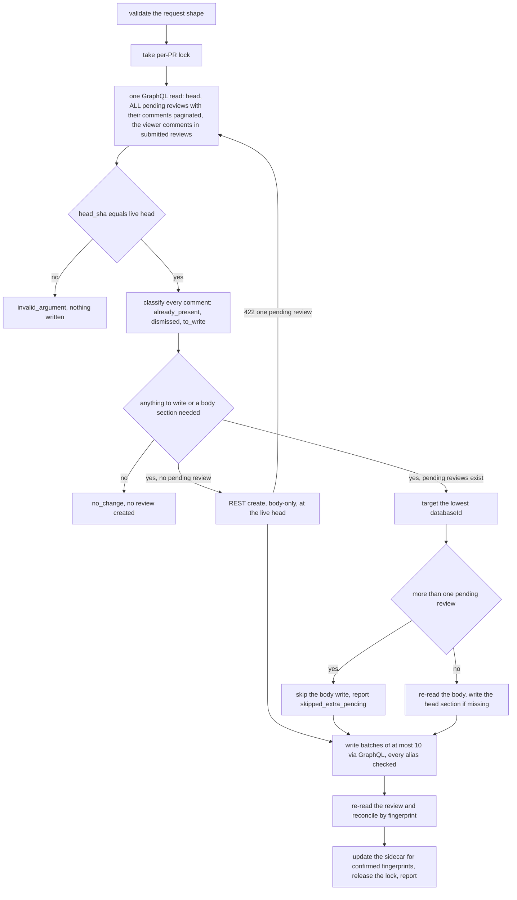

# Pending-review reuse: create-or-append design

- **Date**: 2026-10-06 (UTC; the live proofs ran on the evening of 2026-10-05 local time)
- **Bead**: `pg2-8qui6` (design). Dependent: `pg2-8dez6` (live verification), `pg2-kftf9.19` (cleanup).
- **Status**: APPROVED for decomposition (operator, interactive session, 2026-10-06 UTC: create race is
  detect-and-report only, sidecar lives in the connector state dir, land then decompose). Revised once
  after an independent review and once after the first decomposition attempt found the request-input
  gap (section 3). Supersedes the
  delete-and-recreate recommendation in `2026-09-29-pending-review-handling-investigation.md`
  (section 4.3 and the recommended design in section 5) and the replace/escalation scope of
  `pg2-kftf9.13` and `pg2-kftf9.15`.
- **Inputs**: the operator rulings of 2026-10-05 and 2026-10-06 recorded in the bead body, and the
  live proofs of this document's "Evidence" section (scratch repository).

## 1. Decision summary

A review run uses the acting identity's existing PENDING review when there is one, creates one when
there is not, and NEVER deletes, replaces or submits anything. New content is merged in and added,
so the operator's edits survive.

| Topic                | Decision                                                                                                                                                                                                        |
| -------------------- | --------------------------------------------------------------------------------------------------------------------------------------------------------------------------------------------------------------- |
| Outcomes             | Exactly three: `posted` (a review was created), `append` (something was written to an existing review), `no_change` (nothing was written). `skipped`, `replaced`, `blocked_human_pending` are retired.          |
| Anchoring            | A comment stays on the head it was made at. The field that defines this is GraphQL `originalCommit.oid` (REST `original_commit_id`). `commit.oid` and REST `commit_id` follow the current head, never use them. |
| Idempotence          | Tool-owned. A per-comment fingerprint stored as a hidden marker, found on GitHub, plus a per-PR sidecar that remembers what was posted so a deletion reads as dismissal.                                        |
| Replies              | Explicit `thread_id`, the REAL review-thread id. No `thread_id` means a NEW point, always. Works for threads in the pending review and in submitted reviews.                                                    |
| Deleted comments     | A fingerprint that was posted and is gone from GitHub is dismissed and never posted again.                                                                                                                      |
| Hand-started reviews | Merged into like any other pending review. Nothing is gated on a bot marker any more.                                                                                                                           |
| Concurrency          | A per-PR advisory lock. The cross-process create race it cannot cover is DETECTED and reported, never repaired by a delete.                                                                                     |
| Batching             | The review is created body-only, then every comment goes in through GraphQL batches of at most 10, every alias checked, reconciled by a re-read.                                                                |
| Partial failure      | A taxonomy error (non-zero exit) with a stable message shape. Retrying converges for transient failures only; a rejected anchor needs a changed request.                                                        |
| pg-desk `stale`      | Redefined: a pending review exists and nothing is anchored to the current head (no comment, no body section, no review of the viewer). Older-head content is fine. The connector owns the verdict.              |
| Retired              | The archive-before-delete step, every delete, the digest guard, the escalator, the escalation beads and the `--exclude-escalated-query` filter.                                                                 |

## 2. Evidence (scratch repository, 2026-10-05/06)

Every claim below was observed on the throwaway private repository named in the results document of
2026-09-30, using the single authorized identity. Raw responses stay outside the repository (they
carry logins and node ids). Four runs: A (anchors, replies, mixed submit), B (races, batching,
pagination), C (edits, body write, force-push), D (lock).

| ID  | Question                                | Observation                                                                                                                                                                                                                                                                                                                             |
| --- | --------------------------------------- | --------------------------------------------------------------------------------------------------------------------------------------------------------------------------------------------------------------------------------------------------------------------------------------------------------------------------------------- |
| A1  | Create when none exists                 | REST create at head H1 with two comments: `state=PENDING`, review `commit_id=H1`.                                                                                                                                                                                                                                                       |
| A2  | Which field keeps a comment on its head | After H2 was pushed and a thread added, all three comments reported GraphQL `commit.oid=H2` and REST `commit_id=H2`. Only `originalCommit.oid` (REST `original_commit_id`) differed: the two old comments H1, the new one H2. The review kept `commit=H1`.                                                                              |
| A3  | Reply to a pending thread               | `addPullRequestReviewThreadReply(pullRequestReviewId, pullRequestReviewThreadId, body)` returned a comment with `replyTo` set, inside the same PENDING review. The reply inherits the thread's `originalCommit`.                                                                                                                        |
| A4  | Submit a mixed-anchor review as COMMENT | `state=COMMENTED`, review `commit=H1`, four comments, `originalCommit` H1 / H1 / H2 / H1, none `outdated`. A mixed review publishes sanely.                                                                                                                                                                                             |
| A5  | Reply to a thread in a SUBMITTED review | A BODY-ONLY pending review R2 (REST create, no comments) was the `pullRequestReviewId`, with the submitted review's thread id. The reply was created in R2 (`state=PENDING`, `replyTo` set). So a reply to anyone's submitted thread rides in the viewer's pending review, and a review can be created body-only and filled by GraphQL. |
| B1  | Create race                             | Two concurrent REST creates BOTH returned 200. The PR then had TWO pending reviews. The "one pending review per PR" 422 is not an atomic guard.                                                                                                                                                                                         |
| B1b | Consequence of two pending reviews      | `updatePullRequestReview` on either one failed with `UNPROCESSABLE: User can only have one pending review per pull request`. Appending threads still worked. The PR is wedged for body updates until one is deleted (by the operator).                                                                                                  |
| B2  | Concurrent identical appends            | Both landed: two comments with the same fingerprint. An idempotence check alone does not stop a race.                                                                                                                                                                                                                                   |
| B3  | Invalid anchor in a batch               | A thread on line 9999 returned `thread: null` with NO GraphQL error, and was absent from the review. The neighbours in the same document landed. "No errors" does not prove "landed".                                                                                                                                                   |
| B4  | Batch size                              | 110 aliased threads in one document: 18 landed, then `Resource limits for this query exceeded`. Nine documents of 10: all 90 landed.                                                                                                                                                                                                    |
| B5  | Pagination                              | A review with 103 comments: `comments(first:100)` returned 100 with `hasNextPage=true`, `after: endCursor` returned the other 3. `totalCount` was 103 throughout.                                                                                                                                                                       |
| C1  | Operator edit preserved                 | A comment edited with `updatePullRequestReviewComment` kept its edited text through a later append. A delimited section appended to the body (read, concatenate, write) kept the existing text.                                                                                                                                         |
| C2  | Body write is last-writer-wins          | A body write built from a stale read silently overwrote text written in between. There is no compare-and-set.                                                                                                                                                                                                                           |
| C3  | Append after a force-push               | The pending review's commit left the PR (head force-pushed). `addPullRequestReviewThread` still succeeded, anchored to the NEW head, `isOutdated=false`. The review kept its old `commit`. Older comments read `outdated=true`.                                                                                                         |
| D1  | Lock serializes create-or-append        | Two concurrent runs under a per-PR lock: one `CREATED`, one `APPENDED`, one review, both comments, no duplicate.                                                                                                                                                                                                                        |

Findings that change the earlier proposals:

1. The bead's premise that the second concurrent create gets a 422 is FALSE (B1). The design cannot rely on GitHub to serialize creates.
2. Two pending reviews is a real, observable wedge (B1b). The lookup MUST tolerate N pending reviews instead of failing closed. The tool cannot repair it (it never deletes), so it detects and reports it (section 6).
3. `thread: null` without an error (B3) means every alias in a batch MUST be checked, and a re-read MUST reconcile what landed.
4. Batches must stay small (B4).

NOT proven here, and carried into the verification plan (section 13): that a REST create carrying a bad anchor fails whole (so the design avoids it by creating body-only), and the cross-process create race with the lock held on both sides (D1 shows only the lock itself).

## 3. Contract (`review submit`, op `review_submit`)

The command keeps its name and means "put this content into the pending review". It never submits to
GitHub.

Request: `{id, head_sha, body, comments[], supersede_pending?}`.

- **Request input.** The verb reads the request JSON from stdin today and has no other input. The
  review session runs in don't-ask permission mode, where its grant matches only a plain single-line
  command: a stdin redirect, heredoc or pipe is denied, and a `<` redirect from outside the working
  directories is denied too (this is why the escalator wrapper has a file option). So
  `pg-connector pr review submit` gains `--from-file <absolute path>`, which reads the request JSON
  from that file instead of stdin. The two sources are mutually exclusive (both, or a missing or
  unreadable file, is `invalid_argument`); with neither flag, stdin is read as today. The tool, not
  the shell, opens the file, so the path may be outside the working directories. The review prompt
  writes the request to a fresh scratch file and runs exactly
  `pg-connector pr review submit <pr-id> --from-file <path>`, and the deployment grants
  `Bash(pg-connector pr review submit:*)` (step 3 of section 10).

- `comments[]` item: either a NEW point `{path, line, side?, body}` or a REPLY `{thread_id, body}`.
  Supplying `thread_id` together with `path` or `line` is `invalid_argument`. `side` is normalized
  (`""` means `RIGHT`) before use. Two items in one request that are identical after normalization
  are one item.
- **`thread_id` is the REAL review-thread id** (`PRRT_...`). Today `Comment.ThreadID` carries the
  ROOT COMMENT's node id (`github.go`, with a note deferring the real id), which
  `addPullRequestReviewThreadReply` rejects. So `pr show` gains a separate `review_thread_id` field
  on each comment (the existing `ThreadID` keeps its meaning for its current consumers), taken from
  `reviewThreads.id`, and the contract's `thread_id` is that value. A reply to a thread that does not
  belong to this PR is a failed item (`thread_not_found`), not a crash.
- A reply ALWAYS passes the pending review's id as `pullRequestReviewId` (A3, A5), so it rides in the
  viewer's pending review whether the thread is pending or submitted.
- `supersede_pending` is accepted and ignored (an accepted no-op) so a prompt that still sends it
  keeps working during rollout. It is removed from the CLI help at the same time and from the docs
  once the prompt stops sending it.
- The live-head check uses the `headRefOid` returned by the lookup that runs UNDER the lock (section
  6), not one read before the lock, because the lock wait can be long. `head_sha` MUST equal it, or
  the call is `invalid_argument` and nothing is written. With append this matters more, because a new
  thread anchors to the live head (A2, C3).

Result: `{review_id, state: "pending", head_sha, as_of, status, added, already_present, dismissed, body, extra_pending_reviews, last_append?, url?}`. `url` is the web URL of the review that was used or
created (absent for a `no_change` that created none); the old `pending_review` reference object is
retired with `PendingReviewRef`.

- `status` is exactly `posted`, `append` or `no_change` (wire spelling `no_change`, matching the
  existing snake_case style): `posted` = a review was created, `append` = at least one comment or a
  new body section was written to an existing review, `no_change` = nothing was written.
- `added`, `already_present`, `dismissed` count the request's comments by disposition. `body` is one
  of `written` (a section for this head was added), `kept` (a section for this head already existed,
  so the supplied body text was NOT applied), `absent` (no body supplied, no section written),
  `dismissed` (the section was written before and the operator deleted it), `skipped_extra_pending`
  (more than one pending review exists, so body updates are refused, B1b), `skipped_empty_review` (the
  review has an EMPTY body, which GitHub refuses to edit with "Could not edit a review with a missing body"
  (pg2-16jqj); a review the tool creates always carries at least the attribution line, so only a
  hand-started empty review lands here) or `too_large` (the section would exceed GitHub's body limit).
- When no pending review exists and there is nothing to add (every comment already present or
  dismissed, and no body to write), NO review is created: `status` is `no_change` and `state` is
  `none`.
- `extra_pending_reviews` is the number of pending reviews beyond the one used (normally 0).
- `reason`, `message`, `superseded`, `supersede` and the escalation fields are removed.

All three statuses exit 0 under `INV-EXIT-1`; the body's `status` distinguishes them.

### Partial failure

The error envelope carries only `code` and `message`, so a non-zero exit cannot also carry a result
body. A run in which at least one comment did not land is therefore a taxonomy ERROR (exit 1 under
`INV-EXIT-1`, with the code chosen per `INV-ERR-1`):

- `unavailable` when any failure could succeed on retry (rate limit, secondary limit, network, a
  failed reconciliation re-read).
- `invalid_argument` when every failure is permanent (an anchor GitHub rejected, B3; an unknown
  thread). This is the caller's request being unsatisfiable, which is what the code means.

The message has a STABLE shape the prompt can act on: `<n> of <m> comments landed; failed:
<reason>:<fingerprint>[:<path>:<line>] ...`, listing at most 20 failures and a total count. Reasons:
`anchor_rejected`, `thread_not_found`, `rate_limited`, `unconfirmed`.

**Convergence holds for transient failures only.** Replaying the identical request skips what landed
and retries what did not. A PERMANENT rejection never lands, so the replay lands the rest as
`already_present` and fails on the same item again; it needs a CHANGED request (drop or move the
anchor), and the prompt MUST be told to do that rather than retry. This preserves the existing worker
rule that a non-zero exit is handed back (an assumption about the deployment prompt, which lives
outside this repository).

## 4. Anchoring

- A comment stays on the head it was made at. The field that says which head is `originalCommit.oid`
  in GraphQL (`original_commit_id` in REST). `commit.oid`, REST `commit_id` and the review-level
  commit MUST NOT be used to decide "which head is this comment on" (A2).
- The review-level commit records where the review was created. It is NOT, by itself, evidence about
  staleness: section 9 is the one definition, and nothing else decides it.
- A mixed-anchor review publishes sanely when the operator submits it (A4), so mixed-head content is
  accepted.
- A force-push does not wedge a pending review: append still works and anchors to the new head (C3).
  Older comments become `outdated`, which is the accepted stale behavior.

## 5. Idempotence, fingerprints and the sidecar

Three sources of truth, in this order: what is on GitHub, the sidecar, the request.

**Fingerprint (an exact-replay key, not a semantic one).** For a new point: first 16 hex of
`SHA-256(path "\n" SIDE "\n" line "\n" normalizedBody)` with `SIDE` upper-cased (`""` is `RIGHT`). For a
reply: `SHA-256(thread_id "\n" normalizedBody)`. `normalizedBody` converts `\r\n` to `\n` and trims
trailing whitespace of the whole body (a web-UI save rewrites LF to CRLF, results doc G2). The head
sha is deliberately NOT part of it, so the same point at the same path and line is not posted twice
across heads. Two honest limits: a point whose line MOVED between heads is a different fingerprint
and is posted again, and identical text on a different piece of code at the same path and line is
suppressed. Cross-head de-duplication of reworded or moved points is best effort and comes from
context (section 8), never from the fingerprint.

**Location.** Each comment body ends with a hidden marker `<!-- pg-fp:<fp> -->` next to the
attribution line, which becomes `*Posted by pg-connector at <sha7>.*` (the short head tells the
operator, in a UI that does not live-refresh, what was appended and when). The marker survives
operator edits that keep the line and round-trips through REST and GraphQL (results doc P3).

**Already present (machine-independent).** A fingerprint is `already_present` when its marker is on
ANY comment the viewer authored on the PR: in EVERY pending review (not only the one appended to) and
in submitted reviews and their threads. This is read from GitHub, so it survives a wiped state
directory or a second machine.

**Sidecar (dismissal memory).** The backend keeps, per PR, a file of every fingerprint it confirmed
posted, the heads whose body section it wrote, and the last append (`at`, `added`, `head`), under its
own state home (`$XDG_STATE_HOME/pg-connector-pr-github/posted/<owner>__<repo>__<n>.json`, override
`PG_CONNECTOR_PR_GITHUB_STATE_DIR`). A fingerprint in the sidecar that is on GitHub nowhere is
`dismissed`: it is NEVER posted again. Deleting a comment in the web UI therefore keeps it deleted.

| Situation                                      | Result                                                                  |
| ---------------------------------------------- | ----------------------------------------------------------------------- |
| Exact replay (retry, crash-retry)              | `already_present` (marker found on GitHub)                              |
| Operator deleted a posted comment              | in the sidecar, found on GitHub nowhere: `dismissed`, not re-added      |
| Operator submitted the review, run again       | marker found in the submitted review: `already_present`                 |
| State directory wiped, comment still on GitHub | `already_present` from GitHub (nothing lost)                            |
| State directory wiped, comment deleted earlier | cannot be known: re-posted (an accepted gap of the single-host sidecar) |

Sidecar write rules: an entry is written ONLY for a fingerprint confirmed by the post-write re-read
(section 6). If the re-read fails, no entry is written and the call is `unavailable`, so a comment
that never landed is never permanently skipped. The file is written to a temporary name and renamed
(atomic). A failed sidecar write after GitHub writes is an error; the retry converges through the
markers. A crash between the GitHub write and the sidecar write is safe for the same reason; the one
gap is that the operator deleting that comment before the retry gets it re-posted, which is accepted.

Why the sidecar is in the backend state home and not in the pg-desk store (a refinement of the
2026-10-06 ruling, which asked for "the pg-desk store"): the tool that posts owns idempotence, and
`pg-connector` MUST NOT import or write the pg-desk store (ownership split). pg-desk shows the
sidecar's `last_append` through the `review_pending` read (section 9). The ruling's behavior, a
sidecar where deletion means dismissal, is unchanged. The sidecar assumes ONE acting host; another
host shows no `last_append` and loses dismissal memory (the row above). The file is plain JSON, so
the operator can delete it to allow a repost; no repost flag is added.

A deleted body section is the same: the sidecar records the heads whose section was written, and a
recorded head with no `pg-section` in the body is dismissed and NOT rewritten.

## 6. Create-or-append algorithm



- **Lock.** An advisory `flock(2)` on `<state home>/locks/<owner>__<repo>__<n>.lock` held from the
  read to the sidecar update, with a bounded WAIT of 60 seconds (then `unavailable`, retryable) and a
  documented bound on the HOLD (the batches of one request; a request over 40 comments is refused
  with `invalid_argument`, a cap sized so a full request fits the 30s scriptout exec timeout, bead pg2-m79ch). A crash releases the lock with the process. The lock files are tiny and
  are not cleaned. D1 proved the shape.
- **The read is one GraphQL document** and returns the head, every pending review of the viewer, the
  comments of each (paginated, 100 per page), and the viewer's comments in submitted reviews. The
  fail-closed "expected at most one" and "comment list truncated" checks of `GetPendingReview` are
  replaced by: tolerate N, use the lowest `databaseId`, report the rest in `extra_pending_reviews`,
  and paginate.
- **Create is body-only.** A REST create carrying comments is atomic, so one bad anchor would most
  likely fail the whole call with 422 and leave nothing (unproven, see section 2), and a reply cannot
  be a REST `comments[]` item at all. Creating body-only (A5 proves it) and adding every comment
  through GraphQL gives one failure-isolated path for new points and replies alike. A create that
  answers 422 "one pending review" (a hand-started review appeared between the read and the create)
  loops back to the read and appends.
- **The cross-process create race is detected, not repaired** (B1). After a create the tool re-reads;
  if more than one pending review now exists it reports `extra_pending_reviews` and proceeds to
  append to the lowest `databaseId`, with `body: skipped_extra_pending`. It NEVER deletes, so the
  tool deletes nothing anywhere. The wedge (B1b) is cleared by the operator deleting the extra review
  in the web UI, and pg-desk shows `extra=N` so it is visible. The lock makes the race rare (it
  needs two hosts, or a human starting a review in the UI in the same instant).
- **Batching.** At most 10 `addPullRequestReviewThread` / `addPullRequestReviewThreadReply`
  mutations per GraphQL document (B4). Every alias is checked: `thread: null` or a missing comment is
  a failure (`anchor_rejected` or `thread_not_found`), never success (B3). A document-level error is
  a transient failure. After the last batch the tool re-reads the targeted review (paginated) and
  reconciles by fingerprint; the re-read, not the mutation responses, decides what landed.
- **Rate limits.** A secondary rate limit response is `unavailable` and is not retried inside the
  call.
- **Hand-started reviews** are merged into (the 2026-10-05 ruling). The operator sees the short head
  in each attribution line and the pg-desk summary, and comments the tool adds publish under the
  operator's name when they submit. The tool never submits.

## 7. Body merge

The review body is a series of delimited per-head sections:

```text
<!-- pg-section head=<sha12> -->
...text for this head...
<!-- /pg-section -->
```

- Existing text, including any the operator typed outside a section, is never altered.
- A new head appends a new section at the end. An empty request body writes no section. A head whose
  section already exists is not written again (`body: kept`, and the supplied text is NOT applied);
  a head whose section the operator deleted (recorded in the sidecar) is `body: dismissed`.
- With more than one pending review the body write is skipped (`skipped_extra_pending`), because
  GitHub refuses it (B1b), and the sidecar does NOT record the head as written.
- `updatePullRequestReview` replaces the whole body (P7) and is last-writer-wins (C2). The tool
  therefore re-reads the body immediately before the write, writes only when a section is genuinely
  missing (at most once per head), and builds the new body from that fresh read. A body saved by an
  open "Finish your review" dialog after the tool's write still overwrites the tool's section; that
  window is outside the tool's control and accepted. A section that would push the body past GitHub's
  limit is not written (`body: too_large`) and is not recorded.
- The whole-review content digest marker is retired (see section 11).

## 8. Context for de-duplication (the agent side)

No duplicate points across the PR come from the agent seeing everything already said. `pr show`
MUST return, and the review prompt MUST be handed:

- every submitted review with its body and state,
- every review thread, each with its `review_thread_id`, `resolved` and `outdated` flags and all of
  its comments,
- issue comments and bot comments,
- the viewer's own pending comments (visible because the worker posts as the operator's identity).

Cap and truncation: pages of 100 for each connection, up to 1000 threads and 1000 comments per PR.
GraphQL gives no server-side ordering for `reviews` or `reviewThreads` (not verified against the
schema here, so the implementation MUST check), so the tool fetches pages in server order up to the
cap and sorts what it fetched newest-first on the client; it does NOT claim the set is "the newest
1000". A connection that hits the cap is reported with `truncated: true`, `total` and `returned`,
never silently. The review prompt MUST say that on a truncated context the agent cannot claim a point
is new and SHOULD say so in its review body. This replaces the `reviews(first:100)` silent
truncation of today.

## 9. pg-desk: the redefined `stale`

The operator ruled (2026-10-06): stale means there is NO review or comment for the current head;
content for older heads is fine. The CONNECTOR owns the verdict: `review_pending.go` computes
`Stale` today as `CommitSHA != HeadSHA`, and pg-desk's `show_review.go` prefers the record's `stale`,
falling back to its own commit comparison only when the field is absent.

- The `review_pending` record gains `comments_at_head` (comments whose `originalCommit` equals the
  live head), `reviewed_head` (true when the body holds a `pg-section` for the head, or any review of
  the viewer, pending or submitted, has the head as its review-level commit),
  `extra_pending_reviews` and `last_append` (`at`, `added`, `head`, from the sidecar). It loses
  `digest_state` and `all_marked`.
- `stale` is true iff a pending review exists AND `comments_at_head` is 0 AND `reviewed_head` is
  false. So a run that wrote only a body section for the head, or only replies, or a review created
  at the head, is not stale; a review untouched since an older head is.
- A stored record without `comments_at_head` (facts written before this change) reads `unknown` with
  the reason "run show --refresh", never `stale` or `current`, and pg-desk's own commit-comparison
  fallback is removed. Old fact keys (`review_escalations`, `digest_state`) are tolerated on read and
  ignored.
- `show` states: `none` (no pending review), `current`, `stale`, `unknown`. The line gains
  `comments=<total> at_head=<n>`, `last_append=<age> (+<added>)` and, when above 0, `extra=<N>`.
- The pg-desk escalation fact and the escalation part of the line are removed (section 11).

## 10. Rollout and interim state

Until implementation lands the deployed tool and prompt keep replacing and deleting. The interim
position is: keep as is. Switching `supersede_pending` off would re-create the 422 wedge.

The order matters, and it corrects the order in the bead: the escalator rejects statuses it does not
know, and the review prompt is understood to hand back a non-zero exit (an assumption: the prompt is
outside this repository), so a tool emitting `append` or `no_change` first would fail every review.

1. The escalator accepts `append` and `no_change`: BOTH `ParseOutcome` (`outcome.go`) AND the
   status switch in `escalate/escalator.go`, which today resolves only `posted`, `skipped` and
   `replaced` and otherwise returns "unknown status". `append` and `no_change` resolve an open
   escalation exactly as `posted` does. A superset, safe.
2. The tool ships create-or-append with the three statuses, `--from-file` on the verb (section 3),
   and `supersede_pending` as a no-op.
3. The review prompt, in the deployment repo, drops `supersede_pending`, gains `thread_id` replies,
   the context rules and the "a rejected anchor needs a changed request" rule, AND moves back from the
   wrapper `pg-router-review-escalator submit` to the direct verb
   `pg-connector pr review submit <pr-id> --from-file <path>`; the deployment adds the grant
   `Bash(pg-connector pr review submit:*)` in the same change. A live end-to-end review dispatch
   proves it, because a grant mismatch fails silently in don't-ask mode.
4. The deployment config stops passing `--exclude-escalated-query` to the router stanza and drops the
   escalator module and its permission grant. THEN, in this repo, the flag is removed from
   `pg-router-source-pg-connector` (the reverse order makes the list verb reject an unknown flag and
   stops dispatch).
5. A one-time sweep closes the open escalation beads (`human` and `human-focus-required`) that exist
   at cutover, because their closer is retired. They live in the deployment's own tracker, not the
   shared `pg2-` tracker, and the sweep runs against that tracker.
6. The escalator package, its flake wiring, the pg-desk escalation fact, and the `supersede_pending`
   no-op in the tool (with its docs line) are removed.

Steps 3 to 5 take effect on the machine only after `pn workspace apply`, which is operator-only, so
an ordering edge between their beads is not enough: each later step's bead MUST be gated on the
earlier step having been applied (a `pn:applied` gate keyed on the earlier commit), never on the
earlier bead merely being closed.

Documentation changes land with each step, behavior docs FIRST.

## 11. Retirement inventory

Items below are a map; the implementation beads MUST re-derive the full list with `rg` over the
names, because the review of this design found the first draft incomplete.

| Item                                                                                                                                                                                   | Disposition                                                                      |
| -------------------------------------------------------------------------------------------------------------------------------------------------------------------------------------- | -------------------------------------------------------------------------------- |
| `packages/pg-router-review-escalator`, its behavior README, its flake package/list/`go-tests` check and gomod2nix wiring                                                               | RETIRE after step 5                                                              |
| Escalator module, its `Bash(...)` grant and the pending-review-escalations query (private deployment repo)                                                                             | RETIRE at step 4                                                                 |
| `--exclude-escalated-query` (`escalation.go`, `list.go`, `escalation_test.go`, `testmain_test.go`, behavior README)                                                                    | RETIRE at step 4, after the stanza stops passing it                              |
| pg-desk `gather/review.go` `ReviewEscalationsFact`, `gather.go` `Facts.ReviewEscalations`; escalation part of `show_review.go`                                                         | RETIRE at step 6                                                                 |
| `archive` package, `WithArchiver(archive.FromEnv)` in `main.go`, `provider.go` `archiver`, the archive step in `review_submit.go`                                                      | RETIRE (nothing is archived: nothing is deleted)                                 |
| Every delete: `DeleteReview` and its race handling in `github/review_submit.go` and `review_submit.go`                                                                                 | RETIRE (the tool deletes nothing anywhere)                                       |
| `review_digest.go`, `DigestState`, `AllMarked`, `editedDetail`, `VerifyDigest`, `StampBodyWithDigest`, `BodyMarked`, `BotMarker`, `StampBotMarker`, `hasBotMarker`, `legacyPGPRMarker` | RETIRE; the marker, now per comment, is `pg-fp`                                  |
| `pkg/provider/pr/iface.go`: `SupersedeOutcome`, `SupersededReview`, `PendingReviewRef`, the `Reason*` constants, `Marked`                                                              | RETIRE or CHANGE to the new result shape                                         |
| `cmd/pg-connector/pr_review.go` (help text, the `superseded` print) and `pr_test.go`; `review_supersede_test.go`, `review_digest_test.go`, `archive_test.go`, the escalator tests      | CHANGE or RETIRE with their subjects                                             |
| `pending_review.go` and `review_pending.go`: single-review and 100-comment fail-closed checks, the `Stale` computation                                                                 | CHANGE: tolerate N reviews, paginate, new stale and counts (sections 6 and 9)    |
| `pr show` comment shape                                                                                                                                                                | CHANGE: add `review_thread_id` (section 3) and the truncation fields (section 8) |
| ADR 0077 amendments of 2026-10-03, and `2026-09-29-entity-change-flow-design.md` sections 9.1 and 9.1a                                                                                 | AMEND: record this design, mark both superseded                                  |
| `docs/behavior/pg-desk/sync.md`, `show.md`, `gather.md`; pg-connector `interfaces.md`, `invariants.md`, `pg-pr-retirement.md`; the escalator and source READMEs                        | CHANGED in this working tree, to be committed with this design                   |
| The 2026-09-29 investigation spec header                                                                                                                                               | CHANGED: marked superseded                                                       |
| `pg2-kftf9.13` / `.15` (closed, applied)                                                                                                                                               | KEEP as history; their code is replaced by the implementation beads              |

## 12. What is NOT decided here

- The exact sidecar and `pr show` JSON beyond sections 5 and 8 are implementation details owned by
  the implementation beads and their tests.
- Whether a repost flag is ever added. The operator can delete the sidecar file.
- `pg2-b3tdu` (reopen per PR or a new bead per head) is untouched; `no_change` is defined per call.

## 13. Verification plan

The implementation beads carry fake-gh table tests per status, partial failure and truncation, CRLF
normalization, the lock, the stale definition (body-section-only, replies-only, old record), and a
conformance test that the escalator tolerates the new statuses in BOTH places. The live verification
(`pg2-8dez6`, gated on apply) repeats the evidence table above against the real binary on the scratch
repository: create when none, append at a new head with `originalCommit` kept, edited comment and
body preserved, replay gives `no_change`, reply to a pending and a submitted thread (real thread id),
mixed-anchor submit, append after a force-push, two concurrent runs under the lock, more than 100
comments, a rejected anchor in a batch reported as `anchor_rejected`, and the two UNPROVEN items of
section 2 (a REST create with a bad anchor, and two hosts racing a create with the extra review
detected and reported).
