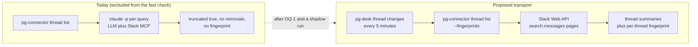
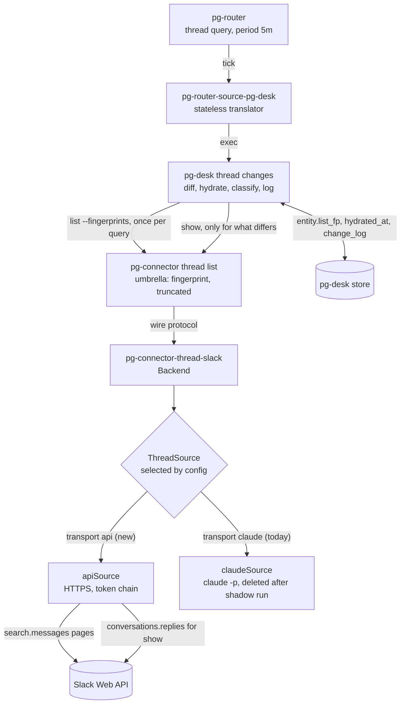
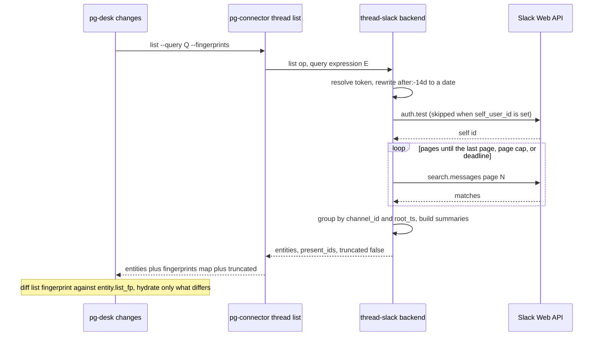
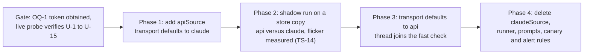

# Deterministic (non-LLM) Slack thread list for pg-desk thread entities — design

**Status**: Draft for operator review. Nothing here is implemented, and no implementation bead is
filed. The design is CONDITIONAL on the operator obtaining a read-only Slack user token (open
question OQ-1), which earlier rulings recorded as unavailable.
**Date**: 2026-10-07
**Bead**: `pg2-ynxy2` (P3, labels `agent-support`, `pg-connector`)
**Authorized by**: decision D7 on `pg2-32wg6` (operator, 2026-10-05), recorded in ADR 0077 row S32
**Related**: the fast per-type change check design (`2026-10-05-fast-per-type-change-check-design.md`,
finding F-5, the Q2 "Slack" paragraph and the test pattern T-1 to T-13), ADR 0077 (entity change
flow), the Slack work-day metrics design (`2026-09-30-slack-workday-metrics-design.md`, bead
`pg2-mww6m`), the pg-desk and connector discovery design (`2026-09-09-pg-desk-and-connector-discovery-design.md`,
decision D23)

This document designs a Slack-backed `thread` list that pg-desk's fast check can fingerprint, so
thread entities can join `pr`, `issue` and the other types in the per-type change check. Requirement
words (MUST, SHOULD, MAY) are RFC 2119.

This repository is public. The document names no workspace, channel, user, domain or token. Every
such value is a placeholder (`<workspace>`, `<channel_id>`, `<root_ts>`, `<self_user_id>`) and is
supplied at runtime by the private deployment flake.

**How to read the evidence.** Statements about this repository carry a file reference that was read
while writing this document. Statements about Slack's API come from NO document in this repository
and no live call (this design was written without network access and without a token). Each is
tagged `[U-n]`, listed in the register in "Unverified Slack facts", and MUST be confirmed by the live
probe that is the first implementation step. A number tagged `ASSUMPTION` has no measurement behind
it.

## 0. Summary

| Question                  | Short answer                                                                                                                                                                                                                                                                                                                                                                                                                               |
| ------------------------- | ------------------------------------------------------------------------------------------------------------------------------------------------------------------------------------------------------------------------------------------------------------------------------------------------------------------------------------------------------------------------------------------------------------------------------------------ |
| Q1 deterministic list     | A second transport (Strategy) inside `pg-connector-thread-slack` that calls the Slack Web API directly. `list` runs `search.messages` once per page per query expression, groups matches into threads keyed `<channel_id>:<root_ts>`, and returns a per-thread summary the umbrella fingerprints with the existing `--fingerprints` machinery. Completeness is proved by paging to the end, so `truncated` can be false and removals work. |
| Q2 token and scopes       | A read-only USER token (search needs one `[U-1]`) with `search:read` plus the four `*:history` scopes `[U-2]`. It is resolved from an env var, a token file or a command, never from the `backends` config block and never into the Nix store. Only option names and generic example paths live in this repo.                                                                                                                              |
| Q3 cost and rate limits   | About 37 Web API calls per hour at 5 minutes (60 if the backend resolves its own user id each call), against limits that are a few percent of capacity IF the app is exempt from the 2025 restrictions on history and replies `[U-5]`. Arithmetic in "Cost and rate limits".                                                                                                                                                               |
| Q4 retiring the LLM list  | The `claude -p` transport is the default until the API transport passes a shadow comparison, then is deleted (list AND show). There is no automatic fallback between transports, because two sources with different fingerprints would make every entity flap. Classification, if ever wanted, lives in a pg-desk decider reading the store, never in the connector.                                                                       |
| Q5 test strategy          | Fifteen tests TS-1 to TS-15, mapped to the fast check's T-1 to T-13, built on a loopback HTTP double for Slack (no network, no real token).                                                                                                                                                                                                                                                                                                |
| What the operator decides | Whether a token is obtainable (OQ-1) is a hard gate. Eleven further questions are in "Open questions for the operator", each with a recommendation.                                                                                                                                                                                                                                                                                        |



## 1. Evidence from this repository

| ID   | Finding                                                                                                                                                                                                                                                                                                                   | Evidence                                                                                                                                                                                                                                       |
| ---- | ------------------------------------------------------------------------------------------------------------------------------------------------------------------------------------------------------------------------------------------------------------------------------------------------------------------------- | ---------------------------------------------------------------------------------------------------------------------------------------------------------------------------------------------------------------------------------------------- |
| E-1  | The thread list is one `claude -p` call per query expression. It returns `Truncated: true` unconditionally and `Cursor: nil`, so it can never prove completeness.                                                                                                                                                         | `packages/pg-connector/cmd/pg-connector-thread-slack/internal/backend.go` `List` (about lines 317 to 353)                                                                                                                                      |
| E-2  | pg-desk refuses `thread changes` because "a Slack list cannot be fingerprinted".                                                                                                                                                                                                                                          | `packages/pg-desk/internal/changes/changes.go` `FingerprintSupported` (lines 36 to 44) and `ErrUnsupportedType`; `packages/pg-desk/cmd/pg-desk/changes.go` line 86                                                                             |
| E-3  | The umbrella's fingerprint machinery exists for `pr` and `issue` only: `--fingerprints` on their `list`, a `fingerprints` map and a `truncated` boolean on their outcome, and a backend-declared `fingerprint_excludes`. `thread list` has no such flag, and its outcome type has neither `truncated` nor `fingerprints`. | `packages/pg-connector/cmd/pg-connector/issue.go` (outcome struct near lines 322 to 332, fan-out near lines 340 to 390); `list.go` `addListFingerprint`; `thread.go` `threadListOutcome` and `newThreadListCmd` (flags `query` and `ids-only`) |
| E-4  | The behavior doc states the gap: "Slack `thread` listings carry no fingerprint", and a backend that ignores the range keys (Slack threads, calendar) "returns its unbounded result".                                                                                                                                      | `packages/pg-connector/docs/behavior/interfaces.md` (lines 193 and 226)                                                                                                                                                                        |
| E-5  | An additive field on a list result does not bump the schema version: `fingerprint_excludes` was added to `IssueListResult` and `PRListResult` this way.                                                                                                                                                                   | `packages/pg-connector/pkg/schema/issue.go` (the doc comment on `FingerprintExcludes`)                                                                                                                                                         |
| E-6  | The thread schema's `id` is "the Slack MCP's own thread or message timestamp" (a bare `ts`). A `ts` is unique within a channel, not across channels `[U-9]`.                                                                                                                                                              | `packages/pg-connector/pkg/schema/thread.go` (`Thread.ID`)                                                                                                                                                                                     |
| E-7  | The backend process is exec'd per request under a 30 second deadline (`DefaultExecTimeout`), and a multi-turn `claude -p` plausibly exceeds it. The fast-check design measured 27 of 48 `thread-me` failures as "killed".                                                                                                 | `packages/pg-connector/pkg/scriptout/limits.go`, `serve.go` line 82; the fast-check design, finding F-5                                                                                                                                        |
| E-8  | No Slack token is provisioned anywhere in the workspace by decision, twice: discovery design D23 ("The HTTP backend and its token are deferred; no Slack token is provisioned") and the work-day metrics design (operator, 2026-09-29: "no Slack API key or OAuth token is available, so the Web API is out of scope").   | the discovery design's decision table; the metrics design, "Scope and operator decisions"                                                                                                                                                      |
| E-9  | The live pg-desk store holds only `pr` rows (297 of them, measured 2026-10-05) and `desk-thread` dispatched zero times in the retained events, so no stored thread id needs migrating if the id format changes.                                                                                                           | the fast-check design, "Q3. The baseline" and finding F-5                                                                                                                                                                                      |
| E-10 | The existing backend holds no credential, implements no `AuthChecker`, and its event log states that it "never reads a Slack rate-limit header" and that there is deliberately no quota alert.                                                                                                                            | `cmd/pg-connector-thread-slack/main.go` header; `internal/eventlog/eventlog.go`; `packages/pg-connector/README.md` (the thread-slack paragraph)                                                                                                |
| E-11 | pg-desk's thread classifier needs only `last_reply_at` (and the S18 `resolved` source needs the same, plus `watch.thread.active_window`, default 7 days). Cross-referencing needs the permalink and the text.                                                                                                             | `packages/pg-desk/internal/classify/thread.go`; `docs/behavior/pg-desk/run-thread.md`                                                                                                                                                          |

## 2. Requirements

These are the fast-check design's requirements for any type, restated for Slack, plus the constraints
this repository already imposes.

| ID   | Requirement                                                                                                                                                                                                                                        | Source                                       |
| ---- | -------------------------------------------------------------------------------------------------------------------------------------------------------------------------------------------------------------------------------------------------- | -------------------------------------------- |
| R-1  | A watched query MUST cost pg-desk exactly one `pg-connector thread list --query Q --fingerprints` call per tick, with no cursor and no consumer state held by the connector.                                                                       | fast-check design, Q2 requirement            |
| R-2  | The connector, never pg-desk, MUST produce the per-thread fingerprint, and pg-desk MUST treat it as an opaque string compared only for equality.                                                                                                   | interfaces.md (line 187 onward)              |
| R-3  | A list that proves it is complete MUST report `truncated: false`. A list that cannot MUST report `truncated: true` (or fail), and pg-desk then derives no removals.                                                                                | fast-check design, "The check, step by step" |
| R-4  | A failure MUST NOT yield a partial list. A page that fails after earlier pages succeeded MUST fail the whole call as `unavailable`.                                                                                                                | existing backend convention                  |
| R-5  | The connector MUST NOT sleep, back off or run a retry loop on a rate limit. pg-router owns scheduling (constraint 1 of the fast-check design). It MAY retry a connection failure inside the call's own deadline, as `pg-connector-pr-github` does. | fast-check design, Q7                        |
| R-6  | A list call MUST finish inside the 30 second exec deadline with margin, and MUST stop and report `truncated: true` rather than run into it.                                                                                                        | E-7                                          |
| R-7  | The compute-only rule holds: every field is a Slack fact or computed deterministically in Go.                                                                                                                                                      | thread schema, design D23                    |
| R-8  | No secret in the `backends` config block, in logs, in the event log, in an error string, or in the Nix store.                                                                                                                                      | discovery design, "Shared config"            |
| R-9  | No private identifier in this repository: no workspace, channel, user, domain or token, in code, tests, fixtures or docs.                                                                                                                          | repository `CLAUDE.md`                       |
| R-10 | A new or changed `[[query]]` MUST be exercised live once as part of its own change (`pg-router run-query`, checked for a non-trivial outcome).                                                                                                     | repository `CLAUDE.md`                       |

## 3. Q1: the deterministic list

### 3.1 Patterns

- **Strategy** (transport): `Backend` depends on a `ThreadSource` port with two adapters,
  `claudeSource` (today's code, unchanged) and `apiSource` (new). The choice is configuration, not
  code.
- **Anti-corruption layer**: `apiSource` is the only code that knows Slack's JSON. It maps Slack
  messages to `schema.Thread` and surfaces nothing Slack-shaped.
- **Level-triggered reconciliation**: unchanged from the fast-check design. The stored fingerprint is
  the observed generation, and a missed edge is recovered on the next comparison.
- **Chain of Responsibility** (token resolution): env var, then file, then command, first non-empty
  wins. This mirrors `TokenSource` and `chainTokenSource` in
  `cmd/pg-connector-pr-github/internal/github/token.go`.
- **Bulkhead** (call budget): the backend caps its own HTTP calls per invocation so a large result
  cannot starve the exec deadline.

### 3.2 Components



Dependency direction is unchanged from ADR 0077: pg-desk depends on pg-connector, and the umbrella
reaches the backend only over the wire protocol. The new code is confined to
`cmd/pg-connector-thread-slack/internal` plus three small umbrella additions (section 3.8).

One binary, not two. A second binary registered next to the first under `connector.thread` would make
the umbrella fan out to BOTH and union their results with different fingerprints for the same thread.
The transport is therefore a setting of the one registered backend:

```toml
# generic example only: key names are proposals, values are placeholders
[backends.pg-connector-thread-slack]
transport = "api"            # "claude" (default until the shadow run passes) or "api"
self_user_id = "<self_user_id>"   # optional, saves one auth.test call per invocation

[backends.pg-connector-thread-slack.queries]
involving-me = "to:@me is:thread after:-14d"
```

The config block carries no secret (R-8). The query string is opaque to everything except the
relative-date rewrite in section 3.4.

### 3.3 Thread identity

`id` becomes `<channel_id>:<root_ts>` where `<channel_id>` is Slack's immutable channel identifier
(never the display name, which can be renamed) and `<root_ts>` is the `ts` of the thread's root
message. Reasons: a bare `ts` is only unique within a channel `[U-9]` (E-6); the id is stable for the
life of the thread; and it is exactly the pair `conversations.replies` needs.

This changes the documented meaning of `Thread.ID` and the input of `thread show`. It is safe to do
now because no thread row exists in the live store (E-9). The change MUST land together with the
transport switch, and the thread schema doc comment and `docs/behavior/pg-desk/run-thread.md` MUST
be updated in the same change (open question OQ-6).

A search match may be a reply rather than a root. The backend MUST map every match to its root:

1. Read `thread_ts` from the match's permalink query string `[U-8]`. For a root message, or a message
   with no `thread_ts`, the root is the message's own `ts`.
2. If the permalink carries no `thread_ts`, call `conversations.history` for that channel with
   `latest=<ts>`, `inclusive=true`, `limit=1`, and read `thread_ts` from the one message returned
   `[U-10]`.

`conversations.history` is deliberately not part of the steady-state list. Its cost scales with the
traffic of a channel, not with the number of threads the operator cares about, and `search.messages`
already supplies the channel id and timestamp of every match. It is only the fallback in step 2.

### 3.4 The list algorithm

For one `list` call with query expression `E`:

1. **Resolve the token** (section 4). No token yields `unauthenticated`.
2. **Resolve the self id**: `self_user_id` from config if present, else one `auth.test` call
   `[U-4]`.
3. **Rewrite relative dates.** Slack's `after:` takes a calendar date `[U-7]`, so an expression such
   as `after:-14d` MUST be rewritten deterministically to `after:<YYYY-MM-DD>` before the request,
   computed from an injected clock. The bound is computed one day earlier than strictly needed, so a
   thread at the boundary does not leave the list because of a timezone difference `[U-7]`. A relative
   token that cannot be parsed MUST be `invalid_argument` and MUST NOT be sent to Slack.
4. **Search.** Call `search.messages` with the rewritten query, `sort=timestamp`, `sort_dir=desc`,
   `count=<page size>` and increasing `page`, until the response reports it is on its last page
   `[U-3]`. Stop early, set `truncated: true` and return what was read, if either the page cap (default
   10 pages) or the call deadline (default 20 seconds, two thirds of the exec deadline) is reached. A
   failed page after a successful one is `unavailable`, never a partial list (R-4).
5. **Group.** Map each match to its root (section 3.3) and group matches by thread id. De-duplicate
   matches by `(channel_id, ts)`, because pages shift while paging `[U-6]`.
6. **Summarise** each thread (section 3.5) and sort threads by id, so the output is byte-stable.
7. **Return** `entities`, `present_ids`, `cursor: null`, `truncated: <true only if step 4 stopped
early>` and `fingerprint_excludes` (section 3.5).

The umbrella then fingerprints each summary with `canonicalHashExcluding`, exactly as for `pr` and
`issue` (E-3).



### 3.5 The list summary and its fingerprint

The list returns `schema.Thread` values, filled only with what the search proves.

| Field                          | List value                                                                                                        | In the fingerprint | Notes                                                                                                                                                      |
| ------------------------------ | ----------------------------------------------------------------------------------------------------------------- | ------------------ | ---------------------------------------------------------------------------------------------------------------------------------------------------------- |
| `id`                           | `<channel_id>:<root_ts>`                                                                                          | yes (identity)     | section 3.3                                                                                                                                                |
| `channel`                      | the channel id                                                                                                    | yes                | an id, never a name                                                                                                                                        |
| `permalink`                    | the newest matched message's permalink                                                                            | NO (excluded)      | it changes whenever a different message is the newest match; `show` returns the canonical root permalink                                                   |
| `started_by`                   | the root's author, only when the root is among the matches                                                        | yes                |                                                                                                                                                            |
| `participants`                 | the sorted distinct authors of the matched messages                                                               | yes                | matched messages only, a declared blind spot                                                                                                               |
| `last_reply_at`                | the newest matched reply's `ts`                                                                                   | yes                | matched messages only                                                                                                                                      |
| `reply_count`                  | `0`                                                                                                               | NO (excluded)      | the list cannot know it. The field is not `omitempty`, so it is emitted as `0`; a list consumer MUST NOT read it. `show` returns the real count            |
| `text`                         | the root's text when the root is among the matches, else empty                                                    | yes                |                                                                                                                                                            |
| `mentions_me`                  | true if any matched message's text contains the mention markup of `<self_user_id>`                                | yes                | computed in Go, never by a model                                                                                                                           |
| `match_digest` (new, additive) | hex SHA-256 over the thread's matched messages sorted by `ts`, each contributing `ts` and the SHA-256 of its text | yes                | makes an edit or a deleted match visible. Additive and `omitempty`, so by the precedent of E-5 it does not bump `ThreadSchemaVersion` (open question OQ-5) |
| `as_of`, `stale`               | set by the backend                                                                                                | NO                 | the umbrella already drops them                                                                                                                            |

The backend declares `fingerprint_excludes: ["permalink", "reply_count"]` on every list result, the
same mechanism the beads backend uses for `metadata.last_checked_at` (E-3). The new field needs one
umbrella-side addition: `ThreadListResult` gains `fingerprint_excludes` (additive, E-5).

**What the fingerprint can and cannot see.** The fingerprint covers exactly the messages the query
matches. For a mention query that is the right set, because the operator-facing question "a thread
that involves me changed" is a question about messages that mention the operator. The declared blind
spots, in the sense of ADR 0077 row S35 item e (a field a consumer reads that the list fingerprint
cannot see), are:

| Blind spot                                                                      | Why                         | Refresh tier                                                                       |
| ------------------------------------------------------------------------------- | --------------------------- | ---------------------------------------------------------------------------------- |
| A reply that does not match the query (for example, no mention of the operator) | the search never returns it | remote re-hydration at `sweep.max_age` (6 hours, S31), or the optional probe (3.7) |
| `reply_count` and `reply_users` changes with no matching message                | not on the search result    | same                                                                               |
| Reactions and file attachments                                                  | not part of `match_digest`  | same                                                                               |
| A deleted reply that was never a match                                          | invisible to the search     | same                                                                               |

A configuration that wants prompt notice of non-mention replies MUST add a second query that matches
them (for example one that selects threads the operator took part in) rather than rely on the blind
spot refresh. That is a deployment choice (open question OQ-4).

### 3.6 Completeness and removals

A thread leaves the list when its last matching message ages out of the `after:` window, is deleted,
or the operator stops matching the query. pg-desk then follows ADR 0077 row S34: one confirmation
read before deactivating. For Slack that read is `thread show`, which calls `conversations.replies`:

- `thread_not_found` (the Slack error for a missing thread or channel `[U-11]`) maps to
  `ErrNotFound`, and the classifier logs `removed`.
- A thread that still exists but left the query is also logged `removed` (membership change), which
  is what the fast-check design says for a PR that merely left a query.
- A failed read leaves the thread active and is repeated on the next tick, as for every type.

Removals are never derived from a list with `truncated: true`, from a degraded source, or from a
failed call. The new behavior is that `truncated` can now be `false`, and only when paging reached
the last page inside the page cap and the deadline.

**Flicker risk.** Slack's search index may lag or briefly omit a message `[U-6]`. A message missing
from one tick shifts that thread's `match_digest` (a `changed` record) and, if it was the thread's
only match, causes a spurious `removed` that the next tick turns into `added`. Deciders are
idempotent (ADR 0077), so the cost is an extra decider run, not a wrong result. The shadow run
(TS-14) MUST measure the flicker rate, and a rate above the operator's tolerance is the trigger for
the two mitigations held in reserve: a two-consecutive-absence rule for removals in pg-desk, or a
union of the previous tick's matches in the connector. Neither is built now.

### 3.7 Hydration (`show`) and the optional probe

`show <channel_id>:<root_ts>` calls `conversations.replies` with `channel`, `ts` and the page size,
following `response_metadata.next_cursor` until `has_more` is false `[U-12]`. It then fills every
`Thread` field from facts: the root's text and author, the distinct authors as `participants`, the
newest reply's `ts` as `last_reply_at`, the reply count, the self-mention flag, and the canonical
permalink from `chat.getPermalink` `[U-13]`. A `thread_not_found` or `channel_not_found` answer is
`ErrNotFound`. An unexpected shape is `unavailable`, never a partial thread.

The optional **replies probe** closes most of the blind spots at a bounded price. When it is on, the
backend reads, for EVERY thread in the list, the root message with `conversations.replies` and
`limit=1`, which returns the root with its `reply_count`, `latest_reply` and `reply_users` `[U-14]`.
Those three values then join the summary and the fingerprint. The probe MUST be all or nothing for a
call. A rotating or partial probe is forbidden: a thread would carry probe values on some ticks and
not on others, so its fingerprint would flap between two values with no change in Slack. If the list
holds more threads than `probe_max_threads` (a setting, assumed 20 in section 5), the call MUST fail
closed as `unavailable` with a message that says to narrow the query or turn the probe off, and
MUST NOT silently probe a subset. The probe is OFF by default (`probe_max_threads = 0`). Section 5
prices it and shows why it must stay off if the 2025 restriction applies to the app `[U-5]`.

### 3.8 Changes outside the backend

| Change                                                                                                                                                                | Where                                               | Size |
| --------------------------------------------------------------------------------------------------------------------------------------------------------------------- | --------------------------------------------------- | ---- |
| `thread list --fingerprints`, a `fingerprints` map and a `truncated` boolean on `threadListOutcome`, mirroring `issue.go`                                             | `packages/pg-connector/cmd/pg-connector/thread.go`  | S    |
| `ThreadListResult.FingerprintExcludes` and `Thread.MatchDigest`, both additive                                                                                        | `packages/pg-connector/pkg/schema/thread.go`        | S    |
| `FingerprintSupported("thread")` returns true, and `thread` joins the watched types                                                                                   | `packages/pg-desk/internal/changes/changes.go`      | S    |
| `thread show` accepts and returns the new id format                                                                                                                   | backend, `docs/behavior/pg-desk/run-thread.md`      | S    |
| ADR 0077: amend row S32 so Slack is "excluded until the API transport is verified, then included", via a new row (proposed S36) that records this design's conditions | `docs/adr/0077-entity-change-flow.md`               | S    |
| Behavior docs: remove "Slack `thread` listings carry no fingerprint"; document the transport setting, the id format and the blind spots                               | `packages/pg-connector/docs/behavior/interfaces.md` | S    |

## 4. Q2: token, scopes and configuration

### 4.1 What is needed

| Need                                   | Slack method            | Token type | Scope (classic names)                                                                                               |
| -------------------------------------- | ----------------------- | ---------- | ------------------------------------------------------------------------------------------------------------------- |
| Search messages                        | `search.messages`       | USER       | `search:read` `[U-1]`                                                                                               |
| Read a thread                          | `conversations.replies` | user       | `channels:history`, `groups:history`, `im:history`, `mpim:history` (the one matching the conversation kind) `[U-2]` |
| Resolve a reply to its root (fallback) | `conversations.history` | user       | the same four                                                                                                       |
| Canonical permalink                    | `chat.getPermalink`     | user       | none beyond membership `[U-13]`                                                                                     |
| Self id and a scope check              | `auth.test`             | user       | none `[U-4]`                                                                                                        |

The backend MUST request read scopes only. It MUST NOT need, and the app MUST NOT be granted, any
write scope. A user token sees every conversation its owner can see, including private messages, so
the token is as sensitive as the operator's Slack session.

Search is the constraint. The recollection `[U-1]` is that `search.messages` accepts only a user
token, so a bot token (which is the easy thing for a workspace admin to approve) would not work. That
is the reason open question OQ-1 is a gate and not a detail: the operator must be able to install a
read-only internal app and obtain its user token, or the design cannot proceed.

### 4.2 How the backend gets the token

Resolution order, first non-empty wins (Chain of Responsibility, mirroring the GitHub backend):

1. `PG_CONNECTOR_THREAD_SLACK_TOKEN`, the token itself, for tests and ad hoc use.
2. `PG_CONNECTOR_THREAD_SLACK_TOKEN_FILE`, the absolute path of a file holding the token. The backend
   MUST refuse a file that is group- or world-readable.
3. `PG_CONNECTOR_THREAD_SLACK_TOKEN_COMMAND`, a command that prints the token on stdout (for example
   a keychain lookup). It runs with the same hermetic child environment the GitHub token source uses
   and the same output cap.

If none yields a token the call is `unauthenticated`. These names are proposals and carry no
organization identifier. The backend implements `AuthChecker` (today it does not, E-10): `auth_status`
calls `auth.test`, reads the granted scopes from the response header `[U-15]`, and reports
`INSUFFICIENT_SCOPES` when a needed scope is absent, `EXPIRED` or `MISSING` otherwise, and `OK`.

### 4.3 How it is configured without a private identifier in this repository

- This repository ships the generic backend and a home-manager option that exposes only the NAMES
  above: a `tokenFile` option of type `str`, with no default, never `path`. A `path` type would copy
  the file into the world-readable Nix store, which violates R-8. The option's description uses an
  example such as `/path/to/slack-token` and nothing else.
- The private deployment flake (not this repository) sets `tokenFile` to a location the operator's
  secret tooling manages, sets the `queries`, and sets `self_user_id` if wanted. Workspace
  identifiers, channel ids, user ids and the real query strings live only there.
- pg-router launches the connector with the operator's environment. If an env var is used, it MUST be
  set in the launchd job's environment from the private flake and MUST NOT be echoed by `config
--show` or the event log.
- A guard MUST pin the redaction: the token value never appears in stdout, stderr, the event log or an
  error string (TS-7).
- An optional `expected_team_id` guard compares the `auth.test` workspace id with a runtime value and
  fails `unavailable` on a mismatch, so a token for the wrong workspace is rejected rather than
  silently read. The value is a placeholder here.

## 5. Q3: cost and rate limits

### 5.1 Limits used, and how far each can be trusted

No Slack limit is stated anywhere in this repository (E-10 says the backend reads none). Every limit
below is a recollection and is tagged. The design does not depend on any one of them being exact, and
the first implementation step reads the real values from response headers during the live probe.

| Tag     | Statement (UNVERIFIED unless noted)                                                                                                                                                                                                                               | Used for                |
| ------- | ----------------------------------------------------------------------------------------------------------------------------------------------------------------------------------------------------------------------------------------------------------------- | ----------------------- |
| `[U-1]` | `search.messages` needs a user token and sits in rate-limit Tier 2, about 20 requests per minute per workspace and app                                                                                                                                            | search capacity         |
| `[U-2]` | `conversations.replies` and `conversations.history` sit in Tier 3, about 50 requests per minute                                                                                                                                                                   | replies capacity        |
| `[U-3]` | `search.messages` returns at most 100 results per page and reports `paging.page` and `paging.pages`                                                                                                                                                               | pages per query         |
| `[U-4]` | `auth.test` is a high-limit method (about 100 per minute)                                                                                                                                                                                                         | self id cost            |
| `[U-5]` | Since 2025, `conversations.history` and `conversations.replies` are limited to about 1 request per minute and about 15 objects per request for commercially distributed apps that are not in the Marketplace. Internal, customer-built apps are said to be exempt | the restricted scenario |

### 5.2 Assumptions

None of these is measured. The first is the dominant unknown.

| ID   | Assumption                                                                                                        | Basis                                                                                    |
| ---- | ----------------------------------------------------------------------------------------------------------------- | ---------------------------------------------------------------------------------------- |
| A-1  | `Q = 2` watched thread queries                                                                                    | the repository holds one example query; the real count is in the private config          |
| A-2  | cadence 5 minutes, so `12` ticks per hour                                                                         | the bead                                                                                 |
| A-3  | `M = 60` matched messages per query in the window, so `ceil(60 / 100) = 1` search page                            | ASSUMPTION; `[U-3]` for the 100                                                          |
| A-4  | `T = 40` distinct threads in the union of the queries over the 14 day window                                      | ASSUMPTION                                                                               |
| A-5  | `c = 6` changed threads per hour                                                                                  | ASSUMPTION; the measured PR rate was 24 per hour, and threads change less often than PRs |
| A-6  | remote re-hydration tier of 6 hours                                                                               | ruled, ADR 0077 row S31                                                                  |
| A-7  | `T / 14 = 2.9` threads leave the window per day                                                                   | A-4 divided by the window in days                                                        |
| A-8  | one `conversations.replies` call per hydration (a thread of at most one page of replies)                          | ASSUMPTION                                                                               |
| A-9  | optional probe limit `p = 20` threads (`probe_max_threads`), probing every thread or none                         | design parameter                                                                         |
| A-10 | `0.5` seconds per HTTP call                                                                                       | ASSUMPTION; unmeasured                                                                   |
| A-11 | the LLM transport's per poll tokens are the work-day metrics design's estimate: `59,200` input and `1,900` output | borrowed, itself unmeasured; that design's assumptions A1 to A4                          |

### 5.3 Calls per hour at 5 minutes

| Line                                     | Calculation                                                | Calls per hour |
| ---------------------------------------- | ---------------------------------------------------------- | -------------- |
| Search pages                             | `Q x pages x ticks = 2 x 1 x 12`                           | 24             |
| Self id (`auth.test`), if not configured | one call per list invocation: `Q x ticks = 2 x 12`         | 24             |
| Hydration of changed threads             | `c x calls per hydration = 6 x 1`                          | 6              |
| Remote re-hydration tier                 | `T / 6 hours = 40 / 6`                                     | 6.7            |
| Removal confirmation reads               | `A-7 / 24 = 2.9 / 24`                                      | 0.12           |
| **Baseline, `self_user_id` configured**  | `24 + 6 + 6.7 + 0.12`                                      | **36.8**       |
| **Baseline, self id resolved each call** | `36.8 + 24`                                                | **60.8**       |
| Optional probe, allowed case `n = 20`    | `n x ticks = 20 x 12`                                      | 240            |
| **Baseline plus probe, `n = 20`**        | `36.8 + 240`                                               | **276.8**      |
| Probe at the assumed `T = 40` (REFUSED)  | `40 x 12 = 480`; the guard of section 3.7 rejects `40 > p` | 480 (not run)  |

Replies traffic (the Tier 3 methods) is the hydration, remote tier and removal lines:
`6 + 6.7 + 0.12 = 12.8` per hour, plus the 240 of the probe when it is on (`n = 20`).

### 5.4 Against the limits

Capacity per hour is the per minute limit times 60.

| Method class                           | Usage                         | Capacity (limit x 60) | Share                         |
| -------------------------------------- | ----------------------------- | --------------------- | ----------------------------- |
| Search (Tier 2, `[U-1]`)               | `24` per hour                 | `20 x 60 = 1,200`     | `24 / 1,200 = 2.0 percent`    |
| Replies, baseline (`[U-2]`)            | `12.8` per hour               | `50 x 60 = 3,000`     | `12.8 / 3,000 = 0.43 percent` |
| Replies with probe, `n = 20` (`[U-2]`) | `12.8 + 240 = 252.8` per hour | `3,000`               | `252.8 / 3,000 = 8.4 percent` |
| `auth.test` (`[U-4]`)                  | `24` per hour                 | `100 x 60 = 6,000`    | `0.4 percent`                 |

The per minute peak matters more than the hourly share. In one tick the backend can issue `Q x pages
= 2` search calls and, with the probe on, `n = 20` probe calls inside the same minute: `20 / 50 = 40
percent` of the per minute replies limit `[U-2]`. At the refused `n = 40` it would be `40 / 50 = 80
percent`, which is why `p` is capped.

**If `[U-5]` applies to the app** (the restricted scenario), the replies capacity is `1 x 60 = 60` per
hour and each request returns at most 15 replies:

| Line                                               | Calculation                                            | Result                           |
| -------------------------------------------------- | ------------------------------------------------------ | -------------------------------- |
| Baseline replies traffic at one call per hydration | `12.8` per hour against `60`                           | `21 percent`                     |
| Baseline if a typical thread needs 3 pages         | pages `= ceil(40 replies / 15) = 3`; `12.8 x 3 = 38.4` | `38.4 / 60 = 64 percent`         |
| With the probe on, `n = 20`                        | `12.8 + 240 = 252.8` against `60`                      | `421 percent`, which fails       |
| Two changed threads in one tick                    | two calls in one minute against `1` per minute         | the second returns `ratelimited` |

Consequences, which are requirements: the probe MUST stay off unless the live probe shows the higher
limit (R-5 plus this table); and under the restricted scenario hydration MUST be allowed to carry work
forward to later ticks, which the engine's per-poll cap already does (the fast-check design, Q6).
Whether the app is exempt is open question OQ-3.

### 5.5 Latency against the exec deadline

The backend is exec'd per request under a 30 second deadline (E-7). With A-10:

- Typical list invocation (one query expression): `(1 search page + 1 auth.test) x 0.5 s = 1.0 s`.
- Worst bounded list: page cap `10` per query plus a full probe of `p = 20`: `(10 + 1 + 20) x 0.5 s = 15.5 s`,
  under the 20 second backend deadline (R-6) and the 30 second exec deadline.
- A call that reaches the 20 second deadline returns `truncated: true` rather than running on.

### 5.6 Money, and the comparison with the LLM transport

The Slack Web API has no per-call charge that this repository records `[U-16]`, so the API
transport's marginal cost is the CPU and network of 37 to 157 small HTTPS calls an hour.

For contrast, the LLM transport at the same 5 minute cadence (A-1, A-2, A-11): `Q x ticks = 2 x 12 =
24` `claude -p` calls an hour, so `24 x 59,200 = 1,420,800` input tokens and `24 x 1,900 = 45,600`
output tokens an hour, or `14,208,000` and `456,000` over a 10 hour working day. These figures
inherit the unmeasured assumptions of the work-day metrics design and are an order of magnitude only.
The measured fact that matters is E-7: that transport is killed by the deadline in a large share of
runs, so its cost buys no result.

## 6. Q4: retiring the LLM-backed list

### 6.1 Decision

The LLM transport is retired from `list` and from `show`. It is not "kept for classification",
because the backend never classified anything: the compute-only rule (R-7, thread schema) means the
model only transported facts. Classification already lives in pg-desk, deterministically
(`classify/thread.go`, the S18 `resolved` source). If an LLM judgment about a thread is ever wanted
(urgency, whether a reply is owed), the place is a pg-desk decider reading `thread show` output from
the store, which ADR 0077 row S20 leaves open. It MUST NOT return to the connector.

### 6.2 Phases



- **Phase 1** adds the API transport behind `transport = "api"`. The default stays `claude`, so a
  machine with no token behaves exactly as today.
- **Phase 2** is the operator-authorized live exercise (R-10): run `pg-connector thread list
--fingerprints` against Slack on a scratch state home, twice with no activity (the fingerprints MUST
  be equal), then once after a reply is posted in a scratch thread (the fingerprint MUST differ), and
  run `pg-router run-query` for the thread query.
- **Phase 3** flips the default and sets `FingerprintSupported("thread")`.
- **Phase 4** deletes `claudeSource`, `runner.go`, `listPrompt` and `showPrompt`, the reply schemas,
  the `claude_calls` and `failure_stage` event fields, and updates the Loki alert rules in
  `packages/pg-connector/grafana/alerting/thread-slack-alerts.yaml`. That file's "no quota alert"
  statement stops being true: the API transport reads `Retry-After` and SHOULD get a `rate_limited`
  failure class and an alert, like Jira's.

### 6.3 No automatic fallback

The backend MUST NOT fall back from `api` to `claude` (or the reverse) on failure. The two transports
return different summaries for the same thread, so a fallback would change every fingerprint and emit
a `changed` record for every entity on every flip. A failure is `unavailable`, pg-desk marks the
source degraded and derives no removals, and pg-router retries on the next tick (the existing rule).

### 6.4 What is retired with it

The v1 `thread-me` change feed and `desk-thread` role are already deleted by the cutover
(fast-check design, Q1). This design makes no change to them. The pg2-vkj77 "empty reply looks like
inbox zero" hazard disappears with the model, because an HTTP error cannot be mistaken for a
conforming empty answer.

## 7. Q5: test strategy

The tests follow the fast-check pattern: unit tests with fault seams for correctness, a queue or
engine test for the flow, one live exercise, and one before and after measurement. All connector
tests run against a loopback HTTP double (an `httptest` server reached through an injected base URL),
which is the record and replay convention the unified connector design flagged as missing for
HTTP-only backends. No test calls Slack and no test holds a real token.

| ID    | Test                                  | Level                                                   | Asserts                                                                                                                                                                                                                                                                                                                                                     | Fast-check analogue |
| ----- | ------------------------------------- | ------------------------------------------------------- | ----------------------------------------------------------------------------------------------------------------------------------------------------------------------------------------------------------------------------------------------------------------------------------------------------------------------------------------------------------- | ------------------- |
| TS-1  | Fingerprint stability and sensitivity | backend unit plus umbrella test                         | the same match set gives the same fingerprint across calls and across input order; a new matching reply, an edited match text and a deleted match each change it; a permalink-only change and a `reply_count` value do not                                                                                                                                  | T-1, T-4, T-10      |
| TS-2  | Thread identity                       | backend unit                                            | a root match and a reply match of one thread produce ONE summary with id `<channel_id>:<root_ts>`; the same `ts` in two channels gives two ids; a reply whose permalink lacks `thread_ts` is resolved through the `conversations.history` fallback                                                                                                          | new                 |
| TS-3  | Pagination and completeness           | backend unit with a paging double                       | pages are followed to the last page and `truncated` is false; the page cap or the deadline gives `truncated: true`; a failed later page fails the whole call as `unavailable` with no entities; duplicate matches across shifted pages are counted once                                                                                                     | new (R-3, R-4)      |
| TS-4  | Removals                              | pg-desk engine test with a fake `Lister` and `Hydrator` | a thread absent from a complete list is confirmed by `show`; `thread_not_found` logs `removed`; a still existing thread logs `removed` as a membership change; a truncated list, a degraded source and a failed read derive or confirm no removal                                                                                                           | T-8                 |
| TS-5  | Baseline written only on success      | pg-desk unit using the existing fault seam              | thread `list_fp` moves only inside the hydration transaction; a failed `show` leaves it, and the next tick reports the thread `changed` again; `FingerprintSupported("thread")` is true and the deferral queue is not used                                                                                                                                  | T-2, T-3, T-5       |
| TS-6  | Relative date rewrite                 | backend unit with an injected clock                     | `after:-14d` becomes the expected date one day early; the rewrite is deterministic at a midnight boundary; an unparseable token is `invalid_argument` and nothing is sent                                                                                                                                                                                   | new                 |
| TS-7  | Token resolution and redaction        | backend unit                                            | order env, file, command; a group or world readable file is refused; no token is `unauthenticated`; a sentinel token value never appears in stdout, stderr, the event log or any error string                                                                                                                                                               | new (R-8)           |
| TS-8  | Rate limit handling                   | backend unit                                            | an HTTP 429 with `Retry-After` is `unavailable` with failure class `rate_limited` and the retry hint in the message; the backend sleeps zero and sends no second request for that call                                                                                                                                                                      | new (R-5)           |
| TS-9  | Call budget and deadline              | backend unit                                            | with 100 threads and the probe off, no more than the configured number of HTTP calls is made; with the probe on and `n > p` the call fails closed and sends no probe request; a deadline hit returns a truncated result before the exec deadline; a probe never covers a subset of the threads                                                              | new (R-6)           |
| TS-10 | Auth status and scopes                | backend unit                                            | `auth_status` returns `OK`, `MISSING`, `EXPIRED` and `INSUFFICIENT_SCOPES` for the matching `auth.test` double responses                                                                                                                                                                                                                                    | new                 |
| TS-11 | `show` hydration                      | backend unit                                            | multi-page replies are followed; every field comes from the double; the canonical permalink is used; `thread_not_found` and `channel_not_found` are `ErrNotFound`; a malformed body is `unavailable` and never a partial thread                                                                                                                             | new                 |
| TS-12 | Conformance                           | the existing `conformance_test.go` pattern              | the compiled binary, run through the existing conformance driver with the API base URL pointed at a loopback double, passes the same suite the `claude` double passes today                                                                                                                                                                                 | new                 |
| TS-13 | Public repository guard               | repository test over `testdata` and fixtures            | no string matching a Slack token shape or a real workspace domain appears; fixtures use only placeholders                                                                                                                                                                                                                                                   | R-9                 |
| TS-14 | Live shadow run, operator authorized  | live, read only (R-10)                                  | two lists with no activity have equal fingerprints (no flapping); a reply posted in a scratch thread changes exactly that thread's fingerprint; the real call count and latency per list are recorded; response headers confirm or correct `[U-1]` to `[U-15]`; the flicker rate over a day is measured; `pg-router run-query` yields a non-trivial outcome | T-11                |
| TS-15 | Before and after                      | measurement                                             | `thread` list failures and killed runs per day, calls per hour, list latency p50 and p90, and entities hydrated per hour, before (the `thread-me` log) and after, using the same method as the fast-check Appendix A                                                                                                                                        | T-12                |

Targets (SHOULD): the list failure rate falls from 48 failures in the retained window to under 1
percent of ticks; a list finishes in under 5 seconds at p90; and the shadow run shows a flicker rate
the operator accepts.

## 8. Implementation decomposition (a sketch, no beads filed)

Order is dependency order. Sizes are S, M and L.

| Step | Work                                                                                                                  | Size | Gate                    |
| ---- | --------------------------------------------------------------------------------------------------------------------- | ---- | ----------------------- |
| I-0  | Operator obtains a read-only user token (OQ-1) and confirms the app type (OQ-3)                                       | n/a  | blocks everything       |
| I-1  | Live read-only probe: verify `[U-1]` to `[U-15]`, record headers and response shapes in a dated note                  | S    | needs I-0               |
| I-2  | Umbrella: `thread list --fingerprints`, `truncated`, `fingerprint_excludes`; `Thread.MatchDigest`; behavior doc edits | S    | none (testable offline) |
| I-3  | Backend: `ThreadSource` port, `apiSource` (list, show, token chain, `AuthChecker`, rate-limit classes), TS-1 to TS-13 | L    | I-2                     |
| I-4  | pg-desk: `FingerprintSupported("thread")`, id format, ADR 0077 row S36                                                | S    | I-2, I-3                |
| I-5  | Deployment config prepared, not applied (private flake, not this repository)                                          | S    | I-3                     |
| I-6  | Shadow run and measurement (TS-14, TS-15), then the default flip and deletion (phases 3 and 4)                        | M    | I-1, I-4, I-5, operator |

I-2, and the offline half of I-3, do not need a token and MAY proceed before OQ-1 is answered, but
nothing ships enabled before it is.

## 9. Conformance with the fast-check requirements

| Requirement                                | Conformance                                                                                                         |
| ------------------------------------------ | ------------------------------------------------------------------------------------------------------------------- |
| One remote call per watched query per tick | Yes for pg-desk (R-1). The connector makes `Q x pages` plus fixed overhead HTTP calls per list, priced in section 5 |
| No cursor, no connector state              | Yes. `cursor: null`, no ledger, no on-disk state                                                                    |
| Connector-owned fingerprint                | Yes, the existing `canonicalHashExcluding` over a summary plus `match_digest`                                       |
| Removals detectable                        | Yes, only from a complete list, with the S34 confirmation read                                                      |
| No pg-desk retry or backoff loop           | Yes (R-5). A rate limit is an `unavailable` result and pg-router retries on its next tick                           |
| Failed hydration re-found next tick        | Yes, unchanged: the stored fingerprint does not move on failure                                                     |
| Public repository                          | Yes (R-9, TS-13)                                                                                                    |

## 10. Unverified Slack facts

Every row MUST be confirmed or corrected by I-1 before the design is treated as final. The column
"if wrong" says what moves.

| Tag      | Fact                                                                                                                                                         | If wrong                                                                                                |
| -------- | ------------------------------------------------------------------------------------------------------------------------------------------------------------ | ------------------------------------------------------------------------------------------------------- |
| `[U-1]`  | `search.messages` requires a user token and `search:read`, and is Tier 2 (about 20 per minute)                                                               | a bot token might suffice (easier approval), or search capacity changes (section 5.4)                   |
| `[U-2]`  | The history scopes are `channels:history`, `groups:history`, `im:history`, `mpim:history`; Tier 3 is about 50 per minute                                     | the scope list in section 4.1; replies capacity                                                         |
| `[U-3]`  | Search pages hold at most 100 results and report `paging.page` and `paging.pages`                                                                            | pages per query; the completeness test in step 4 of section 3.4                                         |
| `[U-4]`  | `auth.test` is a high-limit method and returns the user id and workspace id                                                                                  | the self id cost line in section 5.3 (configure `self_user_id` instead)                                 |
| `[U-5]`  | The 2025 history and replies restriction (about 1 request per minute, about 15 objects) applies to non-Marketplace distributed apps and not to internal apps | the restricted scenario in section 5.4 becomes the plan, and the probe stays off                        |
| `[U-6]`  | Search results are eventually consistent, and pages can shift between page requests                                                                          | the flicker risk in section 3.6 may be larger or smaller                                                |
| `[U-7]`  | `after:` takes a calendar date and does not accept a relative value such as `-14d`; day boundaries follow some timezone                                      | the rewrite in section 3.4 step 3 (the relative example in the discovery design is then simply invalid) |
| `[U-8]`  | A reply match's permalink carries `thread_ts`                                                                                                                | the fallback in section 3.3 becomes the common path and costs one more call per reply match             |
| `[U-9]`  | A message `ts` is unique per channel, not across channels                                                                                                    | the id format could stay a bare `ts` (it should not)                                                    |
| `[U-10]` | `conversations.history` with `latest`, `inclusive` and `limit=1` returns the message with its `thread_ts`                                                    | the fallback in section 3.3                                                                             |
| `[U-11]` | A missing thread or channel yields `thread_not_found` or `channel_not_found`                                                                                 | the `ErrNotFound` mapping in section 3.6                                                                |
| `[U-12]` | `conversations.replies` paginates with `has_more` and `response_metadata.next_cursor`                                                                        | `show` paging in section 3.7                                                                            |
| `[U-13]` | `chat.getPermalink` returns the canonical permalink and needs no extra scope                                                                                 | one more scope, or the permalink built another way                                                      |
| `[U-14]` | `conversations.replies` with `limit=1` returns the root message including `reply_count`, `latest_reply`, `reply_users`                                       | the probe in section 3.7 does not work as designed                                                      |
| `[U-15]` | An API response header lists the token's granted scopes                                                                                                      | `auth_status` cannot report `INSUFFICIENT_SCOPES` and would report `OK` or an error only                |
| `[U-16]` | The Web API has no per-call charge on the workspace's plan                                                                                                   | none for cost of money; it would reprice section 5.6                                                    |

## 11. Open questions for the operator

Each question has a recommendation. OQ-1 gates the rest.

1. **OQ-1 (gate): Can a read-only Slack user token be obtained?** Installing an internal app in the
   work workspace probably needs admin approval, and two earlier decisions recorded "no token is
   available" (E-8). Everything above is conditional on this. _Recommendation: ask for it, scoped to
   the read scopes in section 4.1 and nothing else. Until it exists, keep thread excluded from the
   fast check (S32 as ruled) and build only the offline pieces (I-2, and the offline half of I-3)._
2. **OQ-2: Direct MCP client instead of the Web API?** The connector could speak MCP to the Slack MCP
   server the machine already has, with no model and no new token. _Recommendation: the Web API.
   Whether any Slack MCP is configured on this machine is unverified (the metrics design recorded
   zero servers on 2026-08-27), an MCP tool's schema is not a contract this repository controls, and
   rate limits and scopes would be invisible. Reconsider only if OQ-1 is refused and a Slack MCP is
   confirmed present._
3. **OQ-3: Is the app exempt from the 2025 history and replies restriction?** Decides whether the
   restricted scenario in section 5.4 is the real one. _Recommendation: treat it as unknown, build
   assuming it applies (probe off, hydration carried forward), and let I-1 settle it._
4. **OQ-4: Search-only fingerprint, or add the replies probe?** The default fingerprint is blind to
   replies that do not match the query (section 3.5). _Recommendation: ship search-only with the
   6 hour remote tier, and add a second configured query for threads the operator took part in. Turn
   the probe on only if the shadow run shows missed replies AND the live limits allow it._
5. **OQ-5: Schema change.** Add the additive `match_digest` field and `fingerprint_excludes` without
   a version bump (the E-5 precedent), or bump `ThreadSchemaVersion` to 2. _Recommendation: additive,
   no bump. A consumer that ignores the field is unaffected, and the fast-check design already treats
   additive list fields this way._
6. **OQ-6: Change the thread id to `<channel_id>:<root_ts>` now?** It changes
   the input of `thread show` and the stored identity. No thread row exists today (E-9), so now is
   the cheapest moment. _Recommendation: yes, in the same change as the transport._
7. **OQ-7: Number of watched queries, the window and the cadence.** The cost arithmetic assumes
   `Q = 2`, a 14 day window and 5 minutes. _Recommendation: start with `Q = 1` (the mention query),
   the 14 day window, and 5 minutes as the bead says; the budget in section 5 has more than an order of
   magnitude of headroom under the unrestricted limits and about 21 percent use of the restricted one._
8. **OQ-8: When is the `claude` transport deleted?** _Recommendation: one release after the default
   flips (phase 4), so a machine without a token has a way back, and no later, because the
   transport selection must not become permanent configuration._
9. **OQ-9: The work-day metrics design (`pg2-mww6m`) assumed the Web API was out of scope.** If a
   token exists, its data source could reuse this client. _Recommendation: do not widen this design.
   After OQ-1 is answered, amend that design's premise in its own bead, and promote the HTTP client
   to a shared package only if that bead goes ahead._
10. **OQ-10: Flicker tolerance.** The shadow run measures how often an eventually consistent search
    produces a spurious `removed` and `added` pair (section 3.6). _Recommendation: accept up to a few
    pairs a day, since deciders are idempotent; above that, build the two-consecutive-absence rule in
    pg-desk (an operator decision, because it adds membership state)._
11. **OQ-11: Who owns the token's lifecycle** (rotation, revocation on a lost machine, which secret
    store). _Recommendation: the private deployment flake, using the same secret mechanism the other
    credentials use; this repository only reads a file path or a command, and the backend's
    `auth_status` plus the existing Loki auth alert surface a stale token._

## 12. Rulings recorded here and what they supersede

No ruling is made by this document. If the operator approves it, ADR 0077 SHOULD gain a row (proposed
S36) that supersedes the "Slack is excluded" half of row S32 conditionally, in the same exchange as
the approval, and the open decision list of the fast-check design (its D7) is then closed by that row.
