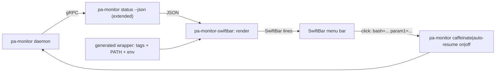

# pa-monitor SwiftBar menu bar plugin — design

Date: 2026-10-07
Repo: `phillipgreenii-nix-agent-support` (public — no employer-specific detail in code, tags, comments or docs)
Status: revision 3 (incorporates two independent review rounds; no blockers remain)

## 1. Intent

A macOS menu bar indicator (SwiftBar plugin) that makes the current 5-hour Claude usage window
visible at a glance and lets the operator flip two pa-monitor toggles without opening the TUI.

Success criteria — from the menu bar alone the operator can:

1. See current 5h usage, color coded, and how much time is left in the window.
2. See when the usage limit has been hit and how long until it resets.
3. Toggle **caffeinate** and **auto-resume** ("auto nudge", the TUI's `[R]` key) with one click, and
   see their current state.

Non-goals (YAGNI): manual nudge (`[N]`), session lists/details, history, launching the TUI, cost
or plan-cap display, any write path other than the two toggles, changing the TUI.

## 2. Verified findings that shape the design

- `pa-monitor status --json` already carries the authoritative window:
  `rate_limits.five_hour.{used_pct,resets_at}`, `rate_limits.seven_day.{…}`,
  `rate_limits.captured_at` (each independently optional — absent means unknown, never 0), and
  `sessions[].{status,blocker}` (`blocked`/`usage_limit` when limited).
- `status --json` does **not** carry caffeinate or auto-resume state. They live in `pb.DaemonState`
  (`GetCaffeinateMode`, `GetCaffeinateProcess`, `GetCaffeinateGraceRemainingS`,
  `GetAutoResumeEnabled`; proto fields 16/17/18/14) and are printed by the text `status`
  (`cmd/pa-monitor/cli.go:89-91`).
- Toggles are CLI verbs: `pa-monitor caffeinate on|off|toggle` (`control.go`) and
  `pa-monitor auto-resume on|off|toggle` (`auto_resume.go`). TUI `[R]` = auto-resume
  (`internal/tui/keybindings.go:38`).
- The TUI's 5h row (`internal/render/block_row.go`) is **uncolored**. The only 5h color rule is
  `CmuxFiveHourColor` (`internal/render/cmux_five_hour_color.go`): red `#cc3333` at floor(used) ≥ 80;
  yellow `#e0b000` when floor(used) exceeds percent-through-block `(18000 − remaining_s) * 100 / 18000`
  (clamped 0..100, computed only when remaining_s > 0); else clear; stale variants `#7a2b2b` /
  `#8a6d00`. This plugin reuses those rules and constants.
- The cost/cap percentage was **deliberately removed** from the CLI (`cli.go:101-106`: it overstated
  the 5h window, e.g. 396%). This design therefore never derives a percentage from cost.
- `active_block.id` (ccusage-derived) can disagree with the authoritative reset. **Time left and the
  limit countdown MUST use `rate_limits.five_hour.resets_at`, never the block id.**
- pa-monitor's own `StaleAfter` default is 10 min (`internal/config/config.go:227`), overridable via
  `stale_after_s`. Per behavior invariant `INV-STALE-1` each consumer judges staleness by its own
  tolerance, so a plugin-local threshold is legitimate; it defaults to pa-monitor's.
- Consumers of `status --json` (ccpool `internal/usagelimit`, `pg-connector-agentsession-pa-monitor`,
  pa-monitor tests) use plain `json.Unmarshal`; none use `DisallowUnknownFields`, and ccpool documents
  that unknown keys are ignored. Additive top-level keys are non-breaking.
- Packaging precedent for SwiftBar plugins exists in a sibling repo (a `mkBashScript` body, a
  generated wrapper carrying xbar/swiftbar tags and a PATH prelude, a build-time wrapper check, and
  an `.source` install via `home.file` of an executable store file into the SwiftBar plugin dir).
  Reuse the pattern; do not name that repo or module in code, comments or tags.

## 3. Architecture

Pipe-and-Filter: daemon state → `status --json` → render → SwiftBar lines; click actions are direct
`pa-monitor` invocations.



### 3.1 Unit A — `status --json` extension (Go, `packages/pa-monitor/cmd/pa-monitor/status_json.go`)

Additive only. Two new top-level keys:

```json
{
  "caffeinate": { "mode": true, "process": "holding", "grace_remaining_s": 42 },
  "auto_resume": false
}
```

Go types (names illustrative): `caffeinateJSON{ Mode bool \`json:"mode"\`; Process string \`json:"process"\`;
GraceRemainingS uint32 \`json:"grace_remaining_s,omitempty"\` }`; on `statusJSONDoc`:
`Caffeinate \*caffeinateJSON \`json:"caffeinate,omitempty"\``, `AutoResume bool \`json:"auto_resume"\``(NOT omitempty —`false` is a meaningful value the plugin must render as "off").

Semantics: a pa-monitor client that has this change **always** emits both keys. Key **absence** means
"older pa-monitor client"; the plugin then hides the toggle rows. (A new client talking to an old
daemon sees proto3 zero values and cannot distinguish unknown from off; this is accepted and noted
in the README.)

`process` is mapped by a NEW mapper (the existing `caffeinateProcessString` returns display strings
like `on (holding)` and is not reusable) to exactly `off|holding|grace|error`; any unrecognised
`pb.CaffeinateProcess` value maps to `unknown`. `grace_remaining_s` is emitted only when
`process == "grace"`; because it is `omitempty`, the plugin MUST treat a missing
`grace_remaining_s` during `process:"grace"` as 0 (renders `0:00`). `mode` is read from
`GetCaffeinateMode()` only, for parity with `cli.go:89` (the pre-split-daemon `GetActive()` fallback
in `control.go:73-76` is deliberately not mirrored; old-daemon caveat above applies).

Tests (`status_json_test.go`): every `pb.CaffeinateProcess` value plus an out-of-range value;
mode true/false; `auto_resume` true and false both present in output; grace seconds present only in
grace; one minimal backward-compat decode of the old shape (the doc without the new keys) into the
existing struct. Update the contract documentation in `packages/pa-monitor/README.md` (the
`status --json` section, ~lines 56 and 67-83) and add the missing `auto-resume` row to its
subcommand table. Check `docs/adr` for an ADR index entry covering the `status --json` contract
(ADR 0021/0024 touch the rate_limits keys); add an ADR only if the repo's own rules say a contract
key addition needs one, otherwise state "no ADR needed (additive, presentation-only)" in the commit message.

### 3.2 Unit B — `pa-monitor-swiftbar` (bash, `mkBashScript`, `public = false`)

Follows the `bash-scripting` skill (mkBashBuilders, bats, shellcheck clean). Runtime deps: `jq`,
`coreutils`. The `pa-monitor` binary is resolved from `$PA_MONITOR_BIN` if set (the Nix wrapper sets
it, §3.3), else `command -v pa-monitor`; if neither resolves, state 0 below.

Interface:

- `pa-monitor-swiftbar` (no args): SwiftBar output on stdout; always exit 0.
- Test seams: `PA_SWIFTBAR_NOW` (epoch seconds, default `date +%s`), `PA_MONITOR_BIN`,
  `PA_SWIFTBAR_STALE_AFTER_S` (default 600).

#### 3.2.1 Derived values (all time math via jq, e.g. `fromdateiso8601`; local clock text via

`strflocaltime`; the wrapper does not set TZ, tests pin `TZ`)

| Value         | Source                                                                                                             |
| ------------- | ------------------------------------------------------------------------------------------------------------------ |
| `used`        | `floor(rate_limits.five_hour.used_pct)`; **unknown** when absent (no cost fallback, ever)                          |
| `resets_at`   | `rate_limits.five_hour.resets_at`; unknown when absent                                                             |
| `remaining_s` | `resets_at − now`                                                                                                  |
| `pace`        | `clamp((18000 − remaining_s) * 100 / 18000, 0, 100)` (integer division); unknown when `remaining_s ≤ 0` or unknown |
| `stale`       | `captured_at` present and `now − captured_at > PA_SWIFTBAR_STALE_AFTER_S`                                          |

#### 3.2.2 States (first match wins)

0. **pa-monitor not found** (binary does not resolve, or exit 127): title `5h ⚠` gray; row
   "pa-monitor not found". No toggle rows.
1. **Daemon unreachable** (`status --json` non-zero, or no result within `timeout 5`): title `5h ⚠`
   gray; row "pa-monitor daemon unreachable". No toggle rows.
2. **Limit hit**: `used ≥ 100` on the five-hour window **or** the seven-day window, **and** that
   window's `resets_at` in the future (matches ccpool's `hit()` requirement of a known future reset).
   Title `⛔ LIMIT · resets 23:10 (24m)` for 5h, `⛔ 7d LIMIT · …` for 7d; if both are limited the
   later reset wins. Red `#cc3333`. Dropdown: window name, local reset time, countdown, count of
   sessions with `blocker=usage_limit`. A session blocked on `usage_limit` WITHOUT `used ≥ 100` does
   not trigger this state.
3. **Expired reading**: five-hour `resets_at` present and ≤ now (window rolled, no fresh capture):
   title `5h –` gray; row "reading expired, waiting for next status-line capture".
4. **Normal**: `used` known. Title `5h 63% · 1h 52m` (percent, then time left until `resets_at`;
   the time part is omitted when `resets_at` is unknown). Color per §3.2.3. Includes the edge
   `used ≥ 100` with `resets_at` absent: renders red `5h 100%` with no countdown (explicit).
5. **No data**: `used` unknown (and not state 3): title `5h ?` gray.

Countdown format: `Dd Hh` for ≥ 24 h, `Hh Mm` for ≥ 1 h, `Mm` below. (Deliberate deviation from
`(%dh %dm)` in `cmux_five_hour_color.go`, which prints `0h 24m`.) Reset clock text: `HH:MM` when the
reset falls on today's local date, else `Ddd HH:MM` (jq `strflocaltime("%a %H:%M")`), so a 7-day
reset is unambiguous (e.g. `⛔ 7d LIMIT · resets Mon 09:00 (3d 4h)`).

Dropdown content by state: the usage bar and window row appear only in states 2 and 4 (state 3's
number belongs to a rolled window; state 5 has none). States 2–5 show sessions, the data-age row
(when `stale`), toggle rows and Refresh; state 3 and 5 additionally show their message row. States
0 and 1 show only their message row and Refresh (no toggles).

#### 3.2.3 Color rule (state 4)

Same thresholds as `CmuxFiveHourColor`; the single deliberate deviation is that its "clear" case is
green so the title is always color coded:

| Condition                       | Color            | Stale variant |
| ------------------------------- | ---------------- | ------------- |
| `used ≥ 80`                     | `#cc3333` red    | `#7a2b2b`     |
| else `used > pace` (pace known) | `#e0b000` yellow | `#8a6d00`     |
| else                            | `#3a9a4a` green  | `#2a6a34`     |

Gray is `#888888`. SwiftBar title-line syntax: `5h 63% · 1h 52m | color=#3a9a4a`.

#### 3.2.4 Dropdown (after `---`)

- Usage bar: `█`/`░`, width 18 (same as `progressBar`), plus `63%`; seven-day line when known:
  `7d: 42% · resets Mon 09:00`.
- Window: `resets 23:10 · 1h 52m left`.
- Sessions: `3 working · 11 blocked · 7 idle` from `sessions[].status`.
- Data age row when `stale` (all of states 2–5): `reading 14 min old`.
- Toggle rows (only when `caffeinate`/`auto_resume` keys exist). Row text is the full
  mode × process matrix; `checked=true` follows **mode only**:

  | mode | process                                                                | caffeinate row text                |
  | ---- | ---------------------------------------------------------------------- | ---------------------------------- |
  | on   | holding                                                                | `Caffeinate: on (holding)`         |
  | on   | grace                                                                  | `Caffeinate: on (grace m:ss)`      |
  | on   | off                                                                    | `Caffeinate: on (armed)`           |
  | on   | error                                                                  | `Caffeinate: on (error)`           |
  | off  | off                                                                    | `Caffeinate: off`                  |
  | off  | holding                                                                | `Caffeinate: off (still holding)`  |
  | off  | grace                                                                  | `Caffeinate: off (releasing m:ss)` |
  | off  | error                                                                  | `Caffeinate: off (error)`          |
  | any  | `unknown` or any token not listed above (e.g. from a newer pa-monitor) | `Caffeinate: <on\|off> (?)`        |

  Auto-resume row: `Auto-resume: on|off`, `checked=true` when on.

- Click actions are **idempotent and relative to the rendered state**, not `toggle`: a row showing
  mode on emits `param2=off`, a row showing mode off emits `param2=on`, so display lag cannot flip
  the opposite of what the operator saw. Form:
  `bash=<abs pa-monitor> param1=caffeinate param2=off terminal=false refresh=true` (and
  `param1=auto-resume …`). `<abs pa-monitor>` is the resolved absolute path.
- `Refresh` row (`refresh=true`).

The plugin refreshes every 30 s (filename `pa-monitor.30s.sh`).

### 3.3 Unit C — Nix wiring

Package (registered exactly like `wtdone`: overlay attr `flake.nix:568-572`, checks splice
`:9846-9852`, `inherit (pkgs)` in `packages` `:10008-10012`):

- `packages/pa-monitor-swiftbar/default.nix` returning `{ pa-monitor-swiftbar; packages;
checks.test-pa-monitor-swiftbar = …check; }`, with the inner `pa-monitor-swiftbar/` directory
  holding the `.sh` and `tests/`. `public = false` and invoked only by the wrapper, so: no
  completions and no tldr page (all optional in `phillipg-nix-repo-base/lib/bash-builders.nix`
  :158-162); `--help` MUST still work for the default man page, or set `manPage = false`.
- The generated wrapper is a FUNCTION, not a fixed overlay attr, because it bakes in per-config
  values: `packages/pa-monitor-swiftbar/plugin.nix` exposing
  `mkPluginWrapper = { script, paMonitor, staleAfterS }: …`. The HM module calls it with
  `cfg.package` and `cfg.swiftbar.staleAfterS`; the flake check `test-pa-monitor-swiftbar-plugin`
  builds the SAME function with defaults. Values are interpolated with `lib.escapeShellArg` and
  `toString` (the TOML value type is open).
- Check names (pinned): `test-pa-monitor-swiftbar` (bats), `test-pa-monitor-swiftbar-plugin`
  (wrapper), `test-pa-monitor-swiftbar-hm-render` (HM render).

Home-Manager (`home/programs/pa-monitor/default.nix`; no new import in `home/default.nix`):

- `swiftbar.enable` (default false), `swiftbar.pluginDir` (default
  `"Library/Application Support/SwiftBar/Plugins"`, home-relative, to avoid hard-coding drift),
  `swiftbar.staleAfterS` (default `cfg.settings.stale_after_s or 600`).
- Gating: `mkIf (cfg.swiftbar.enable && isDarwin)` for the entry; an `assertions` entry requires
  `cfg.enable` when `swiftbar.enable` is set (the wrapper bakes in `${cfg.package}/bin/pa-monitor`).
- `home.file."${cfg.swiftbar.pluginDir}/pa-monitor.30s.sh".source` = the generated wrapper (an
  executable `writeTextFile` store file).
- Generated wrapper: `#!/usr/bin/env bash`; one `# <xbar.*>` / `# <swiftbar.*>` tag per line (title,
  version, author = the operator's own identity only, desc, dependencies, hide Run-in-Terminal /
  Disable / SwiftBar); PATH prelude
  (`/etc/profiles/per-user/$(id -un)/bin:$HOME/.nix-profile/bin:/run/current-system/sw/bin:$PATH`);
  `export PA_MONITOR_BIN=${cfg.package}/bin/pa-monitor`; `export PA_SWIFTBAR_STALE_AFTER_S=…`; then
  `exec <store>/bin/pa-monitor-swiftbar "$@"`.
- Wrapper check (flake check) asserts: shebang, every tag present and non-empty, hide tags true, tag
  count, `PA_MONITOR_BIN` export precedes `exec`, exec target is an executable file, **the wrapper
  store file itself has the executable bit** (the HM render test cannot see modes).
- Existing HM eval tests break on a new `home.file`: `test-pa-monitor-config-gating` and
  `test-pa-monitor-hm-launchd` in `flake.nix` evaluate this module against a minimal stub option set,
  and an undeclared option errors even under `mkIf false`. Add the `home.file` stub (and any other
  newly touched option) to both. New HM render test (mirror `test-pa-monitor-hm-launchd`'s
  `evalWith { pkgs' = … }` to cover non-darwin): enabled on darwin → entry at the plugin path whose
  source text contains `export PA_MONITOR_BIN=${pkgs.pa-monitor}/bin/pa-monitor` and the configured
  stale value; disabled or non-darwin → absent; enabled without `cfg.enable` → assertion fails.
- Out of scope: installing SwiftBar and setting its `PluginDirectory`, and setting
  `swiftbar.enable = true` on any machine (separate follow-up bead in the consuming repo, which MUST
  set SwiftBar's `PluginDirectory` from the same string as `swiftbar.pluginDir`).

## 4. Error handling

Every external call is bounded (`timeout 5`). Any `jq` failure degrades to state 5, never a raw
error in the menu bar. Unknown ≠ zero. A failed toggle click leaves the displayed state unchanged on
refresh (no silent success).

## 5. Testing

- **Go**: §3.1 tests.
- **bats** (`tests/`): PATH-stub `pa-monitor` printing fixture JSON; `PA_SWIFTBAR_NOW` and `TZ`
  pinned. Cases: green / yellow / red; exactly 80 and exactly 100 boundaries; stale variants and
  stale-after override; limit hit 5h with countdown; limit hit 7d; both limited (later reset wins);
  7d-limited with expired 5h reading; `used ≥ 100` with absent `resets_at` (state 4) and with past
  `resets_at` (state 3); no `five_hour` (state 5, no cost fallback); unknown `resets_at`; stub exit 2
  (state 1); stub missing/127 (state 0); toggle rows absent without the new keys; the full
  caffeinate mode × process matrix; click rows emit `param2=off|on` relative to the rendered state;
  `blocker=usage_limit` alone does not trigger state 2; countdown format branches (`Dd Hh`,
  `Hh Mm`, `Mm`); reset clock `HH:MM` vs `Ddd HH:MM`; missing `grace_remaining_s` in grace;
  unrecognised `process` token renders `(?)`; dropdown content per state (bar/window only in 2 and 4).
- **Nix**: §3.3 wrapper check and HM render test, plus the extended stubs.
- Hooks: run the repo's pre-commit bundle (`pg-hooks`) on changed files; shellcheck clean.
- Docs: README (§3.1), a short usage note for the plugin (where the plugin appears, how to enable),
  and CLAUDE.md "docs review after a task" applies.

## 6. Decisions recorded

| Decision                         | Choice                                          | Reason                                            |
| -------------------------------- | ----------------------------------------------- | ------------------------------------------------- |
| Caffeinate/auto-resume transport | Extend `status --json` additively               | Operator-approved 2026-10-07; no text scraping    |
| "Auto nudge"                     | TUI `[R]` auto-resume                           | Operator wording, TUI parity                      |
| Color rule                       | `CmuxFiveHourColor` thresholds, green for clear | TUI has no 5h color; this is the existing 5h rule |
| Time source                      | `five_hour.resets_at`                           | Block id disagrees with authoritative reset       |
| Cost fallback / plan cap         | Excluded                                        | `cli.go:101-106` removed it as misleading         |
| Click semantics                  | Explicit `on`/`off`, not `toggle`               | Display lag could invert the operator's intent    |
| Binary resolution                | Nix bakes `PA_MONITOR_BIN`; PATH fallback       | Client matches daemon; SwiftBar env is minimal    |
| Placement                        | This repo, `home/programs/pa-monitor` option    | General tool; machine enablement lives elsewhere  |
| Manual nudge / TUI launch        | Excluded                                        | Not requested                                     |
