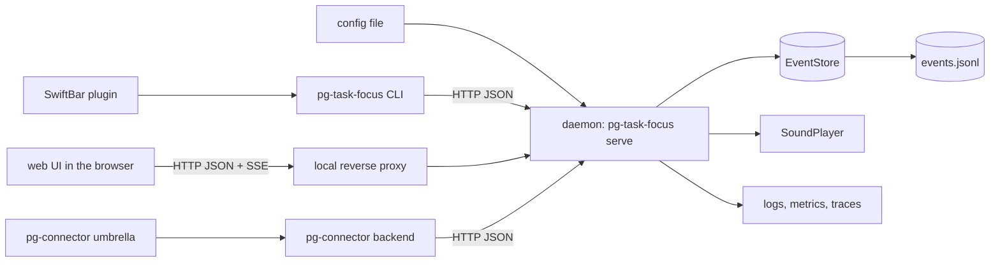
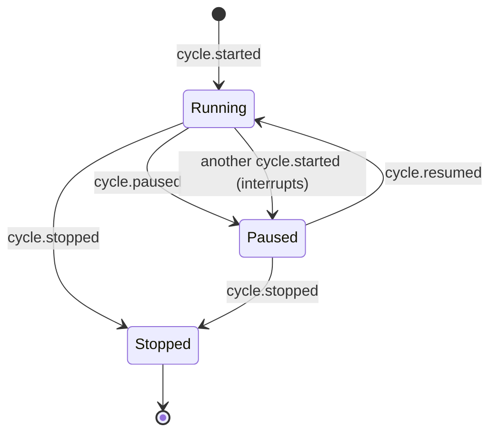

# pg-task-focus design

**Status**: Draft 2 for review (revised after four independent reviews: completeness, correctness,
UX, observability)
**Date**: 2026-10-07
**Deciders**: operator (every ruling is recorded under "Decision log")

The key words MUST, MUST NOT, SHOULD, SHOULD NOT and MAY in this document are to be read as in
RFC 2119.

## Open questions for the operator

None outstanding. The two questions the first round of reviews raised were ruled on by the operator
and are recorded in the decision log:

- Quieting the overtime sound: ruled out (row 7). There is no acknowledge, mute or snooze.
- A carry-over option on period change: ruled out (row 24). The outcomes are `missed` or `skipped`.

## Summary

`pg-task-focus` is a local, single-user daemon that keeps its operator on a written daily routine.
It tracks three kinds of recurring checklist (per day, per week, per sprint) and a set of timed
**work cycles** (a focus timer with a type, a note and free key/value pairs). It is operated through
a web UI, a CLI and a SwiftBar menu-bar plugin, and it publishes the cycles and the overdue work
through the `pg-connector` `calendar` and `attention` capabilities, so the rest of the operator's
tooling sees them.

The app is generic. Everything specific to one employer or one routine (the actual task list, cycle
types, links, channel names) is **configuration** supplied by the consuming flake. This repository
is public and MUST NOT carry any such detail (see this repository's `CLAUDE.md`, "Public Repository
— No ZipRecruiter Disclosure").

### Goals

1. Show the operator what is due and what is overdue, per day, week and sprint, tell them what is
   next, and let them record "done at time T" or "not doing it, because R" for each item.
2. Run one timed work cycle at a time, with pause, resume, stop and boost, a sound at expiry and a
   repeating reminder until the cycle is stopped, and record the cycle's type, start, stop, pauses,
   note and key/value pairs.
3. Make the record trustworthy: it is append-only, mistakes are fixed by correction events (including
   adding a forgotten break after the fact), and the corrected view is always derivable from the log.
4. Be observable as a running service (logs, metrics, traces, health, dashboards, alerts).
5. Expose cycles as calendar events and overdue work as attention items, through `pg-connector`.

### Non-goals

- Replacing the existing `work-timer` start/stop session log, or the `/daily-focus` focus-item
  tooling. Both stay as they are (see "Decision log").
- A TUI. A terminal user interface MAY be added later; it is not designed here.
- Multi-user operation, remote access, or authentication tokens (the daemon is loopback-only).
- Choosing the day's focus items (that stays with `/daily-focus`).
- Tracking work-in-progress limits. The routine's "at most two active items" is a human discipline;
  the app has no concept of an active item, so no `wip_limit` exists.
- Cycle suggestions, streaks, scores or a guided morning wizard.
- Quieting the overtime sound. There is no acknowledge, mute, snooze or repeat cap: the reminder
  repeats until the cycle is stopped (operator ruling, decision log row 7).
- Carrying an unfinished task over into the next period. A task that is still open when its period
  is rolled over is `missed` or `skipped`, never carried (operator ruling, decision log row 24).

## Glossary

| Term            | Meaning                                                                                                                   |
| --------------- | ------------------------------------------------------------------------------------------------------------------------- |
| Period          | A day, a week or a sprint. Each has civil dates (a start, and an end for week and sprint) and the zone it was created in. |
| Profile         | A named set of task and cycle definitions (for example "normal" and "on-call"). Exactly one profile is active.            |
| Task definition | A config entry: title, cadence (`daily`, `weekly` or `sprint`) and a due rule.                                            |
| Task instance   | A task definition materialized for one period, with a concrete due instant.                                               |
| Cycle           | One timed unit of work of a configured type.                                                                              |
| Segment         | One contiguous running interval of a cycle (start to pause, resume to pause, resume to stop).                             |
| Event           | One immutable JSON line in the log.                                                                                       |
| Projection      | The in-memory state derived by replaying the log.                                                                         |
| Correction      | An event that supersedes or retracts an earlier event; the log is never edited.                                           |

## Architecture



Design patterns in use:

- **Event Sourcing** with a **Projection**: the log is the source of truth, the projection is
  derived and disposable.
- **Repository** (`EventStore`): the only component that touches the log file; the JSONL
  implementation is the first of potentially several.
- **Strategy** (`SoundPlayer`, `Clock`): injected so tests need no real audio or real time.
- **Facade** (the HTTP API): one contract that every client uses; no client reads the log.
- **Adapter** (the connector backend): translates the daemon's API into the `pg-connector` wire
  contract, as a process-boundary adapter per this repository's ADR 0062.

The daemon is the **only writer** of the log, and MUST enforce that by taking an exclusive advisory
lock on the data directory at startup and refusing to start without it. The CLI, web UI, SwiftBar
plugin and connector backend are all clients of the HTTP API. The offline `check` command reads the
log without the lock.

## Time and zones

Ambiguous time is the dominant source of defects in a scheduler, so this design forbids implicit
zones.

- Every stored instant MUST be an RFC 3339 timestamp in UTC (`2026-10-07T13:30:00.000Z`), with at least millisecond precision.
- Every computation that depends on a civil date or a wall-clock time MUST name an IANA time zone
  identifier (for example `America/New_York`). The config has **no default zone**.
- A zone MUST be an IANA identifier present in the embedded time zone database. Abbreviations
  (`ET`, `EST`, `PST`) and bare UTC offsets (`-05:00`) MUST be rejected at config load and at API
  input, because an abbreviation is ambiguous and an offset ignores daylight saving rules.
- The daemon MUST embed the time zone database (the Go `time/tzdata` package) so behavior does not
  depend on the host's zone files.
- A civil time that does not exist (skipped when clocks go forward) MUST resolve to the first valid
  instant after the gap: with a 02:00 to 03:00 gap, `02:30` resolves to `03:00` local time (it is
  not shifted by the length of the gap). A civil time that occurs twice (repeated when clocks go
  back) MUST resolve to its earlier occurrence. The Go standard library does not guarantee either
  choice, so the daemon MUST implement and test both rules explicitly.
- A period's dates are **civil dates** with no zone. A due rule resolves a civil date of its
  period in the rule's own `tz`. A rule whose zone differs from the period's zone is legal; the UI
  and CLI MUST show every due time together with its zone identifier.
- A period also stores the zone in force when it was created. That zone decides one thing: which
  civil date "today" is, for the "the date has moved on" banner. A change request MUST supply it.
  The web UI SHOULD default it from the browser. The CLI SHOULD default it from the host and MUST
  read the host's zone from the `TZ` variable (if it is an IANA identifier) or the target of the
  `/etc/localtime` symbolic link (the zone name is the path after `zoneinfo/`; on macOS the link
  points into `/var/db/timezone/zoneinfo/`), and MUST fail if neither yields an IANA name (Go's
  `time.Local` does not name its zone).

## Event log

The log is one UTF-8 file of newline-delimited JSON, at
`${XDG_DATA_HOME:-$HOME/.local/share}/pg-task-focus/events.jsonl`. Every line is one event:

```json
{
  "v": 1,
  "id": "01JABC...",
  "at": "2026-10-07T13:30:04.120Z",
  "effective_at": "2026-10-07T13:28:00.000Z",
  "type": "task.completed",
  "data": { "task_id": "day:2026-10-07:post-plan" }
}
```

| Field          | Meaning                                                                                                                                                                                |
| -------------- | -------------------------------------------------------------------------------------------------------------------------------------------------------------------------------------- |
| `v`            | Event schema version. The daemon MUST refuse to start on a version it does not know.                                                                                                   |
| `id`           | A ULID, unique. A client MAY supply it (see rule 11). Append order, not `id` order, is the log order.                                                                                  |
| `at`           | When the daemon recorded the event. Set by the daemon, never by a client.                                                                                                              |
| `effective_at` | When the thing happened. Defaults to `at`. A client MAY supply it; it MUST NOT be later than the current time plus `max_future_skew_seconds` (default 60), else `future_effective_at`. |
| `req_hash`     | Present when the request that produced the event carried an `id`: a hash of that request's canonical client-supplied fields (rule 11).                                                 |
| `type`         | The event type.                                                                                                                                                                        |
| `data`         | The type-specific payload.                                                                                                                                                             |

### Event types

| Type                | Payload (`data`)                                                                                                                                                                                 |
| ------------------- | ------------------------------------------------------------------------------------------------------------------------------------------------------------------------------------------------ |
| `period.changed`    | `kind` (`day`, `week`, `sprint`), `start` (civil date), `end` (civil date; REQUIRED for `week` and `sprint`, absent for `day`), `tz`, `label`, `batch`                                           |
| `profile.changed`   | `profile`, `batch`                                                                                                                                                                               |
| `task.materialized` | `task_id`, `definition`, `cadence`, `period`, `title`, `group` (optional), `link` (optional), `due` (an instant, always present), `due_rule` (the rule as resolved, including its `tz`), `batch` |
| `task.completed`    | `task_id`                                                                                                                                                                                        |
| `task.skipped`      | `task_id`, `reason` (required, non-empty), `batch` (optional)                                                                                                                                    |
| `task.missed`       | `task_id`, `batch`                                                                                                                                                                               |
| `task.withdrawn`    | `task_id`, `batch` (the task is no longer in the active profile)                                                                                                                                 |
| `task.reinstated`   | `task_id`, `batch` (a withdrawn task is back in the active profile)                                                                                                                              |
| `cycle.started`     | `cycle_id`, `type`, `title`, `planned_minutes`, `interrupts` (optional `cycle_id` of the cycle it paused)                                                                                        |
| `cycle.paused`      | `cycle_id`, `batch` (optional)                                                                                                                                                                   |
| `cycle.resumed`     | `cycle_id`, `batch` (optional)                                                                                                                                                                   |
| `cycle.boosted`     | `cycle_id`, `minutes`                                                                                                                                                                            |
| `cycle.stopped`     | `cycle_id`                                                                                                                                                                                       |
| `cycle.annotated`   | `cycle_id`, `note` (optional), `kv` (a list of `{key, value}` pairs; repeated keys are allowed)                                                                                                  |
| `event.corrected`   | `target` (an event id), `fields` (replacements for the target's `effective_at` and/or its non-identity `data` fields), `reason` (optional)                                                       |
| `event.retracted`   | exactly one of `target` (an event id) or `batch`, `reason` (optional)                                                                                                                            |
| `batch.committed`   | `batch`                                                                                                                                                                                          |

### Rules

1. **Append-only.** No component MAY rewrite or delete a line, with two exceptions, both
   truncations to the end of the last committed record: crash recovery (rule 7) and the rollback of
   a failed append (rule 14).
2. **Task snapshots.** `task.materialized` copies the title, group, link and resolved due rule, and
   `cycle.started` copies the type's title and planned minutes. Replay MUST NOT consult the config
   to reconstruct any of this, so a config edit never rewrites history. Only runtime behavior
   (alert sound and repeat interval, attention thresholds) reads the current config, by cycle type
   id, falling back to `defaults` when the type no longer exists.
3. **Deterministic task ids.** A task id is `<cadence>:<period-start-date>:<definition>`. The daemon
   MUST NOT append `task.materialized` for an id that already has a live instance. A `period.changed`
   whose `start` is not later than the current `start` of that kind MUST be rejected (`409 period_unchanged`);
   undo is the way back. A withdrawn task that returns is brought back by `task.reinstated`, never
   by a second materialization.
4. **Annotation replaces.** The latest `cycle.annotated` event for a cycle is its complete note and
   key/value list. Clients send the whole form each time. Annotation is allowed in every cycle
   state, including after the cycle is stopped.
5. **Atomic interrupts.** Starting a cycle while another runs is one `cycle.started` event carrying
   `interrupts`. The daemon, not the client, sets it, from the cycle that is running **at the new
   event's `effective_at`** (the replay state at that instant). The projection derives the pause of
   the interrupted cycle effective at that instant, which MUST be strictly later than the
   interrupted cycle's most recent start or resume; otherwise the request is rejected as
   `invalid_timeline`. There is never a state in which the pause is recorded and the start is not.
6. **Batches.** A mutation that appends more than one event (a period or profile change, a
   rollover, a break back-fill, a batch retraction) MUST give them a shared `batch` id and MUST
   terminate them with a `batch.committed` event, all written and fsynced together.
7. **Crash recovery.** On startup, a torn final line, and trailing events of a batch that has no
   `batch.committed`, were never acknowledged to any client. The daemon MUST copy those bytes to a
   sidecar file, fsync it, truncate `events.jsonl` to the end of the last committed record, fsync
   it, and only then accept appends. A torn line or an uncommitted batch anywhere but the tail is
   corruption (refuse to start).
8. **Corrections and retractions.**
   1. They are applied in log order; for several corrections of one target the last wins.
   2. A target MUST precede the event that corrects or retracts it in the log. An unknown target,
      or a batch id that matches no batch, is rejected as `404 unknown_event`.
   3. A correction MUST NOT change `type` or any identity field (`cycle_id`, `task_id`, `target`,
      `batch`, `interrupts`, `definition`, `kind`, `start`, `cadence`, `period`, `profile`). A
      correction MUST NOT target `event.corrected`, `event.retracted` or `batch.committed`. A
      violation of 8.2 to 8.4 is rejected as `422 invalid_correction`.
   4. A retraction MAY target any event except `batch.committed`, including a correction or another
      retraction (so every correction is undoable). A retraction of a lone `task.materialized` or
      `period.changed` MUST be rejected, and so MUST any retraction that would leave a task whose
      period has no live `period.changed`; a whole batch is retracted with `batch`. An event that carries a `batch` MUST be retracted
      only through that batch, never alone (a lone retraction would leave, for example, a task open
      in a period that was already left).
   5. A retraction of a batch MUST be rejected (`409 batch_has_dependents`) when a later live event
      references an entity that batch created (for example a task completed in the new period). A
      late completion or skip of a task that the batch marked `missed` is NOT a dependent:
      retracting the batch removes the `task.missed` and leaves the completion. The refusal MUST
      name the dependent events, and the UI MUST link them in the editor and state this limit next
      to every undo.
9. **Validation by candidate replay.** Every mutation, including every correction and retraction and
   every client-supplied `effective_at`, MUST be validated by replaying the log with the change
   applied, before anything is appended. A result with an impossible timeline (a stop before a
   start, overlapping segments of one cycle, two running cycles, a resume of a stopped cycle, a
   completion earlier than its task's materialization, a task completed or skipped twice) MUST be
   rejected with `invalid_timeline` and the reason. `missed` and `withdrawn` are not resolutions for
   this purpose. An append at the log tail MAY be validated incrementally against a clone of the
   projection; corrections, retractions and a backdated `effective_at` require a full replay.
10. **Task states.** A task is `open` (materialized, with no live resolution), `completed`,
    `skipped`, `missed` or `withdrawn`.
    - `completed` and `skipped` are the operator's resolutions. A task MAY be completed or skipped from `open` or `missed`; a late completion of a missed task is allowed and supersedes the `missed`. A second completion or skip of a resolved task is rejected (`409 task_already_resolved`).
    - A `withdrawn` task MUST be reinstated before it can be completed or skipped (`409 task_withdrawn`), unless the completion or skip has an `effective_at` that precedes the withdrawal; then it is accepted and supersedes the withdrawal.
    - `task.missed` is a system marker, not a resolution. A live `completed` or `skipped` supersedes it regardless of `effective_at` order (so a task that rolled over at 00:05 can still be completed with an `effective_at` of 16:00 the day before), and it is exempt from the ordering checks of rules 9 and 13. `task.withdrawn` is a marker of the same kind, but it yields only to a completion or skip that precedes the withdrawal (previous bullet).
    - A rollover only touches tasks that are `open` when it is validated.

11. **Idempotency.** The CLI and the web UI MUST send an event `id` on every mutation (the connector
    is read-only). Every event produced by a request that carried an `id` stores `req_hash`, a hash
    of that request's canonical client-supplied fields, so the index from `id` to `req_hash` can be
    rebuilt on replay without the original payloads. The lookup MUST run before validation and
    compare only `req_hash`: a repeated id with the same hash returns the original result and
    appends nothing; with a different hash it is rejected (`409 id_conflict`). For a batch the
    request `id` is the batch id. A request without an id gets one assigned and no idempotency.
12. **State version.** The state `version` is the pair (`log_lines`, `config_generation`): the number
    of lines in the log, and a counter seeded at each start with the start time in milliseconds and advanced on each
    successful config reload, so a pair never recurs across a restart. `state_version` (the dry-run
    value and `expected_version`) is this pair; the `state_version` gauge reports `log_lines`.
    Clients compare versions only for inequality and refetch on any change; `expected_version` and
    `stale_preview` compare both.
13. **Ordering.** An entity's domain events (a cycle's by `cycle_id`, a task's by `task_id`) are
    ordered by `effective_at`, then by log position, never by `id`. Corrections and retractions
    apply by log position. Timestamps carry at least millisecond precision. `task.missed` is exempt
    (rule 10). A result that would
    need a different order for events at the same instant is rejected as `invalid_timeline`
    (for example a back-filled break that ends at the instant the cycle stopped; use "end at").
14. **Append failure.** On any error from a write or an fsync, the daemon MUST truncate
    `events.jsonl` back to the offset before the failed append and fsync that, so no partial or
    unacknowledged bytes remain. If the truncation fails, or the fsync itself failed (the file's
    state is then unknown), the daemon MUST enter read-only mode: every mutation returns
    `503 store_unavailable` until the process is restarted and has run crash recovery. A
    `503 store_unavailable` therefore means the outcome is unknown, and the client retries with the
    same `id` (rule 11).

## Configuration

The daemon reads a single validated config file (JSON, rendered from the flake's module options, in
the way `pg-connector`'s home module renders its config). It is reloaded on `SIGHUP`. YAML is used
below for readability only. All content shown is a generic example, and is itself valid under the
rules that follow.

```yaml
defaults:
  cycle_minutes: 25
  boost_minutes: [5, 10, 25]
  profile: normal
  max_future_skew_seconds: 60
  alert:
    sound: Glass
    reminder_sound: Tink
    repeat_minutes: 5
  attention:
    due_soon_minutes: 30
    overtime_high_minutes: 15
    stale_pause_minutes: 45

listen_port: 49210
public_url: https://focus.example.test

group_order: [Start of day, During the day, End of day]

profiles:
  normal:
    daily: [plan-day, post-plan, end-of-day-summary]
    weekly: [weekly-update]
    sprint: [capacity-check]
    cycles: [notifications, review, deep-work]
  on-call:
    daily: [plan-day, post-plan, end-of-day-summary]
    weekly: [weekly-update]
    sprint: [capacity-check]
    cycles: [notifications, review, page-response]

tasks:
  plan-day:
    title: Plan the day
    cadence: daily
    group: Start of day
    due: { at: "09:00", tz: America/New_York }
  post-plan:
    title: Post the plan for the day
    cadence: daily
    group: Start of day
    due: { at: "09:30", tz: America/New_York }
  end-of-day-summary:
    title: Post the end-of-day summary
    cadence: daily
    group: End of day
    due: { at: "17:30", tz: America/New_York }
  weekly-update:
    title: Write the weekly status update
    cadence: weekly
    due: { weekday: thu, at: "09:00", tz: America/New_York }
  capacity-check:
    title: Do the capacity check and post planning input
    cadence: sprint
    due: { day: 1, at: "09:00", tz: America/New_York }

cycles:
  notifications: { title: Notification cycle, minutes: 25, keys: [] }
  review: { title: Review cycle, minutes: 25, keys: [pr] }
  page-response: { title: Page response, minutes: 25, keys: [incident] }
  deep-work:
    title: Deep work cycle
    minutes: 50
    keys: [ticket, pr]
    alert: { sound: Hero, repeat_minutes: 10 }
```

### Rules

1. **Layering.** A profile lists task and cycle ids; the definitions live once under `tasks` and
   `cycles`.
2. **Due rules.** `due` is REQUIRED on every task. `daily` takes `at` and `tz`; `weekly` takes
   `weekday`, `at` and `tz`; `sprint` takes `day` and `at` and `tz`. `at` is a 24-hour `HH:MM` time;
   `tz` is REQUIRED and MUST be an IANA identifier. `day` counts calendar days, with 1 the sprint's
   first civil date. A rule resolves against the civil dates of a period, in the rule's own zone,
   when the period starts; the resolved instant is stored in `task.materialized`. A `weekday` that
   occurs more than once in a period resolves to its first occurrence. A rule that matches no
   civil date in its period (for example a `day` beyond the sprint's end) is not materialized. In
   both cases the response to the period change reports it.
3. **Cycle duration** precedence: the start-time override, then the cycle's `minutes`, then
   `defaults.cycle_minutes`.
4. **Keys** are only the pre-filled key names in a cycle's form. The operator MAY add any key/value
   pair at any time; values are free text and are not validated. A key supplied through the API
   MUST match `[a-z0-9_-]+` (`400 invalid_request`). The key `cycle_type` is reserved for the
   connector: it MUST be rejected as API input (`400 reserved_key`) and as a config `keys` entry.
5. **Alert settings** (`sound`, `reminder_sound`, `repeat_minutes`) resolve per cycle type, then
   `defaults.alert`. `sound` plays once at expiry; `reminder_sound` (default: the same as `sound`)
   plays on every repeat. Both MUST be short: sounds SHOULD be under two seconds long, and a cycle
   type that routinely runs long SHOULD raise its `repeat_minutes`.
6. **Group order.** Tasks sort within a period by `group_order` (a group not listed sorts last),
   then by due time.
7. **Validation.** The daemon MUST reject the whole config if: a profile names an unknown task or
   cycle, or lists a task under a cadence other than its own; a due rule's fields do not match its
   cadence or are missing; a `weekday` is not one of `mon` to `sun`; a `day` is less than 1; an
   `at` is not a valid `HH:MM`; a `tz` is not an IANA identifier; a duration or interval is not
   positive; `defaults.profile` is not defined; a key name is not `[a-z0-9_-]+` or is `cycle_type`. A bad config at first start is a hard failure. A bad reload keeps the
   previous config and reports through `/healthz`; a reload that removes the active profile is a
   bad reload.
8. **JSON Schema.** The config has a JSON Schema (2020-12, declaring `$schema`), checked in under
   the package's `schemas/` directory; the loader validates against it and then applies the
   semantic checks above.
9. **Listener and URL.** `listen_port` (required) and `public_url` (optional; an `http` or `https`
   URL) are top-level keys, validated by the schema. The daemon builds every deep link from
   `public_url`. A change to either takes effect only on restart; a reload that sees one reports it
   through `/healthz`.

## Periods, profiles and rollover

The header shows the current day, week and sprint (dates and labels) and the active profile. It is
read-only; a **change** control opens a modal.

1. **Bootstrap.** With an empty log the daemon serves state `uninitialized`; the header says
   "set your day, week and sprint". The first `period.changed` of each kind has no tasks to roll over
   and materializes its tasks. The bootstrap batch MUST begin with a `profile.changed` event carrying `defaults.profile`, so the
   active profile is always the latest `profile.changed` in the log and replay never consults the
   config.
2. **One change endpoint.** `POST /periods/change` takes one or more period changes
   (`{kind, start, end?, tz, label?}`; `end` REQUIRED for week and sprint) as one atomic batch, plus
   optional `effective_at`, `profile`, `overrides`, `skip_all_reason`, `expected_version`,
   `dry_run` and `id` (used as the batch id). A new `start` MUST be later than the current `start`
   of that kind (`409 period_unchanged`). The batch is ordered: the rollover of open tasks in the
   periods being left; then a `profile.changed` event if the request carries a `profile` (it applies
   to the periods that remain current, never to a period being left); then the new `period.changed`
   events and their tasks, materialized from the now-active profile. There is no `profile` in
   `period.changed`. Each kind changes independently: changing the day affects only daily tasks.
3. **Dry run.** `dry_run` returns, without appending, the open tasks of each period being left, the
   tasks the new periods would materialize (and any that could not be, with the reason), the tasks a requested profile change
   would add, withdraw or reinstate in the periods that remain current, and a
   `state_version`. The web UI and `period roll` MUST carry it back as `expected_version` (other
   clients MAY); if it is present and stale the request is rejected (`409 stale_preview`), so what
   the operator confirmed is what happens.
4. **Rollover.** On confirm, one batch is appended: each open task gets `task.missed` by default.
   The operator MAY override any single task to `task.skipped` with a reason (`overrides` is a list
   of `{task_id, reason}`; an override naming an unknown or resolved task rejects the whole request),
   or MAY mark every open task skipped with one shared reason (`skip_all_reason`); where both apply
   to a task, `overrides` win. Then the new
   `period.changed` events and the new periods' `task.materialized` events follow, from the active
   profile.
5. **Backdating.** `effective_at` MAY backdate the change (the operator forgot to change the day
   yesterday), so the missed times are correct. It MUST NOT precede the start of the period being
   left.
6. **Undo** is one batch retraction, subject to rule 8.5 of the event log: it is rejected once a
   later live event references the new periods' tasks, and the refusal names those events.
7. **Profile change.** `POST /profile/change` leaves completed, skipped and missed tasks alone. For
   each current period, tasks the new profile adds are materialized, open tasks the new profile no
   longer lists get `task.withdrawn`, and withdrawn tasks the new profile lists again get
   `task.reinstated`. Its dry run lists the added, withdrawn and reinstated tasks and flags any that
   would be overdue immediately.
8. `missed` and `skipped` are distinct on purpose. `missed` means the operator did not act;
   `skipped` is a decision with a stated reason. Reporting and attention treat them differently.
9. **The app never advances a period by itself.** When a period's last civil date has passed in its
   zone, the UI, `status` and the menu bar show "New day: roll over" (or "New week: roll over" or
   "New sprint: roll over"), using these exact strings everywhere, as the next action. The change
   modal pre-fills `start` as today in the zone and, for a week or sprint, `end` as `start` plus the
   length of the previous period of that kind (the operator MAY edit it). If several kinds have
   ended, one confirmation rolls all of them together. Tasks of the ended period stay completable
   until it is rolled over.
10. A running cycle is unaffected by a period change, and belongs to the date on which it started.
    The dry run MUST, however, list any running or paused cycle that started in a period being left
    (for example one left running when the laptop was closed), with an "End at" action. The
    action shows where its prefilled time comes from (the cycle's last recorded activity) and is
    editable; when nothing was recorded after the cycle's last event, it is left blank and the
    operator MUST enter a time. It MUST NOT stop the cycle unless the operator chooses that.

## Work cycles and the timer



Allowed operations by state:

| Operation  | Running | Paused | Stopped |
| ---------- | ------- | ------ | ------- |
| `pause`    | yes     | no     | no      |
| `resume`   | no      | yes    | no      |
| `boost`    | yes     | yes    | no      |
| `stop`     | yes     | yes    | no      |
| `annotate` | yes     | yes    | yes     |

`resume` of a paused cycle while another cycle is running is rejected (`409 cycle_already_running`).
`pause`, `boost` and `stop` accept an optional `cycle_id` that defaults to the running cycle;
`resume` and `annotate` require it unless exactly one candidate exists.

1. **One running cycle at a time.** Starting a cycle while another runs is not an error: the new
   `cycle.started` carries `interrupts` and the earlier cycle becomes paused. Cycles paused this way
   form the **interrupt stack**. When the interrupting cycle is stopped, the state exposes a
   `resume_offer` naming the most recent interrupted cycle that is still paused. The UI, CLI and
   menu bar MUST show it persistently ("Resume `<title>`?") until the cycle is resumed or stopped;
   the app never resumes a cycle on its own. Starting a cycle type that is not in the active
   profile is allowed; the state flags it `not_in_profile`.
2. **Stale pauses.** A paused cycle that has been paused longer than `stale_pause_minutes`
   (default 45) becomes an attention item, so an interrupted cycle is not forgotten.
3. **Timer math is derived, never ticked.** `elapsed` is the sum of a cycle's running segments (an
   open segment ends at the read time). `remaining` is `planned_minutes` plus the sum of boosts,
   minus `elapsed`. A cycle is in **overtime** when it is running and `remaining` is negative.
   Nothing ticks into the log, so a restart or a sleeping laptop cannot corrupt a timer.
4. **Boost** adds minutes (the config's `boost_minutes` buttons, or any positive number). A boost
   that moves the end past the present ends overtime.
5. **The cycle form** takes a note and key/value pairs; config `keys` pre-fill names. Each save
   appends a `cycle.annotated` event. The form is optional: stopping a cycle MUST NOT require or
   prompt for a note, and the form MAY be reopened afterwards (`cycle note --last`).
6. **Overtime does not auto-stop.** A cycle ends only when the operator stops it, so recorded
   durations are never a guess. Overtime is shown in the UI as a negative remaining time.
7. **Fixing a forgotten pause.** The operator's example is forgetting to pause for lunch. Two named
   operations cover it without hand-editing events. **Back-fill a break**
   (`POST /cycles/break` with `{cycle_id, from, to}`) appends a `cycle.paused` at `from` and a
   `cycle.resumed` at `to` as one batch; both are times on the cycle's day in the zone the preview
   shows, and `to` MUST be strictly earlier than the cycle's stop if it has one. **End at**
   (`POST /cycles/stop` with `effective_at`) stops a cycle at an earlier time. Both are
   validated by candidate replay (event log rule 9), and the editor shows a before-and-after
   timeline, with the zone and date, before the operator confirms.
8. **Next task.** The state exposes `next`: the open task with the earliest due time (ties broken by
   group order; the checklists themselves sort by group, then due time). The header, `status` and the menu bar show it ("Next: Post the plan, due 09:30, in
   22m").

### Expiry sound and reminders

1. The **daemon** plays the sound, so it works with no browser tab open. It runs as a launchd user
   agent, which can reach the user's audio session.
2. The daemon sends one macOS notification and plays the short `sound` once when a running cycle
   enters overtime. It then plays the short `reminder_sound` every `repeat_minutes` for as long as
   the cycle stays in overtime, until the operator stops the cycle. There is no acknowledge, mute,
   snooze or repeat cap. The daemon sends macOS notifications **only** for overtime; due and overdue
   tasks are conveyed through the UI and the attention feed, never by notification.
3. Reminders end when the cycle is stopped. They also end, because overtime itself ends, when the
   cycle is paused (a paused cycle is not running, so no time accrues) or boosted out of overtime.
   Resuming an overtime cycle re-arms them, and the first reminder then plays after one full
   `repeat_minutes`, not immediately.
4. After the host wakes from sleep the daemon MUST play at most one catch-up alert, never a burst
   for the missed intervals.
5. Alerts are derived from the projection and are NOT events in the log. They are observable
   through metrics.
6. Sound playback goes through the `SoundPlayer` interface (a macOS implementation using the system
   player, and a fake for tests). A playback failure MUST be logged and counted and MUST NOT affect
   cycle state.

## Daemon and HTTP API

### Write path

Every mutation MUST follow the same steps, under one mutex: validate by candidate replay (event log
rule 9), append the event line or batch (with its `batch.committed` terminator) and fsync, apply it
to the projection, publish the new state `version`, then respond. The projection can therefore never
be ahead of the log. A failed append is rolled back (event log rule 14). The clock is injected so
no test needs real time.

### Contract

The API contract is **spec-first**. One OpenAPI 3.1 document, `api/openapi.yaml`, is written before
the handlers and is the authoritative definition of every path, parameter, request and response
body and status code. OpenAPI 3.1 uses JSON Schema 2020-12 natively, so the same dialect (each
schema declaring `$schema`) defines:

- the API bodies,
- one schema per event type (discriminated by `type`), with free-text fields annotated
  `x-free-text: true` (used by the privacy test),
- the config file,
- the CLI's `--json` and `status --watch` output (this repository's `pg-router` `schemas/`
  directory is the precedent for checked-in JSON Schema files, though those files carry `$id` and
  not `$schema`).

Errors MUST use RFC 9457 `application/problem+json`, with an extension member `reason` carrying a
code from the closed set below, and a `trace_id` member. Responses carry a `traceresponse` header.

| Status | `reason` codes                                                                                                                                                                                                                                                                  |
| ------ | ------------------------------------------------------------------------------------------------------------------------------------------------------------------------------------------------------------------------------------------------------------------------------- |
| `400`  | `invalid_request`, `invalid_zone`, `unknown_profile`, `unknown_cycle_type`, `reserved_key`                                                                                                                                                                                      |
| `404`  | `unknown_task`, `unknown_cycle`, `unknown_event`                                                                                                                                                                                                                                |
| `409`  | `no_running_cycle` (no `cycle_id` given and none running), `cycle_not_running` (the named cycle is stopped), `cycle_not_paused`, `cycle_already_running`, `task_already_resolved`, `task_withdrawn`, `period_unchanged`, `id_conflict`, `stale_preview`, `batch_has_dependents` |
| `422`  | `invalid_timeline`, `invalid_correction`, `future_effective_at`                                                                                                                                                                                                                 |
| `503`  | `store_unavailable` (the outcome is unknown; retry with the same `id`), `not_ready`                                                                                                                                                                                             |

An override naming an unknown or already resolved task is rejected as `unknown_task` or
`task_already_resolved`; a backdated period change that precedes the left period's start is
`invalid_timeline`. Every successful mutation response returns the ids of the events it appended and
its batch id, so a client can undo it.

Enforcement: a contract test MUST fail if a registered route is missing from the spec or a spec path
has no route; responses MUST be validated against the spec in tests, except `/stream` (OpenAPI 3.1
cannot describe the items of an event stream, so its event format is documented in prose and tested
separately); events, config and CLI output MUST be validated against their schemas on append or load.

### Endpoints (summary; the OpenAPI document governs)

All paths are under `/api/v1` except `/healthz`, `/readyz` and `/metrics`.

| Area      | Endpoints                                                                                                                                                                                                                                                                                                                                                                             |
| --------- | ------------------------------------------------------------------------------------------------------------------------------------------------------------------------------------------------------------------------------------------------------------------------------------------------------------------------------------------------------------------------------------- |
| State     | `GET /state`: the header (current day, week, sprint, profile and zones, the date-moved-on banner), task instances per period with status, due time and zone, `next`, the running cycle (elapsed, remaining or overtime, computed at read time), the interrupt stack, `resume_offer`, `version` and `config_generation`. `GET /stream`: server-sent events carrying the new `version`. |
| Periods   | `POST /periods/change` (one or more changes as one batch; see "Periods, profiles and rollover")                                                                                                                                                                                                                                                                                       |
| Profile   | `POST /profile/change` with `{profile, dry_run?, expected_version?}`                                                                                                                                                                                                                                                                                                                  |
| Tasks     | `POST /tasks/{id}/complete`, `POST /tasks/{id}/skip` (`reason` required); both accept `effective_at`                                                                                                                                                                                                                                                                                  |
| Cycles    | `POST /cycles/start` (`type`, optional `minutes`), and `POST /cycles/{pause,resume,boost,stop,annotate,break}`, each taking `cycle_id` in the body (optional for `pause`, `boost` and `stop`, which default to the running cycle; `break` takes `{cycle_id, from, to}`); every one accepts `id`, and every one except `annotate` and `break` also accepts `effective_at`              |
| Editor    | `GET /events` (`from`, `to`, `type`, `view=corrected\|original`), `POST /events/{id}/correct`, `POST /events/{id}/retract`, `POST /batches/{id}/retract`                                                                                                                                                                                                                              |
| Config    | `GET /config` (the resolved, validated config)                                                                                                                                                                                                                                                                                                                                        |
| Connector | `GET /calendar?from&to&calendar`, `GET /attention`                                                                                                                                                                                                                                                                                                                                    |
| Ops       | `GET /healthz` (liveness), `GET /readyz` (readiness), `GET /metrics`                                                                                                                                                                                                                                                                                                                  |

Conventions:

- Idempotency is event log rule 11. Starting a cycle while another runs is not an error.
- `dry_run` MUST return exactly what the real request would affect at the returned `state_version`
  and MUST NOT append anything.
- `GET /events?view=corrected` returns each live event with its corrections applied and, for a
  corrected event, the original's `id` and the correcting events; `view=original` returns the raw
  log lines. Both include retracted events, flagged.
- The daemon listens on `127.0.0.1` at a fixed configurable port. Machine clients (CLI, SwiftBar,
  connector) use that address directly, so the timer controls keep working when the reverse proxy is
  down. The proxy fronts the browser only. Clients SHOULD send an `X-Client` header from the closed
  set `cli`, `web`, `connector` and `swiftbar` (anything else is recorded as `unknown`) and a W3C
  `traceparent`.
- `/stream` MUST clear its per-connection write deadline (for example with
  `http.ResponseController`), because the server's ordinary write timeout would end it, and MUST
  send a comment heartbeat at least every 15 seconds.
- `/readyz` MUST return `503 not_ready`, with the health document, `ready: false` and the failing
  check named, until replay has finished and the first store writability check has passed; every
  `/api/v1` endpoint MUST do the same until then. After that, a failing writability check MUST NOT
  gate reads (the daemon is then read-only, event log rule 14). `/healthz` and `/metrics` MUST
  answer from process start, including during replay.

### Browser exposure and security

A loopback HTTP API that a browser can reach is exposed to requests from any web page the operator
visits, and to DNS rebinding. The daemon MUST therefore:

1. bind to the loopback address only;
2. require a `Host` header that is in the allowlist, on **every** route including `/healthz`,
   `/metrics` and `/stream` (this is the DNS-rebinding defence);
3. accept an `Origin` header only if it is in the allowlist (`Origin: null` is rejected); an absent
   `Origin` is permitted, because machine clients and same-origin browser reads omit it;
4. accept a mutation only with `Content-Type: application/json`, even when the body is `{}`;
5. serve no cross-origin (CORS) headers.

The allowlist is `127.0.0.1:<port>` and `localhost:<port>` (the `listen_port` config key), and the
host and origin of the configured `public_url` (the operator's local reverse-proxy URL, supplied by the consuming flake). No
authentication token is used: the daemon is loopback-only and single-user. That is a recorded
decision, to be restated in the ADR.

## Clients

### CLI

One binary, `pg-task-focus`, with `serve` (the daemon) and thin client subcommands:

| Verb                                       | Maps to                                                                                                                                                                                                                                                                               |
| ------------------------------------------ | ------------------------------------------------------------------------------------------------------------------------------------------------------------------------------------------------------------------------------------------------------------------------------------- |
| `status`                                   | `GET /state`; prints short task names, `Next:`, and "running 1h15m since the last pause" style lines                                                                                                                                                                                  |
| `status --watch`                           | `GET /stream`; emits NDJSON, one full state object per line, schema-checked, for the SwiftBar plugin                                                                                                                                                                                  |
| `period change` / `period roll`            | `POST /periods/change`; `roll` changes every ended kind after a dry run, prefilling `start` as today and `end` as `start` plus the previous period's length, and accepts `--profile`                                                                                                  |
| `profile change [--dry-run]`               | `POST /profile/change`                                                                                                                                                                                                                                                                |
| `task done <name>` / `task skip <name>`    | complete or skip; `<name>` is a definition name or unique prefix resolved against the current periods                                                                                                                                                                                 |
| `cycle start <type>`                       | start; an unknown type lists the valid types in its error                                                                                                                                                                                                                             |
| `cycle pause,resume,boost,stop,break,note` | cycle endpoints; every mutating cycle and task verb except `note` accepts `--at <time>` (a time today in the host zone, `yesterday HH:MM`, or an RFC 3339 instant, validated like `effective_at`); `break --from <time> --to <time>`, `note --last` and `--kv key=value` (repeatable) |
| `events list,correct,retract`              | editor endpoints                                                                                                                                                                                                                                                                      |
| `undo`                                     | retracts the most recent live event or batch appended by a user request (found through `GET /events`), subject to event log rule 8.5                                                                                                                                                  |
| `check`                                    | offline log verification (see "Failure handling")                                                                                                                                                                                                                                     |

Every client verb has `--json`, and its output MUST validate against a checked-in JSON Schema. If
the daemon is not reachable the CLI MUST say so, write one line to stderr and exit non-zero. Exit
codes follow this repository's CLI conventions (fixed in the implementation plan), and shell
completion SHOULD be provided.

### Web UI

The web UI is static assets embedded in the daemon binary and served by it. It consumes only the
documented API and the event stream, so a CLI action appears in an open tab without polling. The
timer ticks client-side from server timestamps. Its four areas:

- **Header**: read-only current day, week, sprint and profile, the next task, a banner when a period
  has ended, and a change control that opens the period modal.
- **Checklists**: day, week and sprint, each task with its due time and zone, and status. Completing
  a task offers a time picker that defaults to now. Skipping asks for a reason inline, with the
  recently used reasons offered.
- **Cycle panel**: a type picker with a duration override; once running, the timer with pause,
  resume, stop and boost buttons, a note field, and key/value rows pre-filled from the type's
  `keys`. The `resume_offer` shows here.
- **Editor view**: the events as a table showing the corrected view, with the original events one
  click away; correct and retract actions; and the named operations "Insert break (from, to)" and
  "End at (time)" with a before-and-after timeline preview.

UX requirements (the visual layout and the framework choice belong to the web UI sub-project,
which designs mockups; the deep-link scheme is fixed here as `<public_url>/#/tasks/<task_id>` and
`<public_url>/#/cycles/<cycle_id>`, and that sub-project MUST implement it):

1. The running timer and its controls MUST be visible without scrolling, in every area, and the
   browser tab title MUST show the timer or the overtime ("Deep +04:10").
2. Completing a task MUST take one action with a default of now; skipping MUST take one action plus
   a reason. After a complete, skip or stop, a visible **Undo** MUST remain for ten seconds (it
   retracts the event just appended). The Undo MUST be keyboard-focusable and announced to assistive
   technology, and the same retraction MUST stay reachable from the editor afterwards.
3. Overdue and overtime MUST be conveyed by text or an icon, never by colour alone.
4. The period modal MUST show the consequence (the open tasks and what will happen to each) before
   the operator confirms, MUST offer "mark all missed" and "skip all with one reason", and MUST state
   the limit on undo (event log rule 8.5).
5. The editor MUST reject an impossible edit with the reason shown, and MUST NOT offer to delete.
6. Every action (timer controls, task done and skip, period change) MUST be reachable by keyboard,
   with visible focus.
7. Assistive technology MUST be told of expiry, overtime and the date-moved-on banner through ARIA
   live regions, and MUST NOT be told every second. Motion MUST respect `prefers-reduced-motion`.
8. Every area MUST have an explicit empty state, and an explicit state for an ended period ("New day: roll over", or the week or sprint equivalent).

### SwiftBar plugin

The plugin uses the CLI only and sends `X-Client: swiftbar`. The menu-bar title shows the
highest-priority state, in this order: overtime (`<type> +04:10`, with an icon), running
(`<type> 12:30`), paused (`⏸ <type>`, or `⏸ <type> · Resume?` when a `resume_offer` names that cycle), a resume offer for another cycle (`Resume <title>?`), an ended period ("New day:
roll over", or the week or sprint equivalent), the next due task (`Next: <task> 22m`), then `idle`.
While a cycle runs or is paused, the title MUST also append the `next` task when it is overdue or
due within `due_soon_minutes` (`Deep 12:30 · Post plan 8m`); an overdue task reads "overdue 12m",
never a negative time. Every lower-priority state MUST appear in the dropdown. The plugin never
rolls anything over itself. The dropdown offers pause, resume, stop, boost, complete next task (the
`next` task), and open the web UI. The same overtime also reaches the menu bar through the attention
feed once sub-project 4 lands; that duplication is accepted. A streaming plugin driven by
`status --watch` lets the timer tick without starting a process each second. It departs from the
repository's existing SwiftBar design
(`docs/superpowers/specs/2026-10-07-pa-monitor-swiftbar-design.md`), which polls, so the plan MUST
read that design first and verify SwiftBar's streaming syntax.

## pg-connector backend

One Tier-2 binary, named per this repository's ADR 0062 convention `pg-connector-<type>-<backend>`
as `pg-connector-calendar-task-focus`, implements both `calendar.Provider` and `attention.Provider`
(merging both dispatch tables in one binary, the precedent being
`pg-connector-calendar-osx-bridge`). It is registered under `connector.calendar` and, independently,
under `attention.sources`, and it MUST advertise both schema versions through
`scriptout.AddCapabilities`, as the precedent does. The package MUST be added to the packages list
in `home/programs/pg-connector/default.nix`. It talks only to the daemon's HTTP API (the address is
a backend option) and depends on the OpenAPI contract, never on the daemon's Go packages or the log
file. When the daemon is unreachable it MUST return `unavailable`, so fan-out reports a degraded
source and not an empty one. It has nothing to authenticate, so it does not implement
`AuthChecker`. The home module MUST declare at least one named calendar query (a list of look-ahead
durations), because `calendar list` resolves named queries from the backend's `config.queries`.
Like every other Tier-2 backend, it MUST write a start row and a final row per call to the shared
`pkg/eventlog` JSONL log and register that log as a `logSources` entry, so a call the umbrella kills
at its deadline is still attributable.

### Calendar mapping (`schema.CalendarEvent`)

| Field                    | Value                                                                                                                |
| ------------------------ | -------------------------------------------------------------------------------------------------------------------- |
| `ID`                     | `<id of the event that opened the segment>`: the `cycle.started` or `cycle.resumed` event id, which is immutable     |
| `Title`                  | The cycle type's title                                                                                               |
| `Start`, `End`           | One segment's bounds in RFC 3339 UTC. An open segment ends at the read time. A zero-length segment is never emitted. |
| `CalendarID`, `Calendar` | A fixed calendar id `focus-cycles` and name                                                                          |
| `Notes`                  | The key/value block and note, in the format below                                                                    |
| `AsOf`, `Stale`          | The projection time, and `false` on a successful daemon read                                                         |

- `ListEvents(start, end, calendar)` returns the segments that overlap `[start, end)`. An empty
  `calendar` means all; the fixed calendar name filters; any other name returns an empty result.
- `List` takes look-ahead durations. Nothing exists in the future, so it returns the open segment of
  the running cycle, or only ids when `idsOnly` is set.
- **Segments, not cycles.** A calendar event means wall-clock occupancy; one event per cycle would
  count a pause across lunch as work. A correction that inserts a break splits a segment into two
  with different ids; consumers MUST treat events as a snapshot of the corrected view, not as
  append-only.

### Notes format (a contract for the work tracker)

`Notes` is the key/value block, then a line that is exactly `---`, then the free-text note. The
first pair is always the reserved `cycle_type`, carrying the configured type id, because
`CalendarEvent` has no field for it:

```text
cycle_type: deep-work
ticket: ABC-1
ticket: ABC-2
pr: 1234
---
Reviewed the migration and left comments.
```

1. The `---` line is always present, even when there are no operator pairs and even when the note is
   empty.
2. Each pair is one line, `key: value`. A key matches `[a-z0-9_-]+`. A value is a single line: the
   emitter MUST collapse any newline or tab to one space and trim it.
3. A repeated key means several values, in the order entered. `cycle_type` appears exactly once and
   is reserved (operators cannot supply it).
4. A parser reads lines until the first line equal to `---`; those are the pairs. Everything after
   it is the note and MAY contain any text, including a line equal to `---`.
5. The format has a conformance test shared by the emitter and a reference parser.

### Attention mapping (`schema.AttentionItem`)

The feed is stateless: an item exists while its condition holds and disappears when it stops
(`attention.Provider` has no acknowledge or hide operation). `Group` is the object
`{key, label}`. `URL` is built by the daemon (in `GET /attention`) from `public_url` and the
deep-link scheme in "Web UI"; the connector copies it, and it is omitted when `public_url` is unset.

| Source                                                         | Fields                                                                                                                                                                                      |
| -------------------------------------------------------------- | ------------------------------------------------------------------------------------------------------------------------------------------------------------------------------------------- |
| An open task that is overdue, or due within `due_soon_minutes` | `Type` `task`, `ID` the task id, `Summary` the title, `Severity` `medium` when due soon and `high` when overdue, `Group` `{daily, Today}`, `{weekly, This week}` or `{sprint, This sprint}` |
| A running cycle past its planned end                           | `Type` `cycle`, `ID` the cycle id, `Summary` "`<title>`: N min over", `Severity` `medium`, then `high` after `overtime_high_minutes`, `Group` `{cycles, Cycles}`                            |
| A paused cycle idle longer than `stale_pause_minutes`          | `Type` `cycle`, `ID` the cycle id, `Summary` "`<title>` paused N min", `Severity` `low`, `Group` `{cycles, Cycles}`                                                                         |

Pausing, stopping or boosting a cycle out of overtime, resuming or stopping a stale paused cycle,
and completing, skipping, missing or withdrawing a task, remove the corresponding item.

## Observability

The service MUST be observable as a running daemon. **Logs and metrics follow this repository's
`pg-desk`** (structured `slog` fanned out to a file and OTLP; an internal metrics package served on
`/metrics`; a `grafana/alerting` directory; a launchd module that resolves the OTel environment).
**Traces, `/healthz` and `/readyz` are new**: `pg-desk` has none of them (its telemetry package
states that traces are out of scope), so the plan MUST take this repository's `pg-pr`
`internal/telemetry` package as the tracing model. Observability is best-effort: the daemon MUST
start and serve with no collector present, and OTLP MUST go only to the loopback collector.

### Registration

The launchd module MUST register the four hooks that make the service visible, following the
precedent of `darwin/modules/beads-exporter`: `metricsTargets` (without it nothing is scraped and
every alert is dead), `logSources`, `alertRuleFiles` and `dashboardProviders`. It MUST resolve the
OTel environment with `obs.mkEmitterEnv { serviceName = "pg-task-focus"; ... }`, with the same
defensive guard `pg-desk-serve` uses.

### Logs

- Structured `slog` JSON written to a log file, registered with `logSources.format = "jsonl"`, and
  fanned out to OTLP. The level policy follows `pg-desk`'s documented one: OTLP carries WARN and
  above, and the log file carries Info and above.
- Required fields: `component`, `request_id`, `trace_id`, `span_id` (handlers MUST use the `*Context`
  logging calls so the trace fields are present), `event_id`, `event_type`, `route`, `status`,
  `duration_ms`, and, on every rejection, its `reason`. Every mutation writes one Info line carrying
  its `event_id` and `event_type`. Startup logs at Info: replay start and end
  with the event count and duration, the config digest, and the version. A startup failure MUST be
  logged at Error with its cause and line number, and flushed (the OTel shutdown MUST run before
  the process exits). The log source's `errorAlert` threshold MUST be the smallest the option
  allows (1, because it takes positive integers and fires on a count above it), not the default
  10; a single startup Error is covered by the Daemon down alert.
- Loki labels MUST be only `service_name` and `level`; ids, routes and event types are fields,
  never labels.
- **Privacy**: logs, span attributes, metric labels and health output MUST NOT contain any
  free-text field: a note, a key/value value, a skip reason, a correction reason or a period label.
  Request and response bodies MUST NOT be logged. (API responses and the editor return that text by
  design; the Notes the connector hands to its consumer are likewise outside this rule.) A canary
  test MUST push a unique sentinel through every field annotated `x-free-text` in the event schemas
  and assert that it appears nowhere in the log file, an in-memory OTLP log exporter, span
  attributes, `/metrics` or `/healthz`, so a new free-text field cannot slip past.

### Metrics

Prometheus text on `/metrics`, prefixed `pg_task_focus_`. Labels MUST be route templates or closed
enumerations, never ids, titles or free text; `type` values are the config's cycle-type ids, which
the config bounds. Names follow Prometheus conventions (`_total` for counters, a unit suffix such as
`_seconds` or `_bytes`). The catalog is split because event-sourced business totals cannot be true
counters (a counter resets on restart; the log does not), and operational counters MUST be queried
with `increase()` or `rate()`.

| Kind                                              | Metrics                                                                                                                                                                                                                                                                                                                                                                                                                                                                                                                                                                                                                                 |
| ------------------------------------------------- | --------------------------------------------------------------------------------------------------------------------------------------------------------------------------------------------------------------------------------------------------------------------------------------------------------------------------------------------------------------------------------------------------------------------------------------------------------------------------------------------------------------------------------------------------------------------------------------------------------------------------------------- |
| Operational counters and histograms               | `http_requests_total{route,method,status,client}` (`client` is the closed set `cli`, `web`, `connector`, `swiftbar`, `unknown`), `http_request_duration_seconds{route}` (explicit buckets from 1 ms to 10 s; `/stream` is excluded), `events_appended_total{type}`, `append_duration_seconds`, `fsync_duration_seconds`, `append_failures_total{stage}` (`write`, `fsync`, `project`), `rejections_total{reason}` (the closed reason set), `config_reload_total{result}`, `corrections_applied_total{kind}` (`correct`, `retract`), `alerts_played_total{kind}` (`expiry`, `reminder`), `alert_failures_total`, `sse_events_sent_total` |
| Startup and health gauges                         | `ready` (0 during replay, 1 when serving), `start_timestamp_seconds`, `build_info{version,schema_version,go_version}` (value 1), `startup_recovery{kind}` (`torn_tail`, `uncommitted_batch`: this process's count at startup), `store_size_bytes`, `store_writable` (a periodic probe that creates and removes a temp file in the data directory and opens `events.jsonl` for append without writing), `replay_duration_seconds`, `replay_event_count`, `last_append_timestamp_seconds`, `config_valid`, `last_config_reload_success_timestamp_seconds`, `sse_clients`, `state_version`                                                 |
| Gauges derived from the projection (restart-safe) | `tasks{cadence,status}` (`open`, `completed`, `skipped`, `missed`, `withdrawn`), `tasks_overdue{cadence}` (a subset of `open` with a due time in the past), `task_resolutions{cadence,outcome}` (`completed`, `skipped`, `missed`, `withdrawn`: live resolution events in the whole log), `task_resolutions_30d{cadence,outcome}` (those whose `effective_at` is in the last 30 days, the basis for a current miss rate), `cycle_active{type}`, `cycle_overtime_seconds{type}`, `cycle_paused_seconds{type}`, `cycle_seconds_in_active_day{type}`, `attention_items{type,severity}`, `next_reminder_timestamp_seconds`                  |

At startup the daemon MUST add 0 to every series of the counters an alert reads (`append_failures_total`
for each `stage`, and `alert_failures_total`), so each is present on the first scrape (otherwise the first-ever increment has no baseline and
`increase()` misses it), and a test MUST assert that. The names above are the final exposition
names, and the alert-rule test MUST assert against the real scraped output, not against declared
constants.

`cycle_seconds_in_active_day` sums segments clipped to the civil date of the active day period, in
that period's zone, and says so in its HELP text.

The connector backend is a stdio wire-protocol process that this design assumes is launched per call
(the plan MUST confirm), so it exposes no metrics of its own (it has its own event log instead). Its use is visible in the
daemon's
`http_requests_total{route=/calendar|/attention, client=connector}`, and a call that cannot reach the
daemon surfaces as an `unavailable` source in the umbrella's fan-out result. A dashboard
panel shows the last request per `client`, so a silent SwiftBar plugin is visible; no alert is
defined on it.

### Traces

OpenTelemetry spans per HTTP request (via `otelhttp`) with child spans for validate, append, fsync
and project on each mutation, and a `replay` span (with a `quarantine` child) at startup. Sampling
is `ParentBased(AlwaysOn)`. The allowed span attributes are an explicit list that excludes every
free-text field. The CLI and connector propagate W3C `traceparent`; the browser has no OpenTelemetry,
so the daemon generates the trace id and returns it in `traceresponse` and in the problem body, for
bug reports.

### Health

`GET /healthz` is liveness: it answers from process start, including during replay. `GET /readyz` is readiness (see
"Daemon and HTTP API"). Both return a JSON document (defined in the OpenAPI spec) with `status`,
`ready`, `version`, `schema_version`, `uptime_seconds`, `replay{events, duration_seconds}`,
`last_append`, `store{writable, size_bytes}`, `config{valid, digest, loaded_at, reload_error}`,
`recovery{torn_tail, uncommitted_batches}` and `alerts{running_cycle, next_reminder}`. A
`reload_error` MUST NOT echo free-text config values.

### Dashboards and alerts

A Grafana dashboard ships under the package's `grafana/` directory (as `packages/beads-exporter`
does) with two halves: daemon health, and the operator's own usage (cycle time by type, tasks
overdue, miss rate, correction rate, whose high value signals a UX problem). The usage panels are
**live-state views**: a corrected or retracted event rewrites the past, while Prometheus keeps what
the gauge said at the time. The authoritative history is the log.

Alert rules follow the `pg-desk` `grafana/alerting` precedent (a `uid`, `for`, `noDataState`,
`execErrState`, a severity, and an annotation naming the remedy):

| Alert                             | Expression                                                                                                   | `for` | `noDataState` | Severity |
| --------------------------------- | ------------------------------------------------------------------------------------------------------------ | ----- | ------------- | -------- |
| Daemon down                       | `up{job="pg-task-focus"} < 1`                                                                                | 5m    | Alerting      | critical |
| Not ready (stuck replay)          | `pg_task_focus_ready == 0`                                                                                   | 2m    | OK            | critical |
| Store unwritable                  | `pg_task_focus_store_writable == 0`                                                                          | 2m    | OK            | critical |
| Append failures                   | `increase(pg_task_focus_append_failures_total[10m]) > 0`                                                     | 0m    | OK            | critical |
| Config reload failing             | `pg_task_focus_config_valid == 0`                                                                            | 10m   | OK            | warning  |
| Restart loop (runs, then crashes) | `changes(pg_task_focus_start_timestamp_seconds[30m]) >= 3`                                                   | 0m    | OK            | critical |
| Startup recovery                  | `max(pg_task_focus_startup_recovery) > 0 and on() ((time() - pg_task_focus_start_timestamp_seconds) < 3600)` | 0m    | OK            | warning  |
| Sound failing                     | `increase(pg_task_focus_alert_failures_total[1h]) > 0`                                                       | 0m    | OK            | warning  |
| Slow replay (a sizing flag)       | `pg_task_focus_replay_duration_seconds > 5`                                                                  | 0m    | OK            | info     |
| Stuck overtime                    | `max(pg_task_focus_cycle_overtime_seconds) > 3600`                                                           | 5m    | OK            | warning  |

All telemetry stays on the local machine.

## Deployment

- The package is `packages/pg-task-focus/` (a Go module, built with gomod2nix per this repository's
  package conventions), producing the `pg-task-focus` binary. The connector backend is built from
  `packages/pg-connector/cmd/`, with the other Tier-2 backends.
- The daemon runs as a launchd user agent. This repository's `CLAUDE.md` prefers the home-manager
  scoped launchd pattern (as `pa-monitor` does) over a darwin module (as `pg-desk-serve` does); the
  plan MUST choose and record the reason. A home module renders the config from `phillipgreenii.*`
  options. The module installs the SwiftBar plugin only once sub-project 5 lands.
- `listen_port` and `public_url` are options that render into the daemon's config file as top-level
  keys. Registering the browser hostname in the local
  reverse proxy (its service list, the hosts entry and the proxy's dashboard test) is done in the
  consuming private flake, which owns that proxy; this repository only documents the contract. The
  daemon MUST work with no proxy.
- Data lives under `${XDG_DATA_HOME:-$HOME/.local/share}/pg-task-focus/`. Beads for this work carry
  the labels `agent-support` and `pg-task-focus`.
- Behavior docs under `docs/behavior/pg-task-focus/` and an ADR under `docs/adr/` are part of the
  implementation, following this repository's conventions.

## Failure handling

| Condition                                                          | Required behavior                                                                                                                                                                                                                                                                                                                          |
| ------------------------------------------------------------------ | ------------------------------------------------------------------------------------------------------------------------------------------------------------------------------------------------------------------------------------------------------------------------------------------------------------------------------------------ |
| Append or fsync fails                                              | The mutation returns `503` (`store_unavailable`): the outcome is unknown, so the client retries with the same `id`. The daemon rolls the file back (event log rule 14); if it cannot, it enters read-only mode until restart. Reads keep working, `append_failures_total` increments and the alert fires.                                  |
| Torn final line or uncommitted trailing batch after a crash        | Recover by copying the bytes to a sidecar and truncating the log (event log rule 7), report it in `startup_recovery`, and log a warning.                                                                                                                                                                                                   |
| Torn line or uncommitted batch anywhere but the tail               | Corruption: refuse to start, logging the cause and line number at Error. `pg-task-focus check` diagnoses it offline.                                                                                                                                                                                                                       |
| An unknown event `v`                                               | Refuse to start, same logging.                                                                                                                                                                                                                                                                                                             |
| Refusing to start under launchd                                    | A daemon that refuses to start never serves `/metrics`, so this shows as the Daemon down alert plus the Error log line (flushed before exit, with the smallest `errorAlert` threshold), not as the restart-loop alert, which covers a daemon that runs and then crashes. The existing `launchd-health` module covers `keepAlive` services. |
| A second daemon, or a stale lock                                   | The data-directory lock is advisory and held by the live process; a second daemon refuses to start.                                                                                                                                                                                                                                        |
| A correction, retraction or `effective_at` yields an invalid state | Reject with `422 invalid_timeline` (or the relevant `409`) and the reason, before appending (event log rule 9).                                                                                                                                                                                                                            |
| Bad config at first start                                          | Hard failure. A bad reload keeps the previous config and reports through `/healthz` and `config_valid`.                                                                                                                                                                                                                                    |
| Sound playback fails                                               | Log and count it; never affect cycle state.                                                                                                                                                                                                                                                                                                |
| Crash while a cycle runs                                           | The timer is derived from the log, so the cycle is still running after restart; reminders resume with one catch-up alert.                                                                                                                                                                                                                  |

## Testing

| Layer                  | What it covers                                                                                                                                                                                                                                                                                                                                                                                                                                                                          |
| ---------------------- | --------------------------------------------------------------------------------------------------------------------------------------------------------------------------------------------------------------------------------------------------------------------------------------------------------------------------------------------------------------------------------------------------------------------------------------------------------------------------------------- |
| Domain, table-driven   | Projection from events; timer math; the state-by-operation table; the interrupt stack with backdated `effective_at`; rollover, bootstrap and batch undo (including `batch_has_dependents`); the task state rules; correction and retraction rules, including retraction of a retraction; profile change with withdrawal and reinstatement; alert scheduling (expiry, reminder cadence, silence rules, one catch-up after sleep)                                                         |
| Domain, property-based | Replay is deterministic and equals the incrementally built projection; a correction applied twice changes nothing; elapsed time is never negative and equals the sum of segments                                                                                                                                                                                                                                                                                                        |
| Zones                  | Rejection of abbreviations and offsets; the nonexistent and repeated civil-time rules on both transition days of a whole-hour zone and in a half-hour-shift zone; a week that spans a transition; a rule zone that differs from the period zone; host-zone discovery from `TZ` and `/etc/localtime`                                                                                                                                                                                     |
| Store                  | Torn last line and uncommitted batch (recovery truncates, then appends cleanly), mid-file corruption, fsync failure and rollback (and read-only mode when rollback fails), the data-directory lock, large replay, the id-to-hash idempotency index                                                                                                                                                                                                                                      |
| Contract               | Route-to-spec parity, response validation, event, config and CLI-output schema fixtures                                                                                                                                                                                                                                                                                                                                                                                                 |
| Security               | Host and Origin matrix (absent, `null`, allowed, foreign, `localhost` versus `127.0.0.1`), content type enforcement, no CORS headers                                                                                                                                                                                                                                                                                                                                                    |
| Streaming              | `/stream` outlives the server write timeout, heartbeats arrive, `version` advances on a mutation and a config reload                                                                                                                                                                                                                                                                                                                                                                    |
| Observability          | The metrics catalog (names, types, labels), a cardinality guard, the privacy canary, an alert-rule test that parses the rules file and asserts every referenced metric exists in the catalog (the `pg-desk` `alertrules` precedent), a dashboard test that does the same for every panel expression, a first-scrape test that the alerted counter series are present, a test that the alert and dashboard expressions resolve against real scraped output, and a log-source format test |
| Connector              | The repository's conformance-test pattern, the Notes format with a reference parser, a fake daemon, daemon-down returning `unavailable`, `Group` and `Stale` fields                                                                                                                                                                                                                                                                                                                     |
| End to end             | A real daemon with a fake clock, fake `SoundPlayer` and temp store, driven through the CLI over a scripted day                                                                                                                                                                                                                                                                                                                                                                          |
| Nix                    | Module render tests, the launchd module, the observability registrations, and the config JSON Schema check                                                                                                                                                                                                                                                                                                                                                                              |

## Build order

The work is five sub-projects. Each gets its own plan and implementation cycle, and they are
children of one epic bead. Sub-project 2 is the first that is usable on its own; sub-project 1 is a
testable library.

1. **Core library**: event model and the event and config JSON Schemas (as files in the core
   package, which `api/openapi.yaml` `$ref`s), config loader, the JSONL
   store (with crash recovery and the lock), projection, zone resolution, rollover, profile change,
   corrections, timer math and alert scheduling. No HTTP.
2. **Daemon and CLI**: the OpenAPI contract, the API, the CLI, the `SoundPlayer` and notification
   implementation, observability, the launchd and home modules (without the SwiftBar plugin), and
   the docs, and a placeholder page for the embedded assets until sub-project 3. The proxy
   registration in the private flake is a separate small change tracked with it.
3. **Web UI**: the period modal, checklists, cycle panel and editor view, with mockups, the
   deep-link scheme, plus the Nix build step that embeds the assets in the binary.
4. **Connector backend**: the calendar and attention backend and its registration.
5. **SwiftBar plugin**, and the module option that installs it.

Sub-projects 3, 4 and 5 are independent of each other once sub-project 2 lands.

## Review resolutions

Four independent reviews (completeness, correctness, UX, observability) were run on the first
draft, again on the second, and as a narrow verification pass on the third. Their accepted
findings are folded into this draft. Findings that needed a ruling were ruled on by
the operator (decision log rows 7 and 24). Findings deliberately not adopted:

- **A temporary acknowledge or mute for the overtime sound** (UX review). Rejected by the operator:
  the sound is short and repeats until the cycle is stopped.
- **Refusing task completion in an ended period.** Rejected: it would block recording work that was
  genuinely done; the ended-period state instead makes "roll over" the next action.
- **A `wip_limit` notice.** Rejected in favour of removing the setting (see Non-goals).
- **Cycle suggestions, streaks, scores, a guided morning flow.** Marked YAGNI by the UX review.
- **Due-soon macOS notifications.** Not added; only overtime notifies (see "Expiry sound and
  reminders").

## Decision log

Rulings 1 to 17 are the operator's, made in the design conversation on 2026-10-07. Rulings 18 to 23
and 25 to 27 are design decisions made while resolving the reviews, awaiting the operator's
confirmation when this spec is approved. Ruling 24 is the operator's, on a question the reviews
raised.

| #   | Decision                                  | Ruling                                                                                                                                                                                                                                                                                                       |
| --- | ----------------------------------------- | ------------------------------------------------------------------------------------------------------------------------------------------------------------------------------------------------------------------------------------------------------------------------------------------------------------ |
| 1   | Relationship to `/daily-focus`, `pg-desk` | Standalone app with its own daemon and store; a thin integration is defined later.                                                                                                                                                                                                                           |
| 2   | On-call weeks                             | Named profiles; switching a profile is an explicit change like changing a period.                                                                                                                                                                                                                            |
| 3   | Editing mistakes                          | The log stays append-only; edits are correction events.                                                                                                                                                                                                                                                      |
| 4   | Due times                                 | A relative rule per task, with an IANA `tz` on every rule and no default zone.                                                                                                                                                                                                                               |
| 5   | Concurrent cycles                         | One running cycle at a time, with an interrupt stack.                                                                                                                                                                                                                                                        |
| 6   | Timer expiry                              | Notify and keep counting overtime; the cycle ends only when stopped.                                                                                                                                                                                                                                         |
| 7   | Expiry sound                              | A short sound at expiry, then the same or a different short sound every configurable number of minutes until the cycle is stopped. No acknowledge, mute or snooze. Pausing a cycle silences the sound and resuming an overtime cycle continues it (clarified by the operator after the reviews, 2026-10-07). |
| 8   | Overtime visibility                       | Overtime is also an attention item.                                                                                                                                                                                                                                                                          |
| 9   | Architecture                              | A single-writer daemon with an HTTP/JSON API.                                                                                                                                                                                                                                                                |
| 10  | API definition                            | Contract-first: OpenAPI 3.1 and JSON Schema; RFC 9457 errors.                                                                                                                                                                                                                                                |
| 11  | Observability                             | Logs, metrics, traces, dashboards and alerts are required.                                                                                                                                                                                                                                                   |
| 12  | Connector binary                          | One binary for calendar and attention.                                                                                                                                                                                                                                                                       |
| 13  | Browser exposure                          | Behind the operator's local reverse proxy; machine clients use loopback directly; `public_url` is an option.                                                                                                                                                                                                 |
| 14  | Key/value pairs                           | The work tracker parses them from the calendar notes.                                                                                                                                                                                                                                                        |
| 15  | Existing `work-timer` log                 | Left alone; this app is separate.                                                                                                                                                                                                                                                                            |
| 16  | Name                                      | `pg-task-focus`.                                                                                                                                                                                                                                                                                             |
| 17  | Spec location                             | This file in the specs directory, referenced from the epic bead, because it does not fit in a bead.                                                                                                                                                                                                          |
| 18  | Week and sprint end                       | `end` is required for week and sprint; there is no sprint-length setting.                                                                                                                                                                                                                                    |
| 19  | Work-in-progress limit                    | Not tracked; no `wip_limit`.                                                                                                                                                                                                                                                                                 |
| 20  | Hindsight fixes                           | Named "back-fill a break" and "end at" operations, validated by candidate replay.                                                                                                                                                                                                                            |
| 21  | Guidance                                  | The state exposes `next`, a persistent resume offer and a stale-pause attention item.                                                                                                                                                                                                                        |
| 22  | Crash recovery                            | Truncate to the last committed record, copying the removed bytes to a sidecar.                                                                                                                                                                                                                               |
| 23  | Calendar segment ids                      | The id of the event that opened the segment.                                                                                                                                                                                                                                                                 |
| 24  | Carry-over                                | None: a task still open at rollover is `missed` or `skipped`, never carried into the next period (operator, 2026-10-07).                                                                                                                                                                                     |
| 25  | Failed appends                            | Roll the file back; if that fails, enter read-only mode until restart. A `503` means the outcome is unknown.                                                                                                                                                                                                 |
| 26  | Profile switch inside a period change     | Batch order is rollover, profile change (current periods only), then the new periods from the new profile.                                                                                                                                                                                                   |
| 27  | Deep links                                | `<public_url>/#/tasks/<task_id>` and `<public_url>/#/cycles/<cycle_id>`, built by the daemon.                                                                                                                                                                                                                |

## Open items for the implementation plans

1. Whether to generate Go server stubs from the OpenAPI document or hand-write handlers under
   contract tests (leaning to hand-written, generating only the web client).
2. The web UI framework and its visual layout.
3. The CLI's exit codes.
4. The daemon's fixed port, checked free at plan time.
5. SwiftBar streaming syntax.
6. The macOS notification mechanism and the set of allowed sound names.
7. The dashboard layout.
8. Whether replay time ever warrants a snapshot (the `replay_duration_seconds` metric will say; no
   snapshot is designed now), and whether a `report` command is needed for authoritative history.
9. Whether the connector backend is launched per call (affects where its signals live).
10. Home-manager launchd pattern versus a darwin module for the daemon.
