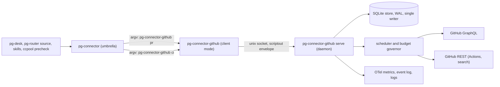

# pg-connector-github: a stateful, daemon-backed GitHub connector — design

- **Date**: 2026-10-09 (revision 7: 2026-10-10)
- **Status**: DRAFT for operator review. Nothing here is implemented; no implementation bead is filed.
  Revisions 2 and 3 fold in three independent reviews (correctness; completeness and test coverage; UX,
  observability and standards) and verification passes over revisions 2 and 3. Revision 5 folds in the
  operator's answers of 2026-10-10 (rulings 11 to 14); revision 6 folds in a correctness review and a UX,
  observability, test-coverage and standards review of revision 5; revision 7 records rulings 15 and 16
  (registration confirmed, budget relaxed).
- **Bead**: origin `pg2-zhuiu` (handoff: live vs shadow change detection and what shadow-compare phase A
  measured). A design bead is to be filed once the operator approves the direction.
- **Deciders**: Phillip (operator).
- **Supersedes (in force since 2026-10-10, approved by the operator under program epic `pg2-z5fax`)**:
  Direction 2 and the open question "Where the refresh cache lives" of
  `2026-10-05-pg-desk-attention-evaluator-and-connector-refresh-cache-design.md`; for the `pr` and `ci`
  types, the pg-desk-owned change flow of ADR 0077 (rows S29 to S31) and the Phase 10 cutover plan
  (`pg2-2j5ac.52.22`). See "Lifted rulings" and "Work this makes obsolete".

The key words MUST, MUST NOT, REQUIRED, SHALL, SHALL NOT, SHOULD, SHOULD NOT, RECOMMENDED, MAY and
OPTIONAL in this document are to be interpreted as described in RFC 2119.

## Decision summary

One new backend binary, `pg-connector-github`, replaces `pg-connector-pr-github` and
`pg-connector-ci-github-actions`. Its work is done by a long-running daemon that owns a persistent store,
keeps the data callers will ask for fresh within a GraphQL and REST budget, and decides by itself what
changed. Callers keep their commands; the answers become local reads.

| Topic              | Decision                                                                                                                                                                                         |
| ------------------ | ------------------------------------------------------------------------------------------------------------------------------------------------------------------------------------------------ |
| Statefulness       | A connector MAY be stateful and MAY run a daemon. This lifts a RESTRICTION; it is not a new requirement. Every other connector stays as it is.                                                   |
| Placement          | The cache, the refresh policy and the change log live in the BACKEND, not the umbrella. A shared Go library MAY carry the generic parts.                                                         |
| Process model      | One daemon per upstream rate-limit domain (here: one GitHub token on one host). It is the store's only writer. The backend binary in client mode forwards each request to it over a unix socket. |
| Daemon unreachable | The client answers `unavailable`. It does not read the store and does not call GitHub.                                                                                                           |
| Caches             | A QUERY cache (query to an ordered id list, ids only) and an ENTITY cache (id to the full object, held as field groups), each with its own staleness settings.                                   |
| Refresh engine     | A field-group scheduler: one priority queue of (entity, group) tasks, batched summary refresh through `nodes(ids:)` with opportunistic fill, fingerprint revalidation, a budget governor.        |
| Persistence        | The store survives restarts. Data still inside its freshness window is served after a restart with no origin call.                                                                               |
| Change detection   | Owned by the connector. Consumers poll `changes` and acknowledge explicitly. No listing diff, sweep or PR hydration in pg-router or pg-desk for these types.                                     |
| Change log content | Per change: kinds, the changed fields with BEFORE and AFTER values, the origin, the time.                                                                                                        |
| CI changes         | In scope (ruling 13). A CI change is a change of the PR: it reaches the PR feed as `ci_changed`, with the data already refreshed, and `ci changes` offers the same rows in CI shape.             |
| Platforms          | The application is platform-neutral and does all the work (ruling 12). Supervision is a thin per-platform wrapper: launchd now; Linux supervision is deferred to `pg2-opk5g`.                    |
| `--fresh`          | Kept. Polling paths SHOULD NOT use it; a caller reading back its own out-of-band write uses it or the `refresh` op (see "Out-of-band writes by callers").                                        |
| Registration       | The registry's `{name, command}` argv form (ruling 15), keeping the old instance names (see "Registration").                                                                                     |
| Budget             | A hard cap per bucket, split 0.9 to background work, since almost all spend moves there (ruling 16). The daemon's cap replaces the live flow's spend; it does not add to it.                     |

### Operator rulings recorded by this design

All from the interactive design session of 2026-10-09 (Phillip, origin bead `pg2-zhuiu`), quoted where
the wording matters:

1. Placement and generality: "no umbrella for this, but there could be shared library to help"; "this
   change is not a requirement for all connector implementations, they can remain being no cache or
   stateless and no daemon. i'm just lifting that previous restriction that they couldn't. my motivation
   is that to be optimal, only the connector itself understands what to do."
2. Daemon: "i think we need it to run as a daemon. that will ensure only one writer to the cache, the
   peridocaly lookups can run when they need to. the CLI/command, will talk to the daemon."
3. Persistence: "if a daemon were to restart, any data which remains less than the cache time should be
   used. ie, not pure memory. i don't want restarts to cauche spikes in point usage."
4. Change ownership: "no change and sweep will be needed, the connector will own all of that. the rest of
   the tools will just ask for changes periodically. pg-desk shouldn't need to do any hydrating for PR
   data"; "--fresh will not be used normally, even by pg-desk, it will rely that the connector is doing
   its job correctly."
5. Batch fill: "if it costs the same for any count <= 74, then we can considier pulling in theings almost
   stale if there is room left in the query response size."
6. Revalidation: "if the quick queries don't indicate that things have changed, we don't need to do a full
   pull, we can just bump the stale."
7. Refresh engine: approach A (field-group scheduler with batching) accepted.
8. One backend: "i think one daemon and one backend: pg-connector-github. it woudl impelment and be
   registered fro both ci and pr" (superseding an earlier answer of two daemons).
9. Daemon down: fail `unavailable` (chosen over a read-only store fallback and over a direct fetch).
10. Change log: field-level before and after (chosen over kinds only and over full snapshots).

From the operator's answers to revision 4's open questions (Phillip, 2026-10-10, same origin bead):

11. pg-pr plugin docs: "pg-pr docs can be updated." This is a scoped exception to the pg-pr freeze (repo
    `CLAUDE.md`, "pg-pr / pg-router Development Rules") for the documentation changes this design
    requires; it permits no new pg-pr behavior.
12. Linux: "the should work on linux, but the daemon management is a wrapper over the running code, so it
    can be deferred fro right now. there is already planned open work to make linux work, but that cant'
    be done on the current machine, so ensure the app does all of the work and the osx daemon
    wrapper/config is minimmal." The planned work is `pg2-opk5g`.
13. CI changes: "ci changes is needed for the proper PR cateogrization. depending on the state of CI, the
    PR may not be considerered reviewable or not."
14. Cutover criteria: "the specified cutover criteria is good to document, but i could overwrite it if i
    see that it is working even with some issues."

From the operator's answers to revision 6 (Phillip, 2026-10-10, same origin bead):

15. Registration: "there is some related work (check on it) where the "command" was never supposed to be
    a single word, so if additional arguments are neeeded to be passed it, that is ok. a list of args are
    fine". The related work is `pg2-91y12` (registry entries accept `{name, command}`) and `pg2-ik9ew`
    (`previous_names`).
16. Budget: "lets not be so focused on the background work token limits of before, with th new proposed
    plan, almost all of the queries are shifting to background, so the limit woudl be relaxed some what."

### Choices made by this design, not by the operator

Each is the design's own call, open to the operator's correction: the keep-alive rule ("Keep-alive,
revalidation and expiry"); explicit acknowledgement of the change feed and its cursor key ("Change
feed"); the field-group split and every default value ("Field groups", "Defaults"); the posted-review
sidecar staying file-based until cleanup ("Writes"); client-local `capabilities` ("Client mode
contract"); the socket frame ("Socket protocol"); the no-change-on-first-sighting baseline ("Query
read"); the hard cap with `background_share` ("Scheduling and batch fill"); the daemon as the only source of upstream
kinds ("Change kinds"); the protocol compatibility window ("Upgrade and version skew"); the metric
catalogue and alert thresholds ("Observability"); the settle rule that refreshes dependent groups
before a change row is appended ("Settle"); delivering CI changes on the PR feed and the shape of
`ci changes` ("CI changes"); the supervisor seam and the `supervisor` option ("Platforms").

## Why: what the two earlier approaches measured

Sources: `docs/behavior/pg-desk/shadow-compare.md` and the phase A run 2 report (bead `pg2-nu7h0`, run
2026-10-09 14:46Z to 20:56Z), as summarised in the origin bead.

- **Live flow.** pg-router polls listings (`pr-mine` every 60 s, `pr-team` every 120 s) and runs a sweep
  (`pr-sweep` every 30 min over PRs updated in the last 40 min, `pr-sweep-full` every 6 h); the desk-pr
  lane runs `pg-desk run pr <id>` one PR at a time. Dispatches waited 11 to 45 minutes behind their
  enqueue (`pg2-xg2k8`); a `pr show` takes 15 to 30 seconds (`shadow-compare.md`, "Observed behavior of
  the live path").
- **Shadow flow.** `pg-desk pr changes` lists and hydrates in one tick, serially. A tick with no
  hydrations took 36 to 52 s, and ticks that hydrated averaged about 18.7 s per hydration including the
  listing. 73 of 81 measured ticks overran the 60 s slot; uptime was 15.9%; the run ended on its 1,500
  points per hour kill criterion. 329 of the 364 shadow-only detections were `mergeability_changed`, and
  166 of the 364 changed no projection field.

The causes the two share, and that this design removes:

1. **Every hydration goes to origin.** pg-desk passes `--fresh` on `pr show` (required by `INV-CACHE-8`),
   and `pr files`, `pr commits`, `pr review pending` and `ci list` bypass the umbrella cache. A hydration
   is about 8 subprocess reads and 12 to 15 sequential `gh` calls, roughly 12 points
   (`shadow-compare.md`, "Budget guard").
2. **Detection and the data that detected it live in different processes.** The listing sees a change;
   a second process re-reads everything to learn what it was.
3. **No batching, coalescing or concurrency** in the per-PR path.
4. **A noisy signal**: `mergeable` passing through `UNKNOWN` is counted as a change.
5. **No runtime budget**: the 4,000 points per hour ceiling (ADR 0077, row S35) is a design-time
   guardrail. Its worst-hour figure of 2,505 points is DERIVED (`1,713 + 11 x 1 x 72`), not measured.

The central idea: when the component that refreshes an entity is also the one that decides it changed,
the snapshot it diffed IS the data the consumer reads next. The consumer's read is a local hit and
`--fresh` is no longer needed.

## Architecture



The daemon is an Active Object that owns a persistent read-through cache; refresh-ahead is driven by a
priority-queue scheduler; the change log with per-consumer cursors is a polled Observer feed; the client
mode is a Proxy; each field group is a Strategy.

### One binary, two modes

- `pg-connector-github serve` is the daemon. It is a foreground process that does all of its own
  housekeeping (see "Platforms"); a supervisor only starts it and restarts it when it exits. On darwin
  the supervisor is a launchd user agent with KeepAlive, registered through the HM-scoped pattern
  (`phillipgreenii.programs.launchdServices.userAgents.<name>`, `phillipgreenii-nix-personal` ADR 0055),
  label `com.phillipg.pg-connector-github-daemon`.
- `pg-connector-github pr` and `pg-connector-github ci` are client mode (see "Client mode contract").
- The umbrella keeps executing the backend once per call (`pkg/scriptout/exec.go`). The wire envelope
  does not change; the result shapes gain documented fields (see "Consumer changes at cutover").

### Platforms

The repository targets macOS and Linux, and the home-manager module installs the backends on every
platform (`home/programs/pg-connector/default.nix`). Ruling 12 splits the daemon into two layers:

- **The application** (`pg-connector-github serve`) MUST run unchanged on darwin and Linux and MUST do
  everything except restart itself: create the state directory with its modes, take the
  single-instance lock, remove a stale socket, open and migrate the store, rotate its own event log and
  structured log, emit telemetry, and drain on `SIGTERM` (stop accepting connections, finish in-flight
  writes, append every pending settle row, checkpoint the WAL, release the lock).
- **Configuration does not come from the environment.** Everything the daemon and the client need (the
  GitHub host, the `gh` path, the state directory, the socket path, queries and settings) MUST be in the
  rendered config file named by `--config`. The `PG_CONNECTOR_GITHUB_*` variables of "Daemon
  environment and socket" are overrides for tests and the shadow harness only. So `serve` started by
  hand, under `env -i` with working directory `/`, behaves exactly as it does under launchd.
- **The supervisor wrapper** is per platform and MUST stay minimal: start
  `pg-connector-github --config <path> serve` at login and restart it when it exits. On darwin that is
  one HM launchd user-agent entry (KeepAlive, RunAtLoad, the default `manageLogs`), with no logic of its
  own. On Linux it does not exist yet: the `systemd` equivalent of the launchd registration helper is
  planned work, `pg2-opk5g` (`service-daemon-checklist`, "Does it need to run on Linux too?"), which
  cannot be built or verified on the operator's current machine.

Platform-specific code inside the binary MUST sit behind one small seam, a Strategy chosen by Go build
tag (`_darwin.go` and `_linux.go` files), with one implementation per platform:

| Concern                       | darwin                                                      | Linux                                                                                         |
| ----------------------------- | ----------------------------------------------------------- | --------------------------------------------------------------------------------------------- |
| Peer credentials              | `LOCAL_PEERCRED` (`getpeereid`)                             | `SO_PEERCRED`                                                                                 |
| Socket path limit             | 104 bytes                                                   | 108 bytes                                                                                     |
| Supervisor probe              | `launchctl print gui/<uid>/<label>`, uid from `os.Getuid()` | reports `none` until `pg2-opk5g`                                                              |
| Restart hint in `unavailable` | `launchctl kickstart -k gui/<uid>/<label>`                  | "no supervisor on this host (`pg2-opk5g`); start it in the background" plus the command below |

The Linux hint's command is `nohup pg-connector-github --config <path> serve >/dev/null 2>&1 &`. It
MUST NOT be a bare foreground command: an agent that ran it from an `unavailable` answer would block its
shell.

Home-manager options under `phillipgreenii.programs.pg-connector.github`:

| Option              | Default                               | Effect                                                                                                                         |
| ------------------- | ------------------------------------- | ------------------------------------------------------------------------------------------------------------------------------ |
| `enable`            | false                                 | Installs the binary, renders the daemon config, registers the supervisor entry, and rewrites the registry (see "Registration") |
| `supervisor`        | `launchd` on darwin, `none` elsewhere | `launchd` adds the HM launchd entry; `none` registers no service, and the operator MAY run `serve` by hand                     |
| `allowUnsupervised` | false                                 | With `supervisor = "none"`, permits the registry rewrite anyway                                                                |

- The registry is rewritten only when `enable && (supervisor != "none" || allowUnsupervised)`. With
  `enable`, `supervisor = "none"` and no `allowUnsupervised`, the module installs the binary and config,
  keeps the old backends registered, and emits an evaluation warning saying why. So a shared
  home-manager config that sets `enable = true` cannot turn a Linux host into a client with no daemon.
- `supervisor = "launchd"` on a non-darwin host MUST fail evaluation with an assertion. The launchd
  entry MUST be gated with `lib.optionalAttrs pkgs.stdenv.hostPlatform.isDarwin`, not `mkIf` (repo
  `CLAUDE.md`, "HM-scoped launchd agents (pa-monitor)").
- The old stateless backends therefore stay registered on Linux hosts until `pg2-opk5g` lands, and
  "Cleanup" MUST NOT remove them while any host still registers them.
- With `supervisor = "none"` an apply does not restart a daemon started by hand. It keeps running the old
  build until the operator restarts it, and `status` reports the build difference; inside the N and N-1
  window of "Upgrade and version skew" that is harmless, outside it clients answer `version_mismatch`.

### Registration

The wire request carries no entity type (`pkg/scriptout/envelope.go`, `Request`), and the ops that `pr`
and `ci` both answer (`capabilities`, `auth_status`) would be ambiguous for one binary registered plainly
under both types. The registry supports an instance form `{name, command}` whose command is an argv list,
and one binary MAY be registered under several names (`cmd/pg-connector/registry_backend.go`, file
comment). This design uses it:

```yaml
connector:
  pr:
    - name: pg-connector-pr-github
      command: [pg-connector-github, --config, <rendered config path>, pr]
  ci:
    - name: pg-connector-ci-github-actions
      command: [pg-connector-github, --config, <rendered config path>, ci]
search:
  sources:
    - name: pg-connector-pr-github
      command: [pg-connector-github, --config, <rendered config path>, pr]
activity:
  sources:
    - name: pg-connector-pr-github
      command: [pg-connector-github, --config, <rendered config path>, pr]
```

The client reads the socket path from the same rendered config the daemon reads, so the two cannot
disagree about it (for example a shell's `XDG_STATE_HOME` against launchd's).

The registry rejects one name registered with two different commands (`registry_backend.go`,
`buildCommands`), so EVERY registration of an instance name MUST carry the same argv: `connector.pr`,
`search.sources`, `activity.sources`, and `attention.sources` if it is re-added. Keeping the old
instance NAMES keeps `--backend` pins, `sources[]` rows, ledger keys and `backends.<name>` blocks valid.

No single declaration exists today: the deployment lists the names in three separate registry lists.
The home-manager module MUST therefore rewrite every occurrence of the two old instance names in the
rendered registry into the argv form above from one place, so the lists cannot diverge. The rewrite is
governed by `phillipgreenii.programs.pg-connector.github.enable` and the supervisor rule of "Platforms".
Cutover and rollback are a deployment-repo edit of `enable` plus an apply, not a runtime toggle.

Ruling 15 confirms the argv form: the registry's `command` was built as an argument list from the start
(bead `pg2-91y12`, `INV-REG-4` in `packages/pg-connector/docs/behavior/invariants.md`), so extra
arguments such as `--config <path>` are expected use. The home-manager module already accepts string or
`{name, command}` in every registration option. The options that were weighed:

| Option                                    | What changes                                                                                                                                              | Cost                                                                                                                                                       |
| ----------------------------------------- | --------------------------------------------------------------------------------------------------------------------------------------------------------- | ---------------------------------------------------------------------------------------------------------------------------------------------------------- |
| A: argv form, old names (chosen)          | The registry's command for each old name                                                                                                                  | An instance name no longer names a binary: after cleanup, `pg-connector-pr-github` is a label for "the daemon's pr side". `status` MUST print the mapping. |
| B: argv form, new names                   | Every `--backend` pin, `backends.<name>` block, `sources[]` row, umbrella ledger key, pg-desk freshness row and deployment query naming the two old names | A rename across two repositories; freshness rows under the old names become ghosts until `INV-FRESH-6` drops them                                          |
| C: an entity `type` on the wire `Request` | `pkg/scriptout/envelope.go` and every backend's dispatch                                                                                                  | An envelope change for all connectors to serve one, against ruling 1's "this change is not a requirement for all connector implementations"                |

A is chosen. It can be followed by B later, as a pure rename, once the old binaries are gone: a
`{name, command}` entry may declare `previous_names` (bead `pg2-ik9ew`), which adopts the old name's
umbrella ledger so a rename does not re-emit every entity as `added`.

### Op coverage

Every op the two old backends answer, and the new ones. Sources: `pkg/provider/pr/dispatch.go`,
`pkg/provider/ci/dispatch.go`, `cmd/pg-connector-pr-github/main.go`.

| Instance | Op                      | Served from                                   | Budget bucket          | Groups read                         | Invalidates      |
| -------- | ----------------------- | --------------------------------------------- | ---------------------- | ----------------------------------- | ---------------- |
| pr       | `show`                  | Store, read-through                           | GraphQL                | `summary`, `detail`, `conversation` |                  |
| pr       | `list`                  | Query cache plus store                        | GraphQL                | `summary`                           |                  |
| pr       | `files`                 | Store, read-through                           | GraphQL                | `files`                             |                  |
| pr       | `commits`               | Store, read-through                           | GraphQL                | `commits`                           |                  |
| pr       | `review_pending`        | Store, read-through                           | GraphQL                | `pending`                           |                  |
| pr       | `review_submit` (write) | Origin, through the daemon                    | GraphQL, write class   | Origin reads for its preconditions  | `pending`        |
| pr       | `search`                | Metered pass-through, not cached              | REST search or GraphQL |                                     |                  |
| pr       | `list_activity`         | Metered pass-through, not cached              | GraphQL                |                                     |                  |
| ci       | `list_runs`             | Store, read-through                           | REST                   | `runs`                              |                  |
| ci       | `get_logs`              | Metered pass-through, not cached              | REST                   |                                     |                  |
| ci       | `rerun_failed` (write)  | Origin, through the daemon                    | REST, write class      |                                     | `runs`           |
| both     | `capabilities`          | Client, statically, without the daemon        | none                   |                                     |                  |
| both     | `auth_status`           | Daemon; `unavailable` when it is down         | none (cached identity) |                                     |                  |
| pr       | `changes` (new)         | Change log                                    | none                   |                                     |                  |
| pr       | `changes_ack` (new)     | Change log                                    | none                   |                                     |                  |
| ci       | `changes` (new)         | Change log, CI view (see "CI changes")        | none                   |                                     |                  |
| ci       | `changes_ack` (new)     | Change log                                    | none                   |                                     |                  |
| both     | `status` (new)          | Daemon; degraded local report when it is down | none                   |                                     |                  |
| both     | `explain` (new)         | Store                                         | none                   |                                     |                  |
| both     | `refresh` (new)         | Queues interactive refresh, returns at once   | per the queued groups  |                                     | the named groups |

"Metered pass-through" means the daemon performs the call itself, so the governor sees and limits its
spend, but stores nothing.

### Client mode contract

- Client mode reads one scriptout request on stdin and writes one response on stdout. It MUST NOT open
  the store and MUST NOT call GitHub.
- It MUST answer `capabilities` (including `cache_opt_out` and `owns_changes`, see "Consumer changes at
  cutover") from compiled-in values without contacting the daemon. Reason: the umbrella's
  `cacheEnabled` FAILS OPEN when `capabilities` fails (`cmd/pg-connector/cache.go`, `cacheEnabled`), so a
  forwarded `capabilities` call to a down daemon would silently re-enable the umbrella cache and the
  ledger diff and hide the outage that ruling 9 requires to be visible.
- It forwards every other op with the request's own deadline (the backend deadline of
  `pkg/scriptout/limits.go` less a margin), so the daemon never assumes one.
- Connect timeout: 2 s. On a refused connection it retries with backoff until half the deadline has
  passed, which covers a supervisor restart; then it answers `unavailable` naming the socket path and the
  platform's restart hint (see "Platforms"; on darwin the label
  `com.phillipg.pg-connector-github-daemon` and
  `launchctl kickstart -k gui/$UID/com.phillipg.pg-connector-github-daemon`).
- It answers `version_mismatch` only when the daemon's protocol version is outside the supported range
  (see "Upgrade and version skew").

### Socket protocol

The scriptout `Request` (`pkg/scriptout/envelope.go`) carries no deadline, instance or client version, so
the socket wraps it. One newline-delimited JSON frame each way per connection:

- Client to daemon: `{socket_protocol, client_build, instance, deadline_ms, request}`, where `instance` is
  `pr` or `ci` and `request` is the unmodified scriptout `Request`.
- Daemon to client: `{socket_protocol, daemon_build, response}`, where `response` is the unmodified
  scriptout response the client writes to stdout.

`socket_protocol` is this design's own version and is what the N and N-1 window of "Upgrade and version
skew" applies to. `scriptout.ProtocolVersion`, the umbrella-to-backend envelope version, is unchanged.

### The daemon's parts

| Part            | Responsibility                                                                                                                                                                    |
| --------------- | --------------------------------------------------------------------------------------------------------------------------------------------------------------------------------- |
| Socket server   | Accepts scriptout requests on a unix socket (see "Daemon environment and socket"). Routes by the client's instance (`pr` or `ci`) and the op.                                     |
| Store           | SQLite (`modernc.org/sqlite`, the engine of pg-desk's store), WAL mode, the daemon as its only writer, versioned migrations at startup.                                           |
| Field groups    | One Strategy per group: fetch, batch, freshness and invalidation rules (see "Field groups").                                                                                      |
| Query runner    | Runs configured and ad-hoc queries in the membership-only GraphQL form and stores the ordered id list.                                                                            |
| Scheduler       | One priority queue of (entity, group) refresh tasks, a worker pool, single-flight per (entity, group).                                                                            |
| Batcher         | Packs due `summary` refreshes into `nodes(ids:)` calls of at most 74 ids, filling spare slots with the entities closest to going stale.                                           |
| Budget governor | Three buckets on one token: GraphQL points, REST core requests, REST search requests (30 per minute). Fed by `rateLimit` folded into each GraphQL document and REST rate headers. |
| Classifier      | Derives upstream change kinds from a group's before and after content (see "Change kinds").                                                                                       |
| Change log      | Appends one row per content change; serves `changes` and `changes_ack`.                                                                                                           |
| Write path      | Performs `review_submit` and `rerun_failed` and invalidates the groups they affect (see "Writes").                                                                                |
| Telemetry       | Metrics, traces, event log, structured log, `status` and `explain` (see "Observability").                                                                                         |

The daemon MUST make REST calls through `gh api --include` (or an HTTP client using the `gh` token) so
it can read `X-RateLimit-*` headers; `gh run list` exposes none.

### Shared library

The generic parts (store primitives and migrations, scheduler, batcher interface, governor interface,
change log and cursors, socket server and client, `status` and `explain` scaffolding) SHOULD live in a
shared package, working name `packages/pg-connector/pkg/connectord`. GitHub-specific parts (field groups,
fetchers, classifier, query shapes) stay in the binary. A connector that adopts the library MUST scope its
daemon to one upstream rate-limit domain, not to one connector type. The existing daemon-backed precedent
is `pg-osx-bridge-api`, whose client takes a socket override from `PG_OSX_BRIDGE_API_SOCKET`
(`cmd/pg-connector-calendar-osx-bridge/internal/client.go`); this design follows that shape.

### Daemon environment and socket

- The daemon and the client are configured by the `--config` file (see "Platforms"). Environment
  variables override single values for tests and the shadow harness, and the daemon MUST ignore any
  per-call environment of its clients: `PG_CONNECTOR_GITHUB_SOCKET` (socket path),
  `PG_CONNECTOR_GITHUB_STATE_DIR` (store, event log, log), `PG_CONNECTOR_GITHUB_CONFIG` (config file),
  `PG_CONNECTOR_GITHUB_GH` (the `gh` binary). The client honors `PG_CONNECTOR_GITHUB_SOCKET` and
  `PG_CONNECTOR_GITHUB_CONFIG` too. The shadow harness relies on these to run its own daemon (see
  "Rollout").
- The nix module renders absolute paths into the config: state under `~/.local/state/pg-connector-github/`
  (the `XDG_STATE_HOME` default), socket `sock` inside it. `sun_path` is limited (104 bytes on darwin, 108 on Linux); the
  daemon MUST refuse to start with a longer path and say so.
- The state directory MUST be mode 0700 and the socket 0600. The daemon MUST reject a peer whose uid
  differs from its own (the peer-credential call of "Platforms"). It MUST hold a single-instance lock in
  the state directory, remove a stale socket left by a dead instance, and cap a request at 1 MiB.

### Identity and host

The design assumes ONE GitHub host per daemon (the config's `host`, passed to every `gh` call as
`GH_HOST`); entity ids
carry no host. The daemon resolves the viewer login at start and every 10 minutes. When it changes (for
example `gh auth switch`), the daemon MUST flush every identity-scoped datum (`pending` groups, query
results that use `@me`, the posted-review sidecar view of the acting identity) and record the switch in
its log. Tokens stay with `gh`; the store MUST NOT hold credentials.

## Data model

### Entity identity

- On the wire a PR is addressed as today, `owner/repo#n` (`cmd/pg-connector-pr-github/internal/provider.go`,
  `formatPRID`). Matching is case-insensitive on `owner/repo`; the canonical display form is GitHub's.
- `nodes(ids:)` needs GraphQL node ids, so the store keeps an alias table from node id to `owner/repo#n`.
  A first sighting by `owner/repo#n` is resolved by `repository { pullRequest(number:) }`, batched as
  aliased fields in one document. A repository rename or transfer keeps the node id; the alias is updated
  and a `renamed` field change is logged.
- The change log, the posted-review records and the wire all carry `owner/repo#n`. A CI run group is keyed
  by the PR it was fetched for.

### Field groups

The 1-point batch covers only a listing-sized field set, and nested connections are priced by their
`first:` sizes, so a batched full object would be expensive. An entity is therefore a set of field
groups, each fetched, refreshed and expired on its own terms. Every field of `schema.PR` and of the CI run
schema MUST be assigned to exactly one group; the implementation plan carries that table.

| Kind | Group          | Content                                                                                                                                      | Fetch strategy                                                                                     | Fresh until                                                                                                                                                                                                               |
| ---- | -------------- | -------------------------------------------------------------------------------------------------------------------------------------------- | -------------------------------------------------------------------------------------------------- | ------------------------------------------------------------------------------------------------------------------------------------------------------------------------------------------------------------------------- |
| PR   | `summary`      | The batched search field set (`internal/github/github.go`, `searchBatchedQuery`) plus `headRefName`, `baseRefName`, `baseRefOid`             | `nodes(ids:)`, at most 74 ids per call; the boundary MUST be re-measured with the added fields     | `summary_ttl`                                                                                                                                                                                                             |
| PR   | `detail`       | `mergeStateStatus`, `reviewRequests`, `additions`, `deletions`, `changedFiles`, `merged`                                                     | Per PR or small batches (`mergeStateStatus` in large batches returned HTTP 502/504)                | `detail_ttl`, extended by revalidation, never past `detail_max_age`                                                                                                                                                       |
| PR   | `conversation` | Reviews, review threads with their comments, issue comments (`connections`)                                                                  | Per PR, paged as `pr show` does today (caps as today: 1,000 each)                                  | `conversation_ttl`, extended by revalidation, never past `conversation_max_age`                                                                                                                                           |
| PR   | `files`        | Changed files                                                                                                                                | Per PR, paged (`first: 100`), with today's file cap                                                | Until `headRefOid` or `baseRefOid` changes                                                                                                                                                                                |
| PR   | `commits`      | Commits                                                                                                                                      | Per PR, paged (`first: 100`)                                                                       | Until `headRefOid` or `baseRefOid` changes                                                                                                                                                                                |
| PR   | `pending`      | The acting identity's pending review                                                                                                         | Per PR                                                                                             | `pending_ttl`, or a `review_submit` through the daemon                                                                                                                                                                    |
| CI   | `runs`         | Workflow runs on the PR's branch with today's output (`list_runs`: every run on the branch, jobs only for current-head failures, at most 10) | REST; the branch comes from `summary.headRefName`, so the old second `gh pr view` lookup goes away | `ci_active_ttl` while a run on the CURRENT head is queued or in progress; `ci_failed_ttl` while the current head has a non-passing completed run; otherwise until the head or the rollup changes; never past `ci_max_age` |

Each `files`, `commits` and `runs` row records the `headRefOid` and `baseRefOid` it was fetched for, and
is fresh only while those match the current `summary`. So content fetched for an old head can never be
served, or settle a change (see "Settle"), as content for the new one.

**Job results** are cached by (run id, attempt). A completed attempt's jobs never change, so they are
fetched once and reused on every later `runs` refresh; only a newly completed non-passing attempt costs a
job fetch. When a job fetch fails, the last known jobs for that (run id, attempt) are kept, the group
records `last_error`, and the failure itself is NEVER a content change. Today's backend instead leaves
`Jobs` empty on a failed fetch (`cmd/pg-connector-ci-github-actions/internal/provider.go`, `attachJobs`),
which pg-desk reads as "not provably exempt" for a failed run but as harmless for a cancelled one
(`packages/pg-desk/internal/cirun/cirun.go`); with job results as a change signal, that would flip a PR
between blocked and reviewable on every transient error.

Merged and closed PRs use `terminal_ttl` for every group.

The CI `runs` group belongs to the PR entity for keep-alive, versioning and the change log: a PR in the
keep-alive set has its `runs` refreshed in the background like its other groups, and a `runs` content
change is a change of the PR (see "CI changes"). The reason is that pg-desk decides reviewability from
the runs, not from the rollup alone: `review_exempt_checks` and the team-PR cancelled-run rule match
JOB names and conclusions inside non-passing runs on the head commit (`docs/behavior/pg-desk/interpret.md`,
panel placement), so a change that leaves the rollup at `failure` (a second job failing, job results
arriving for a failed run, a newer cancelled run superseding an older failure) can still move a PR
between blocked and reviewable.

### Mergeability

GitHub recomputes mergeability lazily and normally passes through `UNKNOWN`, so `MERGEABLE` then
`UNKNOWN` then `CONFLICTING` is a real change hidden behind two `UNKNOWN` transitions. The daemon MUST
compare against the last KNOWN value, carried forward: `UNKNOWN` is never a change and never a reason to
refresh by itself; a move from one known value to a different known value is `mergeability_changed`
regardless of any `UNKNOWN` between them. On the wire the daemon returns the carried-forward value, and
`UNKNOWN` only when no known value has been seen FOR THE CURRENT HEAD AND BASE: a `headRefOid` or
`baseRefOid` change clears the carried value, because the old head's mergeability says nothing about the
new one. The umbrella's `--fingerprints` hash
(`cmd/pg-connector/list.go`, `addListFingerprint`) is computed from that returned value, so the rule
applies to it without an umbrella change.

### Tables

| Table            | Columns (sketch)                                                                                                                                   |
| ---------------- | -------------------------------------------------------------------------------------------------------------------------------------------------- |
| `query`          | key (canonical query and args), configured flag, ordered ids, complete flag, `fetched_at`, `fresh_until`, `last_success_at`, `last_error`          |
| `alias`          | node id, `owner/repo#n`, `seen_at`                                                                                                                 |
| `entity`         | kind, id, version, `last_access`, keep-alive flag, `last_known_mergeable`, `tombstoned_at`                                                         |
| `entity_group`   | kind, id, group, content, fingerprint, `fetched_at`, `fresh_until`, `max_age_at`, `last_error`, generation, `fetched_for_head`, `fetched_for_base` |
| `job`            | run id, attempt, jobs (name, status, conclusion), `fetched_at`                                                                                     |
| `pending_change` | kind, id, kinds, fields (name, before, after), awaited groups, `detected_at`, `deadline`                                                           |
| `change_log`     | seq, kind, id, version, kinds, fields (name, before, after), origin, `origin_updated_at`, `at`                                                     |
| `consumer`       | consumer, kind, query, `acked_seq`, `seen_at`                                                                                                      |
| `budget`         | bucket, `at`, remaining, `reset_at`, spent, purpose                                                                                                |

## Data flow

### Entity read

Ops: `show`, `files`, `commits`, `review_pending`, `list_runs`.

1. The daemon records the access (`last_access = now`), which raises the entity's refresh priority and
   keeps it in the keep-alive set.
2. It maps the op to its groups (see "Op coverage").
3. When every needed group is inside `fresh_until`, it answers from the store. No origin call.
4. Otherwise it queues the stale groups at INTERACTIVE priority, fetches them IN PARALLEL, and waits up
   to the client's deadline:
   - Concurrent requests for the same (entity, group) share one fetch (single-flight).
   - A stale `summary` goes out immediately in a `nodes(ids:)` call with spare slots filled; an
     interactive request MUST NOT wait for a batch to fill.
   - A fetch still running at the deadline is NOT cancelled; it completes in the background and is
     stored. The answer at the deadline is the stale content if it is inside `expiry`, otherwise
     `unavailable`.
   - On origin failure the same rule applies.
5. A request with the wire argument `fresh: true` forces step 4 for every needed group. No wire
   argument carries freshness today: `--fresh` exists only on `pr show` and `issue show` and changes
   only the umbrella's own read-through (`cmd/pg-connector/pr.go`). The umbrella MUST add `--fresh` to
   `pr files`, `pr commits`, `pr review pending`, `pr list` and `ci list`, and forward it as
   `fresh: true` to a backend that declares `cache_opt_out` (see "Consumer changes at cutover").

Answer annotations (a documented schema addition, `schemaVersion` bumped, for the ops above):

- `served_from` keeps today's two values, `origin` or `cache` (`INV-CACHE-5`); a stale answer is `cache`
  with `stale: true`, as today.
- `age_seconds` is the age of the OLDEST `fetched_at` among the groups served.
- `groups[]` (new, optional): `{group, fetched_at, fresh_until, max_age_at, last_error}` per group served.

The umbrella today overwrites a live backend answer with `served_from: origin` and `age_seconds: 0`
(`cmd/pg-connector/cache_policy.go`, `annotateServed`). For a backend that declares `cache_opt_out` it MUST
pass the backend's annotations through unchanged (see "Consumer changes at cutover").

### Query read

Op: `list --query Q` (with `--ids-only`, `--fingerprints` and `--since` as today).

A query NAME MUST be configured; an unknown name answers `query_not_recognized` (see "Ownership"). A
query KEY is the name plus its arguments. Arguments that only filter a configured query's result
(`--since`, as `sweep --since 40m` and agents use it, and `--before`; both reach the backend as
`list_since` and `list_before`, `pkg/scriptout/timerange.go`) are applied locally to that query's cached ids by
their summaries' `updatedAt`, so they cost no origin call. Arguments that change what GitHub is asked
make an AD-HOC key, cached under `adhoc_query_ttl`.

1. If Q's id list is inside its `query_ttl`, use it. Otherwise re-run Q in the membership-only GraphQL form
   (measured at 1 point for `first: 50` and `first: 100` by `pg2-cw6b3.1`, recorded in the 2026-10-05
   design's "Measured cost per call shape") and store the ordered id list with a complete flag. This
   replaces today's ids-only path, which used REST `gh search prs` and the 30-per-minute search bucket.
2. Compare old and new membership. `entered_query` is recorded for a new member. `left_query` is recorded
   ONLY from a complete listing (a truncated one, for example past GitHub's 1,000-result search limit,
   records no departure), and only after one entity read confirms it, so "closed or merged" is told apart
   from "filtered out".
3. For each id, a fresh `summary` is used as is; missing or stale ones are fetched in batches of at most
   74 with spare slots filled. The answer is returned once every id has a summary.
4. The answer stays summary-level (`schema.PRListFields`).

Configured queries are re-run by the scheduler at their own cadence. Ad-hoc keys are cached but never
re-run; their ids join the keep-alive set through the access in step 3.

**Baseline.** An entity's FIRST fetch establishes its baseline and appends no change row; a query's FIRST
complete run establishes its membership baseline and appends no `entered_query` rows. Without this rule
a cold store (cutover, a moved-aside store) would log every open PR as new and push them all into desk-pr
at once, the burst `pg2-j0ep2` fixed. Changes that happened while there was no baseline are caught by the
6 h backstop (see "Consumer changes at cutover").

### Keep-alive, revalidation and expiry

- An entity is in the KEEP-ALIVE set while it is a member of a configured query, or was accessed within
  `keepalive_window`.
- An entity in the set has its `summary` refreshed on `summary_ttl` by the batcher. Against the previous
  summary:
  - Unchanged fingerprint: `detail` and `conversation` have `fresh_until` extended (ruling 6), never past
    their `*_max_age`. The hard age exists because the list fingerprint cannot see merge-state status or
    edited comment bodies (ADR 0077, row S31; the thread COUNT has been visible since row S35(a), a thread
    resolution or an edit is not).
  - `headRefOid` changed: queue `files`, `commits` and CI `runs`.
  - `baseRefOid` or `baseRefName` changed: queue `files`, `commits` and `detail`.
  - Comment, review or review-thread counts, or `updatedAt`, changed: queue `conversation`.
  - A known `mergeable` value changed (see "Mergeability"): queue `detail`.
  - CI rollup changed: queue CI `runs`.
- An entity outside the set is not refreshed. Once every group's `fetched_at` is older than `expiry`, the
  entity and its groups are evicted; change-log rows are kept for their own retention.

**Settle.** A per-entity completion barrier (an Aggregator): a `summary` change that queues dependent
groups (the bullets above) MUST NOT append its change row at once. So the row a consumer receives
describes data that is already in the store, and the consumer's reads are local hits (the central idea
of "Why").

- **Pending row.** The detected change is written as a PENDING row, in the same store transaction that
  stores the new summary content, with the awaited groups and a deadline of detection time plus
  `settle_timeout`. A pending row is not visible to `changes`. Because it is durable, a crash, a
  `SIGTERM` or a restart cannot lose it: `SIGTERM` appends every pending row before exit, and on start
  the daemon re-queues the awaited groups of each pending row, or appends it at once if its deadline has
  passed.
- **Which fetch counts.** Only a fetch that STARTED after the detection, and after any later write
  invalidation of that group, satisfies the barrier; a single-flight join onto an older in-flight fetch
  does not. The fetch's recorded head and base must match the summary that was detected (see "Field
  groups").
- **Merging.** While a row is pending for an entity, every further change detected for it (another
  `summary` change, a group refreshed by itself, a write) merges into the pending row instead of
  appending its own: kinds are unioned; per field the earliest `before` and the latest `after` are kept,
  and a field whose `after` equals its `before` again is dropped. Newly queued dependents join the
  barrier; the deadline does not move.
- **Append.** When every awaited group has been refreshed, or the deadline passes, the row is appended:
  the entity's version is bumped once, the row gets its `seq`, and it carries the kinds and fields of the
  summary AND of the dependent groups. Groups not yet refreshed at the deadline (a failed fetch, a
  governor pause) stay stale and stay queued at their own class, so their next read goes through to
  origin, and when their refresh lands later it appends its own row if the content changed. Detection is
  delayed by at most `settle_timeout`, never lost.
- With no pending row, a refresh of a group by itself (a `runs` refresh on `ci_active_ttl`, a hard-age
  re-pull) appends its row at once.

**Baseline per group.** The first fetch of a GROUP for an entity is that group's baseline: it adds no
fields to a pending row and appends no row, even when the entity's other groups already have content.
Without this, the first `runs` fetch for every known PR (after cutover, a store move-aside, or a PR's
first CI read) would log `ci_changed` for every PR at once. pg-desk's own classifier has the same rule
(it needs a usable CI read on both sides, `packages/pg-desk/internal/classify/pr.go`).

### Scheduling and batch fill

Each (entity, group) task carries a due time (`fresh_until`). Priority classes, highest first:

1. Interactive: a caller is waiting.
2. Write-invalidated, `refresh`-requested, and dependent groups a pending change row waits on (see
   "Settle").
3. Due re-runs of configured queries, and overdue members of a configured query.
4. Overdue entities in the keep-alive set, most recently accessed first.
5. Fill: entities due within `fill_horizon`, nearest first, used only to fill spare slots of a batch that
   is already going out. Fill MUST NOT displace a due task.

The cap is HARD for every class: nothing spends past `graphql_points_per_hour` (or the REST caps), and
nothing spends below `rate_reserve_points`. Background classes (3 to 5) MUST stop at
`background_share` of the cap, so the remainder stays available to classes 1 and 2. When the cap is
reached, interactive reads are served stale, or answered `unavailable` naming the cap. The scheduler MUST
age waiting tasks so class 4 is not starved by class 3. The `pending` group is never refreshed in the
background; it is read through only when asked for.

### Writes

The only writes are `review_submit` (create or append to the acting identity's PENDING review; it never
submits, `pkg/provider/pr/iface.go`) and `rerun_failed`.

- **Preconditions read origin.** A write MAY read origin for its own preconditions (the live head that
  `INV-REVHEAD-3` requires, the existing pending comments), outside the cache.
- **Serialization.** Writes to one PR are serialized; writes to different PRs run in parallel. Until the
  cleanup phase the daemon MUST keep the existing posted-review sidecar files and their cross-process
  `flock` at their current path (`cmd/pg-connector-pr-github/internal/posted/sidecar.go`, `lock.go`) as
  the single source of truth, so a rollback to the old binary sees every review posted since cutover and
  the operator can still delete a record by hand. A corrupt sidecar stays a refusal (`ErrCorrupt`). The
  move into the store happens in the cleanup phase, once rollback is no longer possible.
- **Idempotence.** A client that retries after `unavailable` (for example a daemon crash after GitHub
  accepted the write) MUST NOT create duplicates; the existing per-comment fingerprints (`AlreadyPresent`)
  provide this for `review_submit`. `rerun_failed` on runs already re-running is a no-op answer.
- **Invalidation.** After success the daemon marks `pending` stale (for `review_submit`) or `runs` stale
  (for `rerun_failed`) and queues them at class 2. Each group row carries a generation number; a refresh
  that STARTED before the write MUST NOT overwrite content stored after it and MUST NOT log a change from
  it.
- **Budget.** Writes are class 2 (see "Scheduling and batch fill").

### Out-of-band writes by callers

Agents change PRs outside the daemon (`git push`, `gh pr create`) and then read them back
(`claude-marketplace/pg-pr/commands/check-my-pr.md`, `claude-marketplace/integrate-branch/skills/pull-request/SKILL.md`).
Waiting up to one `summary_ttl` would give them stale answers. Such a caller MUST either pass `--fresh` on
its read or run `pg-connector pr refresh <id>` after its own write; polling paths SHOULD NOT use either.
This keeps ruling 4 ("--fresh will not be used normally") while allowing a read-your-own-write.

### Change kinds

The connector emits the UPSTREAM kinds: `reopened`, `closed`, `merged`, `draft_changed`,
`head_changed`, `base_changed`, `ci_changed`, `mergeability_changed`, `review_changed`,
`feedback_changed`, `renamed`, `removed`, `entered_query`, `left_query`. The daemon classifies per
group, from each group's before and after content. There is no `opened` kind: under the baseline rule a
first sighting logs nothing, so a new PR reaches consumers as `entered_query` (`added`) on the query it
joined.

`ci_changed` is emitted when the `summary` rollup state changes, or when the `runs` content changes in
any field pg-desk's interpreter reads: per run its id, attempt, workflow name, head SHA, status and
conclusion, and per gathered job its name, status and conclusion (`ClassifyJob` reads both status and
conclusion). This is pg-desk's own `ci_changed` definition
(`packages/pg-desk/internal/classify/pr.go`) widened by the job results, which that definition predates
and reviewability now depends on. Timestamps and log URLs are not signals.

pg-desk's live path computes NO kinds today. `pg-desk run pr <id>` gathers, compares a facts hash
(`packages/pg-desk/internal/pipeline/pipeline.go`, `factsChanged`) and persists; its input is only the
entity id pg-router passes in argv. `classify.Classify` and the local kinds (`annotation_changed`,
`link_changed`, `work_changed`) have one caller, `RunEntityChange`
(`internal/pipeline/entity_change.go`), which only `internal/changes` and `pg-desk refresh` call. So:

- After cutover the daemon is the ONLY source of upstream kinds for PRs. pg-desk does not need them: the
  feed decides WHETHER a run is triggered, and the run decides what to do from its facts hash.
- Retiring `internal/changes` leaves `pg-desk refresh` as the classifier's only caller. `classify` and the
  local kinds stay as they are for `refresh`; whether to retire them with it is left to the cleanup phase.
- Mergeability noise cannot reach pg-desk's facts hash, because the wire returns the carried-forward value
  (see "Mergeability").

### Change feed

- Every refresh that changes content bumps the ENTITY's version (one version per entity, not per group)
  and appends one `change_log` row: kind, id, version, kinds, each changed field with before and after,
  `origin` (`query`, `refresh`, `write`, `read`), the origin's own `updatedAt` when known, and `at`.
- `changes --consumer C --query Q` returns the rows after C's acknowledged position for Q, filtered to
  Q's members PLUS rows for entities that just left Q, so a consumer sees the departure. `--query` stays
  REQUIRED, as today (`cmd/pg-connector/changes.go`), so an entity a skill merely read is not delivered
  to desk-pr.
- Result shape (`schemaVersion` bumped): today's `{sources[], changes[{change, source, entity}]}`
  (`changes.go`, result types) is kept, and each change gains `seq`, `kinds` and `fields`. `change` maps
  as: `entered_query` gives `added`; `left_query` and `removed` give `removed`; anything else gives
  `changed`. `entity` is the summary-level entity with its `version` and `head_sha` set to the ROW'S OWN
  values (those recorded with the change), not the entity's current ones. The pg-router adapter hashes
  both into its event id (`packages/pg-router-source-pg-connector/cmd/pg-router-source-pg-connector/changes.go`),
  so a redelivered row keeps its event id even after a newer change, and two rows for one PR in one poll
  get two ids.
  Each `sources[]` row gains `next_seq`: the log position SCANNED up to, which can be past the last
  returned row because rows for non-members are skipped. Its existing `version` field carries the
  daemon's per-key position count, so a reader that compares it keeps working.
- **Volume.** `schema.PR` carries no `version` today, so the adapter's event digest
  (`{change, source, entity_id, head_sha, version}`) coalesces content-only changes on one head inside its
  retry window, an accepted trade-off its behavior docs say "the next sweep" catches. With a per-entity
  version, EVERY content change (a comment, a label, a review) becomes its own `pr.changed` event. This is
  intended: a desk-pr run is now a set of local reads, so per-change events are cheap and the sweep is no
  longer needed to catch them. The adapter's behavior docs MUST record the new trade-off, and the shadow
  run MUST measure the event rate.
- **Acknowledgement is explicit.** The rows are NOT acknowledged by being returned. The umbrella forwards
  `changes`, flushes the output, and only then sends `changes_ack {consumer, query, next_seq}` with the
  `next_seq` it received (the same ordering as the umbrella ledger's own step 5 today). A consumer that
  crashes before the flush receives the rows again: at-least-once. A poll that returns no rows still
  acknowledges its `next_seq`, so a quiet query's position keeps moving.
- **Cursor key** is (consumer, kind, query), because `pr-mine` and `pr-team` share the consumer name
  `pg-router` across different queries. Calls for one key are serialized.
- **First poll** of a new key starts at the TAIL of the log, taken after the query's baseline exists (see
  "Query read", Baseline), so neither a new key nor a cold store pushes every open PR into desk-pr at once.
  `--reset` keeps its meaning: replay the current members as `added` and move the key's position to the
  tail, deliberately.
- `--cached` keeps its meaning: answer from the store without running Q, even if Q is stale.
- **Retention.** Rows are kept for `change_log_retention`; a key unseen for `consumer_stale_after` is
  dropped. A key whose position fell outside retention is answered `invalid_argument` whose `message`
  starts with `cursor_expired:` and tells the caller to re-run with `--reset` (`scriptout.Error` has only
  `code` and `message`; no envelope field is added). After a store move-aside (see "Error
  handling") the first poll of every key gets the same answer, rather than silently starting at the tail
  and skipping what changed in between.
- **Size.** For `conversation` changes a field records the changed comment's id with its before and after
  body, each capped at `change_body_cap` bytes plus a hash of the full text; never the whole
  conversation.

### CI changes

Ruling 13 puts CI change delivery in scope, because CI state decides whether a PR is reviewable (see
"Field groups"). Two surfaces, one log:

- **On the PR feed (the categorization path).** A `runs` change is logged as a row of the PR (log kind
  `pr`, the PR's id, a new PR version) with kind `ci_changed` and the run and job fields that changed.
  It is therefore delivered by `pr changes` to `pr-mine` and `pr-team`, pg-router emits `pr.changed`,
  and the desk-pr lane re-runs `pg-desk run pr <id>`, whose `ci list` read is a local hit on the
  refreshed `runs`. No new pg-router source, event type or lane is needed, and one CI event triggers ONE
  desk run, not one per feed.
- **`ci changes` (the CI view).** `ci changes --consumer C --query Q` returns the PR rows for members of
  the PR query `Q` whose kinds include `ci_changed`, `entered_query`, `left_query` or `removed`, so a
  CI-only consumer also learns when a PR joins or leaves `Q`. CI runs have no queries of their own; the
  daemon resolves `Q` on the `ci` instance against the `pr` query settings. `change` maps as for
  `pr changes` (`entered_query` gives `added`; `left_query` and `removed` give `removed`; anything else
  gives `changed`). Each change's `entity` is the PR's CURRENT stored CI state,
  `{pr_id, rollup, runs[]}` with the run shape of `ci list`, with `version` and `head_sha` set to the
  row's own values, the same rule as `pr changes`; the change's `fields` carry the before and after
  values. The log stores no snapshots (ruling 10). It has its own cursor key (C, `ci`, Q), its own
  `changes_ack`, and the same retention, first-poll, `--cached` and `cursor_expired:` rules as
  `pr changes`; `--reset` replays every current member of `Q` as `added` with its current CI state.
  The daemon MUST refuse to create the key (C, `ci`, Q) while the key (C, `pr`, Q) exists, and the
  reverse, with `invalid_argument` naming the existing key: one consumer acting on both feeds would act
  twice on one CI event. At cutover no consumer is wired to it; it exists for a CI-only consumer (for
  example a CI-failure notifier) without making that consumer parse PR rows.

**Detection bound.** A CI change that the rollup shows is seen within one `summary_ttl` plus the settle
time. A change behind an unchanged rollup is seen within `ci_active_ttl` while a current-head run is
active, within `ci_failed_ttl` while the current head has a non-passing run (the case that decides
reviewability), and otherwise within `ci_max_age`. Runs on an older head never make a PR active.

The umbrella has no `ci changes` verb today (`changes` exists for `pr`, `issue`, `calendar` and `thread`;
`cmd/pg-connector/ci.go` has `list`, `logs` and `rerun-failed`), and `changes` has no forward path for
ANY type: `newChangesCmd` works only through the ledger, by calling the backend's `list` op
(`cmd/pg-connector/changes.go`, `changesListFn`). The umbrella therefore gains a forward-only mode in
`newChangesCmd`, used for `pr` and `ci` when the backend declares `owns_changes`, and the `ci changes`
verb on top of it. For a `ci` backend that does not declare `owns_changes` the umbrella itself answers
`invalid_argument` per source, naming the instance and saying it does not own changes; it does not
forward the call (the old CI backend would answer `unknown_op`, `pkg/scriptout/serve.go`).

### Source freshness

pg-desk's freshness view, its `pg_desk_source_age_seconds` metric and the menu bar data-age row read the
umbrella ledger's `refreshed_at` per (backend, query) (`packages/pg-desk/internal/freshness`,
`docs/behavior/pg-desk/freshness.md`). A cache answer MUST NOT advance it (`INV-LEDGER-FRESH-2`). The
daemon therefore records, per configured query, `last_success_at` (a WHOLE-query origin answer) and
`last_error`, and returns them on every forwarded `changes` answer in a `sources_freshness[]` field; the
umbrella keeps stamping the ledger's `refreshed_at` and `last_error` from it, and stamps the consumer's
`last_seen` on every forwarded call, which pg-desk's abandoned-row rule (`INV-FRESH-6`,
`packages/pg-desk/internal/freshness/freshness.go`) reads. Because the ledger keys stay (backend, query),
no row becomes a ghost. `status --json` exposes the same values.

### Restart and cold start

On start the daemon takes its lock, opens the store, applies migrations and serves every group still
inside its `fresh_until` with no origin call (ruling 3). It MUST accept connections before a long
migration and answer `unavailable` with a `migrating:` message meanwhile, so an apply's health check does
not time out. The scheduler rebuilds its queue from stored due times; after a long outage the governor
limits the catch-up rate, so a restart never spends more than the configured budget.

### Upgrade and version skew

- An apply that changes the binary or the config restarts the agent: the launchd registration embeds the
  wrapper's store-path hash (`service-daemon-checklist`, "Does it restart when its binary or config changes?"), and the config file path is part of
  that wrapper.
- During the restart window a new client may meet the old daemon or the reverse. The daemon accepts
  protocol versions N and N-1; only a version outside that range is `version_mismatch`. A build-id
  difference inside the range is reported by `status`, not answered as an error.
- A store whose schema is NEWER than the binary (a downgrade) MUST make the daemon refuse to start with a
  clear log line and alert; it MUST NOT move the store aside, which would cost a full refill and the
  change log.

## Configuration

### Ownership

The daemon runs queries on its own clock, so it reads its own config file (queries, per-query and
per-group settings, budget, workers). This reverses `INV-STATE-1` for this backend. To keep ONE place to
declare queries, the nix module MUST render the daemon config from the same
`phillipgreenii.programs.pg-connector.backends` options that render the umbrella's blocks: the `pr`
settings from `backends.pg-connector-pr-github`, the `ci` settings from
`backends.pg-connector-ci-github-actions`, plus the daemon's own settings under
`phillipgreenii.programs.pg-connector.github`. Both outputs are stamped with the same config hash.

- A request whose `--query` names a query the daemon does not know answers `query_not_recognized`, the
  existing code and its fan-out meaning (`pkg/scriptout/errors.go`, `INV-ERR-3`).
- A request whose attached `backends.<name>` block carries a different config hash answers
  `invalid_argument`, naming both config paths, so a stale registry fails loudly.
- Named queries keep their native syntax (decision D4 is unchanged). The daemon config MUST NOT hardcode
  any user, team or organisation; the deployment supplies them.
- A config change takes effect by restart (see "Upgrade and version skew"); there is no hot reload.

### Defaults

All values are configurable. Each default is a starting point, to be checked by the shadow run.

| Setting                                         | Default                              | Reason                                                                                                                                                                          |
| ----------------------------------------------- | ------------------------------------ | ------------------------------------------------------------------------------------------------------------------------------------------------------------------------------- |
| `query_ttl` for `mine` / `team`                 | 60 s / 120 s                         | The live flow's cadences                                                                                                                                                        |
| `adhoc_query_ttl`                               | 120 s                                |                                                                                                                                                                                 |
| `summary_ttl`                                   | 60 s                                 | One batched call per minute per 74 kept-alive PRs                                                                                                                               |
| `detail_ttl` / `detail_max_age`                 | 10 min / 30 min                      | Extended by revalidation                                                                                                                                                        |
| `conversation_ttl` / `conversation_max_age`     | 10 min / 30 min                      | Today's sweep cadence; the `updatedAt` spike MAY relax the maximum                                                                                                              |
| `pending_ttl`                                   | 2 min                                | The ccpool precheck acts on it; a review deleted in the browser is seen within 2 min                                                                                            |
| `ci_active_ttl` / `ci_max_age`                  | 60 s / 30 min                        |                                                                                                                                                                                 |
| `ci_failed_ttl`                                 | 5 min                                | Bounds detection of job-level changes that decide reviewability (see "CI changes")                                                                                              |
| `terminal_ttl`                                  | 24 h                                 | Merged and closed PRs are effectively frozen                                                                                                                                    |
| `settle_timeout`                                | 30 s                                 | Bounds the delay the settle rule adds to detection                                                                                                                              |
| `keepalive_window`                              | 24 h                                 |                                                                                                                                                                                 |
| `expiry`                                        | 7 d                                  | Matches today's tombstone retention (`cmd/pg-connector/cache_dispatch.go`)                                                                                                      |
| `fill_horizon`                                  | one `summary_ttl`                    | Fill with what would be due within one more cycle                                                                                                                               |
| `change_log_retention` / `consumer_stale_after` | 14 d / 7 d                           | pg-desk's current defaults (`internal/store/cursor.go`)                                                                                                                         |
| `change_body_cap`                               | 4 KiB                                | Bounds the change log for comment-heavy PRs                                                                                                                                     |
| `batch_size` / `workers`                        | 74 / 4                               | 74 is the measured 1-point boundary                                                                                                                                             |
| `rate_reserve_points`                           | 1000                                 | The existing reserve (`cmd/pg-connector-pr-github/internal/provider.go`)                                                                                                        |
| `graphql_points_per_hour`                       | 1,500 in shadow; 4,000 after cutover | Phase A's kill criterion while running beside the live flow; after cutover, the ADR 0077 row S35 ceiling, since the daemon replaces the live flow's spend (see "Expected cost") |
| `background_share`                              | 0.9                                  | Almost all spend is background (ruling 16); a tenth stays for misses, writes and pass-through ops                                                                               |
| `rest_requests_per_hour`                        | 3,000                                | Inside GitHub's documented 5,000 per token, leaving 2,000 for other `gh` users of the token                                                                                     |
| `rest_search_per_minute`                        | 20                                   | Inside GitHub's documented 30 per minute                                                                                                                                        |

### Expected cost

Search strings: 1 for `mine` and 10 for `team`, measured by `pg2-x3h8c.11` (ADR 0077, row S35,
reconciliation note). Membership-only query: 1 point per string per call (`pg2-cw6b3.1`).

**Change-independent floor**, per hour:

- `mine` membership every 60 s: 1 point x 60 calls = 60 points.
- `team` membership every 120 s: 10 points x 30 calls = 300 points.
- `summary` refresh of N kept-alive PRs every 60 s: ceil(N / 74) calls x 1 point x 60 per hour. At
  N = 80 (about the open-PR count in `shadow-compare.md`): 2 x 1 x 60 = 120 points.
- Hard-age re-pulls: every kept-alive PR re-pulls `detail` and `conversation` at least once per
  `*_max_age` even when nothing changed. For N PRs at 30 min: N x 2 groups x 2 per hour = 4N fetches,
  so 4 x 80 = 320 fetches at N = 80. The points per fetch are UNKNOWN; at an illustrative 2 points that
  is 320 x 2 = 640 points, and at 3 points 320 x 3 = 960.

Floor at N = 80 without the hard-age re-pulls: 60 + 300 + 120 = 480 points. With them: 480 + 640 = 1,120
points at 2 points per fetch, and 480 + 960 = 1,440 at 3 points. Not yet counted: `pending` reads (read
through on demand only), PRs kept alive by ad-hoc reads for `keepalive_window`, and interactive spend.

**Where the spend sits** (ruling 16). With this design almost every origin call is background work: the
callers' reads become local hits, so the interactive classes spend only on misses, `--fresh`, `refresh`,
writes and the pass-through ops. The budget is therefore split in favour of background work
(`background_share` 0.9), and the cap is a guardrail against runaway spend, not a target the floor has to
squeeze under:

- **After cutover** the daemon REPLACES the live flow's listing polls, sweeps and per-PR hydrations on the
  same token, so its cap is not on top of today's spend. Default `graphql_points_per_hour` 4,000, the
  existing design ceiling for PR change detection (ADR 0077, row S35), of which 4,000 x 0.9 = 3,600 is
  for background work. Both floors fit with room: 3,600 - 1,120 = 2,480 points spare at 2 points per
  fetch, 3,600 - 1,440 = 2,160 at 3.
- **During the shadow run** the daemon runs ALONGSIDE the live flow, so its spend is extra. Its default
  cap stays phase A's 1,500 points per hour, which the operator MAY raise. At 0.9 that leaves
  1,500 x 0.9 = 1,350 for background work: the 2-point floor fits (1,350 - 1,120 = 230 spare); the
  3-point floor is 1,440 - 1,350 = 90 over. In that case the shadow run either raises its cap to 1,600
  (1,600 x 0.9 = 1,440) or relaxes both `*_max_age` to 2 h, which cuts the re-pulls to N x 2 groups x 0.5
  per hour = N fetches (80 at N = 80, so 160 points at 2 points per fetch and 240 at 3).

The phase 1 spike measures the per-group cost and the `updatedAt` behavior, and the defaults are set from
it; nothing in the design depends on which case it finds.

**Per detected change**: unknown until the spike. **CI** spends REST, not points: one `run list`
request per `runs` refresh, plus one job fetch per NEWLY completed non-passing attempt (job results are
cached by run id and attempt, see "Field groups"). Without that cache, today's backend re-fetches up to
10 job lists on every refresh of a failing head, so one refresh could cost 1 + 10 = 11 requests. An
illustrative hour at N = 80, split into A PRs with an active current-head run, F with a non-passing
current head and nothing running, and the rest idle:

- Active, A = 10, refreshed every 60 s: 10 x 60 = 600 requests.
- Failing, F = 10, refreshed every 5 min (`ci_failed_ttl`): 10 x 12 = 120 requests.
- Idle, 80 - 10 - 10 = 60, refreshed at least every 30 min (`ci_max_age`): at most 60 x 2 = 120
  requests.
- Job fetches, an illustrative 20 newly failed attempts in the hour: 20 requests.
- Total: 600 + 120 + 120 + 20 = 860 requests per hour, against the background share of the
  `rest_requests_per_hour` cap, 3,000 x 0.9 = 2,700.

Worst case, every kept-alive PR active at once (a mass rebase): 80 x 60 = 4,800 requests per hour. The
governor then holds REST background work at 2,700 per hour, so each PR's `runs` refreshes about
2,700 / 80 = 33.75 times per hour (every 60 / 33.75 = 1.8 min) instead of every 60 s, until the burst
drains. `background_share` applies to each bucket's cap, REST as well as GraphQL.

## Error handling

| Failure                                              | Behavior                                                                                                                                                                                       |
| ---------------------------------------------------- | ---------------------------------------------------------------------------------------------------------------------------------------------------------------------------------------------- |
| GitHub 5xx or timeout                                | Retry with backoff (the existing 3 attempts). On final failure the group stays stale with `last_error`. An interactive read gets stale content inside `expiry`, otherwise `unavailable`.       |
| `mergeStateStatus` 502/504 in a batch                | Fall back to per-PR `detail` fetches for that batch.                                                                                                                                           |
| Secondary rate limit (403 or 429 with `Retry-After`) | The governor pauses background classes for the stated time; interactive reads are served stale.                                                                                                |
| Primary limit below `rate_reserve_points`            | Background classes stop. Interactive reads are served stale, or answered `unavailable` naming the reserve. The reserve is never spent.                                                         |
| Auth failure                                         | Fetches answer `unauthenticated`; cached reads are still served with their age; `auth_status` reports the failure.                                                                             |
| Viewer changed                                       | Identity-scoped data is flushed (see "Identity and host").                                                                                                                                     |
| PR deleted or inaccessible                           | Tombstoned and recorded as `removed`.                                                                                                                                                          |
| Daemon crash                                         | The supervisor restarts it (with `none`, the operator does); pending settle rows survive; store writes are transactional; clients retry inside half their deadline, then answer `unavailable`. |
| Migration running                                    | `unavailable` with a `migrating:` message.                                                                                                                                                     |
| Store corrupt or migration fails                     | The store is moved aside with a timestamp, the daemon starts empty with the governor limiting refill, and an alert fires. Moved-aside stores older than `expiry` are deleted.                  |
| Store newer than the binary                          | Refuse to start; alert; never move aside.                                                                                                                                                      |
| Protocol outside N and N-1                           | `version_mismatch`.                                                                                                                                                                            |
| Socket path, permission or peer uid                  | The daemon refuses or rejects with a log line; the client answers `unavailable` naming the socket path.                                                                                        |
| Unknown query / config hash mismatch                 | `query_not_recognized` / `invalid_argument` (see "Ownership").                                                                                                                                 |

Every error MUST use the existing seven-value scriptout taxonomy; no new error code is introduced.

## Observability

Walked against `service-daemon-checklist`, question by question:

- **"Does the process show its own name, not `bash`?"** Registered through `launchdServices` with the
  `script` wrapper; no TCC prompt is needed.
- **"Will its logs be collected by otel?"** A `phillipgreenii.observability.logSources` entry for the
  event log and the structured log (see below), declared in the darwin module.
- **"Do its logs rotate?"** `manageLogs` default for stdout and stderr. The daemon rotates the event log
  and the structured log itself at 5 MiB; the client rotates the client log at 1 MiB under an `flock`
  (see "Event log"). No `logSources` glob may match a rotated archive.
- **"What metrics/alerts does it need?"** Below.
- **"Does it alert when it isn't running?"** The HM bridge's `extraHealthChecks`
  (`phillipgreenii-nix-personal` ADR 0055, "Visibility to other system-scope registries") plus the
  `daemon.up` gauge alert below.
- **"Does it restart when its binary or config changes?"** Automatic through the wrapper hash under
  launchd; with `supervisor = "none"`, by hand (see "Platforms").
- **"Does it need to run on Linux too?"** The application runs there; the supervisor entry is deferred to
  `pg2-opk5g` (see "Platforms"). The log collection, rotation and liveness mechanisms above are
  darwin-only today; on Linux the daemon still writes and rotates its logs and pushes OTel metrics to the
  configured endpoint, if any.

### Event log

The event log moves to `$XDG_STATE_HOME/pg-connector-github/events.jsonl` with Loki `service_name`
`pg-connector-github`. Today each row is one call and carries that call's spend; with a daemon most spend
happens in background work tied to no call. Rows therefore have two kinds:

- `kind=request`: op, instance, `served_from`, `stale`, `wait_ms`, outcome, error code.
- `kind=origin`: purpose (`interactive`, `write`, `query`, `refresh`, `settle`, `fill`, `passthrough`), group,
  batch size, `graphql_cost`, `graphql_remaining`, `rest_requests`, `rest_remaining`, outcome.

The three rules of `packages/pg-connector/grafana/alerting/pr-github-alerts.yaml` MUST be rewritten
against the new selector, the "sustained unavailable" rule counting `kind=request` rows only (background
retries are not caller-visible failures). In the same change: pg-desk-shadow's budget reader and
`CostInWindow` (`packages/pg-desk-shadow/internal/collector/collector.go`) sum `kind=origin` rows;
`TestPath_DefaultMatchesRegisteredLogSourceGlob` and `test-pg-connector-pr-github-darwin-module` move to
the new name. The client appends a `kind=request` row with outcome `daemon_unreachable` to a small
client log (`service_name` `pg-connector-github-client`) so caller-visible outages can be counted. The
CLIENT rotates the client log, because it writes it exactly when the daemon is down: at 1 MiB, under an
`flock` on the log so concurrent clients rotate once. The client log has its own `logSources` entry
whose glob does not match the rotated archive.

### Metrics

OTel, dotted names after the pa-monitor convention (`packages/pa-monitor/README.md`, OpenTelemetry), with
settings from `osConfig.phillipgreenii.observability` read null-safely. Labels MUST NOT carry an entity id
or an ad-hoc query key; `query` is limited to configured queries and `consumer` to configured consumers.

| Metric                                                    | Type           | Labels                            | Answers                                    |
| --------------------------------------------------------- | -------------- | --------------------------------- | ------------------------------------------ |
| `pg_connector_github.daemon.up`                           | gauge          |                                   | Is it running                              |
| `pg_connector_github.budget.spent`                        | counter        | bucket, purpose, group            | What it spends, and on what                |
| `pg_connector_github.budget.remaining`                    | gauge          | bucket                            | Headroom                                   |
| `pg_connector_github.governor.paused`                     | gauge          | bucket, reason                    | Is background work held back               |
| `pg_connector_github.queue.depth`                         | gauge          | class                             | Backlog                                    |
| `pg_connector_github.queue.oldest_overdue_seconds`        | gauge          | class                             | Is it keeping up                           |
| `pg_connector_github.group.staleness_seconds`             | histogram      | group                             | How far past `fresh_until` served data is  |
| `pg_connector_github.request.duration`                    | histogram      | op, `served_from`                 | Caller latency and hit ratio               |
| `pg_connector_github.change.detection_delay_seconds`      | histogram      | kind, origin                      | `at` minus the origin's `updatedAt`        |
| `pg_connector_github.change.settle`                       | counter        | result (settled, failed, timeout) | Does the settle rule hold or time out      |
| `pg_connector_github.change.settle_pending`               | gauge          |                                   | Rows waiting on dependent groups           |
| `pg_connector_github.revalidation`                        | counter        | group, result                     | Extended vs re-pulled vs forced by max age |
| `pg_connector_github.batch.ids`                           | histogram      | role (due, fill)                  | Batch fill                                 |
| `pg_connector_github.query.last_success_age_seconds`      | gauge          | query                             | Is each configured query fresh             |
| `pg_connector_github.consumer.lag_rows`                   | gauge          | consumer, query                   | Is a consumer behind                       |
| `pg_connector_github.consumer.oldest_unacked_age_seconds` | gauge          | consumer, query                   | Is a consumer stuck                        |
| `pg_connector_github.consumer.redeliveries`               | counter        | consumer, query                   | An at-least-once crash loop                |
| `pg_connector_github.store.bytes`, `.store.evictions`     | gauge, counter |                                   | Store growth                               |

**Traces**: one span per request (op, instance, `served_from`, wait), with a child span per origin call
carrying its cost.

### Service levels and alerts

| Objective / alert                     | Threshold                                                                                                                                      |
| ------------------------------------- | ---------------------------------------------------------------------------------------------------------------------------------------------- |
| Daemon up                             | `daemon.up` absent or 0 for 2 min (`noDataState: Alerting`, as `pg-router-liveness-down` in `packages/pg-router/grafana/alerting/alerts.yaml`) |
| Configured queries fresh              | `query.last_success_age_seconds` above 2 x `query_ttl` for 10 min                                                                              |
| Spend within budget                   | `budget.spent` (GraphQL) above `graphql_points_per_hour` over 1 h                                                                              |
| Interactive work keeping up           | `queue.oldest_overdue_seconds{class=interactive}` above 30 s for 5 min                                                                         |
| Consumer stuck                        | `consumer.oldest_unacked_age_seconds` above 15 min                                                                                             |
| Settle holding                        | `change.settle{result!="settled"}` above 20% of all `change.settle` over 30 min (consumers' reads are going back to origin)                    |
| Store moved aside or refused to start | any occurrence                                                                                                                                 |
| Detection delay (shadow criterion)    | p90 no worse than the live flow's                                                                                                              |

The rules MUST have `promtool` rule tests, after the pg-router precedent in `flake.nix`.

### Dashboard and nix placement

- `packages/pg-connector/grafana/pg-connector-github.json`, registered through `dashboardProviders`:
  budget against the cap; spend by purpose and group; queue depth and oldest overdue; freshness per query;
  `served_from` ratio; detection delay; settle results and pending rows; consumer lag.
- `darwin/modules/pg-connector-github/default.nix`: `logSources`, `alertRuleFiles`, `dashboardProviders`
  (system scope).
- The home-manager module: the launchd entry, the rendered daemon config, the registry entries.

### Structured log

`$XDG_STATE_HOME/pg-connector-github/daemon.log.jsonl`: one line per state change (start, migration,
lock, viewer change, budget pause and resume, store move-aside or refusal, consumer `cursor_expired`).

## Caller experience

- **Commands do not change.** `pg-connector pr show <id>`, `pr list --query Q`, `ci list <pr-id>`,
  `ci rerun-failed` work as before; answers gain `groups[]` and keep `served_from`, `stale` and
  `age_seconds`.
- **Faster answers.** A hit is a socket round trip; no `gh` process runs.
- **Clear failures.** A daemon-down answer names the socket, the supervisor and its restart hint (see
  "Platforms").
  The ccpool precheck and every skill that calls `pg-connector pr` or `ci` MUST treat `unavailable` as
  retryable, and their docs MUST say so, including the `claude-marketplace/pg-pr` plugin's (ruling 11).
- **`pg-connector-github status`** answers "is it healthy, how fresh, how much is it spending" in one
  place: version and build id, uptime, store path and size, each budget bucket and any pause with its
  reason and end time, queue depth and the oldest overdue task by class, per-query `last_success_at` and
  `last_error`, auth state and viewer, change-log head `seq`, pending settle rows and settle timeouts in
  the last hour, per-consumer positions, the supervisor, and the instance-name mapping (which registry
  name is served by which instance, see "Registration"). When the daemon is down it MUST still report:
  the supervisor probe's answer (see "Platforms"), socket path, store file size and age, and the log
  paths. Exit codes follow `INV-EXIT-1`: 0 healthy, 2 degraded, 3 down. `--json` gives the same as a
  document. The umbrella surfaces the same health as rows of `pg-connector auth status` and
  `pg-connector config validate`.
- **`pg-connector pr explain <id>`** (and `ci explain`) answers "why is this stale": each group's
  `fetched_at`, `fresh_until`, `max_age_at`, `last_error`, the head and base it was fetched for, queue
  position, any pending settle row (awaited groups and deadline), and the last change rows.
- **`pg-connector pr refresh <id>`** and **`pg-connector pr refresh --query Q`** queue a class 2 refresh
  and return at once.
- **`pg-connector ci changes --consumer C --query Q`** is new (see "CI changes"); a PR's CI state
  changes also arrive on `pr changes` as `ci_changed`, which is what pg-router and pg-desk read.

## Consumer changes at cutover

| Consumer                                                          | Today                                                                                                                                                                               | After                                                                                                                                                                                                                                                                                                 |
| ----------------------------------------------------------------- | ----------------------------------------------------------------------------------------------------------------------------------------------------------------------------------- | ----------------------------------------------------------------------------------------------------------------------------------------------------------------------------------------------------------------------------------------------------------------------------------------------------- |
| Umbrella `changes` for `pr`                                       | Ledger-based diff of repeated `list` calls (`cmd/pg-connector/changes.go`)                                                                                                          | Forwarded when the capabilities declare `owns_changes`; the umbrella flushes, then sends `changes_ack` with `next_seq`; it stamps the ledger's `refreshed_at` and `last_error` from `sources_freshness[]` and the consumer's `last_seen`; it MUST NOT fall back to the ledger diff for such a backend |
| Umbrella cache for `pr` and `ci`                                  | Read-through and stale fallback (`cmd/pg-connector/cache_policy.go`)                                                                                                                | Off through `cache_opt_out`; the backend's `served_from`, `stale`, `age_seconds` and `groups[]` are passed through unchanged                                                                                                                                                                          |
| Umbrella cache and ledger files for the two instances             | `$XDG_STATE_HOME/pg-connector/cache/pr__pg-connector-pr-github.json` and the ledger files                                                                                           | Cleared at cutover and again at rollback, so neither side serves the other's state                                                                                                                                                                                                                    |
| pg-router `pr-mine`, `pr-team` (deployment config)                | `pr changes` with consumer `pg-router` and `--retry-window`                                                                                                                         | Unchanged command line; served by the daemon. GitHub cadence moves to the daemon's `query_ttl`; pg-router keeps its consumer-poll clock (60 s)                                                                                                                                                        |
| pg-router `pr-sweep`                                              | `sweep pr --since 40m mine team` every 30 min, emits `pr.reconcile`                                                                                                                 | Retired: the daemon's revalidation and hard ages do its job                                                                                                                                                                                                                                           |
| pg-router `pr-sweep-full`                                         | Every 6 h, `pg-router-source-pg-connector sweep pr mine team`, emits `pr.reconcile`                                                                                                 | Kept as the 6 h backstop for changes missed without a baseline; its `--ids-only` listing is served from the query cache, so it costs no extra GitHub reads                                                                                                                                            |
| pg-router `desk-reconcile`                                        | Every 30 min (ticked by `pg-desk heartbeat-item`), runs `pg-desk reconcile`: `pr list --query Q --ids-only` (`internal/gather/openids.go`) and `pr show <id> --fresh` per candidate | Kept. Both reads are served by the daemon (its `pr` gather reads lose `--fresh`), so it costs no extra GitHub reads; its closure detection then rests on the daemon's confirming read before `left_query` (see "Query read")                                                                          |
| pg-router-source-pg-connector adapter                             | Decodes `changes[]{change, source, entity}`, event id from `{change, source, entity_id, head_sha, version}`                                                                         | Decodes the added `seq`, `kinds`, `fields`; the event id stays stable because each row carries its own `version` and `head_sha` (see "Change feed")                                                                                                                                                   |
| desk-pr lane (`pg-desk run pr <id>`)                              | About 8 reads to origin per PR                                                                                                                                                      | The same calls without `--fresh`, served locally                                                                                                                                                                                                                                                      |
| pg-desk classifier                                                | Called only by `RunEntityChange` (`internal/changes`, `pg-desk refresh`); the run path uses a facts hash                                                                            | Kept for `pg-desk refresh` only (see "Change kinds"); upstream kinds come from the daemon                                                                                                                                                                                                             |
| pg-desk `head_check` (`pr show --fresh`) and `issue show --fresh` | Fresh reads                                                                                                                                                                         | Kept: the head check is a write precondition (read-your-own-write), and `issue` is another backend                                                                                                                                                                                                    |
| `darwin/modules/pg-connector-pr-github`                           | Log source and alerts for the old backend                                                                                                                                           | Kept installed until cleanup, so a rollback is still observed, then removed                                                                                                                                                                                                                           |
| pg-desk freshness and the menu bar data-age row                   | Reads the umbrella ledger                                                                                                                                                           | Unchanged reader; the ledger is stamped from `sources_freshness[]`                                                                                                                                                                                                                                    |
| pg-desk PR change flow (`internal/changes`, v2 tables, sweep)     | Built, unmigrated in production                                                                                                                                                     | Not used for PRs; retired                                                                                                                                                                                                                                                                             |
| ccpool precheck (`pr review pending`)                             | Direct call                                                                                                                                                                         | Unchanged; served from `pending` (2 min TTL); `unavailable` retryable                                                                                                                                                                                                                                 |
| Skills calling `pg-connector pr` or `ci`                          | Direct calls                                                                                                                                                                        | Unchanged; read-your-own-write per "Out-of-band writes by callers"                                                                                                                                                                                                                                    |
| `claude-marketplace/pg-pr` plugin docs                            | Frozen with pg-pr                                                                                                                                                                   | Docs-only update under ruling 11: `unavailable` is retryable, and `pg-connector pr refresh <id>` is the read-your-own-write path                                                                                                                                                                      |
| pg-desk CI categorization (`ci list` in gather, `interpret`)      | Re-run only when the live listing diff sees a rollup or head change                                                                                                                 | Re-run on every `ci_changed` row, including job-level changes behind an unchanged rollup (see "CI changes"); its `ci list` read is a local hit after the settle rule                                                                                                                                  |
| pg-desk-shadow                                                    | Phase A harness                                                                                                                                                                     | Runs its own daemon as a child (see "Rollout")                                                                                                                                                                                                                                                        |
| `pg-connector-pr-github`, `pg-connector-ci-github-actions`        | Separate binaries                                                                                                                                                                   | Kept installed until cleanup for rollback, then removed                                                                                                                                                                                                                                               |

The umbrella's full change list, none of which is a cache in the umbrella, so ruling 1 holds:

- forward `changes` and `changes_ack` for an `owns_changes` backend, and fail closed (never fall back to
  the ledger diff);
- a new `ci changes` verb through the generic `newChangesCmd`, forward-only (see "CI changes");
- for a `cache_opt_out` backend: pass the backend's annotations through, and skip `commitCacheWrites` and
  `commitCacheTombstones`;
- add `--fresh` to `pr files`, `pr commits`, `pr review pending`, `pr list` and `ci list`, and forward it
  as `fresh: true`;
- stamp the ledger from `sources_freshness[]` and the consumer's `last_seen`;
- new verbs `pr refresh`, `pr explain` and `ci explain`, each a targeted op;
- `config validate` and `auth status` show the daemon's health through the client's `status` op, which
  degrades locally when the daemon is down (`capabilities` alone cannot tell, since the client answers it
  statically).

## Lifted rulings

An ADR, filed as a draft under `docs/adr/` and listed in `docs/adr/index.md` as amending ADR 0062 and ADR
0077, MUST record these lifts before implementation starts. Each is lifted as a RESTRICTION: a connector
MAY now do what it forbade; none is required to. Before filing, the ADR author MUST check ADR 0081 and ADR
0087, which build on pg-desk's change flow.

| Ruling                                                                                           | Source                                                                                           | After                                                                                                               |
| ------------------------------------------------------------------------------------------------ | ------------------------------------------------------------------------------------------------ | ------------------------------------------------------------------------------------------------------------------- |
| D2 in full: pg-router (then pr-pool) is the single scheduler; no connector runs a daemon         | `2026-09-09-pg-desk-and-connector-discovery-design.md`, decision table                           | A connector MAY run one daemon per upstream rate-limit domain, with its own clock for its upstream reads            |
| D3: connectors are stateless                                                                     | same                                                                                             | A connector MAY persist state it owns                                                                               |
| D5: the umbrella decides what changed                                                            | same                                                                                             | A backend that declares `owns_changes` decides for its types                                                        |
| D6: the umbrella owns every cursor                                                               | same                                                                                             | A backend that declares `owns_changes` owns its consumers' cursors; the umbrella forwards and acknowledges          |
| ADR 0062, the uniformity statement ("every Tier-2 backend stays uniformly simple and stateless") | `docs/adr/0062-pg-connector-tier1-tier2-connector-architecture.md`                               | Amended; its item on "a backend's own local store" being the backend's concern is now the governing rule, not drift |
| `INV-STATE-1`: per-call policy only from the request                                             | `packages/pg-connector/docs/behavior/invariants.md`                                              | A daemon-backed backend MAY read policy from its own config, rendered from the same option                          |
| `INV-CACHE-1`, `INV-CACHE-8`                                                                     | same                                                                                             | Scoped to backends that do not own their cache and changes                                                          |
| ADR 0077, rows S29 and S31 (change detection in pg-desk, the remote sweep)                       | `docs/adr/0077-entity-change-flow.md`                                                            | For a backend that owns its changes, detection lives in that backend                                                |
| ADR 0077, row S30 (pg-router owns every clock)                                                   | same                                                                                             | pg-router keeps consumer-poll clocks; upstream read clocks MAY live in a daemon-backed backend                      |
| D12 and the rejected alternative "Per-connector auto-refresh daemons"                            | `2026-09-09-pg-desk-and-connector-discovery-design.md`, decision table and rejected alternatives | Accepted for this connector, scoped per rate-limit domain (the other D12 rejections stand)                          |
| D21: the 30 min sweep period as a configuration default                                          | same, decision table                                                                             | For this backend the sweep period is replaced by `detail_max_age` and `conversation_max_age`                        |
| `ACTOR-BACKEND`: a backend has no human-facing CLI identity                                      | `packages/pg-connector/docs/behavior/actors.md`                                                  | A daemon-backed backend MAY offer `status`                                                                          |

## Behavior docs first

Behavior docs are this system's source of truth (repo `CLAUDE.md`, "pg-pr / pg-router Development
Rules"). Phase 1 MUST edit them, alongside the ADR and before any code:

- `packages/pg-connector/docs/behavior/`: `invariants.md` (`INV-STATE-1`, `INV-CACHE-*`, `INV-WIRE-3`,
  `INV-LEDGER-FRESH-*`), `interfaces.md` (the new ops and result fields), `actors.md`, `glossary.md`
  (statelessness, entity cache, daemon), `journeys.md`.
- `docs/behavior/pg-desk/`: `changes.md`, `consumer.md`, `freshness.md`, `gather.md`, `refresh.md`,
  `shadow-compare.md`.
- `packages/pg-router-source-pg-connector/docs/behavior/README.md`; the pg-router behavior docs on sources
  and clocks; the ccpool precheck invariant `INV-CCH-22`; `pg-pr-retirement.md`.
- The `claude-marketplace/pg-pr` plugin's docs, under ruling 11. These are agent prompts, so the scope is
  fixed here to keep it checkable against the freeze. The files are the ones that call `pg-connector pr`
  or `ci`:
  - `commands/check-my-pr.md`, `commands/checkout-pr.md`;
  - `skills/pg-pr-workflow/SKILL.md`, `skills/pg-pr-process-feedback/SKILL.md`;
  - `lib/pr-generation-shared.md`;
  - `agents/pg-pr-review-code-changes.md`, `agents/pg-pr-review-pr-structure.md`,
    `agents/pg-pr-review-jira-alignment.md`.

  The edits MUST be limited to two things: treating `unavailable` as retryable, and using
  `pg-connector pr refresh <id>` (or `--fresh`) to read back the caller's own `git push` or
  `gh pr create`. Nothing else in the plugin changes.

- `docs/behavior/pg-desk/changes.md` MUST state that a CI change behind an unchanged rollup re-triggers
  categorization (see "CI changes").
- A new behavior-docs set for `pg-connector-github` itself (stories, invariants for freshness, change
  delivery and budget).

## Nix packaging

Places that change:

- The overlay entries for the two old packages and the new one (`flake.nix`, overlay).
- `packages/pg-connector/default.nix` (backend list), `home/programs/pg-connector/default.nix` (backend
  installation, registry rendering, daemon config, launchd entry).
- The pg-router wrapper's PATH (`packages/pg-router/default.nix`).
- `tests/pg-connector-home-render.nix`; `checks.<system>.test-pg-connector-pr-github-darwin-module`; the
  pg-pr drift check `test-pg-connector-pr-github-pg-pr-sync`.
- New: `darwin/modules/pg-connector-github`, the dashboard, the alert rules and their `promtool` tests.

## Rollout


1. **Behavior docs, ADR, spikes.** The docs of "Behavior docs first" and the ADR of "Lifted rulings".
   Spikes, read-only against the operator's token:
   - `nodes(ids:)` with the extended `summary` field set: the points boundary (is it still 74?);
   - points per PR of `detail` and `conversation`, alone and in small batches;
   - whether `updatedAt` moves on a review-thread resolution and on a comment edit;
   - optional: REST `If-None-Match` and `304` behavior through `gh api` (approach C).
2. **Library and daemon skeleton.** Store, socket, client mode, governor, telemetry, `status`, `explain`,
   the query runner and the `summary` group. Passes the wire conformance suite.
3. **Full entity coverage.** `detail`, `conversation`, `files`, `commits`, `pending`, CI `runs`, the
   daemon's classifier, the change feed with acknowledgement and baselines, the write path on the existing
   sidecar, the pass-through ops.
4. **Shadow run.** pg-desk-shadow starts the daemon as its own child, with its own socket, state directory
   and config (`PG_CONNECTOR_GITHUB_*`) and the existing read-only `gh` shim, capped by default at 1,500
   points per hour, which the operator MAY raise (see "Expected cost"). The collector reads the daemon's change feed by calling the client directly (the umbrella
   pass-through is not live yet) and compares it with the live events: feed misses, detection delay,
   sweep-caught events, shadow-only detections, cost, and CI-driven categorization changes (a PR moving
   between blocked and reviewable) seen by each side. The DEFAULT cutover criteria are: zero unexplained
   misses; detection delay p90 no worse than live; GraphQL points per hour inside the cap for the whole
   run; daemon uptime at least 95%. The shadow report MUST state each criterion as met or not met. Under
   ruling 14 the operator MAY cut over with criteria unmet when the run shows the daemon working; the
   cutover bead MUST then record the operator's decision and every unmet criterion, and each unmet
   criterion MUST get its own follow-up bead.
5. **Cutover.** Install the daemon with its post-cutover budget (default 4,000 points per hour, adjusted
   from what the shadow run measured, see "Expected cost"); switch the registry to the argv instances; turn on the umbrella
   pass-through, acknowledgement and opt-out; clear the two instances' umbrella cache and ledger files;
   retire `pr-sweep`; remove `--fresh` from pg-desk gather's `pr` reads (the `issue` reads and
   `head_check` keep it); exercise the pg-router sources live once (repo
   rule: a new or changed query and role MUST be exercised live with a non-trivial outcome). Rollback:
   switch the registry back to the old instances (still installed), clear the umbrella cache and ledger
   files again, restore `pr-sweep`; the posted-review sidecar is untouched, so nothing is lost.
6. **Cleanup.** Move the posted-review sidecar into the store; remove pg-desk's PR change flow, the
   umbrella's `pr` refresher wiring (the refresher stays for `issue`, `cmd/pg-connector/changes_refresher.go`)
   and the old packages. The old packages MUST NOT be removed while any host still registers them (a
   Linux host waits for `pg2-opk5g`, see "Platforms").

## Testing

Seams: a `Clock`; a `Fetcher` per group; the governor's input feed; a counting fetcher that records every
origin call.

- **Scheduler and governor (unit, fake clock)**: priority order; fill never displaces due work and never
  exceeds 74; revalidation extends `fresh_until` and the hard maximum forces a re-pull; keep-alive and
  expiry boundaries (`keepalive_window`, `terminal_ttl`, `expiry`); all three buckets with reserve
  protection and `Retry-After`; single-flight; aging prevents starvation.
- **Load (fake clock, property or soak)**: about 150 kept-alive PRs, 11 query strings, and a burst of head
  changes across many PRs (a mass rebase). Assert spend per bucket stays at or under its cap, interactive
  p99 wait stays bounded, classes 3 and 4 progress, and the governor reacts when another process drains
  the token (falling `rateLimit` readings).
- **Restart (real process)**: fill the store, stop the daemon, start it again, and assert ZERO origin calls
  for every read inside freshness; after simulated long downtime, catch-up spend stays within budget.
  Ruling 3 as a test.
- **Store migrations**: a fixture store per schema version; up-migration; idempotent re-run; downgrade
  refused; corrupt store moved aside with the alert and governed refill; WAL crash recovery; `migrating`
  answer during a slow migration.
- **Mergeability**: `MERGEABLE`, `UNKNOWN`, `CONFLICTING` is one change; `UNKNOWN` alone is none; the
  wire returns the carried-forward value; `--fingerprints` is stable across `UNKNOWN`.
- **CI changes**: with the rollup held at `failure`, each of these yields exactly one `ci_changed` PR row
  carrying the changed run or job fields: a second job failing, job results arriving for a failed run, a
  newer cancelled run superseding an older failure of the same workflow; a timestamp-only or log-URL-only
  change yields none. `ci changes` returns the same rows in CI shape under its own cursor and
  acknowledgement, and filters out rows without `ci_changed`. An end-to-end case: a fixture PR whose only
  failing job is in `review_exempt_checks` gains a non-exempt failure, the PR feed delivers one row, and
  `pg-desk run pr` places the PR as blocked using only local reads (counting fetcher: zero origin calls
  during the run). `ci changes` against a backend without `owns_changes` is `invalid_argument`.
- **Settle**:
  - a rollup change appends no row until `runs` is refreshed, then ONE row carrying both the summary and
    `runs` fields; a head change waits for `files`, `commits` and `runs`; a `mergeable` or `baseRefOid`
    change waits for `detail`;
  - a dependent fetch that fails, or passes `settle_timeout`, still appends the row with the group left
    stale and still queued, and the group's later refresh appends its own row;
  - settle under a governor pause times out, appends, and counts `result=timeout`;
  - a single-flight join onto a fetch that started before the detection does not satisfy the barrier,
    and content fetched for an old head never settles a row for the new head;
  - a second `summary` change while a row is pending merges into it (earliest before, latest after; a
    field changed and changed back is dropped) and the version is bumped once;
  - with no pending row, a group refreshed by itself appends its row at once;
  - a daemon killed with `SIGKILL` while a row is pending appends it after restart; `SIGTERM` appends it
    before exit.
- **Baseline per group**: the first `runs` fetch for PRs whose summaries are already stored logs no
  `ci_changed` (the cutover case); the second fetch with a change does.
- **Job results**: a completed attempt's jobs are fetched once (counting fetcher); a failed job fetch
  keeps the last known jobs, records `last_error` and logs no change; a run on an older head never makes
  a PR active; a job-level change behind an unchanged rollup is detected within `ci_failed_ttl`.
- **CI view**: `ci changes` first poll starts at the tail; `--reset` replays current members as `added`
  in CI shape; `--cached` answers without running `Q`; `cursor_expired:` after retention; departures are
  delivered; creating (C, `ci`, Q) while (C, `pr`, Q) exists, and the reverse, is `invalid_argument`; a
  `rerun_failed` through the daemon leads to an attempt change and a `ci_changed` row with origin
  `write`; the umbrella answers `invalid_argument` itself for a `ci` backend without `owns_changes` and
  does not forward the call.
- **`status` and `explain`**: daemon up (every field listed in "Caller experience", including pending
  settles and the instance-name mapping); daemon down under `launchd` and under `none` (the degraded
  local report with the supervisor probe's answer); exit codes 0, 2 and 3 per `INV-EXIT-1`; `--json`
  matches the text form; `explain` shows a pending settle row and the head each group was fetched for.
- **Log rotation**: the event log and structured log rotate at 5 MiB and the client log at 1 MiB; two
  clients rotating at once rotate once; the registered `logSources` globs do not match the archives.
- **Environment independence**: `pg-connector-github --config <path> serve` started under `env -i` with
  working directory `/` starts, answers a client, and calls the configured `gh` with the configured
  host.
- **Change feed**: at-least-once redelivery when the consumer dies before `changes_ack`; overlapping
  calls for one key are serialized; first poll starts at the tail; `--reset` replays; `cursor_expired`
  after retention; filtered feed delivers departures; a truncated listing records no `left_query`;
  ordering by `seq` across groups of one entity; body cap applied.
- **Writes**: each write invalidates exactly its group; a refresh started before a write neither
  overwrites nor logs; same-PR writes serialize, different PRs run in parallel, lock wait is within the
  deadline; a daemon killed mid-`review_submit` and retried leaves no duplicate comment; `rerun_failed`
  retried after an unknown outcome is safe; the sidecar stays the source of truth and `ErrCorrupt` stays
  a refusal.
- **Behavioral parity (golden)**: given the same `gh` fixtures, the daemon's `show`, `files`, `commits`,
  `list` (`--ids-only`, `--fingerprints`), `review_pending`, `list_runs`, `search` and `list_activity`
  match the old backends' output apart from the added annotations.
- **Wire conformance**: `pkg/scriptout/conformance` through the client against an in-process daemon, for
  both instances.
- **Client, real binary on a short temp socket path**: daemon absent gives `unavailable` (never
  `served_from: cache`) for `pr show` and `pr changes`; `capabilities` answers without the daemon; socket
  permission and peer uid; protocol N-1 accepted and N-2 refused; restart window retried inside the
  deadline; `sun_path` over the platform's limit refused.
- **Umbrella**: `owns_changes` forwarding with flush-then-ack; no ledger fallback; `cache_opt_out` with
  annotations passed through; `sources_freshness[]` stamps the ledger; a deployment-shaped registry with
  the mapping form in `connector.*`, `search.sources` and `activity.sources` loads (Go test plus a
  `tests/pg-connector-home-render.nix` case).
- **pg-router adapter**: decodes the new fields; a redelivered row (same entity version) yields the same
  event id, including under `--retry-window`; two content changes on one head yield two event ids.
- **pg-desk**: gather's `pr` reads without `--fresh`, `issue` reads and `head_check` with it; freshness
  and abandoned-row handling with the new stamping; `pg-desk refresh` still classifies;
  `pg-desk reconcile` detects a closed PR from daemon-served reads.
- **Baselines and positions**: a first fetch logs no change; a query's first complete run logs no
  `entered_query`; a quiet query's `next_seq` advances past other entities' rows and its lag stays zero;
  after a store move-aside every key's first poll is `invalid_argument` with a `cursor_expired:` message;
  a redelivered row keeps its event id after a newer change to the same PR.
- **Query keys**: `--since` is answered from the configured query's cache with no origin call; an unknown
  name is `query_not_recognized`; an ad-hoc key is cached and not re-run.
- **Budget**: no class spends past the cap; background stops at `background_share`; nothing spends below
  the reserve.
- **Socket frame**: both frame shapes, an unknown `socket_protocol`, and a request over 1 MiB.
- **Error table**: one test per row of "Error handling", including auth failure serving cached data with
  its age, `Retry-After` while interactive callers wait, tombstone plus `removed`, and the per-PR fallback
  after a 502/504 batch.
- **Identity and privacy**: a viewer change flushes identity-scoped data; a fixture token string never
  appears in the store, the change log or the event log.
- **Observability**: the alert rules' `promtool` tests; the moved log-source glob test; pg-desk-shadow's
  `CostInWindow` and budget reader against `kind=origin` rows.
- **Platforms**: Linux cannot be built or run on the operator's current machine (ruling 12) and the repo
  has no CI. So:
  - now: the whole module MUST cross-compile for Linux from darwin, with `GOOS=linux go vet ./...` and
    `GOOS=linux go test -c` for every package, as part of the module's Go test gate;
  - the darwin side of the seam (peer credentials, the 104-byte limit, supervisor probe, restart hint)
    has tests that run on darwin; the Linux side's tests live in `_linux_test.go` files, compile in the
    cross-compile step, and are first RUN by `pg2-opk5g`, whose acceptance MUST include them;
  - on every platform, `SIGTERM` drains in-flight writes, appends pending settle rows and releases the
    lock, after which a second `serve` starts cleanly.
- **Nix**: the module renders the daemon config, the registry entries from one declaration, and the
  launchd entry, in the style of `checks.<system>.test-pa-monitor-hm-launchd`; the registry argv carries
  `--config` with the rendered path, identical in every list; `enable = true` with `supervisor = "none"`
  installs the binary and config, registers no service, keeps the old backends and warns; adding
  `allowUnsupervised = true` rewrites the registry; `supervisor = "launchd"` on a non-darwin system fails
  the assertion.
- **Gap analysis**: `pg-go-mutate` over the shared library and the scheduler before the shadow run.
- **Live**: the shadow run; after cutover, the live exercise of the pg-router sources.

Test fixtures MUST stay generic: no real organisation, repository or user names (repo `CLAUDE.md`,
"Public Repository — No ZipRecruiter Disclosure").

## Work this makes obsolete

To re-scope or close AFTER this spec is approved, not before:

- `pg2-2j5ac.52.22` (Phase 10 cutover of pg-desk's own change flow).
- `pg2-dngh6` (shadow-compare phase B: the backfill burst and sweep tiers of that flow).
- `pg2-5rb3t` (the cutover backfill burst).
- `pg2-8f618` (operator confirmation of phase A).
- Direction 2 and the open question "Where the refresh cache lives" of
  `2026-10-05-pg-desk-attention-evaluator-and-connector-refresh-cache-design.md`.
- `pg2-xg2k8` (saturated desk-pr lane) stays open until the cutover shows it drained.

## Alternatives considered

- **B: uniform entity, full hydration when stale.** Simple, but it reproduces the shadow's cost. With the
  roughly 12 points per hydration of `shadow-compare.md`, refreshing an illustrative 26 PRs every 10
  minutes costs 26 x 12 x 6 = 1,872 points per hour.
- **C: approach A plus REST conditional requests.** GitHub documents that a `304 Not Modified` does not
  count against the REST limit, which could make the conversation group nearly free to keep fresh. Its
  behavior through `gh api` is not verified; it is an optional spike that can be added to A later.
- **Cache in the umbrella** (the 2026-10-05 recommendation). Rejected by ruling 1.
- **Two daemons, one per type.** Rejected by ruling 8: one GitHub token means two governors would have to
  coordinate across processes, and CI needs the PR's head and branch.
- **Client fallback when the daemon is down** (read the store, or fetch directly). Rejected by ruling 9: a
  direct fetch silently reverts to unmetered per-call cost; a store read couples every client to the store
  schema and hides an outage behind stale answers.
- **Implicit acknowledgement by the next call.** Rejected in review: a restarted consumer's next call
  would acknowledge the batch it lost, which is at-most-once.

## Open questions

None. Rulings 11 to 16 answer every question raised by revisions 4 and 6. The budget defaults are
starting points, set from the phase 1 spike and the shadow run (see "Expected cost").
