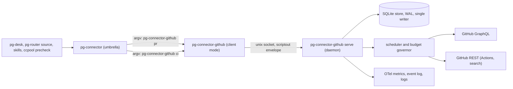
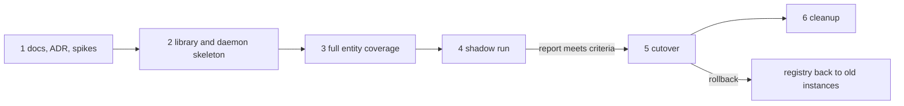

# pg-connector-github: a stateful, daemon-backed GitHub connector — design

- **Date**: 2026-10-09 (revision 2: 2026-10-10)
- **Status**: DRAFT for operator review. Nothing here is implemented; no implementation bead is filed.
  Revision 2 folds in three independent reviews (correctness; completeness and test coverage; UX,
  observability and standards).
- **Bead**: origin `pg2-zhuiu` (handoff: live vs shadow change detection and what shadow-compare phase A
  measured). A design bead is to be filed once the operator approves the direction.
- **Deciders**: Phillip (operator).
- **Supersedes, once approved**: Direction 2 and the open question "Where the refresh cache lives" of
  `2026-10-05-pg-desk-attention-evaluator-and-connector-refresh-cache-design.md`; for the `pr` and `ci`
  types, the pg-desk-owned change flow of ADR 0077 (rows S29 to S31) and the Phase 10 cutover plan
  (`pg2-2j5ac.52.22`). See "Lifted rulings" and "Work this makes obsolete".

The key words MUST, MUST NOT, REQUIRED, SHALL, SHALL NOT, SHOULD, SHOULD NOT, RECOMMENDED, MAY and
OPTIONAL in this document are to be interpreted as described in RFC 2119.

## Decision summary

One new backend binary, `pg-connector-github`, replaces `pg-connector-pr-github` and
`pg-connector-ci-github-actions`. Its work is done by a long-running daemon that owns a persistent store,
keeps the data callers will ask for fresh within a GraphQL and REST budget, and decides by itself what
changed. Callers keep their commands; the answers become local reads.

| Topic              | Decision                                                                                                                                                                                         |
| ------------------ | ------------------------------------------------------------------------------------------------------------------------------------------------------------------------------------------------ |
| Statefulness       | A connector MAY be stateful and MAY run a daemon. This lifts a RESTRICTION; it is not a new requirement. Every other connector stays as it is.                                                   |
| Placement          | The cache, the refresh policy and the change log live in the BACKEND, not the umbrella. A shared Go library MAY carry the generic parts.                                                         |
| Process model      | One daemon per upstream rate-limit domain (here: one GitHub token on one host). It is the store's only writer. The backend binary in client mode forwards each request to it over a unix socket. |
| Daemon unreachable | The client answers `unavailable`. It does not read the store and does not call GitHub.                                                                                                           |
| Caches             | A QUERY cache (query to an ordered id list, ids only) and an ENTITY cache (id to the full object, held as field groups), each with its own staleness settings.                                   |
| Refresh engine     | A field-group scheduler: one priority queue of (entity, group) tasks, batched summary refresh through `nodes(ids:)` with opportunistic fill, fingerprint revalidation, a budget governor.        |
| Persistence        | The store survives restarts. Data still inside its freshness window is served after a restart with no origin call.                                                                               |
| Change detection   | Owned by the connector. Consumers poll `changes` and acknowledge explicitly. No listing diff, sweep or PR hydration in pg-router or pg-desk for these types.                                     |
| Change log content | Per change: kinds, the changed fields with BEFORE and AFTER values, the origin, the time.                                                                                                        |
| `--fresh`          | Kept. Polling paths SHOULD NOT use it; a caller reading back its own out-of-band write uses it or the `refresh` op (see "Out-of-band writes by callers").                                        |
| Registration       | PROVISIONAL (operator did not answer; reversible): the registry's `{name, command}` form, keeping the old instance names (see "Registration").                                                   |

### Operator rulings recorded by this design

All from the interactive design session of 2026-10-09 (Phillip, origin bead `pg2-zhuiu`), quoted where
the wording matters:

1. Placement and generality: "no umbrella for this, but there could be shared library to help"; "this
   change is not a requirement for all connector implementations, they can remain being no cache or
   stateless and no daemon. i'm just lifting that previous restriction that they couldn't. my motivation
   is that to be optimal, only the connector itself understands what to do."
2. Daemon: "i think we need it to run as a daemon. that will ensure only one writer to the cache, the
   peridocaly lookups can run when they need to. the CLI/command, will talk to the daemon."
3. Persistence: "if a daemon were to restart, any data which remains less than the cache time should be
   used. ie, not pure memory. i don't want restarts to cauche spikes in point usage."
4. Change ownership: "no change and sweep will be needed, the connector will own all of that. the rest of
   the tools will just ask for changes periodically. pg-desk shouldn't need to do any hydrating for PR
   data"; "--fresh will not be used normally, even by pg-desk, it will rely that the connector is doing
   its job correctly."
5. Batch fill: "if it costs the same for any count <= 74, then we can considier pulling in theings almost
   stale if there is room left in the query response size."
6. Revalidation: "if the quick queries don't indicate that things have changed, we don't need to do a full
   pull, we can just bump the stale."
7. Refresh engine: approach A (field-group scheduler with batching) accepted.
8. One backend: "i think one daemon and one backend: pg-connector-github. it woudl impelment and be
   registered fro both ci and pr" (superseding an earlier answer of two daemons).
9. Daemon down: fail `unavailable` (chosen over a read-only store fallback and over a direct fetch).
10. Change log: field-level before and after (chosen over kinds only and over full snapshots).

### Choices made by this design, not by the operator

Each is the design's own call, open to the operator's correction: the keep-alive rule ("Keep-alive,
revalidation and expiry"); explicit acknowledgement of the change feed and its cursor key ("Change
feed"); the field-group split and every default value ("Field groups", "Defaults"); the posted-review
sidecar staying file-based until cleanup ("Writes"); client-local `capabilities` ("Client mode
contract"); the protocol compatibility window ("Upgrade and version skew"); the metric catalogue and
alert thresholds ("Observability").

## Why: what the two earlier approaches measured

Sources: `docs/behavior/pg-desk/shadow-compare.md` and the phase A run 2 report (bead `pg2-nu7h0`, run
2026-10-09 14:46Z to 20:56Z), as summarised in the origin bead.

- **Live flow.** pg-router polls listings (`pr-mine` every 60 s, `pr-team` every 120 s) and runs a sweep
  (`pr-sweep` every 30 min over PRs updated in the last 40 min, `pr-sweep-full` every 6 h); the desk-pr
  lane runs `pg-desk run pr <id>` one PR at a time. Dispatches waited 11 to 45 minutes behind their
  enqueue (`pg2-xg2k8`); a `pr show` takes 15 to 30 seconds (`shadow-compare.md`, "Observed behavior of
  the live path").
- **Shadow flow.** `pg-desk pr changes` lists and hydrates in one tick, serially. A tick with no
  hydrations took 36 to 52 s, and ticks that hydrated averaged about 18.7 s per hydration including the
  listing. 73 of 81 measured ticks overran the 60 s slot; uptime was 15.9%; the run ended on its 1,500
  points per hour kill criterion. 329 of the 364 shadow-only detections were `mergeability_changed`, and
  166 of the 364 changed no projection field.

The causes the two share, and that this design removes:

1. **Every hydration goes to origin.** pg-desk passes `--fresh` on `pr show` (required by `INV-CACHE-8`),
   and `pr files`, `pr commits`, `pr review pending` and `ci list` bypass the umbrella cache. A hydration
   is about 8 subprocess reads and 12 to 15 sequential `gh` calls, roughly 12 points
   (`shadow-compare.md`, "Budget guard").
2. **Detection and the data that detected it live in different processes.** The listing sees a change;
   a second process re-reads everything to learn what it was.
3. **No batching, coalescing or concurrency** in the per-PR path.
4. **A noisy signal**: `mergeable` passing through `UNKNOWN` is counted as a change.
5. **No runtime budget**: the 4,000 points per hour ceiling (ADR 0077, row S35) is a design-time
   guardrail. Its worst-hour figure of 2,505 points is DERIVED (`1,713 + 11 x 1 x 72`), not measured.

The central idea: when the component that refreshes an entity is also the one that decides it changed,
the snapshot it diffed IS the data the consumer reads next. The consumer's read is a local hit and
`--fresh` is no longer needed.

## Architecture



The daemon is an Active Object that owns a persistent read-through cache; refresh-ahead is driven by a
priority-queue scheduler; the change log with per-consumer cursors is a polled Observer feed; the client
mode is a Proxy; each field group is a Strategy.

### One binary, two modes

- `pg-connector-github serve` is the daemon. On darwin it MUST run as a launchd user agent with
  KeepAlive, registered through the HM-scoped pattern (`phillipgreenii.programs.launchdServices.userAgents.<name>`,
  `phillipgreenii-nix-personal` ADR 0055), label `com.phillipg.pg-connector-github-daemon`. Linux scope
  is an open question (see "Platforms").
- `pg-connector-github pr` and `pg-connector-github ci` are client mode (see "Client mode contract").
- The umbrella keeps executing the backend once per call (`pkg/scriptout/exec.go`). The wire envelope
  does not change; the result shapes gain documented fields (see "Consumer changes at cutover").

### Platforms

The repository targets macOS and Linux, and the home-manager module installs the backends on every
platform (`home/programs/pg-connector/default.nix`). The launchd registration helper is darwin-only;
`systemd` support for it does not exist (`service-daemon-checklist`, question 7). A Linux host with
fail-closed clients and no daemon would answer `unavailable` for every `pr` and `ci` call. Until the
operator decides (open question "Linux"), the design is darwin-scoped and the nix module MUST refuse to
register `pg-connector-github` on a non-darwin host rather than install a client with no daemon.

### Registration

The wire request carries no entity type (`pkg/scriptout/envelope.go`, `Request`), and the ops that `pr`
and `ci` both answer (`capabilities`, `auth_status`) would be ambiguous for one binary registered plainly
under both types. The registry supports an instance form `{name, command}` whose command is an argv list,
and one binary MAY be registered under several names (`cmd/pg-connector/registry_backend.go`, file
comment). This design uses it:

```yaml
connector:
  pr:
    - name: pg-connector-pr-github
      command: [pg-connector-github, pr]
  ci:
    - name: pg-connector-ci-github-actions
      command: [pg-connector-github, ci]
search:
  sources:
    - name: pg-connector-pr-github
      command: [pg-connector-github, pr]
activity:
  sources:
    - name: pg-connector-pr-github
      command: [pg-connector-github, pr]
```

The registry rejects one name registered with two different commands (`registry_backend.go`,
`buildCommands`), so EVERY registration of an instance name MUST carry the same argv: `connector.pr`,
`search.sources`, `activity.sources`, and `attention.sources` if it is re-added. The nix module MUST
derive all of them from one declaration so they cannot diverge. Keeping the old instance NAMES keeps
`--backend` pins, `sources[]` rows, ledger keys and `backends.<name>` blocks valid.

This choice is PROVISIONAL: the operator was asked and did not answer. The alternatives were new instance
names (renaming every pin and config block) or a `type` field on the wire request (an envelope change).

### Op coverage

Every op the two old backends answer, and the new ones. Sources: `pkg/provider/pr/dispatch.go`,
`pkg/provider/ci/dispatch.go`, `cmd/pg-connector-pr-github/main.go`.

| Instance | Op                      | Served from                                   | Budget bucket          | Groups read                         | Invalidates      |
| -------- | ----------------------- | --------------------------------------------- | ---------------------- | ----------------------------------- | ---------------- |
| pr       | `show`                  | Store, read-through                           | GraphQL                | `summary`, `detail`, `conversation` |                  |
| pr       | `list`                  | Query cache plus store                        | GraphQL                | `summary`                           |                  |
| pr       | `files`                 | Store, read-through                           | GraphQL                | `files`                             |                  |
| pr       | `commits`               | Store, read-through                           | GraphQL                | `commits`                           |                  |
| pr       | `review_pending`        | Store, read-through                           | GraphQL                | `pending`                           |                  |
| pr       | `review_submit` (write) | Origin, through the daemon                    | GraphQL, write class   | Origin reads for its preconditions  | `pending`        |
| pr       | `search`                | Metered pass-through, not cached              | REST search or GraphQL |                                     |                  |
| pr       | `list_activity`         | Metered pass-through, not cached              | GraphQL                |                                     |                  |
| ci       | `list_runs`             | Store, read-through                           | REST                   | `runs`                              |                  |
| ci       | `get_logs`              | Metered pass-through, not cached              | REST                   |                                     |                  |
| ci       | `rerun_failed` (write)  | Origin, through the daemon                    | REST, write class      |                                     | `runs`           |
| both     | `capabilities`          | Client, statically, without the daemon        | none                   |                                     |                  |
| both     | `auth_status`           | Daemon; `unavailable` when it is down         | none (cached identity) |                                     |                  |
| both     | `changes` (new)         | Change log                                    | none                   |                                     |                  |
| both     | `changes_ack` (new)     | Change log                                    | none                   |                                     |                  |
| both     | `status` (new)          | Daemon; degraded local report when it is down | none                   |                                     |                  |
| both     | `explain` (new)         | Store                                         | none                   |                                     |                  |
| both     | `refresh` (new)         | Queues interactive refresh, returns at once   | per the queued groups  |                                     | the named groups |

"Metered pass-through" means the daemon performs the call itself, so the governor sees and limits its
spend, but stores nothing.

### Client mode contract

- Client mode reads one scriptout request on stdin and writes one response on stdout. It MUST NOT open
  the store and MUST NOT call GitHub.
- It MUST answer `capabilities` (including `cache_opt_out` and `owns_changes`, see "Consumer changes at
  cutover") from compiled-in values without contacting the daemon. Reason: the umbrella's
  `cacheEnabled` FAILS OPEN when `capabilities` fails (`cmd/pg-connector/cache.go`, `cacheEnabled`), so a
  forwarded `capabilities` call to a down daemon would silently re-enable the umbrella cache and the
  ledger diff and hide the outage that ruling 9 requires to be visible.
- It forwards every other op with the request's own deadline (the backend deadline of
  `pkg/scriptout/limits.go` less a margin), so the daemon never assumes one.
- Connect timeout: 2 s. On a refused connection it retries with backoff until half the deadline has
  passed, which covers a launchd restart; then it answers `unavailable` naming the daemon label, the
  socket path and the restart command (`launchctl kickstart -k gui/$UID/com.phillipg.pg-connector-github-daemon`).
- It answers `version_mismatch` only when the daemon's protocol version is outside the supported range
  (see "Upgrade and version skew").

### The daemon's parts

| Part            | Responsibility                                                                                                                                                                    |
| --------------- | --------------------------------------------------------------------------------------------------------------------------------------------------------------------------------- |
| Socket server   | Accepts scriptout requests on a unix socket (see "Daemon environment and socket"). Routes by the client's instance (`pr` or `ci`) and the op.                                     |
| Store           | SQLite (`modernc.org/sqlite`, the engine of pg-desk's store), WAL mode, the daemon as its only writer, versioned migrations at startup.                                           |
| Field groups    | One Strategy per group: fetch, batch, freshness and invalidation rules (see "Field groups").                                                                                      |
| Query runner    | Runs configured and ad-hoc queries in the membership-only GraphQL form and stores the ordered id list.                                                                            |
| Scheduler       | One priority queue of (entity, group) refresh tasks, a worker pool, single-flight per (entity, group).                                                                            |
| Batcher         | Packs due `summary` refreshes into `nodes(ids:)` calls of at most 74 ids, filling spare slots with the entities closest to going stale.                                           |
| Budget governor | Three buckets on one token: GraphQL points, REST core requests, REST search requests (30 per minute). Fed by `rateLimit` folded into each GraphQL document and REST rate headers. |
| Classifier      | Derives upstream change kinds from a group's before and after content (see "Change kinds").                                                                                       |
| Change log      | Appends one row per content change; serves `changes` and `changes_ack`.                                                                                                           |
| Write path      | Performs `review_submit` and `rerun_failed` and invalidates the groups they affect (see "Writes").                                                                                |
| Telemetry       | Metrics, traces, event log, structured log, `status` and `explain` (see "Observability").                                                                                         |

The daemon MUST make REST calls through `gh api --include` (or an HTTP client using the `gh` token) so
it can read `X-RateLimit-*` headers; `gh run list` exposes none.

### Shared library

The generic parts (store primitives and migrations, scheduler, batcher interface, governor interface,
change log and cursors, socket server and client, `status` and `explain` scaffolding) SHOULD live in a
shared package, working name `packages/pg-connector/pkg/connectord`. GitHub-specific parts (field groups,
fetchers, classifier, query shapes) stay in the binary. A connector that adopts the library MUST scope its
daemon to one upstream rate-limit domain, not to one connector type. The existing daemon-backed precedent
is `pg-osx-bridge-api`, whose client takes a socket override from `PG_OSX_BRIDGE_API_SOCKET`
(`cmd/pg-connector-calendar-osx-bridge/internal/client.go`); this design follows that shape.

### Daemon environment and socket

- The daemon is configured by flags with environment overrides, and MUST ignore any per-call environment
  of its clients: `PG_CONNECTOR_GITHUB_SOCKET` (socket path), `PG_CONNECTOR_GITHUB_STATE_DIR` (store,
  event log, log), `PG_CONNECTOR_GITHUB_CONFIG` (config file), `PG_CONNECTOR_GITHUB_GH` (the `gh`
  binary). The client honors `PG_CONNECTOR_GITHUB_SOCKET` too. The shadow harness relies on these to run
  its own daemon (see "Rollout").
- Defaults: state under `$XDG_STATE_HOME/pg-connector-github/`, socket `sock` inside it. macOS limits
  `sun_path` to 104 bytes; the daemon MUST refuse to start with a longer path and say so.
- The state directory MUST be mode 0700 and the socket 0600. The daemon MUST reject a peer whose uid
  differs from its own (`getpeereid`). It MUST hold a single-instance lock in the state directory, remove
  a stale socket left by a dead instance, and cap a request at 1 MiB.

### Identity and host

The design assumes ONE GitHub host per daemon (`GH_HOST` pinned in the daemon's environment); entity ids
carry no host. The daemon resolves the viewer login at start and every 10 minutes. When it changes (for
example `gh auth switch`), the daemon MUST flush every identity-scoped datum (`pending` groups, query
results that use `@me`, the posted-review sidecar view of the acting identity) and record the switch in
its log. Tokens stay with `gh`; the store MUST NOT hold credentials.

## Data model

### Entity identity

- On the wire a PR is addressed as today, `owner/repo#n` (`cmd/pg-connector-pr-github/internal/provider.go`,
  `formatPRID`). Matching is case-insensitive on `owner/repo`; the canonical display form is GitHub's.
- `nodes(ids:)` needs GraphQL node ids, so the store keeps an alias table from node id to `owner/repo#n`.
  A first sighting by `owner/repo#n` is resolved by `repository { pullRequest(number:) }`, batched as
  aliased fields in one document. A repository rename or transfer keeps the node id; the alias is updated
  and a `renamed` field change is logged.
- The change log, the posted-review records and the wire all carry `owner/repo#n`. A CI run group is keyed
  by the PR it was fetched for.

### Field groups

The 1-point batch covers only a listing-sized field set, and nested connections are priced by their
`first:` sizes, so a batched full object would be expensive. An entity is therefore a set of field
groups, each fetched, refreshed and expired on its own terms. Every field of `schema.PR` and of the CI run
schema MUST be assigned to exactly one group; the implementation plan carries that table.

| Kind | Group          | Content                                                                                                                                      | Fetch strategy                                                                                     | Fresh until                                                                                                                     |
| ---- | -------------- | -------------------------------------------------------------------------------------------------------------------------------------------- | -------------------------------------------------------------------------------------------------- | ------------------------------------------------------------------------------------------------------------------------------- |
| PR   | `summary`      | The batched search field set (`internal/github/github.go`, `searchBatchedQuery`) plus `headRefName`, `baseRefName`, `baseRefOid`             | `nodes(ids:)`, at most 74 ids per call; the boundary MUST be re-measured with the added fields     | `summary_ttl`                                                                                                                   |
| PR   | `detail`       | `mergeStateStatus`, `reviewRequests`, `additions`, `deletions`, `changedFiles`, `merged`, `mergedAt`                                         | Per PR or small batches (`mergeStateStatus` in large batches returned HTTP 502/504)                | `detail_ttl`, extended by revalidation, never past `detail_max_age`                                                             |
| PR   | `conversation` | Reviews, review threads with their comments, issue comments                                                                                  | Per PR, paged as `pr show` does today (caps as today: 1,000 each)                                  | `conversation_ttl`, extended by revalidation, never past `conversation_max_age`                                                 |
| PR   | `files`        | Changed files                                                                                                                                | Per PR, paged (`first: 100`), with today's file cap                                                | Until `headRefOid` or `baseRefOid` changes                                                                                      |
| PR   | `commits`      | Commits                                                                                                                                      | Per PR, paged (`first: 100`)                                                                       | Until `headRefOid` or `baseRefOid` changes                                                                                      |
| PR   | `pending`      | The acting identity's pending review                                                                                                         | Per PR                                                                                             | `pending_ttl`, or a `review_submit` through the daemon                                                                          |
| CI   | `runs`         | Workflow runs on the PR's branch with today's output (`list_runs`: every run on the branch, jobs only for current-head failures, at most 10) | REST; the branch comes from `summary.headRefName`, so the old second `gh pr view` lookup goes away | `ci_active_ttl` while any run is queued or in progress; otherwise until the head or the rollup changes, never past `ci_max_age` |

Merged and closed PRs use `terminal_ttl` for every group.

### Mergeability

GitHub recomputes mergeability lazily and normally passes through `UNKNOWN`, so `MERGEABLE` then
`UNKNOWN` then `CONFLICTING` is a real change hidden behind two `UNKNOWN` transitions. The daemon MUST
compare against the last KNOWN value, carried forward: `UNKNOWN` is never a change and never a reason to
refresh by itself; a move from one known value to a different known value is `mergeability_changed`
regardless of any `UNKNOWN` between them. On the wire the daemon returns the carried-forward value, and
`UNKNOWN` only when no known value has ever been seen. The umbrella's `--fingerprints` hash
(`cmd/pg-connector/list.go`, `addListFingerprint`) is computed from that returned value, so the rule
applies to it without an umbrella change.

### Tables

| Table          | Columns (sketch)                                                                                                                          |
| -------------- | ----------------------------------------------------------------------------------------------------------------------------------------- |
| `query`        | key (canonical query and args), configured flag, ordered ids, complete flag, `fetched_at`, `fresh_until`, `last_success_at`, `last_error` |
| `alias`        | node id, `owner/repo#n`, `seen_at`                                                                                                        |
| `entity`       | kind, id, version, `last_access`, keep-alive flag, `last_known_mergeable`, `tombstoned_at`                                                |
| `entity_group` | kind, id, group, content, fingerprint, `fetched_at`, `fresh_until`, `max_age_at`, `last_error`, generation                                |
| `change_log`   | seq, kind, id, version, kinds, fields (name, before, after), origin, `origin_updated_at`, `at`                                            |
| `consumer`     | consumer, kind, query, `acked_seq`, `seen_at`                                                                                             |
| `budget`       | bucket, `at`, remaining, `reset_at`, spent, purpose                                                                                       |

## Data flow

### Entity read

Ops: `show`, `files`, `commits`, `review_pending`, `list_runs`.

1. The daemon records the access (`last_access = now`), which raises the entity's refresh priority and
   keeps it in the keep-alive set.
2. It maps the op to its groups (see "Op coverage").
3. When every needed group is inside `fresh_until`, it answers from the store. No origin call.
4. Otherwise it queues the stale groups at INTERACTIVE priority, fetches them IN PARALLEL, and waits up
   to the client's deadline:
   - Concurrent requests for the same (entity, group) share one fetch (single-flight).
   - A stale `summary` goes out immediately in a `nodes(ids:)` call with spare slots filled; an
     interactive request MUST NOT wait for a batch to fill.
   - A fetch still running at the deadline is NOT cancelled; it completes in the background and is
     stored. The answer at the deadline is the stale content if it is inside `expiry`, otherwise
     `unavailable`.
   - On origin failure the same rule applies.
5. A request with the wire argument `fresh: true` forces step 4 for every needed group.

Answer annotations (a documented schema addition, `schemaVersion` bumped, for the ops above):

- `served_from` keeps today's two values, `origin` or `cache` (`INV-CACHE-5`); a stale answer is `cache`
  with `stale: true`, as today.
- `age_seconds` is the age of the OLDEST `fetched_at` among the groups served.
- `groups[]` (new, optional): `{group, fetched_at, fresh_until, max_age_at, last_error}` per group served.

The umbrella today overwrites a live backend answer with `served_from: origin` and `age_seconds: 0`
(`cmd/pg-connector/cache_policy.go`, `annotateServed`). For a backend that declares `cache_opt_out` it MUST
pass the backend's annotations through unchanged (see "Consumer changes at cutover").

### Query read

Op: `list --query Q` (with `--ids-only` and `--fingerprints` as today).

1. If Q's id list is inside its `query_ttl`, use it. Otherwise re-run Q in the membership-only GraphQL form
   (measured at 1 point for `first: 50` and `first: 100` by `pg2-cw6b3.1`, recorded in the 2026-10-05
   design's "Measured cost per call shape") and store the ordered id list with a complete flag. This
   replaces today's ids-only path, which used REST `gh search prs` and the 30-per-minute search bucket.
2. Compare old and new membership. `entered_query` is recorded for a new member. `left_query` is recorded
   ONLY from a complete listing (a truncated one, for example past GitHub's 1,000-result search limit,
   records no departure), and only after one entity read confirms it, so "closed or merged" is told apart
   from "filtered out".
3. For each id, a fresh `summary` is used as is; missing or stale ones are fetched in batches of at most
   74 with spare slots filled. The answer is returned once every id has a summary.
4. The answer stays summary-level (`schema.PRListFields`).

Configured queries are re-run by the scheduler at their own cadence. Ad-hoc queries are cached but never
re-run; their ids join the keep-alive set through the access in step 3.

### Keep-alive, revalidation and expiry

- An entity is in the KEEP-ALIVE set while it is a member of a configured query, or was accessed within
  `keepalive_window`.
- An entity in the set has its `summary` refreshed on `summary_ttl` by the batcher. Against the previous
  summary:
  - Unchanged fingerprint: `detail` and `conversation` have `fresh_until` extended (ruling 6), never past
    their `*_max_age`. The hard age exists because the list fingerprint cannot see merge-state status or
    edited comment bodies (ADR 0077, row S31; the thread COUNT has been visible since row S35(a), a thread
    resolution or an edit is not).
  - `headRefOid` changed: queue `files`, `commits` and CI `runs`.
  - `baseRefOid` or `baseRefName` changed: queue `files`, `commits` and `detail`.
  - Comment, review or review-thread counts, or `updatedAt`, changed: queue `conversation`.
  - A known `mergeable` value changed (see "Mergeability"): queue `detail`.
  - CI rollup changed: queue CI `runs`.
- An entity outside the set is not refreshed. Once every group's `fetched_at` is older than `expiry`, the
  entity and its groups are evicted; change-log rows are kept for their own retention.

### Scheduling and batch fill

Each (entity, group) task carries a due time (`fresh_until`). Priority classes, highest first:

1. Interactive: a caller is waiting.
2. Write-invalidated and `refresh`-requested.
3. Overdue members of a configured query.
4. Overdue entities in the keep-alive set, most recently accessed first.
5. Fill: entities due within `fill_horizon`, nearest first, used only to fill spare slots of a batch that
   is already going out. Fill MUST NOT displace a due task.

Background classes (3 to 5) MUST stop when the governor's bucket is exhausted for the hour; classes 1 and
2 MAY spend down to `rate_reserve_points` and no further. The scheduler MUST age waiting tasks so class 4
is not starved by class 3.

### Writes

The only writes are `review_submit` (create or append to the acting identity's PENDING review; it never
submits, `pkg/provider/pr/iface.go`) and `rerun_failed`.

- **Preconditions read origin.** A write MAY read origin for its own preconditions (the live head that
  `INV-REVHEAD-3` requires, the existing pending comments), outside the cache.
- **Serialization.** Writes to one PR are serialized; writes to different PRs run in parallel. Until the
  cleanup phase the daemon MUST keep the existing posted-review sidecar files and their cross-process
  `flock` at their current path (`cmd/pg-connector-pr-github/internal/posted/sidecar.go`, `lock.go`) as
  the single source of truth, so a rollback to the old binary sees every review posted since cutover and
  the operator can still delete a record by hand. A corrupt sidecar stays a refusal (`ErrCorrupt`). The
  move into the store happens in the cleanup phase, once rollback is no longer possible.
- **Idempotence.** A client that retries after `unavailable` (for example a daemon crash after GitHub
  accepted the write) MUST NOT create duplicates; the existing per-comment fingerprints (`AlreadyPresent`)
  provide this for `review_submit`. `rerun_failed` on runs already re-running is a no-op answer.
- **Invalidation.** After success the daemon marks `pending` stale (for `review_submit`) or `runs` stale
  (for `rerun_failed`) and queues them at class 2. Each group row carries a generation number; a refresh
  that STARTED before the write MUST NOT overwrite content stored after it and MUST NOT log a change from
  it.
- **Budget.** Writes are class 2 and MAY spend down to the reserve.

### Out-of-band writes by callers

Agents change PRs outside the daemon (`git push`, `gh pr create`) and then read them back
(`claude-marketplace/pg-pr/commands/check-my-pr.md`, `claude-marketplace/integrate-branch/skills/pull-request/SKILL.md`).
Waiting up to one `summary_ttl` would give them stale answers. Such a caller MUST either pass `--fresh` on
its read or run `pg-connector pr refresh <id>` after its own write; polling paths SHOULD NOT use either.
This keeps ruling 4 ("--fresh will not be used normally") while allowing a read-your-own-write.

### Change kinds

The connector emits the UPSTREAM kinds: `opened`, `reopened`, `closed`, `merged`, `draft_changed`,
`head_changed`, `base_changed`, `ci_changed`, `mergeability_changed`, `review_changed`,
`feedback_changed`, `renamed`, `removed`, `entered_query`, `left_query`. The PR-fact rules of pg-desk's
classifier (`packages/pg-desk/internal/classify`, PR rules) move into a shared package that both the
daemon and pg-desk import, so the two cannot disagree (the mergeability rule included). pg-desk keeps
computing its LOCAL kinds (`annotation_changed`, `link_changed`, `work_changed`) on each run; it no longer
derives upstream kinds itself for this backend.

### Change feed

- Every refresh that changes content bumps the ENTITY's version (one version per entity, not per group)
  and appends one `change_log` row: kind, id, version, kinds, each changed field with before and after,
  `origin` (`query`, `refresh`, `write`, `read`), the origin's own `updatedAt` when known, and `at`.
- `changes --consumer C --query Q` returns the rows after C's acknowledged position for Q, filtered to
  Q's members PLUS rows for entities that just left Q, so a consumer sees the departure. `--query` stays
  REQUIRED, as today (`cmd/pg-connector/changes.go`), so an entity a skill merely read is not delivered
  to desk-pr.
- Result shape (`schemaVersion` bumped): today's `{sources[], changes[{change, source, entity}]}`
  (`changes.go`, result types) is kept, and each change gains `seq`, `kinds` and `fields`. `change` maps
  as: `entered_query` gives `added`; `left_query` and `removed` give `removed`; anything else gives
  `changed`. `entity` is the current summary-level entity, carrying `version` and `head_sha` as the
  pg-router adapter's event id needs (`packages/pg-router-source-pg-connector/docs/behavior/README.md`).
- **Acknowledgement is explicit.** The rows are NOT acknowledged by being returned. The umbrella forwards
  `changes`, flushes the output, and only then sends `changes_ack {consumer, query, seq}` (the same
  ordering as the umbrella ledger's own step 5 today). A consumer that crashes before the flush receives
  the rows again: at-least-once.
- **Cursor key** is (consumer, kind, query), because `pr-mine` and `pr-team` share the consumer name
  `pg-router` across different queries. Calls for one key are serialized.
- **First poll** of a new key starts at the TAIL of the log, not with a snapshot, so a cutover does not
  push every open PR into desk-pr at once (the burst `pg2-j0ep2` fixed). The existing `--reset` flag keeps
  its meaning: replay the current members as `added`, deliberately.
- `--cached` keeps its meaning: answer from the store without running Q, even if Q is stale.
- **Retention.** Rows are kept for `change_log_retention`; a key unseen for `consumer_stale_after` is
  dropped. A key whose position fell outside retention gets the answer `cursor_expired`, with the
  instruction to re-run with `--reset`.
- **Size.** For `conversation` changes a field records the changed comment's id with its before and after
  body, each capped at `change_body_cap` bytes plus a hash of the full text; never the whole
  conversation.

### Source freshness

pg-desk's freshness view, its `pg_desk_source_age_seconds` metric and the menu bar data-age row read the
umbrella ledger's `refreshed_at` per (backend, query) (`packages/pg-desk/internal/freshness`,
`docs/behavior/pg-desk/freshness.md`). A cache answer MUST NOT advance it (`INV-LEDGER-FRESH-2`). The
daemon therefore records, per configured query, `last_success_at` (a WHOLE-query origin answer) and
`last_error`, and returns them on every forwarded `changes` answer in a `sources_freshness[]` field; the
umbrella keeps stamping the ledger from it. Because the ledger keys stay (backend, query), no row becomes
a ghost. `status --json` exposes the same values.

### Restart and cold start

On start the daemon takes its lock, opens the store, applies migrations and serves every group still
inside its `fresh_until` with no origin call (ruling 3). It MUST accept connections before a long
migration and answer `unavailable` with the reason `migrating` meanwhile, so an apply's health check does
not time out. The scheduler rebuilds its queue from stored due times; after a long outage the governor
limits the catch-up rate, so a restart never spends more than the configured budget.

### Upgrade and version skew

- An apply that changes the binary or the config restarts the agent: the launchd registration embeds the
  wrapper's store-path hash (`service-daemon-checklist`, question 6), and the config file path is part of
  that wrapper.
- During the restart window a new client may meet the old daemon or the reverse. The daemon accepts
  protocol versions N and N-1; only a version outside that range is `version_mismatch`. A build-id
  difference inside the range is reported by `status`, not answered as an error.
- A store whose schema is NEWER than the binary (a downgrade) MUST make the daemon refuse to start with a
  clear log line and alert; it MUST NOT move the store aside, which would cost a full refill and the
  change log.

## Configuration

### Ownership

The daemon runs queries on its own clock, so it reads its own config file (queries, per-query and
per-group settings, budget, workers). This reverses `INV-STATE-1` for this backend. To keep ONE place to
declare queries, the nix module MUST render the daemon config from the same
`phillipgreenii.programs.pg-connector.backends.<name>` option that renders the umbrella's
`backends.<name>` block, and stamp both with the same config hash.

- A request whose `--query` names a query the daemon does not know answers `query_not_recognized`, the
  existing code and its fan-out meaning (`pkg/scriptout/errors.go`, `INV-ERR-3`).
- A request whose attached `backends.<name>` block carries a different config hash answers
  `invalid_argument`, naming both config paths, so a stale registry fails loudly.
- Named queries keep their native syntax (decision D4 is unchanged). The daemon config MUST NOT hardcode
  any user, team or organisation; the deployment supplies them.
- A config change takes effect by restart (see "Upgrade and version skew"); there is no hot reload.

### Defaults

All values are configurable. Each default is a starting point, to be checked by the shadow run.

| Setting                                         | Default                        | Reason                                                                               |
| ----------------------------------------------- | ------------------------------ | ------------------------------------------------------------------------------------ |
| `query_ttl` for `mine` / `team`                 | 60 s / 120 s                   | The live flow's cadences                                                             |
| `adhoc_query_ttl`                               | 120 s                          |                                                                                      |
| `summary_ttl`                                   | 60 s                           | One batched call per minute per 74 kept-alive PRs                                    |
| `detail_ttl` / `detail_max_age`                 | 10 min / 30 min                | Extended by revalidation                                                             |
| `conversation_ttl` / `conversation_max_age`     | 10 min / 30 min                | Today's sweep cadence; the `updatedAt` spike MAY relax the maximum                   |
| `pending_ttl`                                   | 2 min                          | The ccpool precheck acts on it; a review deleted in the browser is seen within 2 min |
| `ci_active_ttl` / `ci_max_age`                  | 60 s / 30 min                  |                                                                                      |
| `terminal_ttl`                                  | 24 h                           | Merged and closed PRs are effectively frozen                                         |
| `keepalive_window`                              | 24 h                           |                                                                                      |
| `expiry`                                        | 7 d                            | Matches today's tombstone retention (`cmd/pg-connector/cache_dispatch.go`)           |
| `fill_horizon`                                  | one `summary_ttl`              | Fill with what would be due within one more cycle                                    |
| `change_log_retention` / `consumer_stale_after` | 14 d / 7 d                     | pg-desk's current defaults (`internal/store/cursor.go`)                              |
| `change_body_cap`                               | 4 KiB                          | Bounds the change log for comment-heavy PRs                                          |
| `batch_size` / `workers`                        | 74 / 4                         | 74 is the measured 1-point boundary                                                  |
| `rate_reserve_points`                           | 1000                           | The existing reserve (`cmd/pg-connector-pr-github/internal/provider.go`)             |
| `graphql_points_per_hour`                       | 1500 in shadow; set at cutover | The phase A kill criterion; the cutover value depends on the live spend (unmeasured) |
| `rest_requests_per_hour`                        | 2000                           | Inside GitHub's documented 5,000 per token                                           |
| `rest_search_per_minute`                        | 20                             | Inside GitHub's documented 30 per minute                                             |

### Expected cost

Search strings: 1 for `mine` and 10 for `team`, measured by `pg2-x3h8c.11` (ADR 0077, row S35,
reconciliation note). Membership-only query: 1 point per string per call (`pg2-cw6b3.1`).

**Change-independent floor**, per hour:

- `mine` membership every 60 s: 1 point x 60 calls = 60 points.
- `team` membership every 120 s: 10 points x 30 calls = 300 points.
- `summary` refresh of up to 74 kept-alive PRs every 60 s: 1 point x 60 calls = 60 points (120 for up to
  148 PRs).
- Hard-age re-pulls: every kept-alive PR re-pulls `detail` and `conversation` at least once per
  `*_max_age` even when nothing changed. For N PRs at 30 min: N x 2 groups x 2 per hour = 4N fetches.
  At N = 80 (about the open-PR count in `shadow-compare.md`) that is 320 fetches. The points per fetch are
  UNKNOWN; at an illustrative 2 points it would be 640 points, and at 3 points 960.

Floor without the hard-age re-pulls: 60 + 300 + 60 = 420 points (480 with 148 PRs). With them, at the
illustrative 2 points: 420 + 640 = 1,060 points, inside the 1,500 shadow cap; at 3 points, 420 + 960 =
1,380, close to it. The phase 1 spike MUST measure the per-group cost and the `updatedAt` behavior,
because relaxing `*_max_age` to 2 h would cut the re-pulls to a quarter (N x 2 x 0.5 = N fetches).

**Per detected change**: unknown until the spike. **CI** spends REST, not points: 10 PRs with running CI
refreshed every 60 s is at least 10 x 60 = 600 `run list` requests per hour, plus up to 10 job fetches for
each failed head.

## Error handling

| Failure                                              | Behavior                                                                                                                                                                                 |
| ---------------------------------------------------- | ---------------------------------------------------------------------------------------------------------------------------------------------------------------------------------------- |
| GitHub 5xx or timeout                                | Retry with backoff (the existing 3 attempts). On final failure the group stays stale with `last_error`. An interactive read gets stale content inside `expiry`, otherwise `unavailable`. |
| `mergeStateStatus` 502/504 in a batch                | Fall back to per-PR `detail` fetches for that batch.                                                                                                                                     |
| Secondary rate limit (403 or 429 with `Retry-After`) | The governor pauses background classes for the stated time; interactive reads are served stale.                                                                                          |
| Primary limit below `rate_reserve_points`            | Background classes stop. Interactive reads are served stale, or answered `unavailable` naming the reserve. The reserve is never spent.                                                   |
| Auth failure                                         | Fetches answer `unauthenticated`; cached reads are still served with their age; `auth_status` reports the failure.                                                                       |
| Viewer changed                                       | Identity-scoped data is flushed (see "Identity and host").                                                                                                                               |
| PR deleted or inaccessible                           | Tombstoned and recorded as `removed`.                                                                                                                                                    |
| Daemon crash                                         | launchd restarts it; store writes are transactional; clients retry inside half their deadline, then answer `unavailable`.                                                                |
| Migration running                                    | `unavailable` with reason `migrating`.                                                                                                                                                   |
| Store corrupt or migration fails                     | The store is moved aside with a timestamp, the daemon starts empty with the governor limiting refill, and an alert fires. Moved-aside stores older than `expiry` are deleted.            |
| Store newer than the binary                          | Refuse to start; alert; never move aside.                                                                                                                                                |
| Protocol outside N and N-1                           | `version_mismatch`.                                                                                                                                                                      |
| Socket path, permission or peer uid                  | The daemon refuses or rejects with a log line; the client answers `unavailable` naming the socket path.                                                                                  |
| Unknown query / config hash mismatch                 | `query_not_recognized` / `invalid_argument` (see "Ownership").                                                                                                                           |

Every error MUST use the existing seven-value scriptout taxonomy; no new error code is introduced.

## Observability

Walked against `service-daemon-checklist`:

1. **Own process name**: registered through `launchdServices`, `script` wrapper; no TCC prompt is needed.
2. **Logs to OTel**: a `phillipgreenii.observability.logSources` entry for the event log and the
   structured log (see below), declared in the darwin module.
3. **Rotation**: `manageLogs` default for stdout and stderr; the event log keeps its own 5 MiB rotation;
   the `logSources` glob MUST NOT match rotated archives.
4. **Metrics and alerts**: below.
5. **Not running**: the HM bridge's `extraHealthChecks` (`phillipgreenii-nix-personal` ADR 0055, "Visibility
   to other system-scope registries") plus the `daemon.up` gauge alert below.
6. **Restart on change**: automatic through the wrapper hash.
7. **Linux**: not supported yet (see "Platforms").

### Event log

The event log moves to `$XDG_STATE_HOME/pg-connector-github/events.jsonl` with Loki `service_name`
`pg-connector-github`. Today each row is one call and carries that call's spend; with a daemon most spend
happens in background work tied to no call. Rows therefore have two kinds:

- `kind=request`: op, instance, `served_from`, `stale`, `wait_ms`, outcome, error code.
- `kind=origin`: purpose (`interactive`, `write`, `query`, `refresh`, `fill`, `passthrough`), group,
  batch size, `graphql_cost`, `graphql_remaining`, `rest_requests`, `rest_remaining`, outcome.

The three rules of `packages/pg-connector/grafana/alerting/pr-github-alerts.yaml` MUST be rewritten
against the new selector, the "sustained unavailable" rule counting `kind=request` rows only (background
retries are not caller-visible failures). In the same change: pg-desk-shadow's budget reader and
`CostInWindow` (`packages/pg-desk-shadow/internal/collector/collector.go`) sum `kind=origin` rows;
`TestPath_DefaultMatchesRegisteredLogSourceGlob` and `test-pg-connector-pr-github-darwin-module` move to
the new name. The client appends a `kind=request` row with outcome `daemon_unreachable` to a small
client log (`service_name` `pg-connector-github-client`) so caller-visible outages can be counted.

### Metrics

OTel, dotted names after the pa-monitor convention (`packages/pa-monitor/README.md`, OpenTelemetry), with
settings from `osConfig.phillipgreenii.observability` read null-safely. Labels MUST NOT carry an entity id
or an ad-hoc query key; `query` is limited to configured queries and `consumer` to configured consumers.

| Metric                                                    | Type           | Labels                 | Answers                                    |
| --------------------------------------------------------- | -------------- | ---------------------- | ------------------------------------------ |
| `pg_connector_github.daemon.up`                           | gauge          |                        | Is it running                              |
| `pg_connector_github.budget.spent`                        | counter        | bucket, purpose, group | What it spends, and on what                |
| `pg_connector_github.budget.remaining`                    | gauge          | bucket                 | Headroom                                   |
| `pg_connector_github.governor.paused`                     | gauge          | bucket, reason         | Is background work held back               |
| `pg_connector_github.queue.depth`                         | gauge          | class                  | Backlog                                    |
| `pg_connector_github.queue.oldest_overdue_seconds`        | gauge          | class                  | Is it keeping up                           |
| `pg_connector_github.group.staleness_seconds`             | histogram      | group                  | How far past `fresh_until` served data is  |
| `pg_connector_github.request.duration`                    | histogram      | op, served_from        | Caller latency and hit ratio               |
| `pg_connector_github.change.detection_delay_seconds`      | histogram      | kind, origin           | `at` minus the origin's `updatedAt`        |
| `pg_connector_github.revalidation`                        | counter        | group, result          | Extended vs re-pulled vs forced by max age |
| `pg_connector_github.batch.ids`                           | histogram      | role (due, fill)       | Batch fill                                 |
| `pg_connector_github.query.last_success_age_seconds`      | gauge          | query                  | Is each configured query fresh             |
| `pg_connector_github.consumer.lag_rows`                   | gauge          | consumer, query        | Is a consumer behind                       |
| `pg_connector_github.consumer.oldest_unacked_age_seconds` | gauge          | consumer, query        | Is a consumer stuck                        |
| `pg_connector_github.consumer.redeliveries`               | counter        | consumer, query        | An at-least-once crash loop                |
| `pg_connector_github.store.bytes`, `.store.evictions`     | gauge, counter |                        | Store growth                               |

**Traces**: one span per request (op, instance, `served_from`, wait), with a child span per origin call
carrying its cost.

### Service levels and alerts

| Objective / alert                     | Threshold                                                                                                                                      |
| ------------------------------------- | ---------------------------------------------------------------------------------------------------------------------------------------------- |
| Daemon up                             | `daemon.up` absent or 0 for 2 min (`noDataState: Alerting`, as `pg-router-liveness-down` in `packages/pg-router/grafana/alerting/alerts.yaml`) |
| Configured queries fresh              | `query.last_success_age_seconds` above 2 x `query_ttl` for 10 min                                                                              |
| Spend within budget                   | `budget.spent` (GraphQL) above `graphql_points_per_hour` over 1 h                                                                              |
| Interactive work keeping up           | `queue.oldest_overdue_seconds{class=interactive}` above 30 s for 5 min                                                                         |
| Consumer stuck                        | `consumer.oldest_unacked_age_seconds` above 15 min                                                                                             |
| Store moved aside or refused to start | any occurrence                                                                                                                                 |
| Detection delay (shadow criterion)    | p90 no worse than the live flow's                                                                                                              |

The rules MUST have `promtool` rule tests, after the pg-router precedent in `flake.nix`.

### Dashboard and nix placement

- `packages/pg-connector/grafana/pg-connector-github.json`, registered through `dashboardProviders`:
  budget against the cap; spend by purpose and group; queue depth and oldest overdue; freshness per query;
  `served_from` ratio; detection delay; consumer lag.
- `darwin/modules/pg-connector-github/default.nix`: `logSources`, `alertRuleFiles`, `dashboardProviders`
  (system scope).
- The home-manager module: the launchd entry, the rendered daemon config, the registry entries.

### Structured log

`$XDG_STATE_HOME/pg-connector-github/daemon.log.jsonl`: one line per state change (start, migration,
lock, viewer change, budget pause and resume, store move-aside or refusal, consumer `cursor_expired`).

## Caller experience

- **Commands do not change.** `pg-connector pr show <id>`, `pr list --query Q`, `ci list <pr-id>`,
  `ci rerun-failed` work as before; answers gain `groups[]` and keep `served_from`, `stale` and
  `age_seconds`.
- **Faster answers.** A hit is a socket round trip; no `gh` process runs.
- **Clear failures.** A daemon-down answer names the daemon label, the socket and the restart command.
  The ccpool precheck and every skill that calls `pg-connector pr` or `ci` MUST treat `unavailable` as
  retryable, and their docs MUST say so (see open question "pg-pr plugin docs").
- **`pg-connector-github status`** answers "is it healthy, how fresh, how much is it spending" in one
  place: version and build id, uptime, store path and size, each budget bucket and any pause with its
  reason and end time, queue depth and the oldest overdue task by class, per-query `last_success_at` and
  `last_error`, auth state and viewer, change-log head `seq`, and per-consumer positions. When the daemon is
  down it MUST still report: launchd state, socket path, store file size and age, and the log paths. Exit
  codes follow `INV-EXIT-1`: 0 healthy, 2 degraded, 3 down. `--json` gives the same as a document. The
  umbrella surfaces the same health as rows of `pg-connector auth status` and `pg-connector config validate`.
- **`pg-connector pr explain <id>`** (and `ci explain`) answers "why is this stale": each group's
  `fetched_at`, `fresh_until`, `max_age_at`, `last_error`, queue position and the last change rows.
- **`pg-connector pr refresh <id>`** and **`pg-connector pr refresh --query Q`** queue a class 2 refresh
  and return at once.
- **`ci changes`** is a new umbrella verb (today `changes` exists for `pr` and `issue` only).

## Consumer changes at cutover

| Consumer                                                      | Today                                                                                                       | After                                                                                                                                                                                                                |
| ------------------------------------------------------------- | ----------------------------------------------------------------------------------------------------------- | -------------------------------------------------------------------------------------------------------------------------------------------------------------------------------------------------------------------- |
| Umbrella `changes` for `pr` and `ci`                          | Ledger-based diff of repeated `list` calls (`cmd/pg-connector/changes.go`)                                  | Forwarded when the capabilities declare `owns_changes`; the umbrella flushes, then sends `changes_ack`; it stamps the ledger from `sources_freshness[]`; it MUST NOT fall back to the ledger diff for such a backend |
| Umbrella cache for `pr` and `ci`                              | Read-through and stale fallback (`cmd/pg-connector/cache_policy.go`)                                        | Off through `cache_opt_out`; the backend's `served_from`, `stale`, `age_seconds` and `groups[]` are passed through unchanged                                                                                         |
| Umbrella cache and ledger files for the two instances         | `$XDG_STATE_HOME/pg-connector/cache/pr__pg-connector-pr-github.json` and the ledger files                   | Cleared at cutover and again at rollback, so neither side serves the other's state                                                                                                                                   |
| pg-router `pr-mine`, `pr-team` (deployment config)            | `pr changes` with consumer `pg-router` and `--retry-window`                                                 | Unchanged command line; served by the daemon. GitHub cadence moves to the daemon's `query_ttl`; pg-router keeps its consumer-poll clock (60 s)                                                                       |
| pg-router `pr-sweep`                                          | `sweep pr --since 40m mine team` every 30 min, emits `pr.reconcile`                                         | Retired: the daemon's revalidation and hard ages do its job                                                                                                                                                          |
| pg-router `pr-sweep-full` and `pg-desk reconcile`             | Every 6 h, unfiltered; `pg-desk reconcile` reads the open set with `pr list --ids-only`                     | Kept as the 6 h backstop; its listing is served from the query cache, so it costs no extra GitHub reads                                                                                                              |
| pg-router-source-pg-connector adapter                         | Decodes `changes[]{change, source, entity}`, event id from `{change, source, entity_id, head_sha, version}` | Decodes the added `seq`, `kinds`, `fields`; the event id stays stable because `version` is per entity                                                                                                                |
| desk-pr lane (`pg-desk run pr <id>`)                          | About 8 reads to origin per PR                                                                              | The same calls without `--fresh`, served locally                                                                                                                                                                     |
| pg-desk classifier                                            | Classifies every run                                                                                        | Imports the shared PR-fact rules; keeps local kinds                                                                                                                                                                  |
| pg-desk freshness and the menu bar data-age row               | Reads the umbrella ledger                                                                                   | Unchanged reader; the ledger is stamped from `sources_freshness[]`                                                                                                                                                   |
| pg-desk PR change flow (`internal/changes`, v2 tables, sweep) | Built, unmigrated in production                                                                             | Not used for PRs; retired                                                                                                                                                                                            |
| ccpool precheck (`pr review pending`)                         | Direct call                                                                                                 | Unchanged; served from `pending` (2 min TTL); `unavailable` retryable                                                                                                                                                |
| Skills calling `pg-connector pr` or `ci`                      | Direct calls                                                                                                | Unchanged; read-your-own-write per "Out-of-band writes by callers"                                                                                                                                                   |
| pg-desk-shadow                                                | Phase A harness                                                                                             | Runs its own daemon as a child (see "Rollout")                                                                                                                                                                       |
| `pg-connector-pr-github`, `pg-connector-ci-github-actions`    | Separate binaries                                                                                           | Kept installed until cleanup for rollback, then removed                                                                                                                                                              |

The umbrella changes are a pass-through, an acknowledgement forwarder and an opt-out; there is no cache in
the umbrella, so ruling 1 holds.

## Lifted rulings

An ADR, filed as a draft under `docs/adr/` and listed in `docs/adr/index.md` as amending ADR 0062 and ADR
0077, MUST record these lifts before implementation starts. Each is lifted as a RESTRICTION: a connector
MAY now do what it forbade; none is required to. Before filing, the ADR author MUST check ADR 0081 and ADR
0087, which build on pg-desk's change flow.

| Ruling                                                                                           | Source                                                                        | After                                                                                                               |
| ------------------------------------------------------------------------------------------------ | ----------------------------------------------------------------------------- | ------------------------------------------------------------------------------------------------------------------- |
| D2 in full: pg-router (then pr-pool) is the single scheduler; no connector runs a daemon         | `2026-09-09-pg-desk-and-connector-discovery-design.md`, decision table        | A connector MAY run one daemon per upstream rate-limit domain, with its own clock for its upstream reads            |
| D3: connectors are stateless                                                                     | same                                                                          | A connector MAY persist state it owns                                                                               |
| D5: the umbrella decides what changed                                                            | same                                                                          | A backend that declares `owns_changes` decides for its types                                                        |
| D6: the umbrella owns every cursor                                                               | same                                                                          | A backend that declares `owns_changes` owns its consumers' cursors; the umbrella forwards and acknowledges          |
| ADR 0062, the uniformity statement ("every Tier-2 backend stays uniformly simple and stateless") | `docs/adr/0062-pg-connector-tier1-tier2-connector-architecture.md`            | Amended; its item on "a backend's own local store" being the backend's concern is now the governing rule, not drift |
| `INV-STATE-1`: per-call policy only from the request                                             | `packages/pg-connector/docs/behavior/invariants.md`                           | A daemon-backed backend MAY read policy from its own config, rendered from the same option                          |
| `INV-CACHE-1`, `INV-CACHE-8`                                                                     | same                                                                          | Scoped to backends that do not own their cache and changes                                                          |
| ADR 0077, rows S29 and S31 (change detection in pg-desk, the remote sweep)                       | `docs/adr/0077-entity-change-flow.md`                                         | For a backend that owns its changes, detection lives in that backend                                                |
| ADR 0077, row S30 (pg-router owns every clock)                                                   | same                                                                          | pg-router keeps consumer-poll clocks; upstream read clocks MAY live in a daemon-backed backend                      |
| Rejected alternative "Per-connector auto-refresh daemons"                                        | `2026-09-09-pg-desk-and-connector-discovery-design.md`, rejected alternatives | Accepted for this connector, scoped per rate-limit domain                                                           |
| `ACTOR-BACKEND`: a backend has no human-facing CLI identity                                      | `packages/pg-connector/docs/behavior/actors.md`                               | A daemon-backed backend MAY offer `status`                                                                          |

## Behavior docs first

Behavior docs are this system's source of truth (repo `CLAUDE.md`, "pg-pr / pg-router Development
Rules"). Phase 1 MUST edit them, alongside the ADR and before any code:

- `packages/pg-connector/docs/behavior/`: `invariants.md` (`INV-STATE-1`, `INV-CACHE-*`, `INV-WIRE-3`,
  `INV-LEDGER-FRESH-*`), `interfaces.md` (the new ops and result fields), `actors.md`, `glossary.md`
  (statelessness, entity cache, daemon), `journeys.md`.
- `docs/behavior/pg-desk/`: `changes.md`, `consumer.md`, `freshness.md`, `gather.md`, `refresh.md`,
  `shadow-compare.md`.
- `packages/pg-router-source-pg-connector/docs/behavior/README.md`; the pg-router behavior docs on sources
  and clocks; the ccpool precheck invariant `INV-CCH-22`; `pg-pr-retirement.md`.
- A new behavior-docs set for `pg-connector-github` itself (stories, invariants for freshness, change
  delivery and budget).

## Nix packaging

Places that change:

- The overlay entries for the two old packages and the new one (`flake.nix`, overlay).
- `packages/pg-connector/default.nix` (backend list), `home/programs/pg-connector/default.nix` (backend
  installation, registry rendering, daemon config, launchd entry).
- The pg-router wrapper's PATH (`packages/pg-router/default.nix`).
- `tests/pg-connector-home-render.nix`; `checks.<system>.test-pg-connector-pr-github-darwin-module`; the
  pg-pr drift check `test-pg-connector-pr-github-pg-pr-sync`.
- New: `darwin/modules/pg-connector-github`, the dashboard, the alert rules and their `promtool` tests.

## Rollout



1. **Behavior docs, ADR, spikes.** The docs of "Behavior docs first" and the ADR of "Lifted rulings".
   Spikes, read-only against the operator's token:
   - `nodes(ids:)` with the extended `summary` field set: the points boundary (is it still 74?);
   - points per PR of `detail` and `conversation`, alone and in small batches;
   - whether `updatedAt` moves on a review-thread resolution and on a comment edit;
   - optional: REST `If-None-Match` and `304` behavior through `gh api` (approach C).
2. **Library and daemon skeleton.** Store, socket, client mode, governor, telemetry, `status`, `explain`,
   the query runner and the `summary` group. Passes the wire conformance suite.
3. **Full entity coverage.** `detail`, `conversation`, `files`, `commits`, `pending`, CI `runs`, the
   classifier package, the change feed with acknowledgement, the write path on the existing sidecar, the
   pass-through ops.
4. **Shadow run.** pg-desk-shadow starts the daemon as its own child, with its own socket, state directory
   and config (`PG_CONNECTOR_GITHUB_*`) and the existing read-only `gh` shim, capped at 1,500 points per
   hour. The collector reads the daemon's change feed by calling the client directly (the umbrella
   pass-through is not live yet) and compares it with the live events: feed misses, detection delay,
   sweep-caught events, shadow-only detections, cost. Cutover criteria, to be confirmed by the operator
   before the run: zero unexplained misses; detection delay p90 no worse than live; GraphQL points per hour
   inside the cap for the whole run; daemon uptime at least 95%.
5. **Cutover.** Install the daemon; switch the registry to the argv instances; turn on the umbrella
   pass-through, acknowledgement and opt-out; clear the two instances' umbrella cache and ledger files;
   retire `pr-sweep`; remove `--fresh` from pg-desk's gather; exercise the pg-router sources live once (repo
   rule: a new or changed query and role MUST be exercised live with a non-trivial outcome). Rollback:
   switch the registry back to the old instances (still installed), clear the umbrella cache and ledger
   files again, restore `pr-sweep`; the posted-review sidecar is untouched, so nothing is lost.
6. **Cleanup.** Move the posted-review sidecar into the store; remove pg-desk's PR change flow, the
   umbrella's `pr` refresher wiring (the refresher stays for `issue`, `cmd/pg-connector/changes_refresher.go`)
   and the old packages.

## Testing

Seams: a `Clock`; a `Fetcher` per group; the governor's input feed; a counting fetcher that records every
origin call.

- **Scheduler and governor (unit, fake clock)**: priority order; fill never displaces due work and never
  exceeds 74; revalidation extends `fresh_until` and the hard maximum forces a re-pull; keep-alive and
  expiry boundaries (`keepalive_window`, `terminal_ttl`, `expiry`); all three buckets with reserve
  protection and `Retry-After`; single-flight; aging prevents starvation.
- **Load (fake clock, property or soak)**: about 150 kept-alive PRs, 11 query strings, and a burst of head
  changes across many PRs (a mass rebase). Assert spend per bucket stays at or under its cap, interactive
  p99 wait stays bounded, classes 3 and 4 progress, and the governor reacts when another process drains
  the token (falling `rateLimit` readings).
- **Restart (real process)**: fill the store, stop the daemon, start it again, and assert ZERO origin calls
  for every read inside freshness; after simulated long downtime, catch-up spend stays within budget.
  Ruling 3 as a test.
- **Store migrations**: a fixture store per schema version; up-migration; idempotent re-run; downgrade
  refused; corrupt store moved aside with the alert and governed refill; WAL crash recovery; `migrating`
  answer during a slow migration.
- **Mergeability**: `MERGEABLE`, `UNKNOWN`, `CONFLICTING` is one change; `UNKNOWN` alone is none; the
  wire returns the carried-forward value; `--fingerprints` is stable across `UNKNOWN`.
- **Change feed**: at-least-once redelivery when the consumer dies before `changes_ack`; overlapping
  calls for one key are serialized; first poll starts at the tail; `--reset` replays; `cursor_expired`
  after retention; filtered feed delivers departures; a truncated listing records no `left_query`;
  ordering by `seq` across groups of one entity; body cap applied.
- **Writes**: each write invalidates exactly its group; a refresh started before a write neither
  overwrites nor logs; same-PR writes serialize, different PRs run in parallel, lock wait is within the
  deadline; a daemon killed mid-`review_submit` and retried leaves no duplicate comment; `rerun_failed`
  retried after an unknown outcome is safe; the sidecar stays the source of truth and `ErrCorrupt` stays
  a refusal.
- **Behavioral parity (golden)**: given the same `gh` fixtures, the daemon's `show`, `files`, `commits`,
  `list` (`--ids-only`, `--fingerprints`), `review_pending`, `list_runs`, `search` and `list_activity`
  match the old backends' output apart from the added annotations.
- **Wire conformance**: `pkg/scriptout/conformance` through the client against an in-process daemon, for
  both instances.
- **Client, real binary on a short temp socket path**: daemon absent gives `unavailable` (never
  `served_from: cache`) for `pr show` and `pr changes`; `capabilities` answers without the daemon; socket
  permission and peer uid; protocol N-1 accepted and N-2 refused; restart window retried inside the
  deadline; `sun_path` over 104 bytes refused.
- **Umbrella**: `owns_changes` forwarding with flush-then-ack; no ledger fallback; `cache_opt_out` with
  annotations passed through; `sources_freshness[]` stamps the ledger; a deployment-shaped registry with
  the mapping form in `connector.*`, `search.sources` and `activity.sources` loads (Go test plus a
  `tests/pg-connector-home-render.nix` case).
- **pg-router adapter**: decodes the new fields; event ids are stable across group-only version changes
  (there are none: version is per entity) and with `--retry-window`.
- **pg-desk**: gather without `--fresh`; freshness with the new stamping; local kinds still computed.
- **Error table**: one test per row of "Error handling", including auth failure serving cached data with
  its age, `Retry-After` while interactive callers wait, tombstone plus `removed`, and the per-PR fallback
  after a 502/504 batch.
- **Identity and privacy**: a viewer change flushes identity-scoped data; a fixture token string never
  appears in the store, the change log or the event log.
- **Observability**: the alert rules' `promtool` tests; the moved log-source glob test; pg-desk-shadow's
  `CostInWindow` and budget reader against `kind=origin` rows.
- **Nix**: the module renders the daemon config, the registry entries from one declaration, and the
  launchd entry, in the style of `checks.<system>.test-pa-monitor-hm-launchd`; refusal on non-darwin.
- **Gap analysis**: `pg-go-mutate` over the shared library and the scheduler before the shadow run.
- **Live**: the shadow run; after cutover, the live exercise of the pg-router sources.

Test fixtures MUST stay generic: no real organisation, repository or user names (repo `CLAUDE.md`,
"Public Repository — No ZipRecruiter Disclosure").

## Work this makes obsolete

To re-scope or close AFTER this spec is approved, not before:

- `pg2-2j5ac.52.22` (Phase 10 cutover of pg-desk's own change flow).
- `pg2-dngh6` (shadow-compare phase B: the backfill burst and sweep tiers of that flow).
- `pg2-5rb3t` (the cutover backfill burst).
- `pg2-8f618` (operator confirmation of phase A).
- Direction 2 and the open question "Where the refresh cache lives" of
  `2026-10-05-pg-desk-attention-evaluator-and-connector-refresh-cache-design.md`.
- `pg2-xg2k8` (saturated desk-pr lane) stays open until the cutover shows it drained.

## Alternatives considered

- **B: uniform entity, full hydration when stale.** Simple, but it reproduces the shadow's cost. With the
  roughly 12 points per hydration of `shadow-compare.md`, refreshing an illustrative 26 PRs every 10
  minutes costs 26 x 12 x 6 = 1,872 points per hour.
- **C: approach A plus REST conditional requests.** GitHub documents that a `304 Not Modified` does not
  count against the REST limit, which could make the conversation group nearly free to keep fresh. Its
  behavior through `gh api` is not verified; it is an optional spike that can be added to A later.
- **Cache in the umbrella** (the 2026-10-05 recommendation). Rejected by ruling 1.
- **Two daemons, one per type.** Rejected by ruling 8: one GitHub token means two governors would have to
  coordinate across processes, and CI needs the PR's head and branch.
- **Client fallback when the daemon is down** (read the store, or fetch directly). Rejected by ruling 9: a
  direct fetch silently reverts to unmetered per-call cost; a store read couples every client to the store
  schema and hides an outage behind stale answers.
- **Implicit acknowledgement by the next call.** Rejected in review: a restarted consumer's next call
  would acknowledge the batch it lost, which is at-most-once.

## Open questions

1. **Registration** (see "Registration"): confirm argv instances with the old names.
2. **Linux** (see "Platforms"): no Linux use; or keep the old stateless binaries registered on Linux; or
   build a `systemd` user unit (new work for the shared registration helper).
3. **Cutover criteria** (see "Rollout"): confirm or change the four criteria.
4. **Cutover budget**: the `graphql_points_per_hour` value after cutover, which depends on the live flow's
   own spend (not yet measured).
5. **pg-pr plugin docs**: pg-pr is frozen (repo `CLAUDE.md`). Confirm that a docs-only change to
   `claude-marketplace/pg-pr` stating `unavailable` is retryable and naming `refresh` is allowed.
6. **Consumers of `ci changes`**: whether any consumer needs a CI feed at cutover, or CI changes are read
   only as PR changes of kind `ci_changed`.
