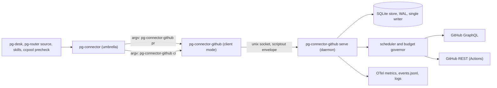
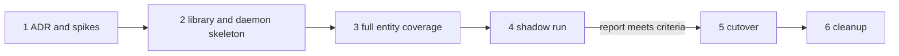

# pg-connector-github: a stateful, daemon-backed GitHub connector — design

- **Date**: 2026-10-09
- **Status**: DRAFT for operator review. Nothing here is implemented; no implementation bead is filed.
- **Origin**: handoff bead `pg2-zhuiu` (live vs shadow change detection and what shadow-compare phase A
  measured). This is the "third approach" the operator asked to design after phase A run 2.
- **Supersedes, once approved**: the placement recommendation (open question 8, "Where the refresh cache
  lives") and Direction 2 of `2026-10-05-pg-desk-attention-evaluator-and-connector-refresh-cache-design.md`;
  for the `pr` and `ci` types, the pg-desk-owned change flow of ADR 0077's S29 to S31 rows and the Phase 10
  cutover plan (`pg2-2j5ac.52.22`). See "Lifted rulings" and "Work this makes obsolete".

## 1. Decision summary

One new backend binary, `pg-connector-github`, replaces `pg-connector-pr-github` and
`pg-connector-ci-github-actions`. It is registered for both the `pr` and `ci` types. Its work is done by
a long-running daemon that owns a persistent store, keeps the data callers will ask for fresh within a
GraphQL and REST budget, and decides by itself what changed. Callers keep their current commands; the
answers become local reads.

| Topic              | Decision                                                                                                                                                                                               |
| ------------------ | ------------------------------------------------------------------------------------------------------------------------------------------------------------------------------------------------------ |
| Statefulness       | A connector MAY be stateful and MAY run a daemon. This is a lifted RESTRICTION, not a new requirement: every other connector stays as it is.                                                           |
| Placement          | The cache, the refresh policy and the change log live in the BACKEND, not the umbrella. A shared Go library MAY carry the generic parts.                                                               |
| Process model      | One daemon per upstream rate-limit domain (here: one GitHub token). It is the store's only writer. The backend binary in client mode forwards each request to it over a unix socket.                   |
| Daemon unreachable | The client answers `unavailable`. It does not read the store and does not call GitHub.                                                                                                                 |
| Caches             | Two: a QUERY cache (query to an ordered id list, ids only) and an ENTITY cache (id to the full object, held as field groups). Each has its own staleness settings.                                     |
| Refresh engine     | A field-group scheduler: one priority queue of (entity, group) tasks, batched summary refresh through `nodes(ids:)` with opportunistic fill, fingerprint revalidation, a budget governor (approach A). |
| Persistence        | The store survives restarts; data still inside its freshness window is served after a restart with no origin call.                                                                                     |
| Change detection   | Owned by the connector. Consumers poll `changes` with a cursor. No listing diff, sweep or hydration in pg-router or pg-desk for these types.                                                           |
| Change log content | Per change: kinds, the changed fields with BEFORE and AFTER values, the origin, the time.                                                                                                              |
| `--fresh`          | Stays available, but no automated caller uses it; pg-desk relies on the connector's freshness.                                                                                                         |
| Registration       | PROVISIONAL (operator did not answer; reversible): the existing `{name, command}` registry form, keeping the old instance names (see "Registration").                                                  |

### Operator rulings recorded by this design

All from the interactive design session of 2026-10-09 (Phillip, bead `pg2-zhuiu`), quoted where the
wording matters:

1. Placement and generality: "no umbrella for this, but there could be shared library to help"; "this
   change is not a requirement for all connector implementations, they can remain being no cache or
   stateless and no daemon. i'm just lifting that previous restriction that they couldn't. my motivation
   is that to be optimal, only the connector itself understands what to do."
2. Daemon: "i think we need it to run as a daemon. that will ensure only one writer to the cache, the
   peridocaly lookups can run when they need to. the CLI/command, will talk to the daemon."
3. Persistence: "if a daemon were to restart, any data which remains less than the cache time should be
   used. ie, not pure memory. i don't want restarts to cauche spikes in point usage."
4. Change ownership: "no change and sweep will be needed, the connector will own all of that. the rest of
   the tools will just ask for changes periodically. pg-desk shouldn't need to do any hydrating for PR
   data"; "--fresh will not be used normally, even by pg-desk".
5. Batch fill: "if it costs the same for any count <= 74, then we can considier pulling in theings almost
   stale if there is room left in the query response size."
6. Revalidation: "if the quick queries don't indicate that things have changed, we don't need to do a full
   pull, we can just bump the stale."
7. Refresh engine: approach A (field-group scheduler with batching) accepted.
8. One backend: "i think one daemon and one backend: pg-connector-github. it woudl impelment and be
   registered fro both ci and pr" (superseding an earlier answer of two daemons).
9. Daemon down: fail `unavailable` (chosen over a read-only store fallback and over a direct fetch).
10. Change log: field-level before and after (chosen over kinds-only and over full snapshots).

## 2. Why: what the two earlier approaches measured

Two flows exist today. Their numbers come from `docs/behavior/pg-desk/shadow-compare.md` and the phase A
run 2 report (bead `pg2-nu7h0`, run 2026-10-09 14:46Z to 20:56Z).

- **Live flow.** pg-router polls listings (mine every 60 s, team every 120 s, a sweep every 30 min) and
  emits one event per change; the desk-pr lane runs `pg-desk run pr <id>` one PR at a time. Detection is
  cheap; hydration is not. Dispatches waited 11 to 45 minutes behind their enqueue (`pg2-xg2k8`), and a
  hydration (`pr show` alone) takes 15 to 30 seconds.
- **Shadow flow.** `pg-desk pr changes` lists and hydrates in one tick, serially. A tick with no
  hydrations took 36 to 52 s; about 18.7 s was added per hydration. 73 of 81 measured ticks overran the
  60 s slot; uptime was 15.9%; the run ended on its 1,500 points per hour kill criterion. 329 of the 364
  shadow-only detections were `mergeability_changed`, and 166 of the 364 changed no projection field.

The causes the two share, and that this design removes:

1. **Every hydration goes to origin.** pg-desk passes `--fresh` on `pr show` (required by `INV-CACHE-8`),
   and `pr files`, `pr commits`, `pr review pending` and `ci list` bypass the umbrella cache entirely. A
   hydration is about 8 subprocess reads and 12 to 15 sequential `gh` calls.
2. **Detection and the data that detected it live in different processes.** The listing sees a change,
   then a second process re-reads everything to learn what it was.
3. **No batching, coalescing or concurrency** in the per-PR path.
4. **A noisy signal**: `mergeable` flipping through `UNKNOWN` is counted as a change.
5. **No runtime budget**: the 4,000 points per hour ceiling (ADR 0077, row S35) is a design-time
   guardrail; nothing enforces it.

The central idea of this design: when the component that refreshes an entity is also the component that
decides it changed, the snapshot it diffed IS the data the consumer reads next. The consumer's read is a
local hit and `--fresh` is no longer needed.

## 3. Architecture



### 3.1 One binary, two modes

- `pg-connector-github serve` is the daemon. It MUST run as a launchd user agent with KeepAlive, registered
  through the HM-scoped pattern this repo already uses for pa-monitor
  (`phillipgreenii.programs.launchdServices.userAgents.<name>`, `phillipgreenii-nix-personal` ADR 0055),
  with `manageLogs.enable` left at its default.
- `pg-connector-github pr` and `pg-connector-github ci` are client mode. Each reads one scriptout request
  on stdin, forwards it to the daemon, and writes the daemon's response on stdout. It MUST NOT open the
  store and MUST NOT call GitHub. When it cannot reach the daemon within its connect timeout it MUST answer
  `unavailable` with a message naming the daemon, its socket path and the command that restarts it.
- The umbrella keeps executing the backend once per call, exactly as today (`pkg/scriptout/exec.go`). The
  wire envelope does not change.

### 3.2 Registration

The wire request carries no entity type (`pkg/scriptout/envelope.go`, `Request`), and op names such as
`list` are shared across types, so one binary registered plainly under both types could not tell a `pr`
`list` from a `ci` `list`. The registry already supports an instance form `{name, command}` whose command is
an argv list, and states that one binary may be registered more than once under different names
(`cmd/pg-connector/registry_backend.go`, file comment). This design uses it:

```yaml
connector:
  pr: [{ name: pg-connector-pr-github, command: [pg-connector-github, pr] }]
  ci:
    [
      {
        name: pg-connector-ci-github-actions,
        command: [pg-connector-github, ci],
      },
    ]
```

Keeping the old instance NAMES keeps every `--backend` pin, `sources[]` row, cache and ledger key and
`backends.<name>` block valid. This choice is PROVISIONAL: the operator was asked and did not answer. The
alternatives were new instance names (renaming every pin and config block) or adding a `type` field to the
wire request (an envelope change touching every backend's decode and the conformance goldens).

### 3.3 The daemon's parts

| Part            | Responsibility                                                                                                                                                        |
| --------------- | --------------------------------------------------------------------------------------------------------------------------------------------------------------------- |
| Socket server   | Accepts scriptout requests on a unix socket under `$XDG_STATE_HOME/pg-connector-github/`, mode 0600. Routes by the client's type (`pr` or `ci`) and the op.           |
| Store           | SQLite (`modernc.org/sqlite`, the engine pg-desk's store already uses), WAL mode, the daemon as its only writer. Versioned schema migrations at startup.              |
| Field groups    | One Strategy per group: how to fetch it, how to batch it, how long it stays fresh, what invalidates it (section 4).                                                   |
| Query runner    | Runs configured and ad-hoc queries in their 1-point membership-only GraphQL form and stores the ordered id list.                                                      |
| Scheduler       | One priority queue of (entity, group) refresh tasks; a small worker pool; single-flight per (entity, group).                                                          |
| Batcher         | Packs due summary refreshes into `nodes(ids:)` calls of at most 74 ids and fills spare slots with the entities closest to going stale.                                |
| Budget governor | Two token buckets on one GitHub token: GraphQL points and REST requests. Fed by the `rateLimit` reading folded into every GraphQL document and REST response headers. |
| Classifier      | Derives PR and CI change kinds from a group's before and after content. Moves here from pg-desk's `internal/classify` for these types.                                |
| Change log      | Appends one row per content change; serves per-consumer cursors.                                                                                                      |
| Write path      | Performs writes (review pending and submit, comments, CI rerun) and invalidates the groups they affect. Owns the posted-review sidecar and per-PR locks.              |
| Telemetry       | OTel metrics and traces, the `events.jsonl` log, structured logs, and a `status` op (section 8).                                                                      |

### 3.4 Shared library

The generic parts (store primitives, scheduler, batcher interface, budget governor interface, change log
and cursors, socket server and client, status op) SHOULD live in a shared package, working name
`packages/pg-connector/pkg/connectord`, so a later Jira or Slack daemon reuses them. GitHub-specific parts
(field groups, fetchers, classifier, query shapes) stay in the binary. A connector that adopts the library
MUST scope its daemon to one upstream rate-limit domain, not to one connector type.

## 4. Data model

### 4.1 Field groups

An entity is not one blob with one age. It is a set of field groups, each fetched, refreshed and expired
on its own terms. This is what keeps refresh cheap: the 1-point batch covers only the listing field set,
and nested connections priced by their `first:` sizes make a batched full object expensive.

| Kind | Group          | Content                                                                                       | Fetch strategy                                                                                      | Fresh until                                                                                                                     |
| ---- | -------------- | --------------------------------------------------------------------------------------------- | --------------------------------------------------------------------------------------------------- | ------------------------------------------------------------------------------------------------------------------------------- |
| PR   | `summary`      | The batched search field set (`internal/github/github.go`, `searchBatched`), plus fingerprint | `nodes(ids:)` batches of at most 74; 1 point per call as measured by `pg2-cw6b3.1`                  | `summary_ttl` after fetch                                                                                                       |
| PR   | `merge_state`  | `mergeStateStatus`, `reviewRequests`, base ref                                                | Per PR or small batches (`mergeStateStatus` in large batches returned HTTP 502/504)                 | `merge_state_ttl`, extended by revalidation, never past `merge_state_max_age`                                                   |
| PR   | `conversation` | Reviews, review threads and their comments, issue comments                                    | Per PR, paged as `pr show` does today                                                               | Extended by revalidation, never past `conversation_max_age`                                                                     |
| PR   | `files`        | Changed files                                                                                 | Per PR, paged                                                                                       | Until `head_sha` or `base_sha` changes                                                                                          |
| PR   | `commits`      | Commits                                                                                       | Per PR, paged                                                                                       | Until `head_sha` or `base_sha` changes                                                                                          |
| PR   | `pending`      | The acting identity's pending review                                                          | Per PR                                                                                              | Until a write through this daemon, or `pending_ttl`                                                                             |
| CI   | `runs`         | Workflow runs and jobs for one head SHA                                                       | REST (`run list`, `run view --json jobs`); the branch comes from the PR entity, not a second lookup | `ci_active_ttl` while any run is queued or in progress; otherwise until the head or the rollup changes, never past `ci_max_age` |

Merged and closed PRs use `terminal_ttl` for every group.

### 4.2 Tables

| Table          | Columns (sketch)                                                                                     |
| -------------- | ---------------------------------------------------------------------------------------------------- |
| `query`        | key (canonical query and args), configured flag, ids (ordered), fetched_at, fresh_until, last_error  |
| `entity_group` | kind, id, group, content, fingerprint, version, fetched_at, fresh_until, max_age_at, last_error      |
| `entity`       | kind, id, last_access, keepalive (derived flag), tombstoned_at                                       |
| `change_log`   | seq, kind, id, version, kinds, fields (name, before, after), origin, at                              |
| `consumer`     | name, kind, cursor, pending_cursor, seen_at                                                          |
| `budget`       | bucket, at, remaining, reset_at, spent                                                               |
| `posted`       | the posted-review sidecar and its per-PR locks, moved from `$XDG_STATE_HOME/pg-connector-pr-github/` |

The store MUST NOT hold credentials. Tokens stay with `gh` as today.

## 5. Data flow

### 5.1 Entity read

Ops: `pr show`, `pr files`, `pr commits`, `pr review pending`, `ci list`.

1. The daemon records the access (`entity.last_access = now`), which raises the entity's refresh priority
   and keeps it in the keep-alive set.
2. It maps the op to the groups it needs: `show` to `summary`, `merge_state` and `conversation`; `files`
   and `commits` to their head-keyed groups; `review pending` to `pending`; `ci list` to `runs` for the
   current head.
3. When every needed group is inside `fresh_until`, it answers from the store with `served_from: cache`
   and `age_seconds` (the existing `INV-CACHE-4` and `INV-CACHE-5` fields). No origin call.
4. Otherwise it queues the stale groups at INTERACTIVE priority and waits:
   - Concurrent requests for the same (entity, group) share one fetch (single-flight).
   - A stale `summary` goes out immediately in a `nodes(ids:)` call, with spare slots filled; an
     interactive request MUST NOT wait for a batch to fill.
   - The wait is bounded by the backend deadline (`pkg/scriptout/limits.go`) less a margin.
   - On origin failure, content inside `expiry` is served with `served_from: stale` and its age; with
     nothing usable the answer is `unavailable`.
5. `--fresh` forces step 4 for every needed group even when they are fresh.

### 5.2 Query read

Op: `pr list --query Q` (and `--ids-only`, `--fingerprints`).

1. If Q's id list is inside `query_ttl` (per-query settings for configured queries, `adhoc_query_ttl`
   otherwise), use it. Otherwise re-run Q in its membership-only form and store the new ordered id list.
2. Compare the old and new membership and record `entered_query` and `left_query` changes. A departure
   is confirmed with one entity read before it is recorded, as today, so "closed or merged" is told apart
   from "filtered out".
3. For each id, a fresh `summary` is used as is; missing or stale ones are fetched in batches of at most
   74 with spare slots filled. The answer is returned once every id has a summary.
4. The answer stays summary-level (`schema.PRListFields`), with the existing per-entity fingerprint.

Configured queries are re-run by the scheduler at their own cadence. Ad-hoc queries are cached but never
re-run; their ids join the keep-alive set through the access in step 3.

### 5.3 Keep-alive, revalidation and expiry

- An entity is in the KEEP-ALIVE set while it is a member of a configured query, or was accessed within
  `keepalive_window`. (This rule is the design's own choice; it is how the operator's staleness and
  expiry settings fit together.)
- An entity in the set has its `summary` refreshed on `summary_ttl` by the batcher. The new summary is
  compared with the old:
  - Unchanged fingerprint: `merge_state` and `conversation` get their `fresh_until` extended (the
    operator's "bump the stale"), never past their hard `*_max_age`. The hard age exists because the
    list fingerprint cannot see review threads, merge-state status or edited comment bodies (ADR 0077,
    row S31).
  - `headRefOid` changed: queue `files`, `commits` and CI `runs`.
  - Comment, review or review-thread counts, or `updatedAt`, changed: queue `conversation`.
  - `mergeable` or the base changed: queue `merge_state`.
  - CI rollup changed: queue CI `runs`.
- The fingerprint MUST treat `mergeable: UNKNOWN` as "no information": a transition into or out of
  `UNKNOWN` is neither a change nor a reason to refresh.
- An entity outside the set is not refreshed. Once every group's `fetched_at` is older than `expiry`, the
  entity and its groups are evicted. Change-log rows are kept for their own retention.

### 5.4 Scheduling and batch fill

Each (entity, group) task carries a due time (`fresh_until`). Its priority is, in order:

1. Interactive: a caller is waiting.
2. Write-invalidated (section 5.5).
3. Overdue members of a configured query.
4. Overdue entities in the keep-alive set, most recently accessed first.
5. Fill: entities due within `fill_horizon`, nearest first, used only to fill spare slots of a batch that
   is already going out.

Background work MUST stop when the governor says the budget is exhausted; interactive work MAY spend down
to the reserve and no further.

### 5.5 Writes

After a write through the daemon succeeds (`review pending` create or append, `review submit`, a comment,
`ci rerun`), the daemon MUST mark the affected group stale and queue it at write-invalidated priority:
`pending` and `conversation` for review and comment writes, CI `runs` for a rerun. The refresh that
follows records its change with `origin: write`. Writes made outside the daemon (the browser, other
people) are found by the normal refresh.

### 5.6 Change feed

- Every refresh that changes a group's content bumps the entity's version and appends one `change_log`
  row: kind, id, version, kinds, each changed field with its before and after value, `origin` (one of
  `query`, `refresh`, `revalidate`, `write`, `read`) and `at`. This covers every cached entity, not only
  query members.
- `pg-connector pr changes --consumer NAME [--query Q]` and its `ci` equivalent return the rows after the
  consumer's cursor, optionally filtered to Q's members.
- Delivery is AT-LEAST-ONCE: the rows a call returns are acknowledged by the same consumer's next call.
  A consumer that crashes mid-batch receives the batch again. (The design's own choice.)
- The log is kept for `change_log_retention`; a consumer unseen for `consumer_stale_after` is dropped. A
  consumer whose cursor fell outside retention gets a `reset` answer carrying a snapshot of current
  members, then resumes.
- Field values in the log follow the same no-credential rule as the store. Comment bodies MAY be large;
  the `fields` column for `conversation` changes SHOULD record the changed comment's id with its before
  and after body rather than the whole conversation.

### 5.7 Restart and cold start

On start the daemon opens the store, applies migrations and serves every group still inside its
`fresh_until` with no origin call. The scheduler rebuilds its queue from stored due times. After a long
outage most groups are due at once; the governor limits the catch-up rate, so a restart never spends
more than the configured budget.

## 6. Configuration

### 6.1 Ownership

The daemon runs queries on its own clock, so it MUST read its own config file (queries, per-query and
per-group settings, budget, workers), rendered by its nix module. This reverses `INV-STATE-1` for this
backend. The umbrella still attaches the `backends.<name>` block to each request; the daemon MUST ignore
it for policy and MUST answer `invalid_argument` if a request's block names a query the daemon does not
know, so a stale registry block fails loudly rather than silently.

Named queries keep their native syntax (decision D4 is unchanged). The daemon's config MUST NOT hardcode
any user, team or organisation; the deployment supplies them.

### 6.2 Defaults

All values are configurable. Each default is a starting point to be checked by the phase 4 shadow run.

| Setting                                         | Default                        | Reason                                                                                               |
| ----------------------------------------------- | ------------------------------ | ---------------------------------------------------------------------------------------------------- |
| `query_ttl` for `mine` / `team`                 | 60 s / 120 s                   | The live flow's cadences                                                                             |
| `adhoc_query_ttl`                               | 120 s                          |                                                                                                      |
| `summary_ttl`                                   | 60 s                           | One batched call per minute per 74 kept-alive PRs                                                    |
| `merge_state_ttl` / `merge_state_max_age`       | 10 min / 30 min                | Extended by revalidation                                                                             |
| `conversation_max_age`                          | 30 min                         | Today's sweep cadence; the phase 1 `updatedAt` spike MAY relax it                                    |
| `pending_ttl`                                   | 10 min                         | Pending reviews change mostly through this daemon's own writes                                       |
| `ci_active_ttl` / `ci_max_age`                  | 60 s / 30 min                  |                                                                                                      |
| `terminal_ttl`                                  | 24 h                           | Merged and closed PRs are effectively frozen                                                         |
| `keepalive_window`                              | 24 h                           |                                                                                                      |
| `expiry`                                        | 7 d                            | Matches today's tombstone retention (`cmd/pg-connector/cache_dispatch.go`)                           |
| `fill_horizon`                                  | `summary_ttl`                  | Fill with what would be due within one more cycle                                                    |
| `change_log_retention` / `consumer_stale_after` | 14 d / 7 d                     | pg-desk's current defaults (`internal/store/cursor.go`)                                              |
| `batch_size` / `workers`                        | 74 / 4                         | 74 is the measured 1-point boundary                                                                  |
| `rate_reserve_points`                           | 1000                           | The existing reserve                                                                                 |
| `graphql_points_per_hour`                       | 1500 in shadow; set at cutover | The phase A kill criterion; the cutover value depends on the live flow's own spend, not yet measured |
| `rest_requests_per_hour`                        | 2000                           | Well inside GitHub's documented 5,000 per token                                                      |

### 6.3 Expected baseline cost

Assumption, not confirmed: `mine` is 1 search string and `team` is 10 (ADR 0077, row S35, gives 11 strings
in total). Before any detail refresh:

- `mine` membership every 60 s: 1 point x 60 calls = 60 points per hour.
- `team` membership every 120 s: 10 points x 30 calls = 300 points per hour.
- `summary` refresh of up to 74 kept-alive PRs every 60 s: 1 point x 60 calls = 60 points per hour (120
  for up to 148 PRs).
- Total: about 420 to 480 points per hour, against a measured live worst hour of 2,505 (row S35).

The cost of a detail refresh per detected change is not known; the phase 1 spike measures it. CI `runs`
spends REST, not points: 10 PRs with running CI refreshed every 60 s is 10 x 60 = 600 requests per hour.

## 7. Error handling

| Failure                                              | Behavior                                                                                                                                                                                       |
| ---------------------------------------------------- | ---------------------------------------------------------------------------------------------------------------------------------------------------------------------------------------------- |
| GitHub 5xx or timeout                                | Retry with backoff (the existing 3 attempts). On final failure the group stays stale and `last_error` is set. An interactive read gets stale content inside `expiry`, otherwise `unavailable`. |
| Secondary rate limit (403 or 429 with `Retry-After`) | The governor pauses background work for the stated time. Interactive reads are served stale.                                                                                                   |
| Primary limit below `rate_reserve_points`            | Background work stops. Interactive reads are served stale, or answered `unavailable` naming the reserve. The reserve is never spent.                                                           |
| Auth failure                                         | Fetches answer `unauthenticated`; cached reads are still served with their age; `auth_status` reports the failure.                                                                             |
| PR deleted or inaccessible                           | Tombstoned and recorded as a `removed` change.                                                                                                                                                 |
| Daemon crash                                         | launchd restarts it; store writes are transactional; requests in flight get `unavailable` from the client.                                                                                     |
| Store migration cannot be applied, or store corrupt  | The store is moved aside with a timestamp, the daemon starts empty with the governor limiting refill, and an alert fires.                                                                      |
| Client and daemon versions differ                    | Detected through `capabilities` and the protocol version; answered `version_mismatch`.                                                                                                         |
| Socket permission or path error                      | The client answers `unavailable` naming the socket path.                                                                                                                                       |

Every error MUST use the existing seven-value scriptout taxonomy; no new error code is introduced.

## 8. Observability

A daemon makes the connector's behavior observable in one place, which was one of the operator's reasons
for it.

- **Metrics** (OTel, exported through the settings in `osConfig.phillipgreenii.observability`, read
  null-safely as the pa-monitor module does):
  - GraphQL points and REST requests spent, by bucket and by purpose (interactive, write, query, refresh,
    fill); remaining and reset time per bucket.
  - Queue depth and the age of the oldest overdue task, by priority class.
  - Freshness lag per group: how far past `fresh_until` served or pending groups are.
  - Cache answers by `served_from` (`cache`, `origin`, `stale`) and op; interactive wait time.
  - Batch fill: ids per `nodes(ids:)` call, split into due and fill.
  - Revalidations: extended versus re-pulled, and re-pulls forced by a hard `*_max_age`.
  - Change-log rows by kind and origin; consumer lag (rows behind) per consumer.
  - Store size, eviction count, migration and restart counts.
- **Traces**: one span per request (op, kind, id or query, `served_from`, wait), with child spans for each
  origin call carrying its GraphQL cost or REST request count.
- **Event log**: the existing per-call `events.jsonl` lines (`graphql_cost`, `graphql_remaining`) MUST keep
  their shape so `grafana/alerting/pr-github-alerts.yaml` and the shadow budget reader keep working; the
  log moves to `$XDG_STATE_HOME/pg-connector-github/`, and the alerts and readers move with it.
- **Status op**: `pg-connector-github status` (also reachable as an op through the umbrella) prints the
  daemon's version, uptime, store path and size, both budget buckets, queue depth by class, the oldest
  overdue task, and per-consumer cursors. `--json` gives the same as a document.
- **Alerts** (Grafana, alongside the existing pr-github alerts): budget burn above the configured rate;
  the oldest overdue interactive or configured-query task older than a threshold; daemon unreachable
  (client `unavailable` answers); store moved aside; a consumer more than a threshold behind.
- **Logs**: structured, one line per state change (start, migration, budget pause and resume, store
  move-aside, consumer reset), rotated through `manageLogs`.

## 9. Caller experience

- **Commands do not change.** `pg-connector pr show 123` and `pg-connector ci list --pr 123` work as
  before; answers carry `served_from` and `age_seconds`, which today's output already defines.
- **Faster answers.** A hit is a socket round trip; no `gh` process runs.
- **Clear failures.** A daemon-down answer names the daemon, the socket and the restart command
  (`launchctl kickstart -k gui/$UID/<label>`). The ccpool precheck and the pg-pr and integrate-branch
  skills MUST treat `unavailable` as retryable; their docs say so.
- **Humans can still force a read** with `--fresh`; automated callers MUST NOT.
- **One place to look.** `pg-connector-github status` answers "is it healthy, how fresh is it, how much is
  it spending" without reading logs.

## 10. Consumer changes at cutover

| Consumer                                                                       | Today                                                                         | After                                                                                                                                                                                      |
| ------------------------------------------------------------------------------ | ----------------------------------------------------------------------------- | ------------------------------------------------------------------------------------------------------------------------------------------------------------------------------------------ |
| Umbrella `changes` for `pr` and `ci`                                           | Ledger-based diff of repeated `list` calls (`cmd/pg-connector/changes.go`)    | Forwarded to the backend when its capabilities declare a new `vocabulary.owns_changes` flag                                                                                                |
| Umbrella cache for `pr` and `ci`                                               | Read-through and stale fallback (`cmd/pg-connector/cache_policy.go`)          | Off for this backend through the existing `vocabulary.cache_opt_out` flag                                                                                                                  |
| pg-router PR sources (deployment config)                                       | `pr-mine` 60 s, `pr-team` 120 s, `pr-sweep` 30 min, each calling `pr changes` | One source per consumer polling `pr changes --consumer desk` (and `ci changes` if wanted). GitHub cadence moves to the daemon's settings; pg-router keeps only its own consumer-poll clock |
| desk-pr lane (`pg-desk run pr <id>`)                                           | About 8 reads to origin per PR                                                | The same calls, without `--fresh`, served locally                                                                                                                                          |
| pg-desk gather `--fresh` and `INV-CACHE-8`                                     | Always fresh                                                                  | Not passed for this backend; the invariant is rewritten to exempt a backend that owns its changes                                                                                          |
| pg-desk PR change flow (`internal/changes`, v2 `change_log`/`consumer`, sweep) | Built, unmigrated in production                                               | Not used for PRs; retired, not cut over                                                                                                                                                    |
| ccpool precheck (`pr review pending`), skills                                  | Direct `pg-connector pr` calls                                                | Unchanged commands; `unavailable` handled as retryable                                                                                                                                     |
| pg-desk-shadow                                                                 | Phase A harness                                                               | Reused as this design's validation harness (phase 4)                                                                                                                                       |
| `pg-connector-pr-github`, `pg-connector-ci-github-actions`                     | Separate binaries and nix packages                                            | Removed after cutover                                                                                                                                                                      |

The umbrella changes are a pass-through and an opt-out, not a cache in the umbrella; they honor ruling 1.

## 11. Lifted rulings

An ADR MUST record these lifts before implementation starts. Each is lifted as a RESTRICTION: a connector
MAY now do what it forbade; none is required to.

| Ruling                                                                                                         | Source                                                                        | After                                                                                                             |
| -------------------------------------------------------------------------------------------------------------- | ----------------------------------------------------------------------------- | ----------------------------------------------------------------------------------------------------------------- |
| D2: no connector runs a daemon                                                                                 | `2026-09-09-pg-desk-and-connector-discovery-design.md`, decision table        | A connector MAY run one daemon per upstream rate-limit domain                                                     |
| D3: connectors are stateless                                                                                   | same                                                                          | A connector MAY persist state it owns                                                                             |
| D5: the umbrella decides what changed                                                                          | same                                                                          | A backend that declares `owns_changes` decides for its types                                                      |
| `INV-STATE-1`: per-call policy only from the request                                                           | `packages/pg-connector/docs/behavior/invariants.md`                           | A daemon-backed backend MAY read policy from its own config                                                       |
| `INV-CACHE-1`, `INV-CACHE-8`                                                                                   | same                                                                          | Scoped to backends that do not own their cache and changes                                                        |
| ADR 0077, rows S29 to S31 (change detection in pg-desk, the remote sweep) and S30 (pg-router owns every clock) | `docs/adr/0077-entity-change-flow.md`                                         | For a backend that owns its changes, detection and its clock live in that backend; pg-router keeps consumer polls |
| Rejected alternative "Per-connector auto-refresh daemons"                                                      | `2026-09-09-pg-desk-and-connector-discovery-design.md`, rejected alternatives | Accepted for this connector, scoped per rate-limit domain                                                         |

Behavior docs are this system's source of truth (repo `CLAUDE.md`, pg-pr and pg-router development rules),
so the same change that lands the ADR MUST update `packages/pg-connector/docs/behavior/` (invariants,
interfaces, glossary entries for statelessness and the entity cache) and SHOULD fix the unrelated drift in
ADR 0062 item 6, which still allows a backend-local store.

## 12. Rollout



1. **ADR and spikes.** The ADR of section 11. Spikes, read-only against the operator's token:
   - the points cost per PR of `merge_state` and `conversation`, alone and in small batches;
   - whether `updatedAt` moves on a review-thread resolution and on a comment edit (decides how far
     `conversation_max_age` can relax);
   - optional: REST `If-None-Match` and `304` behavior through `gh api` for the conversation endpoints
     (approach C in "Alternatives considered").
2. **Library and daemon skeleton.** Store, socket, client mode, governor, telemetry, status op, the PR
   query runner and `summary` group. Passes the wire conformance suite.
3. **Full entity coverage.** `merge_state`, `conversation`, `files`, `commits`, `pending`, CI `runs`,
   the classifier, the change feed, the write path, the posted-review sidecar migration.
4. **Shadow run.** The daemon runs beside the live flow with its own store and the existing read-only `gh`
   shim, capped at 1,500 points per hour. pg-desk-shadow's report compares the daemon's change feed with the
   live events: feed misses, detection delay, sweep-caught events, shadow-only detections, cost. Cutover
   criteria, to be confirmed by the operator before the run: zero unexplained misses; detection delay p90 no
   worse than live; points per hour inside the cap for the whole run; daemon uptime at least 95%.
5. **Cutover.** Registry switch, umbrella pass-through and opt-out, pg-router source collapse, `--fresh`
   removed from pg-desk, old binaries retired. Rollback is the registry switch back to the old instances,
   which stay installed until phase 6.
6. **Cleanup.** Remove pg-desk's PR change flow, the umbrella's PR-specific refresher wiring and the old
   packages; update the behavior docs.

## 13. Testing

- **Unit, with a fake clock and fake fetchers**: scheduler priority order; batch fill (never delays an
  interactive request; never exceeds 74); revalidation extending `fresh_until` and the hard `*_max_age`
  forcing a re-pull; the `UNKNOWN` mergeability rule; keep-alive membership and expiry; both governor
  buckets, including reserve protection and `Retry-After` pauses; single-flight.
- **Restart**: fill the store, stop, start, assert ZERO origin calls for every read inside freshness, and
  a catch-up spend within budget after simulated long downtime. This is ruling 3 as a test.
- **Wire conformance**: `pkg/scriptout/conformance` run through the client against an in-process daemon,
  for both `pr` and `ci`.
- **Classifier**: the pg-desk classifier tests move with their fixtures; new cases for `UNKNOWN` and for
  field-level before and after.
- **Change feed**: at-least-once redelivery after a simulated consumer crash; `reset` after retention;
  query filtering; ordering by seq.
- **Write invalidation**: each write op marks exactly the groups of section 5.5 and records `origin: write`.
- **Query shape pinning**: the `nodes(ids:)` and membership documents are pinned like
  `TestSearchBatchedQuery_PinnedFieldSet`, so a field-set edit cannot silently change the points cost.
- **Client failure**: daemon absent, socket unreadable and version mismatch each give the documented
  answer.
- **Nix**: a check that the module renders the daemon config and the launchd agent, in the style of
  `checks.<system>.test-pa-monitor-hm-launchd`.
- **Gap analysis**: `pg-go-mutate` over the shared library and the scheduler before phase 4.
- **Live**: the phase 4 shadow run, and after cutover a live exercise of the new pg-router source (repo
  rule: a new or changed query and role MUST be exercised live once with a non-trivial outcome).

Test fixtures MUST stay generic: no real organisation, repository or user names (repo `CLAUDE.md`,
"Public Repository — No ZipRecruiter Disclosure").

## 14. Work this makes obsolete

To re-scope or close AFTER this spec is approved, not before:

- `pg2-2j5ac.52.22` (Phase 10 cutover of pg-desk's own change flow).
- `pg2-dngh6` (shadow-compare phase B: the backfill burst and sweep tiers of that flow).
- `pg2-5rb3t` (the cutover backfill burst).
- `pg2-8f618` (operator confirmation of phase A).
- Direction 2 and open question 8 of `2026-10-05-pg-desk-attention-evaluator-and-connector-refresh-cache-design.md`.
- `pg2-xg2k8` (saturated desk-pr lane) stays open until phase 5 shows it drained.

## 15. Alternatives considered

- **B: uniform entity, full hydration when stale.** Simple; reproduces the shadow's cost: 26 PRs refreshed
  every 10 minutes at about 12 points each is 26 x 12 x 6 = 1,872 points per hour.
- **C: approach A plus REST conditional requests.** A `304 Not Modified` may not count against the REST
  limit, which could make the conversation group nearly free to keep fresh. Not verified; kept as an
  optional phase 1 spike that can be added to A without changing this design.
- **Cache in the umbrella** (the 2026-10-05 recommendation). Rejected by ruling 1: only the connector knows
  its upstream well enough to batch, revalidate and budget optimally.
- **Two daemons, one per type.** Rejected by ruling 8: both share one GitHub token, so two budget
  governors would have to coordinate across processes, and CI needs the PR's head to key its runs.
- **Client fallback when the daemon is down** (read the store, or fetch directly). Rejected by ruling 9: a
  direct fetch silently reverts to unmetered per-call cost, and a store read couples every client to the
  store schema and hides an outage behind stale answers; failing makes a down daemon visible at once.

## 16. Open questions

1. **Registration** (section 3.2): confirm argv instances with the old names.
2. **Cutover criteria** (section 12, phase 4): confirm or change the four criteria.
3. **The cutover budget**: the `graphql_points_per_hour` value after cutover, which depends on the live
   flow's own spend (not yet measured).
4. **Consumers of `ci changes`**: whether any consumer needs a CI change feed at cutover, or `ci` changes
   are read only through PR changes of kind `ci_changed`.
