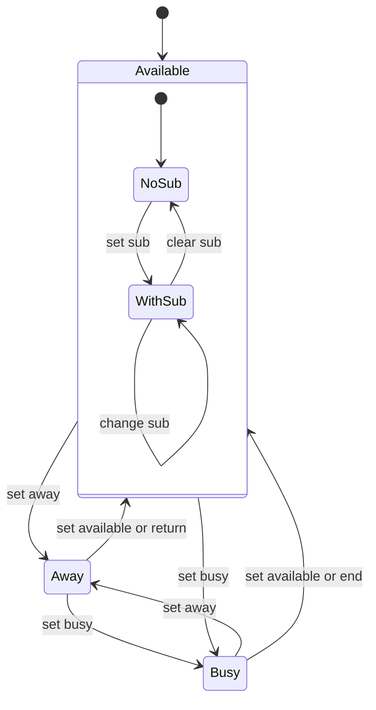
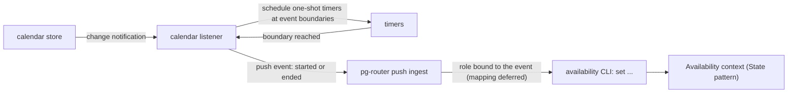

# Availability: away, busy and available as a State machine with Observer sinks — design

- **Status**: Draft for operator review. Nothing here is implemented and no implementation bead is
  filed. Spec 3 of 5.
- **Date**: 2026-10-10
- **Bead**: `pg2-67it0` (tracking bead; it holds the operator rulings recorded in section 1)
- **Builds on**: spec 1, `docs/superpowers/specs/2026-10-10-planning-horizons-design.md` (shared
  rulings SH-1 to SH-3 and facts F-1 to F-3 in its section 2, cited by id); spec 2,
  `docs/superpowers/specs/2026-10-10-horizon-posting-design.md` (the message publisher this design
  reuses for one sink); pg-router's behavior docs (`packages/pg-router/docs/behavior/`, push events);
  pg-connector's calendar capability (`packages/pg-connector/docs/behavior/interfaces.md`, the
  `calendar`'s `list` and `list_events` section); the pa-monitor SwiftBar design
  (`docs/superpowers/specs/2026-10-07-pa-monitor-swiftbar-design.md`, the click-action precedent)
- **Siblings**: spec 4 escalations, spec 5 direct-ask sweep

The key words MUST, MUST NOT, SHOULD, SHOULD NOT and MAY in this document are to be read as in RFC 2119.

This repository is public. The document names no employer, workspace, channel or person. Calendar
names, a self identity and sink targets are deployment configuration supplied at runtime.

**The handbook.** Where this document says "the handbook" it means the operator's private work
handbook, whose appendix of planned tooling prompted this set. It is not in this repository. What it
says is context and a source of defaults, never a numbered ruling, and each use is marked.

## 0. Summary

| Question                  | Short answer                                                                                                                                                                                                                |
| ------------------------- | --------------------------------------------------------------------------------------------------------------------------------------------------------------------------------------------------------------------------- |
| What is modelled?         | One value, the operator's current availability: `away`, `busy` or `available`, with `available` carrying an optional sub-state (for example code review) (AV-1). It is a **State** pattern, not a flag.                     |
| Who changes it?           | Non-LLM triggers first (AV-2): a CLI and a SwiftBar link. Claude MAY call the same CLI. A calendar listener MAY drive it later through pg-router (AV-3), once the mapping is ruled.                                         |
| What happens on a change? | A subject notifies **Observers**; each is a **Strategy** sink: a notification, a log, a self direct message (AV-4).                                                                                                         |
| What posts to the team?   | Nothing, for now (AV-4). Short breaks never notify the team (AV-5), so any later team notice is gated by a "not a short break" Specification.                                                                               |
| Can it set a chat status? | No tool can: the chat MCP has none for status or reminders (F-2), and there is no token (SH-2).                                                                                                                             |
| What is deferred?         | Which calendar events map to which state, and the list of available sub-states (AV-6). Neither is invented here.                                                                                                            |
| What is NOT decided       | Twelve open questions (section 9): precedence between a manual set and a calendar event, expiry behavior, the definition of a short break, whether the calendar store can notify without polling, and where the tool lives. |

## 1. Rulings recorded

Verbatim intent of the operator's rulings, 2026-10-06 to 2026-10-10, as kept on the tracking bead.

| Id   | Ruling                                                                                                                         |
| ---- | ------------------------------------------------------------------------------------------------------------------------------ |
| AV-1 | The states are away, busy and available, with available sub-states (for example code review). Model it with the State pattern. |
| AV-2 | Triggers are non-LLM first: a CLI and a SwiftBar link; Claude may call it.                                                     |
| AV-3 | A calendar listener emits events on event start and stop (Observer, not polling) that pg-router may act on.                    |
| AV-4 | For now NOTHING posts to the team. Output goes to a notification, a log or a self-DM (Strategy sink).                          |
| AV-5 | Short away-from-keyboard breaks never notify the team.                                                                         |
| AV-6 | Deferred: which calendar events map to which state, and the list of available sub-states.                                      |

Facts in force: F-1 (the chat MCP is scoped to one project checkout's configuration), F-2 (no chat
MCP tool for status or reminders), SH-2 (no chat API token). They are why this design has no
status-setting sink and a self-DM sink that depends on a deployment-supplied MCP context.

## 2. The model

### 2.1 Value and states

The current availability is a value with these fields:

| Field    | Meaning                                                                                                                                                                       |
| -------- | ----------------------------------------------------------------------------------------------------------------------------------------------------------------------------- |
| `state`  | `away`, `busy` or `available` (AV-1).                                                                                                                                         |
| `sub`    | Present only for `available`: a sub-state name. The set of names is deferred (AV-6), so it is a free token validated against deployment configuration, never a built-in enum. |
| `since`  | When this value took effect.                                                                                                                                                  |
| `until`  | Optional expected end, a return time (for `away`) or an end time (for `busy`).                                                                                                |
| `source` | What caused it: `cli`, `swiftbar`, `calendar` or `agent`.                                                                                                                     |
| `reason` | Optional free text for the log.                                                                                                                                               |



### 2.2 State pattern

`Availability` is the **context**; `Away`, `Busy` and `Available` are **state objects** that implement
one interface. The context delegates every command to its current state object and the state object
returns the next state (or refuses). This puts the legality rules and the side-effect list of each
state in one place instead of in a chain of conditionals.

```go
// State is one availability state. It decides what each command does from here.
type State interface {
    Name() string
    Set(ctx *Availability, to Target) (State, error) // Target carries state, sub, until, source
    Expire(ctx *Availability, now time.Time) (State, bool)
    CalendarBoundary(ctx *Availability, b Boundary) (State, bool) // used only once AV-6 is ruled
}
```

Commands the states understand: `Set` (from the CLI, the SwiftBar link or an agent), `Expire` (the
`until` time passed), and `CalendarBoundary` (a calendar event started or ended). `CalendarBoundary`
is a no-op in every state until the operator rules the mapping (AV-6).

A repeated `Set` to the same value is idempotent: it changes nothing and notifies nobody.

### 2.3 Persistence

- The current value is one small file, written atomically (a temporary file in the same directory,
  then a rename), as the pa-monitor SwiftBar title-width setting is. A missing or unreadable file reads
  as `available` with no sub-state.
- Every change appends one line to an append-only transition log (the `log` sink, section 4). The log
  is also the audit trail and the source of `history`.

## 3. Triggers

### 3.1 CLI (the primary trigger, AV-2)

```text
<tool> set away|busy|available [--sub NAME] [--until TIME | --for DURATION] [--reason TEXT] [--source NAME]
<tool> status [--json | --format swiftbar]
<tool> history [--since TIME] [--json]
```

The tool name and package are open (OQ-V9). Contract: `0` ok, `1` usage error (including an unknown
sub-state name), `3` failure to persist. `--json` carries a `contract` member, the repository's
convention for a machine-read output. The CLI is plain and non-interactive, so an LLM session can call
it as it can any command (AV-2: "Claude may call it"), and no transition requires an LLM.

### 3.2 SwiftBar link (AV-2)

`status --format swiftbar` prints menu rows: the current value, and one row per other state whose
action re-invokes the CLI with `set ...`, `terminal=false` and `refresh=true`. This is the
click-action pattern the pa-monitor plugin already uses (the renderer re-invokes itself; the nix
wrapper exports the whitespace-free store path of the command, because SwiftBar's `bash=` breaks on
whitespace). The rows are meant to be spliced into the deployment's existing plugin. Installing the
plugin is the consuming flake's job, as for pa-monitor.

### 3.3 Calendar listener (AV-3)

The listener is an **Observer of the calendar** and a **Subject** to pg-router.



- **Not polling** (AV-3). The listener reads the day's events once at start (the connector's
  `list_events`), computes the next boundary, and sets a one-shot timer for it. It re-reads only when
  the calendar store reports a change. Whether the macOS calendar bridge can deliver a change
  notification to a long-lived process is UNVERIFIED (OQ-V4). The existing bridge backend is
  exec-per-request over the connector wire protocol, so a listener is a separate long-lived process.
  If no notification exists, a bounded refresh of the SCHEDULE (never of the state) would be needed,
  and that is the operator's call; this design does not add polling on its own.
- **Event shape.** `calendar.event.started` and `calendar.event.ended`, each carrying the event's id,
  its calendar id, its start and end, whether it is all-day, the operator's response status
  (`self_status`) and whether it recurs, taken from the connector's calendar schema. The title and
  notes are NOT carried by default, because they are private and the mapping may not need them
  (OQ-V5).
- **Delivery.** Through pg-router's push-ingest path, which is durable, at-least-once and deduplicated
  by event id. The event id MUST therefore be deterministic: the calendar event id, the occurrence
  start, and the boundary kind. A re-emission after a restart is absorbed, not double-processed.
- **Sleep and wake.** Timers drift across sleep. On wake the listener MUST recompute boundaries and
  emit any boundary crossed while asleep, relying on the dedupe for the rest.
- **Acting.** pg-router "may act" (AV-3). A role bound to these events would call the CLI with the
  mapped state. The mapping is deferred (AV-6), so until it is ruled the listener emits events and no
  role changes availability. The events are still useful on their own (the log, a later escalation
  rule).

## 4. Output: Observers as Strategy sinks

The context is the **Subject**. After every change it publishes one `Changed` record (the previous
value, the new value, the cause) to a registered list of **Observers**. Each observer is a **Strategy**
sink, selected by configuration.

| Sink           | What it does                                                                                                                                   | Notes                                                                                                                                    |
| -------------- | ---------------------------------------------------------------------------------------------------------------------------------------------- | ---------------------------------------------------------------------------------------------------------------------------------------- |
| `log`          | Appends one JSON line to the transition log.                                                                                                   | Always on; it is the audit trail.                                                                                                        |
| `notification` | Shows a local user notification of the change.                                                                                                 | For the operator's own awareness.                                                                                                        |
| `self-dm`      | Sends a direct message to the operator's own account, through spec 2's `MessagePublisher` (a `claude -p` run against the chat MCP, F-1, SH-2). | Requires a self identity and the MCP context from deployment configuration. Its absence is a degraded sink, not a failure of the change. |

Rules:

- **AV-INV-1** A sink MUST NOT be able to post to anyone but the operator in this phase (AV-4). There
  is no `team` sink, and a test pins that the sink registry contains none and that the `self-dm` sink
  refuses any recipient other than the configured self identity.
- **AV-INV-2** A sink failure MUST NOT fail or roll back the change, and MUST NOT stop the other sinks.
  Each sink's outcome is logged (the work-report per-source outcome convention, never a merged
  signal).
- **AV-INV-3** A repeated `Set` to the same value MUST notify no sink.
- **AV-INV-4** No sink may set a chat status (F-2).

### 4.1 Short breaks and a later team notice (AV-5)

"Short away-from-keyboard breaks never notify the team" is a constraint on any FUTURE team sink, since
none exists now. When one is added it MUST sit behind a **Specification** that is false for a short
break:

```go
// NotAShortBreak gates any team-facing sink. Away shorter than the threshold never satisfies it.
type NotAShortBreak struct{ Threshold time.Duration }

func (s NotAShortBreak) IsSatisfiedBy(c Changed) bool {
    return !(c.New.State == "away" && c.ExpectedDuration() < s.Threshold)
}
```

The threshold is not ruled (OQ-V6). The handbook ties the heads-up to the operator's expected response
time for questions, which is one candidate definition of "short"; this is context, not a ruling. An
away with no `until` has no expected duration, which the Specification MUST treat as not short only
after the operator rules how such a case is handled (OQ-V6).

## 5. Deferred by ruling (AV-6)

| Deferred item                            | State of this design                                                                                                                                                                                           |
| ---------------------------------------- | -------------------------------------------------------------------------------------------------------------------------------------------------------------------------------------------------------------- |
| Which calendar events map to which state | NOT designed. `CalendarBoundary` is an extension point that is a no-op until the mapping exists. The mapping will be a Strategy (a list of match rules over the event fields above) supplied as configuration. |
| The list of available sub-states         | NOT designed. A sub-state is a validated token from deployment configuration. "Code review" is the operator's one example and is not built in.                                                                 |

## 6. Interactions with the rest of the set

- **Spec 1.** The morning day-plan post has an availability section (spec 2, A-1). That section is the
  day's calendar-derived plan of absence, not the live state. Until the mapping exists it is omitted
  with a notice, not guessed.
- **Spec 4.** The escalation surface MAY later use availability to quiet or defer a reminder while the
  operator is away. That is not ruled and not designed; it is listed so it is not forgotten (OQ-V12).
- **Spec 5.** No dependency.

## 7. Observability

By the telemetry-declaration convention of `docs/behavior/pg-desk/README.md`, every new component
declares what it emits:

- Each transition writes the log line: timestamp, previous value, new value, source, reason, and each
  sink's outcome.
- Counters: transitions by (source, new state), sink outcomes by (sink, outcome), listener boundaries
  emitted, listener re-reads, and a gauge for the time since the listener last confirmed the calendar.
- A health line for the listener (running, last boundary, next boundary) through pg-router's
  participant health channel.

## 8. Test plan (the minimum)

1. **State table**: every (state, command) pair, including every illegal one, in one table-driven test,
   with an injected clock.
2. **Idempotence (AV-INV-3)**: the same `Set` twice produces one log line and one notification.
3. **Expiry**: `until` passes; the state follows the expiry rule (OQ-V2); an `until` in the past is a
   usage error.
4. **Sinks (AV-INV-2)**: a sink that fails does not stop the others or the change; the outcome row says
   which failed.
5. **No team post (AV-INV-1, AV-INV-4)**: the sink registry has no team or status sink; `self-dm`
   refuses another recipient. A negative control proves the check can fail.
6. **CLI contract**: exit codes, `--json` `contract` member, `status --format swiftbar` rows against a
   golden file, an unknown sub-state exits `1`.
7. **Persistence**: a missing or corrupt state file reads as `available`; an interrupted write leaves
   the previous file intact.
8. **Listener**: against a fake calendar source and injected timers, started and ended events are
   emitted exactly once at the right boundaries; a restart does not double-emit (dedupe by id); a
   sleep across a boundary emits it on wake; an all-day event and a recurring event are handled.
9. **Live step** (the repository's pg-router wiring rule): when a role is first bound to the calendar
   events, `pg-router run-query` or `run-role` is run against a forced event and the OUTCOME is checked,
   not only the exit code.

## 9. Open questions for the operator

| Id     | Question                                                                                                                                                                          | Default if unanswered                                                                               |
| ------ | --------------------------------------------------------------------------------------------------------------------------------------------------------------------------------- | --------------------------------------------------------------------------------------------------- |
| OQ-V1  | Precedence between a manual set and a calendar boundary. Does a calendar event end a manual `busy`? Does a manual `away` survive a meeting start?                                 | A manual set holds until its `until` or a later manual set; a calendar boundary never overrides it. |
| OQ-V2  | What state follows an `until` expiry: `available` with no sub-state, or the state before the one that expired?                                                                    | `available` with no sub-state.                                                                      |
| OQ-V3  | Which sinks are on by default, and which per transition? A notification on every change may be noise.                                                                             | `log` always; the others off until configured.                                                      |
| OQ-V4  | Can the macOS calendar bridge deliver change notifications to a long-lived process? If not, may the listener refresh its SCHEDULE on a bounded interval (not poll the state)?     | None. Blocks the "not polling" listener; the CLI and SwiftBar link do not depend on it.             |
| OQ-V5  | May the event carry the title and notes, or only identifiers and times? A mapping by title needs the title.                                                                       | Identifiers, times, response status and recurrence only.                                            |
| OQ-V6  | What is a "short" break (AV-5): a fixed duration, the operator's expected response time, or an operator flag at the time of `set away`? How is an `away` with no `until` treated? | None. Moot until a team sink exists.                                                                |
| OQ-V7  | Is the self-DM sink wanted at all, given F-1 (it needs the MCP context) and that a local notification already reaches the operator?                                               | Keep it as a configurable sink; off by default.                                                     |
| OQ-V8  | Should a `set` also write a day marker the horizon work can read, so the end-of-day summary can mention time away?                                                                | No.                                                                                                 |
| OQ-V9  | Where does the tool live (a new package, or inside an existing one) and what is its name?                                                                                         | A new small package under `packages/`, following the one-program-per-module rule.                   |
| OQ-V10 | The chat MCP has no status tool (F-2). Is "set the chat status" a wanted capability to revisit if a tool or a token appears?                                                      | Not designed; revisit if the facts change.                                                          |
| OQ-V11 | Multiple machines: availability is per machine. Is a single source of truth across machines wanted?                                                                               | No; per machine.                                                                                    |
| OQ-V12 | Should escalations (spec 4) be quieted or deferred while the operator is `away` or `busy`?                                                                                        | No change to escalations.                                                                           |

## 10. Alternatives considered

| Alternative                                      | Verdict                                                                                                |
| ------------------------------------------------ | ------------------------------------------------------------------------------------------------------ |
| An enum and a chain of conditionals              | Rejected by AV-1: the State pattern is the ruling, and the legality of each transition is the point.   |
| Making an LLM decide the state from the calendar | Rejected by AV-2 ("non-LLM first") and AV-6 (the mapping is deferred, not delegated).                  |
| Polling the calendar every minute                | Rejected by AV-3 ("Observer, not polling"). A bounded schedule refresh is OQ-V4, an operator decision. |
| Posting the change to the team channel           | Rejected by AV-4 for now. The future gate is the `NotAShortBreak` Specification of section 4.1.        |
| Setting the chat status directly                 | Impossible with the given facts (F-2, SH-2).                                                           |
