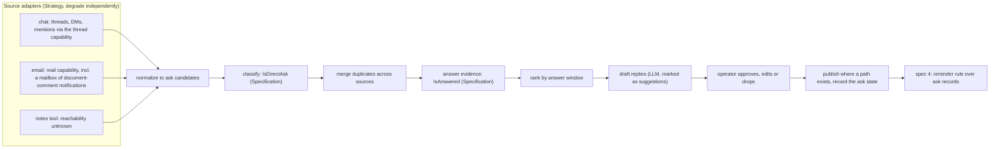
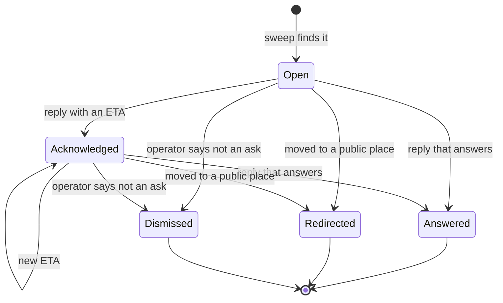

# Direct-ask sweep: finding the asks that need an answer, an ETA or a redirect — design

- **Status**: Draft for operator review. Nothing here is implemented and no implementation bead is
  filed. Spec 5 of 5. Unlike specs 1 to 4, **no numbered operator ruling addresses this tool's
  design**: the tracking bead records only its shape (SH-1, SH-2), the facts (F-1 to F-3) and the
  handbook's one-line description. Everything beyond those is a proposal and an open question.
- **Date**: 2026-10-10
- **Bead**: `pg2-67it0` (tracking bead)
- **Builds on**: spec 1, `docs/superpowers/specs/2026-10-10-planning-horizons-design.md` (shared
  rulings SH-1 to SH-3 and facts F-1 to F-3 in its section 2, cited by id); spec 2,
  `docs/superpowers/specs/2026-10-10-horizon-posting-design.md` (the Presenter Template Method, the
  approval rule PO-INV-1, the message publisher, and the post record); spec 4,
  `docs/superpowers/specs/2026-10-10-escalations-design.md` (the reminder rule that this tool feeds,
  and the open business-day question); pg-connector's behavior docs
  (`packages/pg-connector/docs/behavior/interfaces.md`, the `mail` and `thread` capabilities); the
  deterministic chat thread list design
  (`docs/superpowers/specs/2026-10-07-deterministic-slack-thread-list-design.md`)
- **Siblings**: spec 3 availability, spec 4 escalations

The key words MUST, MUST NOT, SHOULD, SHOULD NOT and MAY in this document are to be read as in RFC 2119.

This repository is public. The document names no employer, workspace, channel, mailbox, document or
person. Sources, queries and identities are deployment configuration supplied at runtime.

**The handbook.** Where this document says "the handbook" it means the operator's private work
handbook, whose appendix of planned tooling prompted this set. It is not in this repository. What it
says is context and a source of defaults, never a numbered ruling, and each use is marked.

## 0. Summary

| Question                    | Short answer                                                                                                                                                                                                                                                                                                                           |
| --------------------------- | -------------------------------------------------------------------------------------------------------------------------------------------------------------------------------------------------------------------------------------------------------------------------------------------------------------------------------------- |
| What is the sweep?          | An on-demand command that lists the asks addressed to the operator across chat, email and document comments, ranks them by how close each is to its answer window, and drafts a reply for each. The handbook describes it as "a sweep lists asks across [chat], email, [a notes tool] and [a document service], with drafted replies". |
| What does it send?          | Nothing without approval (spec 2, PO-INV-1). A drafted chat reply goes out through spec 2's message publisher. A mail reply and a document-comment reply have no connector path today, so those drafts are for the operator to send.                                                                                                   |
| How does it feed reminders? | It keeps an ask record per ask, with a state (open, acknowledged with an ETA, answered, redirected, dismissed) and a due moment. Spec 4's reminder rule reads those records to raise "nearing the answer window" items in the menu bar.                                                                                                |
| What do the facts rule out? | No document-service comment tool (F-3), so document comments are read through the mail notifications the handbook already routes into a mailbox. No chat reminder tool (F-2), so the promise of a follow-up is tracked by the ask record, not by a chat reminder.                                                                      |
| What is NOT decided         | Seventeen open questions (section 9), chiefly: what makes a message a direct ask, whether the notes tool is reachable at all, where ask state lives, and which sources can be answered by a tool.                                                                                                                                      |



## 1. Source material (no numbered ruling)

| Id   | Statement                                                                                                                                                                                       | Status                                                                                                                                      |
| ---- | ----------------------------------------------------------------------------------------------------------------------------------------------------------------------------------------------- | ------------------------------------------------------------------------------------------------------------------------------------------- |
| SH-1 | Reporting commands are thin Presenters over two query sides.                                                                                                                                    | Ruling (spec 1). The sweep is NOT a reporting command; it reads neither side. It borrows the Presenter skeleton and its approval rule only. |
| SH-2 | Posting goes through `claude -p` against a working MCP; there is no chat API token.                                                                                                             | Ruling (spec 1).                                                                                                                            |
| F-1  | The chat and tracker MCP servers are scoped to one project checkout's configuration.                                                                                                            | Fact (spec 1).                                                                                                                              |
| F-2  | The chat MCP has no tool for status or reminders.                                                                                                                                               | Fact (spec 1).                                                                                                                              |
| F-3  | The document service MCP has no comment tools.                                                                                                                                                  | Fact (spec 1).                                                                                                                              |
| X-1  | A meeting-items tracker (capture items for the weekly meeting, next-sprint suggestions, retro and one-to-one topics, then pull, review and add them to meeting notes) is planned tooling.       | Named on the tracking bead. NOT designed in this set.                                                                                       |
| X-2  | The day-plan command should eventually pull chat, email and calendar as well as PRs and tracker issues.                                                                                         | Named on the tracking bead. The ask records of this spec are one input; wiring is a follow-up.                                              |
| H-1  | A direct ask gets the answer, an ETA or a redirect within one business day. "Seen, I'll get back to you by 3pm" counts. Planning asks count too, even if the answer is "I need until Thursday". | Handbook. Context and default, not a ruling.                                                                                                |
| H-2  | A promised follow-up gets a chat reminder set on that message right away.                                                                                                                       | Handbook. Cannot be automated: F-2.                                                                                                         |
| H-3  | A team ask that arrives by direct message is redirected to a public channel.                                                                                                                    | Handbook.                                                                                                                                   |
| H-4  | Comments and mentions in the document service and in the notes tool arrive as emails that are filtered into one mailbox the operator checks in the notification cycle.                          | Handbook. It is what makes F-3 survivable.                                                                                                  |

## 2. The ask

An **ask** is a record the sweep owns about one message or comment that needs the operator's reply.

| Field         | Meaning                                                                                                          |
| ------------- | ---------------------------------------------------------------------------------------------------------------- |
| `id`          | Source-qualified and stable: `<source>:<source_ref>`, so a re-sweep finds the same ask.                          |
| `source`      | `chat`, `mail`, or another adapter.                                                                              |
| `source_ref`  | The thread or message identity in the source, opaque to the sweep.                                               |
| `url`         | A link to the message, when the source supplies one.                                                             |
| `from`        | Who asked, as the source names them.                                                                             |
| `received_at` | When the ask arrived.                                                                                            |
| `kind`        | `direct`, `mention` or `planning` (H-1 names planning asks as a case). The set is open (OQ-A1).                  |
| `excerpt`     | A short excerpt for display. Stored locally only (OQ-A12 asks about retention).                                  |
| `state`       | See the state machine below.                                                                                     |
| `due_at`      | When the answer window ends: `received_at` plus one business day by default (H-1), or the ETA the operator gave. |
| `ack_eta`     | The operator's stated ETA, when the state is `acknowledged`.                                                     |
| `answered_at` | When an answer, a redirect or a dismissal was recorded.                                                          |

### 2.1 State

An ask is a **State** pattern, like availability in spec 3. The legality of each move and its side
effect live in one place per state.



An `Acknowledged` ask's `due_at` is its ETA. This is how the follow-up promise of H-2 is tracked
without a chat reminder (F-2): the promise is an ask record with a due moment, and spec 4's rule
surfaces it. This is the author's reading and not a ruling (OQ-A6).

## 3. The pipeline

The sweep reuses spec 2's Template Method skeleton (resolve scope, gather, select, compose, approve,
publish, record) with these hooks. It is a command the operator runs, in the notification cycle; it
does not publish unattended (spec 2, PO-INV-1).

| Step | What happens                                                                                                                                                                                                                                                               |
| ---- | -------------------------------------------------------------------------------------------------------------------------------------------------------------------------------------------------------------------------------------------------------------------------- |
| 1    | **Gather** per source through its adapter. Adapters are a **Strategy** set; a failed or degraded source is reported as such and never blocks the others (the work-report pull-outcome convention, `INV-DEGRADE-1`). A source that cannot cover its range says `truncated`. |
| 2    | **Normalize** each item to an ask candidate.                                                                                                                                                                                                                               |
| 3    | **Classify** with the `IsDirectAsk` Specification (section 4).                                                                                                                                                                                                             |
| 4    | **Merge** candidates that are the same ask seen twice, for example a chat message and the notification email about it (section 5).                                                                                                                                         |
| 5    | **Evidence**: apply `IsAnswered` to each candidate to move it to a terminal or acknowledged state without asking the operator (section 6).                                                                                                                                 |
| 6    | **Rank**: asks closest to or past `due_at` first; the order inside is the source's arrival time. No weights.                                                                                                                                                               |
| 7    | **Draft** a reply for each open ask with an LLM, marked in the output as a suggestion. The operator MAY edit, approve, drop or dismiss each.                                                                                                                               |
| 8    | **Publish** each approved reply where a path exists (section 7) and record the new ask state.                                                                                                                                                                              |

## 4. What makes a direct ask

The handbook names the target ("every direct ask") and not the test. The Specification is therefore a
proposal, built from signals a source can supply deterministically first, with an LLM only for the
residue:

```go
// IsDirectAsk is satisfied by an item that is addressed to the operator, is not from the operator,
// is not an automated notification, and is not already settled.
type IsDirectAsk struct {
    AddressedToMe  Specification // a direct message, an @mention, a reply in a thread the operator started, a comment mention
    NotFromMe      Specification
    NotAutomated   Specification // not a bot, not one of the automated team threads (spec 2, PO-4)
    NotSettled     Specification // see IsAnswered
}
```

- **Deterministic signals** (a source's own fields: the recipient, the mention list, the author type; for a chat thread, the schema's `mentions_me`, `started_by` and `participants`)
  decide `AddressedToMe`, `NotFromMe` and `NotAutomated` wherever the source supplies them.
- **LLM judgment** is reserved for "is this message actually asking me for something", and its verdict
  is stored with the ask as `model_suggested`, so the operator can overrule it and the next sweep does
  not re-ask the same question. The tool MUST NOT present a model verdict as a deterministic one.
- A group mention (a team alias the operator belongs to, for example while on call) is an ask only if
  the operator configures the alias (OQ-A2).

## 5. Merging the same ask seen twice

A chat message that mentions the operator can also produce a notification email, and a document
comment arrives only as an email (H-4). The merge key is, in order of strength: a shared URL; the same
thread identity; the same sender and a near-identical excerpt within a short window. A merged ask keeps
every source reference and counts once. The first two keys are deterministic and the third is a
heuristic, flagged `merged_by_heuristic` so the operator can split it.

## 6. Answer evidence

`IsAnswered` moves an ask without asking the operator:

| Source | Evidence the operator answered                                                                            | Feasibility                                                                                                                                                                                                       |
| ------ | --------------------------------------------------------------------------------------------------------- | ----------------------------------------------------------------------------------------------------------------------------------------------------------------------------------------------------------------- |
| chat   | The operator is among the thread's `participants` and the thread's `last_reply_at` is later than the ask. | Thread-level approximation: the thread schema carries `participants`, `last_reply_at`, `reply_count` and `mentions_me`, and no per-reply list, so the sweep cannot prove WHICH reply was the operator's (OQ-A17). |
| mail   | A message sent by the operator in the same conversation.                                                  | UNVERIFIED: the mail capability lists and searches mailboxes; whether a sent mailbox is among them is a deployment fact (OQ-A8).                                                                                  |
| other  | None automatic.                                                                                           | The operator marks it.                                                                                                                                                                                            |

An answer that is a bare acknowledgement is an ETA (state `Acknowledged`); whether the sweep can tell an
ETA from an answer deterministically is OQ-A6. Until it can, the sweep proposes and the operator
confirms.

## 7. Sending a reply

| Source                   | Path today                                                                                                                                                                                                                   |
| ------------------------ | ---------------------------------------------------------------------------------------------------------------------------------------------------------------------------------------------------------------------------- |
| chat                     | Spec 2's `MessagePublisher`, as a thread reply (a `claude -p` run against the chat MCP, SH-2). A cross-reference in a reply obeys the no-bead-id rule (spec 2, PO-5).                                                        |
| mail                     | NONE. The mail capability has no create or reply op (`INV-MAIL-1` and the capability's "no create or reply op at this phase"). The draft is shown for the operator to send from the mail client. Adding a reply op is OQ-A9. |
| document-service comment | NONE (F-3). The reply is by hand.                                                                                                                                                                                            |
| notes-tool comment       | UNKNOWN: no connector and no verified MCP for it exists in this repository (OQ-A3).                                                                                                                                          |
| redirect (H-3)           | A drafted message for the public place, plus a drafted pointer back; both are chat posts through the same publisher.                                                                                                         |

## 8. Relationship to the rest of the set

- **Spec 4.** E-4 (asks nearing the answer window) is a reminder rule over ask records: `Reference` is
  `received_at`, the threshold is the lead time before `due_at`, and the clock Strategy is
  `BusinessDays`. It is blocked on spec 4's OQ-E1 (what a business day is) and on ask records being
  readable by the evaluator (OQ-A5). Until then the sweep lists asks only when the operator runs it.
- **Spec 2.** The morning day-plan post has a section for the asks the operator owes (A-1). Its source
  is this spec's ask records. Until they exist, that section is omitted with a notice.
- **Spec 1.** The day `create` MAY later list open asks beside the candidates (X-2). Not designed here.
- **Spec 3.** No dependency.

## 9. Open questions for the operator

| Id     | Question                                                                                                                                                                                                                                                                            | Default if unanswered                                                                                           |
| ------ | ----------------------------------------------------------------------------------------------------------------------------------------------------------------------------------------------------------------------------------------------------------------------------------- | --------------------------------------------------------------------------------------------------------------- |
| OQ-A1  | What exactly is a direct ask? Is a mention in a busy channel one? Is a question to the whole team? Is a reply to the operator's own post? The kind set `direct`, `mention`, `planning` is a proposal.                                                                               | Direct message, an @mention of the operator, a reply in the operator's thread, a comment mention. Nothing else. |
| OQ-A2  | Are group mentions (a team alias, an on-call alias) asks to the operator, and which aliases?                                                                                                                                                                                        | Only aliases the operator lists.                                                                                |
| OQ-A3  | Is the notes tool reachable at all? No connector exists, and no MCP for it is verified. Its comments are said to arrive by email (H-4).                                                                                                                                             | Read through the mail notifications only; no notes-tool adapter.                                                |
| OQ-A4  | Which chat tools does the live MCP offer for searching mentions and reading threads? A live tool-list capture is still pending on the chat reminders investigation (spec 4, section 5.1).                                                                                           | None. A live tool-list check is the first implementation step.                                                  |
| OQ-A5  | Where do ask records live: a table in the pg-desk store (readable by the pure evaluator, which spec 4's rule needs), a new pg-desk entity type, or the sweep's own file? The deterministic chat thread list is not available, so pg-desk cannot gather threads incrementally today. | A table in the pg-desk store beside the focus tables, written by the sweep, read by the evaluator.              |
| OQ-A6  | Can an ETA be told from an answer deterministically, and is "the promise of a follow-up is an ask with a due moment" the intended replacement for the chat reminder the handbook asks for (H-2)?                                                                                    | The sweep proposes and the operator confirms; yes to the replacement.                                           |
| OQ-A7  | Cadence: only on demand, or also scheduled to PRODUCE the list and drafts (never to send)? The handbook has a notification cycle at least every two hours (hourly on call).                                                                                                         | On demand; a scheduled draft-only run is allowed only if the operator asks.                                     |
| OQ-A8  | Can the mail connector see the operator's sent messages (a sent mailbox in its configuration)? Without it `IsAnswered` has no mail evidence.                                                                                                                                        | No mail evidence; the operator marks mail asks answered.                                                        |
| OQ-A9  | Is a mail reply capability wanted? The connector says there is no create or reply op at this phase.                                                                                                                                                                                 | No. Mail drafts are for the operator to send.                                                                   |
| OQ-A10 | Should an `Answered` chat ask also be recorded as activity for work-report, so the day's report shows it?                                                                                                                                                                           | No. The done side is work-report's own ingestion (spec 2, PO-1).                                                |
| OQ-A11 | What is a business day (spec 4, OQ-E1)? The sweep's default `due_at` needs it.                                                                                                                                                                                                      | None. Until ruled, `due_at` is 24 hours after `received_at`, shown as such.                                     |
| OQ-A12 | Retention and privacy of the stored excerpts: how long, and may the excerpt be omitted?                                                                                                                                                                                             | Keep the excerpt only while the ask is not terminal, then delete it.                                            |
| OQ-A13 | Dismissed asks: does a dismissal persist so the same message is never asked about again, even if it is edited or re-sent?                                                                                                                                                           | Persist by `id`; a new message is a new ask.                                                                    |
| OQ-A14 | Redirect (H-3): is the redirect an action the sweep drafts, or a note only?                                                                                                                                                                                                         | A drafted message, approved like any other.                                                                     |
| OQ-A15 | Does a planning ask (H-1: "even if the answer is I need until Thursday") also enter the planning horizons of spec 1 as a candidate?                                                                                                                                                 | No, not in this set.                                                                                            |
| OQ-A16 | Where does the tool live and what is it called (a new package, or a subcommand of an existing tool)?                                                                                                                                                                                | A new small package under `packages/`, following the one-program-per-module rule.                               |
| OQ-A17 | The thread schema has no per-reply list, so a chat answer can only be inferred at thread level (the operator is a participant and the thread has a later reply). Is that precise enough, or is a per-reply read (a change to the thread capability) wanted?                         | Thread-level inference; the operator confirms.                                                                  |

## 10. Test plan (the minimum)

1. **Specifications**: `IsDirectAsk` over a table of fixtures (direct message, mention, a message from
   the operator, a bot, an automated team thread, a group mention that is and is not configured); each
   case asserts the verdict and which signal decided it.
2. **State machine**: every (state, event) pair, including the illegal ones, with an injected clock.
3. **Merge**: same URL merges; same thread merges; the heuristic merge is flagged; two different asks
   never merge.
4. **Answer evidence**: a later operator message in the thread answers the ask; a later message by
   someone else does not; a missing mail evidence source leaves the ask open and says why.
5. **Degradation**: one adapter times out; the others' asks are listed and the outcome row names the
   degraded source.
6. **Approval (spec 2, PO-INV-1)**: the publisher is never called before approval; a dropped draft is
   never sent; a body with a bead id is rejected (spec 2, PO-5).
7. **LLM boundary**: a model verdict is stored as `model_suggested` and shown as a suggestion; a
   deterministic verdict is never overwritten by a model verdict.
8. **Idempotence**: a second sweep over unchanged sources lists the same asks, creates no duplicates and
   changes no state.
9. **Reminder feed**: with ask records readable by the evaluator, an ask whose `due_at` is within the
   lead time raises the spec 4 item and clears when the ask reaches a terminal state.
10. **Live step**: the first run against real sources is checked for a non-trivial outcome, not only an
    exit code.

## 11. Alternatives considered

| Alternative                                            | Verdict                                                                                                                                                       |
| ------------------------------------------------------ | ------------------------------------------------------------------------------------------------------------------------------------------------------------- |
| An LLM reads every source and answers end to end       | Rejected as the default: it is not testable or idempotent, and it would send unreviewed. The LLM is kept to "is this an ask" for the residue and to drafting. |
| A chat reminder for each promised follow-up (H-2)      | Impossible: F-2.                                                                                                                                              |
| Reading document comments through the document service | Impossible: F-3. The notification emails (H-4) are the path.                                                                                                  |
| A new connector for the notes tool now                 | Not designed: nothing verifies a path to it (OQ-A3).                                                                                                          |
| Gathering threads continuously through pg-desk         | Not available: a chat thread list cannot be fingerprinted without the API token the operator does not have; see the deterministic thread list design.         |
| Treating every unread mention as an ask                | Rejected: it makes the list the same as the inbox and defeats the sweep.                                                                                      |
