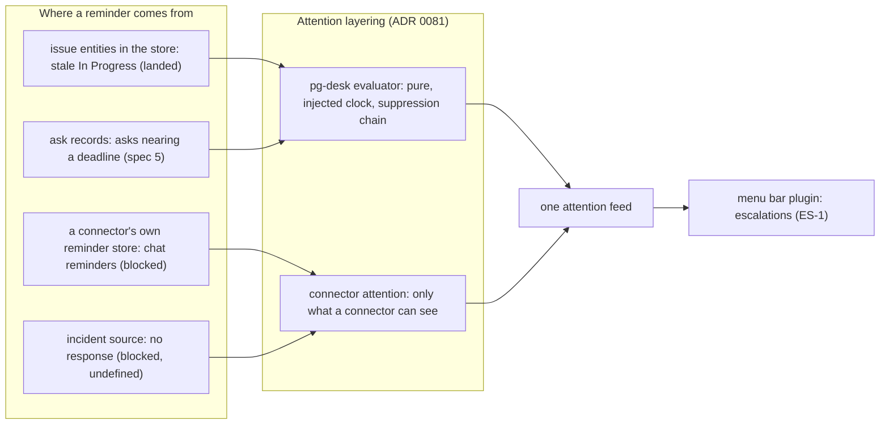

# Escalations: reminders as menu-bar attention items — design

- **Status**: Draft for operator review. Nothing new here is implemented and no implementation bead
  is filed. Spec 4 of 5. One of the three escalations already exists (section 3); one is blocked on an
  investigation; one is blocked on a definition.
- **Date**: 2026-10-10
- **Bead**: `pg2-67it0` (tracking bead; it holds the operator rulings recorded in section 1)
- **Builds on**: the pg-desk attention behavior doc (`docs/behavior/pg-desk/attention.md`); the
  attention evaluator design
  (`docs/superpowers/specs/2026-10-05-pg-desk-attention-evaluator-and-connector-refresh-cache-design.md`);
  the menu bar cross-reference links design
  (`docs/superpowers/specs/2026-10-02-menubar-cross-reference-links-design.md`); ADR 0081 (the split
  between a connector's own attention and pg-desk's entity attention); spec 1,
  `docs/superpowers/specs/2026-10-10-planning-horizons-design.md` (shared rulings SH-1 to SH-3 and
  facts F-1 to F-3 in its section 2, cited by id)
- **Existing beads**: `pg2-5l0x4.13` (stale In Progress issue attention; closed, landed) and
  `pg2-qxatp` (the Slack reminders investigation; open, deferred)
- **Siblings**: spec 3 availability, spec 5 direct-ask sweep (the source of the next escalation
  rules)

The key words MUST, MUST NOT, SHOULD, SHOULD NOT and MAY in this document are to be read as in RFC 2119.

This repository is public. The document names no employer, workspace, channel, project key or
person.

**The handbook.** Where this document says "the handbook" it means the operator's private work
handbook, whose appendix of planned tooling prompted this set. It is not in this repository. What it
says is context and a source of defaults, never a numbered ruling, and each use is marked.

**Terminology.** "Escalation" here means an attention item raised by a reminder rule and surfaced in
the menu bar. It is NOT the pg-router and ccpool "escalation" of
`docs/superpowers/specs/2026-09-22-pg-router-ccpool-escalation-design.md`, which hands a stuck agent
bead to a triager. The two share a word and nothing else.

## 0. Summary

| Question                   | Short answer                                                                                                                                                                                                                         |
| -------------------------- | ------------------------------------------------------------------------------------------------------------------------------------------------------------------------------------------------------------------------------------ |
| What is an escalation?     | An attention item (`{type, id, summary, severity, url, group}`) raised by a time-based rule and shown by the menu bar plugin through the one attention feed (ES-1). No second feed and no second ordering.                           |
| What exists?               | `issue.stale-in-progress`: an In Progress issue assigned to the operator with no operator update for 7 days. It is landed (ES-2, `pg2-5l0x4.13`).                                                                                    |
| What is in flight?         | Slack reminders: the investigation `pg2-qxatp` is open and deferred. The facts say the chat MCP has no reminder tool (F-2), so the likely verdict is negative or an alternative path.                                                |
| What is blocked?           | The on-call "no response to an active incident assigned to me" escalation (ES-3): no formal definition of an active incident exists, so there is nothing to specify.                                                                 |
| What does this design add? | A common shape for reminder rules (a Template Method over an injected clock, with a Strategy for the clock), a record of where each escalation sits in the attention layering, and the unblock conditions for the two blocked items. |
| What is NOT decided        | Nine open questions (section 7), chiefly: the definition of a business day, whether severity rises with waiting, and which handbook reminders beyond the three rulings are in scope.                                                 |



## 1. Rulings recorded

Verbatim intent of the operator's rulings, 2026-10-06 to 2026-10-10, as kept on the tracking bead.

| Id   | Ruling                                                                                                                                         |
| ---- | ---------------------------------------------------------------------------------------------------------------------------------------------- |
| ES-1 | Reminders surface as escalations in the SwiftBar plugin.                                                                                       |
| ES-2 | Existing beads: `pg2-5l0x4.13` (stale In Progress issue attention) and `pg2-qxatp` (Slack reminders investigation).                            |
| ES-3 | The on-call "no response to an active incident assigned to me" escalation is blocked: there is no formal definition of an active incident yet. |

Facts in force: F-2 (no chat MCP tool for status or reminders), F-1 (the chat MCP is scoped to one
project checkout's configuration), SH-2 (no chat API token).

## 2. Where an escalation sits

ADR 0081 splits attention in two, and this design keeps the split.

| Layer                       | What it may raise                                                                                                                                                | Escalations placed here                                                                                           |
| --------------------------- | ---------------------------------------------------------------------------------------------------------------------------------------------------------------- | ----------------------------------------------------------------------------------------------------------------- |
| pg-desk evaluator           | Anything computed from stored entity facts and an injected clock. Pure, read-time, with a suppression chain (hidden, `suppress.attention`, context suppressors). | Stale In Progress (landed); approaching ask deadlines (spec 5, once ask records are entities in the store).       |
| A connector's own attention | Only what that connector alone can see in its data: a calendar event in its window, an agent session waiting on a person, a firing alert.                        | Chat reminders, if a reminder source ever exists (ES-2, `pg2-qxatp`); an incident source, if one is ever defined. |

The menu bar plugin reads ONE feed from the same evaluator the dashboard uses (`INV-ATTNEVAL-2` of
the attention behavior doc), and it carries no ordering of its own (the "Grouping and order" section
of that doc). It MUST NOT add a second source of attention. An escalation is therefore an ordinary item
with a `severity`, a `url` and optionally a `group`. The deployment's plugin decides how it renders a
section called escalations; this repository owns the feed.

## 3. The escalation that exists: `issue.stale-in-progress`

Landed under `pg2-5l0x4.13` (commit `ade65d60` on the main branch of this repository). Recorded here
so the later rules reuse its decisions instead of re-deriving them.

| Decision                             | Value (from `docs/behavior/pg-desk/attention.md`)                                                                                                                               |
| ------------------------------------ | ------------------------------------------------------------------------------------------------------------------------------------------------------------------------------- |
| Subject                              | An issue entity assigned to the operator whose tracker status category is In Progress (`indeterminate`), else a configured status-name list.                                    |
| Raises when                          | The operator has not updated it for at least the threshold: `attention.rules.issue.stale-in-progress.stale_after_days`, default 7 calendar days.                                |
| What counts as the operator's update | The operator's own comment or status transition. An update by anyone else or by a bot never resets the clock.                                                                   |
| Where age is measured from           | The later of the operator's last update and the moment the issue entered In Progress.                                                                                           |
| Clears                               | On the next evaluation after the operator updates it, reassigns it or moves it out of In Progress (computed at every read).                                                     |
| Unknown is not zero                  | An issue the operator facts cannot be read for never raises (`INV-ATTNEVAL-6`).                                                                                                 |
| Severity, item shape                 | Default `medium`; the item is `{issue, <key>}` and links to the issue's page.                                                                                                   |
| Known gaps                           | A field edit by the operator is not counted (the connector's changelog carries status transitions only). The rule is live only where the deployment sets `watch.issue.queries`. |

Nothing in this design changes that rule.

## 4. The common shape: a reminder rule

Today each time-based rule is hand-written against the evaluator. The escalations to come share one
structure, so this design names it. This is a refactoring target for new rules, not a rewrite of the
landed rule.

### 4.1 Template Method

```go
// ReminderRule is the Template Method for a time-based attention rule.
// The skeleton is fixed; each rule supplies the hooks.
type ReminderRule interface {
    Kind() string                                   // hook: the rule kind, e.g. "issue.stale-in-progress"
    Subjects(v View) []Subject                      // hook: which entities the rule looks at
    Reference(s Subject) (time.Time, bool)          // hook: the moment the wait is measured from; false = unknown
    Threshold(cfg RuleConfig) time.Duration         // hook: how long is too long (or the lead time before a deadline)
}
// The fixed skeleton, run for every rule: for each subject, skip it if unknown (never zero),
// measure elapsed time on the injected clock, test the threshold, build the summary and item,
// hand the candidate to the suppression chain. The clock is injected, so a test controls time.
```

### 4.2 Clock Strategy

A rule reads time through a `Clock` and measures elapsed time with a `Measure` Strategy, so "7
calendar days" and "1 business day" differ only in the strategy:

| Strategy       | Measures                                                                                    | Used by                                                                          |
| -------------- | ------------------------------------------------------------------------------------------- | -------------------------------------------------------------------------------- |
| `CalendarDays` | Whole calendar days in the evaluating zone.                                                 | `issue.stale-in-progress` (landed).                                              |
| `BusinessDays` | Working days only, per a configured working week and holiday list. NOT defined yet (OQ-E1). | Asks and review requests, if the operator puts them in scope (section 5, OQ-E3). |

### 4.3 Two kinds of threshold

A rule is either a **neglect** rule (raise when elapsed time since a reference reaches a threshold: the
stale rule) or an **approach** rule (raise when the time left before a deadline falls inside a lead
time, and again when it passes: the due-soon and overdue rules). Both are the same skeleton with
different `Reference` and `Threshold` hooks. Whether severity should also rise as the wait grows is
the attention design's still-open item 6, and is OQ-E4 here.

## 5. The escalations to come

| Id  | Escalation                                                | Source of the reminder                          | State                                                                                                                           |
| --- | --------------------------------------------------------- | ----------------------------------------------- | ------------------------------------------------------------------------------------------------------------------------------- |
| E-1 | Stale In Progress issue                                   | Issue entities in the store                     | LANDED (ES-2).                                                                                                                  |
| E-2 | Chat reminders                                            | The chat service's own reminders                | BLOCKED on `pg2-qxatp` (section 5.1).                                                                                           |
| E-3 | On-call: no response to an active incident assigned to me | An incident source                              | BLOCKED on a definition (ES-3, section 5.2).                                                                                    |
| E-4 | Asks nearing the one-business-day answer window           | Ask records from spec 5                         | Named in the handbook's appendix, NOT in the operator's rulings for this set. Specified only as a dependency of spec 5 (OQ-E3). |
| E-5 | A teammate's PR review request nearing one business day   | pg-desk's PR entities and their review requests | Same: handbook appendix only (OQ-E3).                                                                                           |

### 5.1 E-2, chat reminders (`pg2-qxatp`)

The investigation asked whether the operator's reminders can be read by the tooling at all. State as
recorded on that bead: it carries a provisional verdict of NOT FEASIBLE through the chat MCP, from
transcript evidence, and its remaining step is a live check of the server's tool list in a session
that has the MCP registered (a step that needs a person). The operator's fact F-2 agrees: of the 19
observed tools, none concerns reminders.

Consequences for this design, none of which is an invention:

- A direct reminder source does NOT exist. This design designs none.
- If the investigation finds an alternative (a user token with scopes, notification emails, a manual
  export), the reminder source belongs in the CONNECTOR layer of section 2 (a connector's own attention,
  because only the chat connector can see its reminders), as a `list_attention` op on the chat
  connector, not as a pg-desk rule.
- A reminder the operator creates by promising a follow-up is a different thing from a chat reminder;
  spec 5 tracks those as ask records the tool itself owns, which needs no chat reminder at all.

The unblock condition for E-2 is the investigation's verdict, recorded on `pg2-qxatp`.

### 5.2 E-3, on-call incident without a response (blocked)

ES-3: the escalation is blocked because there is no formal definition of an active incident yet.
This design records what must be defined before it can be specified, and defines none of it:

| Needed                  | Why it blocks                                                                                                                                                                                    |
| ----------------------- | ------------------------------------------------------------------------------------------------------------------------------------------------------------------------------------------------ |
| "Active incident"       | The subject of the rule. No definition exists (ES-3). The repository's `alert` capability reports firing alerts; an alert is not an incident, and no incident entity exists.                     |
| The source of incidents | Which system holds them, and whether a connector exists for it. None does today.                                                                                                                 |
| "Assigned to me"        | How the operator is identified in the incident source.                                                                                                                                           |
| "No response"           | What counts as a response (an acknowledgement, a note, a status), and from what moment the wait is measured.                                                                                     |
| The response window     | How long without a response raises the escalation. The handbook states response targets for pages and for chat requests while on call; those are context, not a ruling, and they differ by kind. |

When the definition exists the rule is a neglect rule (section 4.3) in the connector layer or, if an
incident entity is ever stored, in the pg-desk evaluator. The rule kind is not named here because
naming it would pre-empt the definition.

## 6. Invariants and tests

- **ES-INV-1** An escalation MUST reach the menu bar only through the one attention feed (section 2).
- **ES-INV-2** A reminder rule MUST be a pure function of stored facts and the injected clock, and MUST
  treat an unknown reference as "do not raise", never as zero (`INV-ATTNEVAL-6`).
- **ES-INV-3** A reminder rule MUST be disableable and MUST have a configurable threshold through the
  evaluator's `attention.rules.<kind>.*` convention. An unknown rule kind or a malformed threshold is a
  configuration error at load.
- **ES-INV-4** A cleared condition MUST clear the item on the next evaluation, with no stored state to
  expire.
- **ES-INV-5** An entity yields at most one item per evaluation (`INV-ATTNEVAL-3`). When two
  escalation rules apply to one issue, for example stale and overdue, one item surfaces; which one
  follows the evaluator's existing rule and is not redesigned here.

Test obligations for any new reminder rule (the stale rule already has the first five): an injected
clock; the threshold minus one unit does not raise and the threshold raises; an update by someone else
does not reset the clock; the operator's update resets it; a not-applicable subject never raises; an
unknown reference never raises; a disabled rule raises nothing; a `BusinessDays` measure skips a
weekend and a configured holiday; the item carries the severity and the link. A live step (the
repository's pg-router wiring rule) is required when a rule is first wired: force one real item through
the deployed feed and check the outcome.

## 7. Open questions for the operator

| Id    | Question                                                                                                                                                                                             | Default if unanswered                                                                     |
| ----- | ---------------------------------------------------------------------------------------------------------------------------------------------------------------------------------------------------- | ----------------------------------------------------------------------------------------- |
| OQ-E1 | What is a business day: working weekdays only, which weekdays, a holiday source, and is "1 business day" 24 working hours, or the same time on the next working day?                                 | None. Blocks `BusinessDays` and E-4 and E-5.                                              |
| OQ-E2 | `pg2-qxatp`'s remaining step needs a person to run the live tool-list check. Who runs it, and is the provisional verdict enough to close E-2 as not feasible?                                        | Leave E-2 blocked on the bead.                                                            |
| OQ-E3 | Are E-4 (asks nearing one business day) and E-5 (review requests nearing one business day) in scope of this spec set? The handbook's appendix names them; the operator's rulings for the set do not. | Out of scope here; E-4 is specified by spec 5 and E-5 is a separate follow-up.            |
| OQ-E4 | Should severity rise as a wait grows (the attention design's open item 6), or stay fixed per rule?                                                                                                   | Fixed per rule, as the landed rules are.                                                  |
| OQ-E5 | Should a snooze exist, and does it expire by time? Also open item 6 of the attention design.                                                                                                         | No snooze; the operator's remedy is to act, or to hide the entity.                        |
| OQ-E6 | The stale rule does not count an operator field edit (a known gap needing a change to the Jira client). Is closing that gap wanted?                                                                  | Leave as is.                                                                              |
| OQ-E7 | Is an incident definition expected from the operator or from the team's on-call policy, and who owns writing it? This is the unblock condition of E-3.                                               | None. Blocks E-3.                                                                         |
| OQ-E8 | Should escalations quiet or defer while availability (spec 3) is away or busy (spec 3, OQ-V12)?                                                                                                      | No.                                                                                       |
| OQ-E9 | How is an escalation grouped in the menu bar: by the issue, as the existing rules are, or in a section named escalations that the plugin builds from a rule-kind list?                               | By the existing group key; the plugin may add a section from a configured rule-kind list. |

## 8. Alternatives considered

| Alternative                                                     | Verdict                                                                                                                             |
| --------------------------------------------------------------- | ----------------------------------------------------------------------------------------------------------------------------------- |
| A second feed or a second ordering for escalations              | Rejected by `INV-ATTNEVAL-2` and the attention doc's ordering rule: one evaluator, one feed, one ordering.                          |
| A stored reminder table that expires items                      | Rejected: rules are computed at every read, so a cleared condition clears itself (ES-INV-4); stored state would go stale.           |
| Writing the on-call rule now with a guessed incident definition | Rejected by ES-3: the definition is the blocker, and a guess would ship a rule that raises or stays silent for the wrong reasons.   |
| Reading chat reminders by scraping the chat client              | Not designed: outside the transport pattern of SH-2, and `pg2-qxatp` owns the investigation.                                        |
| Making every reminder an LLM judgment                           | Rejected: time-based rules are deterministic and testable with an injected clock; an LLM adds no information a clock does not have. |
