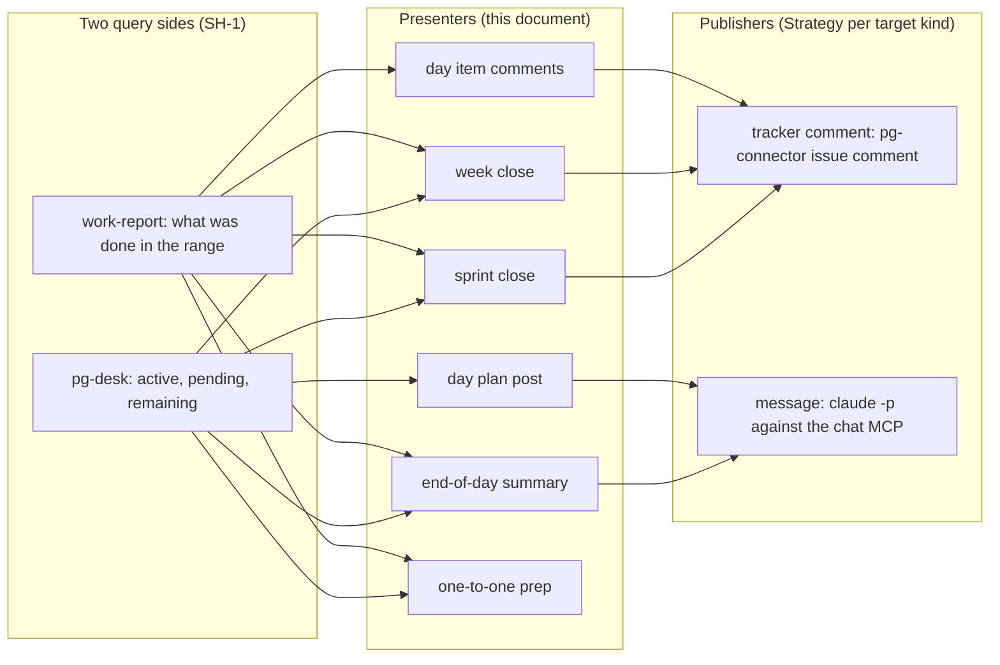
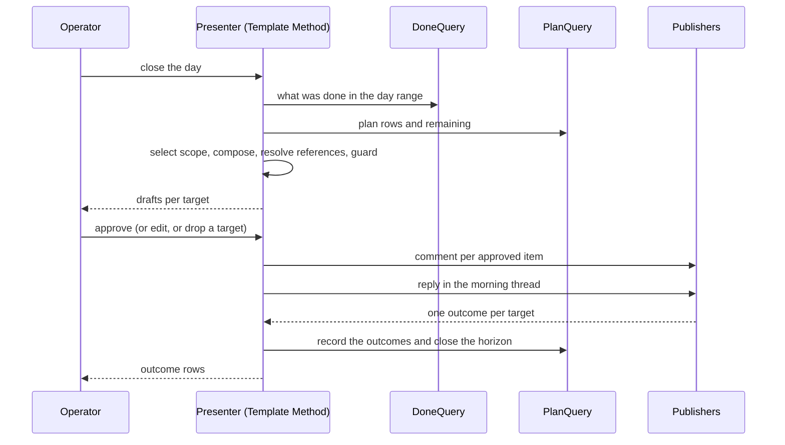

# Horizon reporting and posting: Presenters over what was done and what remains — design

- **Status**: Draft for operator review. Nothing here is implemented and no implementation bead is
  filed. Spec 2 of 5.
- **Date**: 2026-10-10
- **Bead**: `pg2-67it0` (tracking bead; it holds the operator rulings recorded in section 1)
- **Builds on**: spec 1, `docs/superpowers/specs/2026-10-10-planning-horizons-design.md` (the horizon
  lifecycle: `create`, `close`, `post`, and the shared rulings SH-1 to SH-3 and facts F-1 to F-3 of its
  section 2, which this document cites by id and does not repeat); the Phase 15 daily-focus design
  (`docs/superpowers/specs/2026-09-23-daily-focus-store-first-design.md`, D-F10 and G5); the work-tracker
  design (`docs/superpowers/specs/2026-09-23-work-tracker-design.md`) and work-report's behavior docs
  (`packages/work-report/docs/behavior/`); pg-connector's behavior docs
  (`packages/pg-connector/docs/behavior/interfaces.md`)
- **Siblings**: spec 3 availability, spec 4 escalations, spec 5 direct-ask sweep (same directory,
  same date prefix)

The key words MUST, MUST NOT, SHOULD, SHOULD NOT and MAY in this document are to be read as in RFC 2119.

This repository is public. The document names no employer, workspace, channel, project key or
person. Targets (a channel, a tracker project) are deployment configuration supplied at runtime.

## 0. Summary

| Question                          | Short answer                                                                                                                                                                                                                 |
| --------------------------------- | ---------------------------------------------------------------------------------------------------------------------------------------------------------------------------------------------------------------------------- |
| What are the reporting commands?  | Thin **Presenters** over two query sides: work-report (what was done) and pg-desk (what is active, pending and remaining) (SH-1). They own no data and no plan mutation; they compose, ask for approval, publish and record. |
| Which artifacts exist?            | Six: the morning day-plan post, the per-item day comments, the end-of-day summary reply, the week close, the sprint close, and one-to-one prep (section 2.2).                                                                |
| How is Slack written?             | Through `claude -p` against a working MCP, the pg-connector transport pattern (SH-2). There is no Slack API token, and no MCP tool sets a status or a reminder (F-2).                                                        |
| How are tracker comments written? | Through pg-connector's existing `issue comment` op, which the Jira backend already implements without an MCP. This reading of SH-2 needs the operator's confirmation (OQ-P1).                                                |
| Where is the line on bead ids?    | A tool post links shared artifacts and NEVER a bead id (PO-5). Enforced twice: the reference resolver omits bead-backed entities, and a fail-closed guard rejects any body that still carries one.                           |
| What is blocked?                  | Replying to the automated week, sprint, end-of-day and end-of-shift Slack threads (PO-4): there is no way to identify those threads yet.                                                                                     |
| What is NOT decided               | Fourteen open questions (section 10), chiefly: the transport for tracker comments, how a "lacks one" test is defined, how the morning post's thread is found again, and where the Presenter code lives.                      |



## 1. Rulings recorded

Verbatim intent of the operator's rulings, 2026-10-06 to 2026-10-10, as kept on the tracking bead.
SH-1 to SH-3 and F-1 to F-3 are in spec 1, section 2, and apply here in full.

| Id   | Ruling                                                                                                                                                                                                                                                                                                                                                                                           |
| ---- | ------------------------------------------------------------------------------------------------------------------------------------------------------------------------------------------------------------------------------------------------------------------------------------------------------------------------------------------------------------------------------------------------ |
| PO-1 | work-report decides what was done per day, week and sprint; nothing is copied into plans.                                                                                                                                                                                                                                                                                                        |
| PO-2 | Day close and post: a tracker comment on each item worked that day that lacks one. The end-of-day summary is a reply in the thread of the morning post.                                                                                                                                                                                                                                          |
| PO-3 | Week and sprint close and post: the tracker only, for now. Scope is report items union plan items union anything the operator owns that is In Progress in the tracker. Items with activity get an update; planned items with none get "no progress; next step; blocked on". Each parent gets ONE summary comment covering all its children. This replaces a separate weekly-epic-update command. |
| PO-4 | Later: replying to the automated chat threads (week, sprint, end-of-day, end-of-shift) is blocked on a way to identify those threads.                                                                                                                                                                                                                                                            |
| PO-5 | Cross-references: tool posts link shared artifacts (threads, tracker issues, PRs, commits) but NEVER a bead id. Beads may link out; only beads link to beads.                                                                                                                                                                                                                                    |

**The handbook.** Where this document says "the handbook" it means the operator's private work handbook, whose appendix of planned tooling prompted this set. It is not in this repository. Statements sourced to it are defaults and context, never numbered rulings, and each is marked as such.

Rulings PO-1 to PO-5 are the bead's "Posting" block. The "Shape" block (SH-1, SH-2) is what makes
them implementable and is not restated.

## 2. Architecture

### 2.1 Presenter over two query ports

In design-pattern terms each reporting command is a **Presenter** (the passive-view presentation
role): it holds no state of its own beyond a run record, reads through two **query ports**, builds a
view model, and hands a rendered artifact to a **publisher port**. It never mutates a plan, never
decides what was done, and never writes a tracker itself (G5 and D-F10 of the Phase 15 design keep
tracker writes out of pg-desk; a Presenter is outside pg-desk).

| Port               | Adapter                                                                                                                                                                   | Contract                                                                                                                                                                                         |
| ------------------ | ------------------------------------------------------------------------------------------------------------------------------------------------------------------------- | ------------------------------------------------------------------------------------------------------------------------------------------------------------------------------------------------ |
| `DoneQuery`        | work-report's read boundary (`INTF-READ`, `INTF-REQUEST`): a range, optionally narrowed by label, source and type. It states the range it read and never triggers a pull. | Entries resolved latest-wins per identity. A range with no entries yields a report that says so, never an error (`INV-REPORT-RANGE-1`). A Presenter MUST NOT pull as a side effect of rendering. |
| `PlanQuery`        | pg-desk's `--json` output of the focus family (contract `pg-desk.focus/v1`) and its entity views.                                                                         | Plan rows of a horizon, their live facts, the candidates, and each item's links. Read-only.                                                                                                      |
| `CommentPublisher` | pg-connector's `issue comment` op (`{id, body}`), reached through the `pg-connector` CLI.                                                                                 | One tracker comment per call. No result payload today (section 5.3 notes what idempotence needs instead).                                                                                        |
| `MessagePublisher` | A NEW write capability on the chat connector, transported by `claude -p` against the chat MCP (SH-2). Section 6.                                                          | Post a message to a channel, or a reply into a thread. Returns the external identity of what it posted, or an outcome that says it could not.                                                    |

### 2.2 The artifacts

| Id  | Artifact              | Query sides      | Target                                                      | Moment                   | Ruling     |
| --- | --------------------- | ---------------- | ----------------------------------------------------------- | ------------------------ | ---------- |
| A-1 | Morning day-plan post | `PlanQuery` only | A team channel message                                      | Day `create` then `post` | SH-1       |
| A-2 | Day item comments     | `DoneQuery`      | One tracker comment per item worked that day that lacks one | Day `close`              | PO-2       |
| A-3 | End-of-day summary    | both             | A reply in the thread of A-1                                | Day `close`              | PO-2, SH-1 |
| A-4 | Week update           | both             | Tracker comments (items), one summary comment per parent    | Week `close`             | PO-3, SH-1 |
| A-5 | Sprint update         | both             | The same as A-4                                             | Sprint `close`           | PO-3, SH-1 |
| A-6 | One-to-one prep       | both             | Not stated (OQ-P10)                                         | On request               | SH-1       |

A-2 is the only artifact whose subject set comes from the done side alone. "Nothing is copied into
plans" (PO-1) is a hard direction rule: the done side informs artifacts and never writes a plan row.

### 2.3 Presenter as a Template Method

All six Presenters share one skeleton; each artifact overrides only the hooks. This is the same
Template Method shape as the horizon lifecycle of spec 1, one level down: the lifecycle's `close` step
"compose the artifact" and `post` step call a Presenter.

| Step | Kind of step | What happens                                                                                                                   |
| ---- | ------------ | ------------------------------------------------------------------------------------------------------------------------------ |
| 1    | fixed        | Resolve the horizon and its range (spec 1, section 3).                                                                         |
| 2    | fixed        | Query both sides as the artifact requires; record which sides were read and the range read.                                    |
| 3    | hook         | `selectScope`: which items the artifact covers (a Specification per artifact, sections 4 and 5).                               |
| 4    | hook         | `compose`: build the body for each target from the scope. MAY use an LLM for prose; the scope and the links are deterministic. |
| 5    | fixed        | `resolveReferences`: attach cross-reference links and apply the bead-id guard (section 7).                                     |
| 6    | fixed        | Show the drafts to the operator and obtain approval per target. Nothing is published before this step completes (PO-INV-1).    |
| 7    | hook         | `publish`: call the publisher port for each approved target.                                                                   |
| 8    | fixed        | Record each target's outcome (section 8) and print one outcome row per target, never a merged pass or fail.                    |



## 3. Invariants

- **PO-INV-1** A Presenter MUST NOT publish before the operator has approved the specific artifact.
  This is derived from the handbook's own steps ("approve its tracker comments", "draft the post for
  my approval") and is not a numbered ruling. It holds for unattended runs too: an event router MUST
  NOT trigger a publish that the operator has not approved.
- **PO-INV-2** A Presenter MUST NOT write a plan row, annotation or bead. It writes the run record and
  the post record (section 8) only.
- **PO-INV-3** A Presenter MUST read the done side through work-report's read boundary and MUST NOT
  derive "what was done" from the plan (PO-1).
- **PO-INV-4** A publish MUST be idempotent per target: a retry after a partial failure MUST NOT
  post a second comment or message for a target that already succeeded (section 8).
- **PO-INV-5** No published body may contain a bead id (PO-5, section 7). A violation fails closed.
- **PO-INV-6** A failed target MUST NOT block the other targets of the same run; the outcome is one row
  per target (the work-report pull-outcome convention, `INV-DEGRADE-1`).

## 4. Day close and the morning post

### 4.1 A-1, the morning plan post (`PlanQuery` only)

The morning post uses pg-desk only (SH-1). Its sections are a per-deployment template (a Strategy):
the handbook's default is today's one or two focus items with links, the reviews and asks owed, the
availability for the day, and what the operator is waiting on, from whom. Each section names its
source. A section whose source does not exist yet (asks owed need spec 5; availability needs spec 3
and the calendar) is OMITTED with a visible notice in the draft, never filled by an LLM guess.

The post's external identity (channel and message identity, plus a permalink if the transport returns
one) MUST be recorded (section 8) because A-3 needs it.

### 4.2 A-2, a tracker comment on each item worked that lacks one

- **Items worked** are the tracker issues that work-report's entries for the day range name, directly
  or through a link from a PR, commit or session entry to its tracker issue (the `jira` link relation
  of pg-desk's links). work-report decides this (PO-1).
- **Lacks one** is the test "has no comment by the operator dated inside the day range". This is the
  literal reading of "lacks one". The stale-In-Progress attention rule counts the operator's comment or status transition as an
  update (a field edit is a recorded gap there) (`docs/behavior/pg-desk/attention.md`, rule `issue.stale-in-progress`);
  whether the day close should use that wider definition is OQ-P3.
- **Work with no tracker issue.** A PR or commit with no resolvable issue yields no item comment. It
  appears in the A-3 summary only (OQ-P4 asks whether the Presenter should offer to create an issue).
- **The body** states what changed that day for that issue, from the entries, with links to the PRs,
  commits and threads that carry the detail. It never links a bead (section 7).

### 4.3 A-3, the end-of-day summary reply

PO-2: "a reply in the thread of the morning post."

- The Presenter looks up the recorded identity of A-1 for the day (section 8). If it finds none (the
  morning post was never published through this tool, or the transport returned no identity), it MUST
  NOT guess a thread. It shows the draft, says why there is no thread, and offers the operator two
  choices: supply the thread, or post a new message. Which is the default is OQ-P5.
- Sections, from the handbook, as a deployment template: what was done (work-report), what was not
  done and why, what is next, and any date that is changing, old and new (the last two from pg-desk
  and the operator's edit). "Not done, and why" is plan rows that are not finished plus the operator's
  reason, which the Presenter asks for rather than invents.
- It is a reply, so it is posted through `MessagePublisher` with a thread identity.

## 5. Week and sprint close

### 5.1 Scope (PO-3)

The scope of a week or sprint close is a Specification, the union of three:

```go
// InScope is satisfied by an issue that is a report item, a plan item, or owned and In Progress.
type InScope struct {
    Reported   Specification // tracker issues named by the done side over the horizon range
    Planned    Specification // tracker issues that are rows of the horizon's plan
    OwnedInWIP Specification // issues the operator owns whose status category is In Progress
}

func (s InScope) IsSatisfiedBy(i Issue) bool {
    return s.Reported.IsSatisfiedBy(i) || s.Planned.IsSatisfiedBy(i) || s.OwnedInWIP.IsSatisfiedBy(i)
}
```

"Owns" and "In Progress" use the existing definitions: the operator's configured identities and the
tracker's native status category `indeterminate` (the Phase 15 design, item (r) and `attention.md`).
The tracker is the only target for now (PO-3, "Jira only for now"); an in-scope item that is not a
tracker issue (a PR, a bead) is represented through its linked tracker issue, and one with none is
listed in the summary only (OQ-P6).

### 5.2 What each item and each parent receives

| Case                                                    | Comment                                                                                                                                                                                                             |
| ------------------------------------------------------- | ------------------------------------------------------------------------------------------------------------------------------------------------------------------------------------------------------------------- |
| In scope and the done side has activity for it in range | An update: what changed in the range, with links.                                                                                                                                                                   |
| In scope, planned, no activity                          | The fixed shape "no progress; next step; blocked on" (PO-3). The next step and the blocker come from the operator's edit at approval, seeded from pg-desk's facts (open blockers, links) and never invented. OQ-P7. |
| A parent (an epic) with at least one in-scope child     | ONE summary comment covering all its in-scope children (PO-3), in addition to the children's own comments. A parent with no in-scope child gets none.                                                               |
| An in-scope item with no parent                         | Its own comment only.                                                                                                                                                                                               |

The handbook's weekly epic update fields (status as on track, at risk or blocked; done since the last
update; next step and date; blockers; who is being waited on and since when) are the natural template
of the parent summary. Whether they are the template is OQ-P8. The status value is a judgment the
Presenter proposes and the operator sets at approval.

PO-3 states that this "replaces a separate weekly-epic-update command": no standalone command for it
is designed or to be built. The week close is that command's replacement.

### 5.3 Idempotence and re-runs

A tracker comment cannot be recalled by this tool. A re-run of the same close MUST therefore skip any
target whose post record says it succeeded (PO-INV-4). The `issue comment` op returns no payload
today, so a new comment's identity is not known to the tool; the record is keyed by the TARGET (the
horizon, the artifact and the issue), not by the comment's id. A restricted re-send is the operator's
explicit act (a flag naming the target).

## 6. The message publisher

### 6.1 Transport (SH-2, F-1, F-2)

`MessagePublisher` is a Strategy with one adapter today: `claude -p` against the chat MCP, the same
transport pattern `pg-connector-thread-slack` uses for reads. The transport has these rules:

- The child process MUST be launched in the context that carries the MCP configuration (F-1). That is
  a deployment setting (a working directory or an explicit MCP configuration path). The publisher MUST
  fail with a clear outcome, not post elsewhere, if the tool it needs is not present.
- The child MUST be restricted to the one or two MCP tools the post needs. The body to post is passed as
  DATA, delimited and labelled "post exactly this text", because it can contain text copied from
  tickets and messages that is untrusted as instructions.
- The publisher MUST read back (or otherwise confirm) what it posted when the MCP supports it, and
  MUST return the external identity of the message (OQ-P2: whether the send tool returns one is
  unverified).
- There is no Slack API token and none is introduced here (SH-2). "Unless that does not work" is
  honoured by the Strategy seam: a second adapter may be added if the MCP cannot do a job, and that is
  a decision for the operator at that time.
- Posts are subject to the exec deadline discipline of the connector layer: the call has its own
  deadline, never retries on a rate limit, and reports `truncated`-style partial outcomes honestly.

### 6.2 What no tool can do (F-2, F-3)

No chat MCP tool sets a status or a reminder (F-2). The tooling therefore cannot post a status and
does not pretend to; spec 3 consequently posts nothing to a status field. The document service's MCP
has no comment tools (F-3), so replying to a document comment is not designed here.

### 6.3 Draft versus send

Transcript evidence recorded on another bead (`pg2-qxatp`, an investigation of reminders, deferred) says the chat
MCP exposes a send tool, a send-draft tool and a schedule tool. That list came from transcripts, not
from the live server, and has not been re-verified. If a send-draft tool exists, a publisher that
creates a DRAFT for the operator to send would satisfy PO-INV-1 even more strongly. Whether to prefer
it is OQ-P9.

## 7. Cross-references and the bead-id rule (PO-5)

PO-5: tool posts link shared artifacts but NEVER a bead id; beads may link out; only beads link to
beads.

### 7.1 Two layers

1. **Reference resolution (prevention).** `resolveReferences` builds a post's links from the item's
   pg-desk links and the work-report entries. It includes an entity only if it is a shared artifact:
   a chat thread, a tracker issue that is not backed by the bead tracker, a PR, a commit. An entity
   that belongs to the bead tracker is omitted from the link list. The rule is structural (by entity
   type and backend), not a text match.
2. **Guard (detection).** After composition, a Specification `ContainsNoBeadId` runs over every body.
   It matches the configured bead id patterns. A match MUST fail the target closed: the body is not
   published, the offending token is named in the outcome, and the operator can edit and re-approve.
   The guard also covers LLM-composed prose, which no structural rule can see.

The bead id patterns are deployment configuration (a list of regular expressions). A default derived
from the beads backend's own id prefix is OQ-P11.

### 7.2 Direction

"Beads may link out" means a bead MAY carry a link to a posted artifact. This design does not require
the Presenter to write such a link; it only forbids the reverse direction in a post.

## 8. The post record

A Presenter needs to remember what it published: A-3 needs A-1's thread, and PO-INV-4 needs the
per-target outcome. This design proposes one table beside the Phase 15 focus tables (author's
proposal; whether it lives in the pg-desk store or in the Presenter's own state is OQ-P12):

```sql
-- One row per published target. Idempotence key: (focus_period_id, artifact, target_kind, target_ref).
CREATE TABLE focus_post (
    id              INTEGER PRIMARY KEY AUTOINCREMENT,
    focus_period_id INTEGER NOT NULL,      -- the horizon (spec 1)
    artifact        TEXT NOT NULL,         -- 'day_plan' | 'day_item' | 'day_summary' | 'week_item' | ...
    target_kind     TEXT NOT NULL,         -- 'message' | 'tracker_comment'
    target_ref      TEXT NOT NULL,         -- channel and thread, or the tracker issue key
    external_id     TEXT,                  -- the message identity, when the transport returns one
    permalink       TEXT,                  -- optional
    outcome         TEXT NOT NULL,         -- 'succeeded' | 'failed' | 'skipped'
    reason          TEXT,
    posted_at       TEXT NOT NULL,
    run_id          TEXT NOT NULL,
    UNIQUE (focus_period_id, artifact, target_kind, target_ref),
    FOREIGN KEY (focus_period_id) REFERENCES focus_period (id)
);
```

Writing this table is a store write, not a tracker write, so it does not touch G5.

## 9. Blocked and deferred

| Item                                                                               | State                                                                                                                                                                                                                                                                                                                                                                                       |
| ---------------------------------------------------------------------------------- | ------------------------------------------------------------------------------------------------------------------------------------------------------------------------------------------------------------------------------------------------------------------------------------------------------------------------------------------------------------------------------------------- |
| Replying to the automated week, sprint, end-of-day and end-of-shift threads (PO-4) | BLOCKED on a way to identify those threads. Not designed. Candidate directions for whoever unblocks it, not decisions: a channel search by the bot's identity and a time window through the chat MCP; the deterministic thread list of `docs/superpowers/specs/2026-10-07-deterministic-slack-thread-list-design.md`, which is itself conditional on a token that is currently unavailable. |
| Posting to chat targets other than A-1 and A-3 from a week or sprint close         | Not ruled. PO-3 says tracker only, for now.                                                                                                                                                                                                                                                                                                                                                 |
| Announcing a shipped milestone                                                     | A handbook step, not in the rulings. Not designed here.                                                                                                                                                                                                                                                                                                                                     |

## 10. Open questions for the operator

| Id     | Question                                                                                                                                                                                                                  | Default if unanswered                                                                                            |
| ------ | ------------------------------------------------------------------------------------------------------------------------------------------------------------------------------------------------------------------------- | ---------------------------------------------------------------------------------------------------------------- |
| OQ-P1  | SH-2 says posting goes through `claude -p` against a working MCP "unless that doesn't work". The Jira backend already writes comments through its own CLI with no MCP. Does SH-2 intend the MCP for tracker comments too? | Use the existing `issue comment` op (a working path, and the one the Phase 15 day close already assumes, D-F10). |
| OQ-P2  | Does the chat MCP's send tool return the message identity (a timestamp, a permalink) the end-of-day reply needs? Unverified.                                                                                              | None. If not, A-3 needs another way to find the thread (a search after posting) or cannot be a reply.            |
| OQ-P3  | "Lacks one": only a comment by the operator dated in the day, or any update (a comment or a status transition) as the stale rule counts?                                                                                  | Comment only (the literal reading).                                                                              |
| OQ-P4  | Work with no tracker issue: leave it to the summary, or offer to create an issue (the handbook says anything over about an hour gets one before it starts)?                                                               | Summary only; no issue creation by a Presenter.                                                                  |
| OQ-P5  | No recorded morning post: new message, or stop and ask?                                                                                                                                                                   | Stop and ask.                                                                                                    |
| OQ-P6  | A week or sprint scope member with no tracker issue: summary only, or an offer to link it to an issue?                                                                                                                    | Summary only.                                                                                                    |
| OQ-P7  | Where does the "next step" and "blocked on" text of a no-progress item come from: the operator at approval, or an LLM draft from the item's history?                                                                      | The operator at approval, seeded with pg-desk facts.                                                             |
| OQ-P8  | Is the handbook's weekly epic update (status, done, next step and date, blockers, waiting on whom) the template of the parent summary comment?                                                                            | Yes, as a replaceable per-deployment template.                                                                   |
| OQ-P9  | Prefer a send-draft tool over a send tool if the MCP has one?                                                                                                                                                             | Prefer the draft, pending a live check of the tool list.                                                         |
| OQ-P10 | One-to-one prep (A-6): what does it produce and where does it go (a document, a note, a terminal)? PO-1 and SH-1 name it a consumer of both sides and say nothing else.                                                   | None. Blocks A-6.                                                                                                |
| OQ-P11 | Where do the bead id patterns of the guard come from?                                                                                                                                                                     | Deployment configuration, with the beads backend's id prefix as a documented example.                            |
| OQ-P12 | Where does the post record live: the pg-desk store (a `focus_post` table) or the Presenter's own state?                                                                                                                   | The pg-desk store, beside `focus_run`, so `doctor` and metrics can see it.                                       |
| OQ-P13 | Where does Presenter code live? Not in pg-desk (G5), not in work-report (it must not write). A small deterministic CLI that command prose calls, or command prose alone?                                                  | A small deterministic CLI for the fixed steps and the guard, with command prose for the LLM-composed text.       |
| OQ-P14 | May a Presenter be run by the event router on a schedule to PRODUCE drafts (never to publish, PO-INV-1)?                                                                                                                  | Yes for drafts, never for publish.                                                                               |

## 11. Test plan (the minimum)

Per the repository rule that deterministic behavior has an automated test against the real tool in a
hermetic environment:

1. **Scope Specification** (`InScope`): each of the three members alone, the union, a duplicate across
   members counted once, an owned In Progress issue with no activity and no plan row.
2. **No bead id (PO-5)**: a link list built from a fixture whose entities include a bead-backed one
   omits it; the guard rejects a body with a bead id in prose, in a URL and in a code span, and the
   outcome names the token; a clean body passes. A negative control proves the guard actually runs.
3. **Approval gate (PO-INV-1)**: the publisher is never called before approval; a dropped target is
   never published.
4. **Idempotence (PO-INV-4)**: a run that fails on target two of three, then re-runs, publishes only
   targets two and three and never target one again.
5. **Per-target outcome (PO-INV-6)**: a failed target does not block the others and the run prints one
   row per target.
6. **Done side only (PO-INV-3)**: the done query is the only input to A-2's subject set; changing the
   plan does not change it.
7. **Day close**: an item worked with an operator comment that day gets none; an item without one
   gets one; a PR with no issue yields no comment and appears in the summary.
8. **Week close**: a parent with two in-scope children gets exactly one summary comment; a planned
   item with no activity gets the fixed no-progress shape.
9. **Transport**: against a loopback fake of the child process, the publisher restricts the tool list,
   passes the body as delimited data, and returns a clear outcome when the tool is absent (F-1).

Behavior documents: the pg-connector behavior docs (`interfaces.md`, the op catalog) gain the new
message-write op in the same change that implements it, with a conformance fixture, as the existing
capabilities have.

## 12. Alternatives considered

| Alternative                                                           | Verdict                                                                                                                                      |
| --------------------------------------------------------------------- | -------------------------------------------------------------------------------------------------------------------------------------------- |
| Put posting in pg-desk (`focus close` writes comments)                | Rejected by G5 and D-F10 of the Phase 15 design: pg-desk executes no tracker write verb.                                                     |
| A separate weekly-epic-update command                                 | Rejected by PO-3: the week close replaces it.                                                                                                |
| Copy the done side into the plan so the plan can be posted from alone | Rejected by PO-1: nothing is copied into plans.                                                                                              |
| A Slack API client with a token                                       | Out: there is no token (SH-2).                                                                                                               |
| Strip bead ids with a regular expression only                         | Rejected as the sole layer: prevention by entity type is stronger and the text guard exists to catch what prevention cannot see (LLM prose). |
| Publish automatically after an unattended draft                       | Rejected by PO-INV-1.                                                                                                                        |
