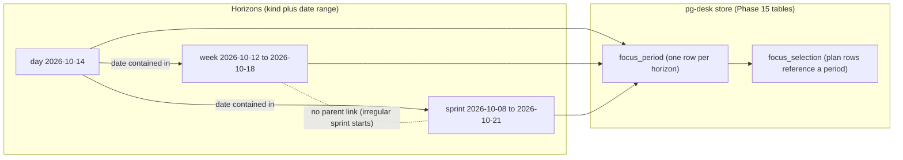
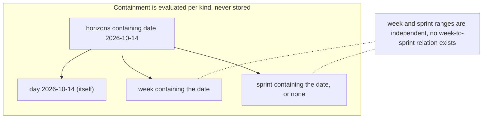
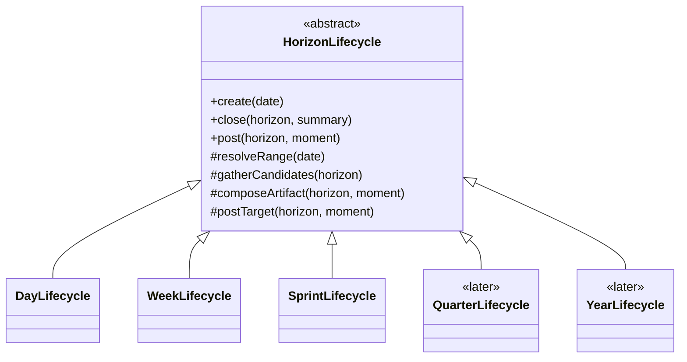
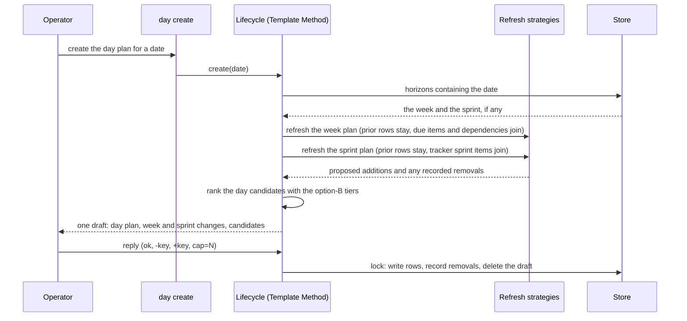

# Planning horizons: day, week and sprint plans on the store-first focus model — design

- **Status**: Draft for operator review. Nothing here is implemented and no implementation bead is
  filed. This is the FIRST of five design specs written under one tracking bead (the set is listed
  in "The spec set" below).
- **Date**: 2026-10-10
- **Bead**: `pg2-67it0` (tracking bead for the five specs; it holds the operator rulings of
  2026-10-06 to 2026-10-10 that this set records)
- **Follow-on to**: `docs/superpowers/specs/2026-09-23-daily-focus-store-first-design.md` (the "Phase
  15 design"; its own bead is `pg2-2j5ac.27`). This document is a FOLLOW-ON, not an amendment: it
  edits no sentence of the Phase 15 design, and every Phase 15 rule stays authoritative for the day
  horizon until the operator rules on the touch points of section 1.3.
- **Related**: ADR 0087 (`docs/adr/0087-daily-focus-rank-is-a-read-time-pg-desk-view.md`); the entity
  change flow design (`docs/superpowers/specs/2026-09-29-entity-change-flow-design.md`, ADR 0077);
  the work-tracker design (`docs/superpowers/specs/2026-09-23-work-tracker-design.md`) and
  work-report's behavior docs (`packages/work-report/docs/behavior/`); the attention evaluator
  design (`docs/superpowers/specs/2026-10-05-pg-desk-attention-evaluator-and-connector-refresh-cache-design.md`).

The key words MUST, MUST NOT, SHOULD, SHOULD NOT and MAY in this document are to be read as in RFC 2119.

This repository is public. The document names no employer, workspace, channel, project key or
person. Every deployment-specific value (a tracker project, a sprint query, a time zone) is supplied
at runtime by the consuming flake. "The operator" is the one person this tooling serves.

## The spec set

| #   | Spec                                                              | File                                      |
| --- | ----------------------------------------------------------------- | ----------------------------------------- |
| 1   | Planning horizons (this document)                                 | `2026-10-10-planning-horizons-design.md`  |
| 2   | Horizon reporting and posting                                     | `2026-10-10-horizon-posting-design.md`    |
| 3   | Availability (away, busy, available)                              | `2026-10-10-availability-state-design.md` |
| 4   | Escalations (reminders as menu-bar attention)                     | `2026-10-10-escalations-design.md`        |
| 5   | Direct-ask sweep (asks that need an answer, an ETA or a redirect) | `2026-10-10-direct-ask-sweep-design.md`   |

The order is the operator's ("tool order is fine", 2026-10-10). Spec 2 depends on this one (it posts
what a horizon closes), spec 4 on spec 5 through the attention feed, and spec 3 stands alone. Rulings and facts that apply to the whole set are recorded once, in section 2 below, and the
later specs cite them by id.

## 0. Summary

| Question                                 | Short answer                                                                                                                                                                                                                                             |
| ---------------------------------------- | -------------------------------------------------------------------------------------------------------------------------------------------------------------------------------------------------------------------------------------------------------- |
| What is a horizon?                       | A kind plus a date range. Day, week and sprint now; quarter and year later (PH-1).                                                                                                                                                                       |
| How do horizons relate?                  | By date containment, never by a foreign key. A day belongs to a week AND a sprint; a week is NOT a child of a sprint, because sprints have irregular starts (PH-2). The relation is a Specification evaluated over ranges.                               |
| Where do plans live?                     | In the Phase 15 tables. A horizon is a `focus_period` row (an entity with an id) and a plan row is a `focus_selection` reference to it, exactly as the operator ruled for the day (RV-B of the Phase 15 design). One additive migration adds ranges.     |
| What are create, close and post?         | Three Template Methods on an abstract horizon lifecycle. The skeleton is fixed; the range, the candidate source, the summary and the post target are per-kind hooks (PH-1, section 4).                                                                   |
| When is a week or sprint plan refreshed? | Only at planning time, never as tasks complete (PH-3). Creating a day plan re-checks the week plan and the sprint plan: prior items stay unless explicitly removed (the removal is recorded) and due items plus their transitive dependencies join.      |
| How does the day plan rank?              | Option B (PH-4): overdue, started, in the week plan, in the sprint plan, the rest. Inside each tier the existing D-F11 keys apply, unchanged.                                                                                                            |
| What is NOT decided                      | Seven touch points against the Phase 15 text, six collisions and one check (section 1.3), and sixteen open questions (section 10). The most important: where the "removal is recorded" ruling stores its record, given the Phase 15 "no history" ruling. |



## 1. Relationship to the Phase 15 design

### 1.1 What this design inherits unchanged

| Phase 15 element                                                                                                                                           | Used here as                                                                                  |
| ---------------------------------------------------------------------------------------------------------------------------------------------------------- | --------------------------------------------------------------------------------------------- |
| D-F4: `period_type` column, "schema-ready only" for week and sprint                                                                                        | the generalization point; this document is the design that makes it real                      |
| D-F6, section 5: `focus_period`, `focus_selection`, `focus_draft`, `focus_run`                                                                             | the storage; one additive migration (section 7)                                               |
| D-F11: candidate set, slot rule, started rule, tier and key order                                                                                          | the rank inside each option-B tier                                                            |
| D-F22, RV-A: draft, lock, `replan`; the single stored `focus_draft` row; reply grammar `ok`, `-key`, `+key`, `cap=N`                                       | the planning cycle every horizon uses                                                         |
| D-F18: rank drift never removes a row; a finished item stays, marked `finished`, uncounted toward the cap                                                  | the "plans are not updated as tasks complete" ruling (PH-3) is the same idea at every horizon |
| RV-B: "a day or week or sprint is an entity with an id, so the act of assigning a unit of work ... shouldn't be anything more than a reference in a table" | the storage model                                                                             |
| G5 and D-F10: pg-desk executes no tracker write verb                                                                                                       | posting lives outside pg-desk (spec 2)                                                        |

The 2026-10-07 operator ruling that `week` and `sprint` period types were DEFERRED applied to Phase
15 ("no verb implements them and none is built this phase"). This document designs the later phase
that ruling reserved. It does not reverse the deferral.

### 1.2 What this design does not touch

The `PLAN`, `candidates` and `epics with children in play` blocks of a day draft, the minting
decider and the focus-bead hold and release rules (D-F12, D-F13, D-F16, D-F19), the exit-code scheme
(except as section 7.4 states), `focus explain`, and every day-horizon behavior not named in section
1.3.

### 1.3 Touch points: Phase 15 text that cannot coexist with these rulings as written

Each row is a place where the Phase 15 design, read literally, blocks a ruling recorded in section 2. The "proposal" column is the author's proposal and is NOT a ruling; each row stays open until the
operator decides (section 10 repeats them as questions). Until then the Phase 15 text governs the
day horizon and no week or sprint verb can be built.

| Id  | Phase 15 text                                                                                                                                                                                | Collision                                                                                                                                                                   | Proposal (author, not a ruling)                                                                                                                                                                                                                                |
| --- | -------------------------------------------------------------------------------------------------------------------------------------------------------------------------------------------- | --------------------------------------------------------------------------------------------------------------------------------------------------------------------------- | -------------------------------------------------------------------------------------------------------------------------------------------------------------------------------------------------------------------------------------------------------------- |
| T-1 | D-F18 and section 7.2 step 5: the first lock of a period deletes every `focus_selection` row of EVERY other period; `pull` into an empty period while another period holds rows is exit `1`. | A day plan locked on Tuesday would delete the week plan and the sprint plan. "A day belongs to a week AND a sprint" (PH-2) needs plans of different kinds to coexist.       | Scope "every other period" to "every other period of the SAME `period_type`". Only one plan per kind is current, which keeps RV-B ("only the current plan exists") true per kind.                                                                              |
| T-2 | D-F12, D-F18, section 5: the annotation `focus_selected` holds the maximum `period_key` over the entity's rows in every period.                                                              | Keys of different kinds are not comparable (a week key and a day key are both dates), and a week-plan row would make the decider mint a bead for an item no day plan names. | Define the annotation as a function of DAY rows only. Week and sprint rows never write it. The minting decider and ADR 0087 stay untouched.                                                                                                                    |
| T-3 | Section 7: every verb takes `--period day`, "the only implemented value"; `focus_draft` is one row (`id = 1`) holding one period.                                                            | The flag must accept the new kinds. One draft for all kinds follows from the operator's "we don't need multiple drafts".                                                    | Accept `day`, `week`, `sprint`. Keep the single draft row; its `period_type` and `period_key` already say which horizon it is for. A `create` of another kind replaces it (the operator is in one draft phase at a time).                                      |
| T-4 | Section 5: `focus_period` has `period_type`, `period_key`, `cap`, `closed_at`, `close_note` and no range.                                                                                    | Containment (PH-2) needs a start and an end for weeks and sprints.                                                                                                          | Add `range_start`, `range_end` and `label` columns (section 7.1). For a day they equal `period_key`.                                                                                                                                                           |
| T-5 | D-F11 and section 6: three tiers, overdue, started, not started.                                                                                                                             | PH-4 (option B) orders the not-started items by week-plan and sprint-plan membership.                                                                                       | Split the not-started tier into three sub-tiers (section 6). The overdue and started tiers are unchanged.                                                                                                                                                      |
| T-6 | D-F17 (superseded) and RV-B: no plan history; a strike deletes the row; the cause of a removal is "counted only in the run record".                                                          | PH-3 says a removal from a week or sprint plan "is recorded".                                                                                                               | Record removals as members of the run record (`focus_run.counts_json` already counts removals by cause) and, if the operator wants the record to outlive the run, as a per-period removal list. This is OQ-H1; it is the one place the two rulings pull apart. |
| T-7 | Section 7.4 and D-F10: `close` sets `closed_at` and `close_note`; `select` and `pull` on a closed period exit `6`.                                                                           | None. A closed week keeps the same semantics. Listed so the decomposition checks that a closed WEEK does not close its days (it does not).                                  | No change.                                                                                                                                                                                                                                                     |

## 2. Rulings and facts for the whole set

These are the operator's words from the tracking bead, recorded without interpretation. Dates are
2026-10-06 to 2026-10-10 unless the row says otherwise. Later specs cite these ids.

### 2.1 Shape (SH)

| Id   | Ruling                                                                                                                                                                                                                                                                     |
| ---- | -------------------------------------------------------------------------------------------------------------------------------------------------------------------------------------------------------------------------------------------------------------------------- |
| SH-1 | Reporting commands are thin Presenters over two query sides: work-report = what was done; pg-desk = active, pending and remaining. The end-of-day summary, the week post, the sprint post and one-to-one prep use both; the morning day create and post uses pg-desk only. |
| SH-2 | Posting goes through `claude -p` against a working MCP (the pg-connector pattern) unless that does not work. There is no Slack API token.                                                                                                                                  |
| SH-3 | Tool order for the five specs: planning horizons, posting, availability, escalations, direct-ask sweep ("tool order is fine", 2026-10-10).                                                                                                                                 |

### 2.2 Facts (F)

| Id  | Fact (as stated on the tracking bead)                                                                                            |
| --- | -------------------------------------------------------------------------------------------------------------------------------- |
| F-1 | The Slack and Atlassian MCP servers are scoped to one project checkout's MCP configuration, not to every session on the machine. |
| F-2 | Among the 19 observed Slack MCP tools there are none for status or reminders.                                                    |
| F-3 | The Google Drive MCP has no comment tools.                                                                                       |

F-1 matters wherever a spec says "through `claude -p`": the child process MUST be launched in the
context that carries the MCP configuration, which is deployment configuration and not something this
repository can know. F-2 and F-3 are why spec 3 posts nothing to a status field and spec 5 reads
document comments through the mail notifications instead of the document service.

### 2.3 Planning horizons (PH)

| Id   | Ruling                                                                                                                                                                                                                                                                                                                                                                           |
| ---- | -------------------------------------------------------------------------------------------------------------------------------------------------------------------------------------------------------------------------------------------------------------------------------------------------------------------------------------------------------------------------------- |
| PH-1 | A generic horizon is a kind plus a date range: day, week and sprint now; quarter and year later. Each has create, close and post (Template Method).                                                                                                                                                                                                                              |
| PH-2 | A day belongs to a week AND a sprint. A week is NOT a child of a sprint (sprints have irregular starts). Membership is by date containment (Specification).                                                                                                                                                                                                                      |
| PH-3 | Plans are NOT updated as tasks complete; they are refreshed at planning time. Creating a day plan re-checks the week plan: prior items stay unless explicitly removed (and the removal is recorded), plus items due this week and their transitive dependencies. The sprint plan works the same way and comes mainly from the tracker; additions are made in the tracker itself. |
| PH-4 | Ranking (option B): overdue, then started, then in the week plan, then in the sprint plan, then the rest. Inside each tier, the existing D-F11 keys apply.                                                                                                                                                                                                                       |

Rulings that belong to the other four specs (posting, availability, escalations, the sweep) are
recorded at the head of those specs.

## 3. Domain model

### 3.1 Horizon

A **horizon** is a value object: a kind, an inclusive civil date range, a key and an optional label.

| Field   | Meaning                                                                                                                      |
| ------- | ---------------------------------------------------------------------------------------------------------------------------- |
| `kind`  | `day`, `week`, `sprint` now; `quarter`, `year` later (PH-1). A closed set per release, widened by migration (section 7.1).   |
| `start` | First civil date of the range, inclusive, in the operator's configured time zone (`focus.time_zone` of the Phase 15 design). |
| `end`   | Last civil date of the range, inclusive. For a day, equal to `start`.                                                        |
| `key`   | The `period_key`: the start date formatted `YYYY-MM-DD` (OQ-H3 asks whether a sprint needs a tracker identifier instead).    |
| `label` | Optional human name (a sprint name). Display only; never an identity.                                                        |

A horizon is persisted as a `focus_period` row and referenced by plan rows. It owns no behavior of
its own beyond the range arithmetic; the behavior lives in the lifecycle (section 4).

### 3.2 Membership is a Specification

PH-2 says membership is by date containment. In design-pattern terms the relation is a
**Specification** over a horizon and a date:

```go
// Specification is the Specification pattern over (horizon, date).
// It never reads a stored parent link: containment is recomputed from ranges.
type Specification interface {
    IsSatisfiedBy(h Horizon, d civil.Date) bool
}

// ContainsDate is the one membership specification: start <= d <= end.
type ContainsDate struct{}

func (ContainsDate) IsSatisfiedBy(h Horizon, d civil.Date) bool {
    return !d.Before(h.Start) && !d.After(h.End)
}
```

The set of horizons that contain a date is the result of one query over `focus_period` ranges
(section 7.1), never a join on a stored parent id. Consequences, each of which a test pins:

- A day is contained by at most one week and at most one sprint at a time, and by neither when no such
  horizon exists. A day with no sprint (a gap between sprints) is valid; the "in the sprint plan" tier
  is then empty for that day.
- A week is not contained by a sprint and a sprint is not contained by a week. A week that straddles
  a sprint boundary is legal, and so is a sprint that starts on a Wednesday.
- Two horizons of one kind whose ranges overlap are an anomaly for weeks (calendar weeks partition
  time) and a possible data error for sprints. The specification MUST report the ambiguity rather
  than choose one silently (OQ-H4 asks what the lifecycle then does).



### 3.3 Where each kind's range comes from

| Kind    | Range source                                                                                                                                                                                                                                    | Status                       |
| ------- | ----------------------------------------------------------------------------------------------------------------------------------------------------------------------------------------------------------------------------------------------- | ---------------------------- |
| day     | The date itself, in `focus.time_zone`.                                                                                                                                                                                                          | Phase 15                     |
| week    | A calendar rule. work-report's range resolver already defines "this ISO week: Monday 00:00 through now" and "last week" (`packages/work-report/internal/rangespec/rangespec.go`); reuse is the default. Which weekday starts the week is OQ-H2. | OPEN (OQ-H2)                 |
| sprint  | The tracker. PH-3 says the sprint plan "comes mainly from" the tracker and has irregular starts, so the range cannot be computed. No pg-connector backend carries sprint dates today (the issue schema has no sprint field).                    | OPEN (OQ-H3): needs a source |
| quarter | A calendar rule, later.                                                                                                                                                                                                                         | Later (PH-1); not designed   |
| year    | A calendar rule, later.                                                                                                                                                                                                                         | Later (PH-1); not designed   |

## 4. The lifecycle: create, close, post as Template Methods

PH-1 asks for create, close and post "(Template Method)". An abstract `HorizonLifecycle` fixes the
order of the steps; a subclass per kind overrides only the hooks. The fixed steps are the Phase 15
mechanics (draft, lock, close) and are written once.



### 4.1 `create` (planning)

| Step | Kind of step | What happens                                                                                                                                                                                                     |
| ---- | ------------ | ---------------------------------------------------------------------------------------------------------------------------------------------------------------------------------------------------------------- |
| 1    | hook         | `resolveRange(date)`: the horizon's range (section 3.3).                                                                                                                                                         |
| 2    | fixed        | Get or create the `focus_period` row (Phase 15 section 5, "Consequence").                                                                                                                                        |
| 3    | fixed        | `refreshContaining(date)`: for every OTHER horizon that contains the date, run its planning-time refresh (section 5). For a day this re-checks the week plan and the sprint plan (PH-3). For a week, the sprint. |
| 4    | hook         | `gatherCandidates(horizon)`: the horizon's own candidate source (table below).                                                                                                                                   |
| 5    | fixed        | Rank with the Phase 15 rank plus the option-B tiers (section 6).                                                                                                                                                 |
| 6    | fixed        | Store the single draft (D-F22, RV-A) and present it.                                                                                                                                                             |
| 7    | fixed        | Lock with the reply (`select --apply`): write plan rows, delete the draft.                                                                                                                                       |

Per-kind hook for step 4:

| Kind   | Candidate source                                                                                                                                                                                                                                                              |
| ------ | ----------------------------------------------------------------------------------------------------------------------------------------------------------------------------------------------------------------------------------------------------------------------------- |
| day    | The Phase 15 candidate set, unchanged (D-F11, RV-C, RV-D).                                                                                                                                                                                                                    |
| week   | The week's existing plan, plus candidates whose due date falls inside the week range, plus their transitive dependencies (PH-3, section 5).                                                                                                                                   |
| sprint | The sprint's existing plan, plus the issues the tracker lists as in the sprint through a named, deployment-configured watch query (PH-3: "comes mainly from" the tracker). pg-desk offers no hand-add to the sprint plan, because "additions are made in the tracker itself". |

### 4.2 `close`

| Step | Kind of step | What happens                                                                                                                                                                            |
| ---- | ------------ | --------------------------------------------------------------------------------------------------------------------------------------------------------------------------------------- |
| 1    | fixed        | Guard: the horizon exists, is not future, and is not already closed with a different summary (Phase 15 section 7.4 exit codes).                                                         |
| 2    | fixed        | Gather the two query sides (SH-1): what was done in the range from work-report; what is active, pending and remaining from pg-desk. Nothing from the done side is copied into the plan. |
| 3    | hook         | `composeArtifact(horizon, "close")`: the Presenter for the kind (spec 2).                                                                                                               |
| 4    | fixed        | Operator approval of the composed artifact (spec 2 makes this a MUST for every external write).                                                                                         |
| 5    | hook         | `postTarget(horizon, "close")` then publish (spec 2). Tracker comments are written by the command layer through pg-connector, never by pg-desk (G5, D-F10).                             |
| 6    | fixed        | Write `closed_at` and `close_note`; delete the stored draft of the period (Phase 15 section 7.4).                                                                                       |

Closing a horizon does not close the horizons it contains or that contain it.

### 4.3 `post`

`post` publishes an artifact for a horizon. The rulings use the word twice: "the morning day create
and post uses pg-desk only" (a plan post, SH-1) and "day close/post", "week/sprint close/post" (a
close post). This document therefore reads `post` as the publish step parameterized by a **moment**,
`plan` or `close`, which `create` and `close` call, and which MAY also be invoked alone. Whether `post`
is also a standalone verb is OQ-H12. The artifact contents, targets, approval and idempotence are
spec 2.

## 5. Planning-time refresh

PH-3 has three parts: plans are not updated as tasks complete; they are refreshed at planning time;
and the refresh has a stated rule. The first part is a consequence of D-F22 and D-F18 that already
holds for the day (a finished item stays in the plan, marked `finished`, never removed). This section
states the second and third parts as a **planning-time refresh**, a Strategy per kind selected by the
horizon being refreshed.

### 5.1 Invariants

- **PH-INV-1** A week or sprint plan MUST NOT change except through a planning-time refresh that the
  operator locks, or an explicit operator edit (`-key`, `+key` where the kind allows it). A
  completion, a status change, a reassignment or a rank change MUST NOT add or remove a row.
- **PH-INV-2** A refresh MUST NOT remove a row the operator did not explicitly remove. A row whose
  item finished is shown `finished` and stays.
- **PH-INV-3** An explicit removal MUST be recorded (PH-3). Where the record lives is OQ-H1.
- **PH-INV-4** A refresh is idempotent: running it twice over unchanged inputs changes nothing and
  proposes nothing the second time.
- **PH-INV-5** Facts shown for a plan row (title, due date, priority, status) are read live; only the
  membership and the order are stored, as in D-F22.

### 5.2 Week refresh

Inputs: the week horizon `W`, its current plan `P`, the candidate set `C`, the issue-dependency
store and the clock.

1. Keep every row of `P` (PH-INV-2), except rows the operator removes in this refresh's reply, which
   are recorded (PH-INV-3).
2. Compute `Due = { c in C : due(c) in W.range and c is not finished }`.
3. Compute `Deps` as the transitive closure of the blocked-by relation over `Due`, restricted to
   active, non-terminal issues. This needs the issue-dependency hydration and the dependency index
   that the Phase 15 design already lists as prerequisite item (b) for its unblocks key; this
   document adds a second consumer for the same work and no new mechanism (OQ-H9).
4. Propose `(Due union Deps) minus P` for addition. Whether the additions apply at once or wait for
   the operator's lock is OQ-H5.
5. An item the operator removed from this horizon earlier SHOULD NOT be silently re-proposed by step
   2 or 3. This is the author's reading of why PH-3 says the removal "is recorded" and is NOT stated
   by the operator (OQ-H1).

### 5.3 Sprint refresh

PH-3: "The sprint plan works the same way and comes mainly from [the tracker]; additions are made in
[the tracker] itself."

1. Keep every row of the sprint plan (PH-INV-2), except explicit removals, recorded.
2. Propose the issues the tracker's sprint query lists that are not yet in the plan. This replaces the
   "due this week" step of the week refresh as the source of additions. Whether the transitive
   dependencies of sprint items are also pulled (the week rule does) is OQ-H6.
3. pg-desk exposes no `+key` for the sprint plan. A sprint item the operator wants is added in the
   tracker and arrives at the next refresh.
4. How an item the tracker removes from the sprint is treated (kept as a prior item, or recognized as
   an explicit removal and recorded) is OQ-H7.

### 5.4 Day create re-checks both



## 6. Ranking: option B

PH-4 orders the day's candidates by tier. Phase 15's D-F11 has three tiers: overdue, started, not
started. Option B keeps the first two and splits the third.

| Order | Tier               | Membership test                                                                               | Keys inside the tier                                                                         |
| ----- | ------------------ | --------------------------------------------------------------------------------------------- | -------------------------------------------------------------------------------------------- |
| 1     | overdue            | Due date before the addressed date (D-F11, unchanged).                                        | D-F11's overdue keys: started first, then most overdue, then unblocks, priority, age.        |
| 2     | started            | Not overdue and started (D-F11, seeds only, unchanged).                                       | D-F11's keys: due date inside the 7-day horizon, unblocks, priority, age, then kind and key. |
| 3     | in the week plan   | Not overdue, not started, and a row of the plan of the week that contains the addressed date. | The same D-F11 keys as tier 2.                                                               |
| 4     | in the sprint plan | Not in an earlier tier, and a row of the plan of the sprint that contains the addressed date. | The same D-F11 keys.                                                                         |
| 5     | the rest           | Everything else (D-F11's not-started tier).                                                   | The same D-F11 keys.                                                                         |

Notes:

- "In the week plan" and "in the sprint plan" are read by the containment Specification of section
  3.2 for the ADDRESSED date, not for today.
- An item in both plans ranks in tier 3. The tiers are lexicographic and there are no weights, as in
  D-F11.
- A finished row of a plan is not a candidate and does not rank (D-F22).
- The Strategy seam: the tier classifier is one function from (candidate, containing plans, clock)
  to a tier number. D-F11's comparator receives the tier first and is otherwise unchanged. A property
  test MUST pin that the order stays a strict weak order (transitive), as Phase 15 section 10.1
  requires.
- Ordering of a WEEK or SPRINT draft is not ruled. Default until the operator rules (OQ-H10): the
  D-F11 order with tiers 1, 2 and 5 only.

## 7. Store and verbs

### 7.1 Schema delta

Additive. Because the Phase 15 tables are not yet in production and ship in the entity change flow's
cutover block (Phase 15 section 5, "Where the tables are created"), the decomposition SHOULD fold
this delta into that block's DDL if the cutover has not shipped, and otherwise ship it as the next
migration step.

```sql
-- Range of the horizon, inclusive civil dates in focus.time_zone. For period_type = 'day' both
-- columns equal period_key. Existing day rows are backfilled from period_key.
ALTER TABLE focus_period ADD COLUMN range_start TEXT;
ALTER TABLE focus_period ADD COLUMN range_end   TEXT;
-- Display name of the horizon (a sprint name). Never an identity.
ALTER TABLE focus_period ADD COLUMN label       TEXT;

-- Containment lookups: the horizons of a kind whose range holds a date.
CREATE INDEX focus_period_range ON focus_period (period_type, range_start, range_end);
```

The Phase 15 `CHECK (period_type IN ('day', 'week', 'sprint'))` already admits the three kinds of this
design. Adding `quarter` and `year` later rewrites the table, because SQLite cannot alter a
`CHECK`; that rebuild is the cost of "later" and is accepted (PH-1).

### 7.2 Verbs

The six Phase 15 verbs (`show`, `select`, `replan`, `pull`, `close`, `explain`) gain no new names.
`--period` accepts `day` (default), `week` and `sprint`, and is no longer hidden from help once a
second value exists (Phase 15 section 7 already planned this). `--date` selects the horizon that
contains the date. `select` and `replan` print, below the addressed horizon's own plan, the changes
the refresh of section 5 proposes for the containing horizons, in one draft.

`pull` into a sprint plan is a usage error (exit `1`), because additions are made in the tracker.

### 7.3 The annotation and the decider

Per T-2, only the day horizon writes `focus_selected`, and the decider never sees a week or sprint
row. A day plan therefore continues to mint and hold beads exactly as Phase 15 sections 8 and 8.3
specify.

### 7.4 Exit codes and closed horizons

Unchanged from Phase 15 (`0` ok, `1` usage, `2` partial, `3` total failure, `6` period closed;
`4`, `5` and `7` stay unused). A closed week refuses `select` and `pull` for that week with exit `6`
and does not affect any day.

## 8. Observability, tests and documentation

### 8.1 Observability

Phase 15 D-F21 applies to every new verb path. The run record and the `/metrics` families gain a
`period_type` label; the run record gains a `refresh` object (rows kept, rows proposed, removals
recorded, per containing horizon). `doctor` gains a line per kind that reports a missing or ambiguous
containing horizon for today (a day with no sprint is informational, an overlap is a warning).

### 8.2 Test plan (the minimum; the decomposition expands it)

Per the repository rule that deterministic behavior lives in an automated test against the real tool
in a hermetic environment:

1. **Containment Specification**: weeks partition time (every date in exactly one week); a sprint
   that starts mid-week; a date in a gap between sprints; two overlapping sprints reported as
   ambiguous; a week that straddles a sprint boundary.
2. **Template Method conformance**: a table-driven test that every kind's `create`, `close` and
   `post` run the base steps in the same order and that a hook override cannot reorder them.
3. **Option-B ranking**: one test per adjacent pair of tiers (an overdue item over a started one, a
   started one over a week-plan one, a week-plan one over a sprint-plan one, a sprint-plan one over
   the rest), a test that an item in both plans ranks in the week tier, a test that the D-F11 keys
   still decide inside each tier, and the transitivity property test.
4. **Refresh**: prior rows stay when the operator says nothing; an explicit `-key` removes and is
   recorded; a completed item stays and is shown `finished`; refresh twice proposes nothing the second
   time; due items and their transitive dependencies are proposed; an item removed earlier is not
   re-proposed (if OQ-H1 is ruled that way).
5. **Plans coexist (T-1)**: locking a day plan leaves the week plan and the sprint plan untouched;
   locking a second day plan replaces only the day plan.
6. **Annotation (T-2)**: a week row alone never sets `focus_selected`.
7. **Closed horizon**: a closed week refuses `select` and `pull` with exit `6`, and its days are
   unaffected.

### 8.3 Behavior documents

`docs/behavior/pg-desk/focus.md` (the Phase 15 behavior document) gains the horizon vocabulary and
`INV-FOCUS-n` ids for: "a horizon is a kind and a date range", "membership is by containment, never a
stored parent", "a week or sprint plan changes only at planning time or by explicit edit", "an
explicit removal is recorded", and "plans of different kinds coexist". The behavior document is
edited in the same change that implements a rule, as the repository's behavior-docs principle
requires.

## 9. Not in this design

| Item                                                                                                                                                                  | Where it goes                                                                                                                                            |
| --------------------------------------------------------------------------------------------------------------------------------------------------------------------- | -------------------------------------------------------------------------------------------------------------------------------------------------------- |
| What a horizon posts, where, and how                                                                                                                                  | Spec 2 (`2026-10-10-horizon-posting-design.md`)                                                                                                          |
| Quarter and year plans                                                                                                                                                | Later (PH-1). The lifecycle subclass and a `CHECK` rebuild are the whole of the schema cost; the plan source is not designed.                            |
| A meeting-items tracker (capture items for the weekly meeting, next-sprint suggestions, retro and one-to-one topics, then pull, review and add them to meeting notes) | Named on the tracking bead as other planned tooling. Not designed in this set; a follow-up bead is suggested in the hand-off report.                     |
| `/daily-focus:create` pulling Slack, email and calendar as well as PRs and the tracker                                                                                | Named on the tracking bead. The candidate source for asks is spec 5; the calendar source is spec 3's listener. Wiring them into `create` is a follow-up. |
| Slack thread candidacy                                                                                                                                                | Out of scope of Phase 15 (its item (x)); unchanged here.                                                                                                 |

## 10. Open questions for the operator

Each question names what is blocked, the author's default where one is safe, and whether the answer
changes an interface or only an internal. None is answered here.

| Id     | Question                                                                                                                                                                                                                                                                                                                                                      | Default if unanswered                                                                                                                                |
| ------ | ------------------------------------------------------------------------------------------------------------------------------------------------------------------------------------------------------------------------------------------------------------------------------------------------------------------------------------------------------------- | ---------------------------------------------------------------------------------------------------------------------------------------------------- |
| OQ-H1  | PH-3 says an explicit removal "is recorded". RV-B says only the current plan exists and a strike deletes the row. Where is the removal recorded, and does the record also stop the next refresh from re-proposing the item? Options: the run record only (telemetry); a per-horizon removal list that lives while the horizon is open; a comment on the item. | The run record only, and no suppression of re-proposal. This satisfies "recorded" minimally and keeps RV-B whole. It will re-propose a removed item. |
| OQ-H2  | Which weekday starts a week, and do weekends belong to it?                                                                                                                                                                                                                                                                                                    | Monday through Sunday, as work-report's `week` range does.                                                                                           |
| OQ-H3  | Where do a sprint's start, end, name and identity come from? The issue schema carries no sprint field. Is the horizon key the start date or a tracker identifier?                                                                                                                                                                                             | None. Blocks the sprint horizon. A named watch query could list sprint issues, but the sprint's own dates need a source.                             |
| OQ-H4  | When two sprints (or two weeks) overlap a date, what does the lifecycle do: refuse, ask, or take the one with the later start?                                                                                                                                                                                                                                | Refuse and report the ambiguity.                                                                                                                     |
| OQ-H5  | Does a day `create` APPLY the week and sprint refresh additions at once, or only propose them in the draft and write them at the operator's lock?                                                                                                                                                                                                             | Propose in the draft and write at the lock, so every plan change is a visible operator act (the Phase 15 draft and lock model).                      |
| OQ-H6  | Does the sprint refresh also pull the transitive dependencies of sprint items, as the week refresh pulls them for items due this week?                                                                                                                                                                                                                        | No. PH-3 says "works the same way" but the sprint's additions "are made in the tracker itself".                                                      |
| OQ-H7  | An item the tracker removes from the sprint: is that an explicit removal (recorded) or does the prior row stay?                                                                                                                                                                                                                                               | The prior row stays and is shown `no longer in the sprint`; the operator strikes it.                                                                 |
| OQ-H8  | Do week and sprint plans have a cap line? The Phase 15 cap is a day concept.                                                                                                                                                                                                                                                                                  | No cap for week and sprint (`focus_period.cap` stays NULL).                                                                                          |
| OQ-H9  | The transitive-dependency step needs issue-dependency hydration and a reverse-edge index, both Phase 15 prerequisite item (b) and not yet built. Is week refresh allowed to ship without the dependency step until then?                                                                                                                                      | Yes, with a notice that dependencies were not added, counted in the run record.                                                                      |
| OQ-H10 | How are week and sprint drafts ordered?                                                                                                                                                                                                                                                                                                                       | D-F11 order with tiers 1, 2 and 5.                                                                                                                   |
| OQ-H11 | Which candidates count as "items due this week": only the Phase 15 candidate set (seeds and linked items), or any item the operator owns that has a due date in the range?                                                                                                                                                                                    | The Phase 15 candidate set.                                                                                                                          |
| OQ-H12 | Is `post` also a standalone verb, or only a step of `create` and `close`?                                                                                                                                                                                                                                                                                     | A step of both, plus the standalone form for a retry (spec 2 needs it for idempotent re-post).                                                       |
| OQ-H13 | The pg-task-focus design (`docs/superpowers/specs/2026-10-07-pg-task-focus-design.md`) already defines a `Period` of kind day, week or sprint for recurring checklists, with its own sprint dates. Should the two share one source of sprint dates?                                                                                                           | Yes, once a sprint source exists (OQ-H3); until then neither depends on the other.                                                                   |
| OQ-H14 | One draft for all kinds (T-3): is it acceptable that a week `create` replaces an unlocked day draft?                                                                                                                                                                                                                                                          | Yes, per the operator's "we don't need multiple drafts".                                                                                             |
| OQ-H15 | Does the minting decider ever act on a week or sprint row (T-2)? If the operator wants week-plan items to get focus beads, the annotation needs a per-kind form.                                                                                                                                                                                              | No. Only the day plan mints, per D-F4 ("beads stay reserved for agent-workable signals").                                                            |
| OQ-H16 | Landing: fold the schema delta into the entity change flow's cutover block, or ship it as the next migration step?                                                                                                                                                                                                                                            | The decomposition decides, as Phase 15 section 5 already says for its own tables.                                                                    |

## 11. Alternatives considered

| Alternative                                                   | Verdict                                                                                                                                                                                 |
| ------------------------------------------------------------- | --------------------------------------------------------------------------------------------------------------------------------------------------------------------------------------- |
| A week as a child of a sprint (a parent id on `focus_period`) | Rejected by PH-2. Sprints have irregular starts, so a week can straddle two sprints.                                                                                                    |
| A foreign key from a day to its week and sprint               | Rejected. It stores a derived fact and goes stale when a sprint's range is edited; containment is cheap to recompute.                                                                   |
| A new bead type per horizon (a week bead, a sprint bead)      | Rejected by D-F4 of the Phase 15 design and unchanged: a per-period bead convention does not generalize without new mechanism per level.                                                |
| A separate plan table per kind                                | Rejected. `focus_period` plus `focus_selection` already model "an entity with an id and references to it" (RV-B); a table per kind would duplicate the draft, lock and close mechanics. |
| Updating a plan as tasks complete                             | Rejected by PH-3.                                                                                                                                                                       |
| A weighted rank that blends plan membership with priority     | Rejected. D-F11 and PH-4 are strict lexicographic tiers with no weights.                                                                                                                |
