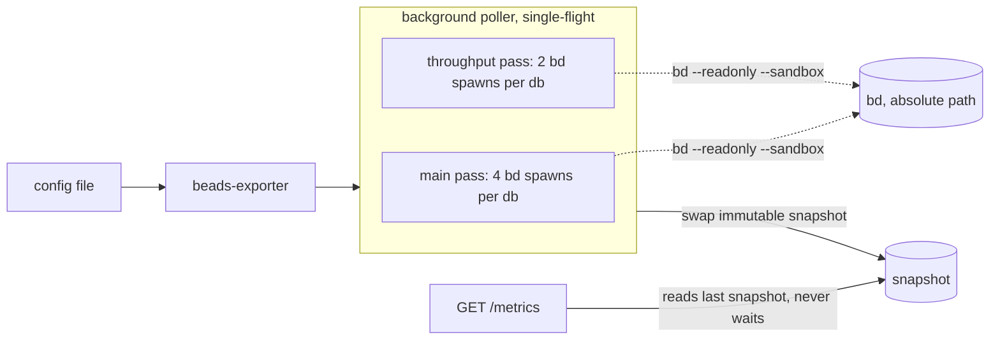

# beads-exporter

A Prometheus exporter for the content of bead trackers: how many beads are in each state, how
many each work queue offers, how old the oldest one is, and how much was created and closed in
the last day. It reads each configured database through a pinned, read-only `bd` and serves the
result as hand-rolled Prometheus text. The module has no dependencies outside the standard
library.

Design rationale and rejected alternatives: `docs/adr/0078-beads-content-exporter-ownership.md`
and `docs/adr/0079-queue-definitions-mirror-contract.md`.

## How it works



- A background poller builds an immutable per-database snapshot and swaps it in atomically. A
  scrape renders the last snapshot and never blocks on collection or sees a half-updated cycle.
- Each pass is single-flight: a cycle that overruns its interval makes the next tick skip rather
  than overlap.
- Databases are collected sequentially, and each database's result is published as soon as it
  finishes, so a slow database never withholds another database's series (beyond its own run).
- Each bd call is bounded by `commandTimeoutSeconds`; on expiry the whole process group is
  killed, so a forked grandchild cannot outlive the timeout.

## Running

```text
beads-exporter -config <file>         run the exporter
beads-exporter -check-config <file>   validate the file's schema and exit
beads-exporter -version               print the version (0.0.0-<8 hex digits>)
```

The exporter listens on `127.0.0.1:<port>` and serves `GET /metrics`. Logs are JSON lines on
stdout (`time` in UTC RFC 3339, lowercase `level`, `msg`, `service`).

Exit codes: `0` success, `1` unexpected error, `2` usage, `3` configuration invalid.

`-check-config` validates the schema only. It never stats a beads directory, the bd binary or the
Claude directory and never spawns a process, because it runs in the nix build sandbox where none
of those exist.

## Configuration file

JSON, one object. Unknown fields are rejected. Every field is required. This file is the seam to
the module that renders it and the machine wiring that validates the rendered file.

| Field                     | Type                   | Meaning                                                                                                                                                    |
| ------------------------- | ---------------------- | ---------------------------------------------------------------------------------------------------------------------------------------------------------- |
| `bdPath`                  | absolute path          | The bd binary. Always run by this path, never by `PATH` lookup.                                                                                            |
| `childPath`               | colon-separated paths  | The `PATH` of every bd child: the store paths of bash and coreutils. Every entry MUST be absolute. `git` is deliberately not on it.                        |
| `beadsDirs`               | object: name -> path   | One entry per database. The key is the database name (the `db` label value); the value is the absolute `.beads` directory, passed to bd as `BEADS_DIR`.    |
| `claudeDir`               | absolute path          | The Claude state directory. Accepted and validated here; used only by the stranded-claim pass.                                                             |
| `operatorNames`           | array of strings       | Actor names that identify the operator. May be empty. Used only by the stranded-claim pass.                                                                |
| `port`                    | integer, 1 to 65535    | The listen port on the loopback interface.                                                                                                                 |
| `pollIntervalSeconds`     | positive integer       | Period of the main pass.                                                                                                                                   |
| `strandedIntervalSeconds` | positive integer       | Period of the throughput pass (and of the stranded-claim pass).                                                                                            |
| `staleClaimHours`         | positive integer       | Accepted and validated here; used only by the stranded-claim pass.                                                                                         |
| `commandTimeoutSeconds`   | positive integer       | Bound on each bd call.                                                                                                                                     |
| `labelCap`                | positive integer       | How many bead labels get their own series (see `beads_not_closed_by_bead_label`).                                                                          |
| `queues`                  | array of queue objects | Each is exactly `{ "name": <string>, "args": [<string>...] }`: the tokenised flags that follow `bd ready`. Names are unique and match `^[a-z][a-z0-9-]*$`. |

Database names match `^[A-Za-z0-9][A-Za-z0-9_.-]*$`.

An example (synthetic values):

```json
{
  "bdPath": "/opt/example/bd/bin/bd",
  "childPath": "/opt/example/bash/bin:/opt/example/coreutils/bin",
  "beadsDirs": {
    "alpha": "/srv/alpha/.beads",
    "beta": "/srv/beta/.beads"
  },
  "claudeDir": "/srv/claude",
  "operatorNames": ["operator"],
  "port": 9100,
  "pollIntervalSeconds": 60,
  "strandedIntervalSeconds": 300,
  "staleClaimHours": 4,
  "commandTimeoutSeconds": 30,
  "labelCap": 20,
  "queues": [
    {
      "name": "drain-claim",
      "args": ["--exclude-label", "human", "--exclude-type", "epic"]
    }
  ]
}
```

### Queues

The queue list is the machine-readable mirror in `claude-marketplace/pb/queues.json` (see ADR
0079). Each queue's flags are classified when the configuration is loaded:

| Class       | Flags                                                                                                                                    | How it is evaluated                                                   |
| ----------- | ---------------------------------------------------------------------------------------------------------------------------------------- | --------------------------------------------------------------------- |
| client-side | only `--label` (bead has ALL), `--exclude-label` (bead has NONE), `--exclude-type`                                                       | filtered in process from the shared `bd ready` result; no extra spawn |
| spawn-only  | any other flag from the read-only allowlist: `--priority`, `--parent`, `--type`, `--assignee`, `--unassigned`, `--label-any`             | the exporter spawns `bd ready <args> -n 0` for that queue             |
| rejected    | anything else, such as `--claim` or `--include-deferred`, an unknown flag, a positional argument, a short flag or a flag missing a value | configuration loading fails                                           |

Comma lists and repeated flags are both accepted (`--label a,b` equals `--label a --label b`).
Templates are always dropped from a queue.

## Metrics

Every series carries `db`. Fixed label sets (`state`, `queue`, stored `status`) are zero-filled on
every successful pass. Timestamps are exported rather than ages, and a timestamp series is omitted
when its set is empty. When a pass fails for a database, that pass's series for that database are
dropped, not served stale. There is no `*_build_info` series.

| Family                                               | Type    | Labels                 | Pass       | Meaning                                                                                                                            |
| ---------------------------------------------------- | ------- | ---------------------- | ---------- | ---------------------------------------------------------------------------------------------------------------------------------- |
| `beads_issues`                                       | gauge   | `db`, `state`          | main       | Not-closed beads by derived state. The sum over `state` is the not-closed total.                                                   |
| `beads_issues_stored`                                | gauge   | `db`, `status`         | main       | Beads by stored status. Non-closed from the list; `closed` from `bd count`, which includes closed gates.                           |
| `beads_queue_candidates`                             | gauge   | `db`, `queue`          | main       | Beads currently claimable through each queue.                                                                                      |
| `beads_queue_oldest_timestamp_seconds`               | gauge   | `db`, `queue`          | main       | Creation time of the oldest candidate. Omitted when the queue is empty.                                                            |
| `beads_not_closed_by_type`                           | gauge   | `db`, `type`           | main       | Not-closed beads by issue type.                                                                                                    |
| `beads_not_closed_by_priority`                       | gauge   | `db`, `priority`       | main       | Not-closed beads by priority.                                                                                                      |
| `beads_not_closed_by_bead_label`                     | gauge   | `db`, `bead_label`     | main       | The `labelCap` most common labels; beads carrying any other label are counted once under `__other__`. Labels overlap: not a total. |
| `beads_oldest_timestamp_seconds`                     | gauge   | `db`, `state`          | main       | Creation time of the oldest not-closed bead per state (start time for `in_progress`). Omitted when the state is empty.             |
| `beads_created_last_24h`                             | gauge   | `db`                   | throughput | Beads created in the last 24 hours.                                                                                                |
| `beads_closed_last_24h`                              | gauge   | `db`                   | throughput | Beads closed in the last 24 hours.                                                                                                 |
| `beads_exporter_up`                                  | gauge   | `db`                   | main       | 1 if the last main cycle succeeded, 0 if it failed. Present once a main cycle has been attempted.                                  |
| `beads_exporter_pass_last_success_timestamp_seconds` | gauge   | `db`, `pass`           | all        | Time of the last success of each pass. Omitted until the pass has succeeded once; frozen while it fails.                           |
| `beads_exporter_collect_errors_total`                | counter | `db`, `pass`, `reason` | all        | Failures by pass and closed-enum reason. Never carries error text.                                                                 |
| `beads_exporter_collect_duration_seconds`            | gauge   | `db`, `pass`           | all        | Duration of the last run of each pass.                                                                                             |

The stranded-claim families are added by that pass and are not emitted here.

### Failure reasons

`stale_issues_jsonl`, `timeout`, `bd_error`, `schema_skew`, `parse_error`, `transcript_error`
(the last is only produced by the stranded-claim pass). The counter is zero-filled over the
reasons a pass can produce.

### States

Every not-closed bead is in exactly one state. The first matching rule wins:

| State         | Rule                                                               |
| ------------- | ------------------------------------------------------------------ |
| `in_progress` | stored `in_progress` or `hooked`                                   |
| `deferred`    | stored `deferred`, or `defer_until` strictly in the future         |
| `blocked`     | the id is in `bd blocked`, or the stored status is `blocked`       |
| `ready`       | the id is in `bd ready`                                            |
| `tracking`    | a type that `bd ready` never returns (`merge-request`, `molecule`) |
| `other`       | anything else (pinned, custom statuses, children held by a parent) |

The four bd calls of a cycle are not one snapshot, so a bead claimed mid-cycle can sit in the
wrong state for one cycle. "Not closed" means bd's default list view: it excludes gates,
ephemeral wisps, templates and custom statuses in the done or frozen categories.

### Label cap

The tie-break is deterministic: higher bead count first, then ascending label name. A bead
carrying several labels outside the kept set is counted once under `__other__`. A real label
literally named `__other__` is never its own series (it would collide with the remainder); its
beads fall into the remainder.

### Exposition format

Label values escape exactly backslash, double quote and newline; invalid UTF-8 is replaced with
U+FFFD (a run of bad bytes becomes one replacement character). Go `%q` is not used. `HELP` and
`TYPE` appear once per family, families in registry order, series sorted by label values. Values
are formatted without an exponent.

## The bd child environment

On every bd call the adapter re-asserts the complete child environment and inherits nothing from
the daemon:

- `HOME` (taken from the daemon's own `HOME`, which must be set), `PATH` (exactly `childPath`),
  `BEADS_DIR`, `BD_JSON_ENVELOPE=1`, `BEADS_DOLT_AUTO_START=0`, `BD_BACKUP_ENABLED=0`.
- Every call passes `--readonly --sandbox --json`. `-n 0` is passed to `list` and `ready` only
  (their default limits of 50 and 100 silently truncate); `blocked`, `count` and `statuses`
  reject `-n`.
- The JSON must be the `{data, schema_version}` envelope. A bare array, or a missing or unknown
  `schema_version`, is `schema_skew`.

### The stale-JSONL guard

If `$BEADS_DIR/issues.jsonl` exists in any form (file, directory, symlink or dangling symlink,
checked with `lstat`), the exporter does not invoke bd for that database that cycle and records
`stale_issues_jsonl`. A bd session that finds that file can import it over newer rows, so the
monitor must not provoke it. `issues.jsonl.disabled-*` is ignored. The next cycle recovers on its
own once the file is gone. The guard is never tested against a live store.

## Passes

A `Pass` has a name, the failure reasons it can produce, and a `Collect` function. The collector
gives each pass its own last-success timestamp, error counters and series, and drops only that
pass's series for only that database on failure. A new pass registers its metric families on the
registry and is added to the collector; nothing else changes.

| Pass         | Period                    | bd spawns per database                                                              |
| ------------ | ------------------------- | ----------------------------------------------------------------------------------- |
| `main`       | `pollIntervalSeconds`     | 4: `list`, `ready`, `blocked`, `count --by-status` (plus one per spawn-only queue)  |
| `throughput` | `strandedIntervalSeconds` | 2: `list --all --created-after <now-24h>` and `list --all --closed-after <now-24h>` |

The stored-status set is fetched with `bd statuses` once at start-up and again whenever a list
result contains a status not in the cached set.

## `metrics.txt`

`metrics.txt` is the committed list of metric families, one name per line, sorted. It equals the
union of the `# HELP` families across `testdata/*.prom` (a test enforces this), so a dashboard or
alert check can read it to prove every family it queries exists. Regenerate it, and the goldens,
with:

```text
cd packages/beads-exporter && go test ./internal/collect -update
```

## The bd contract suite

The suite (`internal/contract`, build tag `contract`) pins the bd behaviour this exporter relies
on against a real bd: client-side queues equal `bd ready <args> -n 0` (multi-label, comma lists,
exclude-type, templates, more than 100 ready beads); `--all --closed-after` returns a just-closed
bead and excludes gates; the default list excludes gates, wisps and templates; the exact set of
types `bd ready` never returns; `-n` is accepted by `list` and `ready` and rejected by `blocked`,
`count` and `statuses`; and the output envelope. It creates a throwaway embedded database with a
per-run unique prefix and FAILS unless that database is truly embedded (no `dolt_server_*` keys
in `metadata.json`).

```text
nix run .#beads-exporter-contract -- --bd /path/to/bd
nix run .#beads-exporter-contract -- --bd /path/to/bd --update --testdata packages/beads-exporter/testdata/bd
```

With `--update` it records `testdata/bd/*.json` (output shapes) and `testdata/bd/VERSION` (the bd
version pin).

The suite runs every bd child with the same `PATH` the real exporter's `childPath` carries: the
bash and coreutils store paths, no `git`. The `beads-exporter-contract` wrapper passes it as
`-child-path`, so `--bd` MAY point at a bd that is a shell wrapper (it needs bash and coreutils).
When the test binary is run directly without `-child-path`, the child `PATH` is an empty directory,
which only works for a bd that needs nothing on `PATH`.

### The bd flag and version check

`testdata/bd/VERSION` and `testdata/bd/flags.txt` (every flag the exporter can pass, as
`<subcommand> <flag>` lines) are data files. A check fails when a bd package reports a different
version than the pin, or lacks a recorded flag. A bd bump therefore fails the gate until the
contract suite is re-run with `--update` and the diff is reviewed.

The check is reusable against another bd package, from this flake's `lib` (here `agentSupport` is the flake input):

```nix
agentSupport.lib.mkBeadsExporterBdFlagsCheck {
  inherit pkgs;
  bd = someOtherBdPackage;
}
```

This repo runs it against its own bd as `checks.<system>.test-beads-exporter-bd-flags`. Go unit
tests keep `flags.txt` exactly equal to the flags the argv builders and the queue allowlist can
emit.

## The darwin module

`darwin/modules/beads-exporter` (option path `phillipgreenii.services.beads-exporter`) runs the
exporter as a launchd user agent and registers its scrape target, log source, dashboard and alert
rule file with the observability stack. It is active only when `enable` is set, the observability
stack is enabled and `dbs` is not empty; otherwise it defines nothing.

| Option                                                                                                   | Default                        |
| -------------------------------------------------------------------------------------------------------- | ------------------------------ |
| `enable`                                                                                                 | `false`                        |
| `package`                                                                                                | `pkgs.beads-exporter`          |
| `bdPackage`                                                                                              | none: the machine's `bd`       |
| `dbs` (`<name>.beadsDir`, an absolute path)                                                              | `{}`                           |
| `claudeDir`                                                                                              | none: required                 |
| `operatorNames`                                                                                          | `[]`                           |
| `port`                                                                                                   | `9146`                         |
| `pollIntervalSeconds`, `strandedIntervalSeconds`, `staleClaimHours`, `commandTimeoutSeconds`, `labelCap` | `120`, `600`, `6`, `30`, `500` |
| `internal.configFile` (read-only)                                                                        | the rendered config file       |

The configuration file is rendered with the queue list read at evaluation time from
`claude-marketplace/pb/queues.json` and a `childPath` of the bash and coreutils store paths (no
`git`). It is validated with `-check-config` when it is built, and the agent's wrapper script
references it, so a configuration-only change restarts the agent. The wrapper sets `HOME`,
`BD_JSON_ENVELOPE=1`, `BEADS_DOLT_AUTO_START=0`, `BD_BACKUP_ENABLED=0` and an explicit `PATH`.
Standard output (JSON lines) goes to `$XDG_STATE_HOME/beads-exporter/beads-exporter.jsonl`, which
the log source picks up; both log files are rotated by the launchd log manager.

## Dashboard and alert rule

- `grafana/beads.json`: the "Beads / Queues & backlog" dashboard (uid `beads`, folder "Claude
  Agents"). Queue tiles are per database and never summed across databases.
- `grafana/alerting/alerts.yaml`: the `beads-collect-failing` rule. It fires about 15 minutes after
  a database's last successful collection and is suppressed while the database probe reports the
  server, or that database, down.
- Checks: `test-beads-exporter-dashboard` (a `jq` lint against `metrics.txt` plus mutant
  self-tests, `check-dashboard.sh`), `test-beads-exporter-alert-rules` (Grafana-only fields plus
  `promtool test rules`, cases in `grafana/alerting/rule-tests/`, `check-alert-rules.sh`) and
  `test-beads-exporter-darwin-module`.

## Development

```text
cd packages/beads-exporter
go test -race ./...                       # unit suite (default gate)
go test ./internal/collect -update        # rewrite goldens and metrics.txt
```

Nix checks: `beads-exporter-go-tests`, `beads-exporter-golangci`, `beads-exporter-golangci-tagged`,
`beads-exporter-promtool-metrics`, `test-beads-exporter-bd-flags`, `test-beads-exporter-dashboard`,
`test-beads-exporter-alert-rules`, `test-beads-exporter-darwin-module`,
`test-beads-exporter-version-stamped` and `go-deps-wired`.
