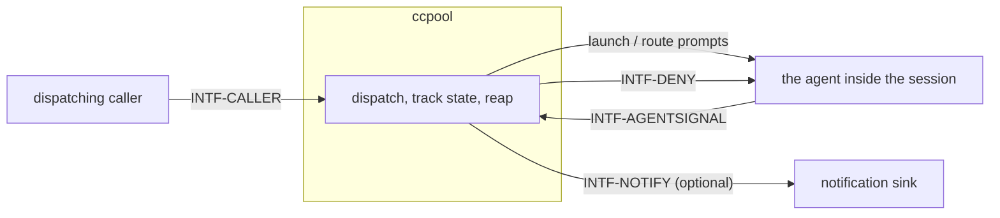

# ccpool — behavior docs

ccpool manages a **pool of long-lived agent sessions**: a caller dispatches prompts to named
sessions, bounces away, and picks them back up, while ccpool tracks each session's state, spares
anyone waiting on a person, and reaps the rest on its own schedule. This set follows the
behavior-docs method (`phillipgreenii-nix-agent-support · behavior-docs/docs/behavior`).

Start here, then the [glossary](glossary.md); the rules are in [invariants](invariants.md), the
boundaries in [interfaces](interfaces.md), the actors in [actors](actors.md), and the stories,
use cases, journeys in [journeys](journeys.md).

## The model

The diagram below **is** this set's interface inventory (`GOAL-7`) — not a data-flow diagram and
not a component diagram.

Each interface is classified on **two axes** — counterparty kind and essential-vs-optional
participation — per the method (`INV-8`); see [interfaces](interfaces.md).

**ccpool has no edge to any workflow product.** By design (`INV-13`, this set's own floor), ccpool
describes the agent-session runtime only: a session, its
state, its dispatch surface, its lifecycle. Anything about **why** a prompt was sent, whose work
it advances, or what happens after a reply is read is a workflow concern this set does not carry —
every clause this set states is restated at its own floor, never citing a workflow product's
vocabulary (`owner`/`role`/`item`/`claim`/`tracker`).

**Two state vocabularies, not one.** Store state is the last observed turn outcome, a fact;
reconciled state is what a session is doing right now, always re-derived on read. Confusing the
two is the single most common mistake this set exists to prevent — see [invariants](invariants.md)
`INV-STATE-1`.

**ccpool is not read-only either, in one narrow sense: it denies.** It never pushes a session's
status anywhere on its own (`INV-SESS-2`), but under autonomous mode it actively **denies** a
question the agent tries to ask, rather than merely observing that no one answered. That denial is
stated as its own interface (`INTF-DENY`), not folded into ordinary observation.

## Scope (extent + floor)

- **Extent (in)** — pool isolation and the machine-wide registry with its timer-driven sweep;
  session dispatch (wait, fire-and-forget, ingestion confirmation); the two state vocabularies and
  the six store states with what each obliges a consumer to conclude; the per-session status
  surface as a caller-read, never-pushed contract; session metadata as an opaque caller-owned KV;
  cancel, confirmed independent of any rendered affordance; autonomous mode's structural question
  denial; reap sparing a human-awaited session; trust and tool-consent pre-writing; the budget
  meter's intent; notifications.
- **Extent (out)** — the agent binary's own internal behavior; any workflow product built on top
  of ccpool (claims, roles, budgets-as-policy, work trackers); credential handling (the launched
  agent performs its own credential lookup; ccpool has no credential concern of its own); concrete
  transport, storage, and process mechanics — those are this package's own decision docs.
- **Floor** — ccpool speaks in pools, sessions, state, dispatch, metadata, and notifications —
  never in sockets, hook JSON, SQL columns, or subprocess names, and never in a workflow product's
  vocabulary borrowed without restating it at this set's own floor (`INV-20`).

## Realization gaps

This set's **realization-gap register** (`INV-23`): intended behavior this set's implementation
has not built yet, one row per gap, each keyed by the element id the gap is against. Not an open
question — the intent is settled and the build has not caught up (`INV-15`).

| Element       | Intended                                                                                    | Where the implementation stands                                                                                                                                                                                                            | Tracked by                                   |
| ------------- | ------------------------------------------------------------------------------------------- | ------------------------------------------------------------------------------------------------------------------------------------------------------------------------------------------------------------------------------------------ | -------------------------------------------- |
| `INV-SESS-1`  | the status surface carries a failure classification and diagnostic text alongside `errored` | the runtime already classifies a failing turn (transient failure / rate-limited / terminal) to drive its own in-place retry, and discards the classification once that retry path is exhausted — nothing persists it on the session record | bead filed at WS-3 landing (`pg2-wr6lm.6.2`) |
| `INV-METER-1` | ccpool serves a declared per-session consumption reading                                    | no consumption surface exists in ccpool today; the only implementation of a consumption meter lives in a caller, which this decision moves the ownership away from                                                                         | bead filed at WS-3 landing (`pg2-wr6lm.6.2`) |

## External references

This set follows the behavior-docs method and cites elements the method defines. It also cites
two elements pa-monitor's own set declares — the no-nudge opt-out contract this set implements
its side of, and the account-level usage surface its own meter is deliberately distinct from —
and it restates (rather than cites) the deployment-set clauses `pg2-wr6lm.7` routes to it, so no
row is declared for that set: nothing here is a citation of it, by design (`INV-20`, `INV-13`).

| Name           | What it is                                                                                                                            | Owner set-path                                                         | Owner UUID                                                                                                                                            |
| -------------- | ------------------------------------------------------------------------------------------------------------------------------------- | ---------------------------------------------------------------------- | ----------------------------------------------------------------------------------------------------------------------------------------------------- |
| `INV-3`        | every element carries a typed name and a stable UUID minted once at its definition                                                    | `phillipgreenii-nix-agent-support · behavior-docs/docs/behavior`       | [c44b760f-9baf-471a-8424-49984eb94ac7](https://github.com/phillipgreenii/nix-agent-support/blob/main/behavior-docs/docs/behavior/invariants.md)       |
| `INV-8`        | a cross-product interaction MUST be an explicit interface, classified by counterparty kind and by essential-vs-optional participation | `phillipgreenii-nix-agent-support · behavior-docs/docs/behavior`       | [67a79e92-2f98-40a2-9392-034a697e457e](https://github.com/phillipgreenii/nix-agent-support/blob/main/behavior-docs/docs/behavior/invariants.md)       |
| `INV-13`       | a set MUST make its scope explicit (extent + floor) and define all its actors and interfaces                                          | `phillipgreenii-nix-agent-support · behavior-docs/docs/behavior`       | [94285c70-da89-4402-8ae2-af27925008bd](https://github.com/phillipgreenii/nix-agent-support/blob/main/behavior-docs/docs/behavior/invariants.md)       |
| `INV-15`       | the behavior docs set is the source of truth; a realization gap is normal, not a defect                                               | `phillipgreenii-nix-agent-support · behavior-docs/docs/behavior`       | [375b542f-2a9f-4cfd-a77e-7aed45a416d5](https://github.com/phillipgreenii/nix-agent-support/blob/main/behavior-docs/docs/behavior/invariants.md)       |
| `INV-20`       | a borrowed term at a reference seam MUST be inherited or renamed, never silently redefined                                            | `phillipgreenii-nix-agent-support · behavior-docs/docs/behavior`       | [bafdd784-81ed-46fe-88f0-1a8c5fc4caf0](https://github.com/phillipgreenii/nix-agent-support/blob/main/behavior-docs/docs/behavior/invariants.md)       |
| `INV-22`       | traceability is a listing obligation on every story, use case and journey, not a coverage section                                     | `phillipgreenii-nix-agent-support · behavior-docs/docs/behavior`       | [b2502527-1340-4a1f-858c-aaa80c601317](https://github.com/phillipgreenii/nix-agent-support/blob/main/behavior-docs/docs/behavior/invariants.md)       |
| `INV-23`       | the realization-gap register is set-level, named `## Realization gaps`, and never an element                                          | `phillipgreenii-nix-agent-support · behavior-docs/docs/behavior`       | [f3bba3e7-440f-4109-a4de-9d37daa34bcf](https://github.com/phillipgreenii/nix-agent-support/blob/main/behavior-docs/docs/behavior/invariants.md)       |
| `GOAL-7`       | a set SHOULD show intent through examples                                                                                             | `phillipgreenii-nix-agent-support · behavior-docs/docs/behavior`       | [42ad1aa1-af11-4387-bf02-e0f028f80434](https://github.com/phillipgreenii/nix-agent-support/blob/main/behavior-docs/docs/behavior/invariants.md)       |
| `INTF-NONUDGE` | the no-nudge opt-out contract a co-resident monitor honors; ccpool is the implementer that sets its marker                            | `phillipgreenii-nix-agent-support · packages/pa-monitor/docs/behavior` | [7f6f582f-8261-4ae8-b39b-c76e8f027b36](https://github.com/phillipgreenii/nix-agent-support/blob/main/packages/pa-monitor/docs/behavior/interfaces.md) |
| `INTF-STATE`   | the co-resident monitor's account-level usage surface, distinct from ccpool's own per-session meter                                   | `phillipgreenii-nix-agent-support · packages/pa-monitor/docs/behavior` | [93bcbd55-729c-404f-ba79-2b0dd412c077](https://github.com/phillipgreenii/nix-agent-support/blob/main/packages/pa-monitor/docs/behavior/interfaces.md) |
