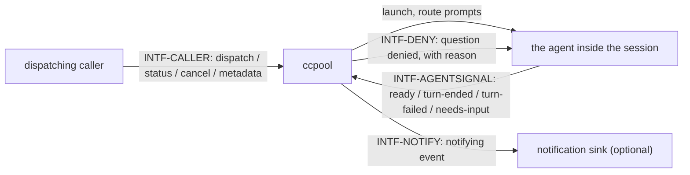

# Interfaces — ccpool

This file follows the interface convention of the behavior-docs method
(`phillipgreenii-nix-agent-support · behavior-docs/docs/behavior`): an **interface** is a boundary
described by **what crosses it** and **what must hold**, never _how_ it is implemented. See the
[glossary](glossary.md) for terms, [actors](actors.md) for who sits on each side,
[invariants](invariants.md) for the rules, and [journeys](journeys.md) for the flows that exercise
these interfaces.

The four interfaces are described on **two axes** — the **kind** of party on the far side, and
whether that party is an **essential or optional** participant in what ccpool exists to do:

| Interface          | Boundary                           | Counterparty (kind)                       | Participation           | Initiator |
| ------------------ | ---------------------------------- | ----------------------------------------- | ----------------------- | --------- |
| `INTF-CALLER`      | dispatch, status, cancel, metadata | `ACTOR-CCP-CALLER` (actor)                | essential, driving port | caller    |
| `INTF-AGENTSIGNAL` | the agent's own turn signals in    | the agent binary (owner)                  | essential               | agent     |
| `INTF-DENY`        | a question denial out to the agent | `ACTOR-CCP-AGENT` (actor)                 | essential               | ccpool    |
| `INTF-NOTIFY`      | a notifying event out              | notification sink (implementer, optional) | optional                | ccpool    |

`INTF-CALLER`, `INTF-AGENTSIGNAL` and `INTF-DENY` are **essential** — driving a session, learning
what it did, and denying it a question it cannot ask are all core to what ccpool is for.
`INTF-NOTIFY` is **optional** — ccpool functions with no adapter configured at all.

## `INTF-CALLER` — the dispatching caller's driving port <!-- uuid: f6597706-e22c-4168-a9ca-a1cb8752bbd0 -->

- **In (caller → ccpool), dispatch** — a prompt for a named session, with a mode: wait for the
  outcome, fire-and-forget, or fire-and-forget with ingestion confirmation
  (`INV-SESS-3`); optionally marked autonomous (`INV-AUTON-1`).
- **Out (ccpool → caller), dispatch reply** — the turn's outcome when waiting, or an immediate
  acknowledgement for fire-and-forget; a busy refusal when the target session is `working`
  (`INV-SESS-2`).
- **In/Out, status** — the caller reads a session's store state and reconciled state on demand
  (`INV-STATE-1`); ccpool never pushes either.
- **In, cancel** — interrupt the session's current turn; the session stays alive and idle
  afterward, distinct from closing it.
- **In/Out, metadata** — the caller sets and reads its own opaque key/value tags on a session;
  ccpool stores and returns them uninterpreted.
- **Guarantee** — a dispatch aimed at a `working` session is refused, never queued or dropped
  silently (`INV-SESS-2`).

## `INTF-AGENTSIGNAL` — the agent's own turn signals <!-- uuid: fb46d848-2b9f-4ef7-ad59-e9f9dac57256 -->

- **In (agent → ccpool)** — the agent binary's own signals for: ready to receive input, a turn
  ended, a turn failed, and awaiting input. ccpool is an **implementer** of this contract: it
  reacts to whichever signals the agent binary emits and states only its own obligations here,
  never restates the agent binary's own contract.
- **Guarantee** — every signal MUST be reflected in store state as one of the six values
  (`INV-STATE-2`) before any caller-visible read can observe it.

## `INTF-DENY` — question denial to the agent <!-- uuid: 1a3ba6e6-c94c-401f-80c3-f7a0017d9b2e -->

- **Out (ccpool → agent)** — under autonomous mode, a denial of an attempted question, carrying a
  reason, delivered before the question is ever posed to anyone (`INV-AUTON-1`).
- **Guarantee** — the denial MUST be reasoned, never bare — a bare refusal reads to the agent as
  "nobody is here," which invites giving up rather than adapting.

## `INTF-NOTIFY` — a notifying event out <!-- uuid: e820e45c-2e3c-401e-9b0c-fd1475b4c15a -->

- **Out (ccpool → sink)** — one event per transition into a notifying state, computed where every
  transition is observed (`INV-NOTIF-1`).
- **Guarantee** — ccpool emits the event and does not itself own delivery to a human; a
  misconfigured or absent sink MUST NOT be treated as an error in the transition itself.

## External references

The agent inside a session is a **consumed external contract with no behavior-docs set of its
own** (`INTF-AGENTSIGNAL`'s counterparty) — declared here in prose rather than in the imports
table below, which is reserved for elements another **behavior-docs set** defines.
