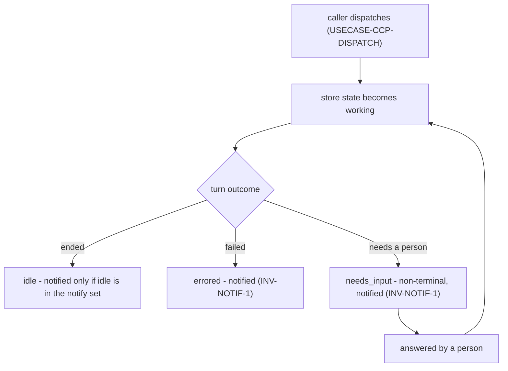
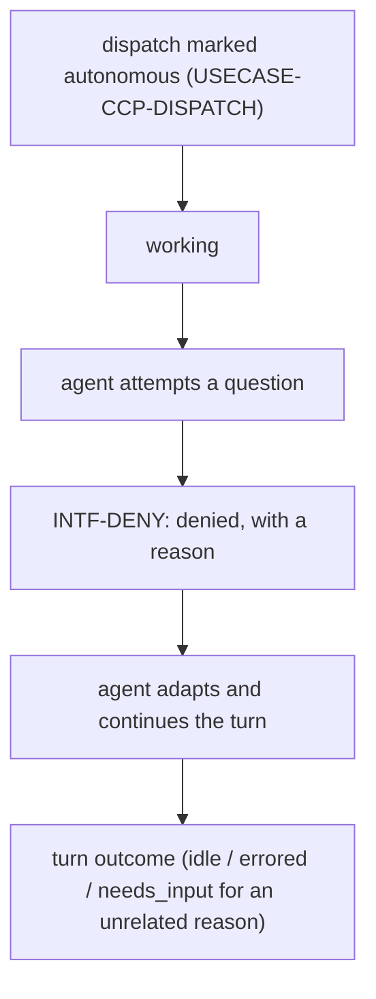
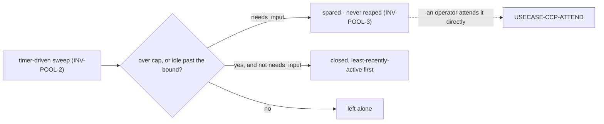

# Journeys — ccpool

Stories, use cases, and journeys, typed and leveled per the behavior-docs method's vocabulary
rules: **user-goal** and **subfunction** level elements are `USECASE-`; **summary**-level
multi-actor arcs stay `JOURNEY-`. Each element carries, on its own definition, what it requires and
what it includes (`INV-22`).

## Stories

- **`STORY-CCP-DISPATCH`** <!-- uuid: 3973a17c-9d47-49bd-bf96-a2f26e0867d6 --> — As a caller, I
  want to dispatch a prompt and get the reply, so I can drive a session without babysitting
  terminals. _(→ `USECASE-CCP-DISPATCH`; `INV-SESS-2`, `INV-STATE-2`.)_
- **`STORY-CCP-RESUME`** <!-- uuid: 1e9b31f6-9a3e-4053-9fe2-d599e234c857 --> — As a caller, I want
  to bounce away and pick a session back up by name later, so a lost connection never loses the
  conversation. _(→ `USECASE-CCP-DISPATCH`; `INV-TRUST-1`.)_
- **`STORY-CCP-ATTEND`** <!-- uuid: f6e0c6dd-7106-41f2-b230-a0c1a3fa8f08 --> — As an operator, I
  want to find and attend sessions that need a person, so nothing sits stuck waiting on a question
  nobody sees. _(→ `USECASE-CCP-ATTEND`; `INV-STATE-2`, `INV-POOL-3`.)_
- **`STORY-CCP-BOUNDED`** <!-- uuid: 8bce0ba1-f7d3-49d2-a555-0011e16cc48d --> — As an operator, I
  want the pool to stay bounded without me managing it, so idle sessions don't pile up while a
  session someone is expected to attend is never swept away underneath them.
  _(→ `JOURNEY-CCP-MAINT`; `INV-POOL-2`, `INV-POOL-3`.)_

## Use cases

### `USECASE-CCP-DISPATCH` — dispatch a prompt and wait for the reply <!-- uuid: a3cb7e4e-a4f4-4abb-b522-d273327e6477 -->

**Primary actor:** `ACTOR-CCP-CALLER`.
**Level:** user-goal.
**Preconditions:** a session name (existing or new).
_Requires:_ `INV-SESS-2`, `INV-STATE-2`, `INV-TRUST-1`.
_Includes:_ `USECASE-CCP-ENSURE`.

1. The caller dispatches a prompt to a named session, optionally marked autonomous.
2. ccpool ensures the session is live (`USECASE-CCP-ENSURE`), then delivers the prompt.
3. ccpool waits for the turn to end and returns the reply.

Extensions:

- 2a. The session is already `working`: the dispatch is refused as busy (`INV-SESS-2`); nothing
  is delivered.
- 3a. The turn ends in `needs_input`: the caller is told a question is pending, not a failure
  (`INV-STATE-2`).
- 3b. The turn ends in `errored`: the caller is told it failed, unclassified until `INV-SESS-1`'s
  gap closes.

### `USECASE-CCP-FIREFORGET` — dispatch without waiting <!-- uuid: 80ec29a6-cb3d-4b11-9e65-47c2dfe467fe -->

**Primary actor:** `ACTOR-CCP-CALLER`.
**Level:** user-goal.
**Preconditions:** a session name.
_Requires:_ `INV-SESS-3`, `INV-STATE-2`.
_Includes:_ `USECASE-CCP-ENSURE`.

1. The caller dispatches a prompt and asks not to wait, optionally demanding ingestion
   confirmation.
2. ccpool ensures the session is live, delivers the prompt, and — if confirmation was asked for —
   confirms the agent took it up before returning.
3. The caller reads the outcome later via `USECASE-CCP-STATUS`.

Extensions:

- 2a. Confirmation was asked for and the prompt was never taken up: reported as its own distinct
  outcome, never as busy or a plain timeout (`INV-SESS-3`).

### `USECASE-CCP-CANCEL` — interrupt the current turn <!-- uuid: 0c5400c6-98b7-4eb7-a4a2-32e68bd8e4b8 -->

**Primary actor:** `ACTOR-CCP-CALLER` (or `ACTOR-CCP-OP`).
**Level:** user-goal.
**Preconditions:** the session is `working`.
_Requires:_ `INV-STATE-1`.

1. The caller interrupts the session's current turn.
2. The session stops the turn and returns to idle, staying alive.

Extensions:

- 1a. The session is not `working`: reported as nothing to cancel.

### `USECASE-CCP-CLOSE` — close a session <!-- uuid: de5c6393-7c4b-4f0e-af9e-9489bab3d37e -->

**Primary actor:** `ACTOR-CCP-CALLER` (or `ACTOR-CCP-OP`).
**Level:** user-goal.
**Preconditions:** none.
_Requires:_ `INV-STATE-2`.

1. The caller asks to close a named session.
2. ccpool ends the session's runtime; the conversation remains resumable by the same name later
   (`USECASE-CCP-DISPATCH`, extension: resume).

### `USECASE-CCP-ATTEND` — find and attend a session that needs a person <!-- uuid: f6090740-ac93-43e6-8ad0-42734fdc5064 -->

**Primary actor:** `ACTOR-CCP-OP`.
**Level:** user-goal.
**Preconditions:** none.
_Requires:_ `INV-STATE-2`, `INV-POOL-3`.

1. The operator asks which sessions are in `needs_input`.
2. ccpool lists them; the operator attaches to one.
3. The operator answers the question directly in the session.

Extensions:

- 1a. None are in `needs_input`: reported as none pending.

### `USECASE-CCP-STATUS` — inspect a session's status <!-- uuid: 7c73ad30-a52d-4b20-be73-0cc72e41d690 -->

**Primary actor:** `ACTOR-CCP-CALLER` (or `ACTOR-CCP-OP`).
**Level:** user-goal.
**Preconditions:** the session exists.
_Requires:_ `INV-STATE-1`, `INV-SESS-1`, `INV-METER-1`.

1. The caller asks for a session's status.
2. ccpool returns store state, reconciled state, and — once realized — its consumption reading.

Extensions:

- 2a. The reconciled state disagrees with the last store state (e.g. the process died
  unobserved): both are returned, distinctly, per `INV-STATE-1`.

### `USECASE-CCP-META` — tag and query session metadata <!-- uuid: 5fe5ae39-0fb7-4c2a-afd7-7db44d439b6a -->

**Primary actor:** `ACTOR-CCP-CALLER`.
**Level:** user-goal.
**Preconditions:** none.
_Requires:_ `INV-SESS-4`.

1. The caller sets one or more key/value tags on a session, at dispatch or later.
2. The caller later reads a session's tags, or filters sessions by a tag value.

### `USECASE-CCP-ENSURE` — ensure a session is live <!-- uuid: 61d585c2-abce-44a8-a488-726c868745cd -->

**Primary actor:** none — invoked by another use case.
**Level:** subfunction — included by `USECASE-CCP-DISPATCH` and `USECASE-CCP-FIREFORGET`, which is
what makes it a subfunction rather than a goal of its own.
**Preconditions:** a session name.
_Requires:_ `INV-POOL-1`, `INV-TRUST-1`, `INV-CCPOOL-CWD-1`.

1. If the named session is already live, use it as-is.
2. Otherwise launch it — a fresh session if the name is new, or a resume if a record exists —
   pre-establishing isolation and trust before the launch (`INV-POOL-1`, `INV-TRUST-1`), and
   launching it in its working directory: the caller's explicit value for a brand-new session, or
   the previously recorded working directory for a resume (`INV-CCPOOL-CWD-1`).

## Journeys

### `JOURNEY-CCP-LIFE` — one prompt's life <!-- uuid: 13693924-e623-4f0e-820d-f8905b8e6b1f -->

**Actors:** `ACTOR-CCP-CALLER`, `ACTOR-CCP-AGENT`.
**Level:** summary.
**Intent:** tell the whole arc once — a prompt goes in, the turn runs, and the outcome reaches the
caller either by waiting or by a later read, with a notification on the way if warranted.
_Requires:_ `INV-STATE-1`, `INV-STATE-2`, `INV-SESS-1`, `INV-NOTIF-1`.
_Includes:_ `USECASE-CCP-DISPATCH`, `USECASE-CCP-STATUS`.

The caller learns the outcome either by waiting on the dispatch call or by a later
`USECASE-CCP-STATUS` read; ccpool never pushes the outcome to the caller on its own.

### `JOURNEY-CCP-AUTON` — the autonomous dispatch arc <!-- uuid: 9a5d5a0c-e1a6-4a88-b3da-9254c1d39304 -->

**Actors:** `ACTOR-CCP-CALLER`, `ACTOR-CCP-AGENT`.
**Level:** summary.
**Intent:** tell the whole arc once — a dispatch marked autonomous removes the agent's question
channel structurally, and the agent adapts rather than waiting on nobody.
_Requires:_ `INV-AUTON-1`, `INV-STATE-2`, `INV-NOTIF-1`.
_Includes:_ `USECASE-CCP-DISPATCH`.

A denial is not a `needs_input` transition — the question was never posed. A session denied a
question MAY still separately enter `needs_input` afterward for a reason unrelated to that denial.

### `JOURNEY-CCP-MAINT` — the pool maintenance arc <!-- uuid: 30870bee-65ae-45e9-8704-fea11e04ced0 -->

**Actors:** the pool timer, `ACTOR-CCP-OP`.
**Level:** summary.
**Intent:** tell the whole arc once — the pool stays bounded on its own, sparing anyone waiting on
a person, without an operator managing it by hand.
_Requires:_ `INV-POOL-2`, `INV-POOL-3`.
_Includes:_ `USECASE-CCP-ATTEND`, `USECASE-CCP-CLOSE`.

