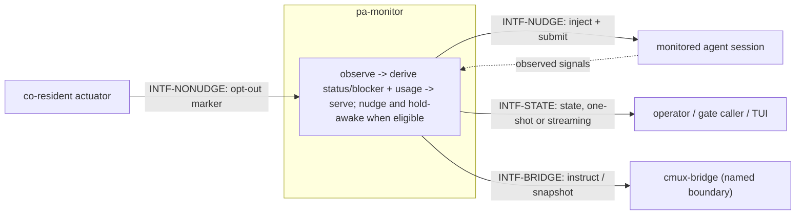

# pa-monitor — behavior docs

pa-monitor **observes** a set of agent sessions and the operator's provider account, **derives**
each session's status and the account's usage windows from what it observes, **serves** both to
any reader, and — deliberately, not incidentally — **acts**: it nudges a stuck session and holds
the machine awake while work is in flight. This set follows the behavior-docs method
(`phillipgreenii-nix-agent-support · behavior-docs/docs/behavior`).

Start here, then the [glossary](glossary.md); the rules are in [invariants](invariants.md), the
boundaries in [interfaces](interfaces.md), the actors in [actors](actors.md), and the stories,
use cases, journeys, and open questions in [journeys](journeys.md).

## The model

The diagram below **is** this set's interface inventory (`GOAL-7`) — not a data-flow diagram and
not a component diagram.

**`INTF-STATE` and `INTF-NUDGE` are essential** — reading state and being able to act on a stuck
session are what pa-monitor is _for_. **`INTF-NONUDGE` and `INTF-BRIDGE` are optional** — the
daemon is fully itself whether or not any co-resident actuator or bridge is ever present. That
essential/optional split, alongside each interface's counterparty kind, is why
[interfaces](interfaces.md) groups on **two axes**, per the method (`INV-8`).

**pa-monitor is not read-only.** It never mutates the sessions' own transcripts or state, but it
deliberately injects input into a session (a nudge) and deliberately holds a power assertion that
changes whether the machine sleeps. Both are **owned actuation**, stated as such throughout this
set, never glossed as observation (`INV-ACT-1`).

**Two scopes never share a number.** A monitored session's status/blocker and the operator's
account-level usage windows are kept as two separately identifiable groups of fields on every
surface this set defines; neither is ever derived from, or presented as, the other (`INV-SCOPE-1`).

**cmux-bridge and the TUI are named boundaries, not sets of their own.** Each is stated only as
far as what crosses into or out of pa-monitor; their own internal behavior is out of this set's
extent (see [actors](actors.md)).

## Scope (extent + floor)

- **Extent (in)** — deriving and serving per-session status and blocker; deriving and serving
  account-level usage windows with their staleness-relevant capture time; the busy/idle gates and
  what they do and do not mean; nudging (four intents, and the suppression obligations that gate
  every one of them); the keep-awake power assertion and its predicate; the no-nudge opt-out
  contract; the cmux-bridge and TUI boundaries, named only.
- **Extent (out)** — cmux-bridge's and the TUI's own internal behavior (rendering, reconnection,
  pane formatting); any other product's policy (what a session _does_ with a nudge, or how a
  caller _uses_ an idle result, are the caller's); concrete transport, storage, and OS mechanics —
  those are this package's own decision docs.
- **Floor** — pa-monitor speaks in sessions, status, blockers, usage windows, nudges, and gates —
  never in sockets, message schemas, SQL columns, or subprocess names.

## Realization gaps

This set's **realization-gap register** (`INV-23`): intended behavior this set's implementation
has not built yet, one row per gap, each keyed by the element id the gap is against. Not an open
question — the intent below is settled and the build has not caught up (`INV-15`). One element MAY
carry more than one row.

| Element       | Intended                                                                                                           | Where the implementation stands                                                                                                                                                                                                                                                 | Tracked by                                   |
| ------------- | ------------------------------------------------------------------------------------------------------------------ | ------------------------------------------------------------------------------------------------------------------------------------------------------------------------------------------------------------------------------------------------------------------------------- | -------------------------------------------- |
| `INTF-STATE`  | the account-usage fields of the state surface are a **declared, externally-consumable** contract any tool may bind | the daemon serves state only over a private unix-socket gRPC service; the only client library is unexported from this module, so no external program can bind the surface today — a would-be consumer can reach it only by shelling out to the CLI's human-oriented text output | bead filed at WS-3 landing (`pg2-wr6lm.6.1`) |
| `INV-STALE-1` | a published staleness verdict or bound, so two consumers cannot silently disagree about the same reading           | no verdict or bound is published; each consumer judges staleness against its own configured tolerance, and the daemon's own metrics export applies no staleness gate at all — a stale peak can export indefinitely                                                              | bead filed at WS-3 landing (`pg2-wr6lm.6.1`) |

## External references

This set follows the behavior-docs method and cites elements the method defines. Each external
element it references is declared here with the owner's UUID, so a cross-set reference resolves by
the owner's UUID — not the mutable name. The **what it is** column is one line, so a reader learns
why the row is there without following the reference, and the UUID is rendered as a link to the
owner's remote-served definition. **The UUID is the authority; the URL may rot.**

| Name     | What it is                                                                                                                            | Owner set-path                                                   | Owner UUID                                                                                                                                      |
| -------- | ------------------------------------------------------------------------------------------------------------------------------------- | ---------------------------------------------------------------- | ----------------------------------------------------------------------------------------------------------------------------------------------- |
| `INV-3`  | every element carries a typed name and a stable UUID minted once at its definition                                                    | `phillipgreenii-nix-agent-support · behavior-docs/docs/behavior` | [c44b760f-9baf-471a-8424-49984eb94ac7](https://github.com/phillipgreenii/nix-agent-support/blob/main/behavior-docs/docs/behavior/invariants.md) |
| `INV-8`  | a cross-product interaction MUST be an explicit interface, classified by counterparty kind and by essential-vs-optional participation | `phillipgreenii-nix-agent-support · behavior-docs/docs/behavior` | [67a79e92-2f98-40a2-9392-034a697e457e](https://github.com/phillipgreenii/nix-agent-support/blob/main/behavior-docs/docs/behavior/invariants.md) |
| `INV-13` | a set MUST make its scope explicit (extent + floor) and define all its actors and interfaces                                          | `phillipgreenii-nix-agent-support · behavior-docs/docs/behavior` | [94285c70-da89-4402-8ae2-af27925008bd](https://github.com/phillipgreenii/nix-agent-support/blob/main/behavior-docs/docs/behavior/invariants.md) |
| `INV-14` | a named concept MUST be used in at least two places beyond its glossary definition                                                    | `phillipgreenii-nix-agent-support · behavior-docs/docs/behavior` | [5ffe697b-8758-4404-8a59-5f27d1016109](https://github.com/phillipgreenii/nix-agent-support/blob/main/behavior-docs/docs/behavior/invariants.md) |
| `INV-15` | the behavior docs set is the source of truth; a realization gap is normal, not a defect                                               | `phillipgreenii-nix-agent-support · behavior-docs/docs/behavior` | [375b542f-2a9f-4cfd-a77e-7aed45a416d5](https://github.com/phillipgreenii/nix-agent-support/blob/main/behavior-docs/docs/behavior/invariants.md) |
| `INV-22` | traceability is a listing obligation on every story, use case and journey, not a coverage section                                     | `phillipgreenii-nix-agent-support · behavior-docs/docs/behavior` | [b2502527-1340-4a1f-858c-aaa80c601317](https://github.com/phillipgreenii/nix-agent-support/blob/main/behavior-docs/docs/behavior/invariants.md) |
| `INV-23` | the realization-gap register is set-level, named `## Realization gaps`, and never an element                                          | `phillipgreenii-nix-agent-support · behavior-docs/docs/behavior` | [f3bba3e7-440f-4109-a4de-9d37daa34bcf](https://github.com/phillipgreenii/nix-agent-support/blob/main/behavior-docs/docs/behavior/invariants.md) |
| `GOAL-7` | a set SHOULD show intent through examples                                                                                             | `phillipgreenii-nix-agent-support · behavior-docs/docs/behavior` | [42ad1aa1-af11-4387-bf02-e0f028f80434](https://github.com/phillipgreenii/nix-agent-support/blob/main/behavior-docs/docs/behavior/invariants.md) |
