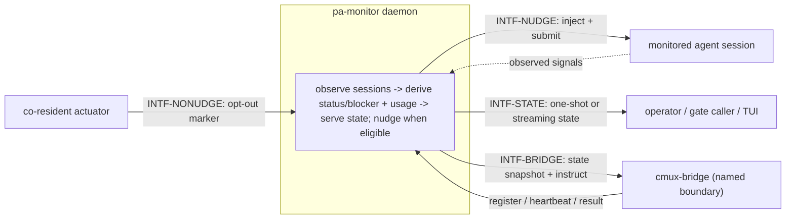

# Interfaces — pa-monitor

This file follows the interface convention of the behavior-docs method
(`phillipgreenii-nix-agent-support · behavior-docs/docs/behavior`): an **interface** is a boundary
described by **what crosses it** and **what must hold**, never _how_ it is implemented. See the
[glossary](glossary.md) for terms, [actors](actors.md) for who sits on each side,
[invariants](invariants.md) for the rules, and [journeys](journeys.md) for the flows that exercise
these interfaces.

The four interfaces are described on **two axes** — the **kind** of party on the far side, and
whether that party is an **essential or optional** participant in what the daemon exists to do:

| Interface      | Boundary                                                        | Counterparty (kind)                         | Participation | Initiator                                                 |
| -------------- | --------------------------------------------------------------- | ------------------------------------------- | ------------- | --------------------------------------------------------- |
| `INTF-STATE`   | daemon state out to a reader                                    | `ACTOR-PAM-OP` / `ACTOR-PAM-CALLER` (actor) | essential     | reader (one-shot), or daemon (streaming, after subscribe) |
| `INTF-NUDGE`   | text injected into a session; outcome back                      | `ACTOR-PAM-SESSION` (actor)                 | essential     | daemon                                                    |
| `INTF-NONUDGE` | an opt-out marker read before nudging                           | `ACTOR-PAM-COACTOR` (implementer)           | optional      | co-resident actuator declares; daemon reads               |
| `INTF-BRIDGE`  | register / heartbeat / instruct / report, plus a state snapshot | cmux-bridge (implementer, named boundary)   | optional      | bridge registers; daemon instructs                        |

`INTF-STATE` and `INTF-NUDGE` are **essential**: reading state and being able to act on a stuck
session are what the daemon is for. `INTF-NONUDGE` and `INTF-BRIDGE` are **optional**: the daemon
is fully itself with no co-resident actuator ever present and with no bridge ever registered.

## `INTF-STATE` — daemon state out to a reader <!-- uuid: 93bcbd55-729c-404f-ba79-2b0dd412c077 -->

- **Out (daemon → reader), one-shot** — a full snapshot of everything currently known: every
  monitored session's status and blocker (`INV-STATUS-1`), and the account-level usage windows —
  each carrying a window percentage, a capture time, and, once known, a window reset
  (`INV-SCOPE-1`, `INV-WINDOW-1`, `INV-WINDOW-2`, `INV-WINDOW-3`, `INV-STALE-1`). The two scopes
  are carried as separately identifiable groups of fields, never merged into one number.
- **Out (daemon → reader), streaming** — the same content, pushed as it changes, for a reader that
  wants to react rather than poll. The busy/idle gate (`INV-GATE-1`) is a derived read of this
  same content, not a separate interface.
- **Guarantee** — a reader that cannot reach the daemon at all is told so distinctly from a reader
  that reaches it and receives a snapshot with unknown fields (`INV-WINDOW-3`) — "the daemon is
  unreachable" and "the daemon has nothing known to report" are different facts.
- **The TUI is one client of this interface** (`actors.md`), rendering what it reads; its
  presentation is out of this set's extent.
- **Open questions** (tracked in [journeys](journeys.md)): `OQ-PAM-EXITCODE` (whether the
  busy/idle gate exit codes should conform to the repo's general exit-code convention) and
  `OQ-GATE-BLOCKED` (whether a `blocker = usage_limit` session should hold the busy/idle gates
  open, rather than the gates reading only `status == working`).

## `INTF-NUDGE` — actuation into a monitored session <!-- uuid: 7e135892-57f4-4b74-af62-e71cc871860c -->

- **Out (daemon → session)** — deliver text into the session's input, then submit it, as if a
  person had typed and sent it. Carries which **nudge intent** triggered it (`glossary.md`) for
  the daemon's own bookkeeping; the session itself receives only the text.
- **Guarantee (suppression)** — the daemon MUST NOT deliver when `INV-NUDGE-1`'s suppression
  conditions hold. A delivery attempt that cannot reach the session (no path exists, e.g. the
  session lives behind a boundary with no bridge registered) is reported as undelivered, never
  silently dropped.

## `INTF-NONUDGE` — the no-nudge opt-out contract <!-- uuid: 7f6f582f-8261-4ae8-b39b-c76e8f027b36 -->

- **In (co-resident actuator → daemon)** — a per-session marker the actuator sets, meaning "I am
  already driving this session; do not also nudge it."
- **Guarantee** — the daemon MUST honor a marker it can read (`INV-NUDGE-1`). A marker the daemon
  **fails to read** (the session's marker is transiently unreadable) does not gate delivery — this
  contract is an **opt-out**, not a permission gate: the default, absent any evidence either way,
  is to nudge. A missed read degrades to "no opt-out observed", never to "delivery blocked
  pending confirmation".

## `INTF-BRIDGE` — the cmux-bridge boundary (named, internals undescribed) <!-- uuid: 64322279-8cb8-4bf7-846e-f7c4373f6ea1 -->

Per this set's floor (`actors.md`), only the boundary is stated; cmux-bridge's own internal
behavior is out of extent.

- **In (bridge → daemon)** — a bridge **registers** itself as reachable for a scope of sessions,
  sends periodic **heartbeats** so the daemon knows it is still present, and reports the **outcome**
  of an instructed actuation back.
- **Out (daemon → bridge)** — the daemon sends the same kind of **state snapshot** `INTF-STATE`
  serves, plus, when a nudge targets a session only the bridge can reach, an **instruction**
  naming the target and the text to deliver.
- **Guarantee** — the daemon MUST NOT assume a bridge is present; `INTF-NUDGE` to a
  bridge-only-reachable session with no bridge currently registered is an undelivered outcome, not
  an error the daemon manufactures a different signal for.
