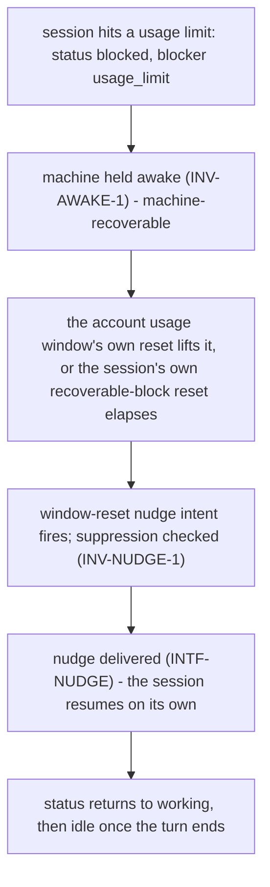
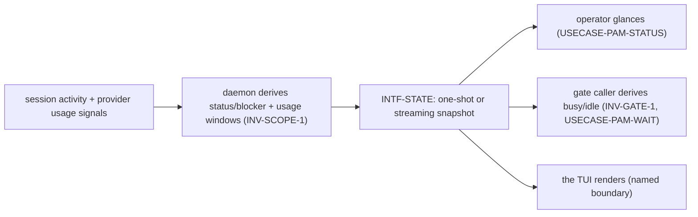

# Journeys — pa-monitor

Stories, use cases, and journeys, typed and leveled per the behavior-docs method's vocabulary
rules: **user-goal** and **subfunction** level elements are `USECASE-`; **summary**-level
multi-actor arcs stay `JOURNEY-`. Each element carries, on its own definition, what it requires and
what it includes (`INV-22`).

## Stories

- **`STORY-PAM-GLANCE`** <!-- uuid: cca0b2d3-3b5c-4c58-8559-5d1a2fa4701e --> — As an operator, I
  want to glance at every monitored session's status and the account's usage windows in one read,
  so I know at a glance who needs me and how much runway is left. _(→ `USECASE-PAM-STATUS`;
  `INV-SCOPE-1`, `INV-VOCAB-1`.)_
- **`STORY-PAM-GATE`** <!-- uuid: 4846ab8e-4a32-4435-89f1-89cebca03b68 --> — As a script driving
  agent sessions, I want to block until no session is actively working, so I can safely proceed
  without babysitting. _(→ `USECASE-PAM-WAIT`; `INV-GATE-1`.)_
- **`STORY-PAM-AWAKE`** <!-- uuid: eb3a1e3e-9d2b-4368-bdf2-d67fd0a44e4c --> — As an operator, I
  want the machine to stay awake while agent work is in flight or self-recovering, and to sleep
  when only a human is needed, so I don't lose progress to sleep and don't burn power for nothing.
  _(→ `USECASE-PAM-TOGGLE`; `INV-AWAKE-1`.)_
- **`STORY-PAM-NUDGE`** <!-- uuid: 996271ef-68f2-4c00-b5b1-33190ad4137a --> — As an operator, I
  want to nudge a specific stuck session myself, so I can unstick it without waiting on an
  automatic trigger. _(→ `USECASE-PAM-NUDGE`; `INV-ACT-1`, `INV-NUDGE-1`.)_

## Use cases

### `USECASE-PAM-STATUS` — check sessions and account usage in one read <!-- uuid: 4e538f40-954b-487a-8aae-bbb892e0d766 -->

**Primary actor:** `ACTOR-PAM-OP` (or `ACTOR-PAM-CALLER`).
**Level:** user-goal.
**Preconditions:** the daemon is reachable.
_Requires:_ `INV-SCOPE-1`, `INV-STATUS-1`, `INV-WINDOW-1`, `INV-WINDOW-2`, `INV-WINDOW-3`,
`INV-STALE-1`.
_Includes:_ `USECASE-PAM-RESOLVE-SELECTOR`.

1. The actor asks for state, optionally naming one session by selector.
2. The daemon reconciles current signals and returns a snapshot: every (or the named) session's
   status and blocker; the account's usage windows, each with its own capture time.
3. The actor reads status and usage as two distinct sections and acts, or not.

Extensions:

- 2a. The daemon is unreachable: the actor is told so, distinctly from "nothing to report"
  (`INTF-STATE`'s guarantee).
- 2b. A named selector matches no session: reported as no match, not as an empty or idle session.

### `USECASE-PAM-WAIT` — wait until agents finish (the idle gate) <!-- uuid: 52212407-213f-4f99-8c1d-5c5679a9c02c -->

**Primary actor:** `ACTOR-PAM-CALLER`.
**Level:** user-goal.
**Preconditions:** the daemon is reachable within a grace period.
_Requires:_ `INV-GATE-1`.

1. The caller asks to be blocked until idle is reached, with a maximum wait.
2. The daemon reports idle once no session has been working for a sustained observation period.
3. The caller proceeds.

Extensions:

- 2a. The maximum wait elapses first: the caller is told timeout, distinctly from idle-reached.
- 2b. The daemon becomes unreachable past its reconnect grace: the caller is told
  daemon-unavailable, distinctly from either idle-reached or timeout.
- 3a. A caller for whom "idle reached" must mean "no pending work at all" separately consults the
  blocked count (`INV-GATE-1`) — a declared caller obligation, not a behavior this use case adds.

### `USECASE-PAM-NUDGE` — nudge a session <!-- uuid: bdd87623-3ca8-4cf9-bcf4-a21ef23f1173 -->

**Primary actor:** `ACTOR-PAM-OP`.
**Level:** user-goal.
**Preconditions:** a target session selector is given.
_Requires:_ `INV-ACT-1`, `INV-NUDGE-1`.
_Includes:_ `USECASE-PAM-RESOLVE-SELECTOR`.

1. The operator names a session and, optionally, replacement text.
2. The daemon resolves the selector to one session, checks the suppression conditions, and
   delivers.
3. The session progresses on its own from there.

Extensions:

- 2a. The session is working, blocked on a person, or opted out: the daemon reports suppressed and
  does not deliver (`INV-NUDGE-1`).
- 2b. The selector resolves to no session, or to more than one: reported as such; nothing is
  delivered.
- 2c. The session is reachable only through a boundary with no bridge currently registered:
  reported undelivered (`INTF-BRIDGE`'s guarantee).

### `USECASE-PAM-TOGGLE` — toggle keep-awake or auto-resume <!-- uuid: 693343be-82fd-4355-a357-3d4bede3154d -->

**Primary actor:** `ACTOR-PAM-OP`.
**Level:** user-goal.
**Preconditions:** none.
_Requires:_ `INV-AWAKE-1`.

1. The operator asks to turn a daemon-wide toggle on, off, or flip it.
2. The daemon applies it and confirms the resulting value.

Extensions:

- 1a. Flip is asked with the current value unknown to the caller: the daemon reads its own current
  value first, then flips.

### `USECASE-PAM-RESOLVE-SELECTOR` — resolve a session selector <!-- uuid: bf041187-e94f-4984-b90a-495b1d0d3a4b -->

**Primary actor:** none — invoked by another use case.
**Level:** subfunction — included by `USECASE-PAM-STATUS` and `USECASE-PAM-NUDGE`, which is what
makes it a subfunction rather than a goal of its own.
**Preconditions:** a caller-supplied selector.
_Requires:_ `INV-SELECT-1`.

1. Given a caller-supplied selector, find the one monitored session it names.

Extensions:

- 1a. No session matches: report no-match.
- 1b. More than one session matches: report ambiguous.

## Journeys

### `JOURNEY-PAM-WINDOW` — the usage-window arc <!-- uuid: ec5e0cf7-551c-40e4-a355-5ae9f42c8ac2 -->

**Actors:** `ACTOR-PAM-SESSION`, the daemon, `ACTOR-PAM-OP`.
**Level:** summary.
**Intent:** tell the whole arc once — a session hits a usage limit, the machine is held awake in
case it self-recovers, and once the limit lifts the session resumes on its own.
_Requires:_ `INV-STATUS-1`, `INV-WINDOW-1`, `INV-WINDOW-2`, `INV-AWAKE-1`, `INV-ACT-1`,
`INV-NUDGE-1`.
_Includes:_ `USECASE-PAM-STATUS`, `USECASE-PAM-NUDGE`, `USECASE-PAM-TOGGLE`.

Either lift is enough to fire the nudge: the account usage window's reset, or the session's own
recoverable-block reset (`glossary.md`), whichever the daemon currently knows of. The daemon never
learns why the limit lifted beyond observing the session's own signals change; it does not model
the provider's window internally beyond what `INV-WINDOW-1`/`INV-WINDOW-2` state.

### `JOURNEY-PAM-OBSERVE` — the observation arc <!-- uuid: d1d272b3-1e0c-43fe-9f2a-7591f68c424b -->

**Actors:** `ACTOR-PAM-SESSION`, the daemon, `ACTOR-PAM-OP`, `ACTOR-PAM-CALLER`.
**Level:** summary.
**Intent:** tell the whole arc once — the daemon derives status from a session's own signals and
usage from account-level signals, and serves both, kept distinct, to every kind of reader.
_Requires:_ `INV-SCOPE-1`, `INV-STATUS-1`, `INV-WINDOW-3`, `INV-STALE-1`, `INV-GATE-1`.
_Includes:_ `USECASE-PAM-STATUS`, `USECASE-PAM-WAIT`.

## Open questions

- **`OQ-PAM-EXITCODE`** <!-- uuid: 2516682e-229d-4a11-97e0-65c2c7e3bf9e --> — whether pa-monitor's
  CLI gate exit codes SHOULD conform to this repository's general coarse exit-code convention (`0`
  ok, `1` unexpected error, `2` usage error, `>= 3` app-specific, `9` busy), given the gates today
  use exit `2` for "daemon unreachable" and exit `1` for "not busy" rather than that mapping.
  _Gap_: undecided whether pa-monitor is within that convention's scope or a deliberate exception.
  _Owner_: pa-monitor. _Path_: settle by a superseding decision when the convention is next
  revisited pool-wide. _Blocks_: nothing today — the current codes are stable and documented.
