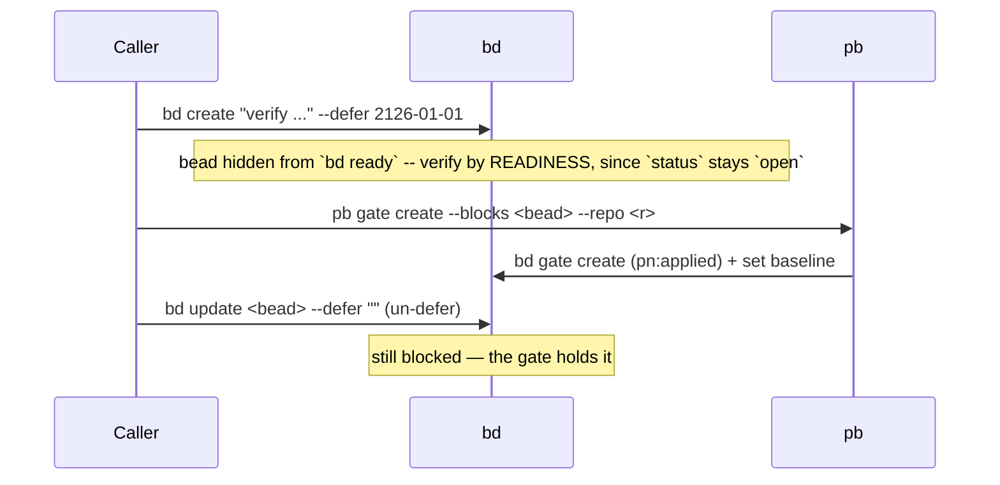

# pb — phillip-beads `pn:applied` gate create/check

`pb` writes and resolves **`pn:applied` gates**: beads (issues) that MUST NOT become
workable until the change they depend on has been _applied_ by a `pn workspace apply`.
It is the Phase-2 producer/consumer of the `pn:applied` contract (design spec:
`docs/superpowers/specs/2026-06-25-pn-applied-gates-design.md`; contract: ADR
`docs/adr/0018-pb-tool-and-pn-applied-contract.md`).

A gate is keyed to a change's **`git patch-id`** (not its commit SHA) so it survives the
local rebases this workflow performs — the SHA changes on rebase, the diff (and thus the
patch-id) does not.

## Architecture

A standalone Go [cobra](https://github.com/spf13/cobra) binary that shells out to three
tools on `PATH`:

- **`bd`** (beads) — gate create/list/resolve, metadata, labels. Wrapped onto `PATH`.
- **`git`** — `patch-id`, `log -p`, `merge-base`. Wrapped onto `PATH`.
- **`pn`** — `pn workspace info --json` (the consumed applied-state API). **NOT wrapped**;
  `pn` is an _ambient_ runtime `PATH` dependency (the apply post-hook env and dev shells
  already provide it). agent-support is standalone and cannot reference repo-base's `pn`.

All external execution is behind a `run.Runner` interface, so the logic is unit-tested
with a `FakeRunner` (no real binaries). Real-binary behaviour is pinned by build-tagged
contract tests (`//go:build contract`).

## `pb gate create`

Attaches one or more `pn:applied` gate(s) blocking an existing bead until a change is
applied.

```
pb gate create --blocks <beadid> --repo <repo> [--commit <commit-ish>] [--commits <range>] [--reason <r>] [--json]
```

- `--commit` defaults to `HEAD`. `--commits <range>` creates **one gate per commit** in the
  range (all block the same bead; the bead surfaces only once **all** gates resolve, since
  beads AND their blockers).
- The gate's `await_id` is `<wsid>:<repo>:<patch-id>` and its
  `metadata.applied_baseline` is the repo's `applied_ref` at create time (may be empty).
- The gate is **co-located in the bead's own beads DB** (a cross-DB `blocks` edge does not
  hold a bead out of `bd ready`).
- `pb gate create` does **NOT** create or un-defer the bead. The fleet-race-safe lifecycle
  is the caller's (taught by the Phase-3 plugin):



## `pb gate check`

Run **inside a `pn` workspace** (e.g. as the apply post-hook). Discovers every distinct
beads DB reachable from the workspace, lists open `pn:applied` gates, and resolves each
one for which BOTH of the following hold (ADR 0046).

```
pb gate check [--dry-run] [--strict] [--last-n N] [--stale-handler convert-to-human|close] [--stale-after 3d] [--json]
```

- **Discovery + dedupe:** walks up each repo (and the root) for `.beads`, bounded at the
  workspace root, and dedupes by Dolt identity (`host:port|database|project_id`).
- **Condition 1 — an apply happened:** the gated patch-id appears in the scan range.
  When a gate's `applied_baseline` is an ancestor of the repo's `applied_ref`, scans
  `baseline..applied_ref`; otherwise scans the last `--last-n` commits (default 100).
- **Condition 2 — that apply's lock contained the commit:** for a repo the apply resolved
  **through the terminal's `flake.lock`**, the gated commit must be an ancestor of
  `locked_rev` — the rev that lock pinned **at that apply**, published by
  `pn workspace info` (`phillipg-nix-repo-base` ADR 0025). Condition 1 alone only proves an
  apply ran over a checkout holding the change; a commit never pushed and relocked is not
  in such a build. So such a gate needs **push + relock + apply**, and until then it is
  reported in `blocked` with the remedy.

  It is **SKIPPED** for a repo the apply **OVERRODE** (`overridden` true, requires
  `applied_state_schema >= 3`): `pn workspace apply` passes
  `--override-input <alias> git+file://<clone>` for every terminal lock edge whose clone is
  present, so nix built that repo from the LOCAL CLONE at eval-time HEAD and never consulted
  the lock — condition 1 is the whole truth for it. Also skipped for the terminal repo
  (built from its local directory, so no `locked_rev`) and for a record written by a `pn`
  predating `locked_revs` (`applied_state_schema < 2`). A record from a `pn` that predates
  the override set (`applied_state_schema == 2`) is read as NOT overridden, so condition 2
  is **enforced** — fail-closed, and the `blocked` reason says so. See ADR 0046's amendment
  "condition 2 is CONDITIONAL on whether the apply OVERRODE the repo".

- **Dirty repos:** scanned leniently by default (committed history only); `--strict` skips
  them.
- **`--dry-run`** mutates nothing (reports `would_resolve` / would-be stale actions).
- **Stale handling:** gates older than `--stale-after` (default `3d`; units `ms`..`d`,
  rejects `<1ms`) that still cannot be resolved get the `--stale-handler` action:
  `convert-to-human` (adds the `human` label → surfaces in `bd human list`) or `close`
  (resolves the gate, unblocking the bead).
- **`blocked` vs `skipped`:** `blocked` gates were DETERMINED to be correctly still
  closed (condition 2 said no) and do NOT affect the exit code — otherwise the apply
  post-hook would exit non-zero, and `pn` warn, on every normal pending gate. `skipped`
  gates are UNDETERMINABLE (unknown repo, scan failure, dirty under `--strict`, an apply
  that recorded no locked rev for an input it consumes).
- **Best-effort:** undeterminable gates are skipped and reported; the command exits
  non-zero if anything was skipped.

## Versioning

Per-source content digest (agent-support "Versioning"): `mkGoApp` stamps `main.Version`.
Refresh third-party deps with `go mod tidy && nix run github:nix-community/gomod2nix -- generate`.

## Tests

```bash
cd packages/pb
go test ./...                       # unit tests (FakeRunner; real-git tests need git on PATH)
go test -tags contract -p 1 ./...   # contract tests (real bd/git/pn; skip when absent)
```
