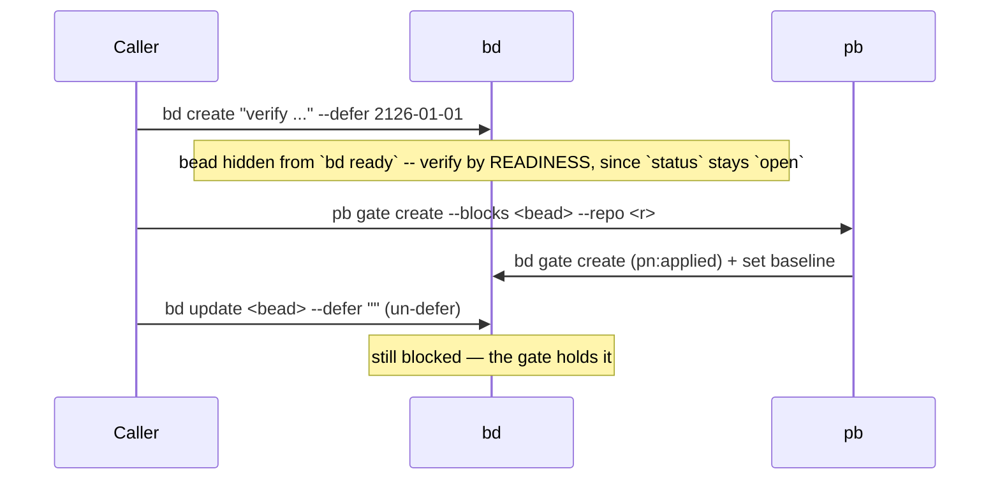
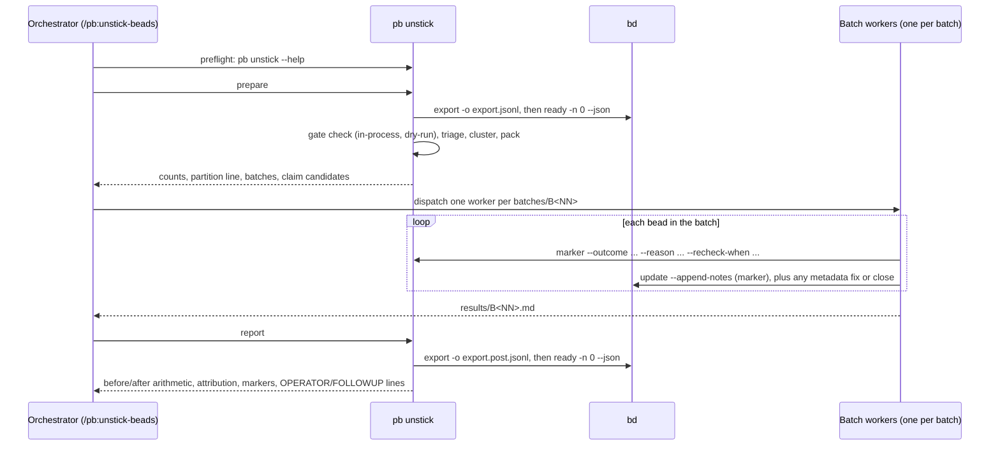
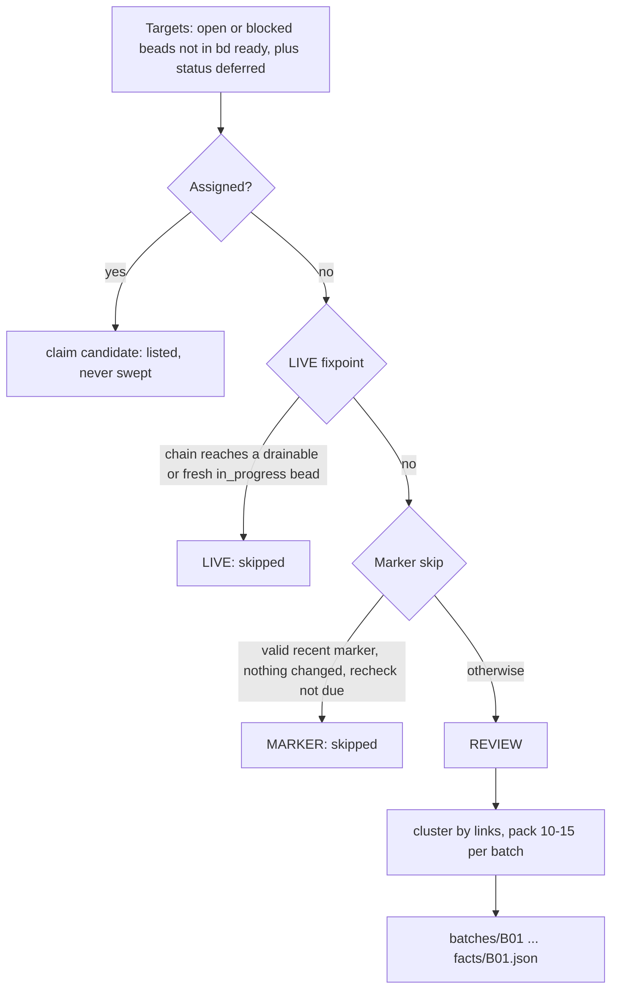

# pb — phillip-beads: `pn:applied` gates + drain-loop helpers

`pb` writes and resolves **`pn:applied` gates**: beads (issues) that MUST NOT become
workable until the change they depend on has been _applied_ by a `pn workspace apply`.
It is the Phase-2 producer/consumer of the `pn:applied` contract (design spec:
`docs/superpowers/specs/2026-06-25-pn-applied-gates-design.md`; contract: ADR
`docs/adr/0018-pb-tool-and-pn-applied-contract.md`). It also carries `pb drain`, a small
family of helpers for the `/drain-beads` work loop — starting with `drain isolate`,
which sets up a bead's isolated worktree.

`/drain-beads` is the interactive selection loop only: it claims a bead, then delegates the
per-bead protocol (container probe, understand, isolate, delegate, validate, land, finish,
STUCK routing) to the shared `pb:drain-one` skill
(`claude-marketplace/pb/skills/drain-one/SKILL.md`). A pg-router drain worker applies the same
skill to the bead the router chose, without calling `/drain-beads`. See ADR
`docs/adr/0089-drain-roles-apply-the-shared-pb-drain-one-skill.md`.

A gate is keyed to a change's **`git patch-id`** (not its commit SHA) so it survives the
local rebases this workflow performs — the SHA changes on rebase, the diff (and thus the
patch-id) does not.

## Architecture

A standalone Go [cobra](https://github.com/spf13/cobra) binary that shells out to three
tools on `PATH`:

- **`bd`** (beads) — gate create/list/resolve, metadata, labels. Wrapped onto `PATH`.
- **`git`** — `patch-id`, `log -p`, `merge-base`. Wrapped onto `PATH`.
- **`pn`** — `pn workspace info --json` (the consumed applied-state API). **NOT wrapped**;
  `pn` is an _ambient_ runtime `PATH` dependency (the apply post-hook env and dev shells
  already provide it). agent-support is standalone and cannot reference repo-base's `pn`.

All external execution is behind a `run.Runner` interface, so the logic is unit-tested
with a `FakeRunner` (no real binaries). Real-binary behaviour is pinned by build-tagged
contract tests (`//go:build contract`).

## `pb gate create`

Attaches one or more `pn:applied` gate(s) blocking an existing bead until a change is
applied.

```
pb gate create --blocks <beadid> --repo <repo> [--commit <commit-ish>] [--commits <range>] [--reason <r>] [--json]
```

- `--commit` defaults to `HEAD`. `--commits <range>` creates **one gate per commit** in the
  range (all block the same bead; the bead surfaces only once **all** gates resolve, since
  beads AND their blockers).
- The gate's `await_id` is `<wsid>:<repo>:<patch-id>` and its
  `metadata.applied_baseline` is the repo's `applied_ref` at create time (may be empty).
- The gate is **co-located in the bead's own beads DB** (a cross-DB `blocks` edge does not
  hold a bead out of `bd ready`).
- `pb gate create` does **NOT** create or un-defer the bead. The fleet-race-safe lifecycle
  is the caller's (taught by the Phase-3 plugin):


```mermaid
sequenceDiagram
    participant Caller
    participant bd
    participant pb
    Caller->>bd: bd create "verify ..." --defer 2126-01-01
    Note over bd: bead hidden from `bd ready` -- verify by READINESS, since `status` stays `open`
    Caller->>pb: pb gate create --blocks <bead> --repo <r>
    pb->>bd: bd gate create (pn:applied) + set baseline
    Caller->>bd: bd update <bead> --defer ""  (un-defer)
    Note over bd: still blocked — the gate holds it
```

## `pb gate check`

Run **inside a `pn` workspace** (e.g. as the apply post-hook). Discovers every distinct
beads DB reachable from the workspace, lists open `pn:applied` gates, and resolves each
one for which BOTH of the following hold (ADR 0046).

```
pb gate check [--dry-run] [--strict] [--last-n N] [--stale-handler convert-to-human|close] [--stale-after 3d] [--json]
```

- **Discovery + dedupe:** walks up each repo (and the root) for `.beads`, bounded at the
  workspace root, and dedupes by Dolt identity (`host:port|database|project_id`).
- **Condition 1 — an apply happened:** the gated patch-id appears in the scan range.
  When a gate's `applied_baseline` is an ancestor of the repo's `applied_ref`, scans
  `baseline..applied_ref`; otherwise scans the last `--last-n` commits (default 100).
- **Condition 2 — that apply's lock contained the commit:** for a repo the apply resolved
  **through the terminal's `flake.lock`**, the gated commit must be an ancestor of
  `locked_rev` — the rev that lock pinned **at that apply**, published by
  `pn workspace info` (`phillipg-nix-repo-base` ADR 0025). Condition 1 alone only proves an
  apply ran over a checkout holding the change; a commit never pushed and relocked is not
  in such a build. So such a gate needs **push + relock + apply**, and until then it is
  reported in `blocked` with the remedy.

  It is **SKIPPED** for a repo the apply **OVERRODE** (`overridden` true, requires
  `applied_state_schema >= 3`): `pn workspace apply` passes
  `--override-input <alias> git+file://<clone>` for every terminal lock edge whose clone is
  present, so nix built that repo from the LOCAL CLONE at eval-time HEAD and never consulted
  the lock — condition 1 is the whole truth for it. Also skipped for the terminal repo
  (built from its local directory, so no `locked_rev`) and for a record written by a `pn`
  predating `locked_revs` (`applied_state_schema < 2`). A record from a `pn` that predates
  the override set (`applied_state_schema == 2`) is read as NOT overridden, so condition 2
  is **enforced** — fail-closed, and the `blocked` reason says so. See ADR 0046's amendment
  "condition 2 is CONDITIONAL on whether the apply OVERRODE the repo".

- **Dirty repos:** scanned leniently by default (committed history only); `--strict` skips
  them.
- **`--dry-run`** mutates nothing (reports `would_resolve` / would-be stale actions).
- **Stale handling:** gates older than `--stale-after` (default `3d`; units `ms`..`d`,
  rejects `<1ms`) that still cannot be resolved get the `--stale-handler` action:
  `convert-to-human` (adds the `human` label → surfaces in `bd human list`) or `close`
  (resolves the gate, unblocking the bead).
- **`blocked` vs `skipped`:** `blocked` gates were DETERMINED to be correctly still
  closed (condition 2 said no) and do NOT affect the exit code — otherwise the apply
  post-hook would exit non-zero, and `pn` warn, on every normal pending gate. `skipped`
  gates are UNDETERMINABLE (unknown repo, scan failure, dirty under `--strict`, an apply
  that recorded no locked rev for an input it consumes).
- **Best-effort:** undeterminable gates are skipped and reported; the command exits
  non-zero if anything was skipped.

## `pb gate attach-verified-child`

Runs the whole deferred-first post-deploy gate sequence for a landed implementation
bead in one call, rather than leaving the caller to script the `bd create --defer` /
`pb gate create` / `bd update --defer ""` steps (and their ordering) by hand: creates
the verification child bead **deferred**, proves it is absent from `bd ready`, attaches
one `pn:applied` gate per `--gate <repo-key>=<sha>`, un-defers the child, re-proves
absence (now held by the gates, not the defer), and comments the child's id back onto
`--impl`. The ordering is load-bearing — the child is never simultaneously workable
and ungated, closing the fleet-claim race where a peer agent claims the child and
"verifies" code that was never applied.

```
pb gate attach-verified-child --impl <beadid> --title <t> --gate <repo>=<sha> [--gate <repo>=<sha> ...] --actor <a> [--reason <r>] [--json]
```

- `--impl`, `--title`, `--gate` (repeatable — one per changed repo) and `--actor` are
  required. `--reason` defaults to `post-deploy verify for <impl>`.
- `--title` MUST be at most 500 characters (bd's cap, counted in runes). A longer title is
  rejected with exit `1` before any `pn`/`bd` call, so nothing is created; keep the title a
  short summary and put the long check list in a `bd comment --file` on the child. A `bd`
  failure always carries bd's own message (bd reports `--json` errors on stdout).
- Human output: `child=<id> gates=<n>`. `--json` emits the `AttachResult` envelope
  (`child`, `gates`, `comment_failed`) instead.

| Exit | Meaning                                                                                                                  |
| ---- | ------------------------------------------------------------------------------------------------------------------------ |
| `0`  | Fully gated: child created, gated, un-deferred, and proven absent from `bd ready`.                                       |
| `1`  | Generic failure (e.g. bad flags, `pn`/`bd` unreachable) — nothing to clean up.                                           |
| `3`  | Gating incomplete; the child was **left deferred** — safe, no peer can claim it. Route the impl bead to STUCK and retry. |
| `4`  | The child could **not be proven un-workable** — do **NOT** close the impl bead until this is resolved by hand.           |

```bash
pb gate attach-verified-child \
  --impl pg2-huyhg \
  --title "verify tldr wsplan renders after apply (pg2-huyhg): run tldr wsplan, compare against a known-good sibling page" \
  --gate phillipg-nix-repo-base=9167a60 \
  --actor "$CLAUDE_SESSION_ID-drain"
```

## `pb drain isolate`

Idempotent isolation for one bead in the `/drain-beads` work loop: creates or reuses
`.worktrees/<bead>` on branch `drain/<bead>` (branching off the repo's primary branch when
neither the worktree nor the branch already exists). It then reports the clone's hook-bundle
state (`pg-hooks status --porcelain`) and writes **no file** into the worktree: git runs the
bundle's hooks from the shared common dir. An absent `pg-hooks` or an unrecognized state reports
`missing`. Safe to re-run: an existing worktree or parked branch is reused rather than
recreated.

```
pb drain isolate --bead <id> --repo <abs-path> [--json] [--git-timeout <duration>]
```

- `--bead` and `--repo` are required. `--repo` MUST be an absolute path to the canonical
  clone — orchestrators are expected to pass an observed absolute root, not a relative path
  or (despite the name overlap) `pb gate create --repo`'s workspace repo _key_; an `IsAbs`
  check rejects a key passed by mistake.
- `--bead` is validated against `^[A-Za-z0-9._-]+$` (letters, digits, dot, dash, underscore)
  since the id lands in both a filesystem path and a branch ref; bare `.`/`..` are also
  rejected. Dots are otherwise legal — live ids such as `pg2-4dz88.2.3` exist.
- Human output is one line:
  `worktree=<abs> branch=drain/<id> reused=<none|worktree|branch> precommit=<bundle|stale|missing|broken>`
  (the PRECOMMIT vocabulary of `integrate-branch-support --facts`; nothing is written to the
  worktree).
  `--json` emits the same fields as a JSON object instead.
- Bounded git (`pg2-luvwe`): a wedged `fsmonitor` IPC (leaked `git fsmonitor--daemon` processes,
  `fseventsd` at high CPU) once hung `git worktree add` for 72 minutes with no output. So every
  git call isolate makes (1) runs with `core.fsmonitor` forced **off for that call only** — the
  per-call environment `GIT_CONFIG_COUNT=1 GIT_CONFIG_KEY_0=core.fsmonitor GIT_CONFIG_VALUE_0=false`
  (an inherited `GIT_CONFIG_COUNT` is extended, not clobbered); no git config is changed, fsmonitor
  stays on in the repos — and (2) is killed, **whole process group**, if it exceeds `--git-timeout`
  (default `5m0s`). On expiry isolate removes **only** the worktree (and the `drain/<bead>` branch,
  only when this same call created it with `-b`) that the timed-out call left half-created, leaves any
  pre-existing isolation (other beads' worktrees, a parked branch) alone, prints an error naming
  fsmonitor/fseventsd contention, and exits `1`. Exit codes `0`/`3` and the output line are unchanged.
- Read-only canonical-clone diagnosis: when the canonical clone's `.git/config` carries a stray
  `core.worktree` (or `git rev-parse --show-toplevel` disagrees with `--repo`), isolate still
  succeeds (exit `0`) but prints `pb: warning: core.worktree set in canonical config ...` to
  stderr and adds a `warning` field to `--json`. Without it, git's lie (phantom untracked files in
  the canonical clone) only surfaces later as a phantom dirty tree halting the land at FF-0a
  (`pg2-4c4nv`). `pb` never clears the key (R-3); the operator unsets it.

| Exit | Meaning                                                                                                                                                  |
| ---- | -------------------------------------------------------------------------------------------------------------------------------------------------------- |
| `0`  | Isolated (worktree created, or an existing worktree/branch reused).                                                                                      |
| `1`  | Generic failure (bad flags, git unreachable, a git call timed out after `--git-timeout`, etc).                                                           |
| `3`  | Conflicting isolation state — the worktree path holds another branch, or `drain/<bead>` is checked out elsewhere. Never forced; route the bead to STUCK. |

```bash
pb drain isolate --bead pg2-1qcro.7 --repo /Users/phillipg/phillipg_mbp/phillipg-nix-repo-base
```

## `pb unstick`

The deterministic stages of the `/pb:unstick-beads` sweep (inventory, triage, clustering,
follow-up batches, marker authoring, the closing report). Per-bead judgement (undefer,
de-label, fix dependencies, close as stale) stays with the `pb:unstick-batch-worker`
subagents; the services pause/resume and the "needs you" prose stay with the orchestrator.
The same inputs plus the same `--now` always produce byte-identical files.

Note: `prepare` and `report` call `bd ready`, which mutates (it un-defers beads whose
`defer_until` elapsed). Triage ignores ready rows whose export status is not open or
in_progress, so such a bead lands in REVIEW rather than LIVE.

```bash
pb unstick prepare [--root R] [--workdir W] [--full] [--label L] [--id-prefix P] [--json]
pb unstick batch   --workdir W --name FOLLOWUPS --ids a,b,c
pb unstick marker  --outcome O --reason R --recheck-when X      # prints one marker line
pb unstick marker  --check [--export FILE]                      # lines on stdin
pb unstick report  --workdir W [--root R] [--json]
```

`--root` defaults to `$PN_WORKSPACE_ROOT`, else the nearest `pn-workspace.toml`. A hidden
`--now <RFC3339>` pins the clock for tests and goldens.

### Sweep flow


```mermaid
sequenceDiagram
    participant O as Orchestrator (/pb:unstick-beads)
    participant P as pb unstick
    participant B as bd
    participant W as Batch workers (one per batch)
    O->>P: preflight: pb unstick --help
    O->>P: prepare
    P->>B: export -o export.jsonl, then ready -n 0 --json
    P->>P: gate check (in-process, dry-run), triage, cluster, pack
    P-->>O: counts, partition line, batches, claim candidates
    O->>W: dispatch one worker per batches/B<NN>
    loop each bead in the batch
        W->>P: marker --outcome ... --reason ... --recheck-when ...
        W->>B: update --append-notes (marker), plus any metadata fix or close
    end
    W-->>O: results/B<NN>.md
    O->>P: report
    P->>B: export -o export.post.jsonl, then ready -n 0 --json
    P-->>O: before/after arithmetic, attribution, markers, OPERATOR/FOLLOWUP lines
```


```mermaid
flowchart TD
    T[Targets: open or blocked beads not in bd ready, plus status deferred] --> A{Assigned?}
    A -- yes --> C[claim candidate: listed, never swept]
    A -- no --> L{LIVE fixpoint}
    L -- "chain reaches a drainable or fresh in_progress bead" --> LIVE[LIVE: skipped]
    L -- no --> M{Marker skip}
    M -- "valid recent marker, nothing changed, recheck not due" --> MS[MARKER: skipped]
    M -- otherwise --> R[REVIEW]
    R --> K[cluster by links, pack 10-15 per batch]
    K --> BT[batches/B01 ... facts/B01.json]
```

`in_progress` beads are never targets; they appear only as claim candidates (and seed LIVE
when updated within 24 hours of `--now`).

### Exit codes

| Code | Meaning                                                                                                                |
| ---- | ---------------------------------------------------------------------------------------------------------------------- |
| `0`  | Success.                                                                                                               |
| `1`  | Usage, IO or internal error (including a broken triage partition or batch coverage). `marker --check`: non-conforming. |
| `2`  | A `bd` call failed (`prepare` export or ready, `report` export).                                                       |

### Work directory

`prepare` allocates a fresh `/tmp/bead-unstick-<YYYY-MM-DD>[-N]` with an exclusive `mkdir`
loop (never reused), or creates the absolute `--workdir` you name (it MUST NOT exist).

```text
export.jsonl          bd export taken before bd ready (bd ready un-defers elapsed deferred beads)
export.post.jsonl     written by report
ready.json            bd ready -n 0 --json, the {data, schema_version} envelope (a bare array is tolerated)
prepare.json          pre-sweep snapshot read back by report
triage-targets.txt    triage-live.txt   triage-marker.txt   triage-review.txt
triage-inprog.txt     triage-assigned_open.txt              triage-drain.txt
batches/B<NN>         one bead id per line
facts/B<NN>.json      per-bead facts for the worker (projection; no raw dependencies)
results/              workers write B<NN>.md here
probes/gate-check.json
work/                 scratch for the orchestrator and workers
progress.txt          line 1 is the sweep start (UTC)
followups.txt         OPERATOR: / FOLLOWUP: lines
```

`prepare.json` holds `start`, `now`, `counts` (open, blocked, deferred, in_progress, ready,
targets, live_skip, marker_skip, review, drainable), the sorted `review` ids, `ready_ids`,
`pre` (id to status for every non-closed bead) and `closed` (ids closed before the sweep).
`prepare` asserts that LIVE + MARKER + REVIEW partition the targets
(`targets N = live a + marker b + review c`) and that every REVIEW id is in exactly one
batch; a violation is an internal error (exit 1).

### Sweep marker grammar

A worker records every decision on the bead (notes or a comment) so the next sweep can skip
a bead whose reason is still valid. The grammar lives once, in `internal/unstick/marker.go`:

```text
[unstick YYYY-MM-DDTHH:MM:SSZ] <outcome>: <reason>; recheck-when: <recheck>
```

- `outcome` matches `[a-z][a-z-]*` (`unchanged` and `released` are reserved meanings).
- `reason` is plain text: no control characters (newline included), backtick, `$`, quotes
  or the substring `; recheck-when:`.
- `recheck` is `YYYY-MM-DD`, `<bead-id> closes` or `on-change`.
- The timestamp is UTC with a `Z` suffix. A date-only or non-`Z` timestamp is MALFORMED and
  counts as no marker; `prepare` reports those beads and `marker --check --export FILE` lists
  them. When several markers exist the newest by parsed time wins.

Prefer `pb unstick marker ...` over hand-built strings; its output always round-trips
through the parser.

### `results/*.md`

Workers return one line per bead in free text; only this grammar is machine-read by
`report` (a leading `- ` or `* ` bullet is allowed, anything else is ignored):

```text
closed <bead-id>: <reason>
```

`<bead-id>` is letters and digits joined by `-` or `.` (so `tc-mol-4prt` and `tc-o14i5.3.7`
work). Prose such as `closed tc-1 because it was stale` does not match.

### Attribution (a heuristic)

`bd` records no closer and no actor on a state change, so `report` cannot know who changed a
bead. A bead is attributed to the sweep iff it is in a dispatched batch AND either it carries
a non-`unchanged` marker with a timestamp at or after the sweep start, OR it is closed now,
was non-closed before, and appears as closed in `results/*.md`. Every other change in the
window is attributed to peers (concurrent drain sessions, humans). Limits:

- A peer that closes a batched bead the worker also marks or lists is counted as the sweep.
- A worker that closes a bead but omits the `closed <id>: ...` line is counted as a peer.
- Marker-only outcomes change no status, so they appear under "markers added by outcome" but
  not in the "changed in window" arithmetic.
- Beads that were never in a batch (LIVE, MARKER-skipped) are always peers.

### Preflight

`pb` is `phillipgreenii.programs.pb.enable` (default false) while the plugin is enabled by
default, so the command may be missing or too old. The orchestrator runs `pb unstick --help`
first and, on failure, stops with: `pb too old or not installed; run pn workspace apply`.

### Contract test

`go test -tags contract -run TestContract_UnstickSweep ./cmd/pb/` seeds a synthetic workspace
in a throwaway embedded Dolt database (real `bd`, real `pb` binary, never a server or the
real tracker), pins the real `bd export` and `bd ready --json` row shapes, and runs prepare,
marker, close and report end to end. `TestUnstickRealShapeSample` asserts the same shape
facts over a committed sample, so decoder drift is caught without `bd`.

## Versioning

Per-source content digest (agent-support "Versioning"): `mkGoApp` stamps `main.Version`.
Refresh third-party deps with `go mod tidy && nix run github:nix-community/gomod2nix -- generate`.

## Tests

```bash
cd packages/pb
go test ./...                       # unit tests (FakeRunner; real-git tests need git on PATH)
go test -tags contract -p 1 ./...   # contract tests (real bd/git/pn; skip when absent)
```
