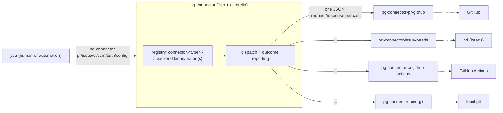

# pg-connector

`pg-connector` is the unified, pluggable connector umbrella for PR/issue/CI/SCM state: one
user-facing CLI, backed by a config-driven registry of small backend binaries, so no other tool
in this repo talks to GitHub/Jira/beads/git directly. It replaces the overlapping GitHub/Jira/beads
sync and correlation logic that `pg-pr`, `pr-pool`, and `work-activity-tracker` each used to
reimplement independently.

> **Behavior:** what pg-connector guarantees about the wire protocol, the registry, the CLI's own
> exit codes, and the boundary between the umbrella and its backends lives in the
> [behavior docs](docs/behavior/README.md) — read that for the full, RFC 2119 contract. This file
> is a practical how-to-use-it reference. The architecture decision this package implements is
> recorded in
> [`docs/adr/0062-pg-connector-tier1-tier2-connector-architecture.md`](../../docs/adr/0062-pg-connector-tier1-tier2-connector-architecture.md).

## Architecture: one umbrella, N pluggable backends

pg-connector is a **Tier 1 umbrella**: it owns the four entity-type schemas (`pr`, `issue`, `ci`,
`scm`), the wire protocol, and the only user-facing CLI surface. It knows nothing about GitHub,
Jira, beads, or git — that knowledge lives entirely in a **Tier 2 backend**, one thin binary per
(capability, external system) pair, registered under a config-driven registry and reached only
through the wire protocol. In design-pattern terms: the umbrella is a **Facade** over N
interchangeable backends; each capability's own Go interface (`pr.Provider`, `issue.Provider`,
`ci.Provider`, `scm.Provider`) is a **Strategy** the registry selects among; each backend is a
process-boundary **Adapter** translating one external system into that capability's generic wire
contract.



Adding a fifth backend, or a second backend for an existing capability (e.g. a Forgejo PR
backend), is a **registry-config change** — one more `connector.<type>` entry and one more
binary on `PATH` — never a change to pg-connector's own code.

## Registry (`connector.<type>`)

Backends are named in the same YAML config `pg-pr` already reads (resolution order:
`$PG_PR_CONFIG`, else `$XDG_CONFIG_HOME/pg-pr/config.yaml`, else `~/.config/pg-pr/config.yaml` —
the env var and directory name deliberately stay `pg-pr`, so one config file can serve both
binaries on a host running each):

```yaml
connector:
  pr: [pg-connector-pr-github] # list-valued
  issue: [pg-connector-issue-beads] # list-valued
  ci: [pg-connector-ci-github-actions] # list-valued
  scm: pg-connector-scm-git # single-valued (scm has no multi-backend future)
```

Every value is a bare binary name on `PATH` — there is no `exec:`-prefix or other built-in/
external distinction, since nothing is compiled into the umbrella itself.

## Subcommands

| Command                                                           | Description                                                                                                                    |
| ----------------------------------------------------------------- | ------------------------------------------------------------------------------------------------------------------------------ |
| `pr show <id>`                                                    | show a PR's current full state, including comments/review-thread entries (targeted)                                            |
| `pr categorize <id> --category <c>`                               | set a PR's category — a plain set/overwrite, never a GitHub label (targeted)                                                   |
| `pr feedback-set <pr-id> <comment-id> --disposition <d>`          | set a PR comment/review-thread entry's disposition (`open`\|`will-fix`\|`wont-fix`\|`no-action`) (targeted)                    |
| `issue show <id>`                                                 | show an issue's current state (targeted)                                                                                       |
| `issue create --title <t> [--priority] [--labels] [--issue-type]` | create a new issue (targeted)                                                                                                  |
| `issue comment <id> --body <b>`                                   | add a comment to an issue (targeted)                                                                                           |
| `issue transition <id> --state <s>`                               | transition an issue to a backend-declared target state (targeted)                                                              |
| `ci list <pr-id>`                                                 | list CI runs for a PR, fanned out across every registered `ci` backend (fan-out)                                               |
| `ci logs <run-id>`                                                | get the raw logs for a CI run (targeted)                                                                                       |
| `ci rerun-failed <pr-id>`                                         | rerun a PR's failed CI runs (targeted)                                                                                         |
| `scm worktree add <branch-or-ref>`                                | add a local git worktree for a branch or ref — **never** a PR number (targeted)                                                |
| `scm worktree remove <path>`                                      | remove a local git worktree by path (targeted)                                                                                 |
| `scm worktree list`                                               | list local git worktrees (targeted; `scm` is single-valued, so there is no fan-out here)                                       |
| `scm branch detect [cwd]`                                         | resolve a working directory to its repo and current branch (defaults to the process's own cwd) (targeted)                      |
| `auth status`                                                     | fan `auth_status` out across every registered backend, regardless of capability (fan-out)                                      |
| `config validate`                                                 | fan `auth_status` **and** `capabilities`/schema-version checks out across every registered backend (fan-out)                   |
| `--output json\|human`                                            | persistent flag on every command above: `json` (default; the stable envelope scripts already parse) or `human` (readable text) |
| `version`                                                         | print the version and exit                                                                                                     |

`pg-connector pr open <PR#>` from `pg-pr` has no equivalent here yet — `pg-pr` itself has not been
retired (see the ADR's "Negative" consequences and the design's own Appendix A/B).

Wanting a PR checked out for review composes two calls rather than one command doing both:
`pg-connector pr show <id>` to resolve the branch, then `pg-connector scm worktree add <branch>` —
`scm` is deliberately generic, never PR-aware.

## The wire protocol, in brief

Every Tier-2 backend speaks one small protocol: JSON on stdin (`{"op": "...", "args": {...}}`),
JSON on stdout (`{"protocolVersion", "schemaVersion", "result": ...}` on success, or
`{"protocolVersion", "schemaVersion", "error": {"code", "message"}}` on failure), plain `0`/`1`
process exit. `error.code` is drawn from a closed six-value taxonomy — `not_found`,
`unauthenticated`, `unavailable`, `unknown_op`, `version_mismatch`, `invalid_argument` — each
mapped to a Go sentinel error (`pkg/scriptout`) so a caller uses `errors.Is` rather than
substring-matching a message. Two independent version numbers travel on every response
(`protocolVersion` for the envelope shape, `schemaVersion` per schema-bearing capability), so an
unrelated capability's schema break never forces every backend to redeploy together. Full contract:
[`docs/behavior/interfaces.md`](docs/behavior/interfaces.md)'s `INTF-WIRE`.

**A Tier-2 backend MUST NOT exec `pg-connector` itself, or a sibling backend binary, to satisfy
its own op** — a cross-capability data need is resolved through that backend's own direct system
access instead. See [`docs/behavior/invariants.md`](docs/behavior/invariants.md)'s `INV-COMP-1`.

## pg-connector's own CLI exit codes

A different, higher layer than the wire protocol's plain `0`/`1` above — pg-connector's own
process exit code is never built from it. It splits by whether the invoked op is a **fan-out**
(queries every registered backend of a type) or **targeted** (resolves to one backend):

| Op shape | `0`                  | Other codes                                                                                                |
| -------- | -------------------- | ---------------------------------------------------------------------------------------------------------- |
| Fan-out  | every source healthy | `2` degraded/partial (some healthy, some not); `3` total failure (none healthy, including zero registered) |
| Targeted | success              | `4` `not_found` (a well-formed negative, not a failure); `1` any other error                               |

Every fan-out response also carries a `sources[]` row per backend actually queried
(`{source, status, count, reason}`) — never collapsed into one pass/fail signal, and never
reported only as a stderr line. Full contract:
[`docs/behavior/invariants.md`](docs/behavior/invariants.md)'s `INV-EXIT-1`/`INV-EXIT-2`/`INV-OUT-1`.

## Package layout

```
packages/pg-connector/
  pkg/
    schema/       shared JSON wire shapes (pr.go, issue.go, ci.go, scm.go)
    provider/     per-capability Go interfaces (pr.Provider, issue.Provider, ci.Provider, scm.Provider)
                  + the optional AuthChecker sub-interface
    scriptout/    the wire protocol itself (envelope, versioning, error taxonomy, serve loop)
  cmd/
    pg-connector/                        umbrella; imports pkg/schema + pkg/provider + pkg/scriptout only
    pg-connector-pr-github/internal/     backend-private
    pg-connector-issue-beads/internal/
    pg-connector-ci-github-actions/internal/
    pg-connector-scm-git/internal/
```

Only `pkg/schema`, `pkg/provider` (and its per-capability subpackages), and `pkg/scriptout` are
importable across backend boundaries — a backend's own code lives in `main` or under its own
`internal/`. `cmd/pg-connector/layout_convention_test.go` backstops this mechanically.

## Versioning

Per-source content digest (this repo's own "Versioning of Custom Packages" convention):
`mkGoApp` stamps `main.Version`. Refresh third-party deps with
`go mod tidy && nix run github:nix-community/gomod2nix -- generate`.

## Tests

```bash
cd packages/pg-connector
go test ./...
```

`nix build .#checks.<system>.pg-connector-go-tests` (or the full `nix flake check`) is the
whole-module test gate — `nix build .#pg-connector` alone only compiles `cmd/pg-connector` and
does not exercise every backend's own tests.
