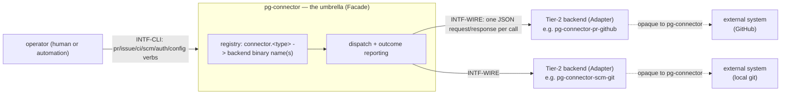

# pg-connector — behavior docs

pg-connector is a **Facade**: one user-facing CLI over N pluggable **backends**, each one an
**Adapter** translating a single external system (GitHub, beads, local git, …) into a small,
capability-scoped wire contract. This set follows the behavior-docs method
(`phillipgreenii-nix-agent-support · behavior-docs/docs/behavior`).

Start here, then the [glossary](glossary.md); the rules are in [invariants](invariants.md), the
boundaries in [interfaces](interfaces.md), the actors in [actors](actors.md), and the stories,
use cases, journey, and open questions in [journeys](journeys.md).

## The model

**pg-connector itself is the Facade + registry**, never a backend. For each entity-type
**capability** (`pr`, `issue`, `ci`, `scm`) the registry names one or more registered **backend**
binaries; a capability's own Go `Provider` interface (`pr.Provider`, `issue.Provider`, …) is a
**Strategy** the registry selects among, realized one level down as a **process-boundary
Adapter** — a separate OS process speaking the wire protocol, never an in-language object — so a
backend's own dependencies (a `gh` binary, Cloudflare Access credentials, …) never become the
umbrella's own. `INTF-WIRE` is the one contract every backend speaks regardless of capability or
system; `INTF-CLI` is the one surface every operator or piece of automation drives regardless of
which capability it's asking about.

### The boundary principle

pg-connector knows an operation was **dispatched to a backend and answered** — a `result` or a
taxonomy-coded `error`. It knows **nothing** about how a backend arrives at that answer: not its
credentials, not its own local store, not which external system (if any) it talks to. What is
left is the whole of what pg-connector itself does: **resolve a capability's registered
backend(s), invoke the wire protocol, and report the outcome** — coarsely at the wire layer (a
plain success/failure), richly in its own CLI exit code and `sources[]` reporting (`INV-EXIT-1`,
`INV-OUT-1`).

One question draws that boundary: **does pg-connector ACT on the value, or merely HAND IT
OVER?** The four entity-type schemas and the wire envelope are pg-connector's own — it acts on
them (validates shape, checks versions, classifies errors). Everything inside a backend's own
`args`/`result` payload beyond that shared schema, and everything about how a backend produces
it, is the backend's own and stays opaque. This is why a Tier-2 backend needing data another
capability's backend would otherwise supply MUST resolve it through its own direct system access
rather than by executing `pg-connector` or a sibling backend (`INV-COMP-1`) — reaching back into
the umbrella that dispatches it is not "pg-connector acting on a value," it is a backend quietly
becoming pg-connector's own caller, which the boundary above does not authorize.

## Scope (extent + floor)

- **Extent (in)** — the registry (`connector.<type>`, list- or single-valued per type); the wire
  protocol (envelope, `protocolVersion`/`schemaVersion` negotiation, the closed six-value error
  taxonomy, the `capabilities`/`auth_status` meta-ops, the optional `AuthChecker` sub-interface);
  the operator CLI surface for the four landed capabilities (`pr`, `issue`, `ci`, `scm`) plus
  `auth status` and `config validate`; pg-connector's own CLI outcome reporting (`sources[]`, the
  fan-out and targeted exit-code schemes); the `--output json|human` presentation mode; and the
  composition boundary between the umbrella and its backends.
- **Extent (out)** — everything the design document
  (`docs/superpowers/specs/2026-09-03-unified-connector-architecture-design.md`, recorded
  durably by `ADR 0062`) describes but that has not yet landed in code as of this writing:
  the `attention`/`search` cross-cutting capabilities, the Tier-1/Tier-2 dashboard and alert
  convention, the deferred `Thread`/`Note` entity types, `pg-pr`'s actual retirement, and the
  `df-categorize`/`df-feedback` pr-pool roles. A packet that builds any of these MUST extend this
  set in the same change (`ADR 0062`'s own "Negative" consequence) rather than leaving intended
  behavior undocumented a second time. Concrete backend implementations (which system a backend
  talks to, and how) are also out — that is each backend's own concern, opaque to this set.
- **Floor** — this set speaks in capabilities, backends, the registry, the wire envelope, ops,
  and outcomes. It names a concrete backend (`pg-connector-pr-github`, …) only as an
  illustrative example, never as part of a rule, and it names no external system's own API shape.

## Realization gaps

This set's **realization-gap register** (method `INV-23`): intended behavior this set's
implementation has not yet built, one row per gap.

| Element      | Intended                                                                                                                                                                          | Where the implementation stands                                                                                                                                                                                                                                         | Tracked by                |
| ------------ | --------------------------------------------------------------------------------------------------------------------------------------------------------------------------------- | ----------------------------------------------------------------------------------------------------------------------------------------------------------------------------------------------------------------------------------------------------------------------- | ------------------------- |
| `INV-WIRE-1` | every interface ships a **conformance suite** an implementer can run before being trusted to route through it — the same discipline `pr-pool`'s `INTF-INTF-2` already applies     | `pkg/scriptout` has no schemas/goldens/conformance suite of its own; nothing structurally prevents a backend's own unit tests from passing against a fake shape no real backend implements                                                                              | not yet tracked by a bead |
| `INV-COMP-1` | the composition-boundary rule (a Tier-2 backend MUST NOT exec `pg-connector` or a sibling backend) is a mechanically-checked regression guard, not only a manually-fixed instance | one violation (the CI backend's PR→branch lookup) was found and fixed by hand (`pg2-0vwcc`); no automated check (e.g. a grep for `exec.Command`/`os/exec` naming `pg-connector` or a sibling backend binary outside a backend's own tests) exists to catch a recurrence | not yet tracked by a bead |

## External references

| Name     | What it is                                                               | Owner set-path                                                   | Owner UUID                                                                                                                                      |
| -------- | ------------------------------------------------------------------------ | ---------------------------------------------------------------- | ----------------------------------------------------------------------------------------------------------------------------------------------- |
| `INV-1`  | a behavior docs set describes exactly one scope                          | `phillipgreenii-nix-agent-support · behavior-docs/docs/behavior` | [5f8e3cf8-aedc-4718-b1b9-986d4b10ae17](https://github.com/phillipgreenii/nix-agent-support/blob/main/behavior-docs/docs/behavior/invariants.md) |
| `INV-2`  | a behavior doc describes intended behavior only — no _how_               | `phillipgreenii-nix-agent-support · behavior-docs/docs/behavior` | [015a5534-9f3c-4eeb-9c22-34397008b9c5](https://github.com/phillipgreenii/nix-agent-support/blob/main/behavior-docs/docs/behavior/invariants.md) |
| `INV-3`  | typed name + stable UUID identity convention                             | `phillipgreenii-nix-agent-support · behavior-docs/docs/behavior` | [c44b760f-9baf-471a-8424-49984eb94ac7](https://github.com/phillipgreenii/nix-agent-support/blob/main/behavior-docs/docs/behavior/invariants.md) |
| `INV-4`  | every behavior doc is living — no per-doc status header                  | `phillipgreenii-nix-agent-support · behavior-docs/docs/behavior` | [ac00109a-603c-4e76-abcd-a72549042a90](https://github.com/phillipgreenii/nix-agent-support/blob/main/behavior-docs/docs/behavior/invariants.md) |
| `INV-8`  | an interface declares its counterparty's kind and its participation      | `phillipgreenii-nix-agent-support · behavior-docs/docs/behavior` | [67a79e92-2f98-40a2-9392-034a697e457e](https://github.com/phillipgreenii/nix-agent-support/blob/main/behavior-docs/docs/behavior/invariants.md) |
| `INV-10` | a set speaks at its scope's floor (the substitution test)                | `phillipgreenii-nix-agent-support · behavior-docs/docs/behavior` | [75d9daaa-46f5-4645-949d-f9223bb4fafc](https://github.com/phillipgreenii/nix-agent-support/blob/main/behavior-docs/docs/behavior/invariants.md) |
| `INV-11` | a set's extent is exactly what its stories, use cases, and journeys need | `phillipgreenii-nix-agent-support · behavior-docs/docs/behavior` | [f8174e40-806c-4c42-97da-996efd7c6e23](https://github.com/phillipgreenii/nix-agent-support/blob/main/behavior-docs/docs/behavior/invariants.md) |
| `INV-13` | a set makes its scope explicit and defines every actor and interface     | `phillipgreenii-nix-agent-support · behavior-docs/docs/behavior` | [94285c70-da89-4402-8ae2-af27925008bd](https://github.com/phillipgreenii/nix-agent-support/blob/main/behavior-docs/docs/behavior/invariants.md) |
| `INV-18` | inter-consistency at every interface, reconciled by counterparty kind    | `phillipgreenii-nix-agent-support · behavior-docs/docs/behavior` | [4c6a764b-02f5-4c85-afae-a082fe6c21cd](https://github.com/phillipgreenii/nix-agent-support/blob/main/behavior-docs/docs/behavior/invariants.md) |
| `INV-21` | adherence to the behavior docs defines behavioral validity               | `phillipgreenii-nix-agent-support · behavior-docs/docs/behavior` | [28492264-7072-4db2-9a72-70d7c0abd6a5](https://github.com/phillipgreenii/nix-agent-support/blob/main/behavior-docs/docs/behavior/invariants.md) |
| `INV-22` | traceability is a per-element listing obligation, not a coverage section | `phillipgreenii-nix-agent-support · behavior-docs/docs/behavior` | [b2502527-1340-4a1f-858c-aaa80c601317](https://github.com/phillipgreenii/nix-agent-support/blob/main/behavior-docs/docs/behavior/invariants.md) |
| `INV-23` | the realization-gap register is set-level and never an element           | `phillipgreenii-nix-agent-support · behavior-docs/docs/behavior` | [f3bba3e7-440f-4109-a4de-9d37daa34bcf](https://github.com/phillipgreenii/nix-agent-support/blob/main/behavior-docs/docs/behavior/invariants.md) |
| `GOAL-7` | a set SHOULD show intent through examples                                | `phillipgreenii-nix-agent-support · behavior-docs/docs/behavior` | [42ad1aa1-af11-4387-bf02-e0f028f80434](https://github.com/phillipgreenii/nix-agent-support/blob/main/behavior-docs/docs/behavior/invariants.md) |
