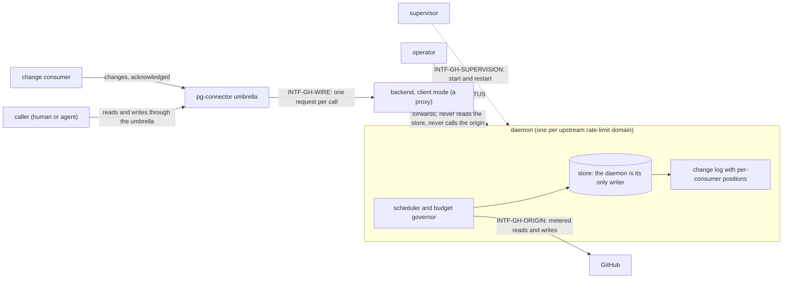

# pg-connector-github — behavior docs

`pg-connector-github` is the **daemon-backed Tier-2 backend** that answers the `pr` and `ci`
capabilities of pg-connector for GitHub. It keeps the data its callers ask for fresh
inside a hard budget, answers their reads from a store it owns, and decides by itself what changed.
This set follows the behavior-docs method
(`phillipgreenii-nix-agent-support · behavior-docs/docs/behavior`) and describes exactly one scope
(`INV-1`), **that backend's own intended behavior** and nothing below it (`INV-2`); the umbrella's side of the same seam (forwarding, acknowledgement
ordering, cache opt-out, ledger stamping) is the parent set's
(`phillipgreenii-nix-agent-support · packages/pg-connector/docs/behavior`), which this set cites and
does not restate. ADR 0090 lifted the earlier restriction that a backend is stateless, which is what
makes a backend like this one allowed; no other backend is required to follow it.

Start here, then the [glossary](glossary.md); the rules are in [invariants](invariants.md), the
boundaries in [interfaces](interfaces.md), the actors in [actors](actors.md), and the stories, use
cases and journeys in [journeys](journeys.md).

## The model

The backend is a **Proxy** in front of an **Active Object**. The daemon owns a persistent
**read-through cache** whose entries are refreshed ahead of expiry by a priority-queue scheduler; its
change log is a polled **Observer** feed with explicit acknowledgement; each field group is a
**Strategy** with its own freshness rule. These are the design patterns the rest of the set uses
the words for.

The idea the whole set serves: a caller's read is a **local hit**, so a poll or a read costs no
origin call while the data is fresh, and the backend never lets a consumer learn of a change before
the data that explains it is already stored.

## Scope (extent + floor)

- **Extent (in)** — what a caller observes of a PR and of its CI through the umbrella (reads from a
  store the daemon owns, writes that go through the daemon, and the freshness and age of each
  answer); how a change consumer polls and acknowledges the backend's own change feed, including the
  changes to a PR's CI; the rules that keep data fresh (the two caches, field groups, keep-alive,
  revalidation, expiry, persistence across a restart, mergeability); the rules that bound spend (a
  hard cap per bucket, the background share, priority classes); what a caller sees when the daemon
  is unreachable; and the diagnostics an operator reads (`status`, and the planned `explain` and
  `refresh`).
- **Extent (out)** — the umbrella's own half of the seam (forwarding `changes` and `changes_ack`,
  flushing before acknowledging, passing annotations through, stamping the ledger), which is the
  parent set's (`INV-CACHE-9`, `INV-LEDGER-FRESH-5`); the numeric defaults of every time-to-live,
  age, cap and share, which are decision-doc material set from measurement; the store's layout and
  engine, the socket framing, the supervisor wrapper per platform, registration of the backend in
  the umbrella's registry, observability catalogues (metrics, event log, alert thresholds), rollout,
  shadow runs and cutover of the consumers that read this backend (pg-desk and pg-router have their
  own sets), and the retirement of the two stateless GitHub backends it supersedes.
- **Floor** (`INV-10`) — this set speaks in entities, field groups, queries, caches, the change log, consumer
  positions, buckets and budgets, and in the existing wire ops and the seven-value error taxonomy
  of the parent set. It names GitHub only as the upstream the backend serves, and names no GitHub
  API shape, no storage engine, no process-manager product, and no source file or function.

## Realization gaps

This set's **realization-gap register** (method `INV-23`): intended behavior this set's
implementation has not built, one row per gap. The set states intended behavior only, and no
daemon-backed GitHub backend exists, so every behavior of the set is recorded here.

| Element               | Intended                                                                                                                                                                                          | Where the implementation stands                                                                                    | Tracked by             |
| --------------------- | ------------------------------------------------------------------------------------------------------------------------------------------------------------------------------------------------- | ------------------------------------------------------------------------------------------------------------------ | ---------------------- |
| `INV-GH-PROC-1`       | one daemon per rate-limit domain is the store's only writer, and client mode neither opens the store nor calls the origin                                                                         | the two GitHub backends are stateless per-call processes with no daemon and no store                               | `pg2-z5fax` (phase 2+) |
| `INV-GH-PROC-2`       | an unreachable daemon is answered `unavailable` with the socket path and the restart hint, `capabilities` is answered without the daemon, and neither a store read nor a direct fetch substitutes | no client mode exists, so no `unavailable` answer of this kind and no daemon-free `capabilities` exist             | `pg2-z5fax` (phase 2+) |
| `INV-GH-PROC-3`       | the application does everything except restart itself, takes all configuration from the rendered file, and behaves identically by hand or under a supervisor                                      | no application exists; the stateless backends read their policy from the request's `config` member                 | `pg2-z5fax` (phase 2+) |
| `INV-GH-PROC-4`       | a store newer than the binary refuses start, a corrupt store is moved aside, and a shutdown loses no pending change row                                                                           | no store exists, so none of these start-up and shutdown rules is implemented                                       | `pg2-z5fax` (phase 2+) |
| `INV-GH-FRESH-1`      | a query cache of ordered ids and an entity cache of field groups, each group with its own freshness and exactly one group per field                                                               | neither cache exists; both stateless backends fetch on every call and the umbrella's own cache is all there is     | `pg2-z5fax` (phase 2+) |
| `INV-GH-FRESH-2`      | a read whose groups are all inside their window is a local hit; otherwise the stale groups are fetched in parallel, single-flight, until the caller's deadline                                    | every read is an origin call; no window, single-flight or deadline behavior exists                                 | `pg2-z5fax` (phase 2+) |
| `INV-GH-FRESH-3`      | keep-alive, background refresh, and eviction after expiry                                                                                                                                         | nothing is refreshed ahead of a call                                                                               | `pg2-z5fax` (phase 2+) |
| `INV-GH-FRESH-4`      | revalidation extends dependent groups on an unchanged summary, never past the hard age, and queues dependents on the named triggers                                                               | no revalidation or hard age exists                                                                                 | `pg2-z5fax` (phase 2+) |
| `INV-GH-FRESH-5`      | content fetched for one head and base is never served as content for another                                                                                                                      | no group records the head and base it was fetched for                                                              | `pg2-z5fax` (phase 2+) |
| `INV-GH-FRESH-6`      | data inside its window is served after a restart with no origin call, and catch-up after an outage obeys the budget                                                                               | no persistent store exists, so a restart of any kind costs a full refill                                           | `pg2-z5fax` (phase 2+) |
| `INV-GH-FRESH-7`      | mergeability is compared against the last known value carried forward, and `UNKNOWN` is never a change                                                                                            | the stateless backends report each fetch as it comes, `UNKNOWN` included                                           | `pg2-z5fax` (phase 2+) |
| `INV-GH-FRESH-8`      | every answer carries `served_from`, `stale`, `age_seconds` and per-group freshness, and `--fresh` forces an origin read                                                                           | no answer carries per-group freshness, and `--fresh` reaches the backend as a wire argument for no op              | `pg2-z5fax` (phase 2+) |
| `INV-GH-FRESH-9`      | a query name must be configured, filtering arguments are applied locally and an ad-hoc key is cached but never re-run                                                                             | no daemon config or query cache exists                                                                             | `pg2-z5fax` (phase 2+) |
| `INV-GH-FRESH-10`     | the CI detection bound, job results cached per attempt, and a failed job fetch never a change                                                                                                     | no CI refresh policy exists; a failed job fetch yields empty jobs                                                  | `pg2-z5fax` (phase 2+) |
| `INV-GH-FRESH-11`     | a change of the acting identity flushes identity-scoped data, and the store holds no credential                                                                                                   | no store exists                                                                                                    | `pg2-z5fax` (phase 2+) |
| `INV-GH-FRESH-12`     | a write invalidates what it affects, a refresh that started earlier cannot overwrite it, writes to one PR are serialized and a retried write creates no duplicate                                 | writes exist and are idempotent by per-comment fingerprint, but invalidation, generations and serialization do not | `pg2-z5fax` (phase 2+) |
| `INV-GH-CHG-1`        | every content change bumps the entity version once and appends one change row with kinds, before and after values, origin and time                                                                | no change log exists                                                                                               | `pg2-z5fax` (phase 3+) |
| `INV-GH-CHG-2`        | a first fetch, a first complete query run and a first fetch of a group are baselines that log no change                                                                                           | no baseline concept exists                                                                                         | `pg2-z5fax` (phase 3+) |
| `INV-GH-CHG-3`        | the settle rule: a change is logged only once its dependent groups are refreshed or the settle timeout passes, and a pending row survives a crash and a shutdown                                  | no settle rule or pending row exists                                                                               | `pg2-z5fax` (phase 3+) |
| `INV-GH-CHG-4`        | the daemon is the only source of upstream kinds and classifies per group from before and after content                                                                                            | the kinds a consumer sees are computed by the consumer or by the umbrella's ledger diff                            | `pg2-z5fax` (phase 3+) |
| `INV-GH-CHG-5`        | `changes` answers the rows after the consumer's acknowledged position for the query, plus departures, with each row carrying its own version and head                                             | no backend answers `changes`                                                                                       | `pg2-z5fax` (phase 3+) |
| `INV-GH-CHG-6`        | acknowledgement is explicit, delivery is at least once, a quiet poll still acknowledges, and the cursor key is (consumer, kind, query)                                                            | no backend answers `changes_ack`                                                                                   | `pg2-z5fax` (phase 3+) |
| `INV-GH-CHG-7`        | a new key starts at the tail after the baseline exists, `--reset` replays current members as added, and `--cached` answers without running the query                                              | no tail start, replay or cursor exists in any backend                                                              | `pg2-z5fax` (phase 3+) |
| `INV-GH-CHG-8`        | retention, the stale-consumer drop and the `cursor_expired:` answer, including after a store move-aside                                                                                           | no retention or `cursor_expired:` answer exists                                                                    | `pg2-z5fax` (phase 3+) |
| `INV-GH-CHG-9`        | a conversation change records the changed comment's id with capped before and after bodies and a hash, never the whole conversation                                                               | no change record exists                                                                                            | `pg2-z5fax` (phase 3+) |
| `INV-GH-CHG-10`       | a CI change is a change of the PR, delivered as `ci_changed` on the PR feed with the data already refreshed, one CI event giving one row                                                          | a CI change is noticed only when a listing diff sees a rollup or head change                                       | `pg2-z5fax` (phase 3c) |
| `INV-GH-CHG-11`       | every `changes` answer reports per query the last whole-query origin answer and the last error                                                                                                    | no `sources_freshness[]` is reported by any backend                                                                | `pg2-z5fax` (phase 3+) |
| `INV-GH-BUDGET-1`     | a hard cap per bucket, and nothing spends below the reserve                                                                                                                                       | the stateless backend keeps a reserve only for its own calls, and no cap spans callers                             | `pg2-z5fax` (phase 2+) |
| `INV-GH-BUDGET-2`     | the five priority classes in order, fill never displacing a due task, and aging so no class starves                                                                                               | no scheduler exists                                                                                                | `pg2-z5fax` (phase 2+) |
| `INV-GH-BUDGET-3`     | background work stops at the background share of each cap, and an exhausted cap serves stale or answers `unavailable` naming the cap                                                              | no governor exists                                                                                                 | `pg2-z5fax` (phase 2+) |
| `INV-GH-BUDGET-4`     | ops that are not cached are performed by the daemon so the governor meters them                                                                                                                   | pass-through ops are performed by each per-call process, outside any shared meter                                  | `pg2-z5fax` (phase 2+) |
| `INV-GH-BUDGET-5`     | a secondary limit pauses background work, a low primary limit stops it, and an authentication failure still serves cached reads with their age                                                    | no governor reacts to a limit                                                                                      | `pg2-z5fax` (phase 2+) |
| `INV-GH-DIAG-1`       | `status` reports health, freshness and spend, and still reports with the daemon down                                                                                                              | no backend offers `status`                                                                                         | `pg2-z5fax` (phase 2+) |
| `INV-GH-DIAG-2`       | `explain` (PLANNED) reports why an entity is stale, group by group                                                                                                                                | the op does not exist                                                                                              | `pg2-z5fax` (phase 3c) |
| `INV-GH-DIAG-3`       | `refresh` (PLANNED) queues a refresh at the write-invalidated class and returns at once                                                                                                           | the op does not exist                                                                                              | `pg2-z5fax` (phase 3c) |
| `INV-GH-ERR-1`        | every failure is answered from the existing seven-value taxonomy per the failure catalog of `INTF-GH-WIRE`, and `version_mismatch` only outside the supported range                               | no daemon or socket protocol exists to answer these                                                                | `pg2-z5fax` (phase 2+) |
| `INTF-GH-WIRE`        | the op catalog of `INTF-GH-WIRE`, including the new ops `changes`, `changes_ack`, `status`, `explain` (PLANNED) and `refresh` (PLANNED), and the `ci changes` verb (PLANNED)                      | none of the new ops is answered by any backend                                                                     | `pg2-z5fax` (phase 3+) |
| `INTF-GH-CONFIG`      | one rendered file carries every setting and every query, and an unknown query or a mismatched config hash fails loudly                                                                            | no rendered daemon config exists                                                                                   | `pg2-z5fax` (phase 2+) |
| `INTF-GH-SUPERVISION` | the supervisor starts and restarts the daemon and the application does the rest                                                                                                                   | no daemon exists to supervise                                                                                      | `pg2-z5fax` (phase 2+) |
| `INTF-GH-STATUS`      | the operator reads health through `status` and through the umbrella's `auth status` and `config validate` rows                                                                                    | no `status` exists and neither umbrella verb reads one                                                             | `pg2-z5fax` (phase 2+) |

## External references

Every element this set cites from outside it is declared here. The owner UUID is the authority;
the link is a convenience (`INV-3`).

| Name                 | What it is                                                                                                      | Owner set-path                                                           | Owner UUID                                                                                                                                              |
| -------------------- | --------------------------------------------------------------------------------------------------------------- | ------------------------------------------------------------------------ | ------------------------------------------------------------------------------------------------------------------------------------------------------- |
| `INV-1`              | a behavior docs set describes exactly one scope                                                                 | `phillipgreenii-nix-agent-support · behavior-docs/docs/behavior`         | [5f8e3cf8-aedc-4718-b1b9-986d4b10ae17](https://github.com/phillipgreenii/nix-agent-support/blob/main/behavior-docs/docs/behavior/invariants.md)         |
| `INV-2`              | a behavior doc describes intended behavior only, no _how_                                                       | `phillipgreenii-nix-agent-support · behavior-docs/docs/behavior`         | [015a5534-9f3c-4eeb-9c22-34397008b9c5](https://github.com/phillipgreenii/nix-agent-support/blob/main/behavior-docs/docs/behavior/invariants.md)         |
| `INV-3`              | typed name plus stable UUID identity convention                                                                 | `phillipgreenii-nix-agent-support · behavior-docs/docs/behavior`         | [c44b760f-9baf-471a-8424-49984eb94ac7](https://github.com/phillipgreenii/nix-agent-support/blob/main/behavior-docs/docs/behavior/invariants.md)         |
| `INV-8`              | an interface declares its counterparty's kind and participation, and owns its catalog                           | `phillipgreenii-nix-agent-support · behavior-docs/docs/behavior`         | [67a79e92-2f98-40a2-9392-034a697e457e](https://github.com/phillipgreenii/nix-agent-support/blob/main/behavior-docs/docs/behavior/invariants.md)         |
| `INV-10`             | a set speaks at its scope's floor (the substitution test)                                                       | `phillipgreenii-nix-agent-support · behavior-docs/docs/behavior`         | [75d9daaa-46f5-4645-949d-f9223bb4fafc](https://github.com/phillipgreenii/nix-agent-support/blob/main/behavior-docs/docs/behavior/invariants.md)         |
| `INV-11`             | a set's extent is exactly what its stories, use cases and journeys need                                         | `phillipgreenii-nix-agent-support · behavior-docs/docs/behavior`         | [f8174e40-806c-4c42-97da-996efd7c6e23](https://github.com/phillipgreenii/nix-agent-support/blob/main/behavior-docs/docs/behavior/invariants.md)         |
| `INV-13`             | a set makes its scope explicit and defines every actor and interface                                            | `phillipgreenii-nix-agent-support · behavior-docs/docs/behavior`         | [94285c70-da89-4402-8ae2-af27925008bd](https://github.com/phillipgreenii/nix-agent-support/blob/main/behavior-docs/docs/behavior/invariants.md)         |
| `INV-18`             | inter-consistency at every interface, reconciled by the counterparty's kind                                     | `phillipgreenii-nix-agent-support · behavior-docs/docs/behavior`         | [4c6a764b-02f5-4c85-afae-a082fe6c21cd](https://github.com/phillipgreenii/nix-agent-support/blob/main/behavior-docs/docs/behavior/invariants.md)         |
| `INV-20`             | at a reference seam a shared term is inherited or renamed, never silently redefined                             | `phillipgreenii-nix-agent-support · behavior-docs/docs/behavior`         | [bafdd784-81ed-46fe-88f0-1a8c5fc4caf0](https://github.com/phillipgreenii/nix-agent-support/blob/main/behavior-docs/docs/behavior/invariants.md)         |
| `INV-22`             | traceability is a per-element listing obligation                                                                | `phillipgreenii-nix-agent-support · behavior-docs/docs/behavior`         | [b2502527-1340-4a1f-858c-aaa80c601317](https://github.com/phillipgreenii/nix-agent-support/blob/main/behavior-docs/docs/behavior/invariants.md)         |
| `INV-23`             | the realization-gap register is set-level and never an element                                                  | `phillipgreenii-nix-agent-support · behavior-docs/docs/behavior`         | [f3bba3e7-440f-4109-a4de-9d37daa34bcf](https://github.com/phillipgreenii/nix-agent-support/blob/main/behavior-docs/docs/behavior/invariants.md)         |
| `INV-STATE-1`        | per-call policy comes from the request, except for a daemon-backed backend, which reads its own rendered config | `phillipgreenii-nix-agent-support · packages/pg-connector/docs/behavior` | [4d8b2e91-7a3c-4f6d-9e1b-8c5a2d7f3b64](https://github.com/phillipgreenii/nix-agent-support/blob/main/packages/pg-connector/docs/behavior/invariants.md) |
| `INV-CACHE-1`        | the umbrella-owned entity cache for a backend that does not own its cache and changes                           | `phillipgreenii-nix-agent-support · packages/pg-connector/docs/behavior` | [892af663-9a46-4229-93d3-ac43d73f73c6](https://github.com/phillipgreenii/nix-agent-support/blob/main/packages/pg-connector/docs/behavior/invariants.md) |
| `INV-CACHE-8`        | `--fresh` is forwarded to a backend that owns its cache, which decides how current its answer is                | `phillipgreenii-nix-agent-support · packages/pg-connector/docs/behavior` | [eab5289c-7cb4-437c-abf4-42b2ee6b9889](https://github.com/phillipgreenii/nix-agent-support/blob/main/packages/pg-connector/docs/behavior/invariants.md) |
| `INV-CACHE-9`        | the umbrella's obligations toward a backend that owns its cache and changes                                     | `phillipgreenii-nix-agent-support · packages/pg-connector/docs/behavior` | [c9435bbd-8d45-4613-961d-84e719d85ccc](https://github.com/phillipgreenii/nix-agent-support/blob/main/packages/pg-connector/docs/behavior/invariants.md) |
| `INV-LEDGER-FRESH-2` | a cache answer never advances a ledger key's `refreshed_at`                                                     | `phillipgreenii-nix-agent-support · packages/pg-connector/docs/behavior` | [872fc219-5a0a-4d44-9fd3-03466805a948](https://github.com/phillipgreenii/nix-agent-support/blob/main/packages/pg-connector/docs/behavior/invariants.md) |
| `INV-LEDGER-FRESH-5` | the umbrella stamps its ledger from the backend's `sources_freshness[]` and the consumer's `last_seen`          | `phillipgreenii-nix-agent-support · packages/pg-connector/docs/behavior` | [9d4453e8-0447-48ef-b017-5cdfb10fc0d5](https://github.com/phillipgreenii/nix-agent-support/blob/main/packages/pg-connector/docs/behavior/invariants.md) |
| `INV-ERR-1`          | the closed seven-value wire error taxonomy                                                                      | `phillipgreenii-nix-agent-support · packages/pg-connector/docs/behavior` | [18167463-248b-4264-b08e-2dce05a601b9](https://github.com/phillipgreenii/nix-agent-support/blob/main/packages/pg-connector/docs/behavior/invariants.md) |
| `INV-ERR-3`          | `query_not_recognized` for a query name the backend's config does not define                                    | `phillipgreenii-nix-agent-support · packages/pg-connector/docs/behavior` | [7b4f2a91-6c3d-4e8a-9f10-2d5e8a3c6b17](https://github.com/phillipgreenii/nix-agent-support/blob/main/packages/pg-connector/docs/behavior/invariants.md) |
| `INV-EXIT-1`         | the umbrella's own exit-code schemes, the source of a health command's 0, 2 and 3                               | `phillipgreenii-nix-agent-support · packages/pg-connector/docs/behavior` | [e804ff39-e941-4a3f-b754-d16a114eea9d](https://github.com/phillipgreenii/nix-agent-support/blob/main/packages/pg-connector/docs/behavior/invariants.md) |
| `INTF-WIRE`          | the umbrella to backend wire protocol this backend implements                                                   | `phillipgreenii-nix-agent-support · packages/pg-connector/docs/behavior` | [17ee2995-d5b6-4a06-8324-9f95ba0e5322](https://github.com/phillipgreenii/nix-agent-support/blob/main/packages/pg-connector/docs/behavior/interfaces.md) |
| `ACTOR-BACKEND`      | the Tier-2 backend actor, which a daemon-backed backend extends with `status`                                   | `phillipgreenii-nix-agent-support · packages/pg-connector/docs/behavior` | [35459b50-8ead-48b1-85c3-5b70fad85129](https://github.com/phillipgreenii/nix-agent-support/blob/main/packages/pg-connector/docs/behavior/actors.md)     |

## Documents

- **[README](README.md)** · **[glossary](glossary.md)** · **[actors](actors.md)** ·
  **[interfaces](interfaces.md)** · **[invariants](invariants.md)** ·
  **[stories, use cases & journeys](journeys.md)**
