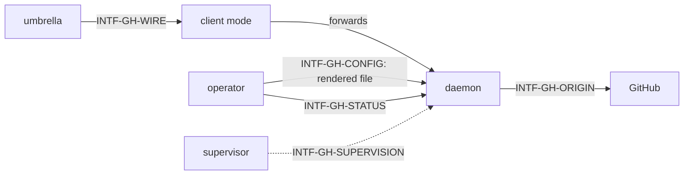

# Interfaces — pg-connector-github

This file follows the interface convention of the behavior-docs method
(`phillipgreenii-nix-agent-support · behavior-docs/docs/behavior`, `INV-8`): an **interface** is a
boundary described by **what crosses it** and **what must hold**, never _how_ it is implemented.
See the [glossary](glossary.md) for terms, [actors](actors.md) for who sits on each side,
[invariants](invariants.md) for the rules, and [journeys](journeys.md) for the flows that exercise
these interfaces. The backend has five interfaces, each classified on both axes the method asks for
(the counterparty's kind, and essential versus optional participation):

| Interface             | Boundary                                                   | Counterparty (kind)                            | Participation | Initiator  |
| --------------------- | ---------------------------------------------------------- | ---------------------------------------------- | ------------- | ---------- |
| `INTF-GH-WIRE`        | one op request in; one result or taxonomy-coded error out  | `ACTOR-GH-UMBRELLA` umbrella (**owner**)       | essential     | umbrella   |
| `INTF-GH-ORIGIN`      | metered reads and writes out; origin answers and limits in | `ACTOR-GH-ORIGIN` origin (**actor**, a system) | essential     | daemon     |
| `INTF-GH-CONFIG`      | one rendered settings file in                              | `ACTOR-GH-OPERATOR` operator (**actor**)       | essential     | operator   |
| `INTF-GH-STATUS`      | a health report out, even with the daemon down             | `ACTOR-GH-OPERATOR` operator (**actor**)       | optional      | operator   |
| `INTF-GH-SUPERVISION` | start and restart of the daemon                            | `ACTOR-GH-SUPERVISOR` supervisor (**actor**)   | optional      | supervisor |

## `INTF-GH-WIRE` — the umbrella to backend wire protocol, for this backend <!-- uuid: 54016f25-0794-4a61-8543-378bc69ce825 -->

- **Counterparty:** `ACTOR-GH-UMBRELLA`, kind **owner**: the parent set's `INTF-WIRE` is the
  contract this backend implements. This section **cites** it and states only this backend's own
  obligations, reconciled by the umbrella's conformance expectations rather than a peer
  cross-check (`INV-18`). **Participation:** essential. **Initiator:** the umbrella, always. **One
  backend, two instances:** it answers the `pr` and `ci` capabilities, and the registry keeps one
  name per instance.
- **What does not change.** The wire envelope, its two version numbers and the closed seven-value
  error taxonomy (`INV-ERR-1`) are the parent's. This backend adds no error code. Result shapes gain
  the optional fields below.
- **Declarations.** The backend declares `owns_changes` and `cache_opt_out` in its `capabilities`
  answer, and answers `capabilities` without contacting its daemon (`INV-GH-PROC-2`). The first
  makes the umbrella forward `changes` and `changes_ack`; the second turns off the umbrella-owned
  entity cache (`INV-CACHE-1`) for this backend, so that the backend alone decides how current an
  answer is.

### Op catalog

An op's **groups** are the field groups it needs; a read whose groups are all inside their freshness
window is a local hit (`INV-GH-FRESH-2`). **PLANNED** marks an op or verb that is intended behavior
and is not available.

| Instance | Op                  | Served from                                | Groups read                        | Note                                                                         |
| -------- | ------------------- | ------------------------------------------ | ---------------------------------- | ---------------------------------------------------------------------------- |
| `pr`     | `show`              | store, read-through                        | summary, detail, conversation      |                                                                              |
| `pr`     | `list`              | query cache and store                      | summary                            | a configured query name is required (`INV-GH-FRESH-9`)                       |
| `pr`     | `files`             | store, read-through                        | files                              |                                                                              |
| `pr`     | `commits`           | store, read-through                        | commits                            |                                                                              |
| `pr`     | `review_pending`    | store, read-through                        | pending                            | never refreshed in the background                                            |
| `pr`     | `review_submit`     | origin, through the daemon                 | origin reads for its preconditions | creates or appends to the acting identity's pending review; never submits it |
| `pr`     | `search`            | metered pass-through                       |                                    | not stored (`INV-GH-BUDGET-4`)                                               |
| `pr`     | `list_activity`     | metered pass-through                       |                                    | not stored                                                                   |
| `pr`     | `changes`           | change log                                 |                                    | the PR feed (`INV-GH-CHG-5`)                                                 |
| `pr`     | `changes_ack`       | change log                                 |                                    | moves a consumer position (`INV-GH-CHG-6`)                                   |
| `pr`     | `refresh` (PLANNED) | queues a refresh, returns at once          | the named groups                   | the verb `pr refresh <id>` or `pr refresh --query Q` (`INV-GH-DIAG-3`)       |
| `pr`     | `explain` (PLANNED) | store                                      |                                    | the verb `pr explain <id>` (`INV-GH-DIAG-2`)                                 |
| `ci`     | `list_runs`         | store, read-through                        | runs                               |                                                                              |
| `ci`     | `get_logs`          | metered pass-through                       |                                    | not stored                                                                   |
| `ci`     | `rerun_failed`      | origin, through the daemon                 |                                    | invalidates runs; a run already re-running is a no-op answer                 |
| `ci`     | `changes` (PLANNED) | change log, CI view                        |                                    | the verb `ci changes --consumer C --query Q` (`INV-GH-CHG-10`)               |
| `ci`     | `changes_ack`       | change log                                 |                                    | for the CI view's own cursor key                                             |
| `ci`     | `explain` (PLANNED) | store                                      |                                    | the verb `ci explain <pr-id>`                                                |
| `ci`     | `refresh` (PLANNED) | queues a refresh, returns at once          | runs                               |                                                                              |
| both     | `capabilities`      | the client, without the daemon             |                                    | `INV-GH-PROC-2`                                                              |
| both     | `auth_status`       | the daemon; `unavailable` when it is down  |                                    | reports the acting identity and any authentication failure                   |
| both     | `status`            | the daemon; a local report when it is down |                                    | `INTF-GH-STATUS`                                                             |

### Read answers

Every read answer carries the parent's `served_from`, `stale` and `age_seconds`, plus an optional
`groups[]` with one entry per group served: `{group, fetched_at, fresh_until, max_age_at,
last_error}` (`INV-GH-FRESH-8`). `age_seconds` is the age of the oldest `fetched_at` among the groups
served.

### Change feed fields

- Each change carries `seq`, `kinds`, `fields` (each field with its before and after value) and the
  change cause (`origin`) in addition to the parent's `{change, source, entity}`. `change` maps from the kinds: an
  `entered_query` kind gives `added`; `left_query` and `removed` give `removed`; anything else gives
  `changed`. `entity` is the summary-level entity (the CI view's is the PR's CI state) with
  `version` and `head_sha` set to **the row's own** values (`INV-GH-CHG-5`).
- Each source carries `next_seq`, the log position scanned up to, which can be past the last
  returned row because rows for non-members are skipped, and keeps its existing `version` (the
  position count for the key).
- Each forwarded `changes` answer carries `sources_freshness[]`, one entry per configured query:
  the time of the last whole-query origin answer and the last error (`INV-GH-CHG-11`).
- `changes_ack` carries `{consumer, query, next_seq}` (and the instance, which gives the cursor key's
  kind).

### Change kinds (catalog)

The closed set of kinds a change row carries (`INV-GH-CHG-4`): `reopened`, `closed`, `merged`,
`draft_changed`, `head_changed`, `base_changed`, `ci_changed`, `mergeability_changed`,
`review_changed`, `feedback_changed`, `renamed`, `removed`, `entered_query`, `left_query`.
There is no `opened` kind: a first sighting is a baseline (`INV-GH-CHG-2`), so a new PR reaches a
consumer as `entered_query` on the query it joined. `ci_changed` means the summary's CI rollup
changed, or the `runs` group changed in any of: per run its id, attempt, workflow name, head
commit, status and conclusion, and per gathered job its name, status and conclusion. Timestamps and
log addresses are not signals.

### Failure catalog

Every failure is answered from the parent's seven-value taxonomy (`INV-GH-ERR-1`):

| Failure                                        | Answer                                                                                                                          |
| ---------------------------------------------- | ------------------------------------------------------------------------------------------------------------------------------- |
| origin error or timeout                        | the group stays stale and records its last error; an interactive read gets stale content inside expiry, otherwise `unavailable` |
| origin batch fails for one group               | that batch falls back to per-entity fetches for the group                                                                       |
| secondary limit from the origin                | background work pauses for the stated time; interactive reads are served stale                                                  |
| point-metered bucket below the reserve         | background work stops; interactive reads are served stale or answered `unavailable` naming the reserve                          |
| authentication failure                         | fetches answer `unauthenticated`; cached reads are still served with their age; `auth_status` reports the failure               |
| acting identity changed                        | identity-scoped data is flushed (`INV-GH-FRESH-11`)                                                                             |
| PR deleted or inaccessible                     | the entity is tombstoned and recorded as `removed`                                                                              |
| daemon unreachable                             | `unavailable` naming the socket path and the supervisor's restart hint (`INV-GH-PROC-2`)                                        |
| daemon migrating its store                     | `unavailable` whose message starts with `migrating:`                                                                            |
| store corrupt, or its migration fails          | the store is moved aside with a timestamp, the daemon starts empty with refill limited, and an alert fires (`INV-GH-PROC-4`)    |
| store newer than the binary                    | the daemon refuses to start and alerts; it never moves the store aside (`INV-GH-PROC-4`)                                        |
| protocol version outside the supported range   | `version_mismatch`; a difference inside the range is reported by `status`, never as an error                                    |
| socket path, permission or peer identity       | the daemon rejects with a log line; the client answers `unavailable` naming the socket path                                     |
| query name the config does not define          | `query_not_recognized` (`INV-ERR-3`)                                                                                            |
| attached config hash differs from the daemon's | `invalid_argument` naming both config paths, so a stale registry fails loudly                                                   |
| consumer position outside retention            | `invalid_argument` whose message starts with `cursor_expired:` (`INV-GH-CHG-8`)                                                 |
| a key held for the other feed                  | `invalid_argument` naming the existing key (`INV-GH-CHG-10`)                                                                    |

- **What must hold.** Each op and answer above, under the invariants named against it. The backend
  MUST NOT answer an op from the umbrella's own state, and MUST NOT depend on the umbrella's cache
  or ledger for any answer (`INV-CACHE-9`).
- **How agreement is confirmed.** The umbrella's half of each exchange is the parent set's, and its
  forwarding and acknowledgement order is verified there (`INV-CACHE-9`, `INV-LEDGER-FRESH-5`). This
  backend's half is confirmed by a conformance suite that runs each op of the catalog above against
  a throwaway store and a faked origin.

## `INTF-GH-ORIGIN` — the daemon to the upstream <!-- uuid: 04166f84-af4a-4e83-ad9e-e7216760ad6c -->

- **Counterparty:** `ACTOR-GH-ORIGIN`, kind **actor** (a system the daemon drives; the interface
  definition itself is the agreement, since the origin keeps no behavior docs set).
  **Participation:** essential. **Initiator:** the daemon, only.
- **What crosses (out).** Batched summary reads of many entities in one call, membership-only reads of
  a query, per-entity reads of the other groups, run listings and job reads, and the two writes
  (`review_submit`, `rerun_failed`). Every call is made by the daemon, under one credential on one
  host, through the one path that lets the governor see the origin's own rate-limit report.
- **What crosses (in).** Content and the origin's own rate-limit report with each answer, a secondary
  limit's stated pause, and authentication failures.
- **What must hold.** No call is made outside the governor (`INV-GH-BUDGET-1`, `INV-GH-BUDGET-4`);
  the credential stays with the tool that holds it and never enters the store (`INV-GH-FRESH-11`);
  the daemon assumes one host per daemon; a failed call leaves the previous content in place
  (`INV-GH-FRESH-2`).
- **How agreement is confirmed.** A faked origin in the conformance suite, and a measurement of the
  per-call cost of each group that sets the cost-dependent defaults.

## `INTF-GH-CONFIG` — the rendered settings file <!-- uuid: 57f22058-acb5-404e-b4f4-bd1e22a2c53d -->

- **Counterparty:** `ACTOR-GH-OPERATOR`, kind **actor** (the party that authors the settings; a
  deployment renders them). **Participation:** essential. **Initiator:** the operator.
- **What crosses.** One rendered file, named on the backend's command line, that carries every setting
  the daemon and its client need: the origin host, the paths of the tools and the state, the socket
  path, the configured queries, each group's freshness window and hard age, the keep-alive window,
  expiry, retention, the settle timeout, the batch size and worker count, and the caps, the reserve and
  the background share per bucket. The queries and the registry entry are rendered from one source,
  so the file and the umbrella's own `backends.<name>` block carry the same config hash.
- **What must hold.** Nothing the daemon or the client needs comes from the environment, so a daemon
  started by hand with an empty environment behaves as it does under its supervisor
  (`INV-GH-PROC-3`, `INV-STATE-1`). The file hard-codes no user, team or organisation. A change takes
  effect by restarting the daemon; there is no live reload. Numeric defaults are decision-doc
  material and are not fixed here.
- **How agreement is confirmed.** The conformance suite starts the daemon from a rendered file under
  an empty environment, and asserts the unknown-query and config-hash answers.

## `INTF-GH-STATUS` — the health report <!-- uuid: e12ef94a-3fd5-4bb7-9dd0-2b9f66bd02d0 -->

- **Counterparty:** `ACTOR-GH-OPERATOR`, kind **actor**. **Participation:** optional (a deployment
  that never asks is valid). **Initiator:** the operator, by the backend's own `status` command or
  through the umbrella's `auth status` and `config validate`, which show it as rows.
- **What crosses (out).** Version and build id, uptime, store path and size, each bucket's spend and
  any pause with its reason and end time, queue depth and the oldest overdue task by class, per-query
  last whole-query success and last error, authentication state and the acting identity, the change
  log's head position, pending settle rows and settle timeouts in the last hour, per-consumer
  positions, the supervisor, and which registry name is served by which instance. A `--json` form
  carries the same values.
- **What must hold.** The report is produced even with the daemon down (`INV-GH-DIAG-1`). Its exit
  code follows the parent's `INV-EXIT-1`: 0 healthy, 2 degraded, 3 down.
- **How agreement is confirmed.** Actor: the definition is the agreement; the conformance suite
  asserts the down-daemon report.

## `INTF-GH-SUPERVISION` — starting and restarting the daemon <!-- uuid: e3b5b8aa-d3ad-41bf-863a-05dd56207e7e -->

- **Counterparty:** `ACTOR-GH-SUPERVISOR`, kind **actor**. **Participation:** optional (the daemon
  runs when an operator starts it by hand). **Initiator:** the supervisor.
- **What crosses.** A start at login with the config file named, a restart when the daemon exits, and
  a shutdown signal. The daemon answers a shutdown signal by refusing new connections, finishing
  in-flight writes, appending every pending change row, and releasing its single-instance lock.
- **What must hold.** The supervisor has no logic of its own: the application does everything except
  restart itself (`INV-GH-PROC-3`). Where no supervisor exists, `unavailable` names the command that
  starts the daemon in the background, never one that would block the caller's shell.
- **How agreement is confirmed.** Actor: the definition is the agreement; the conformance suite
  restarts the daemon and asserts the shutdown answer and the durable pending rows.
