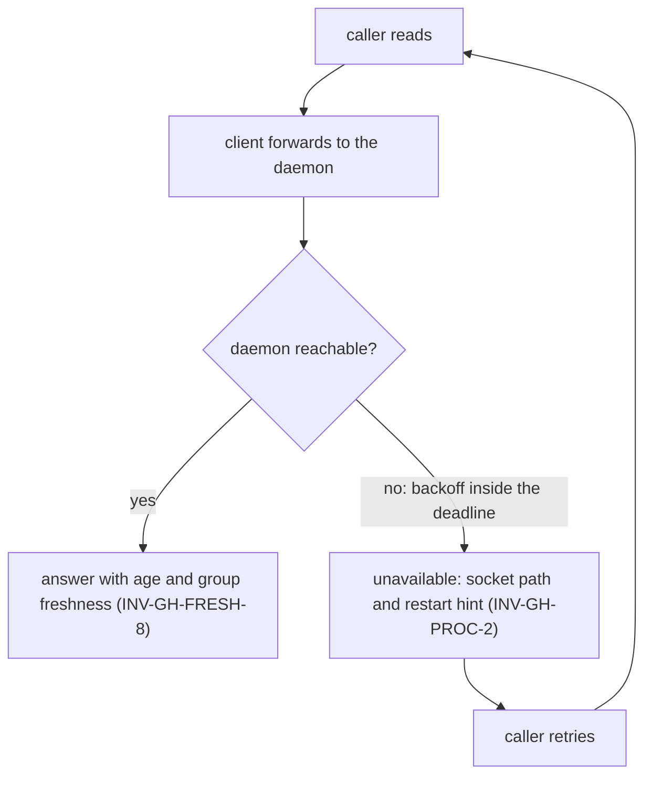
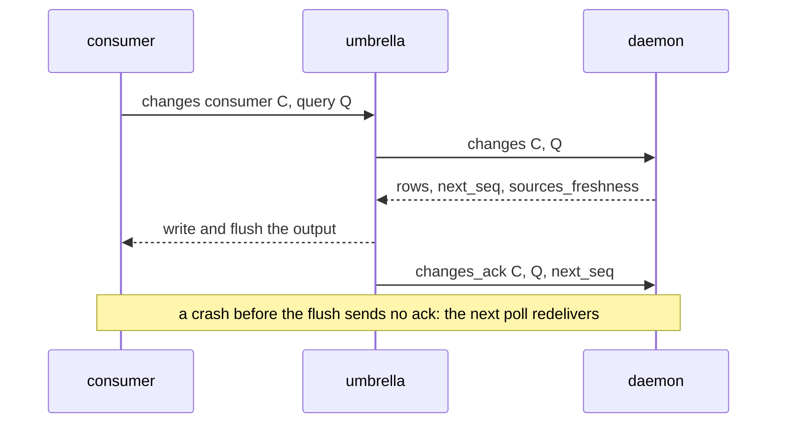
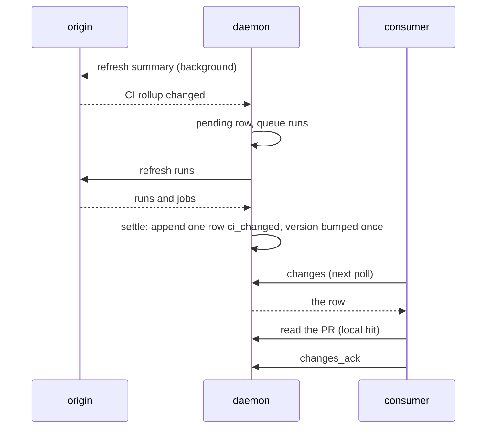
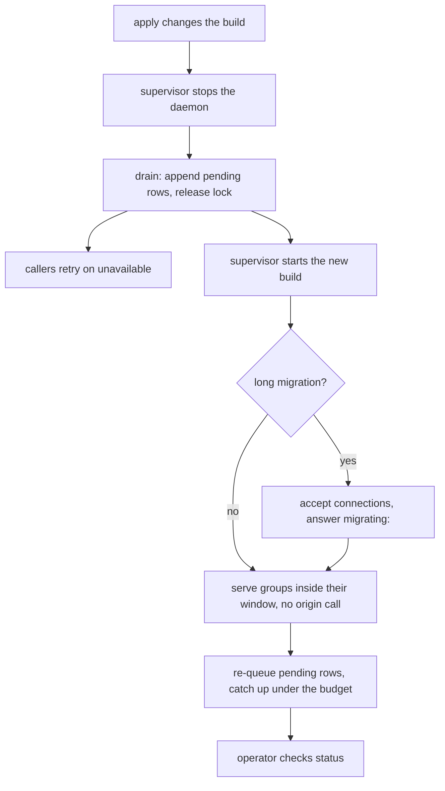

# Stories, use cases & journeys — pg-connector-github

User stories, the use cases they exercise, and the journeys that compose them. Together they
establish the extent, since a set's extent is exactly what its stories, use cases and journeys
require (`phillipgreenii-nix-agent-support · behavior-docs/docs/behavior · INV-11`). Each carries
its own listing of what it requires and includes (`INV-22`). See the [glossary](glossary.md),
[actors](actors.md), [interfaces](interfaces.md) and [invariants](invariants.md); every ID cited
below resolves in one of those files, in the parent set declared in the README, or in the method
set.

## User stories

**Caller (`ACTOR-GH-CALLER`)**

- **`STORY-GH-1`** <!-- uuid: 5402125f-b435-4088-826d-ad5979a60989 --> — As a **caller**, I want to read a PR or its CI and get
  a local answer that says how old it is, so that a skill or an operator never waits on the origin
  for data the backend already holds, and never mistakes old data for current. _(→
  `USECASE-GH-READ-ENTITY`; `INV-GH-FRESH-1`, `INV-GH-FRESH-2`, `INV-GH-FRESH-8`, `INV-GH-PROC-1`.)_
- **`STORY-GH-2`** <!-- uuid: 47c4855c-18e5-4a65-84ad-08f83a40539a --> — As a **caller**, I want to list the PRs of a query I
  named once in configuration, answered from what the backend already holds, and a clear signal when
  I name a query it does not know, so that a listing is cheap and a typo is never an empty result.
  _(→ `USECASE-GH-READ-QUERY`; `INV-GH-FRESH-3`, `INV-GH-FRESH-9`, `INV-GH-FRESH-4`.)_
- **`STORY-GH-3`** <!-- uuid: 3665db30-e75b-48dd-b014-f82b750d0b32 --> — As a **caller** that has just pushed a commit, I want to
  read the PR back as the origin now has it, so that I do not act on the picture from before my own
  push. _(→ `USECASE-GH-READ-BACK-WRITE`; `INV-GH-FRESH-8`, `INV-GH-DIAG-3`.)_
- **`STORY-GH-4`** <!-- uuid: fcecaf46-490a-47d8-81fd-da4e9560b088 --> — As a **caller**, I want a restart of the daemon never
  to cost a burst of origin calls, and the data it already held to keep being served, so that a
  restart is not a spend spike and not a stretch of stale or empty answers. _(→
  `USECASE-GH-READ-ENTITY`; `INV-GH-FRESH-6`, `INV-GH-PROC-4`, `INV-GH-BUDGET-1`.)_
- **`STORY-GH-5`** <!-- uuid: 8d3a2b88-d076-4355-9f55-1b9ab59e18a5 --> — As a **caller**, I want a clear, retryable
  `unavailable` that names where to look when the daemon is down, rather than an empty answer, old
  content from somewhere else, or a direct call that spends the budget behind the daemon's back, so
  that I wait and retry instead of acting on a wrong picture. _(→ `USECASE-GH-DAEMON-DOWN`;
  `INV-GH-PROC-2`, `INV-GH-ERR-1`.)_
- **`STORY-GH-6`** <!-- uuid: 83f0d773-ad2c-4d17-a75a-d715b2626db4 --> — As a **caller**, I want to save a pending review or
  rerun failed runs through the daemon safely, so that a retry after an outage creates no duplicate
  and the next read reflects my write. _(→ `USECASE-GH-WRITE`; `INV-GH-FRESH-12`,
  `INV-GH-FRESH-11`, `INV-GH-BUDGET-4`.)_

**Change consumer (`ACTOR-GH-CONSUMER`)**

- **`STORY-GH-7`** <!-- uuid: 7d7271cf-ae7f-4c00-aa6a-7d0f171013e5 --> — As a **change consumer**, I want to poll what changed
  for a query and acknowledge only what I have actually received, so that a crash between receiving
  and acting loses nothing, and I never diff listings, sweep or hydrate PRs myself. _(→
  `USECASE-GH-POLL-CHANGES`; `INV-GH-CHG-1`, `INV-GH-CHG-5`, `INV-GH-CHG-6`.)_
- **`STORY-GH-8`** <!-- uuid: 067abd27-354c-4104-bc6d-86330bb23fe1 --> — As a **change consumer** starting on a new query, I want
  to begin at the present instead of being handed every open PR, and to be told plainly when my
  position is too old to continue, so that a new consumer or a cold store never bursts my work queue
  and a gap is never silently skipped. _(→ `USECASE-GH-POLL-CHANGES`; `INV-GH-CHG-2`,
  `INV-GH-CHG-7`, `INV-GH-CHG-8`.)_
- **`STORY-GH-9`** <!-- uuid: b88888c4-3ee4-48b6-9ae4-a62c8919b7e2 --> — As a **change consumer** that decides whether a PR is
  reviewable from its CI, I want a change in a run or a job, even one behind an unchanged overall
  result, delivered on the same feed as the PR with the data already refreshed, so that I re-run
  my decision once, on current data. _(→ `JOURNEY-GH-CHANGE-TO-ACTION`; `INV-GH-CHG-3`,
  `INV-GH-CHG-10`, `INV-GH-FRESH-10`.)_
- **`STORY-GH-10`** <!-- uuid: 16148760-81a7-43bd-a88e-e92aea17d8ad --> — As a **change consumer**, I want a PR leaving a query to
  be reported as a departure, and a mergeability value that only flickers through `UNKNOWN` not to be
  reported at all, so that I see real changes and no noise. _(→ `USECASE-GH-POLL-CHANGES`;
  `INV-GH-CHG-4`, `INV-GH-FRESH-7`, `INV-GH-FRESH-9`.)_
- **`STORY-GH-11`** <!-- uuid: 5b5bbd07-32db-43a4-84fd-76a318e55e06 --> — As a **change consumer** whose own freshness view reads
  the umbrella's ledger, I want every forwarded poll to report when each query last had a whole
  origin answer and its last error, so that a quiet feed is told apart from a stalled one. _(→
  `USECASE-GH-POLL-CHANGES`; `INV-GH-CHG-11`, `INV-GH-CHG-9`.)_

**Operator (`ACTOR-GH-OPERATOR`)**

- **`STORY-GH-12`** <!-- uuid: ce738071-7e7c-48ea-90cc-4ffc8c689ac8 --> — As an **operator**, I want one place that says whether
  the daemon is healthy, how fresh its data is and how much it is spending, even when the daemon is
  down, so that I find the cause of an outage without a running daemon. _(→
  `USECASE-GH-DIAGNOSE`; `INV-GH-DIAG-1`.)_
- **`STORY-GH-13`** <!-- uuid: 5ed7fda0-9229-4e1c-b77f-3ec3a99a91cd --> — As an **operator**, I want to ask why one entity is
  stale, group by group, so that I tell a pending settle, a failing fetch and a held-back refresh
  apart. _(→ `USECASE-GH-DIAGNOSE`; `INV-GH-DIAG-2`, `INV-GH-FRESH-5`, `INV-GH-CHG-3`.)_
- **`STORY-GH-14`** <!-- uuid: 150d3041-50ff-470c-b94f-164619cee7f6 --> — As an **operator**, I want spend held inside a hard cap
  per bucket with room kept for the reads and writes callers wait on, and a burst or a limit from
  the origin never to starve them, so that the token's budget is predictable and callers are not
  locked out. _(→ `JOURNEY-GH-BUDGET-PRESSURE`; `INV-GH-BUDGET-1`, `INV-GH-BUDGET-2`,
  `INV-GH-BUDGET-3`, `INV-GH-BUDGET-5`.)_
- **`STORY-GH-15`** <!-- uuid: a00591b4-58e5-41e4-a84c-279f7217b5bd --> — As an **operator**, I want the daemon to behave the same
  whether I start it by hand or a supervisor does, and an upgrade to be survivable, so that I debug
  with the same behavior production has. _(→ `JOURNEY-GH-RESTART`; `INV-GH-PROC-3`,
  `INV-GH-PROC-1`.)_

## Use cases

### `USECASE-GH-FETCH-STALE` — refresh the stale groups a read needs <!-- uuid: b92cef43-63bc-4d27-a99a-2dc2b4772c83 -->

**Actor:** `ACTOR-GH-CALLER` (waiting on a read).
**Level:** subfunction.
**Preconditions:** the daemon is reachable and at least one group a read needs is outside its
freshness window.
**Intent:** make the groups a caller is waiting on current without making the caller wait for a
batch, and without spending past the budget.
_Requires:_ `INV-GH-FRESH-2`, `INV-GH-FRESH-4`, `INV-GH-FRESH-5`, `INV-GH-BUDGET-2`.

**Main success scenario.**

1. The daemon queues each stale group at the interactive class.
2. It fetches the groups in parallel; a request for a group already being fetched joins that fetch.
3. A stale summary goes out at once, with spare batch slots filled by entities nearly due.
4. Each fetched group is stored with the head and base it was fetched for.
5. The daemon answers with the fresh content.

Extensions:

- The caller's deadline passes first: the fetch is not cancelled and completes in the background; the
  answer is the stale content if inside expiry, otherwise `unavailable`.
- The origin fails or a cap is reached: the previous content stays, and the answer is stale content
  inside expiry or `unavailable` (`INV-GH-BUDGET-3`).

### `USECASE-GH-READ-ENTITY` — read one PR or its CI <!-- uuid: cded52ae-9494-4d78-98b5-c08e7595bb4d -->

**Actor:** `ACTOR-GH-CALLER`.
**Level:** user-goal.
**Preconditions:** a PR id the origin knows.
**Intent:** read a PR, its files, its commits, its pending review or its CI runs, from the store when
the data is fresh, and learn its age.
_Requires:_ `INV-GH-PROC-1`, `INV-GH-FRESH-1`, `INV-GH-FRESH-2`, `INV-GH-FRESH-6`, `INV-GH-FRESH-8`,
`INV-GH-FRESH-10`.
_Includes:_ `USECASE-GH-FETCH-STALE`.

**Main success scenario.**

1. The caller runs a read verb through the umbrella, which executes the backend in client mode.
2. The client forwards the request to the daemon.
3. The daemon records the access, which keeps the entity in the keep-alive set.
4. Every group the op needs is inside its freshness window: the daemon answers from the store, with
   no origin call.
5. The answer carries `served_from`, `stale`, `age_seconds` and `groups[]`.

Extensions:

- 4a. A group is stale: the daemon runs `USECASE-GH-FETCH-STALE` and answers with its result.
- 4b. The daemon has just restarted: groups still inside their window are served as in step 4
  (`INV-GH-FRESH-6`).
- The caller passed `--fresh`: every group the op needs is fetched (`INV-GH-FRESH-8`).

### `USECASE-GH-READ-QUERY` — list the PRs of a configured query <!-- uuid: ccecc4ab-6140-4cf3-9087-232c86e9646e -->

**Actor:** `ACTOR-GH-CALLER`.
**Level:** user-goal.
**Preconditions:** a query name defined in the rendered config.
**Intent:** list a query's PRs at summary level, answered from the query cache and the entity cache.
_Requires:_ `INV-GH-FRESH-3`, `INV-GH-FRESH-4`, `INV-GH-FRESH-7`, `INV-GH-FRESH-9`, `INV-GH-FRESH-1`.
_Includes:_ `USECASE-GH-FETCH-STALE`.

**Main success scenario.**

1. The caller runs `list --query Q`, optionally with a time range.
2. If Q's id list is inside its window the daemon uses it; otherwise it re-runs Q for membership only
   and stores the ordered ids with a complete flag.
3. A time range filters the cached ids locally.
4. Every id's summary that is fresh is used as is; the stale ones are fetched in batches
   (`USECASE-GH-FETCH-STALE`).
5. The daemon answers once every id has a summary, with the carried-forward mergeability value.

Extensions:

- The name is not configured: `query_not_recognized` (`INV-ERR-3`), never an empty list.
- An argument changes what the origin is asked: the key is ad hoc, cached for its own window and never
  re-run by the scheduler.

### `USECASE-GH-READ-BACK-WRITE` — read back the caller's own out-of-band write <!-- uuid: 50139ad4-e528-43b9-9e5a-fa57a6804daf -->

**Actor:** `ACTOR-GH-CALLER`.
**Level:** user-goal.
**Preconditions:** the caller changed a PR by a route that does not go through the daemon (a push, a
PR creation) and now needs the result.
**Intent:** see the origin's current picture without waiting for a freshness window.
_Requires:_ `INV-GH-FRESH-8`, `INV-GH-DIAG-3`, `INV-GH-BUDGET-2`.
_Includes:_ `USECASE-GH-FETCH-STALE`.

**Main success scenario.**

1. The caller reads with `--fresh`.
2. The daemon fetches every group the op needs (`USECASE-GH-FETCH-STALE`).
3. The caller sees the new head, and the groups that depend on it are refreshed for that head.

Extensions:

- The caller prefers not to wait: it runs `pr refresh <id>` (PLANNED, not available), which queues the
  groups and returns at once, and reads when it needs them (`INV-GH-DIAG-3`).
- A polling path never does either: it relies on the backend keeping the data fresh.

### `USECASE-GH-WRITE` — save a pending review or rerun failed runs <!-- uuid: 5735f418-11cd-43ea-a039-41dd9835084d -->

**Actor:** `ACTOR-GH-CALLER`.
**Level:** user-goal.
**Preconditions:** an authenticated acting identity.
**Intent:** change the origin through the daemon without duplicates, and read the result.
_Requires:_ `INV-GH-FRESH-12`, `INV-GH-FRESH-11`, `INV-GH-BUDGET-4`, `INV-GH-FRESH-5`.

**Main success scenario.**

1. The caller runs `review_submit` or `rerun_failed`.
2. The daemon serializes the write with other writes to the same PR and reads the origin for the
   write's own preconditions.
3. It performs the write at class 2.
4. It marks the affected group stale and queues it at the write-invalidated class.
5. It answers with the write's result; the next read of that group is current.

Extensions:

- The daemon is unreachable and the caller retries: a comment already present is recognized as present
  and a rerun of runs already re-running is a no-op answer, so nothing is duplicated.
- A refresh that started before the write lands afterwards: it does not overwrite the newer content and
  logs no change.

### `USECASE-GH-DAEMON-DOWN` — read while the daemon is unreachable, and retry <!-- uuid: 107e37f2-b63a-4970-b1c1-bbdec677fe35 -->

**Actor:** `ACTOR-GH-CALLER`.
**Level:** user-goal.
**Preconditions:** the daemon cannot be reached, or is still migrating its store.
**Intent:** tell an outage from a real answer, learn where to look, and recover by retrying.
_Requires:_ `INV-GH-PROC-2`, `INV-GH-PROC-4`, `INV-GH-ERR-1`.

**Main success scenario.**

1. The client forwards the request and the connection is refused.
2. It retries with backoff for part of the request's deadline, which covers a supervisor restart.
3. The deadline is near: it answers `unavailable`, naming the socket path and the restart hint.
4. The caller treats `unavailable` as retryable, waits a short time and retries.
5. The daemon is back and the retry gets a normal answer.

Extensions:

- The daemon is up but migrating: it answers `unavailable` with a `migrating:` message, and the
  caller retries the same way.
- The operator needs the cause: the backend's `status` reports with the daemon down
  (`USECASE-GH-DIAGNOSE`).

### `USECASE-GH-POLL-CHANGES` — poll a query's changes and acknowledge what was received <!-- uuid: 8b072045-d2e4-466f-843b-b22c2ef14123 -->

**Actor:** `ACTOR-GH-CONSUMER`.
**Level:** user-goal.
**Preconditions:** a stable consumer name and a query the daemon knows.
**Intent:** learn every change to the PRs of one query, at least once, with each row describing data
already stored.
_Requires:_ `INV-GH-CHG-1`, `INV-GH-CHG-2`, `INV-GH-CHG-4`, `INV-GH-CHG-5`, `INV-GH-CHG-6`,
`INV-GH-CHG-7`, `INV-GH-CHG-8`, `INV-GH-CHG-9`, `INV-GH-CHG-11`, `INV-GH-FRESH-7`,
`INV-GH-FRESH-9`.

**Main success scenario.**

1. The consumer runs `changes --consumer C --query Q` through the umbrella.
2. The daemon returns the rows after C's acknowledged position for Q, filtered to Q's members plus
   rows for entities that just left Q, each with its `seq`, `kinds`, `fields` and its own `version` and
   `head_sha`, a `next_seq` per source, and `sources_freshness[]`.
3. The umbrella writes the output to the consumer and flushes it.
4. Only then does it send `changes_ack` with the `next_seq` it received, and the consumer's position
   moves.
5. The consumer reads the changed entities back; each read is a local hit.

Extensions:

- The poll returns no rows: `changes_ack` is still sent for the `next_seq`, so a quiet query's
  position keeps moving.
- A new key: the poll starts at the tail, taken after the query's baseline exists.
- `--reset`: the query's current members are replayed as `added` and the key moves to the tail.
- `--cached`: the daemon answers without running the query.
- The position fell outside retention, or the store was moved aside: the answer is `invalid_argument`
  with a `cursor_expired:` message and the consumer re-runs with `--reset`.
- The daemon is unreachable: `unavailable`, no acknowledgement, no movement of the position
  (`USECASE-GH-DAEMON-DOWN`).
- The consumer reads the CI view with `ci changes` (PLANNED, not available): the same flow over the
  PR rows whose kinds include a CI change or a membership change, with its own key.

### `USECASE-GH-DIAGNOSE` — ask whether the daemon is healthy and why data is stale <!-- uuid: d1f29fbf-fadc-4d48-b085-1f8304992e97 -->

**Actor:** `ACTOR-GH-OPERATOR`.
**Level:** user-goal.
**Preconditions:** none; it works with the daemon down.
**Intent:** find out whether the daemon is healthy, how fresh its data is and what it is spending, and
why one entity is stale.
_Requires:_ `INV-GH-DIAG-1`, `INV-GH-DIAG-2`, `INV-GH-FRESH-10`, `INV-EXIT-1`.

**Main success scenario.**

1. The operator runs the backend's `status`.
2. The daemon reports version, uptime, store size, each bucket's spend and any pause, queue depth and
   the oldest overdue task by class, per-query last success and error, authentication state, the
   change log's head, pending settle rows, per-consumer positions and the supervisor.
3. The exit code is 0 for healthy, 2 for degraded, 3 for down.
4. For one entity the operator runs `pr explain <id>` (PLANNED, not available) and reads each group's
   age and freshness end, last error, the head and base it was fetched for, its queue position, any
   pending row and the last change rows.

Extensions:

- The daemon is down: `status` still reports the supervisor probe's answer, the socket path, the
  store's size and age, and the log paths, and exits 3.
- The same health appears as rows of the umbrella's `auth status` and `config validate`.

## Journeys

### `JOURNEY-GH-CHANGE-TO-ACTION` — a change on the origin becomes one action on current data <!-- uuid: 6e1dcf4e-e4a7-42f7-bb79-42bd57d1798e -->

**Actors:** `ACTOR-GH-ORIGIN`, `ACTOR-GH-CONSUMER`, `ACTOR-GH-CALLER`.
**Level:** summary.
**Intent:** carry one upstream change, including a CI change behind an unchanged rollup, from the
origin to a consumer's single action, with the data already refreshed.
_Requires:_ `INV-GH-CHG-1`, `INV-GH-CHG-2`, `INV-GH-CHG-3`, `INV-GH-CHG-4`, `INV-GH-CHG-10`,
`INV-GH-FRESH-7`, `INV-GH-FRESH-10`, `INV-GH-FRESH-4`.
_Includes:_ `USECASE-GH-POLL-CHANGES`, `USECASE-GH-READ-ENTITY`.

**The arc.** The daemon's background refresh of a kept-alive PR's summary sees a changed CI rollup, or
the scheduled refresh of its runs sees a job that turned from passing to failing. A change to the
summary queues the dependent groups and is held as a pending row (the settle rule); a runs-only
change appends its row at once. Mergeability noise through `UNKNOWN` is never a change. When the
dependent groups are refreshed the row is appended with the entity version bumped once and kinds
that include `ci_changed`. The consumer's next poll (`USECASE-GH-POLL-CHANGES`) returns the row, the
consumer acts on it and reads the PR back (`USECASE-GH-READ-ENTITY`), a local hit on the refreshed
data, and one CI event has caused one action.

### `JOURNEY-GH-RESTART` — restart or upgrade the daemon <!-- uuid: 48c0cf4a-3a81-4e40-b61a-97b16768d62c -->

**Actors:** `ACTOR-GH-OPERATOR`, `ACTOR-GH-SUPERVISOR`, `ACTOR-GH-CALLER`, `ACTOR-GH-CONSUMER`.
**Level:** summary.
**Intent:** replace the daemon's build without losing data, a change, or the budget.
_Requires:_ `INV-GH-PROC-3`, `INV-GH-PROC-4`, `INV-GH-FRESH-6`, `INV-GH-CHG-3`, `INV-GH-PROC-1`.
_Includes:_ `USECASE-GH-DAEMON-DOWN`, `USECASE-GH-DIAGNOSE`.

**The arc.** An apply changes the build or the config, and the supervisor stops the daemon. The
daemon drains: it stops accepting connections, finishes in-flight writes, appends every pending row
and releases its lock. During the gap a read gets the retry-and-`unavailable` behavior
(`USECASE-GH-DAEMON-DOWN`). The supervisor starts the new build, which takes the lock, opens the
store and accepts connections before a long migration (answering `migrating:`), serves every group
still inside its window with no origin call, re-queues the awaited groups of any pending row, and
catches up under the governor. The operator confirms health, and any build difference inside the
supported protocol range, with `status` (`USECASE-GH-DIAGNOSE`). A consumer's position is unchanged, so
its next poll continues where it stopped.

### `JOURNEY-GH-BUDGET-PRESSURE` — spend approaches a cap <!-- uuid: 6ec1e1de-2467-4f68-b3f7-85a9b526e7ec -->

**Actors:** `ACTOR-GH-OPERATOR`, `ACTOR-GH-ORIGIN`, `ACTOR-GH-CALLER`.
**Level:** summary.
**Intent:** keep the daemon inside its caps through a burst of changes or a limit from the origin,
with callers still served.
_Requires:_ `INV-GH-BUDGET-1`, `INV-GH-BUDGET-2`, `INV-GH-BUDGET-3`, `INV-GH-BUDGET-4`,
`INV-GH-BUDGET-5`.
_Includes:_ `USECASE-GH-READ-ENTITY`, `USECASE-GH-DIAGNOSE`.

**The arc.** A mass rebase makes every kept-alive PR's runs due at once. The governor lets the
background classes spend up to the background share of the cap and no more, ages waiting tasks so no
class starves, and slows every PR's refresh evenly until the burst drains. A caller's read
(`USECASE-GH-READ-ENTITY`) that needs a stale group still goes out at the interactive class inside the
share kept for it. If the origin states a secondary limit, the background classes pause for the stated
time and reads are served stale; if the primary bucket falls to its reserve the background stops and a
read is served stale or answered `unavailable` naming the reserve. Metered pass-through ops are counted
in the same buckets. The operator watches the spend and any pause in `status`
(`USECASE-GH-DIAGNOSE`).

## Open questions

None. Every behavior this set states is settled intent; distances between that intent and the build
are recorded in the README's realization-gap register (`INV-23`).
