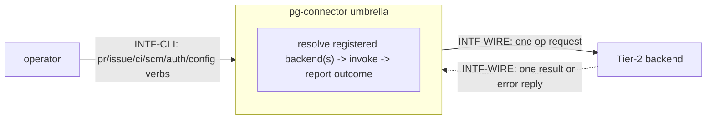
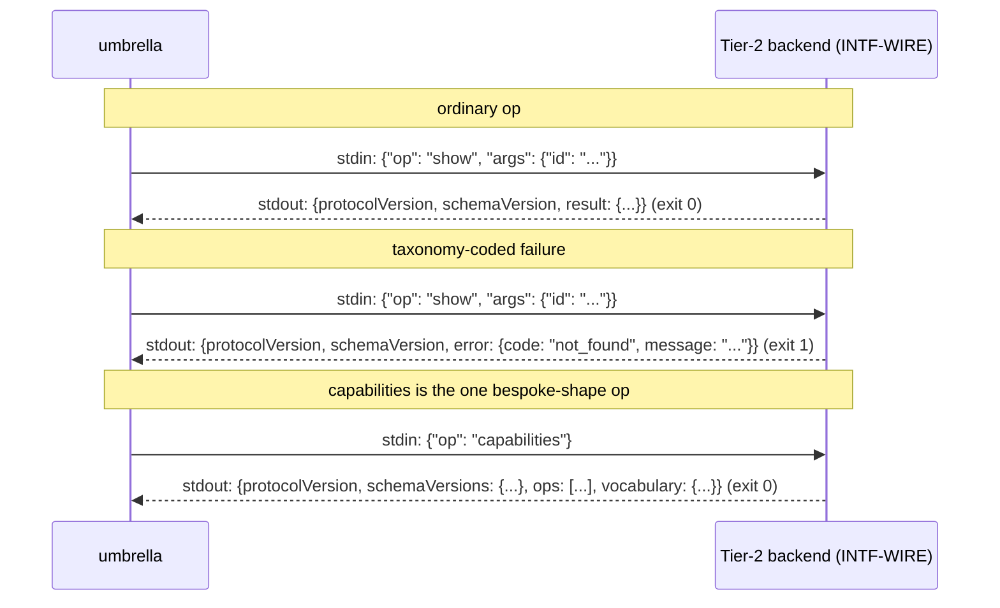

# Interfaces — pg-connector

This file follows the interface convention of the behavior-docs method
(`phillipgreenii-nix-agent-support · behavior-docs/docs/behavior`, `INV-8`): an **interface** is a
boundary described by **what crosses it** and **what must hold**, never _how_ it is implemented.
See the [glossary](glossary.md) for terms, [actors](actors.md) for who sits on each side,
[invariants](invariants.md) for the rules, and [journeys](journeys.md) for the flows that exercise
these interfaces.

pg-connector has exactly two interfaces, both **essential** and both on the same axis the method
asks every interface to declare (kind of counterparty, and essential-vs-optional participation):

| Interface   | Boundary                                         | Counterparty (kind)                       | Participation | Initiator |
| ----------- | ------------------------------------------------ | ----------------------------------------- | ------------- | --------- |
| `INTF-CLI`  | operator commands in; a result or outcome out    | `ACTOR-OP` operator (**actor**)           | driving port  | operator  |
| `INTF-WIRE` | one op request out; one result-or-error reply in | `ACTOR-BACKEND` backend (**implementer**) | essential     | umbrella  |

`INTF-CLI` is listed first because it is the one a reader reaches for first, but `INTF-WIRE` is
where the shared contract actually lives: `INTF-CLI` is a thin, capability-scoped dispatcher over
it, never a second protocol.



## `INTF-WIRE` — the umbrella↔backend wire protocol <!-- uuid: 17ee2995-d5b6-4a06-8324-9f95ba0e5322 -->

- **Counterparty:** `ACTOR-BACKEND`, a pluggable Tier-2 backend. **Initiator:** the umbrella,
  always (a backend never initiates a call of its own). **Multiplicity:** zero or more per
  capability (exactly one for `scm`'s single-valued registry entry).
- **Purpose:** invoke exactly one named **op** against exactly one backend process, and read back
  exactly one **result** or one taxonomy-coded **error**.

### The common wire contract

Every op, on every capability, shares this shape (`INV-WIRE-1`):

- **One request, one response, one process.** The umbrella execs the backend binary, writes
  `{"op": "<name>", "args": {...}}` to its stdin, closes stdin, and reads exactly one JSON object
  from its stdout.
- **Two independent version numbers.** Every response carries `protocolVersion` (one global
  integer for the envelope shape itself) and `schemaVersion` (one integer for whichever
  schema-bearing capability the invoked op belongs to) — see `INV-VER-1`.
- **Exactly one of `result` or `error`.** A well-formed success response is
  `{protocolVersion, schemaVersion, result}`; a well-formed failure is
  `{protocolVersion, schemaVersion, error: {code, message}}`. A response with **neither** field
  present is a **protocol violation**, never a success — a deliberate no-payload success MUST
  send `"result": null` explicitly rather than omitting `result` (`INV-WIRE-1`).
- **The `capabilities` op is the one exception to this envelope**, both in what it returns on
  success and in what MUST be checked before decoding it (`INV-WIRE-2`).
- **A wire-level failure's `error.code` MUST be drawn from a closed six-value taxonomy** —
  `INV-ERR-1` below.
- **Exit codes at this wire layer stay a plain `0`/`1`** (`0` the op ran and produced a
  well-formed envelope with `result` set; `1` anything else, including a malformed request, a
  crash, or a well-formed `error` envelope). Classification of _what_ went wrong lives entirely in
  the JSON `error.code`, never in a wider exit-code scheme at this layer — that richer
  classification is `INTF-CLI`'s own, a separate layer (`INV-EXIT-1`).



### Per-capability op catalog

An op belongs to exactly one capability's schema-versioned dispatch table, plus two ops common to
every backend regardless of capability. This catalog is what `INV-CAP-1` (capability scoping)
obliges to exist and to name no backend/system; `INTF-WIRE` is the interface that carries it
(method `INV-8`: an enumerated catalog belongs to the interface that carries it).

| Capability | Op                | Shape                                                             | Kind                                                                                                              |
| ---------- | ----------------- | ----------------------------------------------------------------- | ----------------------------------------------------------------------------------------------------------------- |
| `pr`       | `show`            | `{id}` → the PR's full state incl. comments/reviews               | targeted                                                                                                          |
| `pr`       | `categorize`      | `{id, category}` → `{id, category}`                               | targeted                                                                                                          |
| `pr`       | `feedback_set`    | `{id, comment_id, disposition}` → `{id, comment_id, disposition}` | targeted                                                                                                          |
| `issue`    | `show`            | `{id}` → the issue's current state                                | targeted                                                                                                          |
| `issue`    | `create`          | `{title, priority?, labels?, issue_type?}` → the created issue    | targeted                                                                                                          |
| `issue`    | `comment`         | `{id, body}` → no result payload (`result: null`)                 | targeted                                                                                                          |
| `issue`    | `transition`      | `{id, target_state}` → no result payload (`result: null`)         | targeted                                                                                                          |
| `ci`       | `list_runs`       | `{pr_id}` → every run this backend knows for that PR              | fanned out by the umbrella across every registered `ci` backend                                                   |
| `ci`       | `get_logs`        | `{run_id}` → raw log bytes                                        | targeted                                                                                                          |
| `ci`       | `rerun_failed`    | `{pr_id}` → no result payload (`result: null`)                    | targeted                                                                                                          |
| `scm`      | `worktree_add`    | `{branch_or_ref}` → the added worktree's path/branch/ref          | targeted                                                                                                          |
| `scm`      | `worktree_remove` | `{path}` → no result payload (`result: null`)                     | targeted                                                                                                          |
| `scm`      | `worktree_list`   | (no args) → every local worktree this backend manages             | targeted (a single-backend list, not a fan-out — `scm`'s registry entry is single-valued)                         |
| `scm`      | `branch_detect`   | `{cwd}` → `{repo, branch}`                                        | targeted                                                                                                          |
| _(any)_    | `capabilities`    | (no args) → the bespoke discovery shape                           | common; every backend MUST answer it                                                                              |
| _(any)_    | `auth_status`     | (no args) → `{state, detail?}`                                    | common but **optional** — present only if the backend's concrete provider implements `AuthChecker` (`INV-AUTH-1`) |

`issue`'s `transition` target state, and a `capabilities` response's `vocabulary`, are
per-backend-declared rather than one fixed cross-backend enum, because the issue trackers this
capability spans (Jira/beads/GitHub Issues, …) do not share one state vocabulary — unlike `pr`'s
`disposition`, drawn from a genuinely closed, shared four-value enum.

### `AuthChecker` — the optional auth-preflight facet

A backend's concrete provider MAY implement `AuthChecker` (one method, `CheckAuth`), asserted by a
type-check rather than required by the capability's own Provider interface. When it does, that
capability's dispatch table gains an `auth_status` entry answering `{state: "OK"}` or a degraded
state with `detail`. When it does not — `scm`'s own git backend is the landed example, since local
git plumbing has no remote credential concept at all — the `auth_status` op is simply absent from
that backend's dispatch table, which the umbrella's own fan-out already recognizes generically
(the wire-level `unknown_op` code) and reports as `disabled: "not applicable"`, never a forced or
meaningless answer (`INV-AUTH-1`).

### The composition boundary

A Tier-2 backend's own op handler MUST resolve any data it needs from a **different** capability
through its own direct, already-declared system access — never by executing the `pg-connector`
umbrella or a sibling Tier-2 backend binary. `INTF-WIRE` is one-directional in exactly this sense:
the umbrella dispatches to a backend, and a backend answers; a backend reaching back into the
umbrella that dispatches it (or sideways into a sibling backend) is not a second, symmetric use of
this same interface — it is a backend becoming its own caller's caller, which this interface does
not authorize (`INV-COMP-1`).

## `INTF-CLI` — operator commands <!-- uuid: 8bd248e1-b55a-4dc5-aeec-250fc25daf0d -->

- **Counterparty:** `ACTOR-OP`, the operator — an **actor**, not an implementer, which is what
  makes this the one **driving port**: nobody on the far side implements a contract this set
  verifies by conformance suite, and every obligation below is the umbrella's own.
  **Initiator:** operator.
- **What the operator can do.** Invoke a **targeted** op against the one backend registered for a
  capability (`pr show`, `pr categorize`, `pr feedback-set`, `issue show/create/comment/
transition`, `ci logs`, `ci rerun-failed`, `scm worktree add/remove/list`, `scm branch
detect`); invoke a **fan-out** op across every backend registered for a capability (`ci list`,
  `auth status`) or across every backend registered for **any** capability (`config validate`);
  and choose the CLI's own presentation mode (`--output json|human`, a persistent flag inherited
  by every verb group).
- **Registry resolution.** Every verb resolves its target backend(s) from the
  `connector.<type>` registry (`INV-REG-1`) before dispatching; a targeted op against a
  capability with zero or more than one registered backend is a CLI-level failure before any
  wire call is made (`INV-REG-2`), never a silent pick-one.
- **Outcome reporting.** A targeted call's outcome is the umbrella's own **targeted** exit-code
  scheme (`0`/`4`/`1`); a fan-out call's outcome is the **fan-out** scheme (`0`/`2`/`3`) plus a
  `sources[]` row per backend queried — `INV-EXIT-1` and `INV-OUT-1` state both in full. These are
  pg-connector's **own** CLI exit codes, a layer distinct from — and never built from —
  `INTF-WIRE`'s plain `0`/`1`.
- **Output mode.** `--output` defaults to `json` — the same stable, machine-readable envelope
  pg-connector has always printed, so an existing JSON-consuming script keeps working unchanged
  with no flag added. `--output human` renders the already-decoded typed result as readable text
  instead. The flag is validated **before any backend is dispatched**, so an invalid value is
  caught with zero side effects rather than after a write op has already run (`INV-OUT-2`).

```mermaid
sequenceDiagram
    actor Op as operator
    participant Umb as umbrella (INTF-CLI)
    participant Reg as registry
    participant BE as backend(s)
    Op->>Umb: pg-connector <capability> <verb> [--output json|human]
    Umb->>Umb: validate --output (pre-dispatch, INV-OUT-2)
    Umb->>Reg: resolve connector.<type>
    alt targeted op
        Reg-->>Umb: exactly one backend, or a CLI-level error (INV-REG-2)
        Umb->>BE: INTF-WIRE: one op request
        BE-->>Umb: one result or error
        Umb-->>Op: rendered result; exit 0 / 4 / 1 (INV-EXIT-1)
    else fan-out op
        Reg-->>Umb: every registered backend of the type
        loop each backend
            Umb->>BE: INTF-WIRE: one op request
            BE-->>Umb: one result or error
        end
        Umb-->>Op: rendered sources[] + merged result; exit 0 / 2 / 3 (INV-EXIT-1, INV-OUT-1)
    end
```

## Notes / forward references

- **Inter-consistency (method `INV-18`) binds here in its _implementer_ form.** `ACTOR-BACKEND` is
  a pluggable implementation with no behavior-docs set of its own; agreement with `INTF-WIRE` is
  reconciled by each backend's own unit tests against the shared `pkg/schema`/`pkg/provider`
  contracts it imports, not by a verbatim peer cross-check. No dedicated conformance suite exists
  yet for `INTF-WIRE` itself — tracked in the [README](README.md)'s realization-gap register.
- **Open questions** (tracked in [journeys](journeys.md)): `OQ-EXIT-1` (whether `INTF-WIRE`'s
  plain `0`/`1` wire-level exit codes should widen to satisfy this workspace's own exit-code
  convention that a branchable meaning uses a distinct code ≥ 2, or stay as designed because
  classification already lives in the JSON body).
