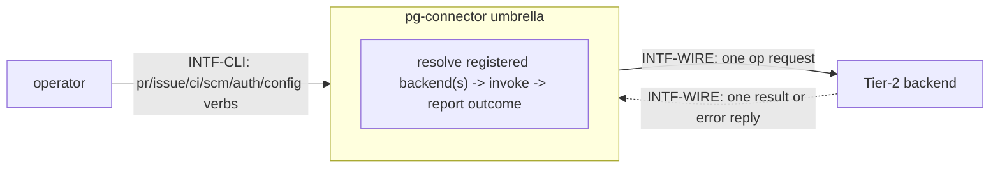
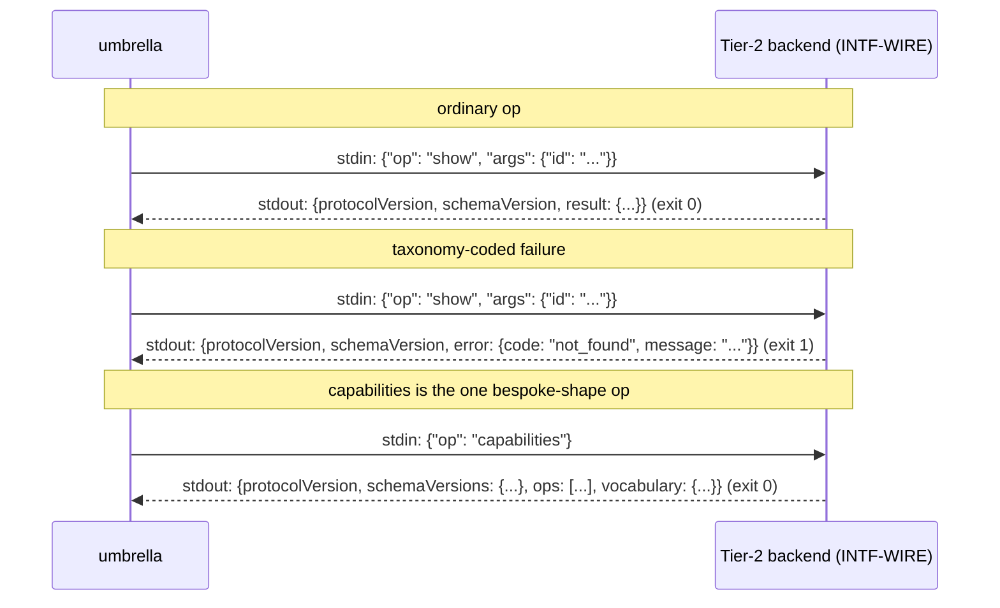

# Interfaces — pg-connector

This file follows the interface convention of the behavior-docs method
(`phillipgreenii-nix-agent-support · behavior-docs/docs/behavior`, `INV-8`): an **interface** is a
boundary described by **what crosses it** and **what must hold**, never _how_ it is implemented.
See the [glossary](glossary.md) for terms, [actors](actors.md) for who sits on each side,
[invariants](invariants.md) for the rules, and [journeys](journeys.md) for the flows that exercise
these interfaces.

pg-connector has exactly two interfaces, both **essential** and both on the same axis the method
asks every interface to declare (kind of counterparty, and essential-vs-optional participation):

| Interface   | Boundary                                         | Counterparty (kind)                       | Participation | Initiator |
| ----------- | ------------------------------------------------ | ----------------------------------------- | ------------- | --------- |
| `INTF-CLI`  | operator commands in; a result or outcome out    | `ACTOR-OP` operator (**actor**)           | driving port  | operator  |
| `INTF-WIRE` | one op request out; one result-or-error reply in | `ACTOR-BACKEND` backend (**implementer**) | essential     | umbrella  |

`INTF-CLI` is listed first because it is the one a reader reaches for first, but `INTF-WIRE` is
where the shared contract actually lives: `INTF-CLI` is a thin, capability-scoped dispatcher over
it, never a second protocol.



## `INTF-WIRE` — the umbrella↔backend wire protocol <!-- uuid: 17ee2995-d5b6-4a06-8324-9f95ba0e5322 -->

- **Counterparty:** `ACTOR-BACKEND`, a pluggable Tier-2 backend. **Initiator:** the umbrella,
  always (a backend never initiates a call of its own). **Multiplicity:** zero or more per
  capability (exactly one for `scm`'s single-valued registry entry).
- **Purpose:** invoke exactly one named **op** against exactly one backend process, and read back
  exactly one **result** or one taxonomy-coded **error**.

### The common wire contract

Every op, on every capability, shares this shape (`INV-WIRE-1`):

- **One request, one response, one process.** The umbrella execs the backend binary, writes
  `{"op": "<name>", "args": {...}}` to its stdin, closes stdin, and reads exactly one JSON object
  from its stdout.
- **Two independent version numbers.** Every response carries `protocolVersion` (one global
  integer for the envelope shape itself) and `schemaVersion` (one integer for whichever
  schema-bearing capability the invoked op belongs to) — see `INV-VER-1`.
- **Exactly one of `result` or `error`.** A well-formed success response is
  `{protocolVersion, schemaVersion, result}`; a well-formed failure is
  `{protocolVersion, schemaVersion, error: {code, message}}`. A response with **neither** field
  present is a **protocol violation**, never a success — a deliberate no-payload success MUST
  send `"result": null` explicitly rather than omitting `result` (`INV-WIRE-1`).
- **The `capabilities` op is the one exception to this envelope**, both in what it returns on
  success and in what MUST be checked before decoding it (`INV-WIRE-2`).
- **A wire-level failure's `error.code` MUST be drawn from a closed seven-value taxonomy** —
  `INV-ERR-1` below.
- **Exit codes at this wire layer stay a plain `0`/`1`** (`0` the op ran and produced a
  well-formed envelope with `result` set; `1` anything else, including a malformed request, a
  crash, or a well-formed `error` envelope). Classification of _what_ went wrong lives entirely in
  the JSON `error.code`, never in a wider exit-code scheme at this layer — that richer
  classification is `INTF-CLI`'s own, a separate layer (`INV-EXIT-1`).



### Per-capability op catalog

An op belongs to exactly one capability's schema-versioned dispatch table, plus two ops common to
every backend regardless of capability. This catalog is what `INV-CAP-1` (capability scoping)
obliges to exist and to name no backend/system; `INTF-WIRE` is the interface that carries it
(method `INV-8`: an enumerated catalog belongs to the interface that carries it).

| Capability  | Op                | Shape                                                                                                                   | Kind                                                                                                              |
| ----------- | ----------------- | ----------------------------------------------------------------------------------------------------------------------- | ----------------------------------------------------------------------------------------------------------------- |
| `pr`        | `show`            | `{id}` → the PR's full state incl. comments/reviews                                                                     | targeted                                                                                                          |
| `pr`        | `list`            | `{query, cursor: null, ids_only}` → `{entities, present_ids, cursor: null, truncated}`                                  | fanned out by the umbrella across every registered `pr` backend unless `--backend` pins one                       |
| `pr`        | `files`           | `{id}` → `{id, files}` (each file's path/additions/deletions)                                                           | targeted                                                                                                          |
| `pr`        | `commits`         | `{id}` → `{id, commits}` (each commit's sha/author login/message)                                                       | targeted                                                                                                          |
| `issue`     | `show`            | `{id}` → the issue's current state                                                                                      | targeted                                                                                                          |
| `issue`     | `create`          | `{title, priority?, labels?, issue_type?, description?, metadata?, parent?}` → the created issue                        | targeted                                                                                                          |
| `issue`     | `comment`         | `{id, body}` → no result payload (`result: null`)                                                                       | targeted                                                                                                          |
| `issue`     | `transition`      | `{id, target_state}` → no result payload (`result: null`)                                                               | targeted                                                                                                          |
| `issue`     | `list`            | `{query, cursor: null, ids_only}` → `{entities, present_ids, cursor: null, truncated}`                                  | fanned out by the umbrella across every registered `issue` backend unless `--backend` pins one                    |
| `issue`     | `update`          | `{id, fields: {metadata?, add_labels?, remove_labels?, priority?, title?, description?}}` → the issue's resulting state | targeted                                                                                                          |
| `issue`     | `close`           | `{id, reason}` → no result payload (`result: null`)                                                                     | targeted                                                                                                          |
| `issue`     | `deps`            | `{id, full}` → `{ids, entities?}` — the recursive upward (blocked-by) dependency set                                    | targeted                                                                                                          |
| `ci`        | `list_runs`       | `{pr_id}` → every run this backend knows for that PR                                                                    | fanned out by the umbrella across every registered `ci` backend                                                   |
| `ci`        | `get_logs`        | `{run_id, repo}` → raw log bytes                                                                                        | targeted                                                                                                          |
| `ci`        | `rerun_failed`    | `{pr_id}` → no result payload (`result: null`)                                                                          | targeted                                                                                                          |
| `scm`       | `worktree_add`    | `{branch_or_ref}` → the added worktree's path/branch/ref                                                                | targeted                                                                                                          |
| `scm`       | `worktree_remove` | `{path}` → no result payload (`result: null`)                                                                           | targeted                                                                                                          |
| `scm`       | `worktree_list`   | (no args) → every local worktree this backend manages                                                                   | targeted (a single-backend list, not a fan-out — `scm`'s registry entry is single-valued)                         |
| `scm`       | `branch_detect`   | `{cwd}` → `{repo, branch}`                                                                                              | targeted                                                                                                          |
| `attention` | `list_attention`  | (no args) → `[]AttentionItem` (`{type, id, summary}` + optional `severity`)                                             | fan-out only — every backend registered under the top-level `attention.sources` key; no targeted form at all      |
| `search`    | `search`          | `{query, fields}` → `[]SearchResult` (`{type, id, title, url, source}` + optional `attributes`)                         | fan-out only — every backend registered under the top-level `search.sources` key; no targeted form at all         |
| _(any)_     | `capabilities`    | (no args) → the bespoke discovery shape                                                                                 | common; every backend MUST answer it                                                                              |
| _(any)_     | `auth_status`     | (no args) → `{state, detail?}`                                                                                          | common but **optional** — present only if the backend's concrete provider implements `AuthChecker` (`INV-AUTH-1`) |

`issue`'s `transition` target state, and a `capabilities` response's `vocabulary`, are
per-backend-declared rather than one fixed cross-backend enum, because the issue trackers this
capability spans (Jira/beads/GitHub Issues, …) do not share one state vocabulary. `pr` declares no
vocabulary of its own: its former `category`/`disposition` write fields and their dedicated
`categorize`/`feedback_set` ops were retired by bead `pg2-2j5ac.28.7` (statelessness, `D3`) —
category/disposition are re-derived by `pg-desk`'s interpreter rather than persisted by any
backend.

### `list` — named-query resolution and `query_not_recognized`

`list` (`pr` and `issue` only — `scm` has no remote entity to enumerate, and `ci` keeps its
existing PR-keyed `list_runs` fan-out unchanged) resolves `args.query` (a caller-facing NAME, e.g.
`"team"`) against the backend's own `config.queries` block (`INV-WIRE-3`, `INV-STATE-1`) —
resolved centrally by that capability's dispatch table, never by the backend's own `List`
implementation, so every `pr`/`issue` backend answers an unrecognized name identically. `ids_only`
toggles whether the reply's `entities` array is populated, but `present_ids` — the COMPLETE id set
the query currently matches — is always populated regardless. A `config.queries` value MAY be one
string or a list of strings; a backend runs each, unions the results deduplicated by id, and
reports `truncated` if any one member's own search reported truncated.

`cursor` in `args` is `null` whenever an operator invokes `list` directly (`pr list`/`issue list`)
— incremental fetching was a later concern when `list` itself landed. `changes` (below) is that
later concern, and the one caller that ever supplies a non-`null` cursor: the delta ledger's own
opaque, backend-returned cursor blob from the LAST `list` call for that `(type, backend, query)`,
so an incremental-capable backend can resume from it. A backend declaring no incremental support
MAY simply ignore `cursor` and answer with its full current match set every call — `changes`'s own
ledger (`ledger.go`'s hash-based diff) tolerates a full re-fetch correctly either way, since it
re-derives added/changed/removed from the returned `entities`/`present_ids` regardless of how much
of the match set the backend actually skipped via its own cursor.

A name the backend's own config does not define answers `query_not_recognized` (`INV-ERR-3`) —
never a usage error, a crash, or a silently empty result. The umbrella's own fan-out treats that
answer as "not applicable to this backend" (`disabled` in `sources[]`, excluded from
degraded-outcome accounting) unless EVERY registered backend of the type answers it, in which case
the umbrella fails the whole call as its own `invalid_argument` CLI-level failure (`INV-ERR-3`).
`changes` (below) reuses this exact classification unchanged.

### `changes` / `ledger show` / `ledger clear` / `cache show` / `cache clear` — the delta ledger's and entity cache's CLI surface

`changes` (`pr` and `issue` only, wired as a subcommand of each type's own verb group exactly like
`list` — see this repo's `changes.go` header comment for why `thread`, named alongside `pr`/`issue`
by the design of record's own section 4.2, has no CLI surface here: it has no schema type, no
registry entry, and no backend anywhere in this module yet, landing only in a later phase) is the
umbrella-facing surface over the on-disk delta ledger (`ledger.go`): one independent ledger per
`(type, backend, query)`, tracking a fetch cursor, an entity hash index, a version counter, and
per-consumer cursor positions.

- `pg-connector <type> changes --query <name> --consumer <id> [--cached] [--reset] [--backend <b>]`
  is a **fan-out** op, same exit-code scheme as `list` (`0`/`2`/`3`, `query_not_recognized`
  excluded from degraded accounting). Unless `--cached`, it refreshes each queried backend's own
  ledger via `list` (forwarding that ledger's stored cursor, per the note above), then reports
  every change the named consumer has not yet seen and advances that consumer's cursor — but only
  AFTER the response is fully written, so a crash between the write and the advance costs the next
  call one duplicate delivery, never a lost one. `--cached` skips the backend call entirely,
  answering only from what the ledger already has on disk. `--reset` replays every live entity to
  that consumer as freshly added, with no tombstone for anything already removed before the reset.
  The response shape is `{sources: [{backend, status, version, truncated}], changes: [{change,
source, entity}]}` — `change` is one of `added`/`changed`/`removed`. As of phase 14 (bead
  `pg2-2j5ac.42.2`, below), a `removed` row's `entity` carries that id's last cached content
  (the same `{id, ...}` shape a live read would have returned) instead of the bare `{id: ...}`
  envelope, whenever the umbrella's own entity cache still holds a live copy — the envelope, change
  kinds, and cursor semantics are otherwise UNCHANGED for every existing consumer.
- `pg-connector ledger show [--type] [--backend] [--query] [--consumer]` and
  `pg-connector ledger clear [--type] [--backend] [--query]` read or delete on-disk ledger file(s)
  directly, matched by a PARTIAL filter (an omitted flag matches any value in that field) — never
  dispatching to a backend, so neither has a `sources[]`/exit-code concept of its own; both always
  exit `0`. `show` prints each matching ledger's cursor, entity-index size, version, and
  consumer-position(s) (`--consumer` narrows which consumer's position is printed, without
  narrowing which ledgers match); `clear` deletes the matching ledger file(s) entirely.
- `pg-connector cache show [--type] [--backend]` and `pg-connector cache clear [--type] [--backend]`
  (phase 14, bead `pg2-2j5ac.42.4`) are the same PARTIAL-filter inspection/reset pair as
  `ledger show`/`ledger clear`, applied to the umbrella entity cache (`cache.go`) instead of the
  delta ledger: a `CacheKey` has no `Query` field (one cache file per `(type, backend)` only), so
  neither verb accepts `--query`. Neither ever dispatches to a backend either — both always exit
  `0`, and an empty filter match is an empty result list, never an error. `cache show` prints each
  matching key's live and tombstoned entry counts, reported separately; `cache clear` deletes the
  matching cache file(s) entirely and reports exactly which keys were cleared.
- `pg-connector ledger clear`'s deletion, as of the same phase-14 bead, ALSO drops every `CacheKey`
  whose `(Type, Backend)` matches the same `--type`/`--backend` filter (`--query` has no cache-side
  equivalent and is ignored for that half of the call) — an operator running `ledger clear --type pr`
  resets both the delta ledger AND the entity cache for every `pr` backend in one call. This is
  UNCONDITIONAL: it does not consult `cacheEnabled`'s opt-out checks first, since "drop the on-disk
  state matching this filter" is an operator-issued reset regardless of whether caching is
  currently opted in for that type/backend. `ledger clear`'s own response now reports both sets of
  cleared keys distinctly (`cleared` for ledger keys, `cleared_cache` for cache keys) rather than
  merging the narrower `CacheKey` shape into the three-field ledger-key rows.

### Stale fallback — serving `show`/`list`/`changes` from the umbrella entity cache

Phase 14 (bead `pg2-2j5ac.42.2`, docket `pg2-2j5ac.42`) wires the umbrella's own on-disk entity
cache (`cache.go`, bead `pg2-2j5ac.42.1`'s Go API — no CLI surface of its own) into `pr`/`issue`
`show`, `list`, and `changes` so that a backend answering `unavailable` is served from cache
instead of failing outright, per the design of record's section 5.6:

- **`show`** (`cache_dispatch.go`'s `dispatchShowWithCache`) mirrors `DispatchTargeted`'s own
  try-each policy over every registered backend (or the pinned one), but on that backend's own
  `unavailable` answer, MUST first check whether caching applies to `(type, backend)` and, on a
  live within-max-age cache hit, serve that content instead: the response's `as_of` becomes the
  CACHED as-of time and `stale` becomes `true`, and the call exits `0` — a stale-but-served read,
  never the targeted op's ordinary `unavailable` exit code for that read. A cache miss, an
  opted-out type/backend, or an expired entry falls through to today's unmodified behavior (the
  real error). A live success instead writes the returned entity into that backend's own cache, so
  it stays current for the next unavailable window.
- **`list`** (`fanOutPRList`/`fanOutIssueList`, `pr.go`/`issue.go`) applies the same per-backend
  fallback, but since list has no single id, falls back to EVERY live, within-max-age cached entry
  for that `(type, backend)`. That backend's own `sources[]` row is marked `degraded` — never
  `succeeded` — with a `reason` noting the fallback: the design's own "served from cache" language
  describes what content the caller receives, not a claim that the live call itself did not fail,
  so the overall exit code still follows the EXISTING, unmodified fan-out scheme (`0`/`2`/`3`)
  computed from every backend's status exactly as it already was — a solo backend that only ever
  falls back to cache therefore still reports exit `3` (no OTHER healthy source), even though its
  own row served real content. A live success writes every returned entity into that backend's own
  cache the same way `show` does.
- **`changes`** never falls back to the cache for its own `list` refresh call (a refresh failure
  keeps today's unmodified `sources[]`/exit-code handling) — only the RESPONSE's own removed-row
  content is affected, per the bullet above. `mergeChanges` (`changes.go`) is a READ-ONLY
  substitution: the one place a `removed` `changesEntry` is ever built now looks up that id in the
  same backend's cache first, using its content instead of the bare id-only envelope when a live
  copy is present; no cache write happens during response assembly. Only AFTER the response is
  written and flushed (the same post-flush position `changes`'s own consumer-cursor advance
  already uses) does `newChangesCmd` tombstone every id its own response reported as removed in
  that backend's cache and evict — so a later `show`/`list` cache-fallback stops offering a removed
  entity's stale content once its removal has actually been reported, while a still-lagging
  consumer's own later catch-up call can still receive that last content in the meantime.
- Never falls back to cache for any wire error OTHER than `unavailable` (`not_found`,
  `unauthenticated`, `unknown_op`, `version_mismatch`, `invalid_argument`, `query_not_recognized`
  all keep their existing, unmodified handling) — the backend, not the umbrella, stays the sole
  computer of its own staleness for every read this fallback path does NOT serve.
- **`ci list`** (`fanOutCIList`, `ci.go`, bead `pg2-2j5ac.42.3`) applies the same fallback to its
  own pre-existing, PR-keyed `list_runs` fan-out — the one cache entry in this whole docket whose
  content is a LIST rather than one entity: each backend's cache is keyed by `pr_id`, not by each
  run's own id (a per-run key would let some of one PR's runs be served stale while others are
  silently dropped, which the design's "a backend answering unavailable" checkpoint language does
  not describe), so one within-max-age cache hit for that `pr_id` restores that backend's ENTIRE
  last-known run list — every run's `stale` becomes `true` and `as_of` becomes the cached as-of
  time — under a `degraded` `sources[]` row (never `succeeded`, matching `list`'s own fallback rows
  above) with a reason noting the fallback. A cache miss, an opted-out type/backend, or an expired
  entry falls through to today's unmodified `unavailable`/no-runs behavior for that backend
  unchanged. A live success writes that backend's whole returned run list into its own cache keyed
  by `pr_id`, so it stays current for the next unavailable window — the umbrella caching its own
  copy of what a stateless backend already returned does not weaken D3 (statelessness): no backend
  gains a store, only the umbrella does. `schema.CIRun.Stale`'s own doc comment now states this
  restoration is landed, replacing the "deferred to phase 14's entity cache" language it carried
  since bead `pg2-2j5ac.28.7` deleted `pg-connector-ci-github-actions`'s own backend-local run-list
  cache under D3.

### `attention`/`search` — the two cross-cutting, fan-out-only capabilities

Unlike `pr`/`issue`/`ci`/`scm`, `attention` and `search` are not tied to one entity type and
register under their own top-level keys — `attention.sources`/`search.sources` — siblings of,
never nested under, `connector.<type>` (`INV-REG-3`). Both are **fan-out-only**: there is no
targeted form, no id argument, and neither `list_attention` nor `search` accepts a `--backend` pin
flag or has a `backends.<binary>` config block attached (unlike every `pr`/`issue`/`ci`/`scm`
verb, which all gained both via bead pg2-2j5ac.28.1) — `pg-connector attention list` and
`pg-connector search <query>` always query every registered source. Neither participates in
`auth status`'s or `config validate`'s own fan-out either, since both resolve their backend set
from `connector.<type>` via `AllBackends` — a backend registered ONLY under
`attention.sources`/`search.sources` is invisible to those two commands; its health is reported
solely through its own verb's `sources[]` rows (`INV-REG-3`).

A backend implementer builds one of these the same way as any other capability — implement the
small `attention.Provider`/`search.Provider` Go interface and answer the matching op — but may do
so either as a capability's own Tier-2 backend (e.g. an issue backend that ALSO implements
`ListAttention` alongside its normal `issue` ops) or as a dedicated **standalone plugin**
implementing nothing else. The design names the latter shape explicitly and states it MUST
compose `pg-connector`'s own verbs rather than talk to an external system directly — a
combination this set flags rather than resolves: no concrete standalone `attention`/`search`
plugin has landed yet to exercise it against the mechanical composition-boundary guard
(`INV-COMP-1`), whose regex-based check today would flag ANY `pg-connector`-named binary
executing `pg-connector`, standalone plugin or not (tracked in the [README](README.md)'s
realization-gap register).

- **`list_attention`** — aggregated by `attention list` via dedup-and-rank, never plain
  concatenation like `ci list`'s own fan-out (`INV-ATTN-1`); an optional `--cap N` truncates the
  already-merged list.
- **`search`** — aggregated by `search` via per-source grouping, never merged across sources
  (`INV-SEARCH-1`); an optional `--fields` list requests specific result attributes, and an
  unrecognized one produces a `warnings[]` entry, never an error.

### `AuthChecker` — the optional auth-preflight facet

A backend's concrete provider MAY implement `AuthChecker` (one method, `CheckAuth`), asserted by a
type-check rather than required by the capability's own Provider interface. When it does, that
capability's dispatch table gains an `auth_status` entry answering `{state: "OK"}` or a degraded
state with `detail`. When it does not — `scm`'s own git backend is the landed example, since local
git plumbing has no remote credential concept at all — the `auth_status` op is simply absent from
that backend's dispatch table, which the umbrella's own fan-out already recognizes generically
(the wire-level `unknown_op` code) and reports as `disabled: "not applicable"`, never a forced or
meaningless answer (`INV-AUTH-1`).

### The composition boundary

A Tier-2 backend's own op handler MUST resolve any data it needs from a **different** capability
through its own direct, already-declared system access — never by executing the `pg-connector`
umbrella or a sibling Tier-2 backend binary. `INTF-WIRE` is one-directional in exactly this sense:
the umbrella dispatches to a backend, and a backend answers; a backend reaching back into the
umbrella that dispatches it (or sideways into a sibling backend) is not a second, symmetric use of
this same interface — it is a backend becoming its own caller's caller, which this interface does
not authorize (`INV-COMP-1`).

## `INTF-CLI` — operator commands <!-- uuid: 8bd248e1-b55a-4dc5-aeec-250fc25daf0d -->

- **Counterparty:** `ACTOR-OP`, the operator — an **actor**, not an implementer, which is what
  makes this the one **driving port**: nobody on the far side implements a contract this set
  verifies by conformance suite, and every obligation below is the umbrella's own.
  **Initiator:** operator.
- **What the operator can do.** Invoke a **targeted** op against the one backend registered for a
  capability (`pr show`, `pr files`, `pr commits`, `issue show/create/comment/
transition/update/close/deps`, `ci logs`, `ci rerun-failed`, `scm worktree add/remove/list`, `scm branch
detect`); invoke a **fan-out** op across every backend registered for a capability (`pr list`,
  `pr changes`, `issue list`, `issue changes`, `ci list`, `auth status`), across every backend
  registered under the top-level `attention.sources`/`search.sources` keys (`attention list`,
  `search <query>`), or across every backend registered for **any** entity-type capability
  (`config validate`); inspect or reset the on-disk delta ledger or the umbrella entity cache
  directly, with no backend dispatch at all (`ledger show`, `ledger clear`, `cache show`,
  `cache clear` — see "`changes`/`ledger show`/`ledger clear`/`cache show`/`cache clear`" below);
  and choose the CLI's own presentation mode (`--output json|human`, a persistent flag inherited by
  every verb group).
- **Registry resolution.** Every `pr`/`issue`/`ci`/`scm` verb resolves its target backend(s) from
  the `connector.<type>` registry (`INV-REG-1`) before dispatching — `attention list`/`search`
  instead resolve from the separate `attention.sources`/`search.sources` keys (`INV-REG-3`) and
  always fan out, with no targeted form at all. A targeted op against a capability with zero
  registered backends is a CLI-level failure before any wire call is made. With more than one
  registered backend, resolution follows `INV-REG-2`'s split rule: an **id-keyed** targeted op
  (`show`, `files`, …) tries each in registration order, stopping at the first
  non-`not_found` answer; an **id-less write** (`issue create` today) instead hard-fails at
  N > 1 — either way, unless the operator supplies `--backend`.
- **`--backend <binary>`.** Every `pr`/`issue`/`ci`/`scm` Tier-1 verb accepts this flag — a
  leaf flag (unlike `--output`, it is registered per-verb, not inherited from root, since its
  exact effect differs by verb shape). It resolves directly to the named backend, validated
  against that capability's own registration (a CLI-level error if the name isn't registered
  there); on an id-keyed targeted op this skips the multi-instance try-each policy, on `list` it
  pins the fan-out to that one backend instead of querying every registered backend of the type,
  and on an id-less write with no meaningful fan-out (`issue create`) it is how an operator
  resolves an otherwise-ambiguous multi-backend registration explicitly (`INV-REG-2`).
- **Outcome reporting.** A targeted call's outcome is the umbrella's own **targeted** exit-code
  scheme (`0`/`4`/`1`); a fan-out call's outcome is the **fan-out** scheme (`0`/`2`/`3`) plus a
  `sources[]` row per backend queried — `INV-EXIT-1` and `INV-OUT-1` state both in full. These are
  pg-connector's **own** CLI exit codes, a layer distinct from — and never built from —
  `INTF-WIRE`'s plain `0`/`1`.
- **Output mode.** `--output` defaults to `json` — the same stable, machine-readable envelope
  pg-connector has always printed, so an existing JSON-consuming script keeps working unchanged
  with no flag added. `--output human` renders the already-decoded typed result as readable text
  instead. The flag is validated **before any backend is dispatched**, so an invalid value is
  caught with zero side effects rather than after a write op has already run (`INV-OUT-2`).

```mermaid
sequenceDiagram
    actor Op as operator
    participant Umb as umbrella (INTF-CLI)
    participant Reg as registry
    participant BE as backend(s)
    Op->>Umb: pg-connector <capability> <verb> [--output json|human] [--backend <binary>]
    Umb->>Umb: validate --output (pre-dispatch, INV-OUT-2)
    Umb->>Reg: resolve connector.<type>
    alt targeted op
        Reg-->>Umb: zero backends is a CLI-level error; >1 resolves via --backend or try-each (INV-REG-2)
        Umb->>BE: INTF-WIRE: one op request
        BE-->>Umb: one result or error
        Umb-->>Op: rendered result; exit 0 / 4 / 1 (INV-EXIT-1)
    else fan-out op
        Reg-->>Umb: every registered backend of the type, or exactly one if --backend pins it
        loop each backend
            Umb->>BE: INTF-WIRE: one op request
            BE-->>Umb: one result or error
        end
        Umb-->>Op: rendered sources[] + merged result; exit 0 / 2 / 3 (INV-EXIT-1, INV-OUT-1)
    end
```

## Notes / forward references

- **Telemetry (D24, bead pg2-2j5ac.28.3).** `issue update`/`close`/`deps` and the schema/backend
  changes underneath them introduce or emit nothing new over OpenTelemetry or Prometheus:
  pg-connector as a whole has no telemetry emitter of its own today (verified: no
  OpenTelemetry/Prometheus dependency or exporter exists anywhere in this module), so these ops
  carry no metrics/traces beyond what a caller derives from the wire envelope's own exit
  code/`error.code`. Logging is unchanged from every existing op in this catalog: none of
  `INTF-WIRE`'s backends write structured logs of their own; a failure surfaces only via the
  wire-level `error` envelope (`INV-ERR-1`) and, for the two issue backends, whatever `bd`/`pjira`
  themselves wrote to stderr, already folded into the classified error message. Feeds the
  observability review `pg2-7kizi`.
- **Telemetry (D24, bead pg2-2j5ac.30.1).** The delta ledger engine (`cmd/pg-connector/ledger.go`
  — the per-`(type, backend, query)` persisted fetch cursor/entity hash index/version
  counter/consumer cursors, its refresh algorithm, and its three eviction rules) emits nothing
  yet over OpenTelemetry or Prometheus and writes no structured logs of its own: this packet has
  no CLI surface (it produces only a Go API a later packet wires into cobra commands), so there
  is no operator-facing entry point yet for a metric/trace/log to attach to. A failed
  `Ledger.Refresh` call surfaces only as a returned Go `error`, propagated by whatever CLI verb
  eventually calls it — no telemetry of its own beyond that. Revisit once the sibling
  `changes`/`ledger show`/`ledger clear` CLI verbs packet lands an actual operator-facing surface.
- **Telemetry (D24, bead pg2-2j5ac.30.2).** `changes`, `ledger show`, and `ledger clear` — the
  operator-facing surface the note directly above was written to revisit — land with no
  OpenTelemetry or Prometheus emission and no structured logging of their own: pg-connector still
  has no telemetry emitter anywhere in this module (unchanged from bead pg2-2j5ac.28.3's own
  telemetry note above). A `changes` refresh failure surfaces only via its `sources[]` row's
  `status`/no-reason-on-the-wire-shape (this packet's own Contract deliberately adapts the design's
  illustrative `{backend, status, version, truncated}` shape, which carries no `reason` field,
  unlike `list`'s `sources[]`); `ledger show`/`ledger clear` surface a failure only as a plain CLI
  error. Nothing here writes to stderr beyond the ordinary wire-level error propagation every other
  verb in this catalog already has. Feeds the observability review `pg2-7kizi`.
- **Telemetry (D24, bead pg2-2j5ac.42.1).** The umbrella entity cache engine (`cmd/pg-connector/cache.go`
  — the per-`(type, backend)` on-disk store of full entity copies, its max-age/LRU/tombstone
  eviction rules, and the per-type/per-backend opt-out checks) emits nothing yet over
  OpenTelemetry or Prometheus and writes no structured logs of its own: like the ledger engine
  before it (bead `pg2-2j5ac.30.1`'s telemetry note, above), this packet has no CLI surface of
  its own — it produces only a Go API a later packet wires into `show`/`list`/`changes` and a
  `cache` verb group — so there is no operator-facing entry point yet for a metric/trace/log to
  attach to. A `cacheEnabled` capabilities-call failure fails open silently (by design — see the
  function's own doc comment) rather than surfacing anywhere; every other failure surfaces only
  as a returned Go `error`, propagated by whatever CLI verb eventually calls it. Revisit once the
  sibling verbs/integration packets of this same phase land an actual operator-facing surface.
  Feeds the observability review `pg2-7kizi`.
- **Telemetry (D24, bead pg2-2j5ac.42.2).** The `show`/`list`/`changes` stale-fallback wiring
  above (`cache_dispatch.go`, plus `pr.go`/`issue.go`/`changes.go`'s own edits) emits nothing over
  OpenTelemetry or Prometheus and writes no structured logs of its own: pg-connector still has no
  telemetry emitter anywhere in this module (unchanged from every telemetry note above). This
  packet's only OBSERVABLE surface is the wire response's own `stale`/`as_of` fields on a
  cache-served `show`, and the fan-out `sources[]` row's `reason` string noting a cache-served
  `list` fallback — both already covered by this same section's own wire-envelope description
  above; neither is a metric/trace a caller can aggregate without parsing the response body
  itself. A `cacheEnabled` capabilities-call failure fails open silently, exactly as bead
  `pg2-2j5ac.42.1`'s own telemetry note above already describes; every other cache-write/read
  failure on this path is swallowed as best-effort (never turning a successful live read into a
  reported failure) and so surfaces nowhere at all, by this packet's own Binding decision. Feeds
  the observability review `pg2-7kizi`.
- **Telemetry (D24, bead pg2-2j5ac.42.3).** The `ci list` stale-fallback wiring above (`ci.go`'s
  `ciCacheFallback`/`putCIListCache`) emits nothing over OpenTelemetry or Prometheus and writes no
  structured logs of its own — pg-connector still has no telemetry emitter anywhere in this module
  (unchanged from every telemetry note above). This packet's only observable surface is the wire
  response's own per-run `stale`/`as_of` fields and the fan-out `sources[]` row's `reason` string
  noting a cache-served `ci list` fallback, both already covered by this same section's own
  wire-envelope description above; neither is a metric/trace a caller can aggregate without
  parsing the response body itself. A `cacheEnabled` capabilities-call failure fails open
  silently, exactly as bead `pg2-2j5ac.42.1`'s own telemetry note above already describes; every
  other cache-write/read failure on this path is swallowed as best-effort (never turning a
  successful live read into a reported failure) and so surfaces nowhere at all, matching bead
  `pg2-2j5ac.42.2`'s own identical binding decision for `show`/`list`/`changes`. Feeds the
  observability review `pg2-7kizi`.
- **Telemetry (D24, bead pg2-2j5ac.42.4).** The `cache show`/`cache clear` verb group
  (`cache_cmd.go`) and `ledger clear`'s extended cache-dropping behavior (`ledger_cmd.go`) emit
  nothing over OpenTelemetry or Prometheus and write no structured logs of their own —
  pg-connector still has no telemetry emitter anywhere in this module (unchanged from every
  telemetry note above). Like `ledger show`/`ledger clear` before them (bead `pg2-2j5ac.30.2`'s
  own telemetry note above), neither verb ever dispatches to a backend, so a `cache show`/
  `cache clear`/`ledger clear` failure surfaces only as a plain CLI error — there is no
  `sources[]` row or fan-out exit code for it to attach to. Nothing here writes to stderr beyond
  the ordinary error propagation every other verb in this catalog already has. Feeds the
  observability review `pg2-7kizi`.
- **Inter-consistency (method `INV-18`) binds here in its _implementer_ form.** `ACTOR-BACKEND` is
  a pluggable implementation with no behavior-docs set of its own; agreement with `INTF-WIRE` is
  reconciled by each backend's own unit tests against the shared `pkg/schema`/`pkg/provider`
  contracts it imports, not by a verbatim peer cross-check. No dedicated conformance suite exists
  yet for `INTF-WIRE` itself — tracked in the [README](README.md)'s realization-gap register.
- **Open questions** (tracked in [journeys](journeys.md)): `OQ-EXIT-1` (whether `INTF-WIRE`'s
  plain `0`/`1` wire-level exit codes should widen to satisfy this workspace's own exit-code
  convention that a branchable meaning uses a distinct code ≥ 2, or stay as designed because
  classification already lives in the JSON body).
