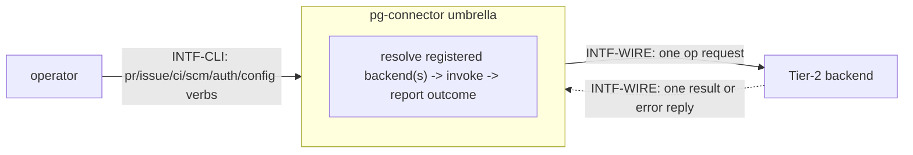
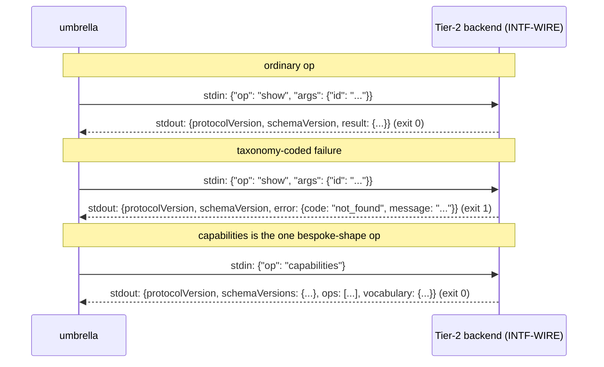

# Interfaces — pg-connector

This file follows the interface convention of the behavior-docs method
(`phillipgreenii-nix-agent-support · behavior-docs/docs/behavior`, `INV-8`): an **interface** is a
boundary described by **what crosses it** and **what must hold**, never _how_ it is implemented.
See the [glossary](glossary.md) for terms, [actors](actors.md) for who sits on each side,
[invariants](invariants.md) for the rules, and [journeys](journeys.md) for the flows that exercise
these interfaces.

pg-connector has exactly two interfaces, both **essential** and both on the same axis the method
asks every interface to declare (kind of counterparty, and essential-vs-optional participation):

| Interface   | Boundary                                         | Counterparty (kind)                       | Participation | Initiator |
| ----------- | ------------------------------------------------ | ----------------------------------------- | ------------- | --------- |
| `INTF-CLI`  | operator commands in; a result or outcome out    | `ACTOR-OP` operator (**actor**)           | driving port  | operator  |
| `INTF-WIRE` | one op request out; one result-or-error reply in | `ACTOR-BACKEND` backend (**implementer**) | essential     | umbrella  |

`INTF-CLI` is listed first because it is the one a reader reaches for first, but `INTF-WIRE` is
where the shared contract actually lives: `INTF-CLI` is a thin, capability-scoped dispatcher over
it, never a second protocol.


```mermaid
flowchart LR
    OP["operator"] -- "INTF-CLI: pr/issue/ci/scm/auth/config verbs" --> UMB
    subgraph UMB["pg-connector umbrella"]
      C["resolve registered backend(s) -> invoke -> report outcome"]
    end
    UMB -- "INTF-WIRE: one op request" --> BE["Tier-2 backend"]
    BE -. "INTF-WIRE: one result or error reply" .-> UMB
```

## `INTF-WIRE` — the umbrella↔backend wire protocol <!-- uuid: 17ee2995-d5b6-4a06-8324-9f95ba0e5322 -->

- **Counterparty:** `ACTOR-BACKEND`, a pluggable Tier-2 backend. **Initiator:** the umbrella,
  always (a backend never initiates a call of its own). **Multiplicity:** zero or more per
  capability (exactly one for `scm`'s single-valued registry entry).
- **Purpose:** invoke exactly one named **op** against exactly one backend process, and read back
  exactly one **result** or one taxonomy-coded **error**.

### The common wire contract

Every op, on every capability, shares this shape (`INV-WIRE-1`):

- **One request, one response, one process.** The umbrella execs the backend binary, writes
  `{"op": "<name>", "args": {...}}` to its stdin, closes stdin, and reads exactly one JSON object
  from its stdout.
- **Two independent version numbers.** Every response carries `protocolVersion` (one global
  integer for the envelope shape itself) and `schemaVersion` (one integer for whichever
  schema-bearing capability the invoked op belongs to) — see `INV-VER-1`.
- **Exactly one of `result` or `error`.** A well-formed success response is
  `{protocolVersion, schemaVersion, result}`; a well-formed failure is
  `{protocolVersion, schemaVersion, error: {code, message}}`. A response with **neither** field
  present is a **protocol violation**, never a success — a deliberate no-payload success MUST
  send `"result": null` explicitly rather than omitting `result` (`INV-WIRE-1`).
- **The `capabilities` op is the one exception to this envelope**, both in what it returns on
  success and in what MUST be checked before decoding it (`INV-WIRE-2`).
- **A wire-level failure's `error.code` MUST be drawn from a closed seven-value taxonomy** —
  `INV-ERR-1` below.
- **Exit codes at this wire layer stay a plain `0`/`1`** (`0` the op ran and produced a
  well-formed envelope with `result` set; `1` anything else, including a malformed request, a
  crash, or a well-formed `error` envelope). Classification of _what_ went wrong lives entirely in
  the JSON `error.code`, never in a wider exit-code scheme at this layer — that richer
  classification is `INTF-CLI`'s own, a separate layer (`INV-EXIT-1`).


```mermaid
sequenceDiagram
    participant UMB as umbrella
    participant BE as Tier-2 backend (INTF-WIRE)
    Note over UMB,BE: ordinary op
    UMB->>BE: stdin: {"op": "show", "args": {"id": "..."}}
    BE-->>UMB: stdout: {protocolVersion, schemaVersion, result: {...}}  (exit 0)
    Note over UMB,BE: taxonomy-coded failure
    UMB->>BE: stdin: {"op": "show", "args": {"id": "..."}}
    BE-->>UMB: stdout: {protocolVersion, schemaVersion, error: {code: "not_found", message: "..."}}  (exit 1)
    Note over UMB,BE: capabilities is the one bespoke-shape op
    UMB->>BE: stdin: {"op": "capabilities"}
    BE-->>UMB: stdout: {protocolVersion, schemaVersions: {...}, ops: [...], vocabulary: {...}}  (exit 0)
```

### Per-capability op catalog

An op belongs to exactly one capability's schema-versioned dispatch table, plus two ops common to
every backend regardless of capability. This catalog is what `INV-CAP-1` (capability scoping)
obliges to exist and to name no backend/system; `INTF-WIRE` is the interface that carries it
(method `INV-8`: an enumerated catalog belongs to the interface that carries it).

| Capability  | Op                 | Shape                                                                                                                                                                                                                                                                                                                                                                                                                                                                                                                                                                                                                                                                                                                                                                                                                                                                                                                                                                                                                                                                                                                                                                                                                                                                                                                                                                                                                                                                                                                                                                                                                                                                                                                                                                                                                                                                                                                                                                                                                                                                                                                                                                                                                                                                                                           | Kind                                                                                                                                      |
| ----------- | ------------------ | --------------------------------------------------------------------------------------------------------------------------------------------------------------------------------------------------------------------------------------------------------------------------------------------------------------------------------------------------------------------------------------------------------------------------------------------------------------------------------------------------------------------------------------------------------------------------------------------------------------------------------------------------------------------------------------------------------------------------------------------------------------------------------------------------------------------------------------------------------------------------------------------------------------------------------------------------------------------------------------------------------------------------------------------------------------------------------------------------------------------------------------------------------------------------------------------------------------------------------------------------------------------------------------------------------------------------------------------------------------------------------------------------------------------------------------------------------------------------------------------------------------------------------------------------------------------------------------------------------------------------------------------------------------------------------------------------------------------------------------------------------------------------------------------------------------------------------------------------------------------------------------------------------------------------------------------------------------------------------------------------------------------------------------------------------------------------------------------------------------------------------------------------------------------------------------------------------------------------------------------------------------------------------------------------------------- | ----------------------------------------------------------------------------------------------------------------------------------------- |
| `pr`        | `show`             | `{id}` → the PR's full state incl. comments/reviews; each review carries `submitted_at` (RFC3339; empty for a pending review), and consumers order reviews by it rather than by array position (reviews are emitted newest-first); every review-thread comment carries `review_thread_id` (the real review-thread id a reply needs, distinct from the existing `ThreadID`, which holds the root comment's node id), every review carries `commit_oid` (the commit it was submitted against; an empty string when the host no longer reports the commit, for example after a force push, and absent only when the backend did not report it, which a consumer reads as unknown rather than stale), and each of the reviews, threads and comments connections is paginated up to a cap (1000 threads, 1000 comments) and reports `truncated`, `total` and `returned` rather than truncating silently; the three reports sit at the top level of the response as `connections.reviews`, `connections.threads` and `connections.comments`, each `{truncated, total, returned}`                                                                                                                                                                                                                                                                                                                                                                                                                                                                                                                                                                                                                                                                                                                                                                                                                                                                                                                                                                                                                                                                                                                                                                                                                                      | targeted                                                                                                                                  |
| `pr`        | `list`             | `{query, cursor: null, ids_only}` → `{entities, present_ids, cursor: null, truncated, fingerprint_excludes?}` (`fingerprint_excludes`: dotted entity-field paths the backend declares volatile for the umbrella's `--fingerprints` hash; see "`list --fingerprints`" below)                                                                                                                                                                                                                                                                                                                                                                                                                                                                                                                                                                                                                                                                                                                                                                                                                                                                                                                                                                                                                                                                                                                                                                                                                                                                                                                                                                                                                                                                                                                                                                                                                                                                                                                                                                                                                                                                                                                                                                                                                                     | fanned out by the umbrella across every registered `pr` backend unless `--backend` pins one                                               |
| `pr`        | `files`            | `{id}` → `{id, files}` (each file's path/additions/deletions)                                                                                                                                                                                                                                                                                                                                                                                                                                                                                                                                                                                                                                                                                                                                                                                                                                                                                                                                                                                                                                                                                                                                                                                                                                                                                                                                                                                                                                                                                                                                                                                                                                                                                                                                                                                                                                                                                                                                                                                                                                                                                                                                                                                                                                                   | targeted                                                                                                                                  |
| `pr`        | `commits`          | `{id}` → `{id, commits}` (each commit's sha/author login/message)                                                                                                                                                                                                                                                                                                                                                                                                                                                                                                                                                                                                                                                                                                                                                                                                                                                                                                                                                                                                                                                                                                                                                                                                                                                                                                                                                                                                                                                                                                                                                                                                                                                                                                                                                                                                                                                                                                                                                                                                                                                                                                                                                                                                                                               | targeted                                                                                                                                  |
| `pr`        | `review_submit`    | `{id, head_sha, body, comments, supersede_pending?}` → `{review_id, state, head_sha, head_moved, live_head_sha, as_of, status, added, already_present, dismissed, body, extra_pending_reviews, last_append?}` — puts content into the acting identity's PENDING review (optional; only a backend implementing it registers the op): it creates the review when there is none and otherwise appends to the existing one, never deleting, replacing or submitting. `head_sha` is the full 40-character sha of the commit the content was reviewed at: the PR's current head, or an earlier commit of the PR, in which case the content is saved AT that commit and `head_moved` is true (`INV-REVHEAD-1`, `INV-REVHEAD-2`, `INV-REVHEAD-3`; the section "`review_submit` — saving at an earlier head" below). A `comments` item is a new point `{path, line, side?, body}` or a reply `{thread_id, body}` where `thread_id` is the real review-thread id (never both forms in one item; no `thread_id` is always a new point). `status` is exactly one of `posted` (a review was created), `append` (a comment or a new per-head body section was written to an existing review) or `no_change` (nothing was written: every comment already present or dismissed and no body section needed; no review is created for it); `supersede_pending` is accepted and ignored; the CLI verb reads the request JSON from stdin, or from `--from-file <absolute path>` (mutually exclusive; the tool opens the file, so a don't-ask session whose grant matches only a plain single-line command can use it); the result also carries `url` when a review was used or created; every status exits 0. A request carries at most 40 comments, or at most 20 when `head_sha` is an earlier commit (more is `invalid_argument`, nothing written; the caps are sized so a full request finishes inside the 30s exec timeout, so split larger reviews across sequential requests, which converge by replay). A run in which some comments did not land is an error (`unavailable` when a retry could succeed, `invalid_argument` when every failure is permanent) whose message lists the failed fingerprints; replaying the identical request converges for transient failures, while a rejected anchor needs a changed request | targeted                                                                                                                                  |
| `pr`        | `review_pending`   | `{id}` → `{pending, head_sha, as_of, review?}` — the acting identity's PENDING review as a structured record (review id, review-level commit, URL, body, `comments_total`, `comments_at_head` (comments whose original commit is the live head), `reviewed_head` (the body holds a section for the head, or any review of the viewer has the head as its review-level commit), `stale` (true only when `comments_at_head` is 0 and `reviewed_head` is false; the connector, not the dashboard, owns this verdict, so a review saved at an earlier head by `review_submit` is stale for the live head, `INV-REVHEAD-3`), `extra_pending_reviews` and `last_append`), or `pending: false` for none; read-only and fail-closed: a failed lookup is a taxonomy error, never `pending: false`, but more than one pending review is NOT an error (the lowest-numbered is reported and the rest are counted); comments are paginated (optional, like `review_submit`)                                                                                                                                                                                                                                                                                                                                                                                                                                                                                                                                                                                                                                                                                                                                                                                                                                                                                                                                                                                                                                                                                                                                                                                                                                                                                                                                                  | targeted                                                                                                                                  |
| `issue`     | `show`             | `{id}` → the issue's current state                                                                                                                                                                                                                                                                                                                                                                                                                                                                                                                                                                                                                                                                                                                                                                                                                                                                                                                                                                                                                                                                                                                                                                                                                                                                                                                                                                                                                                                                                                                                                                                                                                                                                                                                                                                                                                                                                                                                                                                                                                                                                                                                                                                                                                                                              | targeted                                                                                                                                  |
| `issue`     | `create`           | `{title, priority?, labels?, issue_type?, description?, metadata?, parent?}` → the created issue                                                                                                                                                                                                                                                                                                                                                                                                                                                                                                                                                                                                                                                                                                                                                                                                                                                                                                                                                                                                                                                                                                                                                                                                                                                                                                                                                                                                                                                                                                                                                                                                                                                                                                                                                                                                                                                                                                                                                                                                                                                                                                                                                                                                                | targeted                                                                                                                                  |
| `issue`     | `comment`          | `{id, body}` → no result payload (`result: null`)                                                                                                                                                                                                                                                                                                                                                                                                                                                                                                                                                                                                                                                                                                                                                                                                                                                                                                                                                                                                                                                                                                                                                                                                                                                                                                                                                                                                                                                                                                                                                                                                                                                                                                                                                                                                                                                                                                                                                                                                                                                                                                                                                                                                                                                               | targeted                                                                                                                                  |
| `issue`     | `transition`       | `{id, target_state}` → no result payload (`result: null`)                                                                                                                                                                                                                                                                                                                                                                                                                                                                                                                                                                                                                                                                                                                                                                                                                                                                                                                                                                                                                                                                                                                                                                                                                                                                                                                                                                                                                                                                                                                                                                                                                                                                                                                                                                                                                                                                                                                                                                                                                                                                                                                                                                                                                                                       | targeted                                                                                                                                  |
| `issue`     | `list`             | `{query, cursor: null, ids_only}` → `{entities, present_ids, cursor: null, truncated, fingerprint_excludes?}` (`fingerprint_excludes`: dotted entity-field paths the backend declares volatile for the umbrella's `--fingerprints` hash; see "`list --fingerprints`" below)                                                                                                                                                                                                                                                                                                                                                                                                                                                                                                                                                                                                                                                                                                                                                                                                                                                                                                                                                                                                                                                                                                                                                                                                                                                                                                                                                                                                                                                                                                                                                                                                                                                                                                                                                                                                                                                                                                                                                                                                                                     | fanned out by the umbrella across every registered `issue` backend unless `--backend` pins one                                            |
| `issue`     | `update`           | `{id, fields: {metadata?, add_labels?, remove_labels?, priority?, title?, description?, status?, clear_assignee?, clear_defer?}}` → the issue's resulting state                                                                                                                                                                                                                                                                                                                                                                                                                                                                                                                                                                                                                                                                                                                                                                                                                                                                                                                                                                                                                                                                                                                                                                                                                                                                                                                                                                                                                                                                                                                                                                                                                                                                                                                                                                                                                                                                                                                                                                                                                                                                                                                                                 | targeted                                                                                                                                  |
| `issue`     | `close`            | `{id, reason}` → no result payload (`result: null`)                                                                                                                                                                                                                                                                                                                                                                                                                                                                                                                                                                                                                                                                                                                                                                                                                                                                                                                                                                                                                                                                                                                                                                                                                                                                                                                                                                                                                                                                                                                                                                                                                                                                                                                                                                                                                                                                                                                                                                                                                                                                                                                                                                                                                                                             | targeted                                                                                                                                  |
| `issue`     | `deps`             | `{id, full}` → `{ids, entities?}` — the recursive upward (blocked-by) dependency set                                                                                                                                                                                                                                                                                                                                                                                                                                                                                                                                                                                                                                                                                                                                                                                                                                                                                                                                                                                                                                                                                                                                                                                                                                                                                                                                                                                                                                                                                                                                                                                                                                                                                                                                                                                                                                                                                                                                                                                                                                                                                                                                                                                                                            | targeted                                                                                                                                  |
| `ci`        | `list_runs`        | `{pr_id}` → every run this backend knows for that PR; a non-successful current-head run also carries its per-job results (`jobs`, below)                                                                                                                                                                                                                                                                                                                                                                                                                                                                                                                                                                                                                                                                                                                                                                                                                                                                                                                                                                                                                                                                                                                                                                                                                                                                                                                                                                                                                                                                                                                                                                                                                                                                                                                                                                                                                                                                                                                                                                                                                                                                                                                                                                        | fanned out by the umbrella across every registered `ci` backend                                                                           |
| `ci`        | `get_logs`         | `{run_id, repo}` → raw log bytes                                                                                                                                                                                                                                                                                                                                                                                                                                                                                                                                                                                                                                                                                                                                                                                                                                                                                                                                                                                                                                                                                                                                                                                                                                                                                                                                                                                                                                                                                                                                                                                                                                                                                                                                                                                                                                                                                                                                                                                                                                                                                                                                                                                                                                                                                | targeted                                                                                                                                  |
| `ci`        | `rerun_failed`     | `{pr_id}` → no result payload (`result: null`)                                                                                                                                                                                                                                                                                                                                                                                                                                                                                                                                                                                                                                                                                                                                                                                                                                                                                                                                                                                                                                                                                                                                                                                                                                                                                                                                                                                                                                                                                                                                                                                                                                                                                                                                                                                                                                                                                                                                                                                                                                                                                                                                                                                                                                                                  | targeted                                                                                                                                  |
| `scm`       | `worktree_add`     | `{branch_or_ref}` → the added worktree's path/branch/ref                                                                                                                                                                                                                                                                                                                                                                                                                                                                                                                                                                                                                                                                                                                                                                                                                                                                                                                                                                                                                                                                                                                                                                                                                                                                                                                                                                                                                                                                                                                                                                                                                                                                                                                                                                                                                                                                                                                                                                                                                                                                                                                                                                                                                                                        | targeted                                                                                                                                  |
| `scm`       | `worktree_remove`  | `{path}` → no result payload (`result: null`)                                                                                                                                                                                                                                                                                                                                                                                                                                                                                                                                                                                                                                                                                                                                                                                                                                                                                                                                                                                                                                                                                                                                                                                                                                                                                                                                                                                                                                                                                                                                                                                                                                                                                                                                                                                                                                                                                                                                                                                                                                                                                                                                                                                                                                                                   | targeted                                                                                                                                  |
| `scm`       | `worktree_list`    | (no args) → every local worktree this backend manages                                                                                                                                                                                                                                                                                                                                                                                                                                                                                                                                                                                                                                                                                                                                                                                                                                                                                                                                                                                                                                                                                                                                                                                                                                                                                                                                                                                                                                                                                                                                                                                                                                                                                                                                                                                                                                                                                                                                                                                                                                                                                                                                                                                                                                                           | targeted (a single-backend list, not a fan-out — `scm`'s registry entry is single-valued)                                                 |
| `scm`       | `branch_detect`    | `{cwd}` → `{repo, branch}`                                                                                                                                                                                                                                                                                                                                                                                                                                                                                                                                                                                                                                                                                                                                                                                                                                                                                                                                                                                                                                                                                                                                                                                                                                                                                                                                                                                                                                                                                                                                                                                                                                                                                                                                                                                                                                                                                                                                                                                                                                                                                                                                                                                                                                                                                      | targeted                                                                                                                                  |
| `calendar`  | `list`             | `{query, ids_only}` → `{entities, present_ids, cursor: null, truncated}`                                                                                                                                                                                                                                                                                                                                                                                                                                                                                                                                                                                                                                                                                                                                                                                                                                                                                                                                                                                                                                                                                                                                                                                                                                                                                                                                                                                                                                                                                                                                                                                                                                                                                                                                                                                                                                                                                                                                                                                                                                                                                                                                                                                                                                        | fanned out by the umbrella across every registered `calendar` backend unless `--backend` pins one                                         |
| `calendar`  | `list_events`      | `{start, end, calendar}` → `{entities, present_ids, cursor: null, truncated}`                                                                                                                                                                                                                                                                                                                                                                                                                                                                                                                                                                                                                                                                                                                                                                                                                                                                                                                                                                                                                                                                                                                                                                                                                                                                                                                                                                                                                                                                                                                                                                                                                                                                                                                                                                                                                                                                                                                                                                                                                                                                                                                                                                                                                                   | fanned out by the umbrella across every registered `calendar` backend unless `--backend` pins one                                         |
| `alert`     | `list`             | `{query?, ids_only}` → `{entities, present_ids, cursor: null, truncated}`; `query` optional, omitted means the whole firing set                                                                                                                                                                                                                                                                                                                                                                                                                                                                                                                                                                                                                                                                                                                                                                                                                                                                                                                                                                                                                                                                                                                                                                                                                                                                                                                                                                                                                                                                                                                                                                                                                                                                                                                                                                                                                                                                                                                                                                                                                                                                                                                                                                                 | fanned out by the umbrella across every registered `alert` backend unless `--backend` pins one                                            |
| `alert`     | `show`             | `{id}` → the currently-firing alert (`not_found` when it is not firing)                                                                                                                                                                                                                                                                                                                                                                                                                                                                                                                                                                                                                                                                                                                                                                                                                                                                                                                                                                                                                                                                                                                                                                                                                                                                                                                                                                                                                                                                                                                                                                                                                                                                                                                                                                                                                                                                                                                                                                                                                                                                                                                                                                                                                                         | targeted                                                                                                                                  |
| `alert`     | `list_history`     | `{since, until, query?}` → `{episodes, truncated}`                                                                                                                                                                                                                                                                                                                                                                                                                                                                                                                                                                                                                                                                                                                                                                                                                                                                                                                                                                                                                                                                                                                                                                                                                                                                                                                                                                                                                                                                                                                                                                                                                                                                                                                                                                                                                                                                                                                                                                                                                                                                                                                                                                                                                                                              | fanned out by the umbrella across every registered `alert` backend unless `--backend` pins one                                            |
| `mail`      | `list`             | `{mailbox?, unread_only?, limit?, ids_only?}` → `{entities, present_ids, cursor: null, truncated}`; `truncated` is backend-determined                                                                                                                                                                                                                                                                                                                                                                                                                                                                                                                                                                                                                                                                                                                                                                                                                                                                                                                                                                                                                                                                                                                                                                                                                                                                                                                                                                                                                                                                                                                                                                                                                                                                                                                                                                                                                                                                                                                                                                                                                                                                                                                                                                           | fanned out by the umbrella across every registered `mail` backend unless `--backend` pins one                                             |
| `mail`      | `show`             | `{id}` → the message's current state (`MailMessage`, incl. attachment metadata)                                                                                                                                                                                                                                                                                                                                                                                                                                                                                                                                                                                                                                                                                                                                                                                                                                                                                                                                                                                                                                                                                                                                                                                                                                                                                                                                                                                                                                                                                                                                                                                                                                                                                                                                                                                                                                                                                                                                                                                                                                                                                                                                                                                                                                 | targeted                                                                                                                                  |
| `mail`      | `search_messages`  | `{query, mailbox?, limit?}` → `{entities, present_ids, cursor: null, truncated}`; named to avoid colliding with the cross-cutting `search` op                                                                                                                                                                                                                                                                                                                                                                                                                                                                                                                                                                                                                                                                                                                                                                                                                                                                                                                                                                                                                                                                                                                                                                                                                                                                                                                                                                                                                                                                                                                                                                                                                                                                                                                                                                                                                                                                                                                                                                                                                                                                                                                                                                   | fanned out by the umbrella across every registered `mail` backend unless `--backend` pins one                                             |
| `mail`      | `mark_read`        | `{id}` → no result payload (`result: null`)                                                                                                                                                                                                                                                                                                                                                                                                                                                                                                                                                                                                                                                                                                                                                                                                                                                                                                                                                                                                                                                                                                                                                                                                                                                                                                                                                                                                                                                                                                                                                                                                                                                                                                                                                                                                                                                                                                                                                                                                                                                                                                                                                                                                                                                                     | targeted                                                                                                                                  |
| `mail`      | `mark_unread`      | `{id}` → no result payload (`result: null`)                                                                                                                                                                                                                                                                                                                                                                                                                                                                                                                                                                                                                                                                                                                                                                                                                                                                                                                                                                                                                                                                                                                                                                                                                                                                                                                                                                                                                                                                                                                                                                                                                                                                                                                                                                                                                                                                                                                                                                                                                                                                                                                                                                                                                                                                     | targeted                                                                                                                                  |
| `mail`      | `archive`          | `{id}` → no result payload (`result: null`)                                                                                                                                                                                                                                                                                                                                                                                                                                                                                                                                                                                                                                                                                                                                                                                                                                                                                                                                                                                                                                                                                                                                                                                                                                                                                                                                                                                                                                                                                                                                                                                                                                                                                                                                                                                                                                                                                                                                                                                                                                                                                                                                                                                                                                                                     | targeted                                                                                                                                  |
| `mail`      | `unarchive`        | `{id}` → no result payload (`result: null`)                                                                                                                                                                                                                                                                                                                                                                                                                                                                                                                                                                                                                                                                                                                                                                                                                                                                                                                                                                                                                                                                                                                                                                                                                                                                                                                                                                                                                                                                                                                                                                                                                                                                                                                                                                                                                                                                                                                                                                                                                                                                                                                                                                                                                                                                     | targeted                                                                                                                                  |
| `mail`      | `fetch_attachment` | `{id, attachment_id}` → `{message_id, attachment_id, path}`; `path` is a local filesystem path, opaque to the caller                                                                                                                                                                                                                                                                                                                                                                                                                                                                                                                                                                                                                                                                                                                                                                                                                                                                                                                                                                                                                                                                                                                                                                                                                                                                                                                                                                                                                                                                                                                                                                                                                                                                                                                                                                                                                                                                                                                                                                                                                                                                                                                                                                                            | targeted                                                                                                                                  |
| `attention` | `list_attention`   | (no args) → `[]AttentionItem` (`{type, id, summary}` + optional `severity`, `url`, `group`)                                                                                                                                                                                                                                                                                                                                                                                                                                                                                                                                                                                                                                                                                                                                                                                                                                                                                                                                                                                                                                                                                                                                                                                                                                                                                                                                                                                                                                                                                                                                                                                                                                                                                                                                                                                                                                                                                                                                                                                                                                                                                                                                                                                                                     | fan-out only — every backend registered under the top-level `attention.sources` key; no targeted form at all                              |
| `search`    | `search`           | `{query, fields}` → `[]SearchResult` (`{type, id, title, url, source}` + optional `attributes`)                                                                                                                                                                                                                                                                                                                                                                                                                                                                                                                                                                                                                                                                                                                                                                                                                                                                                                                                                                                                                                                                                                                                                                                                                                                                                                                                                                                                                                                                                                                                                                                                                                                                                                                                                                                                                                                                                                                                                                                                                                                                                                                                                                                                                 | fan-out only — every backend registered under the top-level `search.sources` key; no targeted form at all                                 |
| `activity`  | `list_activity`    | `{since?, before}` (RFC3339; `since` optional and inclusive, `before` required and exclusive) → `{items: []ActivityItem, truncated}` (`{id, kind, entity_type, entity_id, occurred_at, summary, as_of, stale}` + optional `approximate`, `url`, `labels`, plus an opaque `fields` map); schema version 1                                                                                                                                                                                                                                                                                                                                                                                                                                                                                                                                                                                                                                                                                                                                                                                                                                                                                                                                                                                                                                                                                                                                                                                                                                                                                                                                                                                                                                                                                                                                                                                                                                                                                                                                                                                                                                                                                                                                                                                                        | fan-out only — every backend registered under the top-level `activity.sources` key; no targeted form at all (`--backend` pins one source) |
| _(any)_     | `capabilities`     | (no args) → the bespoke discovery shape                                                                                                                                                                                                                                                                                                                                                                                                                                                                                                                                                                                                                                                                                                                                                                                                                                                                                                                                                                                                                                                                                                                                                                                                                                                                                                                                                                                                                                                                                                                                                                                                                                                                                                                                                                                                                                                                                                                                                                                                                                                                                                                                                                                                                                                                         | common; every backend MUST answer it                                                                                                      |
| _(any)_     | `auth_status`      | (no args) → `{state, detail?}`                                                                                                                                                                                                                                                                                                                                                                                                                                                                                                                                                                                                                                                                                                                                                                                                                                                                                                                                                                                                                                                                                                                                                                                                                                                                                                                                                                                                                                                                                                                                                                                                                                                                                                                                                                                                                                                                                                                                                                                                                                                                                                                                                                                                                                                                                  | common but **optional** — present only if the backend's concrete provider implements `AuthChecker` (`INV-AUTH-1`)                         |

`issue`'s `transition` target state, and a `capabilities` response's `vocabulary`, are
per-backend-declared rather than one fixed cross-backend enum, because the issue trackers this
capability spans (Jira/beads/GitHub Issues, …) do not share one state vocabulary. `pr` declares no
vocabulary of its own: its former `category`/`disposition` write fields and their dedicated
`categorize`/`feedback_set` ops were retired by bead `pg2-2j5ac.28.7` (statelessness, `D3`) —
category/disposition are re-derived by `pg-desk`'s interpreter rather than persisted by any
backend.

**`ci` per-job results** (`schema.CIRun.Jobs`, `CISchemaVersion` 4 → 5, bead `pg2-gllcn`) — `list_runs`
entries gain an additive, optional `jobs` array of `{id?, name, status, conclusion, url?}`
(`schema.CIJob`), attributed to the run that holds them, so a consumer can tell WHICH job of a failed
run failed (e.g. a PR whose only failing job is `build-test-validate`). Absent `jobs` means "not
fetched", never "no jobs"; every pre-existing run-level field is unchanged. The GitHub Actions
backend bounds the extra per-run `gh run view --json jobs` call: it fetches jobs only for
`completed` runs with a `failure`/`timed_out`/`startup_failure`/`cancelled` conclusion on the PR's
current head SHA (the most recent run's), at most 10 per `list_runs` call, so a PR whose runs all
succeeded triggers no job fetches. A failed job fetch leaves that run's `jobs` omitted rather than
failing the listing.

**`issue` status category** (`schema.Issue.StatusCategory`, `IssueSchemaVersion` 7 → 8, bead
`pg2-mj0jv`) — `show`, `list` and `create` answers gain an additive, optional `status_category`, the
tracker's own coarse grouping of the issue's `state`, with a closed value set: `new` (not started),
`indeterminate` (in progress) or `done` (finished). It lets a consumer tell started and finished work
apart without listing workflow-specific status names (an issue in a custom `Complete` status is still
category `done`). The Jira `issue` backend carries `pjira`'s `status_category` through unchanged; the
beads backend never sets it. An absent field means "this backend has no category for the issue" (Jira's
legacy "No Category", or a `pjira` that predates the field), never a category of its own, and a
consumer MUST then fall back to its own state-name rules. `state` itself is unchanged. Because the
field is ordinary entity content, adding it changes every Jira issue's `list --fingerprints` value
once, so the first listing after a Jira backend starts carrying it reports every Jira issue as
changed.

### `review_submit` — saving at an earlier head

A review is written against the commit its author read. When the PR has since moved on, the
operator's intent is to SAVE the finished review at the commit it was reviewed at (operator ruling,
2026-10-07: "i would like to save a finished review at the old head"; and, from the earlier design
ruling `pg2-8qui6`, comments made at head X stay on X while later ones go on Y). The rules are
`INV-REVHEAD-1` (which `head_sha` is accepted), `INV-REVHEAD-2` (how content is anchored and what
the review body says) and `INV-REVHEAD-3` (what the result, staleness, idempotence and the request
cap look like). In short:

- `head_sha` is the full 40-character sha. Equal to the live head, the op behaves exactly as it
  always did. Not equal, it is accepted only when it is one of the PR's own commits.
- For an earlier `head_sha`, each new-point comment's `line` is a line of the diff the PR showed AT
  `head_sha`: `RIGHT` counts new-file lines (context and added lines), `LEFT` counts old-file lines
  (context and removed lines). A comment whose line is not in that diff, or whose file has no diff
  to read (too large, binary, rename without content change), fails alone as `anchor_rejected` and
  is reported in the ordinary partial-failure message. Replies keep their thread.
- Where a comment is anchored is a property of the comment, not of the review it joins: appending
  to a review that was started at a different commit still anchors each comment at `head_sha`.
- The result's `head_sha` is the commit the content was saved at, `head_moved` says whether that
  differs from the PR's head, and `live_head_sha` is the head read during the run.

**What is not guaranteed.** The positions of an earlier-head save are computed against the
difference between the base branch's CURRENT tip and `head_sha`. When the base branch has advanced
since `head_sha` in a way that changes where the two histories diverge, those positions can differ
from the ones the host's own diff view used, and a comment can be refused or land a line away; the
backend does not detect a landed-but-shifted comment. A live check on 2026-10-08 found the two
in agreement for an advanced base, a renamed file and a second file; the cases it did not cover
are recorded, with the other earlier-head questions, under `OQ-REVHEAD-1` to `OQ-REVHEAD-3`.

### `list` — named-query resolution and `query_not_recognized`

`list` (`pr` and `issue` only — `scm` has no remote entity to enumerate, and `ci` keeps its
existing PR-keyed `list_runs` fan-out unchanged) resolves `args.query` (a caller-facing NAME, e.g.
`"team"`) against the backend's own `config.queries` block (`INV-WIRE-3`, `INV-STATE-1`) —
resolved centrally by that capability's dispatch table, never by the backend's own `List`
implementation, so every `pr`/`issue` backend answers an unrecognized name identically. `ids_only`
toggles whether the reply's `entities` array is populated, but `present_ids` — the COMPLETE id set
the query currently matches — is always populated regardless. A `config.queries` value MAY be one
string or a list of strings; a backend runs each, unions the results deduplicated by id, and
reports `truncated` if any one member's own search reported truncated.

`cursor` in `args` is `null` whenever an operator invokes `list` directly (`pr list`/`issue list`)
— incremental fetching was a later concern when `list` itself landed. `changes` (below) is that
later concern, and the one caller that ever supplies a non-`null` cursor: the delta ledger's own
opaque, backend-returned cursor blob from the LAST `list` call for that `(type, backend, query)`,
so an incremental-capable backend can resume from it. A backend declaring no incremental support
MAY simply ignore `cursor` and answer with its full current match set every call — `changes`'s own
ledger (`ledger.go`'s hash-based diff) tolerates a full re-fetch correctly either way, since it
re-derives added/changed/removed from the returned `entities`/`present_ids` regardless of how much
of the match set the backend actually skipped via its own cursor.

A name the backend's own config does not define answers `query_not_recognized` (`INV-ERR-3`) —
never a usage error, a crash, or a silently empty result. The umbrella's own fan-out treats that
answer as "not applicable to this backend" (`disabled` in `sources[]`, excluded from
degraded-outcome accounting) unless EVERY registered backend of the type answers it, in which case
the umbrella fails the whole call as its own `invalid_argument` CLI-level failure (`INV-ERR-3`).
`changes` (below) reuses this exact classification unchanged.

### `list --fingerprints` — a cursorless fingerprint map and a `truncated` flag

`pr list` and `issue list` accept `--fingerprints`. With it the umbrella's JSON outcome gains a
`fingerprints` object, `{"<entity id>": "<fingerprint string>"}`, with one entry for every entity in
`entities` (so an `--ids-only` call, which leaves `entities` empty, yields none). A caller compares
one listing's map against another's to learn which entities changed, appeared or vanished without
holding a cursor. Without the flag the key is absent and the outcome decodes exactly as before.

The fingerprint is produced by the connector, never the caller, and a caller MUST treat it as an
opaque string compared only for equality. It is the same canonical hash `changes` uses for its
ledger (`as_of` and `stale` dropped, a PR's transient `mergeable` states collapsed) with the
backend's declared volatile fields removed first: a backend names them in the optional
`fingerprint_excludes` field of its `list` result (dotted paths, one nesting level per dot). The
beads `issue` backend declares `metadata.last_checked_at`, so a periodic checker stamping that key
does not change an issue's fingerprint while a status or other content change still does. An
unchanged entity fingerprints identically across calls; a change to any field outside the exclusions
changes it. Slack `thread` listings carry no fingerprint.

The `pr` list summary is deliberately cheap: it carries identity, state, body, labels, head SHA,
the checks rollup, `mergeable`, `review_decision`, and the totals `comment_count`, `review_count`,
`review_thread_count` and `label_count` (the connector's `PRListFields` names the exact set). Every
one of those is part of the fingerprint, so a new review thread, or a label added past the first
twenty, shows as a change. `merge_state_status`, `review_requests` and CI detail are not on the
list; a caller wanting them calls `show`. The GitHub backend logs the points each `list` call
spent as a numeric `graphql_cost` on that call's event-log row; its `show`, `files` and `commits`
rows carry `graphql_cost` as well.

The outcome also carries a top-level boolean `truncated`, true when ANY queried backend's `list`
result reported `truncated` (the umbrella previously dropped that value), so a caller that deletes
what a listing no longer contains can withhold removals from a listing it cannot trust as complete.
A source that did not succeed stays visible in `sources[]`. The Jira `issue` backend's `list`
called with no cursor (which is what the umbrella's `list` verb always passes) runs the configured
JQL unbounded, with no `updated >=` lookback clause.

### Ranged `list` and `search` — per-call time bounds on the `config` channel

`pr list` and `issue list` accept optional `--since <bound>` / `--before <bound>`; `search` accepts
the same two flags. A bound is an RFC3339 timestamp, a Go duration (`168h`), or whole days (`7d`),
the latter two meaning "this long ago"; one umbrella parser (`parseTimeBound`) serves every
consumer, and a malformed bound, a negative duration, or `--since` not earlier than `--before` is an
`invalid_argument` raised before any backend runs. The umbrella parses the bound once and merges
RFC3339 instants onto the backend's static `backends.<name>` block for that call: `list_since` /
`list_before` for `list`, `search_since` / `search_before` for `search`. A key is present ONLY when
its flag was given, and a backend never sees a raw `7d`. `list`'s op args and the Go `Provider`
signatures do not change.

For `list` the bound applies to each entity's last-updated time and `present_ids` is the bounded
match set. A backend MUST widen any day-granular qualifier and filter precisely by the entity's own
timestamp, and MUST NOT apply a bound it cannot honor precisely without setting `truncated: true`.
The PR (GitHub `updated:` qualifier), Jira (JQL `updated`) and beads (`updated_at`) backends honor
it; a backend that does not read the keys (Slack threads, calendar) returns its unbounded result,
which `--help` states. A bounded `list` never serves the umbrella entity-cache fallback, since
cached entries are not window-filtered. For `search` only the agent-session backend reads the keys
(forwarding them to `pa-monitor search --since/--before`); the PR and Jira backends already take a
native qualifier inside the query text.

`changes` NEVER passes a range: the ledger derives removals from `present_ids`, so a bounded
`present_ids` would tombstone every entity merely older than the window. `changes --since` and
`changes --before` are rejected as `invalid_argument`.

### `calendar`'s `list`/`list_events` — a duration-based `list`, and a dedicated time-range primary op

`calendar` gets the same `list` op name as `pr`/`issue`, resolved the same centrally-dispatched
way against `config.queries` (above), but with a capability-specific query-VALUE convention: a
`calendar` backend's `config.queries` entry maps a caller-facing name to one or more plain Go
`time.ParseDuration`-parseable duration strings (`ns`/`us`/`ms`/`s`/`m`/`h` units only, no `d`/`w`
— mirroring `home/programs/pg-connector/default.nix`'s own `attention.perBackend.threshold`
option), read as "how far ahead of now to look" — never free text and never a JQL-style grammar.
A concrete `calendar` `List` implementation computes `start = now`, `end = start.Add(<parsed
duration>)`, and — when the resolved query carries more than one element — uses the LARGEST
parsed duration (the calendar analogue of `list`'s own "run each, union" convention, collapsed to
one time range rather than a per-element union of disjoint result sets, since this capability has
one underlying time-range fetch rather than one query per element). A malformed (non-duration)
element answers `invalid_argument`, never `query_not_recognized` (the name itself DID resolve; its
VALUE was malformed) and never a silently ignored/defaulted element.

`list_events` is `calendar`'s own, separately-named PRIMARY op — never reusing `list` — mirroring
`ci`'s existing `list_runs` "fan-out-shaped, parameter-keyed, NOT a named query" precedent. Its
wire-envelope args are `{start, end, calendar}`: `start`/`end` are RFC3339 timestamps (the range to
list, `[start, end)`); `calendar`, when empty, means every calendar this backend is configured
for, and when non-empty pins to exactly that one named calendar. Both `list` and `list_events`
return the SAME result shape (`CalendarListResult`) — only the request shape differs — and a
concrete implementation MAY share logic between them [freedom boundary].

### `mail`'s ops — explicit-parameter reads, id-keyed mutations, and a path-returning attachment fetch

`mail` is a NEW capability (`ADR 0062`, Decision item 10), not a backend on an existing one: its
registry key is the list-valued `connector.mail`. Its wire ops, with their args keys, are fixed
here so a Tier-2 backend and the CLI verb group need no guesswork; every op is stamped with
`schema.MailSchemaVersion`, and a message is identified by `id`, the real, globally-unique
Message-ID header value (`schema.MailMessage.ID`), opaque to the caller.

- **No delete, ever.** The op set above is exhaustive: there is no delete-shaped op and none MUST
  be added (`INV-MAIL-1`). `archive` moves a message out of its mailbox without destroying it, and
  `unarchive` reverses it. There is no create or reply op at this phase.
- **`list` is NOT a named-query op.** Unlike `pr`/`issue`/`calendar`, it takes explicit,
  parameter-keyed args (mirroring `ci`'s `list_runs`), so no `config.queries` resolution happens.
  `mailbox`, when empty or omitted, means every mailbox the backend is configured for; a non-empty
  value pins one. `unread_only` restricts to unread messages. `limit` omitted or `0` means the
  backend's own default cap; a negative `limit` answers `invalid_argument`. `truncated` in the
  result is BACKEND-DETERMINED: true when the reply was cut short by `limit` or a backend cap, or
  the backend cannot rule out more matches; false only when it can confirm the reply is complete.
  `cursor` is always null.
- **`search_messages` is the dedicated search op,** `{query, mailbox?, limit?}`, with the same
  result shape as `list`. `query` is a plain free-text string (what it matches is the backend's
  concern); an empty `query` answers `invalid_argument`. It is named `search_messages`, not
  `search`, because the same backend is also reachable through the cross-cutting `search`
  capability, whose own op is `search`, and one binary serving both MUST NOT have two handlers for
  one op name.
- **`show`, `mark_read`, `mark_unread`, `archive`, `unarchive`, `fetch_attachment` are id-keyed
  targeted ops** (`INV-REG-2`); an empty `id` answers `invalid_argument`, an unrecognized `id`
  answers `not_found`. The four mutations return no result payload (`result: null`), mirroring
  `issue`'s `comment`/`transition`; a caller wanting the new state issues `show`.
- **`fetch_attachment`** takes `{id, attachment_id}` (`attachment_id` is
  `schema.MailAttachment.ID`, scoped to its message). It saves the attachment locally and returns
  its full path in `path`. The destination DIRECTORY is part of the backend implementation's own
  config, never a request field (operator ruling, Phillip, 2026-10-05); the caller MUST treat `path`
  as opaque.
- **Message shape (`MailMessage`).** `id`, `subject`, `sender` (ONE `"Name <email>"` string,
  split per `INV-MAIL-2`), `date_received` (RFC3339), `read`, `flagged`, `mailbox`, optional
  `attachments` (each `id`, `filename`, optional best-effort `mime_type`, optional `size`),
  optional `body` (only from `show`, only when the backend can supply it), optional
  `mailbox_priority` (static tag; may be unset; never an attention input, `INV-MAIL-3`), and the
  standard `as_of`/`stale`.

### `alert`'s `list`/`show`/`list_history` — an optional-query list, firing-only, with no cache fallback

`alert`'s `list` differs from `pr`/`issue`'s in one respect: `query` is OPTIONAL. An omitted or
empty `query` means the backend's entire firing set, unfiltered; a non-empty name is resolved
against the request's `config.queries` exactly as for `pr`/`issue`, answering `query_not_recognized`
when undefined (and the umbrella fails the call as `invalid_argument` only when a NAME was given and
EVERY backend answered `query_not_recognized`). A backend ships no built-in query names. What a
query element means is backend-defined (for a Grafana-style backend, an Alertmanager matcher set
such as `{{severity=~"critical|warning"}}`; for a PagerDuty-style backend, a URL-query-form incident
filter with repeated-key arrays); it can only narrow the firing set (`INV-ALERT-1`).

`list_history` is a parameter-keyed op (a time window plus an optional query name), not a named
query: it returns firing episodes and is separate from `list` because its shape and cost model
differ. Attention never uses it. `alert` has no umbrella cache fallback and no `changes` verb
(`INV-ALERT-5`); the failure table is the ordinary one (`unavailable` is `degraded`, a missing
credential is `unauthenticated`, a backend lacking an op is `disabled: not applicable`).

### `changes` / `ledger show` / `ledger clear` / `cache show` / `cache clear` — the delta ledger's and entity cache's CLI surface

`changes` (`pr` and `issue` only, wired as a subcommand of each type's own verb group exactly like
`list` — see this repo's `changes.go` header comment for why `thread`, named alongside `pr`/`issue`
by the design of record's own section 4.2, has no CLI surface here: it has no schema type, no
registry entry, and no backend anywhere in this module yet, landing only in a later phase) is the
umbrella-facing surface over the on-disk delta ledger (`ledger.go`): one independent ledger per
`(type, backend, query)`, tracking a fetch cursor, an entity hash index, a version counter, and
per-consumer cursor positions.

- `pg-connector <type> changes --query <name> --consumer <id> [--cached] [--reset] [--backend <b>]`
  is a **fan-out** op, same exit-code scheme as `list` (`0`/`2`/`3`, `query_not_recognized`
  excluded from degraded accounting). Unless `--cached`, it refreshes each queried backend's own
  ledger via `list` (forwarding that ledger's stored cursor, per the note above), then reports
  every change the named consumer has not yet seen and advances that consumer's cursor — but only
  AFTER the response is fully written, so a crash between the write and the advance costs the next
  call one duplicate delivery, never a lost one. `--cached` skips the backend call entirely,
  answering only from what the ledger already has on disk. `--reset` replays every live entity to
  that consumer as freshly added, with no tombstone for anything already removed before the reset.
  The response shape is `{sources: [{backend, status, version, truncated, reason}], changes:
[{change, source, entity}]}` — `change` is one of `added`/`changed`/`removed`. `reason` (bead
  `pg2-unqcn`) is `omitempty`: present with the real degraded/failed cause (e.g. a backend's own
  rate-limit guard tripping) whenever that backend's row did not succeed, matching `list`'s own
  `sources[]` `reason` field — SUPERSEDES this packet's original Contract, which deliberately
  adapted the design's illustrative `{backend, status, version, truncated}` shape with no `reason`
  field; the swallowed-cause gap that left was itself the bug `pg2-unqcn` fixed. As of phase 14 (bead
  `pg2-2j5ac.42.2`, below), a `removed` row's `entity` carries that id's last cached content
  (the same `{id, ...}` shape a live read would have returned) instead of the bare `{id: ...}`
  envelope, whenever the umbrella's own entity cache still holds a live copy — the envelope, change
  kinds, and cursor semantics are otherwise UNCHANGED for every existing consumer.
  Each non-`--cached` `changes` call also records the call's outcome on that backend's ledger as
  a freshness stamp (`INV-LEDGER-FRESH-1`..`-3`): `refreshed_at` on a whole-query answer;
  `last_error` `{at, code}` on a failure or a truncated answer. A `--cached` call, which asks no
  origin, records neither (`INV-LEDGER-FRESH-2`). A failed call otherwise leaves its ledger exactly
  as it was, so the stamp is the only thing a failure can write.
- `pg-connector ledger show [--type] [--backend] [--query] [--consumer]` and
  `pg-connector ledger clear [--type] [--backend] [--query]` read or delete on-disk ledger file(s)
  directly, matched by a PARTIAL filter (an omitted flag matches any value in that field) — never
  dispatching to a backend, so neither has a `sources[]`/exit-code concept of its own; both always
  exit `0`. `show` prints each matching ledger's cursor, entity-index size, version,
  `refreshed_at`, `last_error`, and consumer-position(s) (`--consumer` narrows which consumer's
  position is printed, without narrowing which ledgers match); `refreshed_at` and `last_error` are
  JSON `null` when absent (`INV-LEDGER-FRESH-4`), shown as `never` / `none` in human output, and
  `last_error` is `{at, code}`. It is a local read with no network call, which is what lets a
  consumer such as `pg-desk` read data age on every heartbeat at zero origin cost. `clear` deletes
  the matching ledger file(s) entirely, stamps included.
- `pg-connector cache show [--type] [--backend]` and `pg-connector cache clear [--type] [--backend]`
  (phase 14, bead `pg2-2j5ac.42.4`) are the same PARTIAL-filter inspection/reset pair as
  `ledger show`/`ledger clear`, applied to the umbrella entity cache (`cache.go`) instead of the
  delta ledger: a `CacheKey` has no `Query` field (one cache file per `(type, backend)` only), so
  neither verb accepts `--query`. Neither ever dispatches to a backend either — both always exit
  `0`, and an empty filter match is an empty result list, never an error. `cache show` prints each
  matching key's live and tombstoned entry counts, reported separately; `cache clear` deletes the
  matching cache file(s) entirely and reports exactly which keys were cleared.
- `pg-connector ledger clear`'s deletion, as of the same phase-14 bead, ALSO drops every `CacheKey`
  whose `(Type, Backend)` matches the same `--type`/`--backend` filter (`--query` has no cache-side
  equivalent and is ignored for that half of the call) — an operator running `ledger clear --type pr`
  resets both the delta ledger AND the entity cache for every `pr` backend in one call. This is
  UNCONDITIONAL: it does not consult `cacheEnabled`'s opt-out checks first, since "drop the on-disk
  state matching this filter" is an operator-issued reset regardless of whether caching is
  currently opted in for that type/backend. `ledger clear`'s own response now reports both sets of
  cleared keys distinctly (`cleared` for ledger keys, `cleared_cache` for cache keys) rather than
  merging the narrower `CacheKey` shape into the three-field ledger-key rows.

### Stale fallback — serving `show`/`list`/`changes` from the umbrella entity cache

Phase 14 (bead `pg2-2j5ac.42.2`, docket `pg2-2j5ac.42`) wires the umbrella's own on-disk entity
cache (`cache.go`, bead `pg2-2j5ac.42.1`'s Go API — no CLI surface of its own) into `pr`/`issue`
`show`, `list`, and `changes` so that a backend answering `unavailable` is served from cache
instead of failing outright, per the design of record's section 5.6:

- **`show`** (`cache_dispatch.go`'s `dispatchShowWithCache`) mirrors `DispatchTargeted`'s own
  try-each policy over every registered backend (or the pinned one), but on that backend's own
  `unavailable` answer, MUST first check whether caching applies to `(type, backend)` and, on a
  live within-max-age `detail`-level cache hit (`INV-CACHE-2`), serve that content instead: the
  response's `as_of` becomes the
  CACHED as-of time and `stale` becomes `true`, and the call exits `0` — a stale-but-served read,
  never the targeted op's ordinary `unavailable` exit code for that read. A cache miss, an
  opted-out type/backend, or an expired entry falls through to today's unmodified behavior (the
  real error). A live success instead writes the returned entity into that backend's own cache, so
  it stays current for the next unavailable window.
- **`list`** (`fanOutPRList`/`fanOutIssueList`, `pr.go`/`issue.go`) applies the same per-backend
  fallback, but since list has no single id, falls back to every live, within-max-age cached entry
  for that `(type, backend)` whose id is a live member of the REQUESTED query's ledger index, and
  to nothing when that index holds no live member (`INV-CACHE-3`). That backend's own `sources[]`
  row is marked `degraded` — never
  `succeeded` — with a `reason` noting the fallback: the design's own "served from cache" language
  describes what content the caller receives, not a claim that the live call itself did not fail,
  so the overall exit code still follows the EXISTING, unmodified fan-out scheme (`0`/`2`/`3`)
  computed from every backend's status exactly as it already was — a solo backend that only ever
  falls back to cache therefore still reports exit `3` (no OTHER healthy source), even though its
  own row served real content. A live success writes every returned entity into that backend's own
  cache the same way `show` does.
- **`changes`** never falls back to the cache for its own `list` refresh call (a refresh failure
  keeps today's unmodified `sources[]`/exit-code handling) — only the RESPONSE's own removed-row
  content is affected, per the bullet above. `mergeChanges` (`changes.go`) is a READ-ONLY
  substitution: the one place a `removed` `changesEntry` is ever built now looks up that id in the
  same backend's cache first, using its content instead of the bare id-only envelope when a live
  copy is present; no cache write happens during response assembly. Only AFTER the response is
  written and flushed (the same post-flush position `changes`'s own consumer-cursor advance
  already uses) does `newChangesCmd` tombstone every id its own response reported as removed in
  that backend's cache and evict — so a later `show`/`list` cache-fallback stops offering a removed
  entity's stale content once its removal has actually been reported, while a still-lagging
  consumer's own later catch-up call can still receive that last content in the meantime.
- Never falls back to cache for any wire error OTHER than `unavailable` (`not_found`,
  `unauthenticated`, `unknown_op`, `version_mismatch`, `invalid_argument`, `query_not_recognized`
  all keep their existing, unmodified handling) — the backend, not the umbrella, stays the sole
  computer of its own staleness for every read this fallback path does NOT serve.
- **`ci list`** (`fanOutCIList`, `ci.go`, bead `pg2-2j5ac.42.3`) applies the same fallback to its
  own pre-existing, PR-keyed `list_runs` fan-out — the one cache entry in this whole docket whose
  content is a LIST rather than one entity: each backend's cache is keyed by `pr_id`, not by each
  run's own id (a per-run key would let some of one PR's runs be served stale while others are
  silently dropped, which the design's "a backend answering unavailable" checkpoint language does
  not describe), so one within-max-age cache hit for that `pr_id` restores that backend's ENTIRE
  last-known run list — every run's `stale` becomes `true` and `as_of` becomes the cached as-of
  time — under a `degraded` `sources[]` row (never `succeeded`, matching `list`'s own fallback rows
  above) with a reason noting the fallback. A cache miss, an opted-out type/backend, or an expired
  entry falls through to today's unmodified `unavailable`/no-runs behavior for that backend
  unchanged. A live success writes that backend's whole returned run list into its own cache keyed
  by `pr_id`, so it stays current for the next unavailable window — the umbrella caching its own
  copy of what a stateless backend already returned does not weaken D3 (statelessness): no backend
  gains a store, only the umbrella does. `schema.CIRun.Stale`'s own doc comment now states this
  restoration is landed, replacing the "deferred to phase 14's entity cache" language it carried
  since bead `pg2-2j5ac.28.7` deleted `pg-connector-ci-github-actions`'s own backend-local run-list
  cache under D3.

### Read-through, provenance and the refresher — the cache as a policy, not only a fallback

Bead `pg2-cw6b3.2` turns the entity cache from a failure fallback into a read policy for `pr` and
`issue` (`INV-CACHE-2`..`INV-CACHE-8`). Two `state:` keys, in the same registry file and with the
same duration syntax (`<N>d` or a Go duration) as `cache_max_age`, tune it:

| `state:` key          | Default               | Meaning                                                                                      |
| --------------------- | --------------------- | -------------------------------------------------------------------------------------------- |
| `cache_read_ttl`      | `120s`                | Age within which `show` is served from a `detail` entry; `0` or `off` disables read-through. |
| `cache_refresh_after` | unset (refresher off) | Turns the `changes` refresher on and sets the age past which a tracked entity is re-fetched. |

- **`show [--fresh]`** (`pr` and `issue`). Within `cache_read_ttl` of a `detail` entry's `as_of`,
  the call is answered from the cache with no backend call at all. Otherwise it takes a
  single-flight lock for that entity, re-checks the cache, and only then calls the origin, so
  concurrent readers of one entity collapse to one origin call. The result carries `served_from`
  (`origin` or `cache`) and `age_seconds` beside the entity. `--fresh` skips the read-through and
  always asks the origin; it keeps the `unavailable` stale fallback, which reports
  `served_from: cache` with `stale: true`. A consumer that has just detected a change and must see
  the current entity (for example a hydration after a detected delta) MUST pass `--fresh`.
- **`list`** keeps asking the origin every call (it is the membership and change-detection read),
  and writes each returned entity to the cache at `summary` level. A `summary` never replaces a
  `detail` entry's content.
- **`changes`** never uses `cache_read_ttl`. With `cache_refresh_after` unset it behaves exactly
  as before, plus a post-flush cache write of each listed entity at `summary` level. With it set
  (the refresher), each backend is refreshed as follows:

  ```mermaid
  flowchart TD
      A["ids-only list: membership"] --> B{"truncated?"}
      B -->|"yes"| C["no removals this pass"]
      B -->|"no"| D["ledger ids missing from membership"]
      D --> E["one confirming show per missing id"]
      E -->|"entity returned"| F["removed row carries the confirmed content"]
      E -->|"not_found"| G["removed row carries last cached content"]
      E -->|"other failure"| H["withhold the removal, retry next call"]
      A --> I["members new to the ledger or with a missing or aged detail entry"]
      I --> J["show each; classify added or changed among them only"]
      J --> K["post-flush: write each fetched entity to the cache at detail level"]
      H --> L["pass is incomplete: last_error truncated, no refreshed_at"]
      J -->|"any fetch failed"| L
  ```

  A member whose `detail` entry is younger than `cache_refresh_after` is not re-fetched, so a
  change to it is reported once it ages; that bound is the refresher's change latency for a change
  that membership does not show. The refresher fetches an entity with the backend's own `show`, one
  call per entity, because no batched fetch-by-ids op exists yet: turning it on spends one `show`
  per new or aged member per pass, which is why it is opt-in.

**Jira adopts the policy by configuration** (bead `pg2-cw6b3.6`). The policy is type-generic over
`pr` and `issue` and names no backend, so `pg-connector-issue-jira` needs no policy code of its own;
it only has to meet the contract the policy reads, and does:

- `list` with `ids_only` is the membership query, a JQL key list. It answers `present_ids` and no
  entities from ONE unbounded origin search per query expression (it does not also run the entity
  search whose result would be discarded), and `truncated` is true when that search was truncated,
  so a truncated membership reports no removal.
- `show` answers the full entity (`pjira issue`, plus the operator attention facts for an issue
  assigned to the operator), with a non-empty `id` and an RFC3339 `as_of`, so it is cached at
  `detail` level and a `list` summary never stands in for it. A missing issue answers `not_found`,
  which confirms a removal; any other failure withholds it.
- `show` and `list` carry the issue's `parent`: the Jira Epic of a child of an Epic, or the parent
  issue of a sub-task, as the parent issue KEY (bead `pg2-upb9j`; `pjira` reports it, and an issue
  with no parent omits it). It is the same `parent` field a beads child carries, so `pg-desk`'s
  work-item link extractor derives an issue-to-issue `parent` link for every Jira child. `parent`
  is part of the fingerprint, so the first poll after a connector build that maps it re-fingerprints
  every Jira child: those entities all read as changed once, and `pg-desk` re-hydrates them in a
  burst bounded by `hydration.max_per_poll` (an Epic and unparented issues keep their fingerprint).
- The read-through (`cache_read_ttl`) applies to `issue show` for Jira as it does for `pr show`; the
  refresher stays opt-in (`cache_refresh_after`), and a Jira `show` costs one `pjira issue` call
  plus, for an operator-assigned issue, one `pjira search` call for the attention facts.

### `attention`/`search` — the two cross-cutting, fan-out-only capabilities

Unlike `pr`/`issue`/`ci`/`scm`, `attention` and `search` are not tied to one entity type and
register under their own top-level keys — `attention.sources`/`search.sources` — siblings of,
never nested under, `connector.<type>` (`INV-REG-3`). Both are **fan-out-only**: there is no
targeted form, no id argument, and neither `list_attention` nor `search` accepts a `--backend` pin
flag — `pg-connector attention list` and `pg-connector search <query>` always query every
registered source. Each source still receives its own `backends.<binary>` config block with the
request (the umbrella passes it to every fanned-out call), exactly as the `pr`/`issue`/`ci`/`scm`
verbs do (bead pg2-2j5ac.28.1). Neither participates in
`auth status`'s or `config validate`'s own fan-out either, since both resolve their backend set
from `connector.<type>` via `AllBackends` — a backend registered ONLY under
`attention.sources`/`search.sources` is invisible to those two commands; its health is reported
solely through its own verb's `sources[]` rows (`INV-REG-3`).

A backend implementer builds one of these the same way as any other capability — implement the
small `attention.Provider`/`search.Provider` Go interface and answer the matching op — but may do
so either as a capability's own Tier-2 backend (e.g. an alert backend that ALSO implements
`ListAttention` alongside its normal `alert` ops) or as a dedicated **standalone plugin**
implementing nothing else. A standalone plugin takes one of two shapes. A plugin that needs
data the umbrella alone can supply MUST compose `pg-connector`'s own verbs rather than talk to
an external system directly — a combination this set flags rather than resolves: no such
plugin has landed yet to exercise it against the mechanical composition-boundary guard
(`INV-COMP-1`), whose regex-based check today would flag ANY `pg-connector`-named binary
executing `pg-connector`, standalone plugin or not (tracked in the [README](README.md)'s
realization-gap register). A **local-store** plugin instead reads only a local store of its own
and execs nothing and opens no network connection, so it neither composes `pg-connector`'s verbs
nor talks to an external system; `pg-desk`'s entity-attention plugin is the one such plugin. The
umbrella knows it only as a bare name in `attention.sources`, like every other source, and holds no
compiled-in knowledge of it.

- **`list_attention`** — aggregated by `attention list` via dedup-and-rank, never plain
  concatenation like `ci list`'s own fan-out (`INV-ATTN-1`); an optional `--cap N` truncates the
  already-merged list. Each item MAY carry a `url` — its own page, filled by a source that has one
  (an alert backend from the alert's URL) and omitted by one that does not (the agent-session
  backend); the umbrella passes it through unread and never defaults it (`INV-ATTN-URL-1`). Each item MAY also carry a `group` — `{key, label}`, its work-context group (attention schema version 3), filled only by a source that clusters its items and omitted by every other; the umbrella passes it through unread, never defaults it, and a dedup group keeps the winning contributor's own (`INV-ATTN-GROUP-1`); `attention list`'s human rendering ignores it. The attention capability's
  schema version is 3 (additive over 2, which was additive over 1). A backend that does not answer
  the op — the PR, Jira and beads entity backends, whose entity attention is evaluated by `pg-desk`
  instead — answers `unknown_op`, which the fan-out reports as "not applicable" for that source
  rather than a failure, so a stale registration of one degrades quietly. A new item type is a new
  value of the source-defined `type` string and does not change the schema version.
- **`search`** — aggregated by `search` via per-source grouping, never merged across sources
  (`INV-SEARCH-1`); an optional `--fields` list requests specific result attributes, and an
  unrecognized one produces a `warnings[]` entry, never an error.

### `activity` — the third cross-cutting, fan-out-only capability

`activity` is a third cross-cutting capability alongside `attention` and `search`: "what the
operator did, and what happened to their entities, within a time range." It registers under its
own top-level key — `activity.sources` — a sibling of `attention.sources`/`search.sources` and
independent of `connector.<type>` (`INV-REG-3`). It has no targeted form and no id argument:
`pg-connector activity list` queries every registered source, and the operator MAY pin exactly one
source with `--backend`, which resolves directly to the named binary instead of fanning out. Like
`attention`/`search`, a backend registered ONLY under `activity.sources` reports its health solely
through `activity list`'s own `sources[]` rows, never through `auth status`/`config validate`
(`INV-REG-3`).

- **`list_activity`** — the op takes `{since?, before}`. `before` is required and exclusive;
  `since` is optional and inclusive; both are RFC3339 instants, so an item whose `occurred_at`
  equals `since` is in range and one equal to `before` is not. The range travels in the op's own
  args, never in the `config` channel. The result is `{items, truncated}`, wire schema version 1.
  Each activity item (`ActivityItem`) carries `id`, `kind`, `entity_type`, `entity_id`, `occurred_at`, `summary`,
  `as_of` and `stale`, plus an optional `approximate` marker (the source could not give the
  instant exactly), an optional `url` and `labels`, and an opaque `fields` map the umbrella
  passes through unread. The set of `kind` values is source-defined, and a new kind does not
  change the schema version.
- **Range-shaped and stateless.** An `activity` query is fully described by its range: there is
  no cursor, no delta ledger and no umbrella cache entry for it, so the same range queried twice
  is two independent queries.
- **Aggregation.** `activity list` CONCATENATES every queried source's activity items in
  `activity.sources` configuration order and carries `source` on every row. It performs no merge,
  no dedup and no cap — unlike `attention list`'s dedup-and-rank (`INV-ATTN-1`). A source that
  answers `truncated: true` has that flag surfaced on that source's own `sources[]` row; a
  truncated source is still a succeeded one, so truncation never changes the exit code.
- **Exit codes.** `activity list` follows the fan-out scheme (`INV-EXIT-1`): `0` when every
  queried source succeeded, `2` when some succeeded and some degraded, `3` when none succeeded
  (including zero registered sources), with one `sources[]` row per source queried (`INV-OUT-1`).
- **Attribution.** An implementing backend MUST scope `list_activity` to the operator's own
  identity. When it cannot establish that identity, it answers `unavailable` and the error names
  the missing configuration key, rather than returning an unscoped or empty list.

### `AuthChecker` — the optional auth-preflight facet

A backend's concrete provider MAY implement `AuthChecker` (one method, `CheckAuth`), asserted by a
type-check rather than required by the capability's own Provider interface. When it does, that
capability's dispatch table gains an `auth_status` entry answering `{state: "OK"}` or a degraded
state with `detail`. When it does not — `scm`'s own git backend is the landed example, since local
git plumbing has no remote credential concept at all — the `auth_status` op is simply absent from
that backend's dispatch table, which the umbrella's own fan-out already recognizes generically
(the wire-level `unknown_op` code) and reports as `disabled: "not applicable"`, never a forced or
meaningless answer (`INV-AUTH-1`).

### The composition boundary

A Tier-2 backend's own op handler MUST resolve any data it needs from a **different** capability
through its own direct, already-declared system access — never by executing the `pg-connector`
umbrella or a sibling Tier-2 backend binary. `INTF-WIRE` is one-directional in exactly this sense:
the umbrella dispatches to a backend, and a backend answers; a backend reaching back into the
umbrella that dispatches it (or sideways into a sibling backend) is not a second, symmetric use of
this same interface — it is a backend becoming its own caller's caller, which this interface does
not authorize (`INV-COMP-1`).

## `INTF-CLI` — operator commands <!-- uuid: 8bd248e1-b55a-4dc5-aeec-250fc25daf0d -->

- **Counterparty:** `ACTOR-OP`, the operator — an **actor**, not an implementer, which is what
  makes this the one **driving port**: nobody on the far side implements a contract this set
  verifies by conformance suite, and every obligation below is the umbrella's own.
  **Initiator:** operator.
- **What the operator can do.** Invoke a **targeted** op against the one backend registered for a
  capability (`pr show`, `pr files`, `pr commits`, `pr review submit`, `pr review pending`, `issue show/create/comment/
transition/update/close/deps`, `ci logs`, `ci rerun-failed`, `alert show`, `mail show`, `mail mark-read`, `mail mark-unread`, `mail archive`, `mail unarchive`, `mail attachment fetch`, `scm worktree add/remove/list`, `scm branch
detect`); invoke a **fan-out** op across every backend registered for a capability (`pr list`,
  `pr changes`, `issue list`, `issue changes`, `ci list`, `auth status`, `calendar list`,
  `calendar changes`, `alert list`, `alert history`, `mail list`, `mail search`; `alert show` is targeted), across every backend
  registered under the top-level `attention.sources`/`search.sources`/`activity.sources` keys (`attention list`,
  `search <query>`, `activity list`), or across every backend registered for **any** entity-type capability
  (`config validate`); inspect or reset the on-disk delta ledger or the umbrella entity cache
  directly, with no backend dispatch at all (`ledger show`, `ledger clear`, `cache show`,
  `cache clear` — see "`changes`/`ledger show`/`ledger clear`/`cache show`/`cache clear`" below);
  and choose the CLI's own presentation mode (`--output json|human`, a persistent flag inherited by
  every verb group).
- **Registry resolution.** Every `pr`/`issue`/`ci`/`scm` verb resolves its target backend(s) from
  the `connector.<type>` registry (`INV-REG-1`) before dispatching — `attention list`/`search`/`activity list`
  instead resolve from the separate `attention.sources`/`search.sources`/`activity.sources` keys (`INV-REG-3`) and
  always fan out (only `activity list` also accepts a `--backend` pin), with no targeted form at all. A targeted op against a capability with zero
  registered backends is a CLI-level failure before any wire call is made. With more than one
  registered backend, resolution follows `INV-REG-2`'s split rule: an **id-keyed** targeted op
  (`show`, `files`, …) tries each in registration order, stopping at the first
  non-`not_found` answer; an **id-less write** (`issue create` today) instead hard-fails at
  N > 1 — either way, unless the operator supplies `--backend`.
- **`--backend <binary>`.** Every `pr`/`issue`/`ci`/`scm` Tier-1 verb accepts this flag — a
  leaf flag (unlike `--output`, it is registered per-verb, not inherited from root, since its
  exact effect differs by verb shape). It resolves directly to the named backend, validated
  against that capability's own registration (a CLI-level error if the name isn't registered
  there); on an id-keyed targeted op this skips the multi-instance try-each policy, on `list` it
  pins the fan-out to that one backend instead of querying every registered backend of the type,
  and on an id-less write with no meaningful fan-out (`issue create`) it is how an operator
  resolves an otherwise-ambiguous multi-backend registration explicitly (`INV-REG-2`).
- **Outcome reporting.** A targeted call's outcome is the umbrella's own **targeted** exit-code
  scheme (`0`/`4`/`1`); a fan-out call's outcome is the **fan-out** scheme (`0`/`2`/`3`) plus a
  `sources[]` row per backend queried — `INV-EXIT-1` and `INV-OUT-1` state both in full. These are
  pg-connector's **own** CLI exit codes, a layer distinct from — and never built from —
  `INTF-WIRE`'s plain `0`/`1`.
- **Output mode.** `--output` defaults to `json` — the same stable, machine-readable envelope
  pg-connector has always printed, so an existing JSON-consuming script keeps working unchanged
  with no flag added. `--output human` renders the already-decoded typed result as readable text
  instead. The flag is validated **before any backend is dispatched**, so an invalid value is
  caught with zero side effects rather than after a write op has already run (`INV-OUT-2`).

```mermaid
sequenceDiagram
    actor Op as operator
    participant Umb as umbrella (INTF-CLI)
    participant Reg as registry
    participant BE as backend(s)
    Op->>Umb: pg-connector <capability> <verb> [--output json|human] [--backend <binary>]
    Umb->>Umb: validate --output (pre-dispatch, INV-OUT-2)
    Umb->>Reg: resolve connector.<type>
    alt targeted op
        Reg-->>Umb: zero backends is a CLI-level error; >1 resolves via --backend or try-each (INV-REG-2)
        Umb->>BE: INTF-WIRE: one op request
        BE-->>Umb: one result or error
        Umb-->>Op: rendered result; exit 0 / 4 / 1 (INV-EXIT-1)
    else fan-out op
        Reg-->>Umb: every registered backend of the type, or exactly one if --backend pins it
        loop each backend
            Umb->>BE: INTF-WIRE: one op request
            BE-->>Umb: one result or error
        end
        Umb-->>Op: rendered sources[] + merged result; exit 0 / 2 / 3 (INV-EXIT-1, INV-OUT-1)
    end
```

## Notes / forward references

- **Telemetry (D24, bead pg2-2j5ac.28.3).** `issue update`/`close`/`deps` and the schema/backend
  changes underneath them introduce or emit nothing new over OpenTelemetry or Prometheus:
  pg-connector as a whole has no telemetry emitter of its own today (verified: no
  OpenTelemetry/Prometheus dependency or exporter exists anywhere in this module), so these ops
  carry no metrics/traces beyond what a caller derives from the wire envelope's own exit
  code/`error.code`. Logging is unchanged from every existing op in this catalog: none of
  `INTF-WIRE`'s backends write structured logs of their own; a failure surfaces only via the
  wire-level `error` envelope (`INV-ERR-1`) and, for the two issue backends, whatever `bd`/`pjira`
  themselves wrote to stderr, already folded into the classified error message. Feeds the
  observability review `pg2-7kizi`.
- **Telemetry (D24, bead pg2-2j5ac.30.1).** The delta ledger engine (`cmd/pg-connector/ledger.go`
  — the per-`(type, backend, query)` persisted fetch cursor/entity hash index/version
  counter/consumer cursors, its refresh algorithm, and its three eviction rules) emits nothing
  yet over OpenTelemetry or Prometheus and writes no structured logs of its own: this packet has
  no CLI surface (it produces only a Go API a later packet wires into cobra commands), so there
  is no operator-facing entry point yet for a metric/trace/log to attach to. A failed
  `Ledger.Refresh` call surfaces only as a returned Go `error`, propagated by whatever CLI verb
  eventually calls it — no telemetry of its own beyond that. Revisit once the sibling
  `changes`/`ledger show`/`ledger clear` CLI verbs packet lands an actual operator-facing surface.
- **Telemetry (D24, bead pg2-2j5ac.30.2).** `changes`, `ledger show`, and `ledger clear` — the
  operator-facing surface the note directly above was written to revisit — land with no
  OpenTelemetry or Prometheus emission and no structured logging of their own: pg-connector still
  has no telemetry emitter anywhere in this module (unchanged from bead pg2-2j5ac.28.3's own
  telemetry note above). A `changes` refresh failure surfaces via its `sources[]` row's
  `status` AND, as of bead `pg2-unqcn`, a `reason` string carrying the real degraded/failed cause
  (this packet's ORIGINAL Contract deliberately adapted the design's illustrative `{backend,
status, version, truncated}` shape with no `reason` field, unlike `list`'s `sources[]` — bead
  `pg2-unqcn` found that gap silently swallowed the real cause behind a bare "degraded"/"failed"
  and added `reason`, matching `list`'s own field, superseding this note's original claim);
  `ledger show`/`ledger clear` surface a failure only as a plain CLI error. Nothing here writes to
  stderr beyond the ordinary wire-level error propagation every other verb in this catalog already
  has. Feeds the observability review `pg2-7kizi`.
- **Telemetry (D24, bead pg2-2j5ac.42.1).** The umbrella entity cache engine (`cmd/pg-connector/cache.go`
  — the per-`(type, backend)` on-disk store of full entity copies, its max-age/LRU/tombstone
  eviction rules, and the per-type/per-backend opt-out checks) emits nothing yet over
  OpenTelemetry or Prometheus and writes no structured logs of its own: like the ledger engine
  before it (bead `pg2-2j5ac.30.1`'s telemetry note, above), this packet has no CLI surface of
  its own — it produces only a Go API a later packet wires into `show`/`list`/`changes` and a
  `cache` verb group — so there is no operator-facing entry point yet for a metric/trace/log to
  attach to. A `cacheEnabled` capabilities-call failure fails open silently (by design — see the
  function's own doc comment) rather than surfacing anywhere; every other failure surfaces only
  as a returned Go `error`, propagated by whatever CLI verb eventually calls it. Revisit once the
  sibling verbs/integration packets of this same phase land an actual operator-facing surface.
  Feeds the observability review `pg2-7kizi`.
- **Telemetry (D24, bead pg2-2j5ac.42.2).** The `show`/`list`/`changes` stale-fallback wiring
  above (`cache_dispatch.go`, plus `pr.go`/`issue.go`/`changes.go`'s own edits) emits nothing over
  OpenTelemetry or Prometheus and writes no structured logs of its own: pg-connector still has no
  telemetry emitter anywhere in this module (unchanged from every telemetry note above). This
  packet's only OBSERVABLE surface is the wire response's own `stale`/`as_of` fields on a
  cache-served `show`, and the fan-out `sources[]` row's `reason` string noting a cache-served
  `list` fallback — both already covered by this same section's own wire-envelope description
  above; neither is a metric/trace a caller can aggregate without parsing the response body
  itself. A `cacheEnabled` capabilities-call failure fails open silently, exactly as bead
  `pg2-2j5ac.42.1`'s own telemetry note above already describes; every other cache-write/read
  failure on this path is swallowed as best-effort (never turning a successful live read into a
  reported failure) and so surfaces nowhere at all, by this packet's own Binding decision. Feeds
  the observability review `pg2-7kizi`.
- **Telemetry (D24, bead pg2-2j5ac.42.3).** The `ci list` stale-fallback wiring above (`ci.go`'s
  `ciCacheFallback`/`putCIListCache`) emits nothing over OpenTelemetry or Prometheus and writes no
  structured logs of its own — pg-connector still has no telemetry emitter anywhere in this module
  (unchanged from every telemetry note above). This packet's only observable surface is the wire
  response's own per-run `stale`/`as_of` fields and the fan-out `sources[]` row's `reason` string
  noting a cache-served `ci list` fallback, both already covered by this same section's own
  wire-envelope description above; neither is a metric/trace a caller can aggregate without
  parsing the response body itself. A `cacheEnabled` capabilities-call failure fails open
  silently, exactly as bead `pg2-2j5ac.42.1`'s own telemetry note above already describes; every
  other cache-write/read failure on this path is swallowed as best-effort (never turning a
  successful live read into a reported failure) and so surfaces nowhere at all, matching bead
  `pg2-2j5ac.42.2`'s own identical binding decision for `show`/`list`/`changes`. Feeds the
  observability review `pg2-7kizi`.
- **Telemetry (D24, bead pg2-2j5ac.42.4).** The `cache show`/`cache clear` verb group
  (`cache_cmd.go`) and `ledger clear`'s extended cache-dropping behavior (`ledger_cmd.go`) emit
  nothing over OpenTelemetry or Prometheus and write no structured logs of their own —
  pg-connector still has no telemetry emitter anywhere in this module (unchanged from every
  telemetry note above). Like `ledger show`/`ledger clear` before them (bead `pg2-2j5ac.30.2`'s
  own telemetry note above), neither verb ever dispatches to a backend, so a `cache show`/
  `cache clear`/`ledger clear` failure surfaces only as a plain CLI error — there is no
  `sources[]` row or fan-out exit code for it to attach to. Nothing here writes to stderr beyond
  the ordinary error propagation every other verb in this catalog already has. Feeds the
  observability review `pg2-7kizi`.
- **Telemetry (D24, bead `pg2-2j5ac.40.3`).** The new thread capability (`pkg/schema/thread.go`,
  `pkg/provider/thread`) and its Tier-2 backend `pg-connector-thread-slack`
  (`cmd/pg-connector-thread-slack`) emit nothing over OpenTelemetry or Prometheus and write no
  structured logs of their own — pg-connector still has no telemetry emitter anywhere in this
  module (unchanged from every telemetry note above). This backend's own transport (exec'ing
  `claude -p` against the Slack MCP already configured on this machine) writes no log of its own
  either; a transport failure or a malformed/schema-invalid reply surfaces only as this call's own
  wire-level `unavailable` error (never a panic), exactly like every other backend's own failure
  path in this catalog. `list`'s own `truncated: true` (unconditional for this backend, per its own
  binding decision) is likewise only a wire-response field, not a metric a caller can aggregate
  without parsing the response body itself. Feeds the observability review `pg2-7kizi`.
- **Telemetry (D24, bead `pg2-o2dmu.1`).** The new calendar capability (`pkg/schema/calendar.go`,
  `pkg/provider/calendar`) emits nothing over OpenTelemetry or Prometheus and writes no structured
  logs of its own — pg-connector still has no telemetry emitter anywhere in this module (unchanged
  from every telemetry note above). No telemetry/logging is added by this docket at all — stated
  explicitly here, mirroring `thread`'s own `pg2-2j5ac.40.3` precedent bullet directly above,
  rather than left silently unaddressed. This packet builds only the `calendar.Provider` interface
  and its dispatch table, not a concrete backend; a later Tier-2 backend of the same docket
  (`pg-connector-calendar-osx-bridge`) inherits this same "no telemetry emitter exists in this
  module" fact unless and until that changes independently of this note. `list`'s own
  `truncated: false` (unconditional for this capability, per its own binding decision — the
  opposite of `thread`'s own `truncated: true` above) is likewise only a wire-response field, not
  a metric a caller can aggregate without parsing the response body itself. Feeds the
  observability review `pg2-7kizi`.
- **Telemetry (D24, bead `pg2-qc5uc.4`).** The new mail capability (`pkg/schema/mail.go`,
  `pkg/provider/mail`) emits nothing over OpenTelemetry or Prometheus and writes no structured
  logs of its own — pg-connector still has no telemetry emitter anywhere in this module (unchanged
  from every telemetry note above). No telemetry/logging is added by this docket at all — stated
  explicitly here, mirroring the `calendar` and `thread` bullets directly above, rather than left
  silently unaddressed. The Tier-1 packet builds only the `mail.Provider` interface and its
  dispatch table, not a concrete backend; the later Tier-2 backend (`pg-connector-mail-osx-bridge`)
  inherits this same "no telemetry emitter exists in this module" fact unless and until that
  changes independently of this note. `list`'s own `truncated` (backend-determined for this
  capability) is likewise only a wire-response field, not a metric a caller can aggregate without
  parsing the response body itself. Feeds the observability review `pg2-7kizi`.
- **Telemetry (D24, bead pg2-2j5ac.40.1).** `pg-connector-issue-jira`'s `list` op — its now-real
  `updated >=` cursor round trip (`internal/backend.go`'s bound-appended search feeding
  `Entities`, plus the unconditional, unbounded ids-only search feeding `PresentIDs`), and the
  `Provider.List`/`dispatch.go` interface widening to a 4th cursor `json.RawMessage` param this
  packet made to carry it — emit nothing over OpenTelemetry or Prometheus and write no structured
  logs of their own: pg-connector still has no telemetry emitter anywhere in this module
  (unchanged from every telemetry note above), and this is true for every backend through this
  phase, `pg-connector-issue-beads` included (its own matching 4th param is accept-and-ignore,
  no behavior change). A search/decode failure surfaces only via the wire-level `error` envelope
  (`INV-ERR-1`), exactly as `list` already did before this packet; the cursor itself is not a
  metric/trace a caller can aggregate without parsing the response body's own `cursor` field.
  Feeds the observability review `pg2-7kizi`.
- **Inter-consistency (method `INV-18`) binds here in its _implementer_ form.** `ACTOR-BACKEND` is
  a pluggable implementation with no behavior-docs set of its own; agreement with `INTF-WIRE` is
  reconciled by each backend's own unit tests against the shared `pkg/schema`/`pkg/provider`
  contracts it imports, not by a verbatim peer cross-check. No dedicated conformance suite exists
  yet for `INTF-WIRE` itself — tracked in the [README](README.md)'s realization-gap register.
- **Open questions** (tracked in [journeys](journeys.md)): `OQ-EXIT-1` (whether `INTF-WIRE`'s
  plain `0`/`1` wire-level exit codes should widen to satisfy this workspace's own exit-code
  convention that a branchable meaning uses a distinct code ≥ 2, or stay as designed because
  classification already lives in the JSON body).
