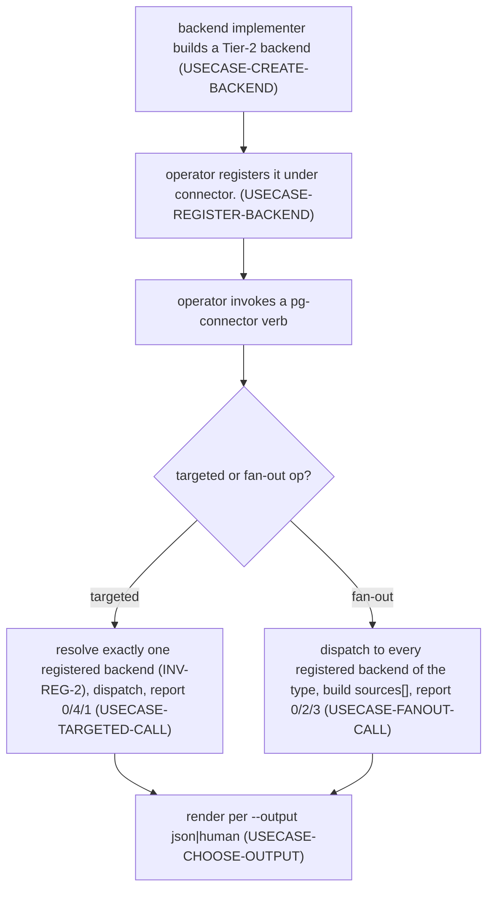
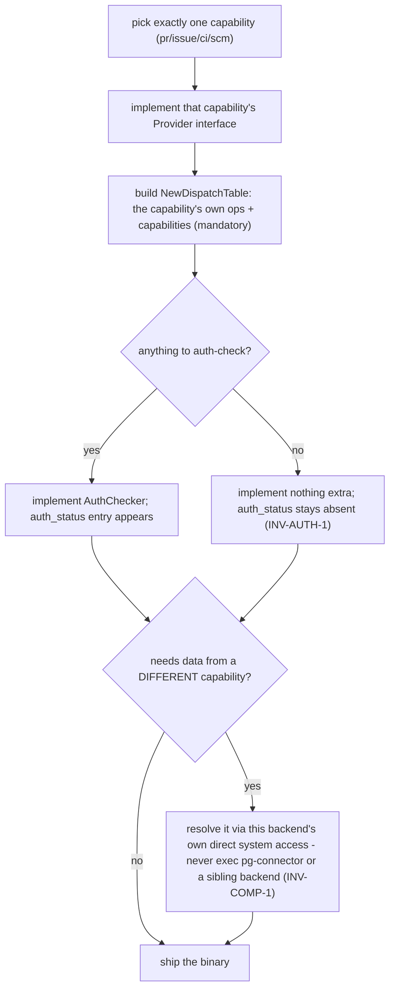
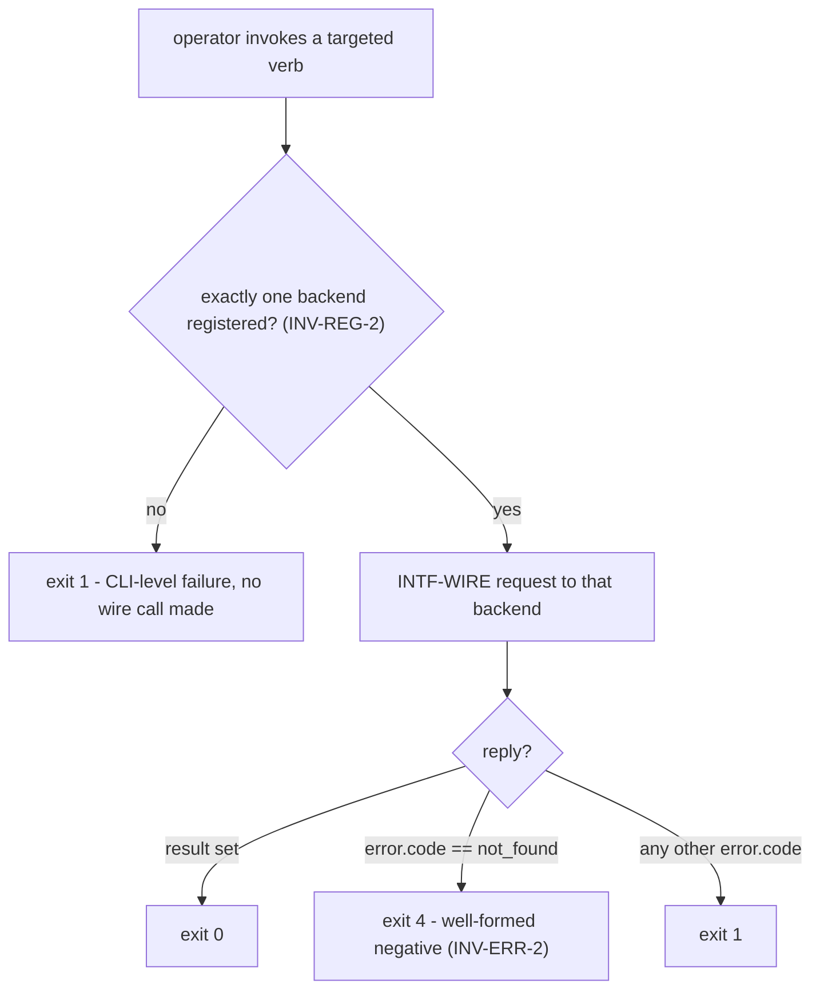
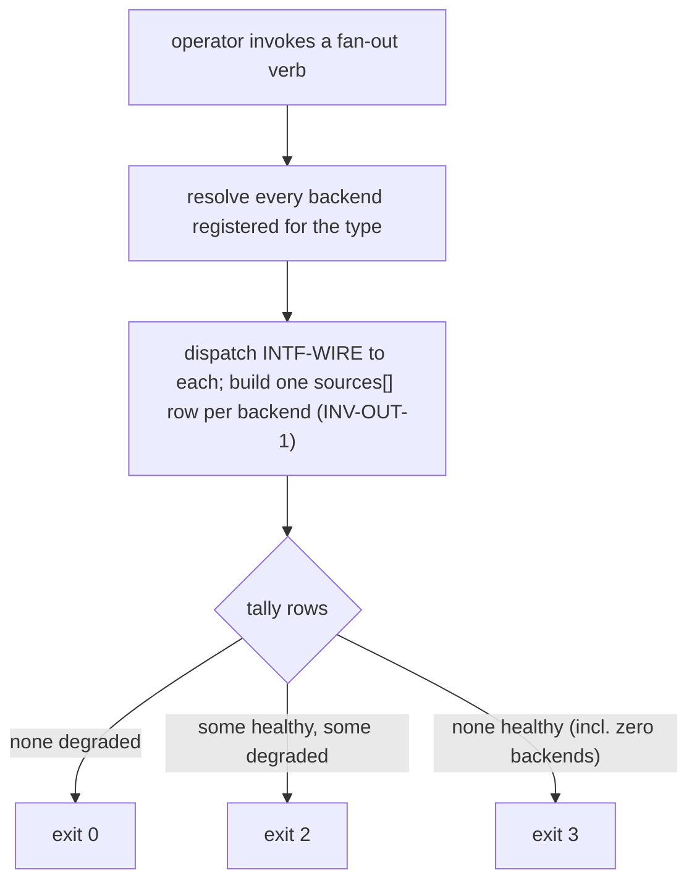
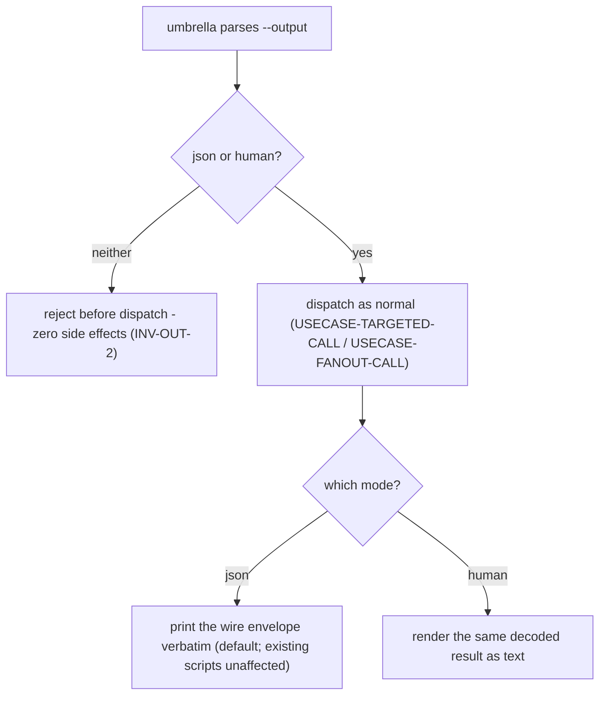

# Journeys & open questions — pg-connector

User stories, one end-to-end journey, the use cases that journey composes, and open questions.
Together they establish the extent, since a set's extent is exactly what its stories, use cases,
and journeys require (`phillipgreenii-nix-agent-support · behavior-docs/docs/behavior · INV-11`).
See the [glossary](glossary.md), [actors](actors.md), [interfaces](interfaces.md), and
[invariants](invariants.md) — every ID cited below resolves in one of those files.

## User stories

**Operator (`ACTOR-OP`)**

- **`STORY-OP-1`** <!-- uuid: 359d0179-476e-4f95-9ac2-b157a6979f95 --> — configure the
  `connector.<type>` registry once and use one umbrella for every entity type, so no tool talks
  to GitHub/Jira/beads/git directly, and adding a backend never touches the umbrella's own code.
  _(→ `USECASE-CREATE-BACKEND`, `USECASE-REGISTER-BACKEND`; `INV-CAP-1`, `INV-REG-1`,
  `GOAL-MIN-1`.)_
- **`STORY-OP-2`** <!-- uuid: 48c85fad-4c27-4118-9d4b-f5e290c85479 --> — get one command's read
  on every registered backend's auth and capability/schema health, so I know a backend is usable
  before relying on it rather than after a call fails against it. _(→ `USECASE-FANOUT-CALL`;
  `INV-AUTH-1`, `INV-VER-1`, `INV-OUT-1`.)_
- **`STORY-OP-3`** <!-- uuid: 4598e6fc-2c4f-4ce8-9d7b-a303ebb61b6b --> — get a distinguishable
  partial-vs-total failure on a multi-backend fan-out, so automation can gate on more than a bare
  pass/fail. _(→ `USECASE-FANOUT-CALL`; `INV-EXIT-1`, `INV-EXIT-2`, `INV-OUT-1`.)_
- **`STORY-OP-4`** <!-- uuid: 79b4c6aa-02c1-43df-9982-5b3806059801 --> — get a definitive
  not-found answer for one PR/issue/run/worktree without that reading as a broken backend, so I
  can script around a real negative without a false alarm. _(→ `USECASE-TARGETED-CALL`;
  `INV-EXIT-1`, `INV-ERR-1`, `INV-ERR-2`.)_
- **`STORY-OP-5`** <!-- uuid: 97f957bf-7b32-4e52-bdff-e69d0837cb8c --> — implement a new Tier-2
  backend for a capability by speaking one small wire protocol and implementing one small Go
  interface, never touching the umbrella's own code, and never reaching back into the umbrella or
  a sibling backend to get data my own backend needs. _(→ `USECASE-CREATE-BACKEND`; `INV-CAP-1`,
  `INV-WIRE-1`, `INV-WIRE-2`, `INV-COMP-1`, `GOAL-MIN-1`.)_
- **`STORY-OP-6`** <!-- uuid: 6699bfda-f2ca-4c6b-b113-7ea7a1157631 --> — get the same call
  rendered either as the stable JSON envelope my scripts already parse, or as readable text for
  my own terminal, chosen explicitly rather than guessed from my environment. _(→
  `USECASE-CHOOSE-OUTPUT`; `INV-OUT-2`.)_

## Journey

### `JOURNEY-FLOW` — the end-to-end arc, and one call's life along it <!-- uuid: 49d62f4d-4f8c-4335-8b24-266d0e6ca63a -->

**Actors:** `ACTOR-OP`, `ACTOR-BACKEND`.
**Level:** summary.
**Intent:** tell the whole arc once — how the use cases compose, and what becomes of one CLI
invocation as it travels from the operator to a registered backend and back.
_Requires:_ `INV-CAP-1`, `INV-WIRE-1`, `INV-REG-1`, `INV-REG-2`, `INV-EXIT-1`, `INV-OUT-1`,
`GOAL-MIN-1`.
_Includes:_ `USECASE-CREATE-BACKEND`, `USECASE-REGISTER-BACKEND`, `USECASE-TARGETED-CALL`,
`USECASE-FANOUT-CALL`, `USECASE-CHOOSE-OUTPUT`.

**The arc.** A backend implementer builds a Tier-2 backend against a capability's Provider
interface and the wire protocol (`USECASE-CREATE-BACKEND`) and registers it under
`connector.<type>` (`USECASE-REGISTER-BACKEND`). An operator then invokes the umbrella: a
**targeted** op resolves to the one backend registered for that capability and reports its
outcome via the targeted exit-code scheme (`USECASE-TARGETED-CALL`); a **fan-out** op queries
every registered backend of a type/capability at once and reports a `sources[]` row per backend
plus the fan-out exit-code scheme (`USECASE-FANOUT-CALL`). Either kind of call is rendered in
whichever presentation mode the operator chose (`USECASE-CHOOSE-OUTPUT`).



```mermaid
sequenceDiagram
    actor Op as operator
    participant Umb as umbrella
    participant BE as Tier-2 backend
    Op->>Umb: pg-connector <capability> <verb> [--output ...] [args]
    Umb->>Umb: validate --output pre-dispatch (INV-OUT-2)
    Umb->>Umb: resolve connector.<type> (INV-REG-1, INV-REG-2)
    Umb->>BE: INTF-WIRE: {"op": "...", "args": {...}}
    BE-->>Umb: {protocolVersion, schemaVersion, result} or {..., error: {code, message}}
    Umb->>Umb: classify outcome -> pg-connector's own exit code (INV-EXIT-1), never INTF-WIRE's own 0/1
    Umb-->>Op: rendered result/outcome; process exit code
```

## Use cases

### `USECASE-CREATE-BACKEND` — implement a Tier-2 backend for one capability <!-- uuid: da0238bf-1142-4c94-84e1-418457911e72 -->

**Actors:** `ACTOR-OP` (as the backend's implementer), `ACTOR-BACKEND`.
**Level:** user-goal.
**Preconditions:** none.
**Intent:** build a Tier-2 backend against exactly one capability's Provider interface and
`INTF-WIRE`'s common wire contract, so the umbrella can dispatch to it without any code change of
its own.
_Requires:_ `INV-CAP-1`, `INV-WIRE-1`, `INV-WIRE-2`, `INV-AUTH-1`, `INV-COMP-1`, `GOAL-MIN-1`.

**Flow.** The implementer picks exactly one capability (`pr`, `issue`, `ci`, or `scm`) and
implements that capability's own small Go Provider interface (never a monolithic
multi-capability interface, `INV-CAP-1`); wires it into a `NewDispatchTable` that answers that
capability's own op catalog (`interfaces.md`) plus the common `capabilities` op (mandatory,
`INV-WIRE-2`) and, if it has anything to check, `auth_status` via the optional `AuthChecker`
sub-interface (`INV-AUTH-1`); and ships it as its own binary speaking `INTF-WIRE`'s envelope
(`INV-WIRE-1`). Any data the implementation needs that belongs to a **different** capability MUST
be resolved through this backend's own direct system access, never by executing the umbrella or a
sibling backend binary (`INV-COMP-1`) — the umbrella gains no new dependency and no new process in
the call graph just because one backend happens to need data another capability's backend usually
supplies.



Extensions:

- The backend has no remote-credential concept at all (e.g. a purely local-git `scm` backend): it
  simply does not implement `AuthChecker`, and any `auth_status`/`capabilities`-driven fan-out
  reports it as `disabled: "not applicable"` (`INV-AUTH-1`), not a forced or broken answer.

### `USECASE-REGISTER-BACKEND` — register an implemented backend under `connector.<type>` <!-- uuid: 0fdc74b6-b29f-4518-b3fc-2e75f150944e -->

**Actor:** `ACTOR-OP`.
**Level:** user-goal.
**Preconditions:** the backend has been implemented (`USECASE-CREATE-BACKEND`).
**Intent:** put an implemented backend's binary name into the `connector.<type>` registry so the
umbrella can dispatch to it.
_Requires:_ `INV-REG-1`, `INV-REG-2`.

**Flow.** The operator adds the backend's bare binary name under its capability's
`connector.<type>` entry — appending to the list for `pr`/`issue`/`ci`, or setting the single
value for `scm`. No `exec:` prefix or other built-in/external marker is written, because nothing
is compiled into the umbrella (`INV-REG-1`). If the operator intends the backend to answer a
**targeted** op (as opposed to only participating in a fan-out), the capability's registry entry
MUST resolve to exactly this one backend when that targeted op is invoked (`INV-REG-2`) — for a
list-valued capability that already has another backend registered, registering a second one
makes every targeted op against that capability a CLI-level error until the operator narrows it
back to one.

Extensions:

- The capability is `scm`: the registry entry is a single scalar value, not a list; registering a
  second backend under it is a configuration error the registry itself rejects, never a silent
  overwrite.

### `USECASE-TARGETED-CALL` — invoke a targeted op and read its outcome <!-- uuid: e799d106-9348-4dcc-be8c-cc36111f8823 -->

**Actor:** `ACTOR-OP`.
**Level:** user-goal.
**Preconditions:** the target capability's registry entry resolves to exactly one backend
(`USECASE-REGISTER-BACKEND`).
**Intent:** call an op that resolves to one specific backend and get back a result or a
definitive, correctly-coded negative — never a health problem misreported as one, or the reverse.
_Requires:_ `INV-REG-2`, `INV-WIRE-1`, `INV-ERR-1`, `INV-ERR-2`, `INV-EXIT-1`.
_Includes:_ `USECASE-CHOOSE-OUTPUT`.

**Flow.** The umbrella resolves the capability's registered backend, dispatches one `INTF-WIRE`
request, and classifies the reply into its own targeted exit code: `0` on a well-formed
`result` (including a successful write); `4` when the reply's `error.code` is `not_found` — a
well-formed negative answer, not a failure; `1` for any other error, or for a CLI-level failure
before any well-formed response existed at all (no backend registered, an ambiguous
multi-backend registration, a bad flag). The result is then rendered per the operator's chosen
output mode (`USECASE-CHOOSE-OUTPUT`).



Extensions:

- The reply's `error.code` is `invalid_argument`: the request itself was malformed — exit `1`,
  identical to every other non-`not_found` error, since sharpening `invalid_argument` from
  `unavailable` is a wire-body precision, not a new CLI exit-code bucket (`INV-ERR-2`,
  `INV-EXIT-1`).

### `USECASE-FANOUT-CALL` — invoke a fan-out op across every registered backend and read its outcome <!-- uuid: f325a8b7-c43f-4b97-839f-2e32871a68d7 -->

**Actor:** `ACTOR-OP`.
**Level:** user-goal.
**Preconditions:** none — a fan-out MAY run against zero registered backends (reported as total
failure, `INV-EXIT-1`) rather than requiring any minimum registration.
**Intent:** call an op that queries every backend registered for a type/capability at once (`ci
list`, `auth status`, `config validate`) and get back a per-backend outcome breakdown plus one
exit code distinguishing all-succeeded from partial from total failure.
_Requires:_ `INV-VER-1`, `INV-AUTH-1`, `INV-EXIT-1`, `INV-EXIT-2`, `INV-OUT-1`.
_Includes:_ `USECASE-CHOOSE-OUTPUT`.

**Flow.** The umbrella dispatches one `INTF-WIRE` request per registered backend of the type
(concatenating results across backends for `ci list`; combining two checks — `auth_status` and
`capabilities` — into one row per backend for `config validate`), builds one `sources[]` row per
backend queried (`succeeded`/`degraded`/`disabled`, never collapsed), and computes its own exit
code from those rows: `0` if none are `degraded`; `2` if at least one is `degraded` and at least
one is healthy (`succeeded` or `disabled`); `3` if none are healthy at all, including the
zero-backends-registered case. A `disabled` row (a backend correctly answering "not applicable" —
e.g. no `AuthChecker` implemented) counts as healthy, never as a failure (`INV-EXIT-2`). For
`config validate` specifically, a `capabilities` response's self-declared `schemaVersions` is also
checked against this build's own expectations, and any recognized-capability disagreement is
folded into that backend's row as `degraded` with a `version_mismatch` reason (`INV-VER-1`). The
merged result is then rendered per the operator's chosen output mode (`USECASE-CHOOSE-OUTPUT`).



Extensions:

- The op is `config validate`: each backend's row combines its `auth_status` outcome and a
  `schemaVersions` comparison from its `capabilities` response into one verdict — a `disabled`
  `auth_status` (no `AuthChecker`) does not by itself degrade the row (`INV-AUTH-1`,
  `INV-EXIT-2`), but a recognized-capability `schemaVersion` mismatch does (`INV-VER-1`).

### `USECASE-CHOOSE-OUTPUT` — choose the CLI's presentation mode <!-- uuid: 632b7e23-25c8-43e2-9572-65f3547023bd -->

**Actor:** `ACTOR-OP`.
**Level:** subfunction.
**Preconditions:** none — this applies identically to every targeted or fan-out call.
**Intent:** render a call's already-decoded result as the stable JSON envelope, or as readable
text, chosen explicitly rather than inferred.
_Requires:_ `INV-OUT-2`.

**Defined once, included by reference.** Both `USECASE-TARGETED-CALL` and `USECASE-FANOUT-CALL`
include this rather than restating it, because the choice and its validation timing are identical
for either call shape.

**Flow.** `--output` defaults to `json`. The value is validated the moment the umbrella parses
its arguments, strictly **before** any backend is dispatched, so an invalid value is rejected with
zero side effects — no backend has been invoked, no write has happened. On the success path,
`json` mode prints the wire envelope (or the merged fan-out envelope) verbatim, byte-for-byte what
pg-connector has always printed; `human` mode renders the same already-decoded, already-typed
result as text instead. Neither mode alters `INTF-WIRE`'s own protocol.



## Open questions

- **`OQ-EXIT-1`** <!-- uuid: 8f72c935-6feb-473d-a73f-ee1e02b3ca48 --> — `INTF-WIRE`'s own
  exit codes stay a plain `0`/`1` (`INV-WIRE-1`), which does not meet this workspace's own
  code-file convention that a branchable meaning uses a distinct exit code ≥ 2, with `1` reserved
  for a generic/unexpected error. Is this an accepted, deliberate exemption — because
  classification already lives entirely in the JSON `error.code` (`INV-ERR-1`), and the wire
  layer's exit code genuinely carries no branchable meaning of its own beyond "did a well-formed
  envelope come back" — or should `INTF-WIRE` widen its own exit-code scheme to satisfy that
  convention directly? Unresolved as of this writing; not blocking, since every consumer today
  already reads the JSON body rather than branching on the wire-level exit code.
