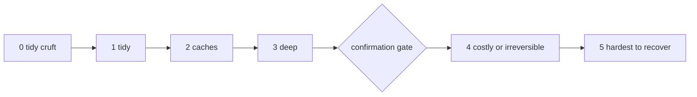

# pg-disk-reclaimer aggressiveness scale

This document is the single authoritative definition of the `aggressiveness`
scale (levels 0 to 5) used by every `pg-disk-reclaimer` registry variant and by
the `--aggressiveness N` option of `list` and `reclaim`. The `--help` text, the
tldr page, and the `aggressiveness` Nix option description all refer here
rather than restating the levels.

The key words "MUST", "MUST NOT", "SHOULD", "SHOULD NOT", and "MAY" in this
document are to be interpreted as described in RFC 2119.

## Semantics

- `--aggressiveness N` is a CEILING, not an exact match. An item is selected
  when it has at least one variant whose level is `<= N`. When an item has
  several qualifying variants, `reclaim` MUST run only the one with the HIGHEST
  level `<= N`, so raising the ceiling escalates an item from its mild variant
  to its more aggressive one.
- `N` is a non-negative integer. A registry variant's level MUST be a
  non-negative integer and MUST be unique within its item.
- `reclaim` is a dry run unless `--apply` is given.
- Confirmation gate: under `--apply`, `reclaim` MUST ask for interactive
  confirmation (read from the controlling terminal, never from stdin) before
  running the `removeCommand` of any selected variant whose level is `>= 4`.
  A declined confirmation skips only that item. A dry run MUST NOT prompt at
  any level. There MUST NOT be any flag, environment variable, or
  non-interactive path that bypasses the gate. Levels 0 to 3 MUST NOT prompt.
- The gate level is the code constant `PGDR_CONFIRM_GATE_LEVEL` in
  `pg-disk-reclaimer.bash`. The marker line below MUST equal that constant; the
  bats suite `tests/test-pg-disk-reclaimer-scale-docs.bats` fails when they
  differ.

<!-- pgdr-confirm-gate-level: 4 -->

Levels to the left of the gate run under `--apply` without a prompt; levels 4
and 5 prompt once per item.

## Levels

### Level 0: tidy cruft

Clutter whose removal costs nothing, such as stray backup or temporary files. A
level 0 variant MUST NOT remove anything that is regenerated, referenced, or
valued.

### Level 1: tidy

Work that is already finished elsewhere, such as merged or stale worktrees and
branches. There is nothing to regenerate. A level 1 variant SHOULD be guarded so
that anything with uncommitted or unmerged work is left alone.

### Level 2: caches

Small or cheap regenerable caches. A cache miss refills in seconds, with no
meaningful network use. The plain (non-forfeiting) garbage collection of a
content-addressed store belongs here.

### Level 3: deep

Regenerable from local disk with no network access, but the refill is
expensive: minutes of CPU, large trees, or slowed concurrent builds. A Go build
cache is the reference case.

The 2-versus-3 boundary is the cost of refilling. A variant at level 2 refills
in seconds. A variant at level 3 refills in minutes or more, or makes
concurrent work noticeably slower while it refills.

### Level 4: costly or irreversible

Any of the following puts a variant at level 4 or above:

- regeneration needs the network (for example a module or package download
  cache), so it costs bandwidth and time and can fail offline;
- the removal forfeits rollback or history (for example deleting old system
  generations or compacting history);
- the removal touches live shared state that other processes depend on.

Level 4 is the first level behind the confirmation gate.

### Level 5: hardest to recover

Loss of user-visible state that is slow and manual to rebuild, such as an IDE
index or a scrub of caches for software that is currently installed. A level 5
variant is the last resort.

The 4-versus-5 boundary is who rebuilds. A level 4 variant is rebuilt
automatically, at a cost the operator can accept. A level 5 variant leaves the
operator waiting on, or redoing, work by hand.

## Rules for registry authors

- Every registry item MUST have a level for each variant, and each level MUST
  be justified by a one-line reason.
- The reason MAY be the variant description when the level is obvious from the
  definitions above. When the choice is not obvious (for example a network cost
  that pushes a cache from level 3 to level 4, or two similar caches at
  different levels), the registry source MUST carry a comment that states the
  reason.
- An item MAY offer several variants at different levels. A milder variant
  SHOULD be the lower level and a more destructive variant of the same area
  SHOULD be the higher level.
- A variant MUST NOT be placed at a lower level than the definitions above
  require just to avoid the confirmation gate.
