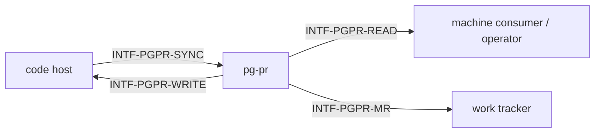

# pg-pr — behavior docs

pg-pr is the **PR-data interface**: it syncs PR facts from a code host into its own store,
serves them out with freshness attached, and is the sole path through which reviews and comments
are posted back — safely, attributed, and never auto-submitted. This set follows the
behavior-docs method (`phillipgreenii-nix-agent-support · behavior-docs/docs/behavior`) and ADR
0034 (`pg-pr / pr-pool review-ownership split`).

Start here, then the [glossary](glossary.md); the rules are in [invariants](invariants.md), the
boundaries in [interfaces](interfaces.md), the actors in [actors](actors.md), and the stories, use
cases, journeys in [journeys](journeys.md).

## The model

The diagram below **is** this set's interface inventory (`GOAL-7`) — not a data-flow diagram and
not a component diagram.

Each interface is classified on **two axes** — counterparty kind and essential-vs-optional
participation — per the method (`INV-8`); pg-pr has no optional participant, see
[interfaces](interfaces.md).

**pg-pr owns PR data, never review workflow.** ADR 0034 draws that line: pg-pr syncs facts,
serves reads with freshness attached, and posts write-backs; **who** reviews what, **when**, and
under what deployment policy is not pg-pr's concern, and the legacy in-daemon review workflow
that once lived here is excluded by name (`## Scope`).

**Freshness is pg-pr's own obligation, stated once, and computed nowhere else.** Every acted-on
read seam carries an as-of time and a stale flag; a consumer MUST NOT act on data flagged stale
(`INV-ASOF-1`), and MUST NOT re-derive its own staleness policy over the same facts — pg-pr is
the sole computer of that determination (`INV-ASOF-2`). The freshness bound and the fail-closed
rule's exact wiring are decision-doc detail (`packages/pg-pr/docs/decisions · DEC-FRESH-1`), not
restated here.

## Scope (extent + floor, `INV-13`)

- **Extent (in)** — the read-seam purity of the base machine listing (network-free,
  side-effect-free); freshness on every acted-on read; sole-creator, idempotent
  merge-request-record upsert; fingerprint-driven sync where only workers mutate and never mass
  close on partial data; head-anchored, attributed, PENDING-only review and comment posting with
  a fail-closed supersede check; the approval gate tracked as its own axis, distinct from CI
  health, where a signal pg-pr cannot classify reads unknown rather than satisfied.
- **Extent (out), named explicitly (ADR 0034)** — the legacy in-daemon review **workflow**:
  draft-review record lifecycle, an automated review consumer and its own agent spawn,
  re-review-on-head-advance and any reviewed-state cursor, retry/dead-letter policy, a credential
  pre-fetch gate, a result sidecar, the kill switch gating all of it, and every prompt asset
  defining what a good review is. Also out: which reviews are posted and when (deployment
  policy), and the pr-pool seam (a peer seam owned elsewhere). The PR-data sync and the read/write
  surfaces themselves stay in extent regardless of any kill switch — the switch gates only the
  excluded workflow.
- **Floor** — pg-pr speaks in PRs, facts, freshness, merge-request records, drafts, and
  attribution — never in GraphQL/REST specifics, SQL columns, or CLI flag names.

## Realization gaps

This set's **realization-gap register** (`INV-23`): intended behavior this set's implementation
has not built yet, one row per gap, each keyed by the element id the gap is against. Not an open
question — the intent is settled and the build has not caught up (`INV-15`).

| Element                 | Intended                                                                                           | Where the implementation stands                                                                  | Tracked by        |
| ----------------------- | -------------------------------------------------------------------------------------------------- | ------------------------------------------------------------------------------------------------ | ----------------- |
| `## Scope` (extent out) | the excluded legacy review workflow is fully removed, leaving only the kill switch's memory behind | the legacy chain still exists behind an opt-in switch defaulting off, pending a deliberate strip | bead `pg2-ynhr.5` |

## External references

This set follows the behavior-docs method and cites elements the method defines.

| Name     | What it is                                                                                                                            | Owner set-path                                                   | Owner UUID                                                                                                                                      |
| -------- | ------------------------------------------------------------------------------------------------------------------------------------- | ---------------------------------------------------------------- | ----------------------------------------------------------------------------------------------------------------------------------------------- |
| `INV-3`  | every element carries a typed name and a stable UUID minted once at its definition                                                    | `phillipgreenii-nix-agent-support · behavior-docs/docs/behavior` | [c44b760f-9baf-471a-8424-49984eb94ac7](https://github.com/phillipgreenii/nix-agent-support/blob/main/behavior-docs/docs/behavior/invariants.md) |
| `INV-8`  | a cross-product interaction MUST be an explicit interface, classified by counterparty kind and by essential-vs-optional participation | `phillipgreenii-nix-agent-support · behavior-docs/docs/behavior` | [67a79e92-2f98-40a2-9392-034a697e457e](https://github.com/phillipgreenii/nix-agent-support/blob/main/behavior-docs/docs/behavior/invariants.md) |
| `INV-13` | a set MUST make its scope explicit (extent + floor) and define all its actors and interfaces                                          | `phillipgreenii-nix-agent-support · behavior-docs/docs/behavior` | [94285c70-da89-4402-8ae2-af27925008bd](https://github.com/phillipgreenii/nix-agent-support/blob/main/behavior-docs/docs/behavior/invariants.md) |
| `INV-15` | the behavior docs set is the source of truth; a realization gap is normal, not a defect                                               | `phillipgreenii-nix-agent-support · behavior-docs/docs/behavior` | [375b542f-2a9f-4cfd-a77e-7aed45a416d5](https://github.com/phillipgreenii/nix-agent-support/blob/main/behavior-docs/docs/behavior/invariants.md) |
| `INV-22` | traceability is a listing obligation on every story, use case and journey, not a coverage section                                     | `phillipgreenii-nix-agent-support · behavior-docs/docs/behavior` | [b2502527-1340-4a1f-858c-aaa80c601317](https://github.com/phillipgreenii/nix-agent-support/blob/main/behavior-docs/docs/behavior/invariants.md) |
| `INV-23` | the realization-gap register is set-level, named `## Realization gaps`, and never an element                                          | `phillipgreenii-nix-agent-support · behavior-docs/docs/behavior` | [f3bba3e7-440f-4109-a4de-9d37daa34bcf](https://github.com/phillipgreenii/nix-agent-support/blob/main/behavior-docs/docs/behavior/invariants.md) |
| `GOAL-7` | a set SHOULD show intent through examples                                                                                             | `phillipgreenii-nix-agent-support · behavior-docs/docs/behavior` | [42ad1aa1-af11-4387-bf02-e0f028f80434](https://github.com/phillipgreenii/nix-agent-support/blob/main/behavior-docs/docs/behavior/invariants.md) |
