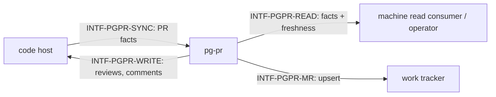

# Interfaces — pg-pr

This file follows the interface convention of the behavior-docs method
(`phillipgreenii-nix-agent-support · behavior-docs/docs/behavior`): an **interface** is a boundary
described by **what crosses it** and **what must hold**, never _how_ it is implemented. See the
[glossary](glossary.md) for terms, [actors](actors.md) for who sits on each side,
[invariants](invariants.md) for the rules, and [journeys](journeys.md) for the flows that exercise
these interfaces.

The four interfaces are described on **two axes** — the **kind** of party on the far side, and
whether that party is an **essential or optional** participant in what pg-pr exists to do
(`INV-8`); all four are essential — pg-pr has no optional participant.

| Interface         | Boundary                     | Counterparty (kind)           | Participation           | Initiator |
| ----------------- | ---------------------------- | ----------------------------- | ----------------------- | --------- |
| `INTF-PGPR-READ`  | PR facts out, with freshness | `ACTOR-PGPR-CONSUMER` (actor) | essential, driving port | consumer  |
| `INTF-PGPR-WRITE` | reviews and comments posted  | `ACTOR-PGPR-CODEHOST` (owner) | essential               | pg-pr     |
| `INTF-PGPR-SYNC`  | PR facts pulled in           | `ACTOR-PGPR-CODEHOST` (owner) | essential               | pg-pr     |
| `INTF-PGPR-MR`    | merge-request record upsert  | `ACTOR-PGPR-TRACKER` (owner)  | essential               | pg-pr     |

## `INTF-PGPR-READ` — PR facts out, with freshness <!-- uuid: 8906d9c1-cc11-4f4d-90b3-0a589061d2ce -->

- **Out (pg-pr → consumer), machine seam** — a listing of PR facts read with no network call and
  no store mutation (`INV-READ-1`), each item carrying its own as-of time and stale flag
  (`INV-ASOF-1`). Fact columns include identity, ownership, size and age, and CI signal and
  review-count facts read from the code host — the **PR-fact** half of any triage surface built
  on this seam; a downstream deployment's own judgement over these facts (urgency, sort,
  cross-domain enrichment) is not pg-pr's to compute.
- **Out (pg-pr → consumer), dashboard seam** — the same facts, human-facing, with a
  payload-level as-of time and stale flag.
- **Guarantee** — a consumer MUST be able to tell "stale" from "current" for every fact it acts
  on (`INV-ASOF-1`).

## `INTF-PGPR-WRITE` — reviews and comments posted <!-- uuid: 59ab0dcd-d1e9-4a81-8d91-46b1f9146b6b -->

- **Out (pg-pr → code host)** — a review or comment, head-anchored (`INV-WRITE-1`), attributed
  (`INV-ATTR-1`), staged as a draft and posted pending (`INV-REVIEW-1`), never against a PR still
  marked draft (`INV-REVIEW-2`), superseding any existing pending draft rather than stacking
  (`INV-REVIEW-3`).
- **Guarantee** — pg-pr is an **implementer** of the code host's own review-posting contract: it
  states only its own obligations above and never restates the code host's contract.

## `INTF-PGPR-SYNC` — PR facts pulled in <!-- uuid: b5f0bdcd-365d-49fa-a578-59637afc28bc -->

- **In (code host → pg-pr)** — PR facts, fetched by fingerprint-driven comparison
  (`INV-SYNC-1`).
- **Guarantee** — a pass that cannot confirm completeness for some subset MUST NOT be read as
  "those PRs are gone" (`INV-SYNC-2`).

## `INTF-PGPR-MR` — merge-request record upsert <!-- uuid: 15a4f89f-420a-4628-aea0-73a0e722c6ef -->

- **Out (pg-pr → tracker)** — create-or-update one record per `(repository, PR number)`
  (`INV-MR-1`).
- **Guarantee** — pg-pr is the **sole creator**; any other consumer of the tracker MUST
  find-or-reuse an existing record rather than create one.
