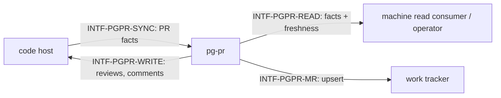

# Interfaces — pg-pr

This file follows the interface convention of the behavior-docs method
(`phillipgreenii-nix-agent-support · behavior-docs/docs/behavior`): an **interface** is a boundary
described by **what crosses it** and **what must hold**, never _how_ it is implemented. See the
[glossary](glossary.md) for terms, [actors](actors.md) for who sits on each side,
[invariants](invariants.md) for the rules, and [journeys](journeys.md) for the flows that exercise
these interfaces.

The four interfaces are described on **two axes** — the **kind** of party on the far side, and
whether that party is an **essential or optional** participant in what pg-pr exists to do
(`INV-8`); all four are essential — pg-pr has no optional participant.

| Interface         | Boundary                     | Counterparty (kind)           | Participation           | Initiator |
| ----------------- | ---------------------------- | ----------------------------- | ----------------------- | --------- |
| `INTF-PGPR-READ`  | PR facts out, with freshness | `ACTOR-PGPR-CONSUMER` (actor) | essential, driving port | consumer  |
| `INTF-PGPR-WRITE` | reviews and comments posted  | `ACTOR-PGPR-CODEHOST` (owner) | essential               | pg-pr     |
| `INTF-PGPR-SYNC`  | PR facts pulled in           | `ACTOR-PGPR-CODEHOST` (owner) | essential               | pg-pr     |
| `INTF-PGPR-MR`    | merge-request record upsert  | `ACTOR-PGPR-TRACKER` (owner)  | essential               | pg-pr     |

## `INTF-PGPR-READ` — PR facts out, with freshness <!-- uuid: 8906d9c1-cc11-4f4d-90b3-0a589061d2ce -->

- **Out (pg-pr → consumer), machine read seam** — a listing of PR facts read with no network call
  and no store mutation (`INV-READ-1`), each item carrying its own as-of time and stale flag
  (`INV-ASOF-1`). Fact columns include identity, ownership, size and age, CI signal and
  review-count facts read from the code host, and the **approval gate** — its own field,
  distinct from the CI signal, carrying the same freshness treatment as its sibling facts
  (`INV-GATE-1`, `INV-GATE-4`) — the **PR-fact** half of any triage surface built on this seam.
  Fact columns also include the **PR dependency** (`INV-DEP-1`): whether this PR is a
  **downstream PR** currently ranked below an **upstream PR** in this same listing, whether it is
  waiting on a ref that does not resolve to a tracked PR at all (a marker naming the unresolved
  ref, never a special fetch to pull that PR into the listing), or whether it was recently
  **unblocked** because its upstream PR merged — plus the **ordering key** this ranking is
  encoded as. Fact columns also carry visibility: whether a PR is **user-hidden**, the operator's
  own display-only suppression (see [glossary](glossary.md)) — a presentation fact alongside the
  others above, never a filter on which PRs this seam reads. Fact columns also include an
  **urgency heuristic** — pg-pr's own single, opinionated score and level, computed once and
  exposed for any consumer to read rather than recomputed per deployment (`INV-URG-1`).
- **Guarantee, scope of pg-pr's own ranking judgement** — pg-pr computes exactly **one
  opinionated urgency heuristic** per PR: a single score and level, folding in signals it already
  reads from the PR itself together with cross-domain signals it correlates in from elsewhere
  (whether a project this PR references is currently broken, the priority recorded against a
  linked tracking item, whether a related incident is currently active) — pg-pr's own judgement,
  computed once and exposed as a fact column for any consumer to read, never recomputed per
  deployment (`INV-URG-1`). What remains **not pg-pr's to compute** is anything downstream of
  that: a **per-deployment re-weighting** of this heuristic, and any other sort key not covered
  by an operator-approved ruling. A deployment wanting different urgency weighting MUST compute
  its own from the underlying facts; it MUST NOT expect pg-pr to honour a per-deployment
  weighting policy (`INV-URG-1`). The PR-dependency ordering key above carries its own, separate
  carve-out: an operator-approved ruling (pg2-4dz88.7, 2026-08-21 — "Upstream-of-another-PR
  before standalone" as one key of a shared sort order) puts that specific ranking judgement
  inside pg-pr itself (`INV-DEP-1`), a carve-out for that key alone that does not extend to any
  other judgement no such ruling covers.
- **Out (pg-pr → consumer), dashboard payload** — the same facts, human-facing, carrying a
  payload-level as-of time and stale flag rather than a per-item one. Day-to-day dashboard
  surfaces are exactly where a **user-hidden** PR's visibility fact takes effect, suppressing it
  from view while the consolidated single-PR view below still returns it on request.
- **Out (pg-pr → consumer), consolidated single-PR view** — on request, every PR fact pg-pr
  holds for one identified PR, assembled into a single aggregate carrying its own as-of time and
  stale flag for the whole aggregate, per the same freshness guarantee below. The requester MAY
  additionally ask that this assembly be preceded by an on-demand refresh of that one PR — the
  **augmented read** `INV-READ-1` carves out of its own no-network-call guarantee — so the
  resulting as-of time reflects the refreshed state rather than whatever was already stored. That
  refresh is the same on-demand path `USECASE-PGPR-SYNC` already describes, scoped to the one
  requested PR; any merge-request record it touches remains governed by `INV-MR-1`'s
  sole-creator, single-record guarantee regardless of what requested the refresh.
- **Guarantee** — a consumer MUST be able to tell "stale" from "current" for every fact it acts
  on (`INV-ASOF-1`); pg-pr, not the consumer, makes that determination, so a consumer MUST NOT
  re-derive its own staleness policy over these facts (`INV-ASOF-2`).

## `INTF-PGPR-WRITE` — reviews and comments posted <!-- uuid: 59ab0dcd-d1e9-4a81-8d91-46b1f9146b6b -->

- **Out (pg-pr → code host)** — a review or comment, head-anchored (`INV-WRITE-1`), carrying its
  attribution mark (`INV-ATTR-1`), staged as a draft and posted as a pending review
  (`INV-REVIEW-1`). Posting review content against a draft PR is permitted only when the PR is
  the reviewing operator's own and WIP is not set on it; a draft PR belonging to anyone else is
  refused regardless of WIP (`INV-REVIEW-2`). Posting supersedes any existing pending review —
  found via a fail-closed pending check — rather than stacking (`INV-REVIEW-3`).
- **Guarantee** — pg-pr is an **implementer** of the code host's own review-posting contract: it
  states only its own obligations above and never restates the code host's contract.
- **Open questions** (tracked in [journeys](journeys.md)): `OQ-PGPR-VERDICT-DRIVES-POST` (whether
  the staged review verdict should eventually drive the posted review state, rather than the
  posted state always being `PENDING` with no approve/request-changes event).

## `INTF-PGPR-SYNC` — PR facts pulled in <!-- uuid: b5f0bdcd-365d-49fa-a578-59637afc28bc -->

- **In (code host → pg-pr)** — PR facts, fetched by fingerprint-driven comparison
  (`INV-SYNC-1`). The retrieval set is the union of a cross-repo mine bucket (author-only) with,
  per repo, a team-authored bucket, a review-requested bucket, a reviewed-by-me bucket, an
  assigned-to-me bucket, and one bucket per configured watch label. Background (daemon) sync
  always retrieves this full union. A manually triggered one-shot sync defaults to the
  author-only (mine) facts alone — deliberately narrower, to keep an on-demand run cheap — and
  MAY, at the invoker's explicit opt-in, retrieve the same full union for that one run, gaining
  the same not-mine coverage as background sync on demand.
- **In (code host → pg-pr), approval gate** — the **approval gate** is one of the PR facts pulled
  in through this crossing, classified into its gate state and tracked as its own axis — never
  folded into the CI-health facts pulled in alongside it (`INV-GATE-1`). A signal pg-pr cannot
  classify is pulled in as `unknown`, never `satisfied` (`INV-GATE-2`); a check or status no
  configured interpreter claims still counts toward CI health exactly as it does today
  (`INV-GATE-3`).
- **Guarantee** — a pass that cannot confirm completeness for some subset MUST NOT be read as
  "those PRs are gone" (`INV-SYNC-2`).
- **Guarantee** — membership in the pulled-in, not-mine set is self-correcting: a PR admitted
  because it carried a qualifying reason is re-checked on every rebuild and drops out the moment
  none of its qualifying reasons still hold, with no timer and no persisted "seen" state
  (`INV-SYNC-1`). This governs the underlying dashboard/read-side membership only — the PR's own
  merge-request tracking record (`INTF-PGPR-MR`) follows its own lifecycle, closed solely by the
  PR's real close or merge, never by a qualifying-reason change.
- **Open questions** (tracked in [journeys](journeys.md)): `OQ-PGPR-COMMENTER-BUCKET` (whether a
  PR I have only commented on, with no other qualifying reason, should itself become one).

## `INTF-PGPR-MR` — merge-request record upsert <!-- uuid: 15a4f89f-420a-4628-aea0-73a0e722c6ef -->

- **Out (pg-pr → tracker)** — create-or-update one record per `(repository, PR number)`
  (`INV-MR-1`).
- **Guarantee** — pg-pr is the **sole creator**; any other consumer of the tracker MUST
  find-or-reuse an existing record rather than create one.
