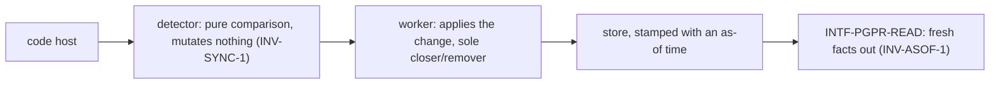
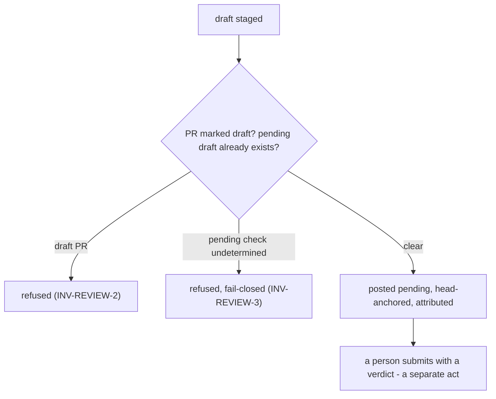

# Journeys — pg-pr

Stories, use cases, and journeys, typed and leveled per the behavior-docs method's vocabulary
rules: **user-goal** and **subfunction** level elements are `USECASE-`; **summary**-level
multi-actor arcs stay `JOURNEY-`. Each element carries, on its own definition, what it requires
and what it includes (`INV-22`).

## Stories

- **`STORY-PGPR-GLANCE`** <!-- uuid: 78f67804-45fe-475c-bc9c-8559a5054a26 --> — As an operator or
  a machine consumer, I want PR facts I can trust the freshness of, so I never act on stale
  information. _(→ `USECASE-PGPR-LIST`; `INV-READ-1`, `INV-ASOF-1`, `INV-ASOF-2`,
  `INV-APPROVAL-1`, `INV-APPROVAL-2`, `INV-APPROVAL-3`, `INV-APPROVAL-4`, `INV-APPROVAL-5`.)_
- **`STORY-PGPR-REVIEW`** <!-- uuid: 23724212-5d46-416d-ba0e-e43644d1269c --> — As a reviewer
  (human or agent), I want to stage and post a review safely, so my feedback lands attributed and
  never stacks a duplicate. _(→ `USECASE-PGPR-REVIEW`; `INV-REVIEW-1`, `INV-ATTR-1`.)_
- **`STORY-PGPR-TRACK`** <!-- uuid: 4ad02fb3-84e6-45cf-ae24-80fdd5c666d8 --> — As a workflow
  consumer, I want every PR represented as exactly one tracking record, so downstream work never
  double-counts it. _(→ `USECASE-PGPR-CREATE`; `INV-MR-1`, `INV-SYNC-1`.)_

## Use cases

### `USECASE-PGPR-LIST` — list PRs, machine or human <!-- uuid: 8bbaaf81-34f5-4a6a-9706-d58573b53d60 -->

**Primary actor:** `ACTOR-PGPR-CONSUMER` (or `ACTOR-PGPR-OP`).
**Level:** user-goal.
**Preconditions:** none.
_Requires:_ `INV-READ-1`, `INV-ASOF-1`, `INV-ASOF-2`, `INV-APPROVAL-1`, `INV-APPROVAL-2`,
`INV-APPROVAL-3`, `INV-APPROVAL-4`, `INV-APPROVAL-5`.

1. The actor asks for the current PR listing, machine or human-facing.
2. pg-pr returns PR facts read from its store, each carrying its own freshness signal —
   including, per PR, each approver's verdict and its own staleness (`INV-APPROVAL-1`,
   `INV-APPROVAL-3`).

Extensions:

- 2a. A fact's as-of time is unusable: it is reported stale, and a consumer MUST NOT act on it
  (`INV-ASOF-1`).

### `USECASE-PGPR-REVIEW` — stage and post a review <!-- uuid: 82931e8f-0b24-459b-9eea-408f72dbc44e -->

**Primary actor:** `ACTOR-PGPR-OP`.
**Level:** user-goal.
**Preconditions:** the target PR is not draft.
_Requires:_ `INV-REVIEW-1`, `INV-REVIEW-2`, `INV-REVIEW-3`, `INV-WRITE-1`, `INV-ATTR-1`.

1. The reviewer stages review content for a PR.
2. pg-pr checks for an existing pending draft on that PR — fail-closed if undetermined
   (`INV-REVIEW-3`).
3. pg-pr posts the content pending, head-anchored and attributed, superseding any prior pending
   draft.
4. The operator later submits it with a verdict — a separate, explicit act.

Extensions:

- 1a. The PR is still marked draft: the post is refused (`INV-REVIEW-2`).
- 2a. Whether a pending draft exists cannot be determined: the post is refused rather than risked
  (`INV-REVIEW-3`).

### `USECASE-PGPR-COMMENT` — add a comment <!-- uuid: c626b435-bd2a-4f5c-a8d9-6a74878cdb4c -->

**Primary actor:** `ACTOR-PGPR-OP`.
**Level:** user-goal.
**Preconditions:** none.
_Requires:_ `INV-WRITE-1`, `INV-ATTR-1`.

1. The actor asks to post a comment on a PR.
2. pg-pr posts it head-anchored and attributed.

### `USECASE-PGPR-CREATE` — create or update a PR with its tracking record <!-- uuid: e7b89d48-afe4-40ae-bd59-e627e4faa6e3 -->

**Primary actor:** `ACTOR-PGPR-OP`.
**Level:** user-goal.
**Preconditions:** none.
_Requires:_ `INV-MR-1`.
_Includes:_ `USECASE-PGPR-ENSURE-MR`.

1. The operator creates or updates a PR through pg-pr.
2. pg-pr ensures the PR's merge-request record exists, creating it if this is the first time.

### `USECASE-PGPR-SYNC` — sync PR facts from the code host <!-- uuid: 17c96eaf-5307-44c0-bc4f-ed5de759269a -->

**Primary actor:** none — a scheduled or triggered background actor.
**Level:** user-goal.
**Preconditions:** none.
_Requires:_ `INV-SYNC-1`, `INV-SYNC-2`.
_Includes:_ `USECASE-PGPR-ENSURE-MR`.

1. The detector compares the code host's current state against the store, mutating nothing.
2. For each detected change, a worker applies it — ensuring the affected PR's merge-request
   record — and is the sole authority that closes or removes a record.

Extensions:

- 1a. Completeness cannot be confirmed for some subset: that subset's prior known state is
  carried forward rather than treated as gone (`INV-SYNC-2`).

### `USECASE-PGPR-ENSURE-MR` — ensure a merge-request record exists <!-- uuid: 22bbc8c6-d744-420e-becb-61cb2bb5d568 -->

**Primary actor:** none — invoked by another use case.
**Level:** subfunction — included by `USECASE-PGPR-CREATE` and `USECASE-PGPR-SYNC`, which is what
makes it a subfunction rather than a goal of its own.
**Preconditions:** a PR identity `(repository, PR number)`.
_Requires:_ `INV-MR-1`.

1. If a record already exists for this PR identity, update it.
2. Otherwise create one. A closed record is never reopened by this step.

## Journeys

### `JOURNEY-PGPR-SYNC` — the sync arc <!-- uuid: e255790f-3ad5-4a0d-baf6-d1a6b63d3d4c -->

**Actors:** `ACTOR-PGPR-CODEHOST`, `ACTOR-PGPR-TRACKER`, `ACTOR-PGPR-CONSUMER`.
**Level:** summary.
**Intent:** tell the whole arc once — facts flow from the code host through a mutate-nothing
detector to a mutate-only worker, landing as fresh, actable facts for any consumer.
_Requires:_ `INV-SYNC-1`, `INV-SYNC-2`, `INV-ASOF-1`, `INV-ASOF-2`, `INV-MR-1`.
_Includes:_ `USECASE-PGPR-SYNC`, `USECASE-PGPR-LIST`.

A pass that cannot confirm completeness for some subset carries that subset's prior state
forward — it never mass-closes on partial data (`INV-SYNC-2`).

### `JOURNEY-PGPR-WRITE` — the review write arc <!-- uuid: c1a8aef4-585d-44dc-bdf1-286bb213d110 -->

**Actors:** `ACTOR-PGPR-OP`, `ACTOR-PGPR-CODEHOST`.
**Level:** summary.
**Intent:** tell the whole arc once — a draft is staged, guarded, posted attributed and
head-anchored, and left pending for a person to submit.
_Requires:_ `INV-REVIEW-1`, `INV-REVIEW-2`, `INV-REVIEW-3`, `INV-ATTR-1`, `INV-WRITE-1`.
_Includes:_ `USECASE-PGPR-REVIEW`.

## Open questions

Each states the gap, its owner, a resolution path, and where it blocks.

- **`OQ-PGPR-VERDICT-DRIVES-POST`** <!-- uuid: ce5a8397-f2c3-4856-b94d-18391e6e4dc5 --> — whether
  the staged review **verdict** (`approve`/`request-changes`/`comment`) should eventually drive the
  posted review state, or stay advisory permanently. _Gap_: pg-pr computes a staged verdict but
  posts every review as `PENDING` with no approve/request-changes event; the verdict rides only as
  advisory provenance on the `Result` sidecar. Whether the staged verdict should ever drive the
  posted state is undecided. _Owner_: pg-pr. _Path_: decide when review-posting semantics
  (`INTF-PGPR-WRITE`) are next revisited; either answer changes interface-level behavior.
  _Blocks_: nothing today — the advisory default is safe.
