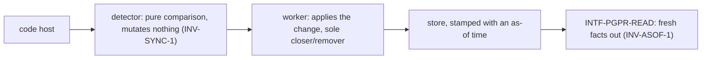
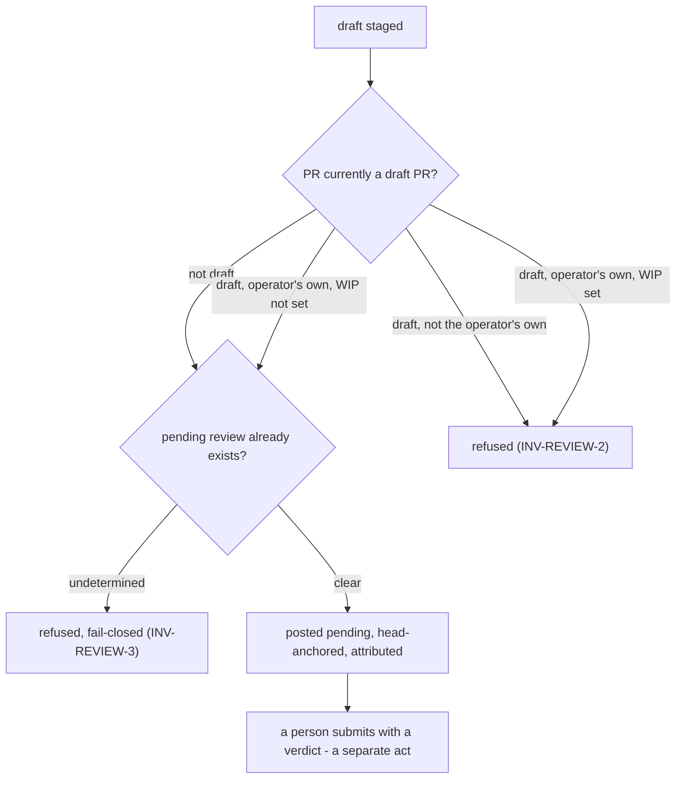

# Journeys — pg-pr

Stories, use cases, and journeys, typed and leveled per the behavior-docs method's vocabulary
rules: **user-goal** and **subfunction** level elements are `USECASE-`; **summary**-level
multi-actor arcs stay `JOURNEY-`. Each element carries, on its own definition, what it requires
and what it includes (`INV-22`).

## Stories

- **`STORY-PGPR-GLANCE`** <!-- uuid: 78f67804-45fe-475c-bc9c-8559a5054a26 --> — As an operator or
  a machine consumer, I want PR facts I can trust the freshness of, so I never act on stale
  information. _(→ `USECASE-PGPR-LIST`; `INV-READ-1`, `INV-ASOF-1`, `INV-ASOF-2`,
  `INV-APPROVAL-1`, `INV-APPROVAL-2`, `INV-APPROVAL-3`, `INV-APPROVAL-4`, `INV-APPROVAL-5`,
  `INV-GATE-1`, `INV-GATE-4`, `INV-DEP-1`, `INV-URG-1`, `INV-ORDER-1`.)_
- **`STORY-PGPR-REVIEW`** <!-- uuid: 23724212-5d46-416d-ba0e-e43644d1269c --> — As a reviewer
  (human or agent), I want to stage and post a review safely, so my feedback lands attributed and
  never stacks a duplicate. _(→ `USECASE-PGPR-REVIEW`; `INV-REVIEW-1`, `INV-ATTR-1`.)_
- **`STORY-PGPR-TRACK`** <!-- uuid: 4ad02fb3-84e6-45cf-ae24-80fdd5c666d8 --> — As a workflow
  consumer, I want every PR represented as exactly one tracking record, so downstream work never
  double-counts it. _(→ `USECASE-PGPR-CREATE`; `INV-MR-1`, `INV-SYNC-1`.)_

## Use cases

### `USECASE-PGPR-LIST` — list PRs, machine or human <!-- uuid: 8bbaaf81-34f5-4a6a-9706-d58573b53d60 -->

**Primary actor:** `ACTOR-PGPR-CONSUMER` (or `ACTOR-PGPR-OP`).
**Level:** user-goal.
**Preconditions:** none.
_Requires:_ `INV-READ-1`, `INV-ASOF-1`, `INV-ASOF-2`, `INV-APPROVAL-1`, `INV-APPROVAL-2`,
`INV-APPROVAL-3`, `INV-APPROVAL-4`, `INV-APPROVAL-5`, `INV-GATE-1`, `INV-GATE-4`, `INV-DEP-1`,
`INV-URG-1`, `INV-ORDER-1`.

1. The actor asks for the current PR listing, machine or human-facing.
2. pg-pr returns PR facts read from its store, in the one order it computes for that listing
   (`INV-ORDER-1`), each carrying its own freshness signal — including, per PR, each approver's
   verdict and its own staleness (`INV-APPROVAL-1`, `INV-APPROVAL-3`), the approval gate's own
   state, distinct from CI health and carrying the same freshness treatment as the facts beside
   it (`INV-GATE-1`, `INV-GATE-4`), and pg-pr's own **urgency heuristic** — a single opinionated
   score and level pg-pr computed once, never a per-deployment policy (`INV-URG-1`).
3. If the PR is a **stacked PR** waiting on another, the listing also carries its **PR
   dependency**: the **downstream PR** ranks lower than the **upstream PR** it is waiting on
   (`INV-DEP-1`), never suppressed from the listing.
4. When the listing is the team's PRs or the operator's own ("mine") PRs specifically, pg-pr
   additionally partitions the returned rows, within that same shared order, by whether there is
   something to act on: the team's rows into an immediately-actionable group and its exhaustive
   complement — everything currently blocked from action; the operator's own rows into three
   groups — immediately actionable, waiting only on someone else's approval, and in flight but
   not yet actionable by the operator — resolving a row whose facts would otherwise qualify for
   more than one group to the most actionable one.

Extensions:

- 1a. The actor asks for the listing machine-readable rather than for a person to read: pg-pr
  emits every selected row as a bare list, one element per row, never bundled inside one
  enclosing wrapper, each row still carrying the freshness signal from step 2. If the actor also
  asked to cap how many rows come back, the cap actually being reached is stated in the response
  itself, never a silently shortened list.
- 2a. A fact's as-of time is unusable: it is reported stale, and a consumer MUST NOT act on it
  (`INV-ASOF-1`).
- 3a. The downstream PR's upstream PR lies outside pg-pr's current retrieval set: the PR
  dependency is reported as a marker naming the unresolved ref, with no fetch made to pull that
  PR into the listing just to resolve it (`INV-DEP-1`).
- 3b. The downstream PR's upstream PR merges: the downstream PR becomes unblocked rather than
  re-pointing to the merged PR's own upstream, and carries no further ranking penalty (`INV-DEP-1`).

### `USECASE-PGPR-REVIEW` — stage and post a review <!-- uuid: 82931e8f-0b24-459b-9eea-408f72dbc44e -->

**Primary actor:** `ACTOR-PGPR-OP`.
**Level:** user-goal.
**Preconditions:** the target PR is not draft, or the PR is the reviewing operator's own and WIP
is not set on it.
_Requires:_ `INV-REVIEW-1`, `INV-REVIEW-2`, `INV-REVIEW-3`, `INV-WRITE-1`, `INV-ATTR-1`.

1. The reviewer stages review content for a PR.
2. pg-pr checks for an existing pending draft on that PR — fail-closed if undetermined
   (`INV-REVIEW-3`).
3. pg-pr posts the content pending, head-anchored and attributed, superseding any prior pending
   draft.
4. The operator later submits it with a verdict — a separate, explicit act.

Extensions:

- 1a. The PR is draft and either belongs to someone other than the reviewing operator, or is the
  operator's own with WIP set: the post is refused (`INV-REVIEW-2`).
- 2a. Whether a pending draft exists cannot be determined: the post is refused rather than risked
  (`INV-REVIEW-3`).

### `USECASE-PGPR-COMMENT` — add a comment <!-- uuid: c626b435-bd2a-4f5c-a8d9-6a74878cdb4c -->

**Primary actor:** `ACTOR-PGPR-OP`.
**Level:** user-goal.
**Preconditions:** none.
_Requires:_ `INV-WRITE-1`, `INV-ATTR-1`.

1. The actor asks to post a comment on a PR.
2. pg-pr posts it head-anchored and attributed.

### `USECASE-PGPR-CREATE` — create or update a PR with its tracking record <!-- uuid: e7b89d48-afe4-40ae-bd59-e627e4faa6e3 -->

**Primary actor:** `ACTOR-PGPR-OP`.
**Level:** user-goal.
**Preconditions:** none.
_Requires:_ `INV-MR-1`.
_Includes:_ `USECASE-PGPR-ENSURE-MR`.

1. The operator creates or updates a PR through pg-pr, supplying its title directly or having
   pg-pr generate one from the change (and, at creation, optionally generating the body the same
   way).
2. pg-pr ensures the PR's merge-request record exists, creating it if this is the first time.

Extensions:

- 1a. No explicit draft/ready state is requested: the PR opens as a draft. Promotion to ready is
  not part of this use case — it happens the next time `USECASE-PGPR-SYNC` runs and finds WIP
  false, CI green (configured check-interpreters excluded), no bot disapproval, and no merge
  conflict.

### `USECASE-PGPR-SYNC` — sync PR facts from the code host <!-- uuid: 17c96eaf-5307-44c0-bc4f-ed5de759269a -->

**Primary actor:** none — a scheduled or triggered background actor.
**Level:** user-goal.
**Preconditions:** none.
_Requires:_ `INV-SYNC-1`, `INV-SYNC-2`, `INV-GATE-1`, `INV-GATE-2`, `INV-GATE-3`.
_Includes:_ `USECASE-PGPR-ENSURE-MR`.

1. The detector compares the code host's current state — pg-pr's own PRs plus every not-mine PR
   currently carrying a qualifying reason (team-authored, review-requested, reviewed-by-me,
   assigned-to-me, or carrying a configured watch label) — against the store, mutating nothing.
   Among the facts compared is each PR's approval gate, classified into its own gate state and
   kept out of the CI-health comparison (`INV-GATE-1`); a signal that cannot be classified
   compares as `unknown`, never `satisfied` (`INV-GATE-2`).
2. For each detected change, a worker applies it — ensuring the affected PR's merge-request
   record — and is the sole authority that closes or removes a record.

Extensions:

- 1a. Completeness cannot be confirmed for some subset: that subset's prior known state is
  carried forward rather than treated as gone (`INV-SYNC-2`).
- 1b. A previously admitted not-mine PR no longer carries any qualifying reason: it drops out of
  the retrieved set on the next comparison — a pure recomputation, with no timer and no
  persisted "seen" state. This never closes or removes the PR's own merge-request record; that
  stays the worker's sole authority (step 2), driven only by the PR's real close or merge.
- 1c. A check or status no configured interpreter claims rolls up into CI health exactly as it
  would with no interpreter configured (`INV-GATE-3`).
- 1d. Triggered manually (on demand) rather than on the background schedule: step 1's comparison
  defaults to pg-pr's own PRs alone, deliberately narrower to keep an on-demand run cheap. The
  invoker MAY opt in to the full not-mine comparison for that one run, gaining the same
  not-mine coverage as a background run.

### `USECASE-PGPR-ENSURE-MR` — ensure a merge-request record exists <!-- uuid: 22bbc8c6-d744-420e-becb-61cb2bb5d568 -->

**Primary actor:** none — invoked by another use case.
**Level:** subfunction — included by `USECASE-PGPR-CREATE` and `USECASE-PGPR-SYNC`, which is what
makes it a subfunction rather than a goal of its own.
**Preconditions:** a PR identity `(repository, PR number)`.
_Requires:_ `INV-MR-1`.

1. If a record already exists for this PR identity, update it.
2. Otherwise create one. A closed record is never reopened by this step.

Extensions:

- 1a. The operator's create (`USECASE-PGPR-CREATE`) and a background sync
  (`USECASE-PGPR-SYNC`) — or two overlapping background syncs — invoke this subfunction for the
  SAME PR identity at the same time: at most one record still results, never two (`INV-MR-1`).

## Journeys

### `JOURNEY-PGPR-SYNC` — the sync arc <!-- uuid: e255790f-3ad5-4a0d-baf6-d1a6b63d3d4c -->

**Actors:** `ACTOR-PGPR-CODEHOST`, `ACTOR-PGPR-TRACKER`, `ACTOR-PGPR-CONSUMER`.
**Level:** summary.
**Intent:** tell the whole arc once — facts flow from the code host through a mutate-nothing
detector to a mutate-only worker, landing as fresh, actable facts for any consumer.
_Requires:_ `INV-SYNC-1`, `INV-SYNC-2`, `INV-ASOF-1`, `INV-ASOF-2`, `INV-MR-1`, `INV-GATE-1`,
`INV-GATE-4`.
_Includes:_ `USECASE-PGPR-SYNC`, `USECASE-PGPR-LIST`.

A pass that cannot confirm completeness for some subset carries that subset's prior state
forward — it never mass-closes on partial data (`INV-SYNC-2`). Among the facts landing fresh at
the end of the arc is the approval gate, tracked the whole way as its own axis rather than folded
into CI health (`INV-GATE-1`, `INV-GATE-4`).

### `JOURNEY-PGPR-WRITE` — the review write arc <!-- uuid: c1a8aef4-585d-44dc-bdf1-286bb213d110 -->

**Actors:** `ACTOR-PGPR-OP`, `ACTOR-PGPR-CODEHOST`.
**Level:** summary.
**Intent:** tell the whole arc once — a draft is staged, guarded by a self+WIP-aware draft-PR
check and a fail-closed pending check, posted attributed and head-anchored, and left pending for
a person to submit.
_Requires:_ `INV-REVIEW-1`, `INV-REVIEW-2`, `INV-REVIEW-3`, `INV-ATTR-1`, `INV-WRITE-1`.
_Includes:_ `USECASE-PGPR-REVIEW`.

## Open questions

Each states the gap, its owner, a resolution path, and where it blocks.

- **`OQ-PGPR-VERDICT-DRIVES-POST`** <!-- uuid: ce5a8397-f2c3-4856-b94d-18391e6e4dc5 --> — whether
  the staged review **verdict** (`approve`/`request-changes`/`comment`) should eventually drive the
  posted review state, or stay advisory permanently. _Gap_: pg-pr computes a staged verdict but
  posts every review as `PENDING` with no approve/request-changes event; the verdict rides only as
  advisory provenance on the `Result` sidecar. Whether the staged verdict should ever drive the
  posted state is undecided. _Owner_: pg-pr. _Path_: decide when review-posting semantics
  (`INTF-PGPR-WRITE`) are next revisited; either answer changes interface-level behavior.
  _Blocks_: nothing today — the advisory default is safe.
- **`OQ-PGPR-COMMENTER-BUCKET`** <!-- uuid: 33f46397-3a7c-4530-8758-cc42a3227ff9 --> — whether a
  PR I have only commented on (never submitted a review, never requested, assigned, or
  team-authored) should itself become a qualifying reason for retrieval. _Gap_: no
  interacted-with bucket exists; the shipped default is the fallback — a comment bumps a PR
  already in the retrieved set (it already carries some other qualifying reason) but does not
  admit a PR on its own, so a PR I have solely commented on reaches neither the retrieved set nor
  the reviewer's dashboard. Whether the code host's commenter-style query would match the
  intended "interacted with" set, and what the real result-set size and rate cost would be, is
  undetermined without measuring it live. _Owner_: pg-pr. _Path_: run a live measurement pass
  against the code host's commenter-style query to determine match quality and result-set
  size/rate cost, then decide whether to add the bucket. _Blocks_: nothing today — the fallback
  (bump only already-retrieved PRs) is safe.
