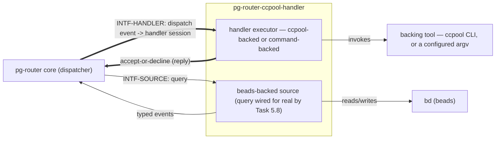

# pg-router-ccpool-handler — behavior docs

`pg-router-ccpool-handler` is `packages/pg-router`'s **downstream deployment set** for the
ccpool-backed and command-backed participant kinds: it is an **implementer** of
`INTF-HANDLER`/`INTF-SOURCE` as those interfaces are defined by pg-router's own behavior docs
(`phillipgreenii-nix-agent-support · packages/pg-router/docs/behavior`), the same way that set's own
README's `## Scope` names "concrete participant
implementations ... and any deployment-specific behavior" as content that "live[s] in a downstream
deployment set that implements these interfaces" and excludes from its own extent. This set follows
the behavior-docs method (`phillipgreenii-nix-agent-support · behavior-docs/docs/behavior`).

Start here, then the [glossary](glossary.md); the rules are in [invariants](invariants.md), the
boundaries in [interfaces](interfaces.md), the actors in [actors](actors.md), and the stories,
journeys, and open questions in [journeys](journeys.md).

## The model

This module sits **on the participant side** of both interfaces the diagram crosses: pg-router's
core knows only the interface, and this module is one concrete implementer standing behind it —
`INTF-HANDLER`'s `ACTOR-HDL` and `INTF-SOURCE`'s `ACTOR-SRC`
(`packages/pg-router/docs/behavior/interfaces.md`). Nothing on the core side of that line is
restated here; this set cites it rather than duplicating it (`INV-18`-style inter-set
consistency).

## Scope (extent + floor)

- **Extent (in)** — realized by Task 5.2/5.3 (folded together, docket pg2-oju6w) onward: the ccpool-backed handler session lifecycle
  and the command-backed handler session lifecycle, both realizing `INTF-HANDLER`'s
  dispatch/accept-or-decline/deferred-ack contract; watchdog and budget policy that gate a handler
  session; prompt templating that shapes what a handler session is asked to do; the beads-backed
  event source realizing `INTF-SOURCE`'s query-reply contract; the pg-pr ACL a handler session
  consults. This is exactly the "concrete participant behavior" `phillipgreenii-nix-agent-support`
  ADR 0065's "New module" decision names as belonging here rather than in
  `packages/pg-router/docs/behavior`.
- **Extent (out)** — pg-router's own generic dispatch, queue, and wiring-validation behavior, which
  stays owned by `packages/pg-router/docs/behavior` and is cited here, never restated;
  deployment-specific configuration, credentials, and any organization-specific wiring, which live
  further downstream in whatever deployment set assembles pg-router and this module together for a
  real installation — mirroring `packages/pg-router/docs/behavior/README.md`'s own "Extent (out)"
  pattern, applied one layer down.
- **Floor** — this set speaks in handler sessions, dispatch, accept/decline, deferred acks,
  self-status, and source queries/events — never in package names, executor source paths, ccpool
  CLI flags, or deployment secrets.

## Realization gaps

This set's realization-gap register (`INV-23`): intended behavior this set's implementation has
not built yet, one row per gap, keyed by the element id the gap is against. Not an open
question — the intent below is settled and the build has not caught up (`INV-15`).

| Element        | Intended                                                                                   | Where the implementation stands                                                                                                                                                                                                                                                | Tracked by    |
| -------------- | ------------------------------------------------------------------------------------------ | ------------------------------------------------------------------------------------------------------------------------------------------------------------------------------------------------------------------------------------------------------------------------------ | ------------- |
| `INTF-HANDLER` | this module realizes `INTF-HANDLER` for the ccpool-backed and command-backed handler kinds | realized: `cmd/pg-router-ccpool-handler`'s `dispatch` subcommand runs the moved ccpool/command executor logic and replies inline; a truly long-running ccpool session correctly holding the call open for its duration (rather than a daemonized deferred reply) is left as-is | `pg2-oju6w.4` |

## External references

This set follows the behavior-docs method and cites elements the method and pg-router's own set
define, so a cross-set reference resolves by the owner's stable UUID, not the mutable name.

| Name             | What it is                                                                                                                                   | Owner set-path                                                         | Owner UUID                                                                                                                                           |
| ---------------- | -------------------------------------------------------------------------------------------------------------------------------------------- | ---------------------------------------------------------------------- | ---------------------------------------------------------------------------------------------------------------------------------------------------- |
| `INTF-SOURCE`    | typed events into the core, over the one opaque source contract                                                                              | `phillipgreenii-nix-agent-support · packages/pg-router/docs/behavior`  | [fe42416a-5f10-4db1-b8c3-46b1609213c7](https://github.com/phillipgreenii/nix-agent-support/blob/main/packages/pg-router/docs/behavior/interfaces.md) |
| `INTF-HANDLER`   | dispatch to a handler and its accept-or-decline/deferred-ack reply                                                                           | `phillipgreenii-nix-agent-support · packages/pg-router/docs/behavior`  | [10939663-7a48-4d44-8c4a-9a2df8ae4654](https://github.com/phillipgreenii/nix-agent-support/blob/main/packages/pg-router/docs/behavior/interfaces.md) |
| `INV-23`         | the realization-gap register is set-level, named `## Realization gaps`, never an element                                                     | `phillipgreenii-nix-agent-support · behavior-docs/docs/behavior`       | [f3bba3e7-440f-4109-a4de-9d37daa34bcf](https://github.com/phillipgreenii/nix-agent-support/blob/main/behavior-docs/docs/behavior/invariants.md)      |
| `INV-15`         | the behavior docs set is the source of truth; a realization gap is normal, not a defect                                                      | `phillipgreenii-nix-agent-support · behavior-docs/docs/behavior`       | [375b542f-2a9f-4cfd-a77e-7aed45a416d5](https://github.com/phillipgreenii/nix-agent-support/blob/main/behavior-docs/docs/behavior/invariants.md)      |
| `INV-18`         | inter-consistency at every interface, reconciled by the counterparty's kind                                                                  | `phillipgreenii-nix-agent-support · behavior-docs/docs/behavior`       | [4c6a764b-02f5-4c85-afae-a082fe6c21cd](https://github.com/phillipgreenii/nix-agent-support/blob/main/behavior-docs/docs/behavior/invariants.md)      |
| `INV-22`         | traceability is a per-element listing obligation, not a coverage section                                                                     | `phillipgreenii-nix-agent-support · behavior-docs/docs/behavior`       | [b2502527-1340-4a1f-858c-aaa80c601317](https://github.com/phillipgreenii/nix-agent-support/blob/main/behavior-docs/docs/behavior/invariants.md)      |
| `ACTOR-HDL`      | event handler — responds to bound events as handler sessions, replying with its outcome                                                      | `phillipgreenii-nix-agent-support · packages/pg-router/docs/behavior`  | [a5997046-d20a-445d-bf10-328855b03810](https://github.com/phillipgreenii/nix-agent-support/blob/main/packages/pg-router/docs/behavior/actors.md)     |
| `ACTOR-SRC`      | event source — emits typed events (pull or push)                                                                                             | `phillipgreenii-nix-agent-support · packages/pg-router/docs/behavior`  | [39e28ce5-ef60-47bb-8aa7-2d93d267447f](https://github.com/phillipgreenii/nix-agent-support/blob/main/packages/pg-router/docs/behavior/actors.md)     |
| `INTF-CLI`       | operator commands (and the manager callbacks)                                                                                                | `phillipgreenii-nix-agent-support · packages/pg-router/docs/behavior`  | [746dd5a6-34c4-4294-b727-e442c2afa723](https://github.com/phillipgreenii/nix-agent-support/blob/main/packages/pg-router/docs/behavior/interfaces.md) |
| `GOAL-MIN-1`     | keep the core minimal: anything source/handler/monitor/deployment-specific lives behind an interface, never in the core                      | `phillipgreenii-nix-agent-support · packages/pg-router/docs/behavior`  | [e0be6f1c-8eb9-4d7e-9900-bc14e7a38d4a](https://github.com/phillipgreenii/nix-agent-support/blob/main/packages/pg-router/docs/behavior/invariants.md) |
| `INV-CONC-1`     | capacity is handler-enforced and declared nowhere, never a core-tracked number                                                               | `phillipgreenii-nix-agent-support · packages/pg-router/docs/behavior`  | [20c84e0f-8ffb-428c-9acc-dcaabb4fdf1b](https://github.com/phillipgreenii/nix-agent-support/blob/main/packages/pg-router/docs/behavior/invariants.md) |
| `INV-EVT-2`      | a handler MUST tolerate a duplicate event (be idempotent)                                                                                    | `phillipgreenii-nix-agent-support · packages/pg-router/docs/behavior`  | [06649d39-2734-409a-8098-f3c2cef44cbe](https://github.com/phillipgreenii/nix-agent-support/blob/main/packages/pg-router/docs/behavior/invariants.md) |
| `INV-EVT-3`      | the core de-duplicates by event `id` across the retained id set                                                                              | `phillipgreenii-nix-agent-support · packages/pg-router/docs/behavior`  | [d54ad229-ed48-4862-aa27-bc2181b4d6c4](https://github.com/phillipgreenii/nix-agent-support/blob/main/packages/pg-router/docs/behavior/invariants.md) |
| `INV-INTF-2`     | every interface is accompanied by a conformance suite an implementer verifies against before the core is trusted to route through it         | `phillipgreenii-nix-agent-support · packages/pg-router/docs/behavior`  | [26f9be4d-8481-4a44-9f1a-d79a92c0016a](https://github.com/phillipgreenii/nix-agent-support/blob/main/packages/pg-router/docs/behavior/invariants.md) |
| `INV-WORKFLOW-1` | the wiring (a routing graph) ties sources → event types → handlers; the core validates it but is a flat edge-router, never a workflow engine | `phillipgreenii-nix-agent-support · packages/pg-router/docs/behavior`  | [66dfe98d-a564-4414-a3db-77b518d27f31](https://github.com/phillipgreenii/nix-agent-support/blob/main/packages/pg-router/docs/behavior/invariants.md) |
| `INV-FRESH-1`    | don't act on stale truth — a readiness signal derived from data past its bound MUST NOT be presented as current                              | `your-private-flake · modules/zm/pg-router/docs/behavior`              | [ceac8879-4bfd-45c7-94ed-9d8c3bd11c38](https://github.com/your-org/your-private-flake/blob/main/modules/zm/pg-router/docs/behavior/invariants.md)    |
| `DEC-WIRE-1`     | the default transport is a CLI invocation carrying JSON, with coarse exit codes                                                              | `phillipgreenii-nix-agent-support · packages/pg-router/docs/decisions` | [6450eed7-228f-4a99-bfd9-6705a6c552ee](https://github.com/phillipgreenii/nix-agent-support/blob/main/packages/pg-router/docs/decisions/wire.md)      |
| `DEC-WIRE-2`     | the core is reached over a socket, and a callback command arrives with its address and token already baked in                                | `phillipgreenii-nix-agent-support · packages/pg-router/docs/decisions` | [70fea0a8-45f7-45cb-9f4a-915e27765663](https://github.com/phillipgreenii/nix-agent-support/blob/main/packages/pg-router/docs/decisions/wire.md)      |
