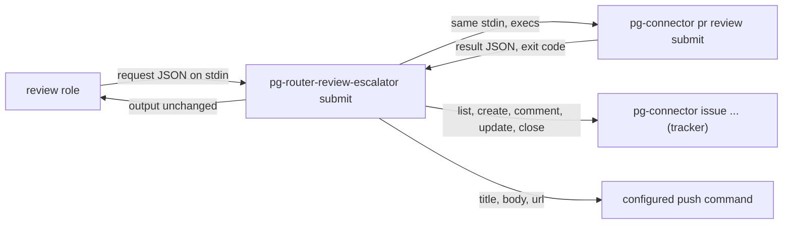
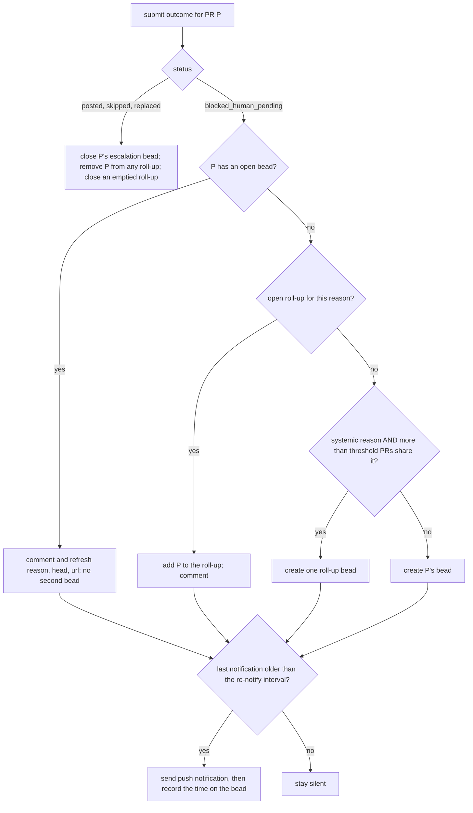

# pg-router-review-escalator — behavior

> **RETIRING (bead `pg2-8qui6`, operator rulings 2026-10-05 and 2026-10-06).** `review submit` no
> longer deletes or replaces a pending review, so `blocked_human_pending` is retired and there is
> nothing left to escalate. This package is removed once the create-or-append tool and the review
> prompt have shipped (design `docs/superpowers/specs/2026-10-06-pending-review-reuse-design.md`,
> section "Rollout"). Until then it MUST tolerate the new statuses `append` and `no_change`,
> treating each like `posted` (both in outcome parsing and in the status switch that resolves an
> open escalation), so the tool can ship first without failing every review. The text
> below describes the deployed behavior.

`pg-router-review-escalator` is the escalation path for unremovable pending reviews (bead
`pg2-kftf9.15`, pending-review policy 5). When `pg-connector pr review submit` cannot remove a stale
pending review it reports `status: blocked_human_pending` and exits 0 (the status contract of bead
`pg2-kftf9.13`, `INV-EXIT-1`). Nothing in that verb tells a person. This binary is the deliberate
code path that does: one deduplicated bead per PR plus a push notification, closed again when the PR's
review next resolves.

It is a small, standalone, stdlib-only Go binary and an ordinary pg-router integration: pg-router
core, pg-desk, pg-connector and pg-pr are not changed (the host decision, and why it is not a
pg-decider rule, is recorded in ADR 0077's Deciders consequences). It keeps no state of its own; the
open escalation bead carries everything it needs.

This is a plain statement of the binary's own behavior, not a full application of the
`behavior-docs` method (it has no separate actors, journeys or interfaces registers).

## What it does

- **`submit [flags] <pr-id>`** is what the review role calls INSTEAD of
  `pg-connector pr review submit <pr-id>`. It runs that verb with the same stdin, prints the verb's
  stdout and stderr unchanged, passes through the verb's exit code when it is non-zero (`4` stays
  `4`, anything else becomes `1`, and nothing is escalated because a failed submit has no outcome),
  and otherwise applies the outcome below.
  `--from-file <path>` reads the request from that file instead of stdin (the two are not combined),
  for a caller that cannot pipe or redirect, such as a session under a restrictive permission mode,
  or a handler submitting a request an agent wrote to disk (bead `pg2-hh32y`).
- **`report [flags] <pr-id>`** reads a submit output on stdin (the wire envelope `{"result": ...}`
  or the bare result object) and applies it. It exists for replay and for a caller that ran the verb
  itself.

The wrapper, not the role's prompt, is the deliberate code path: the escalation cannot be forgotten
by a worker that follows the prompt, because the worker never gets the status without passing
through it. A caller that runs `pg-connector pr review submit` directly raises no escalation.

## Outcome handling

1. On `blocked_human_pending` the binary MUST raise exactly ONE open escalation per PR, keyed by the
   stable per-PR key `pr:<pr-id>` in the bead metadata (`review_escalation_key`).
2. The bead MUST carry the labels `human` and `human-focus-required` and the lookup label
   (`pending-review-escalation` by default), plus any `--label` the deployment supplies. Its
   description MUST name the PR, the pending review URL (or say the lookup failed), the reason and the
   head involved, and say how to resolve it.
3. A repeat `blocked_human_pending` for a PR that has an open bead MUST add a comment and refresh the
   bead's reason, head and URL, and MUST NOT create a second bead.
4. The push notification MUST be sent on the first escalation and MUST NOT be repeated for the same
   PR (or roll-up) sooner than the re-notify interval. The time is recorded on the bead only AFTER a
   delivered notification, so a failed send is retried on the next block.
5. `posted`, `skipped` and `replaced` for a PR MUST close that PR's escalation bead, with a reason
   naming the status. A PR that has no escalation is a no-op.
6. When MORE than the roll-up threshold PRs are blocked for the same systemic reason
   (`detection_failed`, `delete_refused`, `archive_failed` by default), one roll-up bead (key
   `rollup:<reason>`) MUST be raised instead of a further per-PR bead, and later PRs with that reason
   join it. `human_edited` is genuinely per-PR and never rolls up. A PR leaves a roll-up when it
   resolves or is blocked for a different reason, and the roll-up closes when no PR is left. PRs that
   already had their own bead before the threshold was crossed keep it.
7. The bead path and the notification path are independent and BOTH are always attempted. Any failure
   MUST be surfaced: one stderr line per failure, prefixed `ESCALATION FAILED`, and exit `3`. A
   failure is never swallowed. If the tracker cannot even be listed, dedupe is impossible, but the
   notification is still sent so the operator hears of the stuck review.
8. A submit output with an error envelope, no status, an unknown status, or a `blocked_human_pending`
   without a reason is NOT an outcome: it exits `1`, and the submit output is still forwarded.
9. A submit that FAILED because a process in the connector's chain was killed by a signal (exit
   non-zero and the text `signal: killed` on its stdout or stderr, for example the connector's
   `scriptout: pg-connector-pr-github: signal: killed`) MUST be re-run, with the same request, up
   to `--submit-retries` more times (default 2) with `--submit-retry-delay` between attempts
   (default `5s`), and only the FINAL attempt's output and exit code are forwarded. Nothing else is
   retried: not a non-zero exit without that text, not exit `4`, not a start failure or a timeout
   of the attempt itself, and never an exit `0`. The re-run sends an identical request, so the
   verb's own head and pending-review checks decide its outcome. Not verified live: whether a kill
   can strike the deployed replace verb between its delete and its create; the pending-review reuse
   design (append) removes that window. Bead `pg2-hh32y`: a finished review was lost when two
   submits in a row were killed and the role gave up.

Consumer of the bead metadata (bead `pg2-vhs3e`): the `pg-router-source-pg-connector list`
escalation filter that read `review_escalation_key`, `review_escalation_head` and
`review_escalation_prs` has been removed (bead `pg2-d25eu.11`), so the adapter no longer reads
these keys.

## Configuration

Everything deployment-specific is a flag. This public repo names no push channel, tracker or
organization.

| Flag                   | Default                                                | Meaning                                                                                                    |
| ---------------------- | ------------------------------------------------------ | ---------------------------------------------------------------------------------------------------------- |
| `--renotify-interval`  | `12h`                                                  | Minimum time between push notifications for one PR or roll-up. The first notification is immediate.        |
| `--rollup-threshold`   | `3`                                                    | More than this many PRs blocked for one systemic reason roll up into one bead. A negative value disables.  |
| `--systemic-reason`    | `detection_failed`, `delete_refused`, `archive_failed` | Reasons that can roll up; repeatable. Giving any replaces the defaults.                                    |
| `--notify-arg`         | none (required for any `blocked_human_pending`)        | One element of the push command's argv; repeatable. `{title}`, `{body}`, `{url}`, `{key}` are substituted. |
| `--label`              | none                                                   | Extra label on every created bead (for example a repo label the tracker requires); repeatable.             |
| `--priority`           | tracker default                                        | Priority of created beads, in the tracker's own form.                                                      |
| `--tracker-backend`    | `pg-connector-issue-beads`                             | The pg-connector issue backend every tracker call is pinned to.                                            |
| `--list-query`         | `pending-review-escalations`                           | Named pg-connector query listing every OPEN escalation bead.                                               |
| `--submit-backend`     | none                                                   | Pins the `pr review submit` call to one backend (`submit` only).                                           |
| `--pg-connector-path`  | `pg-connector`                                         | The pg-connector binary.                                                                                   |
| `--exec-timeout`       | `30s`                                                  | Timeout of each tracker and notify call.                                                                   |
| `--submit-timeout`     | `2m`                                                   | Timeout of each `pr review submit` attempt.                                                                |
| `--from-file`          | none (stdin)                                           | `submit` only: read the request JSON from this file instead of stdin.                                      |
| `--submit-retries`     | `2`                                                    | `submit` only: extra attempts after a submit killed by a signal; `0` disables.                             |
| `--submit-retry-delay` | `5s`                                                   | `submit` only: wait between attempts.                                                                      |

Deployment requirements:

- The issue backend's queries MUST define the `--list-query` name as a list of EVERY non-closed
  escalation bead (open, in progress, blocked and deferred, human-labeled ones included), for example
  `pending-review-escalations = "list --label pending-review-escalation --status open,in_progress,blocked,deferred"`.
  A ready-queue view would drop a bead the moment a person claims it, and the escalation would be
  duplicated. A degraded (exit 2) answer to the list is treated as a failure for the same reason.
- The tracker the beads land in is chosen by the environment this binary inherits (the issue
  backend's own targeting variable), never by a flag here.
- The push command receives the notification text only as argv elements and as the environment
  variables `ESCALATION_TITLE`, `ESCALATION_BODY`, `ESCALATION_URL` and `ESCALATION_KEY`; it MUST NOT
  be handed to a shell as interpolated script text. A shell wrapper SHOULD read the environment.

## Exit codes

| Code | Meaning                                                                                                             |
| ---- | ------------------------------------------------------------------------------------------------------------------- |
| `0`  | The outcome was applied (or needed nothing).                                                                        |
| `1`  | Unexpected: a submit output that is not an outcome, an unstartable process, or pg-connector's own exit 1 passed on. |
| `2`  | Usage error.                                                                                                        |
| `3`  | An escalation could not be delivered (the bead, the notification, or both); see the `ESCALATION FAILED` log lines.  |
| `4`  | `submit` only: pg-connector answered `not_found`, passed through.                                                   |

## Known limits

- Two concurrent blocked outcomes for the SAME PR could each create a bead, because the tracker offers
  no atomic create-if-absent. The review role runs one submit per PR at a time and a blocked bead is
  released once, so this is accepted. A duplicate is visible, not silent, and a resolve closes every
  per-PR bead for the PR.
- A person who deletes or submits the pending review in the web UI does not close the bead by that
  act alone; it closes on the next `posted`, `skipped` or `replaced` for the PR, or when the person
  closes it.
- A PR id MUST NOT contain `;` or a newline (roll-up beads store their PRs as a `;`-joined list).
