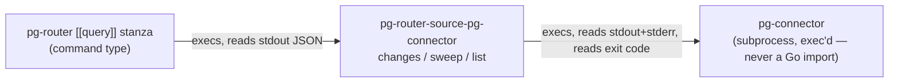

# pg-router-source-pg-connector — behavior docs

`pg-router-source-pg-connector` is a small, standalone Go binary with three subcommands
(`changes`, `sweep`, `list`) that lets a pg-router `[[query]]` command-type stanza consume
pg-connector without a shell/jq pipeline. It knows exactly two contracts — pg-connector's
`changes`/`list` wire envelopes, and pg-router's command-query rawItem array shape — and holds
NO state of its own: every fact it reports lives in pg-connector's own delta ledger (a sibling
component in this docket), never in a file this binary writes itself.

This document is a plain statement of this adapter's own behavior, not a full application of the
repo's `behavior-docs` method (no separate actors/journeys/interfaces registers): the adapter has
no interface surface of its own beyond the two wire contracts already owned and documented
elsewhere (pg-connector's own `docs/behavior/interfaces.md`, pg-router's own
`internal/query/command.go` rawItem shape) — it is a pure translation layer between them.

## What it does

- **`changes <type> <query> --consumer <id> [--beads-dir <path>]`** — runs
  `pg-connector <type> changes --query <query> --consumer <id> --output json`, and reprints its
  response as one rawItem per reported change. Every printed item's `metadata.degraded_sources`
  names every backend that answered degraded on that ONE invocation (the same list on every item,
  never a per-entity fact).
- **`sweep <type> <query>... [--beads-dir <path>]`** — runs
  `pg-connector <type> list --query <query> --ids-only --output json` once per named query
  (one or more), unions the matched ids by reading each response's top-level `present_ids` array
  (never `entities`, which is always empty for `--ids-only`), and prints one rawItem per unioned
  id with `title` equal to the id and `metadata` exactly `{"change": "sweep"}`. It never runs a
  second, full fetch to backfill title/other fields — its purpose is a cheap reconciliation
  signal by id, not a content refresh.
- **`list <type> <query> --backend <binary> [--beads-dir <path>] [--title-prefix 
] [--issue-type <t>]`**
  — runs `pg-connector <type> list --query <query> --backend <binary> --output json` (a full,
  non-`--ids-only` fetch), applies the two post-filters (case-sensitive exact title prefix; exact
  issue-type equality; ANDed when both given), and prints one rawItem per surviving entity, with
  `metadata` copied from the entity's own metadata map as-is.

## Exit codes

This binary's own exit-code scheme is deliberately just two values, never pg-connector's own
0/1/2/3/4 taxonomy re-emitted as its own:

| pg-connector's own CLI exit                     | This adapter's own exit | What happens                                                                                                                          |
| ----------------------------------------------- | ----------------------- | ------------------------------------------------------------------------------------------------------------------------------------- |
| 0 (complete) or 2 (degraded)                    | 0                       | stdout JSON parsed; rawItems printed (degraded backends named in the items)                                                           |
| 1 (invalid_argument/other) or 3 (total failure) | 1                       | nothing printed on this adapter's own stdout; pg-connector's own captured stderr is copied to this adapter's own stderr for diagnosis |

`sweep`'s own "zero query names given" case never reaches a pg-connector subprocess at all — it
is classified directly as the same non-zero exit, with this adapter's own usage message on
stderr.

## Telemetry (D24)

This binary emits **no OpenTelemetry or Prometheus telemetry of any kind**. It has no metrics
exporter, no tracer, and no persistent process — every invocation is a single one-shot CLI call
that execs pg-connector once (or, for `sweep`, once per named query) and exits.

Logging is stderr-only, and only on a failure path: on a total-failure or invalid_argument
outcome from pg-connector, this adapter copies pg-connector's own captured stderr bytes verbatim
to its own stderr; on a purely local usage error (e.g. `sweep` given zero query names, or a
malformed JSON response this adapter could not decode), it writes its own one-line diagnostic to
stderr instead. On success it writes nothing to stderr at all — the printed rawItem array on
stdout is the only output.

## Out of scope

- The delta-ledger engine and the `changes`/`ledger show`/`ledger clear` CLI verbs this adapter's
  own `changes`/`sweep` calls consume — owned by pg-connector itself (this docket's sibling
  packets).
- The GitHub fingerprint cursor and the three ZR `[[query]]` stanza rewrites that actually invoke
  this adapter — this docket's sibling packets.
